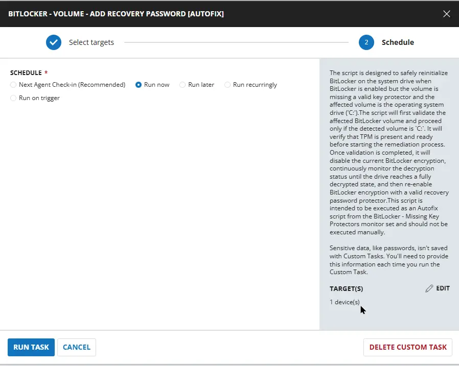
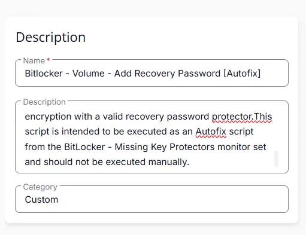
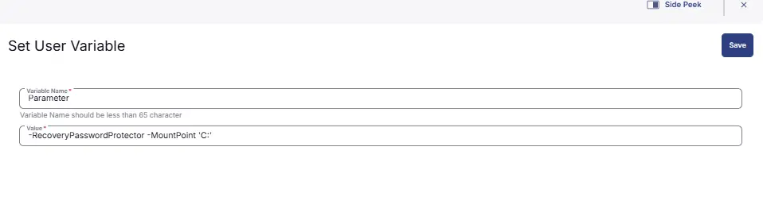
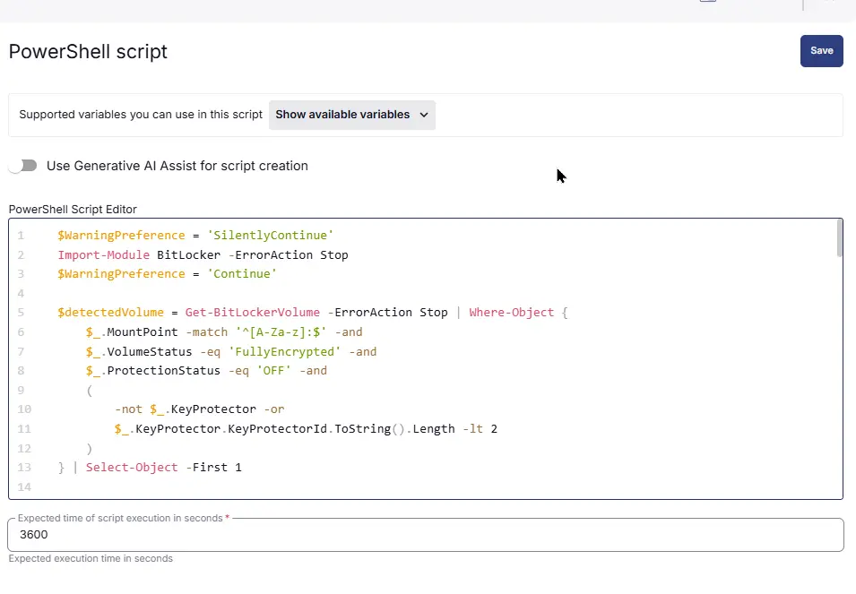
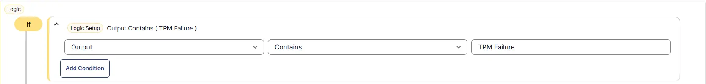
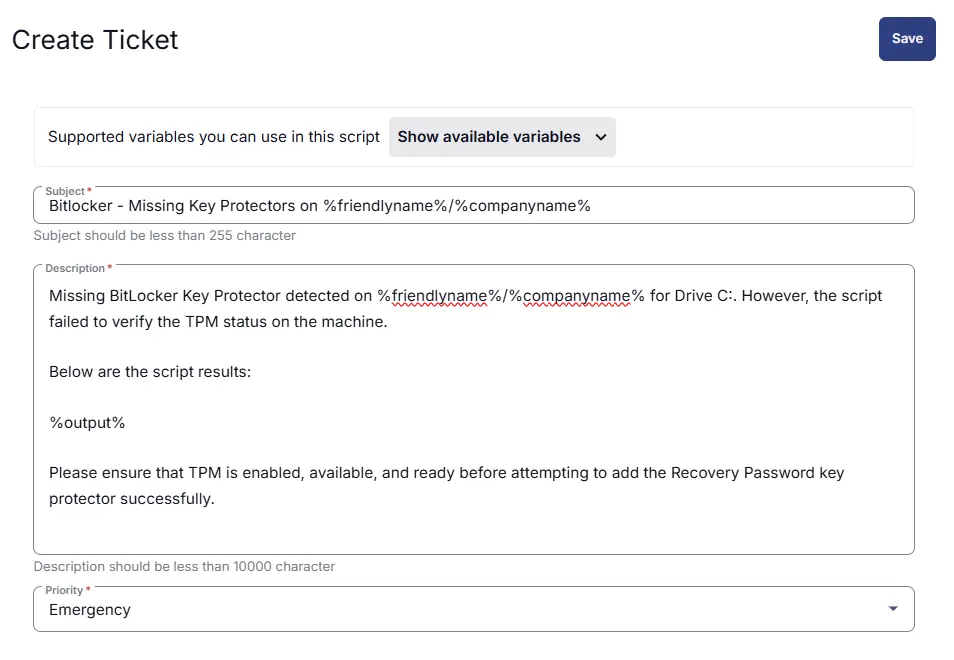
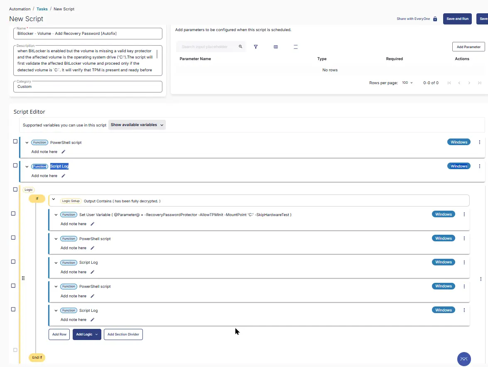

## Summary
The script is designed to safely reinitialize BitLocker on the system drive when BitLocker is enabled but the volume is missing a valid key protector and the affected volume is the operating system drive (`C:`).

The script will first validate the affected BitLocker volume and proceed only if the detected volume is `C:`. It will verify that TPM is present and ready before starting the remediation process. Once validation is completed, it will disable the current BitLocker encryption, continuously monitor the decryption status until the drive reaches a fully decrypted state, and then re-enable BitLocker encryption with a valid recovery password protector.
;  

> **Note** This script is intended to be executed as an Autofix script from the [Monitor : BitLocker - Missing Key Protectors](/docs/c921a900-73da-40e2-9507-ed64ba38fb46).

## Sample Run



## Dependencies

- [Monitor: BitLocker - Missing Key Protectors](/docs/c921a900-73da-40e2-9507-ed64ba38fb46)
- [Solution: BitLocker Status and Recovery Key Audit](/docs/b2a974b2-c231-4197-a639-d0775d77d7c7)
- [Agnostic: Initialize-BitLockerVolume](/docs/2ce835a2-3ac1-4291-baaf-8d3cac76869f)

## Task Creation

### Script Details

#### Step 1

Navigate to `Automation` ➞ `Tasks`  


#### Step 2

Create a new `Script Editor` style task by choosing the `Script Editor` option from the `Add` dropdown menu  


The `New Script` page will appear on clicking the `Script Editor` button:  


#### Step 3

Fill in the following details in the `Description` section:  

- **Name:** `BitLocker - Volume - Add Recovery Password [Autofix]`  
- **Description:** `The script is designed to safely reinitialize BitLocker on the system drive when BitLocker is enabled but the volume is missing a valid key protector and the affected volume is the operating system drive ('C:').The script will first validate the affected BitLocker volume and proceed only if the detected volume is `C:`. It will verify that TPM is present and ready before starting the remediation process. Once validation is completed, it will disable the current BitLocker encryption, continuously monitor the decryption status until the drive reaches a fully decrypted state, and then re-enable BitLocker encryption with a valid recovery password protector.This script is intended to be executed as an Autofix script from the BitLocker - Missing Key Protectors monitor set and should not be executed manually.` 
- **Category:** `Custom`



### Script Editor

Click the `Add Row` button in the `Script Editor` section to start creating the script  


A blank function will appear:  


#### Row 1 Function: Set User Variable

Enter the `Parameter` in the Variable Name box and provide the Value as `-RecoveryPasswordProtector -MountPoint 'C:'`. Enable `Continue on Failure`

 


### Row 2 Function: PowerShell Script

Search and select the `PowerShell Script` function.  
 
  

The following function will pop up on the screen:  
  

Paste in the following PowerShell script and set the `Expected time of script execution in seconds` to `3600` seconds and enable `Continue on Failure`. Click the `Save` button.

```powershell
$WarningPreference = 'SilentlyContinue'
Import-Module BitLocker -ErrorAction Stop
$WarningPreference = 'Continue'

$detectedVolume = Get-BitLockerVolume -ErrorAction Stop | Where-Object {
    $_.MountPoint -match '^[A-Za-z]:$' -and
    $_.VolumeStatus -eq 'FullyEncrypted' -and
    $_.ProtectionStatus -eq 'OFF' -and
    (
        -not $_.KeyProtector -or
        $_.KeyProtector.KeyProtectorId.ToString().Length -lt 2
    )
} | Select-Object -First 1

if (-not $detectedVolume) {
    return 'No affected BitLocker volumes found.'
}

$mountPoint = $detectedVolume.MountPoint

if ($mountPoint -ne 'C:') {
    return 'Affected BitLocker volume detected on $mountPoint. Decryption will not proceed because only C: drive is supported.'
}

# Check TPM Status
$tpm = Get-Tpm -ErrorAction SilentlyContinue

if (-not $tpm) {
    return 'TPM Failure : Unable to detect TPM status on the machine.'
}

if (-not $tpm.TpmPresent -or -not $tpm.TpmReady) {
    return 'TPM Failure : Unable to detect TPM status on the machine.'
}

Write-Output 'TPM is enabled and ready. Proceeding with Bitlocker Decryption.'

Write-Output 'Starting BitLocker decryption on $mountPoint...'

Disable-BitLocker -MountPoint $mountPoint -Confirm:$false -ErrorAction Stop

$Timespent = 0

while ($Timespent -lt '1800') {
    $targetBitlockerVolume = Get-BitLockerVolume -MountPoint $mountPoint -ErrorAction Stop
    if ($targetBitlockerVolume.VolumeStatus -eq 'FullyDecrypted') {
        Write-Output 'Drive $mountPoint has been fully decrypted.'
        break
    }
    Start-Sleep -Seconds 60
    $Timespent += 60

    Write-Output 'Drive $mountPoint is still decrypting. Current status: $($targetBitlockerVolume.VolumeStatus)'
}


$targetBitlockerVolume = Get-BitLockerVolume -MountPoint $mountPoint -ErrorAction Stop
if ($targetBitlockerVolume.VolumeStatus -ne 'FullyDecrypted') {
    return 'Failure : Failed to decrypt drive $mountPoint.'
}

#region Setup - Variables
$ProjectName = 'Initialize-BitLockerVolume'
[Net.ServicePointManager]::SecurityProtocol = [enum]::ToObject([Net.SecurityProtocolType], 3072)
$BaseURL = 'https://contentrepo.net/repo'
$PS1URL = "$BaseURL/script/$ProjectName.ps1"
$WorkingDirectory = "C:\ProgramData\_automation\script\$ProjectName"
$PS1Path = "$WorkingDirectory\$ProjectName.ps1"
$WorkingPath = $WorkingDirectory
#endregion

#region Setup - Folder Structure
mkdir -Path $WorkingDirectory -ErrorAction SilentlyContinue | Out-Null
try {
    Invoke-WebRequest -Uri $PS1URL -OutFile $PS1path -UseBasicParsing -ErrorAction Stop
} catch {
    if (!(Test-Path -Path $PS1Path )) {
        return ('Failed to download the script from ''{0}'', and no local copy of the script exists on the machine. Reason: {1}' -f $PS1URL, $($Error[0].Exception.Message))
    }
}
#endregion

#region Execution
& $PS1Path @Parameter@
#endregion

$logFilePath = 'C:\ProgramData\_automation\script\Initialize-BitLockerVolume\Initialize-BitLockerVolume-log.txt'
$errorFilePath = 'C:\ProgramData\_automation\script\Initialize-BitLockerVolume\Initialize-BitLockerVolume-error.txt'
if (Test-Path $logFilePath) {
    if (Test-Path $errorFilePath) {
        return 'Failed to Re-Enable BitLocker on the machine.'
    }
    else {
        return 'BitLocker enabled successfully on the machine.'
    }
}
else {
    return 'Failed to re-enable BitLocker on the machine.'
}
```


### Row 3  Function: Script Log

Add a new row by clicking the `Add Row` button.  
  

A blank function will appear.  
  

Search and select the `Script Log` function.  
  
 

In the script log message, simply type `%output%` and click the `Save` button.  


#### Row 4 Logic: If/Then

Click Add Logic and select `If/Then`


#### Row 4a Condition: Output Contains

In the `IF` part, enter `Fail` in the right box of the "Output Contains" part.



#### Row 3b Function: Create Ticket

- **Subject** : `BitLocker - Missing Key Protectors on %friendlyname%/%companyname%`
- **Description** : `A missing BitLocker Key Protector was detected on %friendlyname%/%companyname% for the C: drive. However, the remediation script was unable to complete successfully on the machine.`

    `Script execution details:`

    `%output%`

    `Please review the affected machine, manually decrypt the drive if required, and re-enable BitLocker encryption with a valid key protector to ensure proper protection.`
- **Priority** : `Emergency`




## Save Task

Click the `Save` button at the top-right corner of the screen to save the script.  


## Completed Task




## Deployment

This script is intended to run as an autofix Script with [Monitor : BitLocker - Missing Key Protectors](/docs/c921a900-73da-40e2-9507-ed64ba38fb46)

## Output

- Script Logs

## Changelog

### 2026-08-10

- Initial version of the document
