## Summary

This is a CW RMM implementation of the agnostic script [Initialize-BitLockerVolume](/docs/2ce835a2-3ac1-4291-baaf-8d3cac76869f). The script can be used to manually encrypt a drive with BitLocker disk encryption.

**Requirement:** PowerShell v5+

## Sample Run

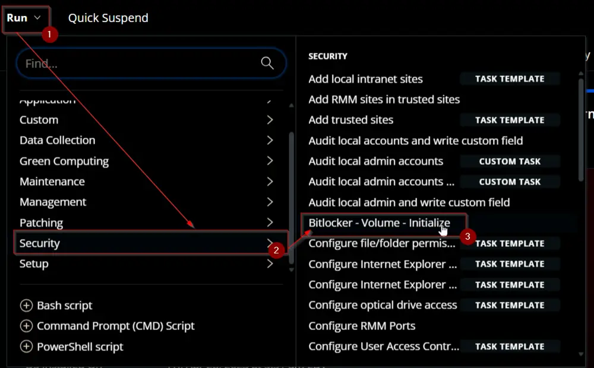

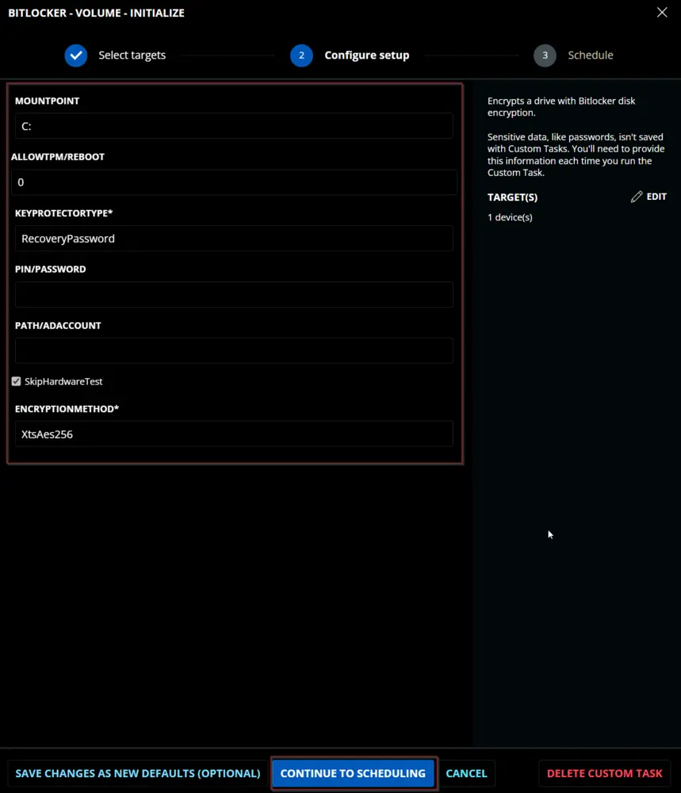

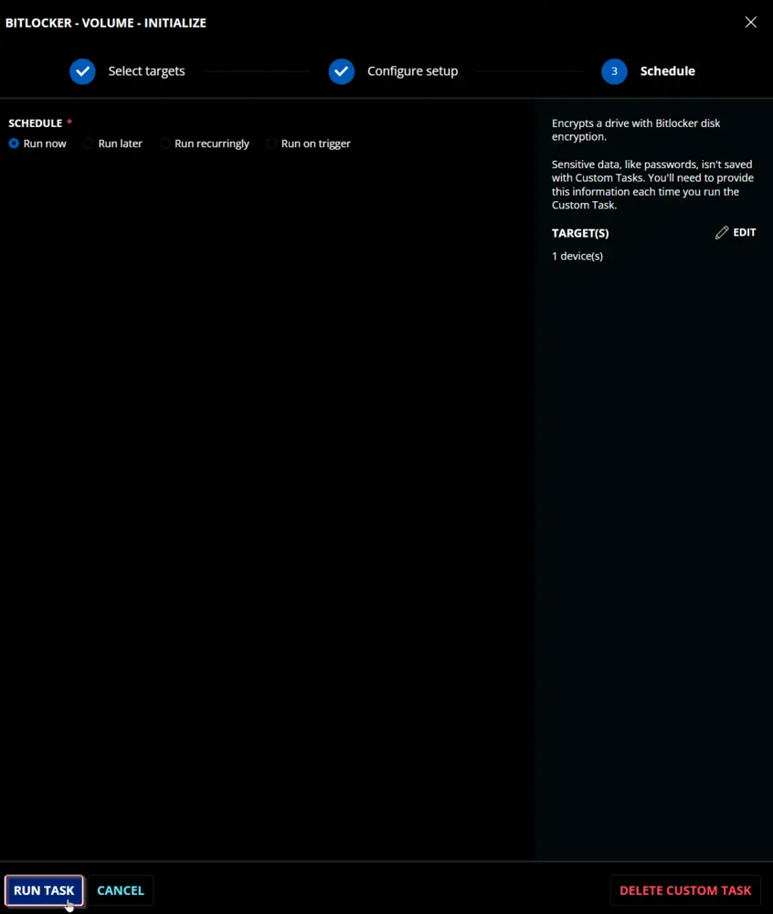

## Dependencies

[Initialize-BitLockerVolume](/docs/2ce835a2-3ac1-4291-baaf-8d3cac76869f)

## User Parameters

| Name                  | Example                       | Accepted Values                                                                                                                                  | Required | Default | Type   | Description                                                                                          |
|-----------------------|-------------------------------|--------------------------------------------------------------------------------------------------------------------------------------------------|----------|---------|--------|------------------------------------------------------------------------------------------------------|
| Mount Point           | E:                            |                                                                                                                                                  | False    | C:      | Text   | The volume to protect. Defaults to the system drive.                                               |
| Allow TPM/Reboot      | 3                             | 0,1,2,3                                                                                                                                         | False    | 0       | Number | Options for allowing TPM initialization and rebooting. 0 = Do not allow, 1 = Allow TPM Initialization, 2 = Allow Reboot, 3 = Allow TPM Initialization and Reboot |
| Key Protector Type     | RecoveryPassword              | Tpm, TpmStartup, TpmPinStartup, Password, Startup, RecoveryKey, RecoveryPassword, AdAccount                                                    | True     |         | Text   | Options for which type of protector to use for BitLocker: Tpm, TpmPin (Requires PIN/Password parameter), TpmStartup (Requires Path/ADAccount parameter), TpmPinStartup (Requires PIN/Password and Path/ADAccount parameters), Password (Requires PIN/Password parameter), Startup (Requires Path/ADAccount parameter), RecoveryKey (Requires Path/ADAccount parameter), RecoveryPassword, AdAccount (Requires Path/ADAccount parameter) |
| PIN/Password          | - 123456- Pa$sw0rD!- 123456-654321-123456-654321-123456-654321 |                                                                                                                                                  | Semi     |         | Text   | Option for the PIN or Password needed for specific key protector types.                            |
| Path/ADAccount        | - F://Recovery- CONTOSO//ContosoUser- CONTOSO//ContosoGroup |                                                                                                                                                  | Semi     |         | Text   | Option for the Path or AD Account needed for specific key protector types.                         |
| SkipHardwareTest      | Checked                       |                                                                                                                                                  | False    | Checked  | Flag   | Mark this checkbox to enable BitLocker without forcefully validating the hardware.                  |
| EncryptionMethod      | XtsAes256                    | Aes128, Aes256, XtsAes128, XtsAes256                                                                                                           | True     | XtsAes256 | Text   | The encryption method that will be used to protect the target volume. Valid options are: Aes128, Aes256, XtsAes128, XtsAes256 |

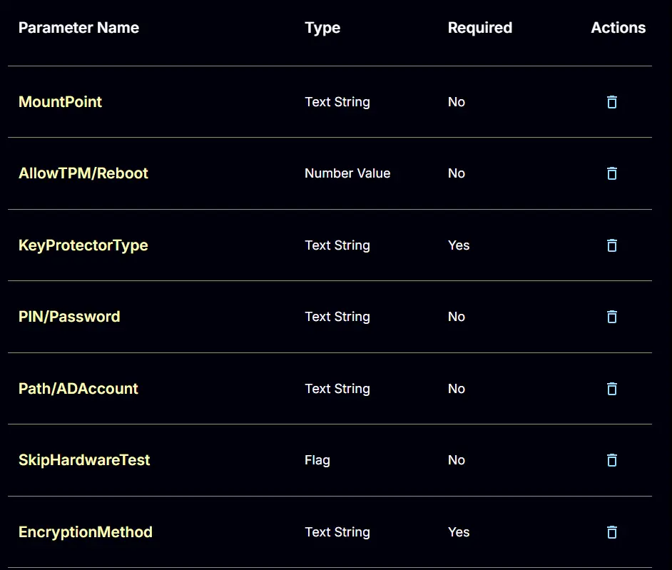

## Key Protector Types

| Type            | Description                                                                                                  |
|-----------------|--------------------------------------------------------------------------------------------------------------|
| Tpm             | Protect the encrypted drive with only the TPM chip.                                                         |
| TpmPin          | Protect the encrypted drive with the TPM chip and a PIN. Requires the PIN/Password parameter to be passed. |
| TpmStartup      | Protect the encrypted drive with the TPM chip and a startup key. Requires the Path/ADAccount parameter.    |
| TpmPinStartup   | Protect the encrypted drive with the TPM chip, a PIN, and a startup key. Requires the PIN/Password and Path/ADAccount parameters. |
| Password        | Protects the encrypted drive with a custom password. Requires the PIN/Password parameter to be passed.      |
| Startup         | Protect the encrypted drive with a startup key. Requires the Path/ADAccount parameter.                      |
| RecoveryKey     | Protect the encrypted drive with a recovery key. Requires the Path/ADAccount parameter.                     |
| RecoveryPassword | Protect the encrypted drive with a recovery password. If the PIN/Password parameter is not passed, the script will generate one automatically. |
| AdAccount       | Protect the encrypted drive with an Active Directory Account or Group. Requires the Path/ADAccount parameter. |

## Task Creation

Create a new `Script Editor` style script in the system to implement this Task.

**Name:** Bitlocker - Volume - Initialize  \
**Description:** `Encrypts a drive with BitLocker disk encryption.`  \
**Category:** Security  

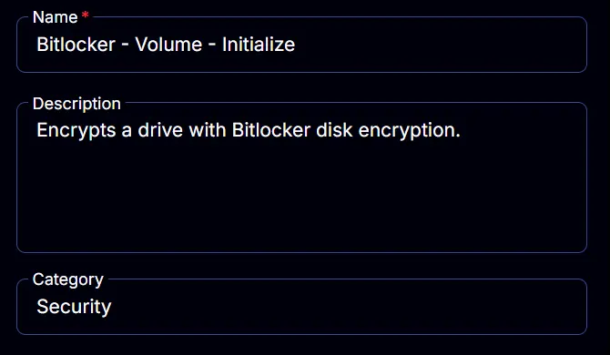

## Parameters

### MountPoint:
Add a new parameter by clicking the `Add Parameter` button present at the top-right corner of the screen.

This screen will appear.

- Set `MountPoint` in the `Parameter Name` field.
- Select `Text String` from the `Parameter Type` dropdown menu.
- Click the `Save` button.

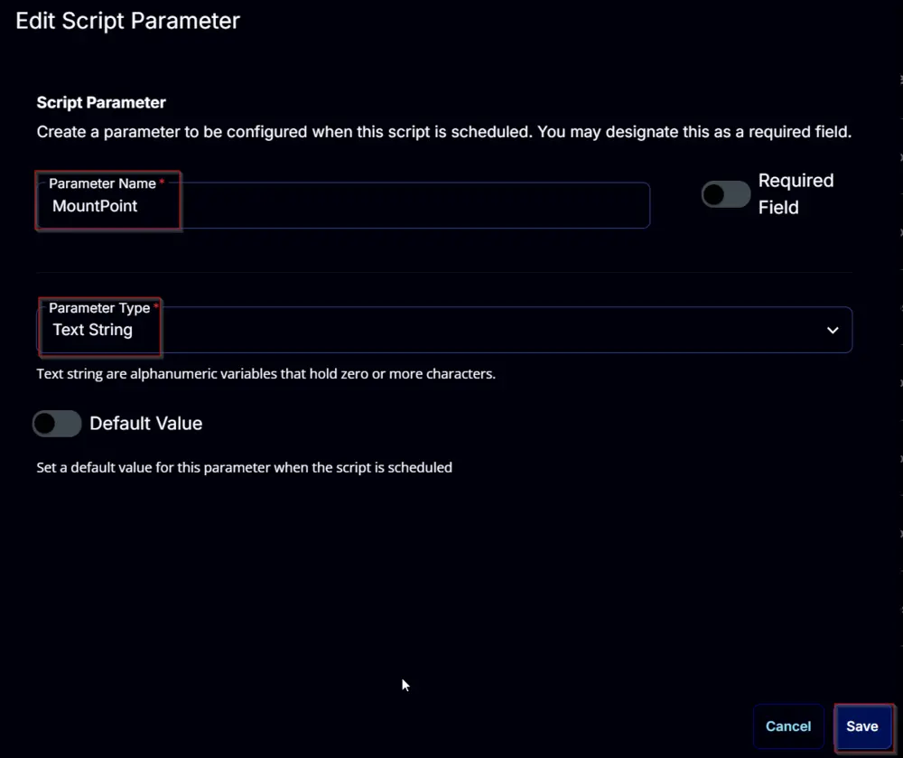

### AllowTPM/Reboot:
Add a new parameter by clicking the `Add Parameter` button present at the top-right corner of the screen.

This screen will appear.

- Set `AllowTPM/Reboot` in the `Parameter Name` field.
- Select `Number Value` from the `Parameter Type` dropdown menu.
- Enable the `Default Value` button.
- Set `0` in the `Value` field.
- Click the `Save` button.

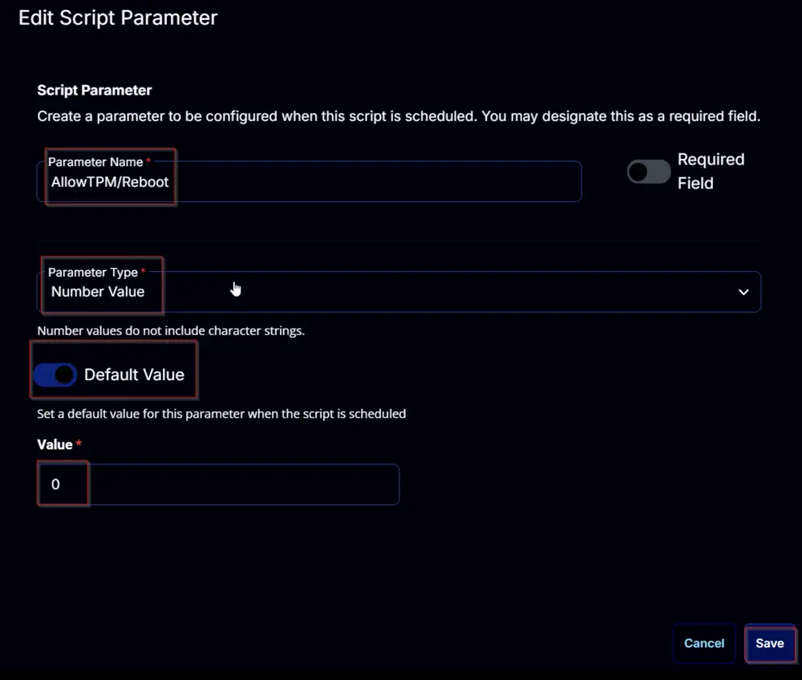

### KeyProtectorType:
Add a new parameter by clicking the `Add Parameter` button present at the top-right corner of the screen.

This screen will appear.

- Set `KeyProtectorType` in the `Parameter Name` field.
- Select `Text String` from the `Parameter Type` dropdown menu.
- Enable the `Required Field` button.
- Click the `Save` button.

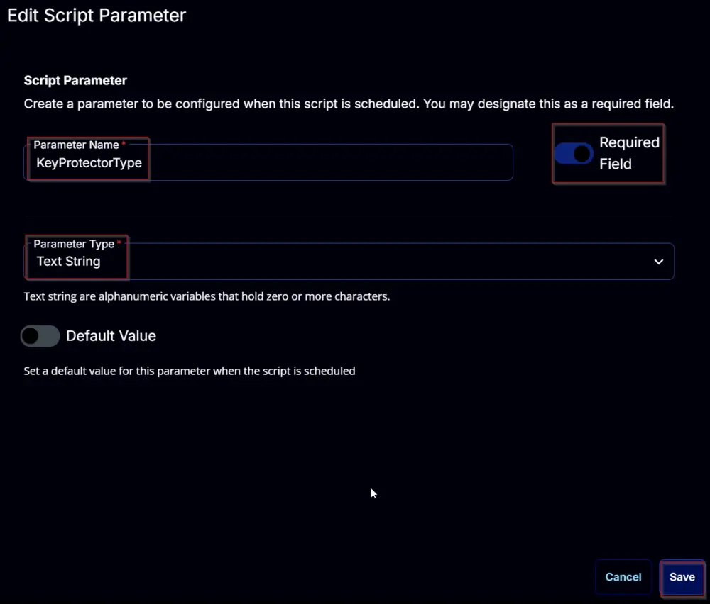

### PIN/Password:
Add a new parameter by clicking the `Add Parameter` button present in the top-right corner of the screen.

This screen will appear.

- Set `PIN/Password` in the `Parameter Name` field.
- Select `Text String` from the `Parameter Type` dropdown menu.
- Click the `Save` button.

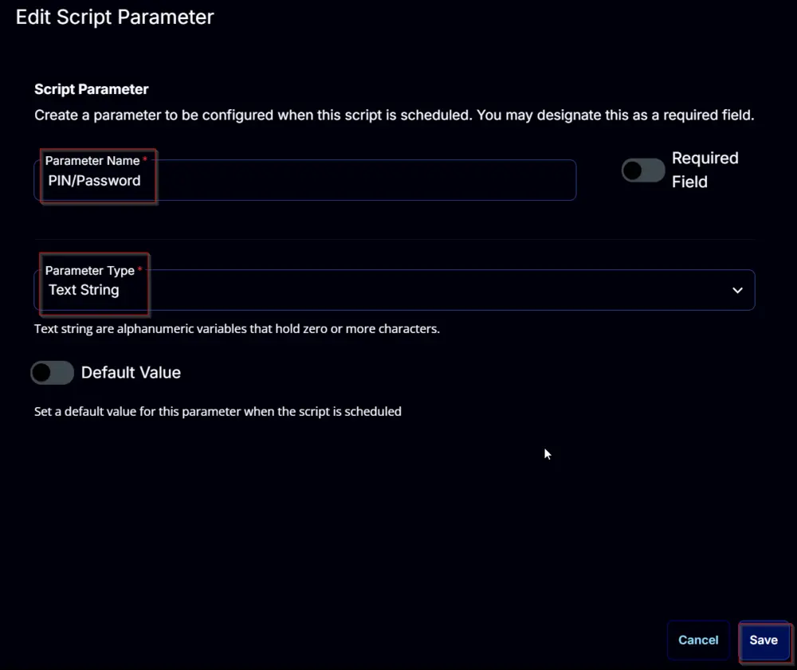

### Path/ADAccount:
Add a new parameter by clicking the `Add Parameter` button present in the top-right corner of the screen.

This screen will appear.

- Set `Path/ADAccount` in the `Parameter Name` field.
- Select `Text String` from the `Parameter Type` dropdown menu.
- Click the `Save` button.

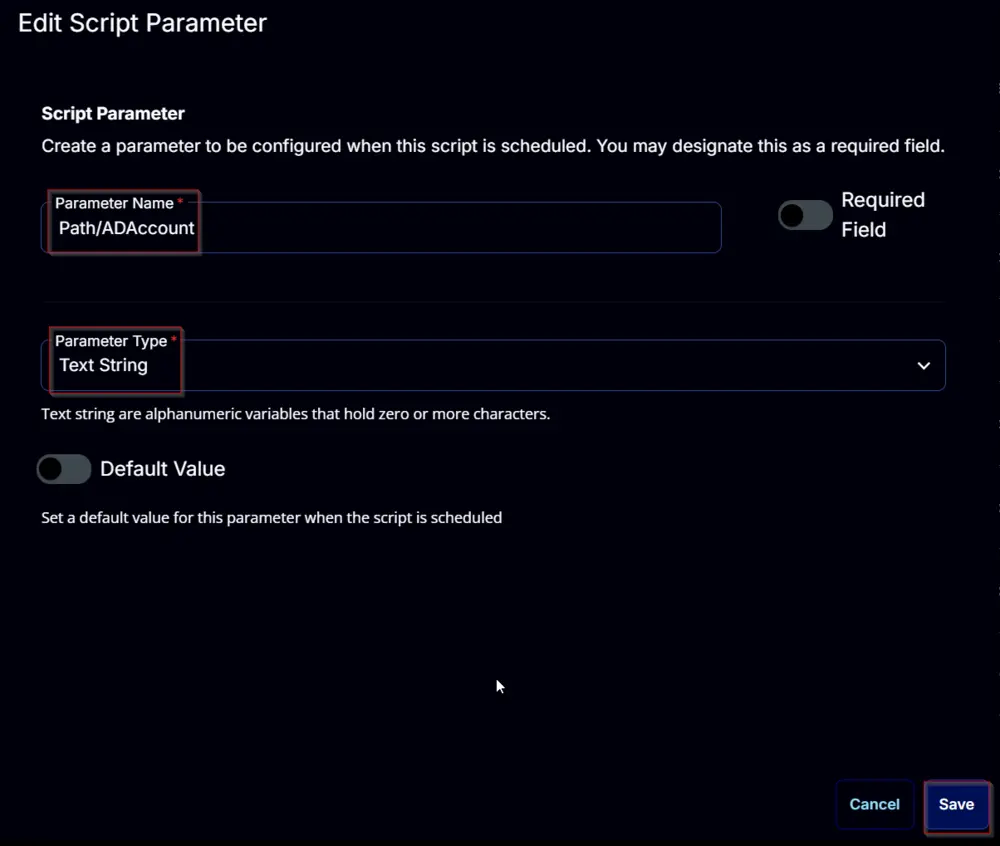

### SkipHardwareTest:
Add a new parameter by clicking the `Add Parameter` button present in the top-right corner of the screen.

This screen will appear.

- Set `SkipHardwareTest` in the `Parameter Name` field.
- Select `Flag` from the `Parameter Type` dropdown menu.
- Enable the `Default Value` button.
- Set `True` in the `Value` field.
- Click the `Save` button.

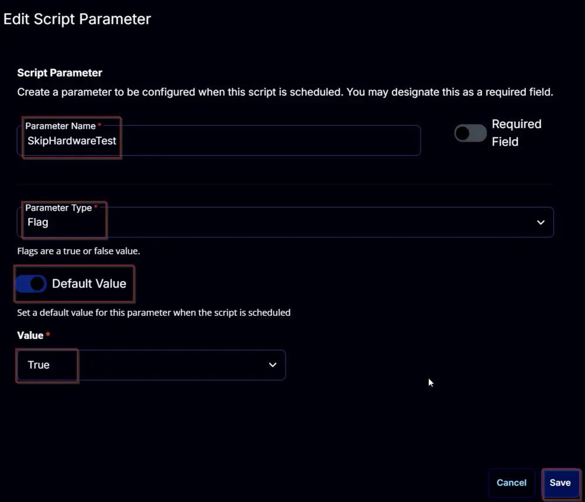

### EncryptionMethod:
Add a new parameter by clicking the `Add Parameter` button present in the top-right corner of the screen.

This screen will appear.

- Set `EncryptionMethod` in the `Parameter Name` field.
- Select `Text String` from the `Parameter Type` dropdown menu.
- Enable the `Required Field` button.
- Enable the `Default Value` button.
- Set `XtsAes256` in the `Value` field.
- Click the `Save` button.

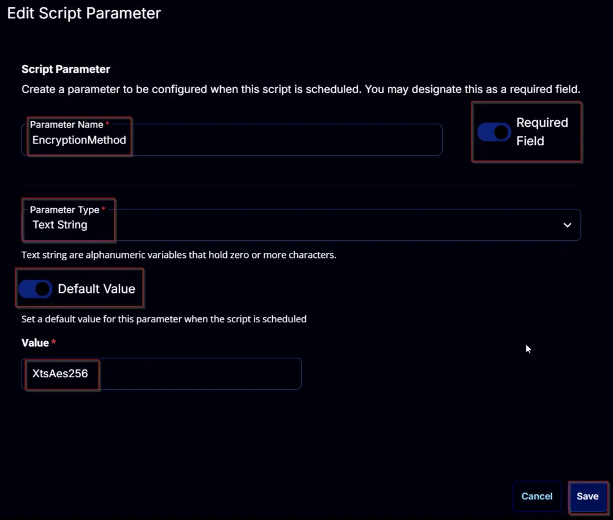

## Task
Navigate to the Script Editor Section and start by adding a row. You can do this by clicking the `Add Row` button at the bottom of the script page.

A blank function will appear.

### Row 1 Function: PowerShell Script
Search and select the `PowerShell Script` function.

The following function will pop up on the screen:

Paste in the following PowerShell script and set the `Expected time of script execution in seconds` to `600` seconds. Click the `Save` button.

[PowerShell Script](https://github.com/ProVal-Tech/cw-rmm/blob/main/tasks/bitlocker-volume-initialize/script.ps1)

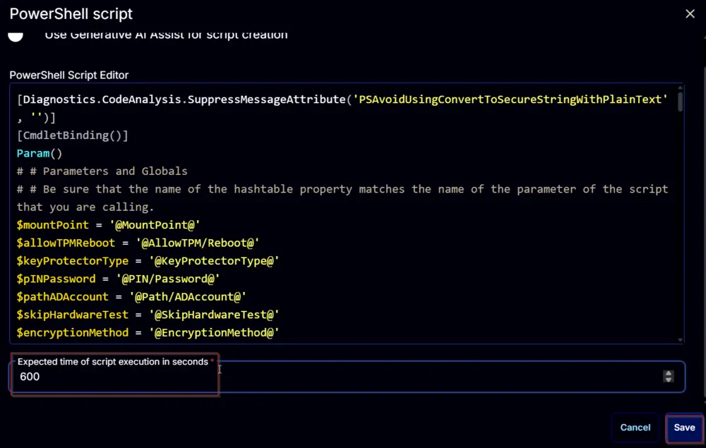

### Row 2 Function: Script Log
Add a new row by clicking the `Add Row` button.

A blank function will appear.

Search and select the `Script Log` function.

The following function will pop up on the screen:

In the script log message, simply type `%output%` and click the `Save` button.

Click the `Save` button at the top-right corner of the screen to save the script.

## Completed Task

## Output

- Script log

## Changelog

### 2025-04-10

- Initial version of the document

