## Summary

This ConnectWise RMM script performs a comprehensive security and boot environment audit on Windows devices. It acts as an automated health check, looking deep into the system to verify that critical security measures are in place and up to date.

Specifically, the script gathers information on:

- **Secure Boot & Certificates:** Checks if Secure Boot is enabled and verifies if the device has the latest security certificates (such as the UEFI CA 2023 update) required to keep the boot process secure.
- **Hardware & BIOS Updates:** Identifies the device manufacturer (like Dell, HP, or Lenovo) and counts how many hardware driver updates are available. It also logs the current BIOS version and checks if the system's hardware is capable of supporting newer security standards.
- **System Boot Configuration:** Scans the boot setup to detect if the machine is configured to boot from a network (PXE) or if it has alternative operating systems installed (Dual-Boot/Linux environments).
- **Recovery & Telemetry:** Checks if the built-in Windows Recovery Environment (WinRE) is active and verifies if Windows diagnostic data collection (telemetry) is turned on or off.
- **Windows Updates:** Identifies the most recently installed cumulative Windows update and checks if the system meets specific update baselines (November 2025 or newer).

Once the audit is complete, the script automatically saves all this valuable data directly into designated custom fields on the endpoint within your ConnectWise RMM environment. This allows for easy filtering, reporting, and visibility across your entire fleet of managed devices.

## Sample Run

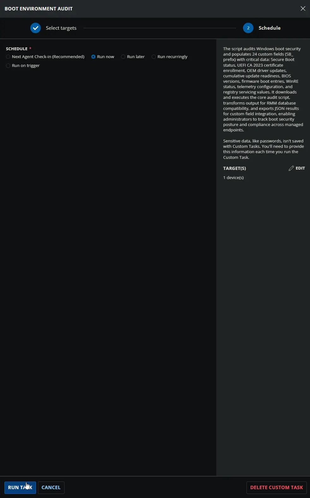

## Dependencies

- [Custom Field: SB_OEM_Updates_Count](/docs/ba17eb18-3c95-4c40-b1d9-669cb94ef1c2)
- [Custom Field: SB_SecureBoot_Status](/docs/bca82718-a8c8-4a9d-ac87-1920130978b6)
- [Custom Field: SB_Telemetry_Status](/docs/c67af38c-feaa-4c74-8f22-914fc8d17402)
- [Custom Field: SB_DB_Certificate_Status](/docs/233d7b73-c65a-4eb9-bff1-90d91f3ab7e1)
- [Custom Field: SB_KEK_Certificate_Status](/docs/f066b102-af22-4257-bc1d-8a4b9a66e7e2)
- [Custom Field: SB_DBDefault_Certificate_Status](/docs/cac79d06-1f5e-49f8-96c2-8660d5c1e162)
- [Custom Field: SB_Current_Cumulative_Update](/docs/d4de84fc-f158-466b-a7cf-57534445f0e9)
- [Custom Field: SB_Nov_2025_CU_Installed](/docs/e6d3c7d9-9fa8-4e0c-a1d1-8c9d52428e41)
- [Custom Field: SB_BiosVersion](/docs/061ac707-7f78-40c9-984c-1327793ce6a3)
- [Custom Field: SB_CA2023_Supported_BIOS_Version](/docs/641a1d5b-1ee1-4c24-a90e-809c308af495)
- [Custom Field: SB_PXE_Present](/docs/325c627e-961b-476b-b78f-80d2d94c4125)
- [Custom Field: SB_DualBoot_Or_NonWindowsEFI](/docs/592365ee-556a-4d9a-9785-7846833e4d87)
- [Custom Field: SB_WinRE_Enabled](/docs/24259337-1a3f-4c79-bbdd-67faef9347a9)
- [Custom Field: SB_Present_Conditions](/docs/2657a33b-4fbc-496e-aa89-143f033b0443)
- [Custom Field: SB_PXE_Evidence](/docs/1cd8967a-820e-44da-b3b8-6edd38c578e7)
- [Custom Field: SB_DualBoot_Evidence](/docs/4f28adde-7af1-4215-995e-83885b81149a)
- [Custom Field: SB_Available_Updates](/docs/b6d34e3b-ad95-447c-ad3f-192e217bbffe)
- [Custom Field: SB_UEFICA2023_Status](/docs/ce98365e-b160-4bb7-89ad-b2025cbc9c68)
- [Custom Field: SB_UEFICA2023_Error](/docs/1b2647ad-2479-47be-b424-d1846aef2325)
- [Custom Field: SB_WindowsUEFICA2023_Capable](/docs/3f72d333-4c7c-4232-a127-e8f6b535d4f5)
- [Custom Field: SB_Confidence_Level](/docs/0c21d197-28c0-4dc1-81a9-a8981b0d75a5)
- [Custom Field: SB_Confidence_Update_Type](/docs/319e3d2f-d26b-4833-8000-3d05724c47aa)
- [Custom Field: SB_BucketHash](/docs/d50206c9-70e5-4bcf-8e47-b5ad8343795d)
- [Custom Field: SB_Data_Collection_Time](/docs/7ec97bea-bba8-4ce7-88c9-1c3dd9b2c3df)
- [Custom Field: Boot Environment Audit](/docs/1fd6dff7-dd6e-4d0f-921a-e9a62ebb6e47)
- [Initiaize-DellCommandUpdate](/docs/aa963f3d-f149-4bfa-8fdc-30f12c21ce7f)
- [Initialize-HPImageAssistant](/docs/92b749f0-2e30-4d4d-8916-fb5f30d85bff)
- [Install-LenovoUpdates](/docs/3640e534-d089-4304-89ba-68d3bc113978)
- [Install-WindowsUpdates](/docs/3ccc8542-1961-4d3f-a54b-4a1bb9a78edd)
- [Get-LatestInstalledCU](/docs/81d82975-889b-49e4-b229-36d4f162a4ff)
- [Solution: Boot Environment Audit](/docs/1cd2e351-ffd3-4afe-966d-0f58c6dc4c49)

## Custom Fields

| Name | Example | Level | Type | Editable | Description |
| --- | --- | --- | --- | --- | --- |
| SB_OEM_Updates_Count | 3 | Endpoint | Text Box | No | Number of available drivers, Firmware, BIOS updates from the OEM (Dell Command Update, HP Image Assistant, Lenovo Updates, or Windows Update). |
| SB_SecureBoot_Status | Enabled | Endpoint | Text Box | No | Current Secure Boot state: Enabled, Disabled, or Unknown. |
| SB_Telemetry_Status | Disabled | Endpoint | Text Box | No | Windows telemetry setting: Enabled or Disabled (based on registry and DiagTrack service). |
| SB_DB_Certificate_Status | Updated | Endpoint | Text Box | No | UEFI db certificate status: Updated (CA 2023), Out of date, or Not present. |
| SB_KEK_Certificate_Status | Updated | Endpoint | Text Box | No | UEFI KEK certificate status: Updated (Microsoft KEK 2K CA 2023), Out of date, or Not present. |
| SB_DBDefault_Certificate_Status | Out of date | Endpoint | Text Box | No | Default db certificate status: Updated (CA 2023), Out of date, or Not present. |
| SB_Current_Cumulative_Update | KB5012345 | Endpoint | Text Box | No | Latest installed Windows cumulative update identifier. |
| SB_Nov_2025_CU_Installed | True | Endpoint | Text Box | No | True if the November 2025 or newer cumulative update is installed; False otherwise. |
| SB_BiosVersion | 1.15.2 | Endpoint | Text Box | No | BIOS/firmware version string collected from the system. |
| SB_CA2023_Supported_BIOS_Version | 1.16.0 | Endpoint | Text Box | No | Minimum BIOS version required for CA 2023 Secure Boot support per the OEM; 'Not listed' if the model is not found in the lookup. |
| SB_PXE_Present | False | Endpoint | Text Box | No | True if firmware boot entries include PXE/network boot options; False otherwise. |
| SB_DualBoot_Or_NonWindowsEFI | False | Endpoint | Text Box | No | True if non-Windows EFI boot entries are detected (Ubuntu, Debian, GRUB, rEFInd, etc.); False otherwise. |
| SB_WinRE_Enabled | True | Endpoint | Text Box | No | True if the Windows Recovery Environment is enabled; False otherwise. |
| SB_Present_Conditions | WinREEnabled | Endpoint | Text Box | No | Comma-separated summary of detected boot conditions (e.g., 'PXE, DualBoot/NonWindowsEFI, WinREEnabled'). |
| SB_PXE_Evidence | IPv4 Network | Endpoint | Text Box | No | Detailed boot firmware entries indicating PXE/network boot (extracted from system data). |
| SB_DualBoot_Evidence | EFI\ubuntu\grubx64.efi | Endpoint | Text Box | No | Detailed boot firmware entries indicating non-Windows EFI loaders (extracted from system data). |
| SB_Available_Updates | Not exist | Endpoint | Text Box | No | Secure Boot registry value for available UEFI updates; 'Not exist' if the key is not present. |
| SB_UEFICA2023_Status | Not exist | Endpoint | Text Box | No | Secure Boot servicing registry value indicating CA 2023 enrollment status; 'Not exist' if the key is not present. |
| SB_UEFICA2023_Error | Not exist | Endpoint | Text Box | No | Secure Boot servicing registry value showing CA 2023 enrollment errors; 'Not exist' if the key is not present. |
| SB_WindowsUEFICA2023_Capable | Not exist | Endpoint | Text Box | No | Secure Boot servicing registry value indicating device hardware CA 2023 capability; 'Not exist' if the key is not present. |
| SB_Confidence_Level | Not exist | Endpoint | Text Box | No | Secure Boot servicing registry confidence level for CA 2023 enrollment; 'Not exist' if the key is not present. |
| SB_Confidence_Update_Type | Not exist | Endpoint | Text Box | No | Secure Boot servicing registry update type for CA 2023; 'Not exist' if the key is not present. |
| SB_BucketHash | Not exist | Endpoint | Text Box | No | Secure Boot servicing registry bucket hash for troubleshooting; 'Not exist' if the key is not present. |
| SB_Data_Collection_Time | 2026-05-14 17:51:24 | Endpoint | Text Box | No | Timestamp (yyyy-MM-dd HH:mm:ss) when the data was collected. |
| Boot Environment Audit | 1 | Endpoint | Text Box | Yes | Sets this custom field to 1 when the script runs successfully, indicating that the boot environment has been audited and data is available in the other custom fields. |

## Task Setup Path

- **Tasks Path:** `AUTOMATION` ➞ `Tasks`  
- **Task Type:** `Script Editor`  

## Task Creation

### Description

- **Name:** `Boot Environment Audit`  
- **Description:** `The script audits Windows boot security and populates 24 custom fields (SB_ prefix) with critical data: Secure Boot status, UEFI CA 2023 certificate enrollment, OEM driver updates, cumulative update readiness, BIOS versions, firmware boot entries, WinRE status, telemetry configuration, and registry servicing values. It downloads and executes the core audit script, transforms output for RMM database compatibility, and exports JSON results for custom field integration, enabling administrators to track boot security posture and compliance across managed endpoints.`  
- **Category:** `Data Collection`

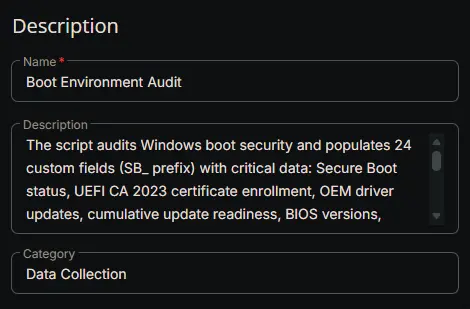

### Script Editor

#### Row 1: PowerShell script

- **Notes:** `Data Collection Script`  
- **Use Generative AI Assist for script creation:** `False`  
- **Expected time of script execution in seconds:** `1800`  
- **Continue on Failure:** `True`  
- **Run As:** `System`  
- **Operating System:** `Windows`  
- **PowerShell Script Editor:**

```PowerShell
<#
.SYNOPSIS
Collects boot environment, security configuration, and cumulative update data for ConnectWise RMM custom fields.

.DESCRIPTION
This script is the ConnectWise Automate RMM wrapper for Get-BootEnvironmentDetails.ps1.
It downloads and executes the core audit script, then transforms the output into an object with
properties designed to be stored in CW RMM custom fields with a 'SB_' prefix. All string values
are escaped to prevent corruption when stored in CW RMM databases.

The script collects comprehensive boot security data including:
- OEM driver update counts from manufacturer-specific tools
- Secure Boot status and UEFI certificate enrollment (CA 2023)
- Windows telemetry configuration
- BIOS/firmware version information and CA 2023 support readiness
- Firmware boot entries (PXE, dual-boot, non-Windows EFI)
- Windows Recovery Environment (WinRE) status
- Latest cumulative update information
- Secure Boot registry servicing values

.EXAMPLE
    .\Get-BootEnvironmentDetailsCWRMM.ps1

Executes the script and outputs a JSON file containing the boot environment data.
The JSON is automatically stored at ProgramData\_Automation\Script\Get-BootEnvironmentDetails\Get-BootEnvironmentDetails.json

.NOTES
- Requires Administrator privileges to read UEFI variables, registry, and run bcdedit/reagentc
- Designed for use in ConnectWise Automate (formerly LabTech) custom script execution
- Output is a typed object with CW RMM-compatible property names (SB_ prefix)
- All output is converted to JSON for easy integration with RMM platforms

.OUTPUTS
BootEnvironmentDetail (typed object) containing all audit fields prefixed with SB_

Custom Field Mapping Table:

| Custom Field Name                      | Data Type | Description                                                                                                              |
|----------------------------------------|-----------|--------------------------------------------------------------------------------------------------------------------------|
| SB_OEM_Updates_Count                   | Integer   | Number of available driver updates from OEM (Dell Command Update, HP Image Assistant, Lenovo Updates, or Windows Update) |
| SB_SecureBoot_Status                   | String    | Current Secure Boot state: Enabled, Disabled, or Unknown                                                                 |
| SB_Telemetry_Status                    | String    | Windows telemetry setting: Enabled or Disabled (based on registry and DiagTrack service)                                |
| SB_DB_Certificate_Status               | String    | UEFI db certificate status: Updated (CA 2023), Out of date, or Not present                                              |
| SB_KEK_Certificate_Status              | String    | UEFI KEK certificate status: Updated (Microsoft KEK 2K CA 2023), Out of date, or Not present                            |
| SB_DBDefault_Certificate_Status        | String    | Default db certificate status: Updated (CA 2023), Out of date, or Not present                                           |
| SB_Current_Cumulative_Update           | String    | Latest installed Windows cumulative update (e.g., KB5012345)                                                             |
| SB_Nov_2025_CU_Installed               | Boolean   | True if November 2025 or newer cumulative update is installed; False otherwise                                           |
| SB_BiosVersion                         | String    | BIOS/firmware version string from system (e.g., 2.15.0)                                                                 |
| SB_CA2023_Supported_BIOS_Version       | String    | Minimum BIOS version required for CA 2023 Secure Boot support per OEM; 'Not listed' if model not found in lookup        |
| SB_PXE_Present                         | Boolean   | True if firmware boot entries include PXE/network boot options; False otherwise                                          |
| SB_DualBoot_Or_NonWindowsEFI           | Boolean   | True if non-Windows EFI boot entries detected (Ubuntu, Debian, GRUB, rEFInd, etc.); False otherwise                     |
| SB_WinRE_Enabled                       | Boolean   | True if Windows Recovery Environment is enabled; False otherwise                                                         |
| SB_Present_Conditions                  | String    | Comma-separated summary of detected boot conditions (e.g., 'PXE, DualBoot/NonWindowsEFI, WinREEnabled')                 |
| SB_PXE_Evidence                        | String    | Detailed boot firmware entries indicating PXE/network boot (from bcdedit output)                                        |
| SB_DualBoot_Evidence                   | String    | Detailed boot firmware entries indicating non-Windows EFI loaders (from bcdedit output)                                 |
| SB_Available_Updates                   | String    | Secure Boot registry value for available UEFI updates; 'Not exist' if key not present                                  |
| SB_UEFICA2023_Status                   | String    | Secure Boot servicing registry value indicating CA 2023 enrollment status; 'Not exist' if key not present               |
| SB_UEFICA2023_Error                    | String    | Secure Boot servicing registry value showing CA 2023 enrollment errors; 'Not exist' if key not present                  |
| SB_WindowsUEFICA2023_Capable           | String    | Secure Boot servicing registry value indicating device hardware CA 2023 capability; 'Not exist' if key not present      |
| SB_Confidence_Level                    | String    | Secure Boot servicing registry confidence level for CA 2023 enrollment; 'Not exist' if key not present                  |
| SB_Confidence_Update_Type              | String    | Secure Boot servicing registry update type for CA 2023; 'Not exist' if key not present                                  |
| SB_BucketHash                          | String    | Secure Boot servicing registry bucket hash for troubleshooting; 'Not exist' if key not present                          |
| SB_Data_Collection_Time                | String    | Timestamp (yyyy-MM-dd HH:mm:ss) when data was collected                                                                 |

.LINK
- Get-BootEnvironmentDetails: https://content.provaltech.com/docs/5ecf76fb-1516-4c17-9ec9-937762c3ded6
#>

#region globals
$ProgressPreference = 'SilentlyContinue'
$WarningPreference = 'SilentlyContinue'
#endregion

#region variables
$ProjectName = 'Get-BootEnvironmentDetails'
$workingDirectory = '{0}\_Automation\Script\{1}' -f $env:ProgramData, $ProjectName
$scriptPath = '{0}\{1}.ps1' -f $workingDirectory, $ProjectName
$jsonPath = '{0}\{1}.json' -f $workingDirectory, $ProjectName
$baseUrl = 'https://contentrepo.net/repo'
$scriptUrl = '{0}/script/{1}.ps1' -f $baseUrl, $ProjectName
#endregion

#region working Directory
if (-not (Test-Path -Path $workingDirectory)) {
    try {
        New-Item -Path $workingDirectory -ItemType Directory -Force -ErrorAction Stop | Out-Null
    } catch {
        return ('Failed to Create working directory {0}. Reason: {1}' -f $workingDirectory, $Error[0].Exception.Message)
    }
}
#endregion

#region set tls policy
$supportedTlsVersions = [enum]::GetValues('Net.SecurityProtocolType')
if (($supportedTlsVersions -contains 'Tls13') -and ($supportedTlsVersions -contains 'Tls12')) {
    [System.Net.ServicePointManager]::SecurityProtocol =
    [Enum]::ToObject([Net.SecurityProtocolType], 12288) -bor
    [Enum]::ToObject([Net.SecurityProtocolType], 3072)
} else {
    [Net.ServicePointManager]::SecurityProtocol = [Enum]::ToObject([Net.SecurityProtocolType], 3072)
}
#endregion

#region download script
try {
    Invoke-WebRequest -Uri $scriptUrl -OutFile $scriptPath -UseBasicParsing -ErrorAction Stop
} catch {
    if (-not (Test-Path -Path $scriptPath)) {
        return ('Failed to download the script from ''{0}'', and no local copy of the script exists on the machine. Reason: {1}' -f $scriptUrl, $Error[0].Exception.Message)
    }
}
#endregion

#region execute script
$bootEnvironmentDetail = & $scriptPath
#endregion

#region process data
class BootEnvironmentDetail {
    [int32]$SB_OEM_Updates_Count
    [string]$SB_SecureBoot_Status
    [string]$SB_Telemetry_Status
    [string]$SB_DB_Certificate_Status
    [string]$SB_KEK_Certificate_Status
    [string]$SB_DBDefault_Certificate_Status
    [string]$SB_Current_Cumulative_Update
    [bool]$SB_Nov_2025_CU_Installed
    [string]$SB_BiosVersion
    [string]$SB_CA2023_Supported_BIOS_Version
    [bool]$SB_PXE_Present
    [bool]$SB_DualBoot_Or_NonWindowsEFI
    [bool]$SB_WinRE_Enabled
    [string]$SB_Present_Conditions
    [string]$SB_PXE_Evidence
    [string]$SB_DualBoot_Evidence
    [string]$SB_Available_Updates
    [string]$SB_UEFICA2023_Status
    [string]$SB_UEFICA2023_Error
    [string]$SB_WindowsUEFICA2023_Capable
    [string]$SB_Confidence_Level
    [string]$SB_Confidence_Update_Type
    [string]$SB_BucketHash
    [string]$SB_Data_Collection_Time
}

$DateTime = (Get-Date).ToString('yyyy-MM-dd HH:mm:ss')

$result = [BootEnvironmentDetail]@{
    SB_OEM_Updates_Count             = $bootEnvironmentDetail.OEMUpdatesCount
    SB_SecureBoot_Status             = $($bootEnvironmentDetail.SecureBootStatus -replace '\\', '\\')
    SB_Telemetry_Status              = $($bootEnvironmentDetail.TelemetryStatus -replace '\\', '\\')
    SB_DB_Certificate_Status         = $($bootEnvironmentDetail.DBCertificateStatus -replace '\\', '\\')
    SB_KEK_Certificate_Status        = $($bootEnvironmentDetail.KEKCertificateStatus -replace '\\', '\\')
    SB_DBDefault_Certificate_Status  = $($bootEnvironmentDetail.DBDefaultCertificateStatus -replace '\\', '\\')
    SB_Current_Cumulative_Update     = $($bootEnvironmentDetail.CurrentCumulativeUpdate -replace '\\', '\\')
    SB_Nov_2025_CU_Installed         = [bool]$bootEnvironmentDetail.Nov2025CUInstalled
    SB_BiosVersion                   = $($bootEnvironmentDetail.BiosVersion -replace '\\', '\\')
    SB_CA2023_Supported_BIOS_Version = $($bootEnvironmentDetail.CA2023SupportedBIOSVersion -replace '\\', '\\')
    SB_PXE_Present                   = [bool]$bootEnvironmentDetail.PXE_Present
    SB_DualBoot_Or_NonWindowsEFI     = [bool]$bootEnvironmentDetail.DualBootOrNonWindowsEFI
    SB_WinRE_Enabled                 = [bool]$bootEnvironmentDetail.WinRE_Enabled
    SB_Present_Conditions            = $($bootEnvironmentDetail.Present -replace '\\', '\\')
    SB_PXE_Evidence                  = $($bootEnvironmentDetail.PXE_Evidence -replace '\\', '\\')
    SB_DualBoot_Evidence             = $($bootEnvironmentDetail.DualBoot_Evidence -replace '\\', '\\')
    SB_Available_Updates             = $($bootEnvironmentDetail.Available_Updates -replace '\\', '\\')
    SB_UEFICA2023_Status             = $($bootEnvironmentDetail.UEFICA2023_Status -replace '\\', '\\')
    SB_UEFICA2023_Error              = $($bootEnvironmentDetail.UEFICA2023_Error -replace '\\', '\\')
    SB_WindowsUEFICA2023_Capable     = $($bootEnvironmentDetail.WindowsUEFICA2023_Capable -replace '\\', '\\')
    SB_Confidence_Level              = $($bootEnvironmentDetail.ConfidenceLevel -replace '\\', '\\')
    SB_Confidence_Update_Type        = $($bootEnvironmentDetail.ConfidenceUpdateType -replace '\\', '\\')
    SB_BucketHash                    = $($bootEnvironmentDetail.BucketHash -replace '\\', '\\')
    SB_Data_Collection_Time          = $DateTime
}
#endregion

#region output
if (Test-Path -Path $jsonPath) {
    Remove-Item -Path $jsonPath -Confirm:$false -Force -ErrorAction SilentlyContinue
}

if ($result) {
    $result | ConvertTo-Json -Depth 10 | Out-File -FilePath $jsonPath -Encoding 'utf8'
} else {
    return 'Script execution did not return any result. No output will be generated.'
}

return, ($result | Out-String)
#endregion
```

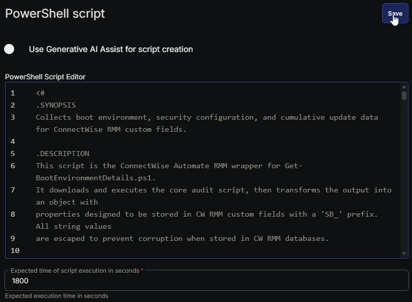

#### Row 2: Script Log

- **Notes:** `Data Collection Script Log`  
- **Continue on Failure:** `True`  
- **Operating System:** `Windows`  
- **Script Log Message:** `%Output%`  

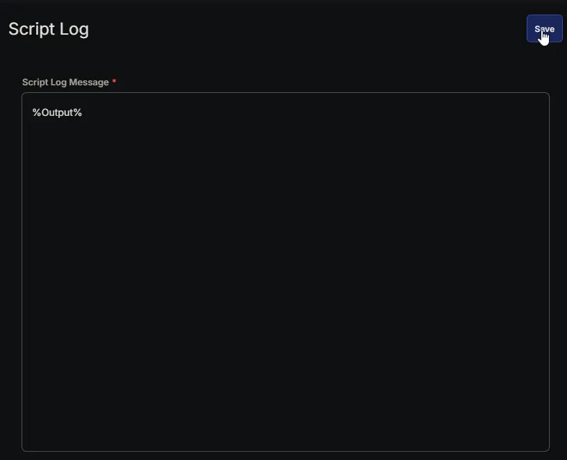

#### Row 3: PowerShell script

- **Notes:** `Result File Check`  
- **Use Generative AI Assist for script creation:** `False`  
- **Expected time of script execution in seconds:** `300`  
- **Continue on Failure:** `False`  
- **Run As:** `System`  
- **Operating System:** `Windows`  
- **PowerShell Script Editor:**

```PowerShell
$ProjectName = 'Get-BootEnvironmentDetails'
$workingDirectory = '{0}\_Automation\Script\{1}' -f $env:ProgramData, $ProjectName
$jsonPath = '{0}\{1}.json' -f $workingDirectory, $ProjectName

if (-not (Test-Path -Path $jsonPath)) {
    throw 'Result file not generated.'
}
```

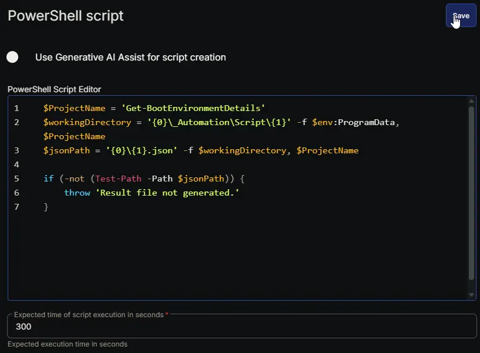

#### Row 4: PowerShell script

- **Notes:** `SB_OEM_Updates_Count`  
- **Use Generative AI Assist for script creation:** `False`  
- **Expected time of script execution in seconds:** `300`  
- **Continue on Failure:** `True`  
- **Run As:** `System`  
- **Operating System:** `Windows`  
- **PowerShell Script Editor:**

```PowerShell
$ProjectName = 'Get-BootEnvironmentDetails'
$workingDirectory = '{0}\_Automation\Script\{1}' -f $env:ProgramData, $ProjectName
$jsonPath = '{0}\{1}.json' -f $workingDirectory, $ProjectName
(Get-Content -Path $jsonPath | ConvertFrom-Json).SB_OEM_Updates_Count
```

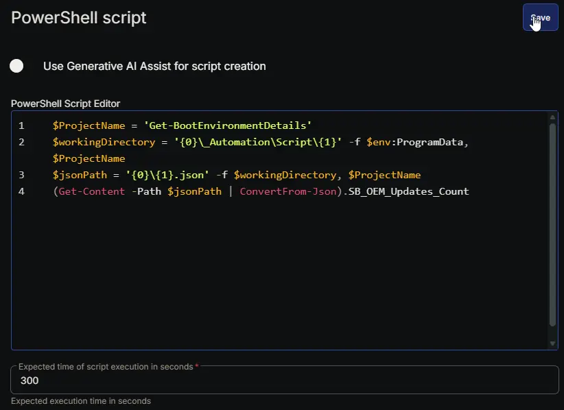

#### Row 5: Set Custom Field ( SB_OEM_Updates_Count = %Output% )

- **Notes:** `SB_OEM_Updates_Count`  
- **Custom Field:** `SB_OEM_Updates_Count`  
- **Value:** `%Output%`  
- **Continue on Failure:** `True`  
- **Operating System:** `Windows`

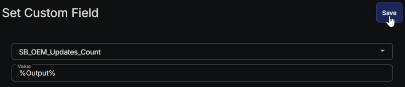

#### Row 6: PowerShell script

- **Notes:** `SB_SecureBoot_Status`
- **Use Generative AI Assist for script creation:** `False`
- **Expected time of script execution in seconds:** `300`
- **Continue on Failure:** `True`
- **Run As:** `System`
- **Operating System:** `Windows`
- **PowerShell Script Editor:**

```PowerShell
$ProjectName = 'Get-BootEnvironmentDetails'
$workingDirectory = '{0}\_Automation\Script\{1}' -f $env:ProgramData, $ProjectName
$jsonPath = '{0}\{1}.json' -f $workingDirectory, $ProjectName
(Get-Content -Path $jsonPath | ConvertFrom-Json).SB_SecureBoot_Status
```

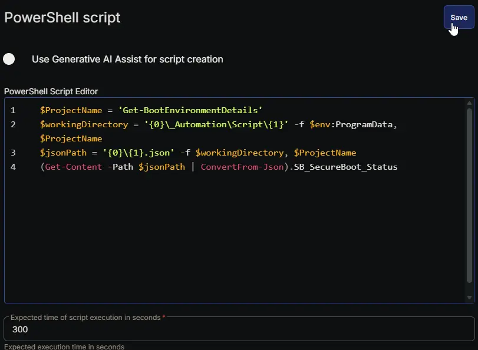

#### Row 7: Set Custom Field ( SB_SecureBoot_Status = %Output% )

- **Notes:** `SB_SecureBoot_Status`
- **Custom Field:** `SB_SecureBoot_Status`
- **Value:** `%Output%`
- **Continue on Failure:** `True`
- **Operating System:** `Windows`

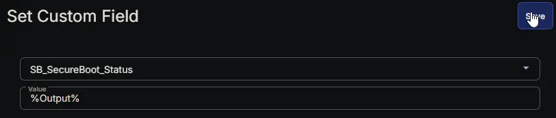

#### Row 8: PowerShell script

- **Notes:** `SB_Telemetry_Status`
- **Use Generative AI Assist for script creation:** `False`
- **Expected time of script execution in seconds:** `300`
- **Continue on Failure:** `True`
- **Run As:** `System`
- **Operating System:** `Windows`
- **PowerShell Script Editor:**

```PowerShell
$ProjectName = 'Get-BootEnvironmentDetails'
$workingDirectory = '{0}\_Automation\Script\{1}' -f $env:ProgramData, $ProjectName
$jsonPath = '{0}\{1}.json' -f $workingDirectory, $ProjectName
(Get-Content -Path $jsonPath | ConvertFrom-Json).SB_Telemetry_Status
```

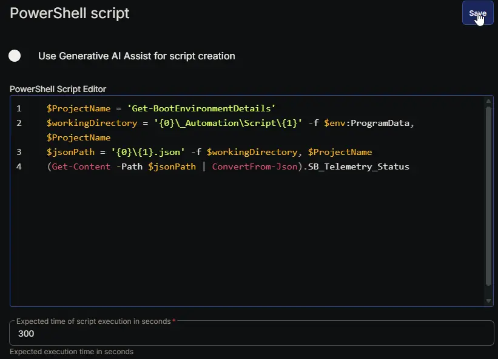

#### Row 9: Set Custom Field ( SB_Telemetry_Status = %Output% )

- **Notes:** `SB_Telemetry_Status`
- **Custom Field:** `SB_Telemetry_Status`
- **Value:** `%Output%`
- **Continue on Failure:** `True`
- **Operating System:** `Windows`

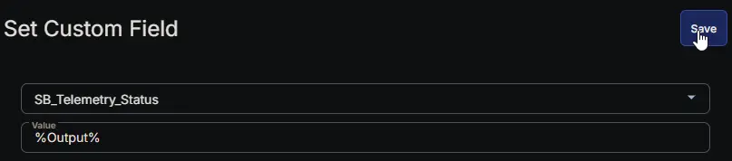

#### Row 10: PowerShell script

- **Notes:** `SB_DB_Certificate_Status`
- **Use Generative AI Assist for script creation:** `False`
- **Expected time of script execution in seconds:** `300`
- **Continue on Failure:** `True`
- **Run As:** `System`
- **Operating System:** `Windows`
- **PowerShell Script Editor:**

```PowerShell
$ProjectName = 'Get-BootEnvironmentDetails'
$workingDirectory = '{0}\_Automation\Script\{1}' -f $env:ProgramData, $ProjectName
$jsonPath = '{0}\{1}.json' -f $workingDirectory, $ProjectName
(Get-Content -Path $jsonPath | ConvertFrom-Json).SB_DB_Certificate_Status
```

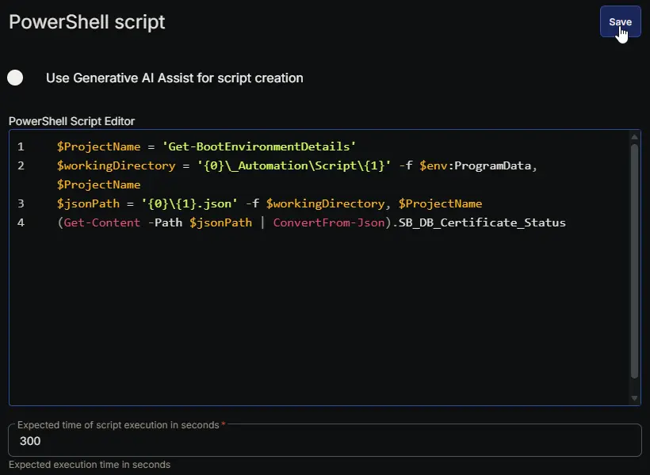

#### Row 11: Set Custom Field ( SB_DB_Certificate_Status = %Output% )

- **Notes:** `SB_DB_Certificate_Status`
- **Custom Field:** `SB_DB_Certificate_Status`
- **Value:** `%Output%`
- **Continue on Failure:** `True`
- **Operating System:** `Windows`

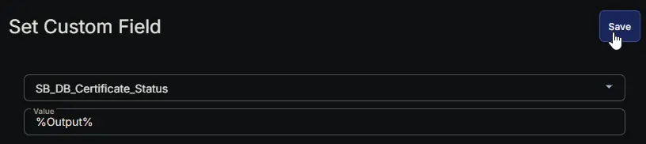

#### Row 12: PowerShell script

- **Notes:** `SB_KEK_Certificate_Status`
- **Use Generative AI Assist for script creation:** `False`
- **Expected time of script execution in seconds:** `300`
- **Continue on Failure:** `True`
- **Run As:** `System`
- **Operating System:** `Windows`
- **PowerShell Script Editor:**

```PowerShell
$ProjectName = 'Get-BootEnvironmentDetails'
$workingDirectory = '{0}\_Automation\Script\{1}' -f $env:ProgramData, $ProjectName
$jsonPath = '{0}\{1}.json' -f $workingDirectory, $ProjectName
(Get-Content -Path $jsonPath | ConvertFrom-Json).SB_KEK_Certificate_Status
```

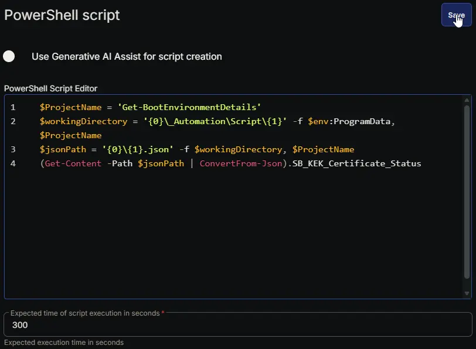

#### Row 13: Set Custom Field ( SB_KEK_Certificate_Status = %Output% )

- **Notes:** `SB_KEK_Certificate_Status`
- **Custom Field:** `SB_KEK_Certificate_Status`
- **Value:** `%Output%`
- **Continue on Failure:** `True`
- **Operating System:** `Windows`

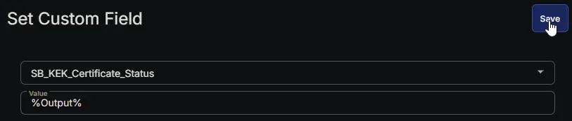

#### Row 14: PowerShell script

- **Notes:** `SB_DBDefault_Certificate_Status`
- **Use Generative AI Assist for script creation:** `False`
- **Expected time of script execution in seconds:** `300`
- **Continue on Failure:** `True`
- **Run As:** `System`
- **Operating System:** `Windows`
- **PowerShell Script Editor:**

```PowerShell
$ProjectName = 'Get-BootEnvironmentDetails'
$workingDirectory = '{0}\_Automation\Script\{1}' -f $env:ProgramData, $ProjectName
$jsonPath = '{0}\{1}.json' -f $workingDirectory, $ProjectName
(Get-Content -Path $jsonPath | ConvertFrom-Json).SB_DBDefault_Certificate_Status
```

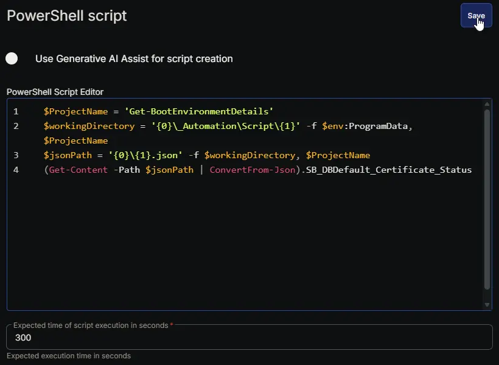

#### Row 15: Set Custom Field ( SB_DBDefault_Certificate_Status = %Output% )

- **Notes:** `SB_DBDefault_Certificate_Status`
- **Custom Field:** `SB_DBDefault_Certificate_Status`
- **Value:** `%Output%`
- **Continue on Failure:** `True`
- **Operating System:** `Windows`

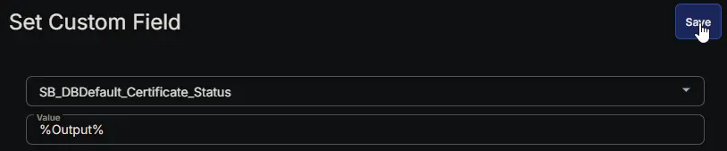

#### Row 16: PowerShell script

- **Notes:** `SB_Current_Cumulative_Update`
- **Use Generative AI Assist for script creation:** `False`
- **Expected time of script execution in seconds:** `300`
- **Continue on Failure:** `True`
- **Run As:** `System`
- **Operating System:** `Windows`
- **PowerShell Script Editor:**

```PowerShell
$ProjectName = 'Get-BootEnvironmentDetails'
$workingDirectory = '{0}\_Automation\Script\{1}' -f $env:ProgramData, $ProjectName
$jsonPath = '{0}\{1}.json' -f $workingDirectory, $ProjectName
(Get-Content -Path $jsonPath | ConvertFrom-Json).SB_Current_Cumulative_Update
```

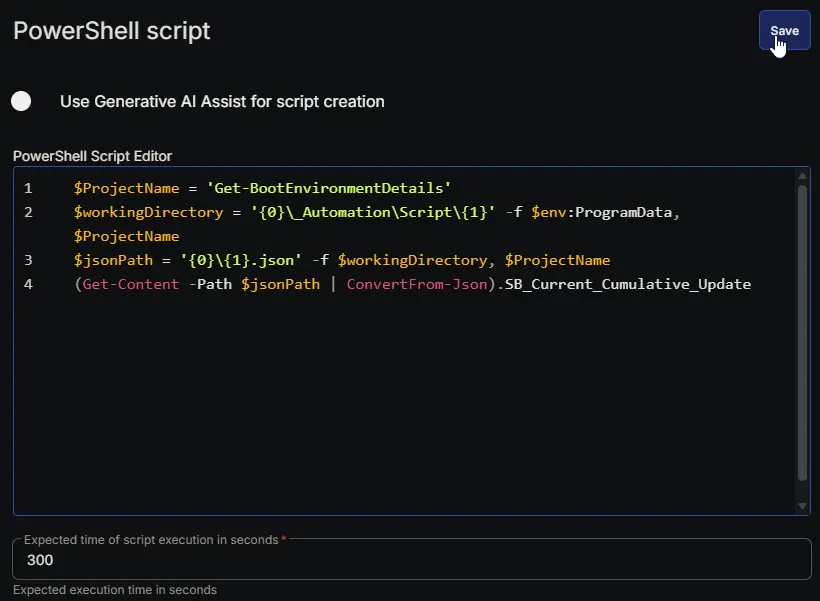

#### Row 17: Set Custom Field ( SB_Current_Cumulative_Update = %Output% )

- **Notes:** `SB_Current_Cumulative_Update`
- **Custom Field:** `SB_Current_Cumulative_Update`
- **Value:** `%Output%`
- **Continue on Failure:** `True`
- **Operating System:** `Windows`

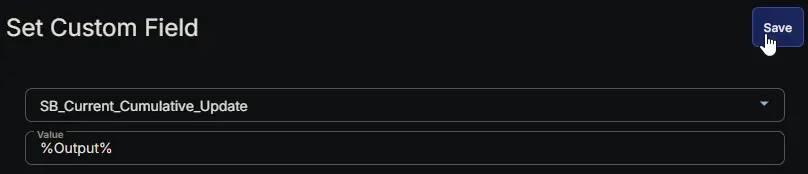

#### Row 18: PowerShell script

- **Notes:** `SB_Nov_2025_CU_Installed`
- **Use Generative AI Assist for script creation:** `False`
- **Expected time of script execution in seconds:** `300`
- **Continue on Failure:** `True`
- **Run As:** `System`
- **Operating System:** `Windows`
- **PowerShell Script Editor:**

```PowerShell
$ProjectName = 'Get-BootEnvironmentDetails'
$workingDirectory = '{0}\_Automation\Script\{1}' -f $env:ProgramData, $ProjectName
$jsonPath = '{0}\{1}.json' -f $workingDirectory, $ProjectName
(Get-Content -Path $jsonPath | ConvertFrom-Json).SB_Nov_2025_CU_Installed
```

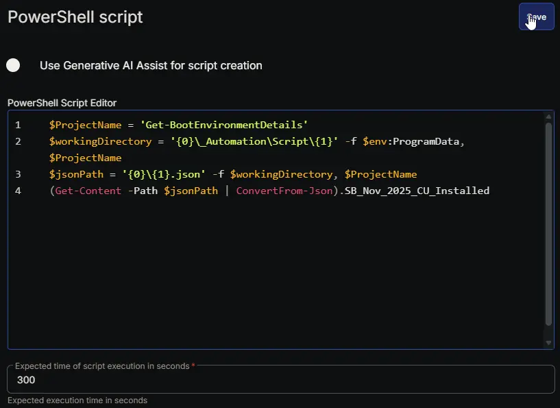

#### Row 19: Set Custom Field ( SB_Nov_2025_CU_Installed = %Output% )

- **Notes:** `SB_Nov_2025_CU_Installed`
- **Custom Field:** `SB_Nov_2025_CU_Installed`
- **Value:** `%Output%`
- **Continue on Failure:** `True`
- **Operating System:** `Windows`

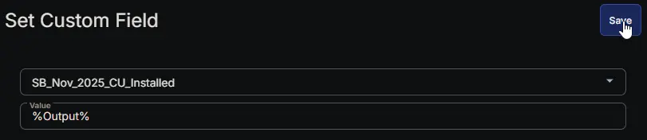

#### Row 20: PowerShell script

- **Notes:** `SB_BiosVersion`
- **Use Generative AI Assist for script creation:** `False`
- **Expected time of script execution in seconds:** `300`
- **Continue on Failure:** `True`
- **Run As:** `System`
- **Operating System:** `Windows`
- **PowerShell Script Editor:**

```PowerShell
$ProjectName = 'Get-BootEnvironmentDetails'
$workingDirectory = '{0}\_Automation\Script\{1}' -f $env:ProgramData, $ProjectName
$jsonPath = '{0}\{1}.json' -f $workingDirectory, $ProjectName
(Get-Content -Path $jsonPath | ConvertFrom-Json).SB_BiosVersion
```

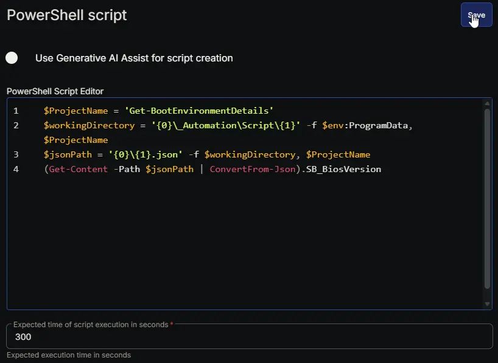

#### Row 21: Set Custom Field ( SB_BiosVersion = %Output% )

- **Notes:** `SB_BiosVersion`
- **Custom Field:** `SB_BiosVersion`
- **Value:** `%Output%`
- **Continue on Failure:** `True`
- **Operating System:** `Windows`

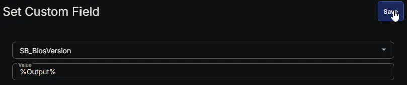

#### Row 22: PowerShell script

- **Notes:** `SB_CA2023_Supported_BIOS_Version`
- **Use Generative AI Assist for script creation:** `False`
- **Expected time of script execution in seconds:** `300`
- **Continue on Failure:** `True`
- **Run As:** `System`
- **Operating System:** `Windows`
- **PowerShell Script Editor:**

```PowerShell
$ProjectName = 'Get-BootEnvironmentDetails'
$workingDirectory = '{0}\_Automation\Script\{1}' -f $env:ProgramData, $ProjectName
$jsonPath = '{0}\{1}.json' -f $workingDirectory, $ProjectName
(Get-Content -Path $jsonPath | ConvertFrom-Json).SB_CA2023_Supported_BIOS_Version
```

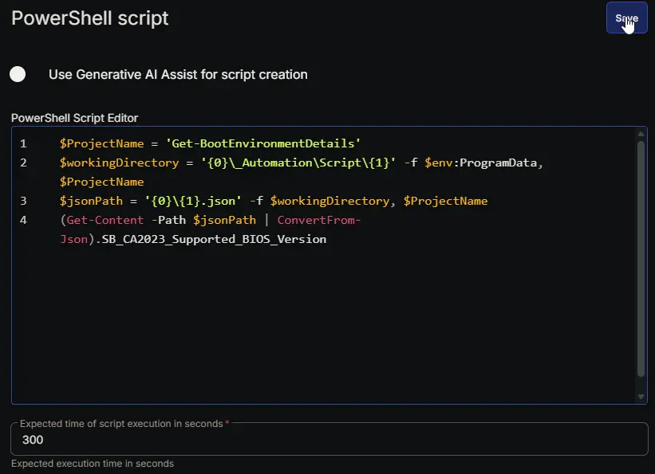

#### Row 23: Set Custom Field ( SB_CA2023_Supported_BIOS_Version = %Output% )

- **Notes:** `SB_CA2023_Supported_BIOS_Version`
- **Custom Field:** `SB_CA2023_Supported_BIOS_Version`
- **Value:** `%Output%`
- **Continue on Failure:** `True`
- **Operating System:** `Windows`

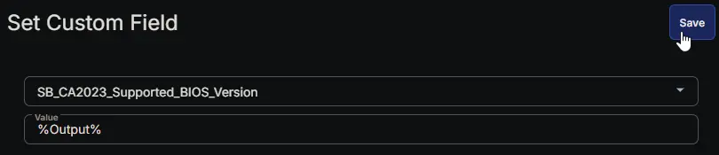

#### Row 24: PowerShell script

- **Notes:** `SB_PXE_Present`
- **Use Generative AI Assist for script creation:** `False`
- **Expected time of script execution in seconds:** `300`
- **Continue on Failure:** `True`
- **Run As:** `System`
- **Operating System:** `Windows`
- **PowerShell Script Editor:**

```PowerShell
$ProjectName = 'Get-BootEnvironmentDetails'
$workingDirectory = '{0}\_Automation\Script\{1}' -f $env:ProgramData, $ProjectName
$jsonPath = '{0}\{1}.json' -f $workingDirectory, $ProjectName
(Get-Content -Path $jsonPath | ConvertFrom-Json).SB_PXE_Present
```

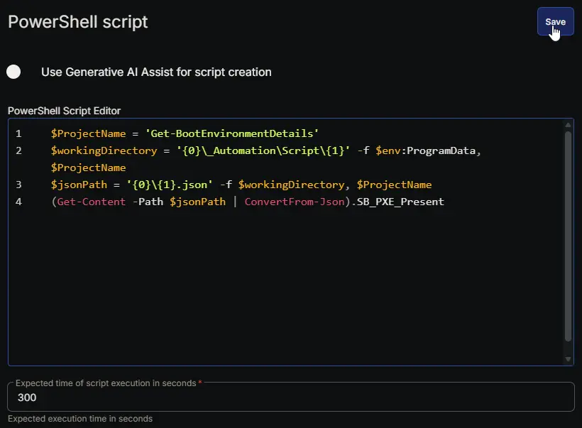

#### Row 25: Set Custom Field ( SB_PXE_Present = %Output% )

- **Notes:** `SB_PXE_Present`
- **Custom Field:** `SB_PXE_Present`
- **Value:** `%Output%`
- **Continue on Failure:** `True`
- **Operating System:** `Windows`

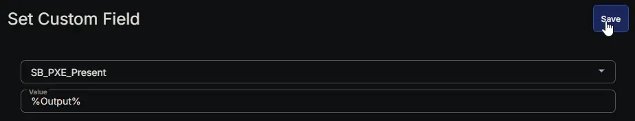

#### Row 26: PowerShell script

- **Notes:** `SB_DualBoot_Or_NonWindowsEFI`
- **Use Generative AI Assist for script creation:** `False`
- **Expected time of script execution in seconds:** `300`
- **Continue on Failure:** `True`
- **Run As:** `System`
- **Operating System:** `Windows`
- **PowerShell Script Editor:**

```PowerShell
$ProjectName = 'Get-BootEnvironmentDetails'
$workingDirectory = '{0}\_Automation\Script\{1}' -f $env:ProgramData, $ProjectName
$jsonPath = '{0}\{1}.json' -f $workingDirectory, $ProjectName
(Get-Content -Path $jsonPath | ConvertFrom-Json).SB_DualBoot_Or_NonWindowsEFI
```

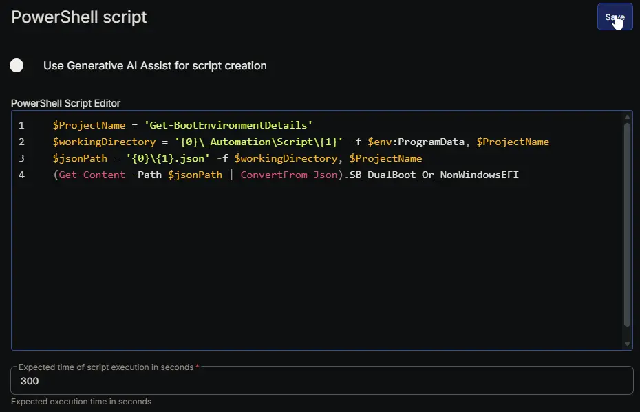

#### Row 27: Set Custom Field ( SB_DualBoot_Or_NonWindowsEFI = %Output% )

- **Notes:** `SB_DualBoot_Or_NonWindowsEFI`
- **Custom Field:** `SB_DualBoot_Or_NonWindowsEFI`
- **Value:** `%Output%`
- **Continue on Failure:** `True`
- **Operating System:** `Windows`

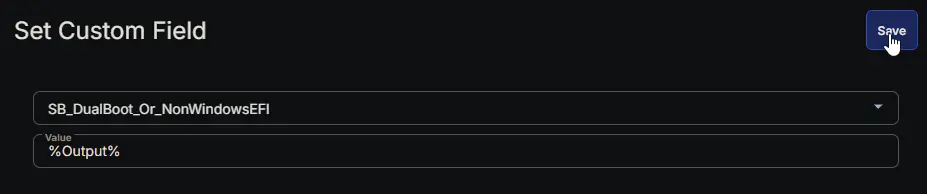

#### Row 28: PowerShell script

- **Notes:** `SB_WinRE_Enabled`
- **Use Generative AI Assist for script creation:** `False`
- **Expected time of script execution in seconds:** `300`
- **Continue on Failure:** `True`
- **Run As:** `System`
- **Operating System:** `Windows`
- **PowerShell Script Editor:**

```PowerShell
$ProjectName = 'Get-BootEnvironmentDetails'
$workingDirectory = '{0}\_Automation\Script\{1}' -f $env:ProgramData, $ProjectName
$jsonPath = '{0}\{1}.json' -f $workingDirectory, $ProjectName
(Get-Content -Path $jsonPath | ConvertFrom-Json).SB_WinRE_Enabled
```

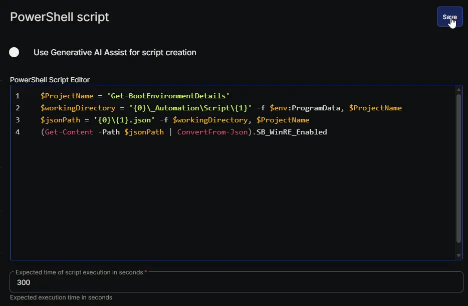

#### Row 29: Set Custom Field ( SB_WinRE_Enabled = %Output% )

- **Notes:** `SB_WinRE_Enabled`
- **Custom Field:** `SB_WinRE_Enabled`
- **Value:** `%Output%`
- **Continue on Failure:** `True`
- **Operating System:** `Windows`

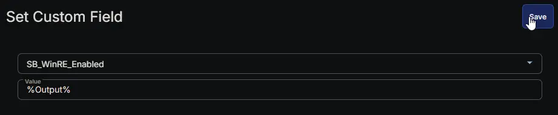

#### Row 30: PowerShell script

- **Notes:** `SB_Present_Conditions`
- **Use Generative AI Assist for script creation:** `False`
- **Expected time of script execution in seconds:** `300`
- **Continue on Failure:** `True`
- **Run As:** `System`
- **Operating System:** `Windows`
- **PowerShell Script Editor:**

```PowerShell
$ProjectName = 'Get-BootEnvironmentDetails'
$workingDirectory = '{0}\_Automation\Script\{1}' -f $env:ProgramData, $ProjectName
$jsonPath = '{0}\{1}.json' -f $workingDirectory, $ProjectName
(Get-Content -Path $jsonPath | ConvertFrom-Json).SB_Present_Conditions
```

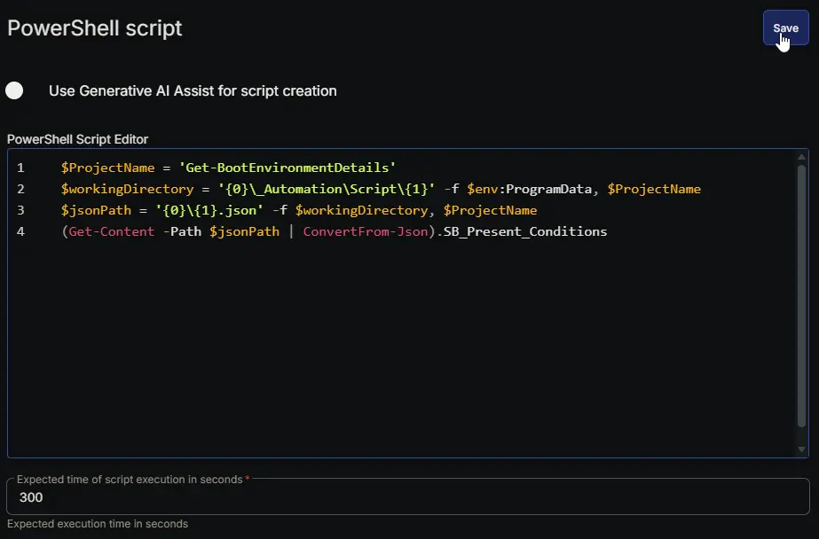

#### Row 31: Set Custom Field ( SB_Present_Conditions = %Output% )

- **Notes:** `SB_Present_Conditions`
- **Custom Field:** `SB_Present_Conditions`
- **Value:** `%Output%`
- **Continue on Failure:** `True`
- **Operating System:** `Windows`

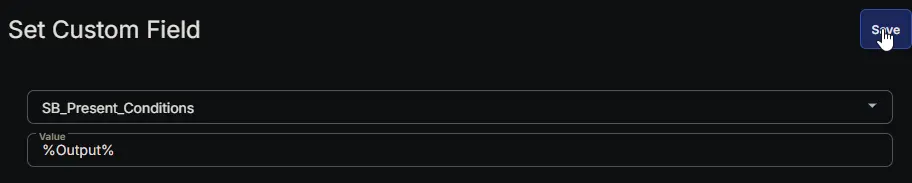

#### Row 32: PowerShell script

- **Notes:** `SB_PXE_Evidence`
- **Use Generative AI Assist for script creation:** `False`
- **Expected time of script execution in seconds:** `300`
- **Continue on Failure:** `True`
- **Run As:** `System`
- **Operating System:** `Windows`
- **PowerShell Script Editor:**

```PowerShell
$ProjectName = 'Get-BootEnvironmentDetails'
$workingDirectory = '{0}\_Automation\Script\{1}' -f $env:ProgramData, $ProjectName
$jsonPath = '{0}\{1}.json' -f $workingDirectory, $ProjectName
(Get-Content -Path $jsonPath | ConvertFrom-Json).SB_PXE_Evidence
```

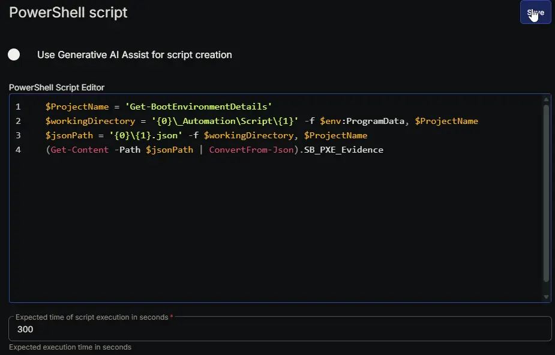

#### Row 33: Set Custom Field ( SB_PXE_Evidence = %Output% )

- **Notes:** `SB_PXE_Evidence`
- **Custom Field:** `SB_PXE_Evidence`
- **Value:** `%Output%`
- **Continue on Failure:** `True`
- **Operating System:** `Windows`

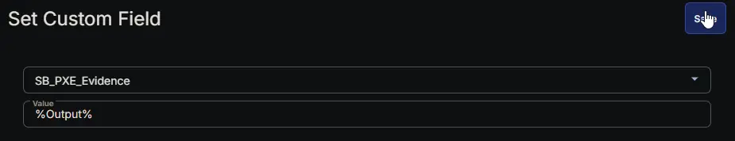

#### Row 34: PowerShell script

- **Notes:** `SB_DualBoot_Evidence`
- **Use Generative AI Assist for script creation:** `False`
- **Expected time of script execution in seconds:** `300`
- **Continue on Failure:** `True`
- **Run As:** `System`
- **Operating System:** `Windows`
- **PowerShell Script Editor:**

```PowerShell
$ProjectName = 'Get-BootEnvironmentDetails'
$workingDirectory = '{0}\_Automation\Script\{1}' -f $env:ProgramData, $ProjectName
$jsonPath = '{0}\{1}.json' -f $workingDirectory, $ProjectName
(Get-Content -Path $jsonPath | ConvertFrom-Json).SB_DualBoot_Evidence
```

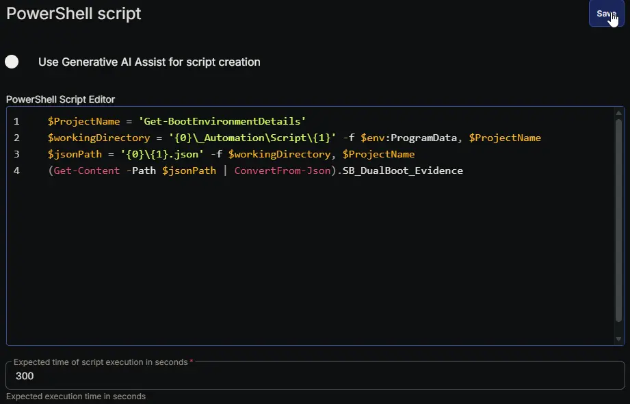

#### Row 35: Set Custom Field ( SB_DualBoot_Evidence = %Output% )

- **Notes:** `SB_DualBoot_Evidence`
- **Custom Field:** `SB_DualBoot_Evidence`
- **Value:** `%Output%`
- **Continue on Failure:** `True`
- **Operating System:** `Windows`

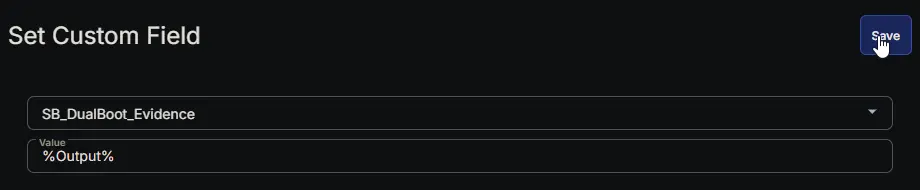

#### Row 36: PowerShell script

- **Notes:** `SB_Available_Updates`
- **Use Generative AI Assist for script creation:** `False`
- **Expected time of script execution in seconds:** `300`
- **Continue on Failure:** `True`
- **Run As:** `System`
- **Operating System:** `Windows`
- **PowerShell Script Editor:**

```PowerShell
$ProjectName = 'Get-BootEnvironmentDetails'
$workingDirectory = '{0}\_Automation\Script\{1}' -f $env:ProgramData, $ProjectName
$jsonPath = '{0}\{1}.json' -f $workingDirectory, $ProjectName
(Get-Content -Path $jsonPath | ConvertFrom-Json).SB_Available_Updates
```


#### Row 37: Set Custom Field ( SB_Available_Updates = %Output% )

- **Notes:** `SB_Available_Updates`
- **Custom Field:** `SB_Available_Updates`
- **Value:** `%Output%`
- **Continue on Failure:** `True`
- **Operating System:** `Windows`

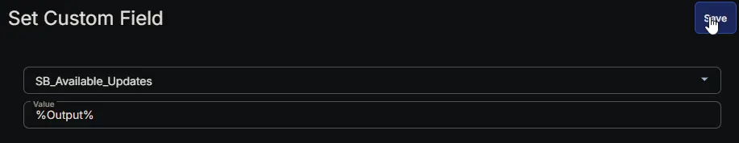

#### Row 38: PowerShell script

- **Notes:** `SB_UEFICA2023_Status`
- **Use Generative AI Assist for script creation:** `False`
- **Expected time of script execution in seconds:** `300`
- **Continue on Failure:** `True`
- **Run As:** `System`
- **Operating System:** `Windows`
- **PowerShell Script Editor:**

```PowerShell
$ProjectName = 'Get-BootEnvironmentDetails'
$workingDirectory = '{0}\_Automation\Script\{1}' -f $env:ProgramData, $ProjectName
$jsonPath = '{0}\{1}.json' -f $workingDirectory, $ProjectName
(Get-Content -Path $jsonPath | ConvertFrom-Json).SB_UEFICA2023_Status
```

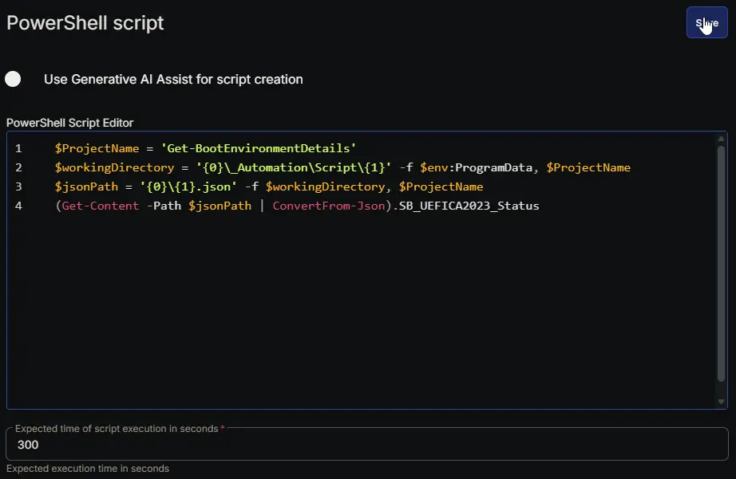

#### Row 39: Set Custom Field ( SB_UEFICA2023_Status = %Output% )

- **Notes:** `SB_UEFICA2023_Status`
- **Custom Field:** `SB_UEFICA2023_Status`
- **Value:** `%Output%`
- **Continue on Failure:** `True`
- **Operating System:** `Windows`

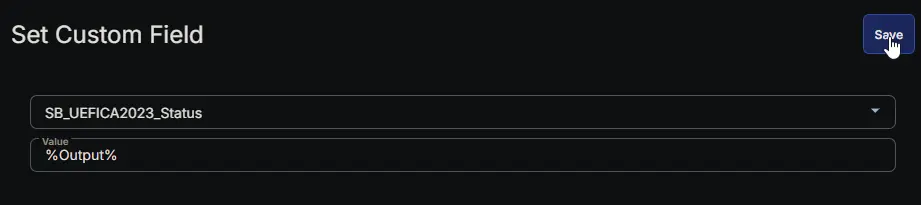

#### Row 40: PowerShell script

- **Notes:** `SB_UEFICA2023_Error`
- **Use Generative AI Assist for script creation:** `False`
- **Expected time of script execution in seconds:** `300`
- **Continue on Failure:** `True`
- **Run As:** `System`
- **Operating System:** `Windows`
- **PowerShell Script Editor:**

```PowerShell
$ProjectName = 'Get-BootEnvironmentDetails'
$workingDirectory = '{0}\_Automation\Script\{1}' -f $env:ProgramData, $ProjectName
$jsonPath = '{0}\{1}.json' -f $workingDirectory, $ProjectName
(Get-Content -Path $jsonPath | ConvertFrom-Json).SB_UEFICA2023_Error
```


#### Row 41: Set Custom Field ( SB_UEFICA2023_Error = %Output% )

- **Notes:** `SB_UEFICA2023_Error`
- **Custom Field:** `SB_UEFICA2023_Error`
- **Value:** `%Output%`
- **Continue on Failure:** `True`
- **Operating System:** `Windows`

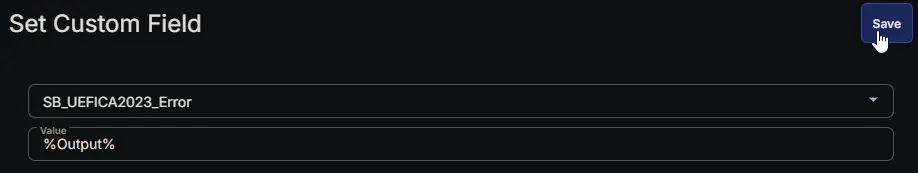

#### Row 42: PowerShell script

- **Notes:** `SB_WindowsUEFICA2023_Capable`
- **Use Generative AI Assist for script creation:** `False`
- **Expected time of script execution in seconds:** `300`
- **Continue on Failure:** `True`
- **Run As:** `System`
- **Operating System:** `Windows`
- **PowerShell Script Editor:**

```PowerShell
$ProjectName = 'Get-BootEnvironmentDetails'
$workingDirectory = '{0}\_Automation\Script\{1}' -f $env:ProgramData, $ProjectName
$jsonPath = '{0}\{1}.json' -f $workingDirectory, $ProjectName
(Get-Content -Path $jsonPath | ConvertFrom-Json).SB_WindowsUEFICA2023_Capable
```

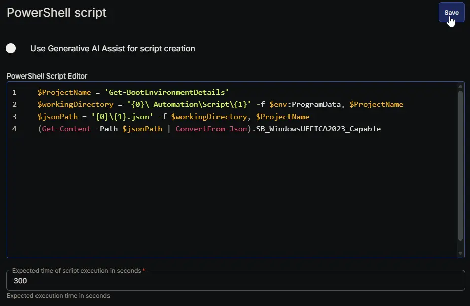

#### Row 43: Set Custom Field ( SB_WindowsUEFICA2023_Capable = %Output% )

- **Notes:** `SB_WindowsUEFICA2023_Capable`
- **Custom Field:** `SB_WindowsUEFICA2023_Capable`
- **Value:** `%Output%`
- **Continue on Failure:** `True`
- **Operating System:** `Windows`

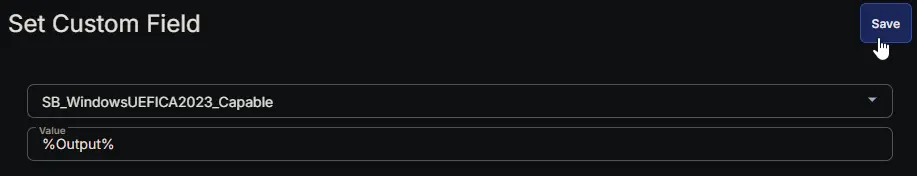

#### Row 44: PowerShell script

- **Notes:** `SB_Confidence_Level`
- **Use Generative AI Assist for script creation:** `False`
- **Expected time of script execution in seconds:** `300`
- **Continue on Failure:** `True`
- **Run As:** `System`
- **Operating System:** `Windows`
- **PowerShell Script Editor:**

```PowerShell
$ProjectName = 'Get-BootEnvironmentDetails'
$workingDirectory = '{0}\_Automation\Script\{1}' -f $env:ProgramData, $ProjectName
$jsonPath = '{0}\{1}.json' -f $workingDirectory, $ProjectName
(Get-Content -Path $jsonPath | ConvertFrom-Json).SB_Confidence_Level
```

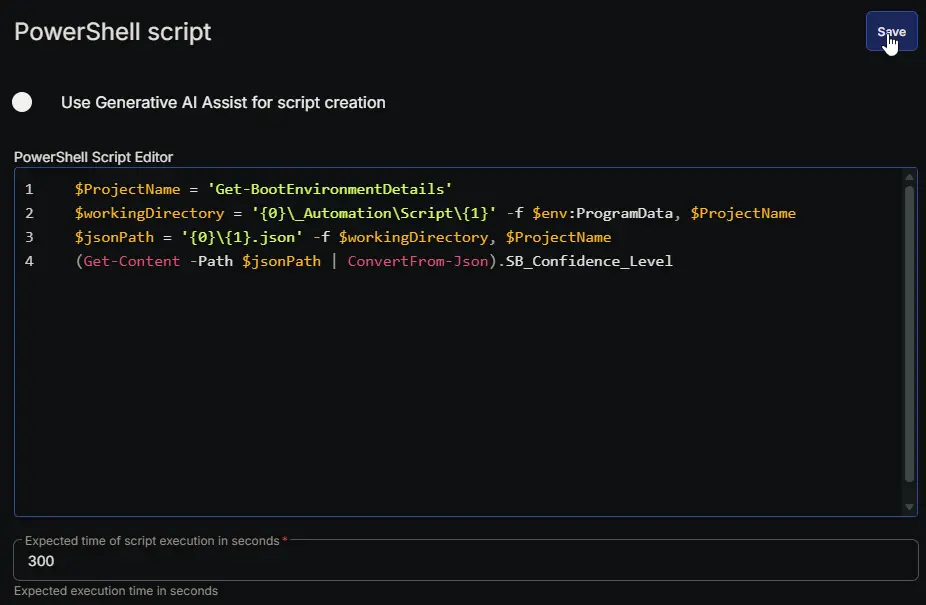

#### Row 45: Set Custom Field ( SB_Confidence_Level = %Output% )

- **Notes:** `SB_Confidence_Level`
- **Custom Field:** `SB_Confidence_Level`
- **Value:** `%Output%`
- **Continue on Failure:** `True`
- **Operating System:** `Windows`

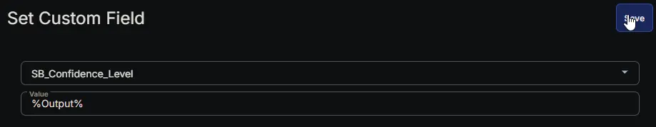

#### Row 46: PowerShell script

- **Notes:** `SB_Confidence_Update_Type`
- **Use Generative AI Assist for script creation:** `False`
- **Expected time of script execution in seconds:** `300`
- **Continue on Failure:** `True`
- **Run As:** `System`
- **Operating System:** `Windows`
- **PowerShell Script Editor:**

```PowerShell
$ProjectName = 'Get-BootEnvironmentDetails'
$workingDirectory = '{0}\_Automation\Script\{1}' -f $env:ProgramData, $ProjectName
$jsonPath = '{0}\{1}.json' -f $workingDirectory, $ProjectName
(Get-Content -Path $jsonPath | ConvertFrom-Json).SB_Confidence_Update_Type
```

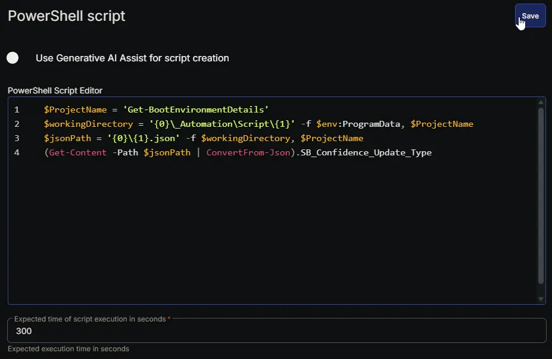

#### Row 47: Set Custom Field ( SB_Confidence_Update_Type = %Output% )

- **Notes:** `SB_Confidence_Update_Type`
- **Custom Field:** `SB_Confidence_Update_Type`
- **Value:** `%Output%`
- **Continue on Failure:** `True`
- **Operating System:** `Windows`

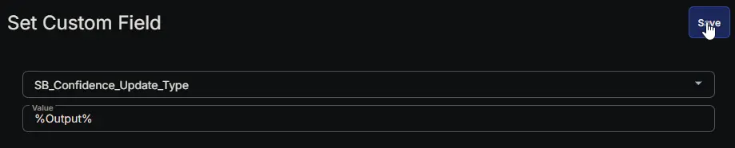

#### Row 48: PowerShell script

- **Notes:** `SB_BucketHash`
- **Use Generative AI Assist for script creation:** `False`
- **Expected time of script execution in seconds:** `300`
- **Continue on Failure:** `True`
- **Run As:** `System`
- **Operating System:** `Windows`
- **PowerShell Script Editor:**

```PowerShell
$ProjectName = 'Get-BootEnvironmentDetails'
$workingDirectory = '{0}\_Automation\Script\{1}' -f $env:ProgramData, $ProjectName
$jsonPath = '{0}\{1}.json' -f $workingDirectory, $ProjectName
(Get-Content -Path $jsonPath | ConvertFrom-Json).SB_BucketHash
```

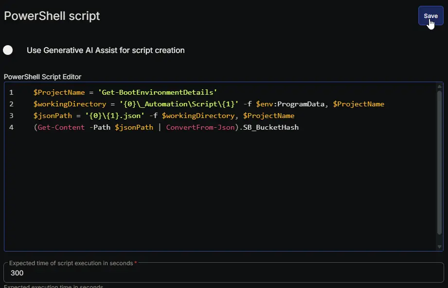

#### Row 49: Set Custom Field ( SB_BucketHash = %Output% )

- **Notes:** `SB_BucketHash`
- **Custom Field:** `SB_BucketHash`
- **Value:** `%Output%`
- **Continue on Failure:** `True`
- **Operating System:** `Windows`

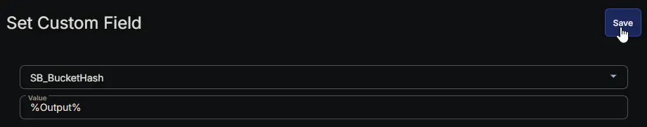

#### Row 50: PowerShell script

- **Notes:** `SB_Data_Collection_Time`
- **Use Generative AI Assist for script creation:** `False`
- **Expected time of script execution in seconds:** `300`
- **Continue on Failure:** `True`
- **Run As:** `System`
- **Operating System:** `Windows`
- **PowerShell Script Editor:**

```PowerShell
$ProjectName = 'Get-BootEnvironmentDetails'
$workingDirectory = '{0}\_Automation\Script\{1}' -f $env:ProgramData, $ProjectName
$jsonPath = '{0}\{1}.json' -f $workingDirectory, $ProjectName
(Get-Content -Path $jsonPath | ConvertFrom-Json).SB_Data_Collection_Time
```

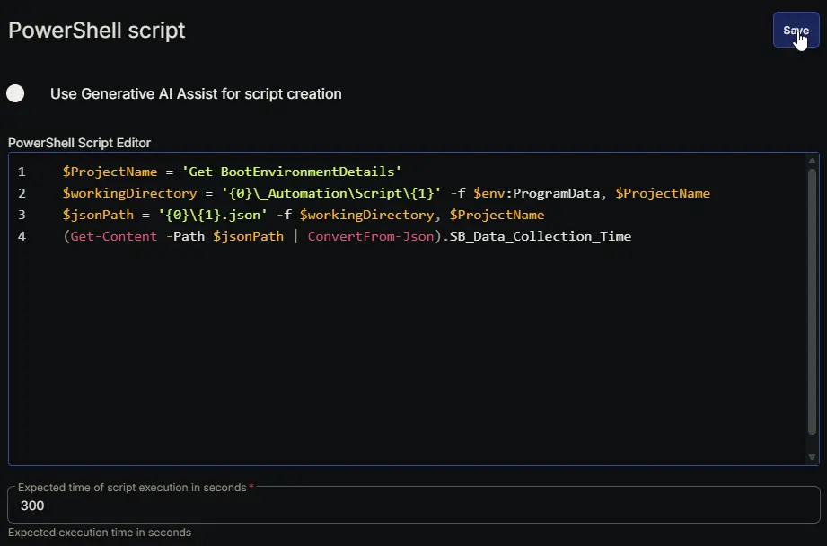

#### Row 51: Set Custom Field ( SB_Data_Collection_Time = %Output% )

- **Notes:** `SB_Data_Collection_Time`
- **Custom Field:** `SB_Data_Collection_Time`
- **Value:** `%Output%`
- **Continue on Failure:** `True`
- **Operating System:** `Windows`

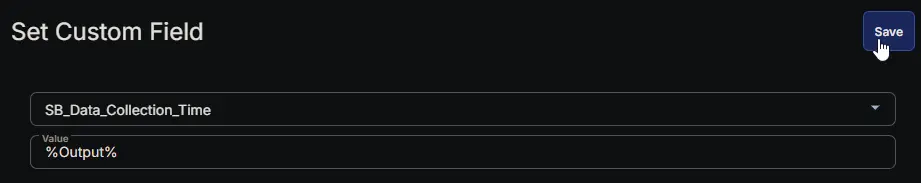

#### Row 52: Set Custom Field ( Boot Environment Audit = 1 )

- **Notes:** `Boot Environment Audit`
- **Custom Field:** `Boot Environment Audit`
- **Value:** `1`
- **Continue on Failure:** `True`
- **Operating System:** `Windows`

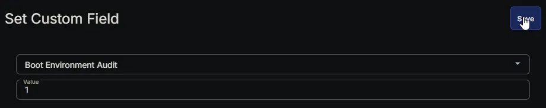

## Completed Script

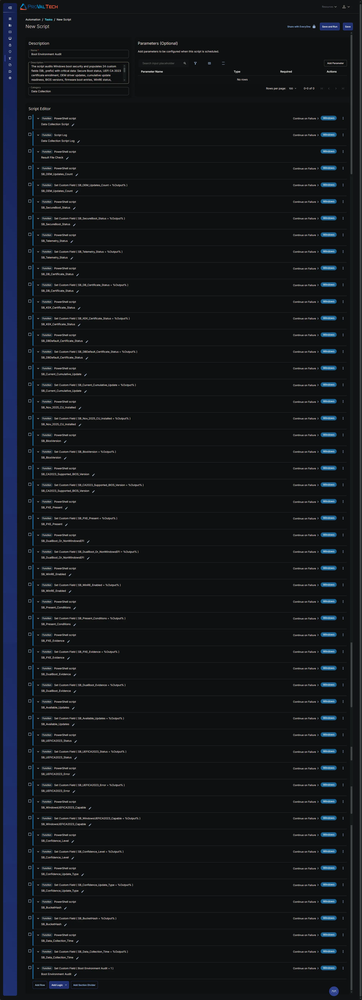

## Output

- Script Log
- Custom Fields

## Changelog

### 2025-05-14

- Initial version of the document
