---
id: '21f7afea-94a7-4bd9-b46f-7f8a20819eb7'
slug: /21f7afea-94a7-4bd9-b46f-7f8a20819eb7
title: 'BSOD Monitoring Configuration Writer'
title_meta: 'BSOD Monitoring Configuration Writer'
keywords: ['BSOD', 'bluescreen', 'crashdump']
description: 'Creates and maintains the JSON configuration file used by the BSOD Monitoring monitor.'
tags: ['bluescreen', 'alerting', 'application']
draft: false
unlisted: false
last_update:
  date: 2026-07-21
---


## Summary

Creates and maintains the JSON configuration file used by [Monitor : BSOD Monitoring](/docs/e239e458-56e6-4859-ab30-a7592366b824). The script applies hierarchical RMM variable overrides to define the BSOD event threshold and monitoring period. The actual BSOD detection and alerting logic is performed by an external monitor set that reads and evaluates this configuration file.

### How It Works

1. **CW RMM Variable Evaluation**
   The script reads the BSOD monitoring settings from the configured CW RMM client-level variables:

   * **ClientThreshold** – Maximum number of BSOD-related events allowed before an alert is triggered.
   * **ClientEvaluationDays** – Number of previous days to evaluate for BSOD-related events.

   If either variable is missing or contains an invalid value, the script falls back to the built-in defaults.

2. **Default Values**
   When no valid CW RMM variables are configured, the following defaults are applied:

   * **Threshold** = `3`
   * **Days** = `7`

3. **Configuration File Generation**
   The resolved values are written to the following JSON configuration file:

   ```PlainText
   C:\ProgramData\_Automation\Script\BSODMonitoring\BSODMonitoring.json
   ```

   The file contains two values:

   * **Threshold** – Maximum number of BSOD-related events allowed before an alert is generated.
   * **Days** – Number of previous days to search the Windows System event log for BSOD-related events.

### Sample Scenario 1: Using Default Values

No CW RMM variables are configured. The script uses the built-in defaults and generates the following configuration file:

```json
{
    "Threshold": 3,
    "Days": 7
}
```

### Sample Scenario 2: Using CW RMM Variable Overrides

The administrator configures the following CW RMM variables:

* `ClientThreshold` = `5`
* `ClientEvaluationDays` = `14`

The generated configuration file becomes:

```json
{
    "Threshold": 5,
    "Days": 14
}
```

### Ticketing & Alerting Behavior

* A separate **BSOD Monitoring** monitor reads the configuration file and periodically scans the Windows **System** event log.
* The monitor counts BSOD-related events (**Event IDs 41, 1001, and 6008**) that occurred within the configured number of days.
* If the number of events exceeds the configured **Threshold**, the monitor reports a failure and generates an alert.
* Once the event count falls back within the configured threshold, the monitor returns to a healthy state. If automatic resolution is enabled in the monitor set, the associated alert or ticket is resolved automatically.

## Sample Run

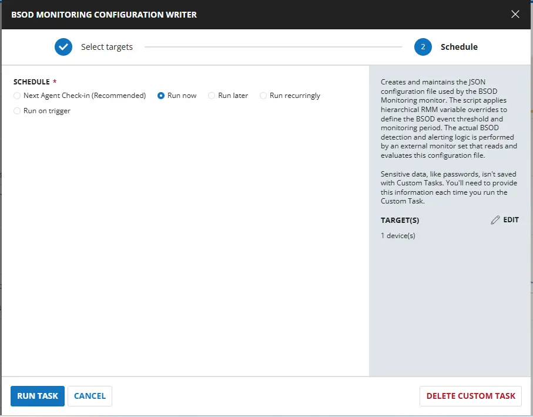

## Dependencies

- [Custom Field: BSOD_Evaluation_Days](/docs/82703d2b-8e7d-4e69-b57b-493977056903)
- [Custom Field: BSOD_Threshold](/docs/94877b6f-56ed-4e42-a33c-55ef441e10bf)
- [Solution: BSOD Monitoring](/docs/fc85a090-94c2-4f91-8055-9c8e52d91ad1)

## Custom Fields

The following table lists all custom fields used by the to determine the BSOD Monitoring. The `Enable` fields are not listed here; they are used exclusively by the automation group to decide whether the script runs at all.

| Name          | Level        | Type     |   Help Text           | Default       | Editable | Description                              |
|----------------------|----------|-----|----------|------------------|----------|---------|
| [Custom Field: BSOD_Evaluation_Days](/docs/82703d2b-8e7d-4e69-b57b-493977056903) | Company | Text |  Number of previous days to check for BSOD-related events in the Windows System event log. Default is 7 days. | - |  Yes  | Number of previous days to check for BSOD-related events in the Windows System event log. Default is 7 days. |
| [Custom Field: BSOD_Threshold](/docs/94877b6f-56ed-4e42-a33c-55ef441e10bf) | Company | Text | Maximum allowed BSOD-related events before triggering an alert. Default Value is '3'. | - |  Yes  | Maximum allowed BSOD-related events before triggering an alert. Default Value is '3'. |

---

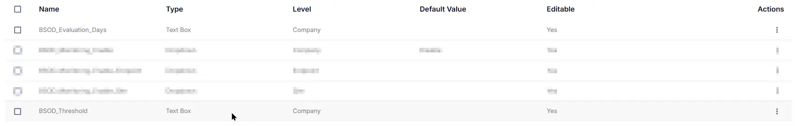

## Task Setup Path

- **Tasks Path:** `AUTOMATION` ➞ `Tasks`  
- **Task Type:** `Script Editor`  

## Task Creation

### **Description**

- **Name:** `BSOD Monitoring Configuration Writer`  
- **Description:** `Creates and maintains the JSON configuration file used by the BSOD Monitoring monitor. The script applies hierarchical RMM variable overrides to define the BSOD event threshold and monitoring period. The actual BSOD detection and alerting logic is performed by an external monitor set that reads and evaluates this configuration file.`  
- **Category:** `Monitoring`

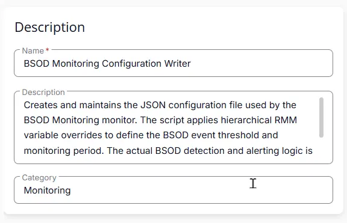

### **Script Editor**

#### **Row 1 Function: Set Pre-defined Variable ( @ClientThreshold@ = BSOD_Threshold)**

- **Notes:** `ClientThreshold`
- **Continue on Failure:** `False`
- **Operating System:** `Windows`
- **Variable Name:** `ClientThreshold`
- **Custom Field:** `BSOD_Threshold`

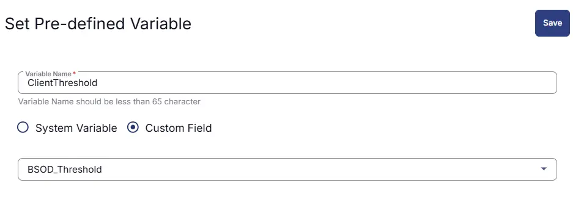

#### **Row 2 Function: Set Pre-defined Variable ( @ClientEvaluationDays@ = BSOD_Evaluation_Days)**

- **Notes:** `ClientEvaluationDays`
- **Continue on Failure:** `False`
- **Operating System:** `Windows`
- **Variable Name:** `ClientEvaluationDays`
- **Custom Field:** `BSOD_Evaluation_Days`

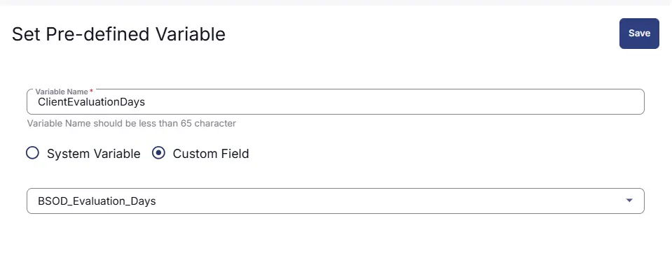

#### **Row 3 Function: PowerShell script**

- **Notes:** `<Leave it Blank>`  
- **Use Generative AI Assist for script creation:** `False`  
- **Expected time of script execution in seconds:** `300`  
- **Continue on Failure:** `False`  
- **Run As:** `System`  
- **Operating System:** `Windows`  
- **PowerShell Script Editor:**

[PowerShell Script](https://github.com/ProVal-Tech/cw-rmm/blob/main/tasks/bsod-monitoring-configuration-writer/script.ps1)


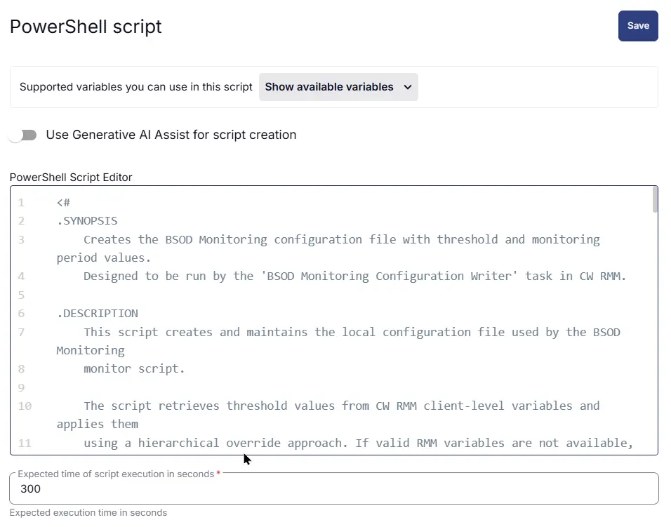

#### **Row 4 Function: Script Log**

- **Notes:** `<Leave it Blank>`  
- **Continue on Failure:** `False`  
- **Operating System:** `Windows`  
- **Script Log Message:** `%Output%`  

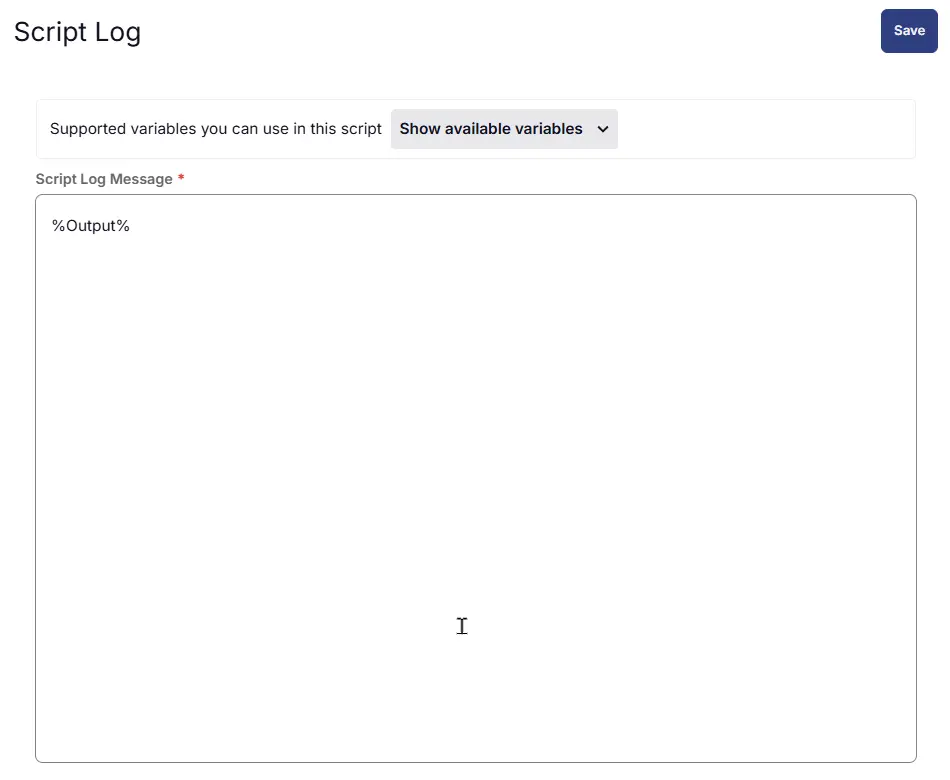

## Completed Script

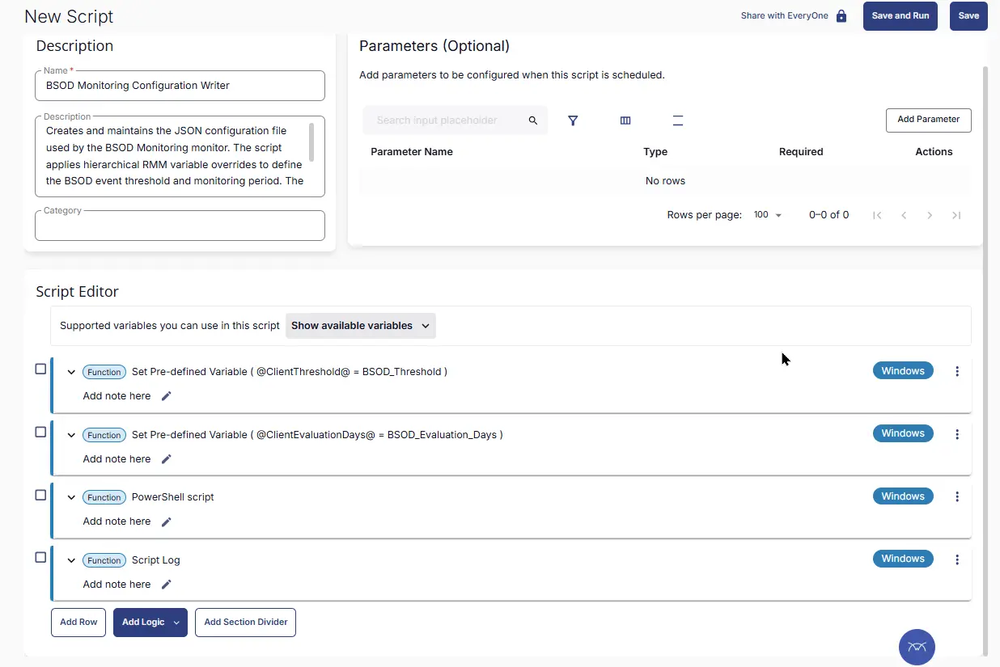

## Output

- Script Log
- JSON File at `C:\ProgramData\_Automation\Script\BSODMonitoring\BSODMonitoring.json`

## Schedule Task

### Task Details

- **Name:** `BSOD Monitoring Configuration Writer`  
- **Description:** `Creates and maintains the JSON configuration file used by the BSOD Monitoring monitor. The script applies hierarchical RMM variable overrides to define the BSOD event threshold and monitoring period. The actual BSOD detection and alerting logic is performed by an external monitor set that reads and evaluates this configuration file.`  
- **Category:** `Monitoring`


### Schedule

- **Schedule Type:**  `Schedule`  
- **Timezone:** `Local Machine Time`  
- **Start:** `<Current Date>`  
- **Trigger:** `Time` `At` `<Current Time>`  
- **Recurrence:** `Every day`
- **Execute at next agent check-in:** `True`
- **Stop After:** `22`
- **Unit:** `Hour(s)`

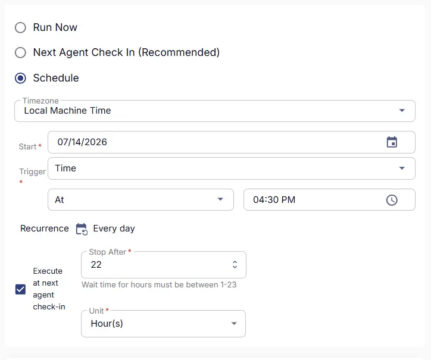

### Targeted Resource

**Device Group:** `BSOD Monitoring`

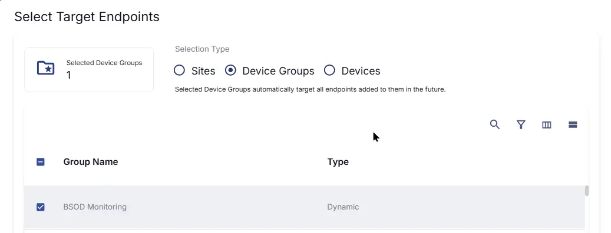

### Completed Scheduled Task

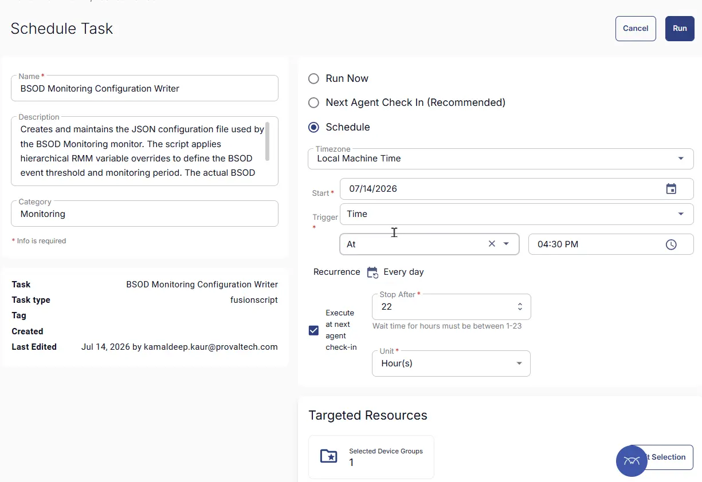

## Changelog

### 2026-07-21

- Initial version of the document

