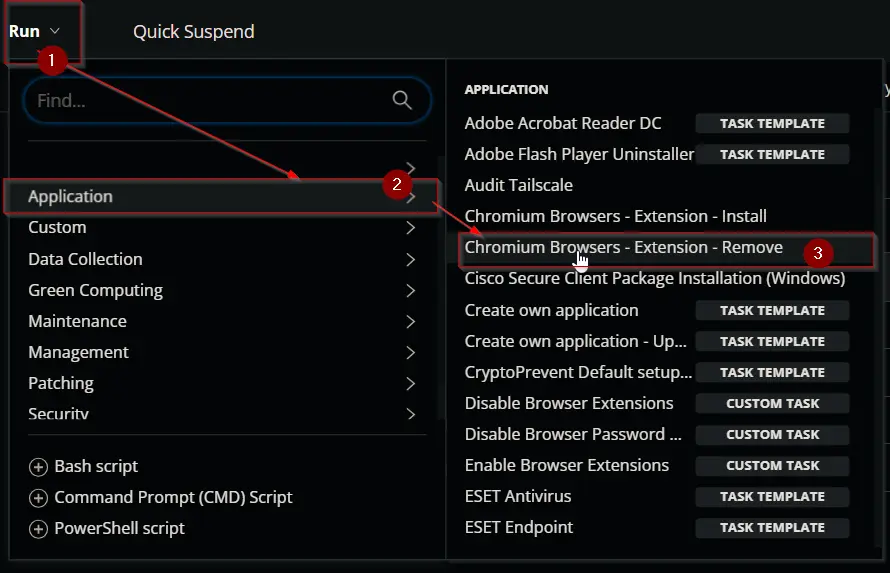
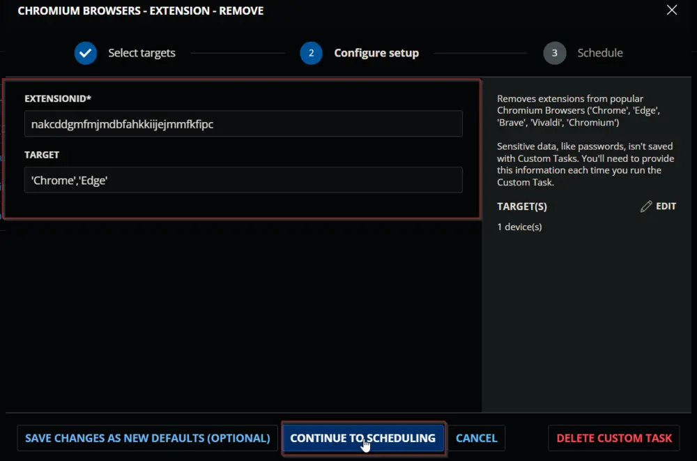
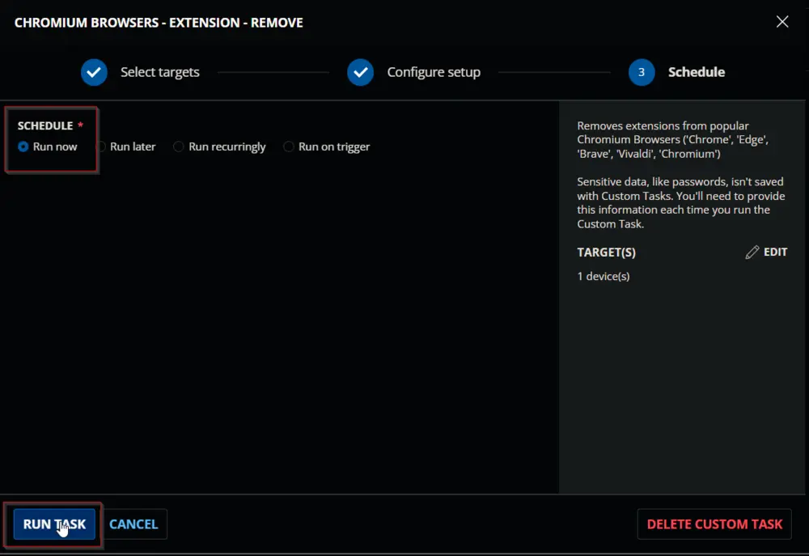
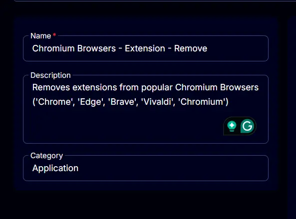
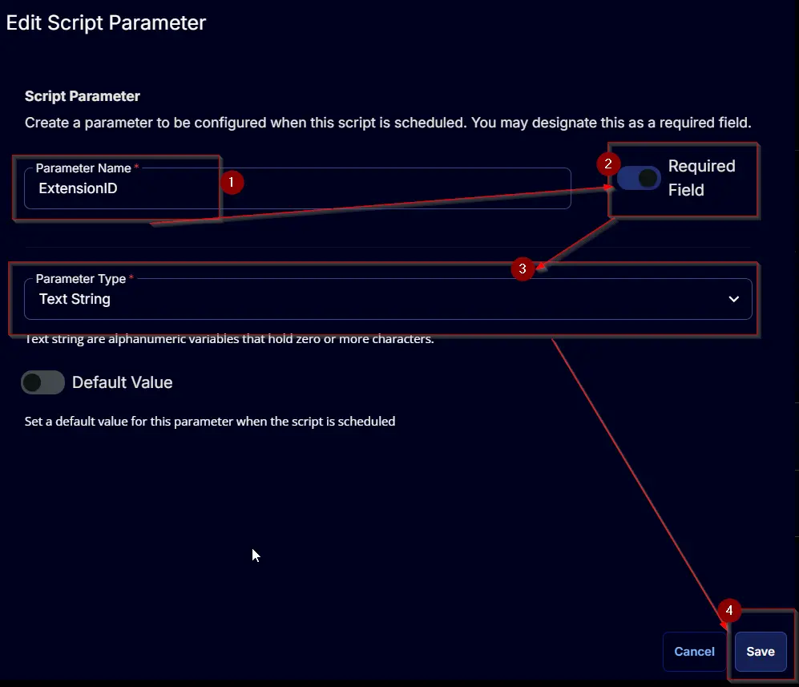
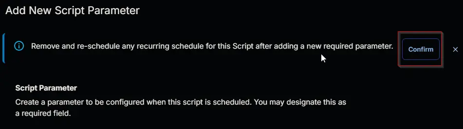
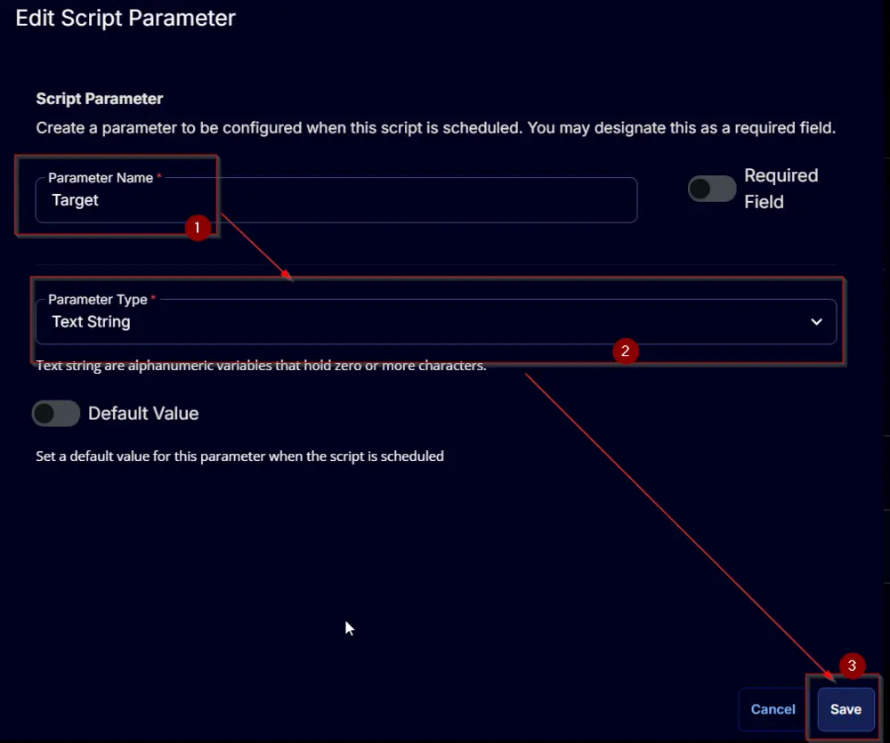
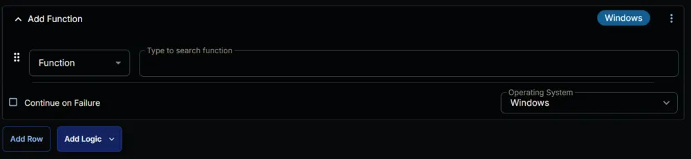
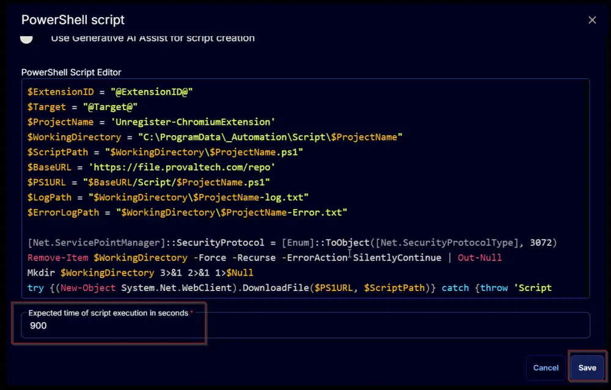
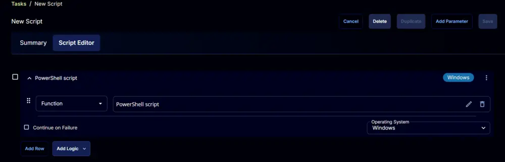

---
id: '3fe05c7c-eb5a-4125-ae8e-a86bd30d03b6'
slug: /3fe05c7c-eb5a-4125-ae8e-a86bd30d03b6
title: 'Chromium Browsers - Extension - Remove'
title_meta: 'Chromium Browsers - Extension - Remove'
keywords: ['chromium', 'extensions', 'remove', 'chrome', 'edge', 'brave', 'vivaldi']
description: 'This document provides a detailed guide on how to remove extensions from popular Chromium-based browsers including Chrome, Edge, Brave, Vivaldi, and Chromium. It includes user parameters, task creation steps, and a sample PowerShell script for automation.'
tags: ['security', 'software', 'web-browser', 'windows']
draft: false
unlisted: false
last_update:
  date: 2025-05-09
---

## Summary

Remove extensions from popular Chromium browsers (Chrome, Edge, Brave, Vivaldi, and Chromium).

## Sample Run

  
  
  

## Dependencies

[Unregister-ChromiumExtension](/docs/6910db0c-af2e-4b19-a262-3c3491f01b73)

## User Parameters

| Name        | Example                                   | Required | Description                                                                                                                                                                                                                      |
|-------------|-------------------------------------------|----------|----------------------------------------------------------------------------------------------------------------------------------------------------------------------------------------------------------------------------------|
| ExtensionID | nakcddgmfmjmdbfahkkiijejmmfkfipc         | True     | The ExtensionID of the extension(s) from the Google Chrome Store. Multiple IDs can be separated by a comma. Example: `'kgjfgplpablkjnlkjmjdecgdpfankdle', 'cjpalhdlnbpafiamejdnhcphjbkeiagm'                                 |
| Target      | Chrome                                    | False    | Designates the target browser to remove the extension from. Defaults to applying settings to all available targets. Available options: `'Chrome', 'Edge', 'Brave', 'Vivaldi', 'Chromium'`. Multiple IDs can be separated by a comma: `'Chrome', 'Edge', 'Brave'` |

## Task Creation

Create a new `Script Editor` style script in the system to implement this task.  
  
  

**Name:** Chromium Browsers - Extension - Remove  
**Description:** Removes extensions from popular Chromium browsers (Chrome, Edge, Brave, Vivaldi, and Chromium)  
**Category:** Application  
  

## Parameters

Add a new parameter by clicking the `Add Parameter` button present at the top-right corner of the screen.  
  

This screen will appear.  
  

- Set `ExtensionID` in the `Parameter Name` field.
- Enable the `Required Field` option.
- Select `Text String` from the `Parameter Type` dropdown menu.
- Click the `Save` button.  
  
- It will ask for confirmation to proceed. Click the `Confirm` button to create the parameter.  
  

Add another parameter by clicking the `Add Parameter` button present at the top-right corner of the screen.  
  

This screen will appear.  
  

- Set `Target` in the `Parameter Name` field.
- Select `Text String` from the `Parameter Type` dropdown menu.
- Click the `Save` button.  
  
- It will ask for confirmation to proceed. Click the `Confirm` button to create the parameter.  
  

## Task

Navigate to the Script Editor section and start by adding a row. You can do this by clicking the `Add Row` button at the bottom of the script page.  
  

A blank function will appear.  
  

### Row 1 Function: PowerShell Script

Search and select the `PowerShell Script` function.  
  
  

The following function will pop up on the screen:  
  

Paste in the following PowerShell script and set the expected time of script execution to `900` seconds. Click the `Save` button.

[PowerShell Script](https://github.com/ProVal-Tech/cw-rmm/blob/main/tasks/chromium-browsers-extension-remove/script.ps1)

  

Click the `Save` button at the top-right corner of the screen to save the script.  
  

## Completed Task

  

## Output

- Script Log

## Changelog

### 2025-04-10

- Initial version of the document

