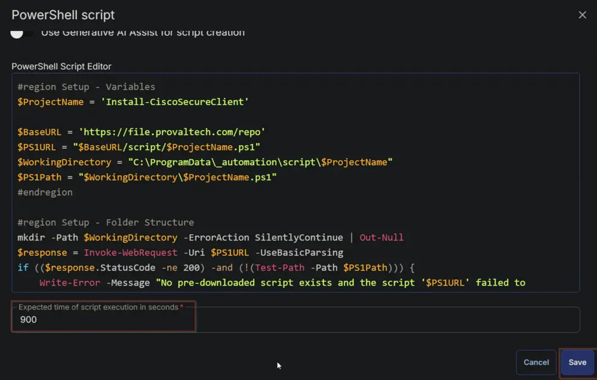
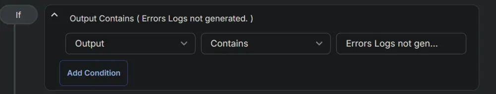

## Summary

This task is a CW RMM implementation of the agnostic script [Install-CiscoSecureClient](/docs/fc6bcac9-770a-46dc-902c-7176cb1d73ea). It allows for the installation of either the entire suite or specific modules of the Cisco Secure Client. Parameters are utilized in a manner consistent with the agnostic script approach.

## Prerequisites

Download the `Cisco Secure Client Pre-Deployment Package (Windows) - includes individual MSI files` and place it in a downloadable location as `Cisco_Secure_Client.zip`.

**NOTE**  
To access/download these files, you will need a login to the Cisco portal. If you do not have a portal login, please create one and validate your access before attempting to download the files, or you will receive an error like this:  


The file can be downloaded from [Cisco Software Download](https://software.cisco.com/download/home/286330811/type/282364313/release/5.0.03076). Cisco changes this download URL for each release. Prefer downloading the latest stable version of the tool.  


Example of a Download URL: [https://file.provaltech.com/apps/packages/cisco_secure_client.zip](https://file.provaltech.com/apps/packages/cisco_secure_client.zip)

## Dependencies

- [Cisco Secure Client Parameter](/docs/0dc22f98-f39e-4d02-9716-19087ff35e03)
- [Install-CiscoSecureClient](/docs/fc6bcac9-770a-46dc-902c-7176cb1d73ea)

## Sample Run


## Variables

| Name      | Description                                                                                                                                                                                                                 |
|-----------|-----------------------------------------------------------------------------------------------------------------------------------------------------------------------------------------------------------------------------|
| Parameter | Parameter stored in the [Cisco Secure Client Parameter](/docs/0dc22f98-f39e-4d02-9716-19087ff35e03) custom field for the company.                                            |
| Output    | Stores the output of the previously executed PowerShell script, and its value changes after each execution of a PowerShell script.                                                                                         |

## Script Creation

Create the company-level Custom Field [Cisco Secure Client Parameter](/docs/0dc22f98-f39e-4d02-9716-19087ff35e03).

Create a new `Script Editor` style script in the system to implement this task.

  


**Name:** `Cisco Secure Client Package Installation (Windows)`  
**Description:** `How to use parameters: [Install-CiscoSecureClient](/docs/fc6bcac9-770a-46dc-902c-7176cb1d73ea)  
Note: To install the Umbrella module, it is required to install the Core VPN module.`  
**Category:** `Application`


### Script

Start by adding a row. You can do this by clicking the `Add Row` button at the bottom of the script page.  


#### Row 1 Function: Set Pre-defined Variable

Select `Set Pre-defined Variable` function.  
  
  
Select the `Custom Field` option.  
  
Type `Parameter` in the `Variable Name` field and search and select the `Cisco Secure Client Parameter` in the `Search Custom Field` field.  
  
Click the `Save` button to save the function.  
  
  

#### Row 2 Logic: If/Then

Insert a new row by selecting the `If/Then` option from the `Add Logic` dropdown button.  
  
  

##### Row 2a Condition: Value Does Not Contain

Select the `Value` option from the drop-down button next to the `Output` option.  
  
  
Enter `Parameter` in the `Enter Value` field and press the `Enter` button on your keyboard.  
  
Select `Does Not Contain` comparator from the drop-down button next to the `Contains` option. 
  
  
Type `-downloadURL` in the `Input Value and Variable` field and press the `Enter` button on your keyboard.  
  

##### Row 2b Function: Script Exit

Insert a new row by clicking the `Add Row` button inside the `If/Then` logic after the `Output Contains` condition.  
  
Select `Script Exit` function.  
  
  
Paste this line in the `Error Message` box and click the `Save` button.  
`Parameter is not set at the company level Custom field Cisco Secure Client Parameter.  
Exiting script with error.`  
  
  
  

#### Row 3 Function: Script Log

Insert a new row by clicking the `Add Row` button.  
  
Select `Script Log` function.  
  
  
Paste this line in the `Script Log Message` box and click the `Save` button.  

```PlainText
Parameters Used:  
@Parameter@
```

  
  

#### Row 4 Function: PowerShell Script

Insert a new row by clicking the `Add Row` button.  
  
Select `PowerShell Script` function.  
  
  
  
Paste in the following PowerShell script, set the expected time of script execution to `900` seconds, and click the `Save` button.

```PowerShell
#region Setup - Variables
$ProjectName = 'Install-CiscoSecureClient'

$BaseURL = 'https://file.provaltech.com/repo'
$PS1URL = "$BaseURL/script/$ProjectName.ps1"
$WorkingDirectory = "C:\ProgramData\_automation\script\$ProjectName"
$PS1Path = "$WorkingDirectory\$ProjectName.ps1"
#endregion

#region Setup - Folder Structure
mkdir -Path $WorkingDirectory -ErrorAction SilentlyContinue | Out-Null
$response = Invoke-WebRequest -Uri $PS1URL -UseBasicParsing
if (($response.StatusCode -ne 200) -and (!(Test-Path -Path $PS1Path))) {
    Write-Error -Message "No pre-downloaded script exists and the script '$PS1URL' failed to download. Exiting."
    return
} elseif ($response.StatusCode -eq 200) {
    Remove-Item -Path $PS1Path -ErrorAction SilentlyContinue
    [System.IO.File]::WriteAllLines($PS1Path, $response.Content)
}
if (!(Test-Path -Path $PS1Path)) {
    Write-Error -Message 'An error occurred and the script was unable to be downloaded. Exiting.'
    return
}
#endregion
$workingpath = $WorkingDirectory
#region Execution
    & $PS1Path @Parameter@
#endregion
```

  
Mark the `Continue on Failure` checkbox.  
  

#### Row 5 Function: Script Log

Insert a new row by clicking the `Add Row` button.  
  
Select `Script Log` function.  
  
  
Paste this line in the `Script Log Message` box and click the `Save` button.  

```PlainText
PowerShell Output:  
%Output%
```

  
  

#### Row 6 Function: PowerShell Script

Insert a new row by clicking the `Add Row` button.  
  
Select `PowerShell Script` function.  
  
  
  
Paste in the following PowerShell script, set the expected time of script execution to `300` seconds, and click the `Save` button.

```PowerShell
$logPath = 'C:\ProgramData\_automation\script\Install-CiscoSecureClient\Install-CiscoSecureClient-log.txt'
if ( Test-Path $logPath ) {
    Get-Content -Path $logPath 
} else {
    return 'Log file not generated'
}
```

  
Mark the `Continue on Failure` checkbox.  
  

#### Row 7 Function: Script Log

Insert a new row by clicking the `Add Row` button.  
  
Select `Script Log` function.  
  
  
Paste this line in the `Script Log Message` box and click the `Save` button.  

```PlainText
Log Content:  
%Output%
```

  
  

#### Row 8 Function: PowerShell Script

Insert a new row by clicking the `Add Row` button.  
  
Select `PowerShell Script` function.  
  
  
  
Paste in the following PowerShell script, set the expected time of script execution to `300` seconds, and click the `Save` button.

```PowerShell
$errorLogPath = 'C:\ProgramData\_automation\script\Install-CiscoSecureClient\Install-CiscoSecureClient-Error.txt'
if ( Test-Path $errorlogPath ) {
    Get-Content -Path $errorLogPath 
} else {
    return 'Errors Logs not generated.'
}
``` 

  
Mark the `Continue on Failure` checkbox.  
  

#### Row 9 Logic: If/Then/Else

Insert a new row by selecting the `If/Then/Else` option from the `Add Logic` dropdown button.  
  
  

##### Row 9a Condition: Output Contains

Type `Errors Logs not generated.` in the `Input Value or Variable` field.  
  

##### Row 9b Function: Script Exit

Insert a new row by clicking the `Add Row` button inside the `If/Then/Else` logic after the `Output Contains` condition.  
  
Select `Script Exit` function.  
  
Click the `Save` button for the `Error Message` prompt box without adding anything to the text field.  
  
  

##### Row 9c Function: Script Exit

Insert a new row by clicking the `Add Row` button inside the `If/Then/Else` logic in the `Else` section.  
  
Select `Script Exit` function.  
  
  
Paste this line in the `Error Message` box and click the `Save` button.  

```PlainText
Error Log Content:  
%Output%
```

  
  

Click the `Save` button at the top-right corner of the screen to save the script.  
  

Store the proper parameter at the company-level custom field [Cisco Secure Client Parameter](/docs/0dc22f98-f39e-4d02-9716-19087ff35e03) before scheduling or running the script.

## Completed Script


## Module Definitions

### Core-VPN

- Core-VPN must be installed with any additional module.
- All modules require that Core-VPN be installed.
- When only installing Core-VPN, you can expect to see the following.

  
  
  
  

### Start Before Login

- SBL stands for Start Before Login; it adds no direct user GUI, however, it does add an entry into programs and features.
- It enables the execution of the AnyConnect VPN prior to a user being logged in.


### Diagnostic and Reporting Tool

- DART stands for Diagnostics and Reporting Tool.
- When installing this, you can expect to see the following items.

  
  
  

### Network Access Manager

- NAM stands for Network Access Manager.
- When installing this module, you can expect to see the following items.

  
  

### Network Visibility Module

- NVM stands for Network Visibility Manager.
- Network Visibility Manager does not include a GUI but does the following:
- Network Visibility Manager **helps you see user and endpoint behavior both on and off premises**. It collects standard flows from endpoints (laptops, for example) along with context like user, application, device, location, and destination information.


### VPN Posture - HostScan Module

- Posture provides the Cisco AnyConnect Secure Mobility Client with the ability to assess an endpoint's compliance for things like antivirus, antispyware, and firewall software installed on the host.
- It does not provide a User GUI.


### ISE Posture

- ISE Posture provides the Cisco AnyConnect Secure Mobility Client with the ability to assess an endpoint's compliance for things like antivirus, antispyware, and firewall software installed on the host, with a user GUI interface.
- When installing this module, you can expect to see the following:

  
  

### Umbrella

- Umbrella installs the Cisco Umbrella module.
- When installing this module, you can expect to see the following:

  
  

## Uninstalling

- When uninstalling this package, you can simply uninstall the Core-VPN module, and it will remove all embedded modules except for the DART module; that module will have to be removed separately.

## FAQ

- Will this installation update older versions of Cisco AnyConnect?
  - Yes, each requested component will be updated if run against a machine that has that component already installed. Components that are not requested will not be updated.

## Output

- Script log
