---
id: 'b2f98721-b82c-48ad-9bf9-83f0d82c5204'
slug: /b2f98721-b82c-48ad-9bf9-83f0d82c5204
title: 'Cisco Secure Client - Package Uninstallation [Windows]'
title_meta: 'Cisco Secure Client - Package Uninstallation [Windows]'
keywords: ['uninstall', 'cisco', 'secure', 'client', 'vpn']
description: 'This task uninstalls selected Cisco Secure Client modules on Windows endpoints using CW RMM checkbox parameters and the agnostic Remove-Application script. It matches selected components against installed uninstall entries, removes only what is selected and present, and reports results. Use All for full removal, All Except Core VPN to preserve VPN, or individual module checkboxes for targeted uninstall actions.'
tags: ['uninstallation', 'networking', 'security', 'software']
draft: false
unlisted: false
last_update:
  date: 2026-03-30
---

## Summary

This task uninstalls selected Cisco Secure Client modules from a Windows endpoint.  
The script checks installed Cisco Secure Client components in the uninstall registry, then calls the agnostic `Remove-Application` PowerShell script to perform the uninstall.  
Only selected and installed modules are targeted. If no selected modules are found, the task exits cleanly with a no-match message. If uninstall verification fails, the task returns an error.

**Parameter usage notes:**

1. All (`All`)  
Select to remove all Cisco Secure Client modules found on the machine.  
This option has highest priority and overrides all other selections.

2. All Except Core VPN (`All_Except_Core_VPN`)  
Select to remove all Cisco Secure Client modules except Core VPN.  
This option is only used when `All` is not selected.

3. Individual module checkboxes

    When neither `All` nor `All Except Core VPN` is selected, the script removes only the modules checked:

    - Core VPN (`Core_VPN`)
    - Start Before Login (`Start_Before_Login`)
    - DART (`DART`)
    - Network Access Manager (`Network_Access_Manager`)
    - Network Visibility Module (`Network_Visibility_Module`)
    - Secure Firewall Posture (`Secure_Firewall_Posture`)
    - ISE Posture (`ISE_Posture`)
    - ThousandEyes Endpoint (`Thousand_Eyes_Endpoint`)
    - Zero Trust Access (`Zero_Trust_Access`)
    - Umbrella (`Umbrella`)

4. Important behavior

    - At least one option must be selected, or the task will fail with a selection error.
    - If a selected module is not installed, it is skipped.
    - Core VPN removal may remove bundled Cisco components; DART is standalone and should be selected separately if you also want it removed.

5. Operator guidance  
    - Use `All` for full removal, `All Except Core VPN` to preserve VPN connectivity, or individual checkboxes for targeted cleanup.  
    - For remote users who rely on VPN, avoid selecting Core VPN unless full Cisco client removal is intended.

## Sample Run

1. **Uninstalling all Modules:**

    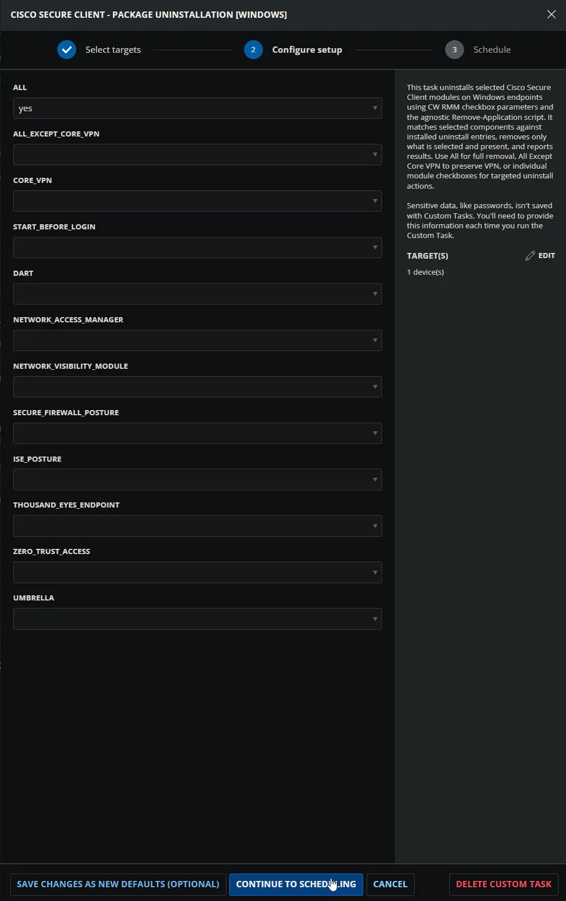

2. **Uninstalling all Modules except Core VPN:**

    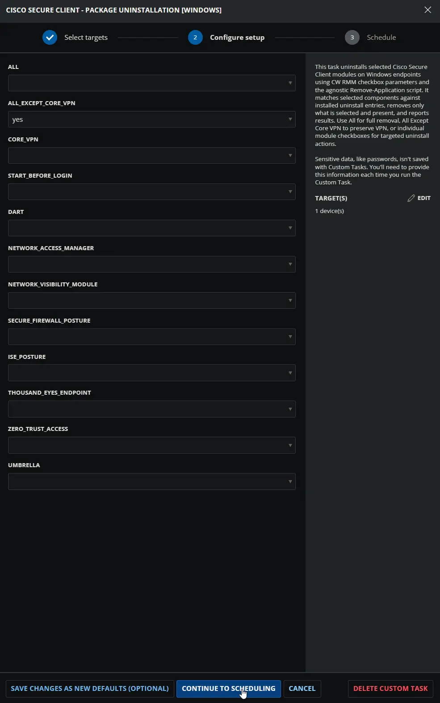

3. **Uninstalling Individual Modules (Umbrella and DART):**

    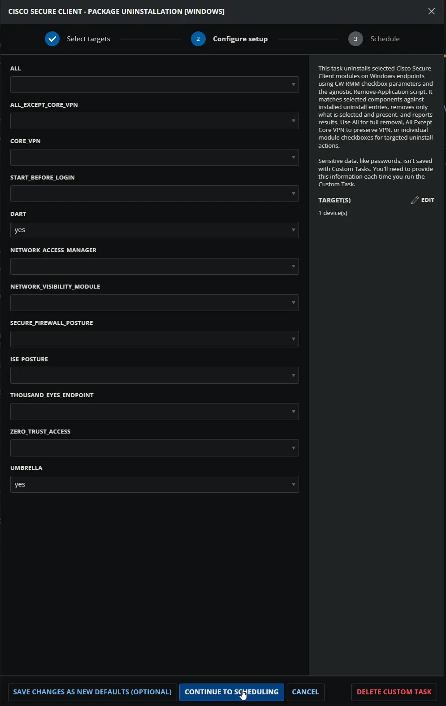

## Dependencies

[Remove-Application](/docs/8230693f-cf73-479d-8279-d2ff54c4296e)

## User Parameters

| Name | Example | Accepted Values | Required | Default | Type | Description |
|------|------|------|------|------|------|------|
| `All` | Yes | Yes, No | No | No | Flag | Set to Yes to remove all installed Cisco Secure Client modules. Highest priority; ignores all other selections. |
| `All_Except_Core_VPN` | Yes | Yes, No | No | No | Flag | Set to Yes to remove all installed Cisco Secure Client modules except Core VPN. Used only when `All` is `No`. |
| `Core_VPN` | Yes | Yes, No | No | No | Flag | Set to Yes to remove Cisco Secure Client Core VPN if installed. Removing Core_VPN will remove all embedded modules except for the DART module, which is a standalone module and will need to be removed separately if not needed. |
| `Start_Before_Login` | Yes | Yes, No | No | No | Flag | Set to Yes to remove Cisco Secure Client Start Before Login if installed. |
| `DART` | Yes | Yes, No | No | No | Flag | Set to Yes to remove Cisco Secure Client Diagnostic and Reporting Tool if installed. |
| `Network_Access_Manager` | Yes | Yes, No | No | No | Flag | Set to Yes to remove Cisco Secure Client Network Access Manager if installed. |
| `Network_Visibility_Module` | Yes | Yes, No | No | No | Flag | Set to Yes to remove Cisco Secure Client Network Visibility Module if installed. |
| `Secure_Firewall_Posture` | Yes | Yes, No | No | No | Flag | Set to Yes to remove Cisco Secure Client Secure Firewall Posture if installed. |
| `ISE_Posture` | Yes | Yes, No | No | No | Flag | Set to Yes to remove Cisco Secure Client ISE Posture if installed. |
| `Thousand_Eyes_Endpoint` | Yes | Yes, No | No | No | Flag | Set to Yes to remove Cisco Secure Client ThousandEyes Endpoint if installed. |
| `Zero_Trust_Access` | Yes | Yes, No | No | No | Flag | Set to Yes to remove Cisco Secure Client Zero Trust Access if installed. |
| `Umbrella` | Yes | Yes, No | No | No | Flag | Set to Yes to remove Cisco Secure Client Umbrella if installed. |

> Note: At least one parameter must be set to Yes or the script throws a selection error.

## Task Creation

### Description

- **Name:** `Cisco Secure Client - Package Uninstallation [Windows]`  
- **Description:** `This task uninstalls selected Cisco Secure Client modules on Windows endpoints using CW RMM checkbox parameters and the agnostic Remove-Application script. It matches selected components against installed uninstall entries, removes only what is selected and present, and reports results. Use All for full removal, All Except Core VPN to preserve VPN, or individual module checkboxes for targeted uninstall actions.`  
- **Category:** `Application`

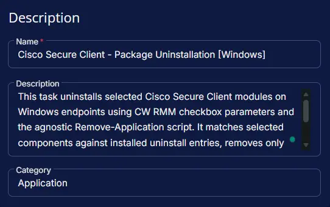

### Parameters

| Parameter Name | Required Field | Parameter Type | Default Value |
| -------------- | -------------- | -------------- | ------------- |
| All | Disabled | Flag | Disabled |

**All:**  
    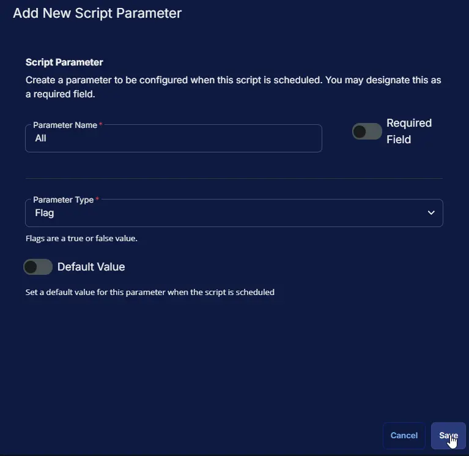

| Parameter Name | Required Field | Parameter Type | Default Value |
| -------------- | -------------- | -------------- | ------------- |
| All_Except_Core_VPN | Disabled | Flag | Disabled |

**All_Except_Core_VPN:**  
    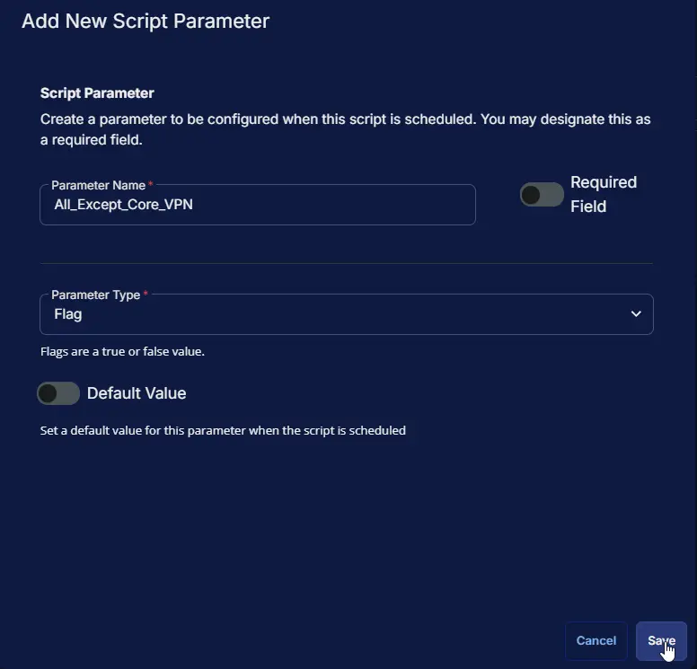

| Parameter Name | Required Field | Parameter Type | Default Value |
| -------------- | -------------- | -------------- | ------------- |
| Core_VPN | Disabled | Flag | Disabled |

**Core_VPN:**  
    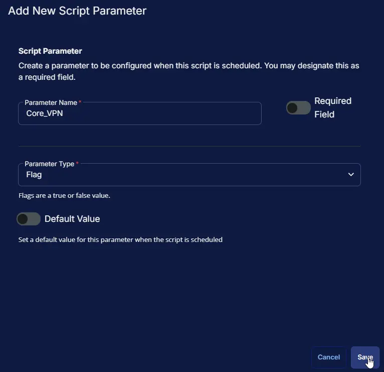

| Parameter Name | Required Field | Parameter Type | Default Value |
| -------------- | -------------- | -------------- | ------------- |
| Start_Before_Login | Disabled | Flag | Disabled |

**Start_Before_Login:**  
    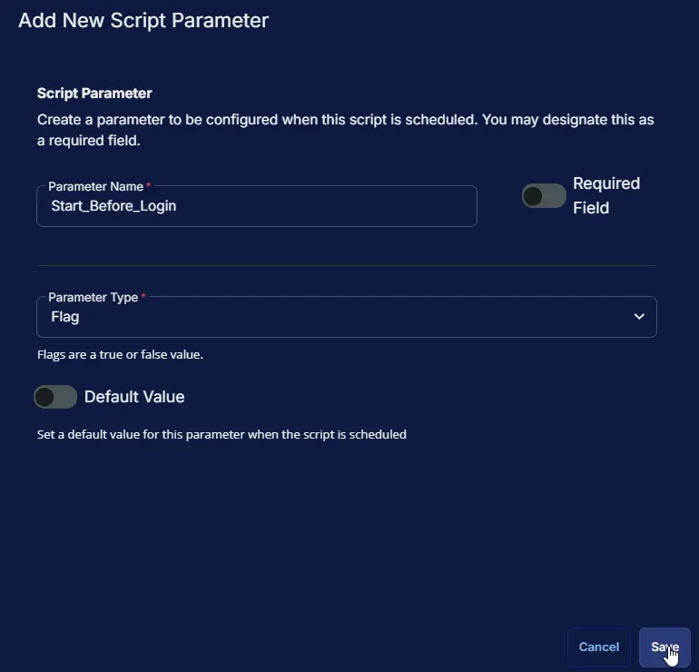

| Parameter Name | Required Field | Parameter Type | Default Value |
| -------------- | -------------- | -------------- | ------------- |
| DART | Disabled | Flag | Disabled |

**DART:**  
    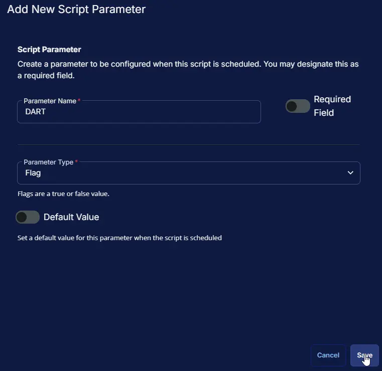

| Parameter Name | Required Field | Parameter Type | Default Value |
| -------------- | -------------- | -------------- | ------------- |
| Network_Access_Manager | Disabled | Flag | Disabled |

**Network_Access_Manager:**  
    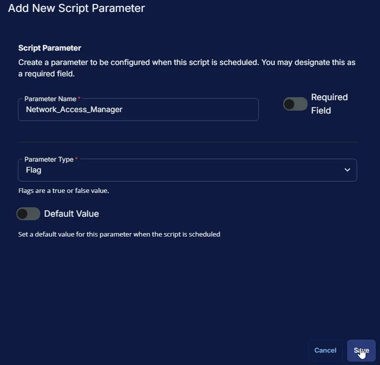

| Parameter Name | Required Field | Parameter Type | Default Value |
| -------------- | -------------- | -------------- | ------------- |
| Network_Visibility_Module | Disabled | Flag | Disabled |

**Network_Visibility_Module:**  
    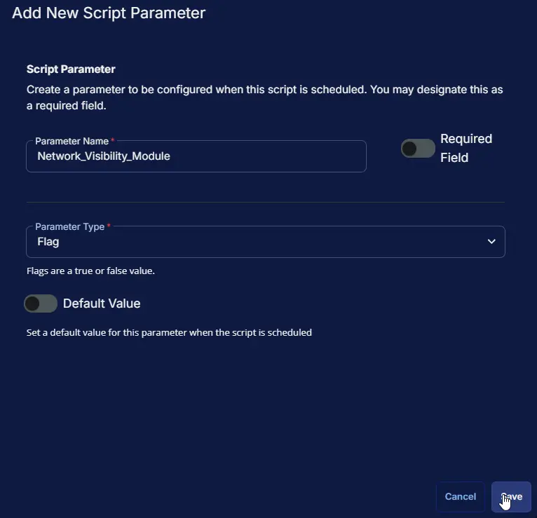

| Parameter Name | Required Field | Parameter Type | Default Value |
| -------------- | -------------- | -------------- | ------------- |
| Secure_Firewall_Posture | Disabled | Flag | Disabled |

**Secure_Firewall_Posture:**  
    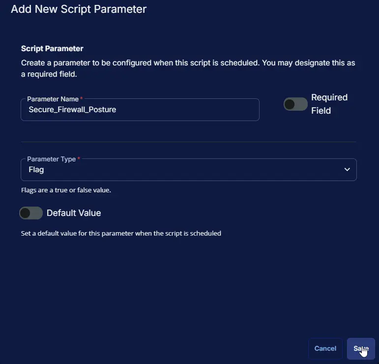

| Parameter Name | Required Field | Parameter Type | Default Value |
| -------------- | -------------- | -------------- | ------------- |
| ISE_Posture | Disabled | Flag | Disabled |

**ISE_Posture:**  
    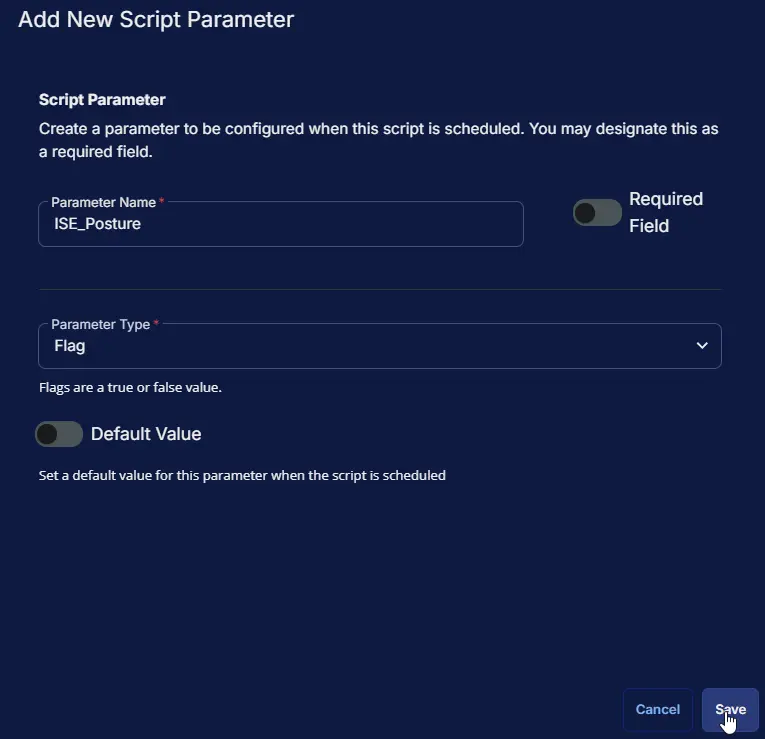

| Parameter Name | Required Field | Parameter Type | Default Value |
| -------------- | -------------- | -------------- | ------------- |
| Thousand_Eyes_Endpoint | Disabled | Flag | Disabled |

**Thousand_Eyes_Endpoint:**  
    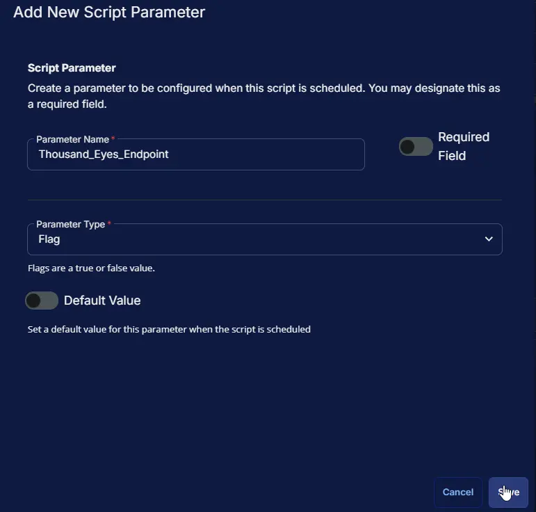

| Parameter Name | Required Field | Parameter Type | Default Value |
| -------------- | -------------- | -------------- | ------------- |
| Zero_Trust_Access | Disabled | Flag | Disabled |

**Zero_Trust_Access:**  
    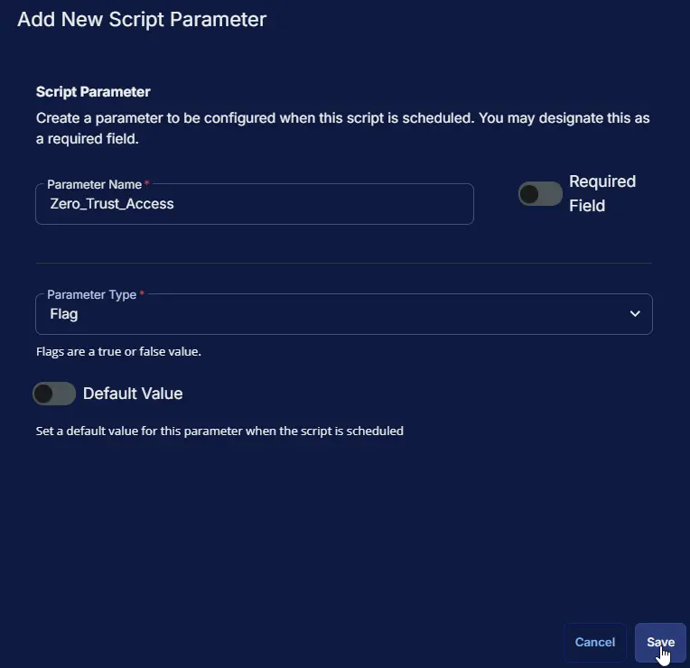

| Parameter Name | Required Field | Parameter Type | Default Value |
| -------------- | -------------- | -------------- | ------------- |
| Umbrella | Disabled | Flag | Disabled |

**Umbrella:**  
    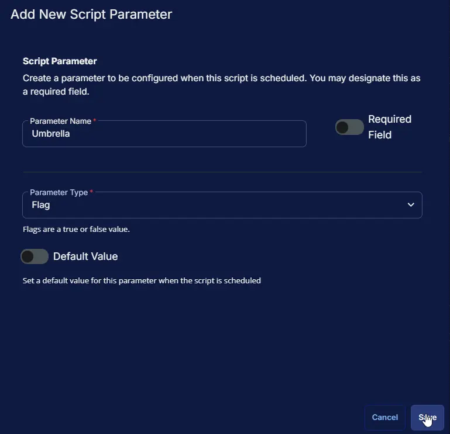

#### Parameters Section

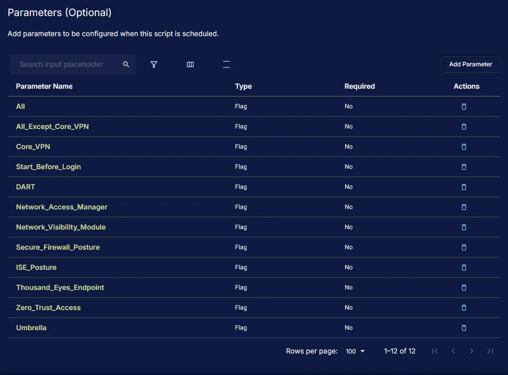

### Script Editor

#### Row 1: PowerShell script

- **Use Generative AI Assist for script creation:** `False`  
- **Expected time of script execution in seconds:** `1800`  
- **Continue on Failure:** `False`  
- **Run as:** `System`  
- **Operating System:** `Windows`  
- **PowerShell Script Editor:**

[PowerShell Script](https://github.com/ProVal-Tech/cw-rmm/blob/main/tasks/cisco-secure-client-package-uninstallation-windows/script.ps1)

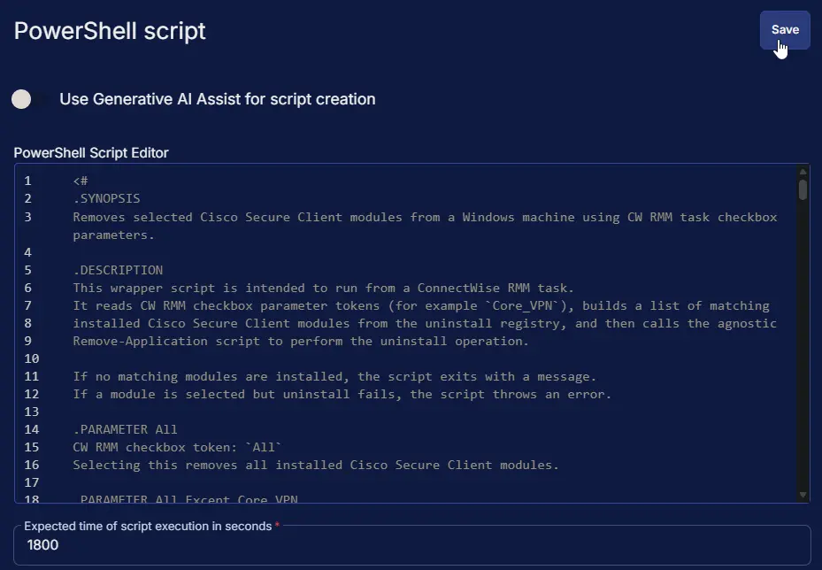

#### Row 2: Script Log

- **Script Log Message:** `%Output%`  
- **Continue on Failure:** `False`  
- **Operating System:** `Windows`

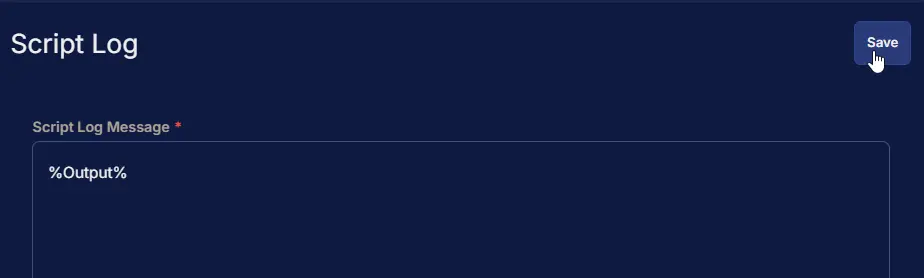

## Completed Script

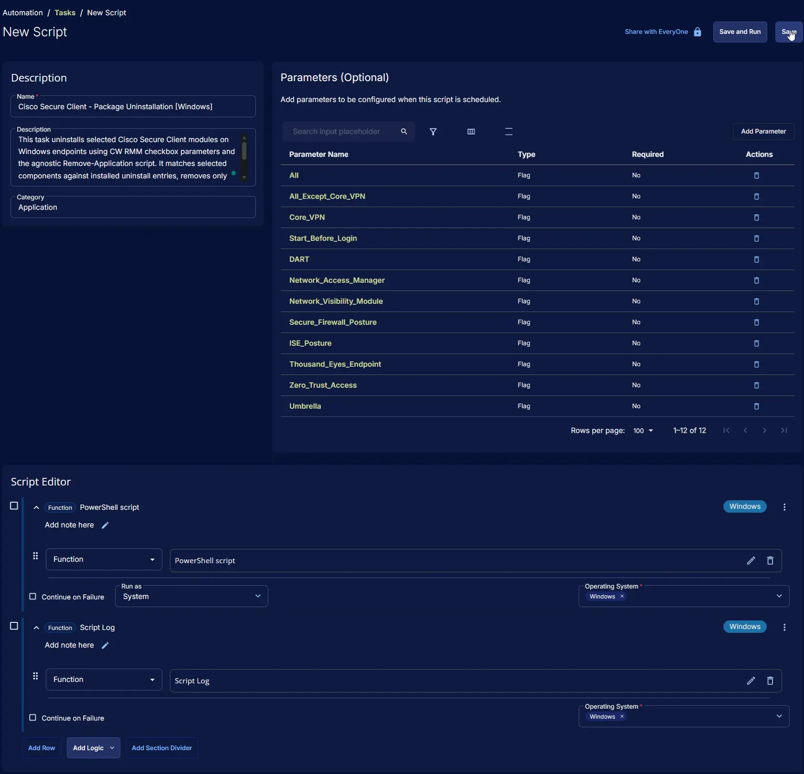

## Output

- Script Log

## Changelog

### 2026-03-30

- Initial version of the document

