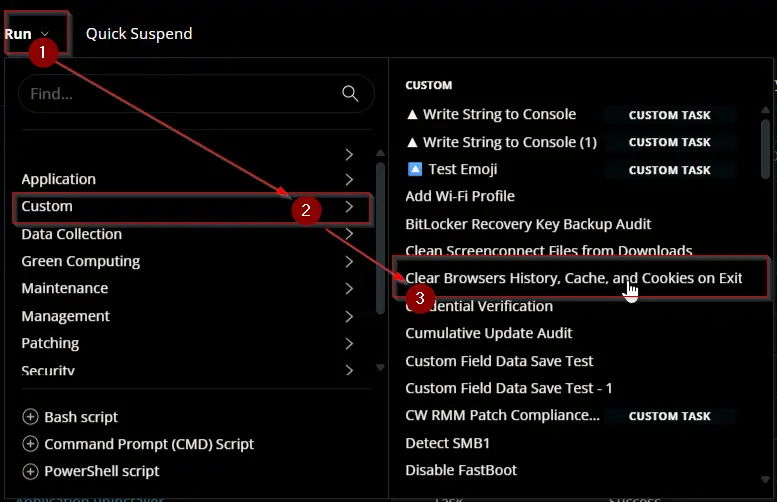
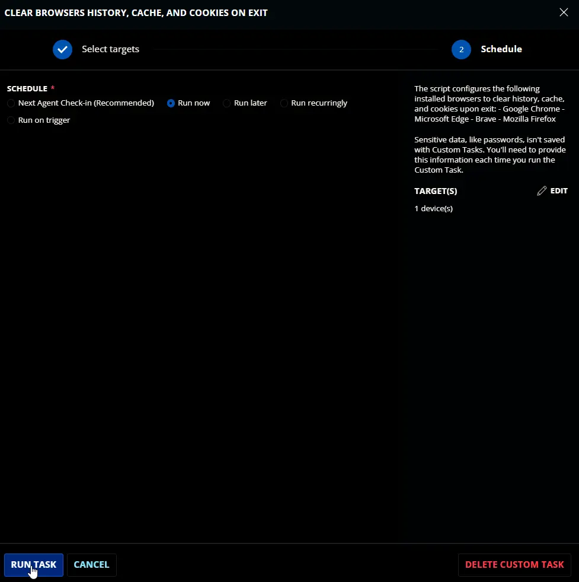
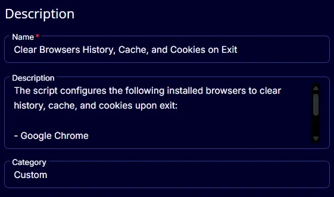
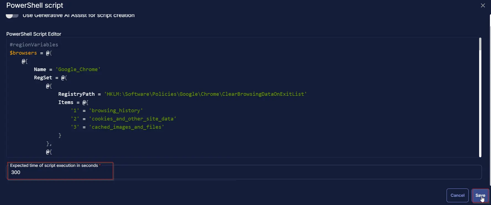
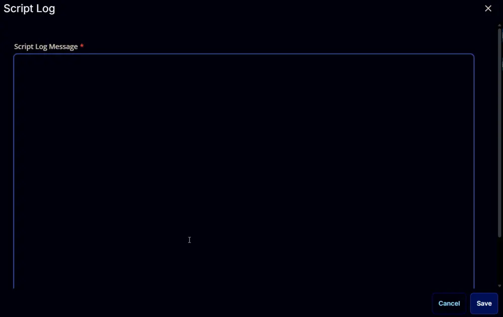
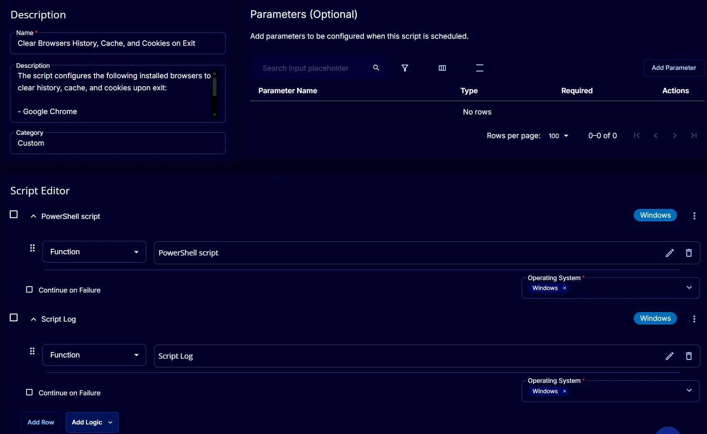

---
id: 'a0fec809-e3bd-4ea8-828f-e2292d42e2a4'
slug: /a0fec809-e3bd-4ea8-828f-e2292d42e2a4
title: 'Clear Browsers History, Cache, and Cookies on Exit'
title_meta: 'Clear Browsers History, Cache, and Cookies on Exit'
keywords: ['browser', 'chrome', 'brave', 'edge', 'firefox', 'google-chrome', 'microsoft-edge', 'mozilla-firefox', 'history', 'cache', 'cookies']
description: 'The script configures the supported installed browsers to clear history, cache, and cookies upon exit'
tags: ['browsers', 'chrome', 'edge', 'firefox']
draft: false
unlisted: false
last_update:
  date: 2025-06-03
---

## Summary

The script configures the following installed browsers to clear history, cache, and cookies upon exit:

- Google Chrome
- Microsoft Edge
- Brave
- Mozilla Firefox

## Sample Run

  

## Task Creation

### Script Details

#### Step 1

Navigate to `Automation` ➞ `Tasks`  

#### Step 2

Create a new `Script Editor` style task by choosing the `Script Editor` option from the `Add` dropdown menu  

The `New Script` page will appear on clicking the `Script Editor` button:  

#### Step 3

Fill in the following details in the `Description` section:  

`Name:` Clear Browsers History, Cache, and Cookies on Exit   
`Description:`  The script configures the following installed browsers to clear history, cache, and cookies upon exit:

- Google Chrome
- Microsoft Edge
- Brave
- Mozilla Firefox`  

`Category:` Custom

### Script Editor

Click the `Add Row` button in the `Script Editor` section to start creating the script  

A blank function will appear:  

#### Row 1 Function: PowerShell

Search and select the `PowerShell Script` function.  
  
  

The following function will pop up on the screen:  

Paste in the following PowerShell script and set the `Expected time of script execution in seconds` to `300` seconds. Click the `Save` button.

[PowerShell Script](https://github.com/ProVal-Tech/cw-rmm/blob/main/tasks/clear-browsers-history-cache-and-cookies-on-exit/script.ps1)

#### Row 2 Function: Script Log

Add a new row by clicking the `Add Row` button.  

A blank function will appear.  

Search and select the `Script Log` function.  

The following function will pop up on the screen:  

In the script log message, simply type `%Output%` and click the `Save` button.  

## Save Task

Click the `Save` button at the top-right corner of the screen to save the script.  

## Completed Task

## Output

- Script logs

## Changelog

### 2025-05-28

- Initial version of the document

