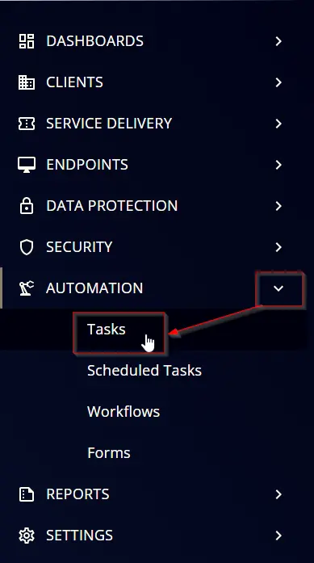

## Summary

The script configures the following installed browsers to clear history, cache, and cookies upon exit:

- Google Chrome
- Microsoft Edge
- Brave
- Mozilla Firefox

## Sample Run

  


## Task Creation

### Script Details

#### Step 1

Navigate to `Automation` ➞ `Tasks`  


#### Step 2

Create a new `Script Editor` style task by choosing the `Script Editor` option from the `Add` dropdown menu  


The `New Script` page will appear on clicking the `Script Editor` button:  


#### Step 3

Fill in the following details in the `Description` section:  

`Name:` Clear Browsers History, Cache, and Cookies on Exit   
`Description:`  The script configures the following installed browsers to clear history, cache, and cookies upon exit:

- Google Chrome
- Microsoft Edge
- Brave
- Mozilla Firefox`  

`Category:` Custom


### Script Editor

Click the `Add Row` button in the `Script Editor` section to start creating the script  


A blank function will appear:  


#### Row 1 Function: PowerShell

Search and select the `PowerShell Script` function.  
  
  

The following function will pop up on the screen:  


Paste in the following PowerShell script and set the `Expected time of script execution in seconds` to `300` seconds. Click the `Save` button.

```PowerShell
#regionVariables
$browsers = @(
    @{
        Name = 'Google_Chrome'
        RegSet = @(
            @{
                RegistryPath = 'HKLM:\Software\Policies\Google\Chrome\ClearBrowsingDataOnExitList'
                Items = @{
                    '1' = 'browsing_history'
                    '2' = 'cookies_and_other_site_data'
                    '3' = 'cached_images_and_files'
                }
            },
            @{
                RegistryPath = 'HKLM:\Software\Policies\Google\Chrome'
                Items = @{
                    'ClearBrowsingDataOnExit' = 1
                    'ClearCachedImagesAndFilesOnExit' = 1
                }
            }
        )
    },
    @{
        Name = 'Microsoft_Edge'
        RegSet = @(
            @{
                RegistryPath = 'HKLM:\Software\Policies\Microsoft\Edge\ClearBrowsingDataOnExitList'
                Items = @{
                    '1' = 'browsing_history'
                    '2' = 'cookies_and_other_site_data'
                    '3' = 'cached_images_and_files'
                }
            },
            @{
                RegistryPath = 'HKLM:\Software\Policies\Microsoft\Edge'
                Items = @{
                    'ClearBrowsingDataOnExit' = 1
                    'ClearCachedImagesAndFilesOnExit' = 1
                }
            }
        )
    },
    @{
        Name = 'Brave'
        RegSet = @(
            @{
                RegistryPath = 'HKLM:\Software\Policies\BraveSoftware\Brave\ClearBrowsingDataOnExitList'
                Items = @{
                    '1' = 'browsing_history'
                    '2' = 'cookies_and_other_site_data'
                    '3' = 'cached_images_and_files'
                }
            },
            @{
                RegistryPath = 'HKLM:\Software\Policies\BraveSoftware\Brave'
                Items = @{
                    'ClearBrowsingDataOnExit' = 1
                    'ClearCachedImagesAndFilesOnExit' = 1
                }
            }
        )
    },
    @{
        Name = 'Mozilla_Firefox'
        RegSet = @(
            @{
                RegistryPath = 'HKLM:\SOFTWARE\Policies\Mozilla\Firefox\SanitizeOnShutdown'
                Items = @{
                    'Cache' = 1
                    'History' = 1
                    'Cookies' = 1
                }
            },
            @{
                RegistryPath = 'HKLM:\SOFTWARE\Policies\Mozilla\Firefox'
                Items = @{
                    'SanitizeOnShutdown' = 1
                }
            }
        )
    }
)
$failures = @()
#endRegion

#regionFunctions
function Set-RegValue {
    param(
        [Parameter()][String]$Browser,
        [Parameter()][String]$Path,
        [Parameter()][String]$Reg,
        [Parameter()][String]$Value
    )
    $currentValue = (Get-ItemProperty -Path $Path -ErrorAction SilentlyContinue).$Reg
    if ($currentValue -ne $Value) {
        try {
            Set-ItemProperty -Path $Path -Name $Reg -Value $Value -Force -ErrorAction Stop
        } catch {
            $failed = [PSCustomObject]@{
                Browser = $Browser
                Path = $Path
                Key = $Reg
                Value = $Value
            }
            return $failed
        }
    }
}
#endRegion

#regionProcess
foreach ($browser in $browsers) {
    $browserName = $browser.Name

    $regSet = $browser.RegSet
    foreach ($set in $regSet) {
        $regPath = $set.RegistryPath
        $items = $set.Items
        if (-not (Test-Path -Path $regPath)) {
            New-Item -Path $regPath -Force -Confirm:$false | Out-Null
        }
        foreach ($key in $items.Keys) {
            $value = $items[$key].ToString()
            $failures += Set-RegValue -Browser ($browserName -replace '_', ' ') -Path $regPath -Reg $key -Value $value
        }
    }
}
#endRegion

#regionVerification
if ($failures) {
    throw ($failures | Format-List | Out-String)
}
#endRegion
```


#### Row 2 Function: Script Log

Add a new row by clicking the `Add Row` button.  


A blank function will appear.  


Search and select the `Script Log` function.  


The following function will pop up on the screen:  


In the script log message, simply type `%Output%` and click the `Save` button.  


## Save Task

Click the `Save` button at the top-right corner of the screen to save the script.  


## Completed Task


## Output

- Script logs
