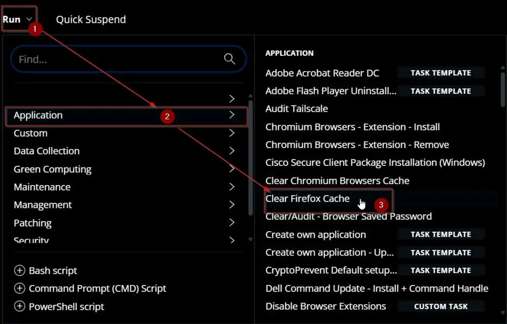
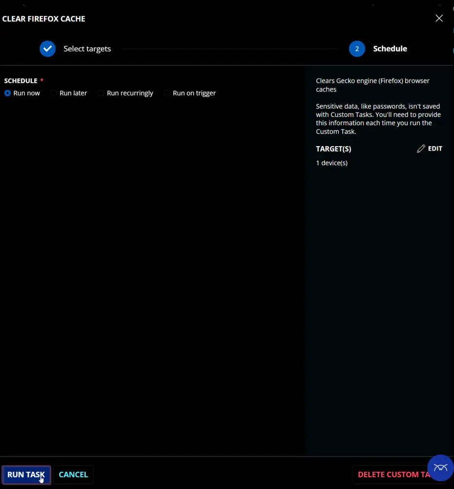
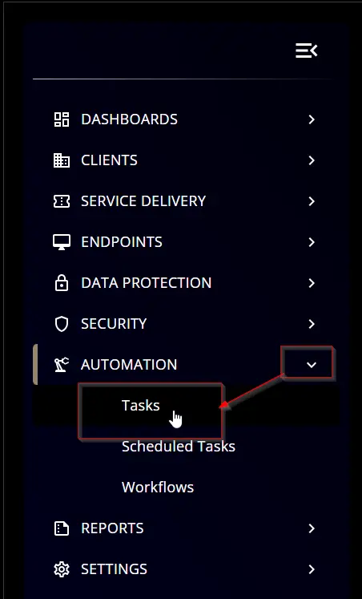
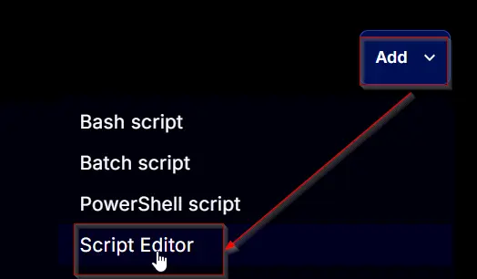
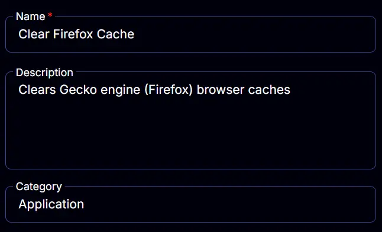
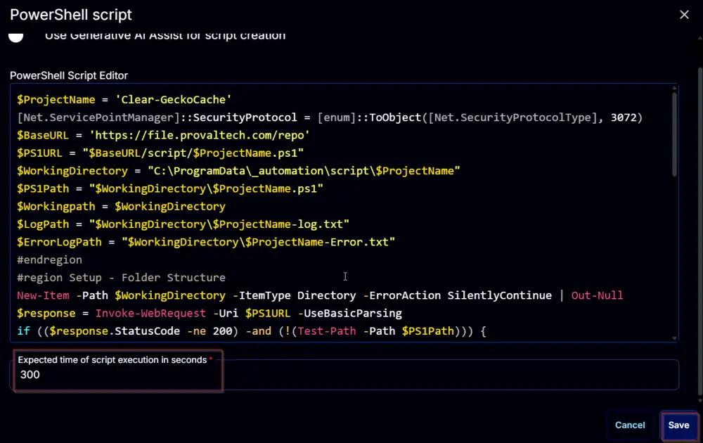
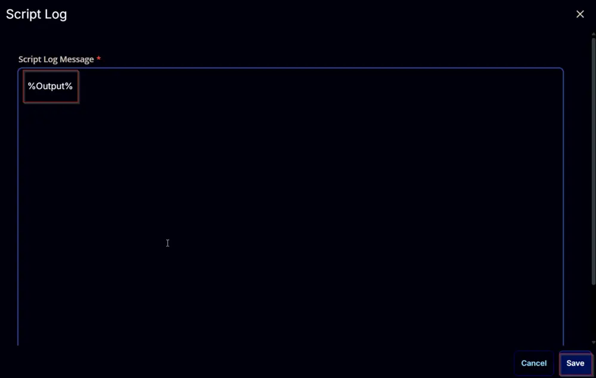
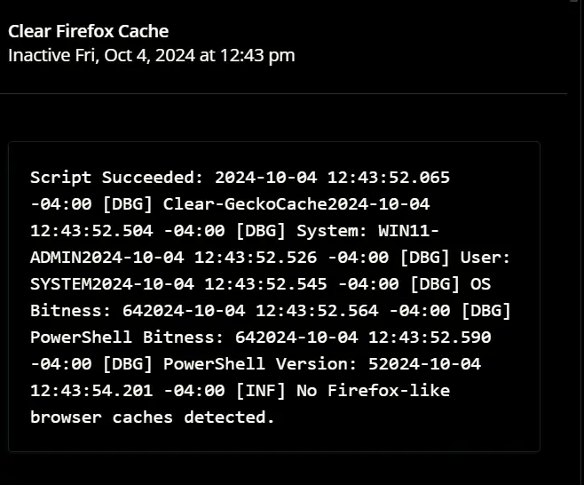

## Summary

This document outlines how to clear the Gecko engine (Firefox) browser caches using the ConnectWise RMM implementation of [Clear-GeckoCache](/docs/4a400b6b-d468-417f-914b-8094e645fdb4).

## Sample Run

  
  

## Dependencies

[SWM - Software Configuration - Script - Clear-GeckoCache](/docs/4a400b6b-d468-417f-914b-8094e645fdb4)

## Task Creation

Create a new `Script Editor` style script in the system to implement this task.  
  
  

**Name:** `Clear Firefox Cache`  
**Description:** `Clears Gecko engine (Firefox) browser caches`  
**Category:** `Application`  
  

## Task

Navigate to the Script Editor section and start by adding a row. You can do this by clicking the `Add Row` button at the bottom of the script page.  
  

A blank function will appear.  
  

### Row 1 Function: PowerShell Script

Search and select the `PowerShell Script` function.  
  
  

The following function will pop up on the screen:  
  

Paste the following PowerShell script and set the `Expected time of script execution in seconds` to `300` seconds. Click the `Save` button.

```powershell
$ProjectName = 'Clear-GeckoCache'
[Net.ServicePointManager]::SecurityProtocol = [enum]::ToObject([Net.SecurityProtocolType], 3072)
$BaseURL = 'https://file.provaltech.com/repo'
$PS1URL = "$BaseURL/script/$ProjectName.ps1"
$WorkingDirectory = "C:\ProgramData\_automation\script\$ProjectName"
$PS1Path = "$WorkingDirectory\$ProjectName.ps1"
$Workingpath = $WorkingDirectory
$LogPath = "$WorkingDirectory\$ProjectName-log.txt"
$ErrorLogPath = "$WorkingDirectory\$ProjectName-Error.txt"
#endregion
#region Setup - Folder Structure
New-Item -Path $WorkingDirectory -ItemType Directory -ErrorAction SilentlyContinue | Out-Null
$response = Invoke-WebRequest -Uri $PS1URL -UseBasicParsing
if (($response.StatusCode -ne 200) -and (!(Test-Path -Path $PS1Path))) {
    throw "No pre-downloaded script exists and the script '$PS1URL' failed to download. Exiting."
} elseif ($response.StatusCode -eq 200) {
    Remove-Item -Path $PS1Path -ErrorAction SilentlyContinue
    [System.IO.File]::WriteAllLines($PS1Path, $response.Content)
}
if (!(Test-Path -Path $PS1Path)) {
    throw 'An error occurred and the script was unable to be downloaded. Exiting.'
}
#endregion
#region Execution
if ($Parameters) {
    & $PS1Path @Parameters
} else {
    & $PS1Path
}
#endregion
if ( !(Test-Path $LogPath) ) {
    throw 'PowerShell Failure. A Security application seems to have restricted the execution of the PowerShell Script.'
}
if ( Test-Path $ErrorLogPath ) {
    $ErrorContent = ( Get-Content -Path $ErrorLogPath )
    throw $ErrorContent
}
Get-Content -Path $LogPath
```

  

### Row 2 Function: Script Log

Add a new row by clicking the `Add Row` button.  
  

A blank function will appear.  
  

Search and select the `Script Log` function.  
  

The following function will pop up on the screen:  
  

In the script log message, simply type `%Output%` and click the `Save` button.  
  

Click the `Save` button at the top-right corner of the screen to save the script.  
  

## Completed Script

  

## Output

- Script Log  
  
