## Summary

This task is designed to perform the Browser Saved Password Audit or Clearance based on the custom fields selected.

## Sample Run

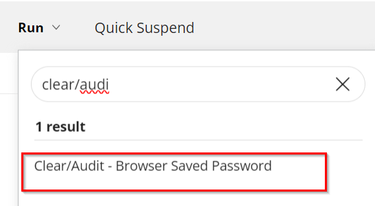

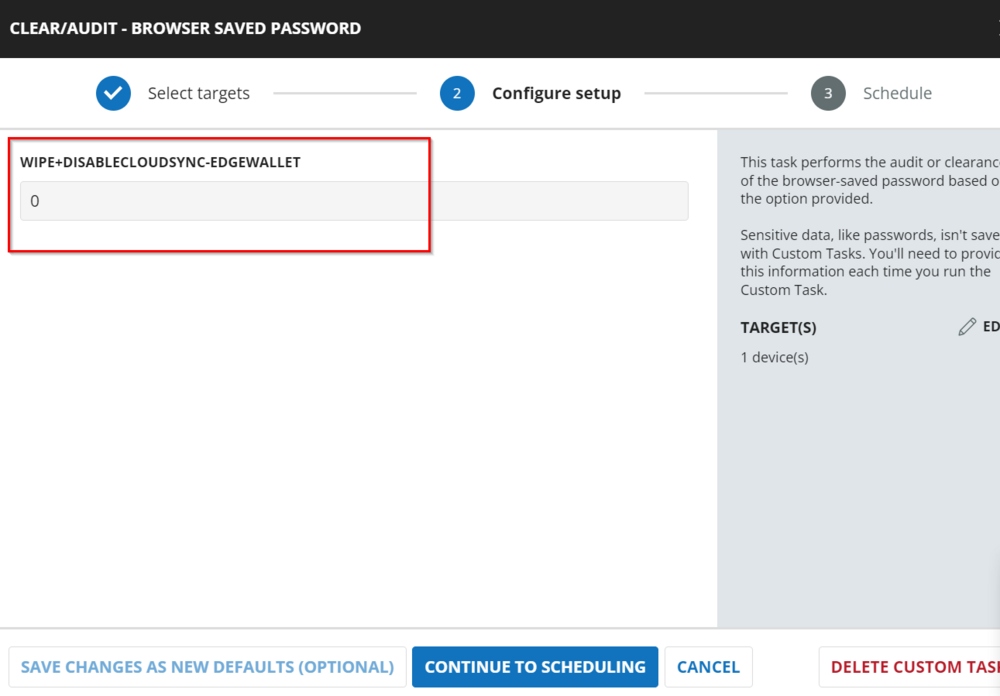

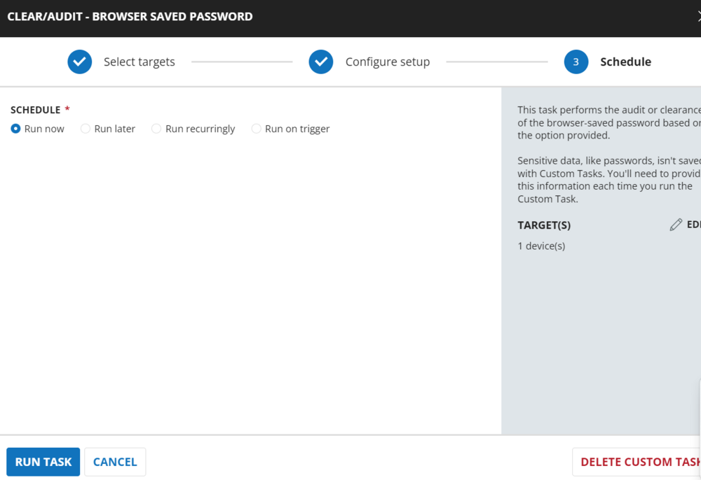

## Implementation

### Create Task

To implement this script, please create a new "PowerShell" style script in the system.


- **Name:** Clear/Audit - Browser Saved Password  
- **Description:** This task performs the audit or clearance of the browser-saved password based on the option provided.  
- **OS Supported:** Windows  
- **Category:** Application

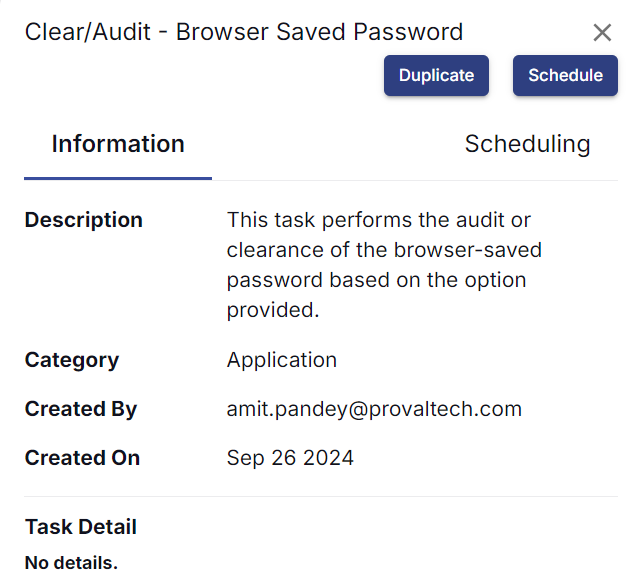

## Script

Start by making three separate rows. You can do this by clicking the "Add Row" button at the bottom of the script page.


### Row 1: Function: Set User Variable

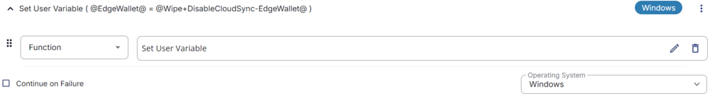

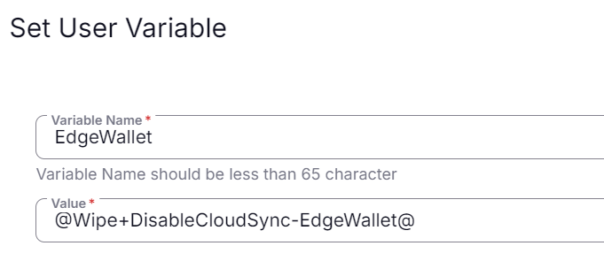

This sets the variable `EdgeWallet` with the value of a user parameter `@Wipe+DisableCloudSync-EdgeWallet@`.

### Row 2: Logic: If/Then/Else


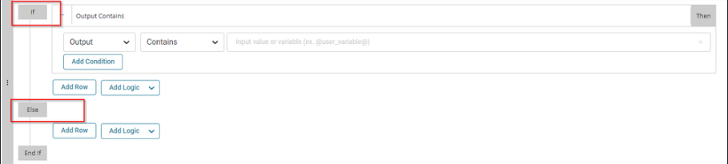

#### IF Condition

##### Row 2a: IF: Condition: Custom Field

In the IF part, enter the custom field as shown below:

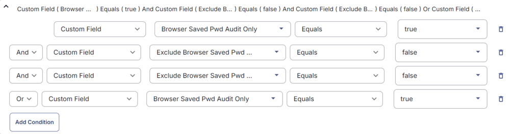

##### Row 2b: Function: PowerShell Script

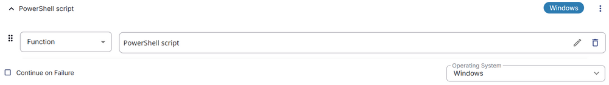

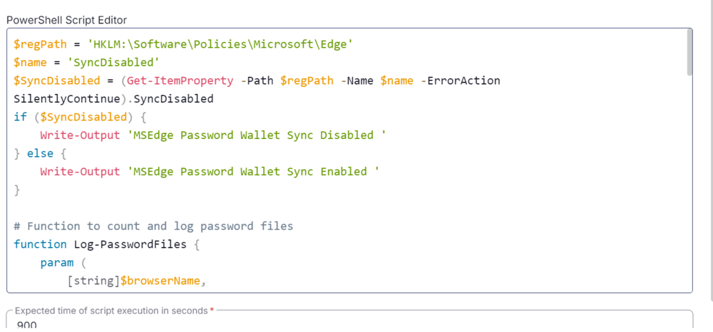

Paste in the following PowerShell script and set the expected time of script execution to **900 seconds**.

```powershell
$regPath = 'HKLM:\\Software\\Policies\\Microsoft\\Edge'
$name = 'SyncDisabled'
$SyncDisabled = (Get-ItemProperty -Path $regPath -Name $name -ErrorAction SilentlyContinue).SyncDisabled
if ($SyncDisabled) {
    Write-Output 'MSEdge Password Wallet Sync Disabled '
} else {
    Write-Output 'MSEdge Password Wallet Sync Enabled '
}
```

```powershell
# Function to count and log password files
function Log-PasswordFiles {
    param (
        [string]$browserName,
        [string]$userName,
        [string]$path,
        [string[]]$items
    )
    $count = 0
    foreach ($item in $items) {
        if (Test-Path -Path "$path\\$item") {
            $count++
        }
    }
    if ($count -gt 0) {
        Write-Information "-- $count Passwords saved in $browserName for $userName" -InformationAction Continue
    }
}
```

```powershell
# Chrome and Brave
if ((Get-ChildItem -Path HKLM:\\SOFTWARE\\Microsoft\\Windows\\CurrentVersion\\Uninstall, HKLM:\\SOFTWARE\\Wow6432Node\\Microsoft\\Windows\\CurrentVersion\\Uninstall | Get-ItemProperty | Where-Object { $_.DisplayName -match 'Chrome|Brave' }).DisplayName) {
    Start-Sleep -Seconds 10
    foreach ($path in (Get-ChildItem -Path 'C:\\Users' | Where-Object { $_.Mode -match 'd' })) {
        foreach ($Browser in 'Google\\Chrome', 'BraveSoftware\\Brave-Browser') {
            if (Test-Path -Path "$($path.FullName)\\Appdata\\Local\\$Browser") {
                Log-PasswordFiles -browserName $(($Browser -split '\\\\') -replace '-Browser', '') -userName $path.Name -path "$($path.FullName)\\Appdata\\Local\\$Browser\\User Data\\Default" -items @('Login Data', 'Login Data-journal')
            }
        }
    }
}
```

```powershell
# Microsoft Edge
if ((Get-ChildItem -Path HKLM:\\SOFTWARE\\Microsoft\\Windows\\CurrentVersion\\Uninstall, HKLM:\\SOFTWARE\\Wow6432Node\\Microsoft\\Windows\\CurrentVersion\\Uninstall | Get-ItemProperty | Where-Object { $_.DisplayName -match 'Edge' }).DisplayName) {
    Start-Sleep -Seconds 10
    foreach ($path in (Get-ChildItem -Path 'C:\\Users' | Where-Object { $_.Mode -match 'd' })) {
        foreach ($Browser in 'Microsoft\\Edge') {
            if (Test-Path -Path "$($path.FullName)\\Appdata\\Local\\$Browser") {
                Log-PasswordFiles -browserName $(($Browser -split '\\\\') -replace '-Browser', '') -userName $path.Name -path "$($path.FullName)\\Appdata\\Local\\$Browser\\User Data\\Default" -items @('Login Data', 'Login Data-journal')
            }
        }
    }
}
```

```powershell
# Firefox
if ((Get-ChildItem -Path HKLM:\\SOFTWARE\\Microsoft\\Windows\\CurrentVersion\\Uninstall, HKLM:\\SOFTWARE\\Wow6432Node\\Microsoft\\Windows\\CurrentVersion\\Uninstall | Get-ItemProperty | Where-Object { $_.DisplayName -match 'Firefox' }).DisplayName) {
    Start-Sleep -Seconds 10
    foreach ($path in (Get-ChildItem -Path 'C:\\Users' | Where-Object { $_.Mode -match 'd' })) {
        if (Test-Path -Path "$($path.FullName)\\Appdata\\Roaming\\Mozilla\\Firefox\\Profiles") {
            foreach ($profile in ((Get-ChildItem -Path "$($path.FullName)\\Appdata\\Roaming\\Mozilla\\Firefox\\Profiles" | Where-Object { $_.Mode -match 'd' }).FullName)) {
                Log-PasswordFiles -browserName 'Firefox' -userName $path.Name -path $profile -items @('signons.txt', 'signons2.txt', 'signons3.txt', 'signons.sqllite', 'logins.json', 'logins-backup.json')
            }
        }
    }
}
```

##### Row 2c: Function: Script Log


In the script log message, type `%output%` so that the script will send the results of the PowerShell script above to the output on the Automation tab for the target device.


##### Row 2d: Function: Set Custom Field

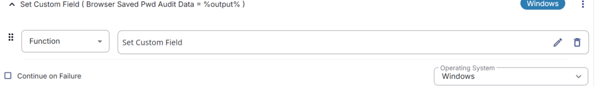

Select Function 'Set Custom Field'. When you select `set custom field`, it will open a new window.

In this window, search for the `Browser Saved Pwd Audit Data` field.

- **Custom Field:** `Browser Saved Pwd Audit Data`  
- **Value:** `%output%`

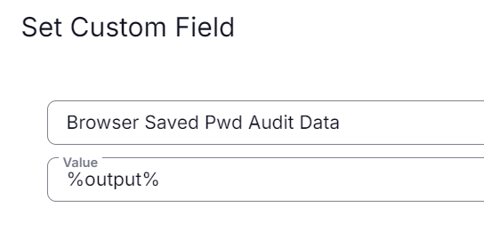

##### Row 2e: Function: Script Exit

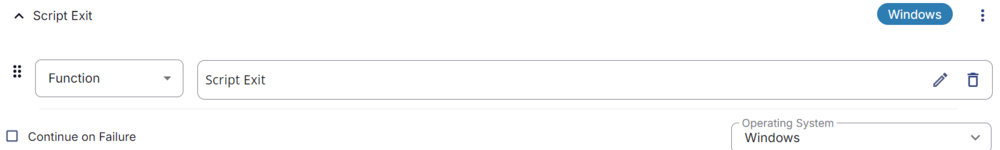

In the script Exit, leave it empty and save.

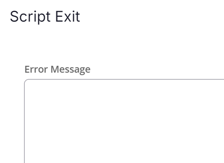

### Else Condition

#### Row 2f: Logic: If/Else/Then


#### IF Condition

##### Row 2f(i): Condition: Value

In the IF part, enter Value 1 equals to `@EdgeWallet@`.

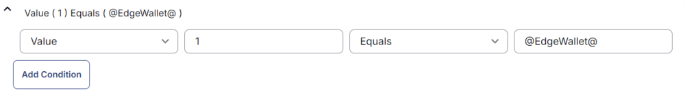

##### Row 2f(ii): Logic: If/Then

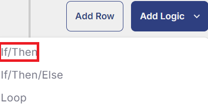


##### Row 2f(iii): Condition: Custom Field

In the IF part, enter the custom field as shown below:

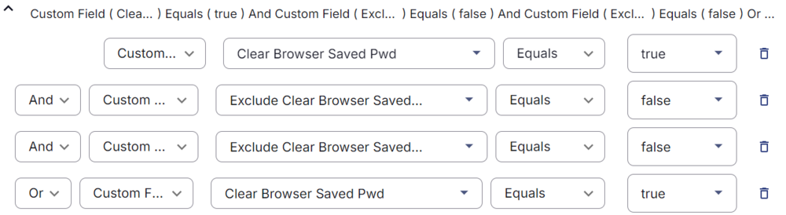

##### Row 2f(iv): Function: PowerShell Script


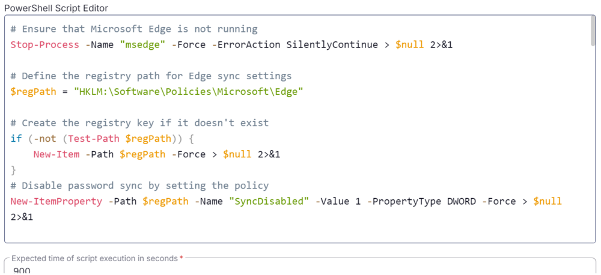

Paste in the following PowerShell script and set the expected time of script execution to **900 seconds**.

```powershell
# Ensure that Microsoft Edge is not running
Stop-Process -Name "msedge" -Force -ErrorAction SilentlyContinue > $null 2>&1

# Define the registry path for Edge sync settings
$regPath = "HKLM:\\Software\\Policies\\Microsoft\\Edge"

# Create the registry key if it doesn't exist
if (-not (Test-Path $regPath)) {
    New-Item -Path $regPath -Force > $null 2>&1
}

# Disable password sync by setting the policy
New-ItemProperty -Path $regPath -Name "SyncDisabled" -Value 1 -PropertyType DWORD -Force > $null 2>&1
Write-Output "Password sync from Microsoft Edge cloud has been disabled for Edge Wallet"

# Function to count and log password files
function Log-PasswordFiles {
    param (
        [string]$browserName,
        [string]$userName,
        [string]$path,
        [string[]]$items
    )
    $successCount = 0
    $failureCount = 0
    foreach ($item in $items) {
        if (Test-Path -Path "$path\\$item") {
            try {
                Remove-Item -Path "$path\\$item" -Force -Confirm:$False -ErrorAction Stop
                $successCount++
            }
            catch {
                $failureCount++
                $Reason = "$($_.Exception.Message)"
            }
        }
    }
    if ($successCount -gt 0) {
        Write-Information "-- $successCount passwords removed in $browserName for $userName " -InformationAction Continue
    }
    if ($failureCount -gt 0) {
        Write-Information "-- $failureCount passwords failed to remove in $browserName for $userName " -InformationAction Continue
    }
}
```

```powershell
# Chromium
if ((Get-ChildItem -Path HKLM:\\SOFTWARE\\Microsoft\\Windows\\CurrentVersion\\Uninstall, HKLM:\\SOFTWARE\\Wow6432Node\\Microsoft\\Windows\\CurrentVersion\\Uninstall | Get-ItemProperty | Where-Object { $_.DisplayName -match 'Chrome|Brave|Edge' }).DisplayName) {
    Get-Process -Name chrome, msedge, brave -ErrorAction SilentlyContinue | Stop-Process -Force -Confirm:$False -WarningAction SilentlyContinue > $null 2>&1
    Start-Sleep -Seconds 10
    foreach ($path in (Get-ChildItem -Path 'C:\\Users' | Where-Object { $_.Mode -match 'd' })) {
        foreach ($Browser in 'Google\\Chrome', 'Microsoft\\Edge', 'BraveSoftware\\Brave-Browser') {
            if (Test-Path -Path "$($path.FullName)\\Appdata\\Local\\$Browser") {
                Log-PasswordFiles -browserName $(($Browser -split '\\\\') -replace '-Browser','') -userName $($path.Name) -path "$($path.FullName)\\Appdata\\Local\\$Browser\\User Data\\Default" -items @('Login Data', 'Login Data-journal')
            }
        }
    }
}
```

```powershell
# Firefox
if ((Get-ChildItem -Path HKLM:\\SOFTWARE\\Microsoft\\Windows\\CurrentVersion\\Uninstall, HKLM:\\SOFTWARE\\Wow6432Node\\Microsoft\\Windows\\CurrentVersion\\Uninstall | Get-ItemProperty | Where-Object { $_.DisplayName -match 'Firefox' }).DisplayName) {
    Get-Process -Name firefox -ErrorAction SilentlyContinue | Stop-Process -Force -Confirm:$False -WarningAction SilentlyContinue > $null 2>&1
    Start-Sleep -Seconds 10
    foreach ($path in (Get-ChildItem -Path 'C:\\Users' | Where-Object { $_.Mode -match 'd' })) {
        if (Test-Path -Path "$($path.FullName)\\Appdata\\Roaming\\Mozilla\\Firefox\\Profiles") {
            foreach ($profile in ((Get-ChildItem -Path "$($path.FullName)\\Appdata\\Roaming\\Mozilla\\Firefox\\Profiles" | Where-Object { $_.Mode -match 'd' }).FullName)) {
                Log-PasswordFiles -browserName 'Firefox' -userName $($path.Name) -path $profile -items @('signons.txt', 'signons2.txt', 'signons3.txt', 'signons.sqllite', 'logins.json', 'logins-backup.json')
            }
        }
    }
}
```

##### Row 2f(v): Function: Script Log


In the script log message, type `%output%` so that the script will send the results of the PowerShell script above to the output on the Automation tab for the target device.


##### Row 2f(vi): Function: Set Custom Field

Select Function 'Set Custom Field'. When you select `set custom field`, it will open a new window.

In this window, search for the `Browser Saved Pwd Audit Data` field.

- **Custom Field:** `Browser Saved Pwd Audit Data`  
- **Value:** `%output%`


##### Row 2f(vii): Function: Script Exit


In the script Exit, leave it empty and save.


### Row 3: Complete

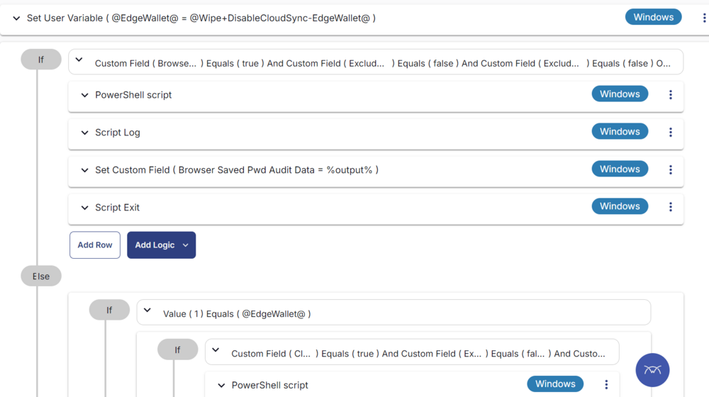

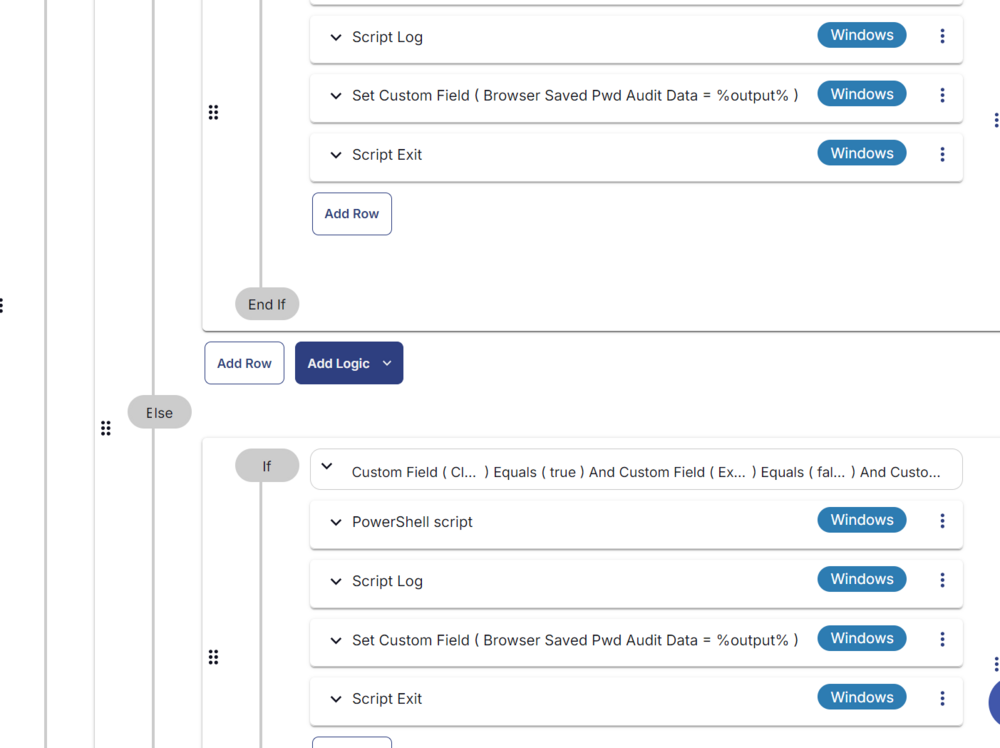

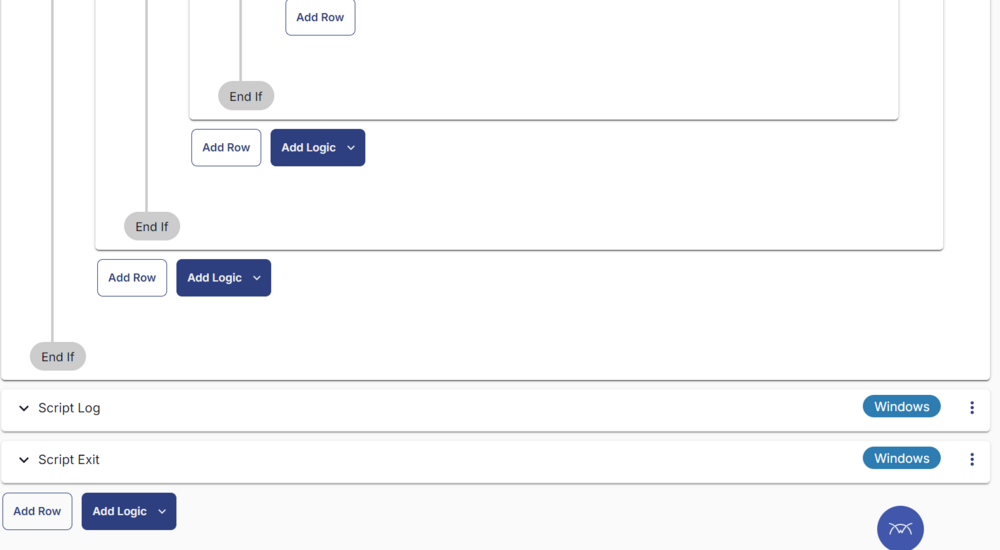

## Deployment

It is suggested to run the Task daily or weekly on the groups "Clear Browser Saved Password endpoints" and "Browser Saved Password Audit Group."  
Refer to the Group documentation: [Dynamic Groups - Browser Saved Password](/docs/a9b4c5f1-c1bb-4e0d-8a2f-fad1bca51d47) on how to create it.

- Go to `Automation` > `Tasks.`
- Search for `Clear/Audit - Browser Saved Password` Task.
- Select the concerned task.
- Click on `Schedule` to schedule the task/script.

This screen will appear.

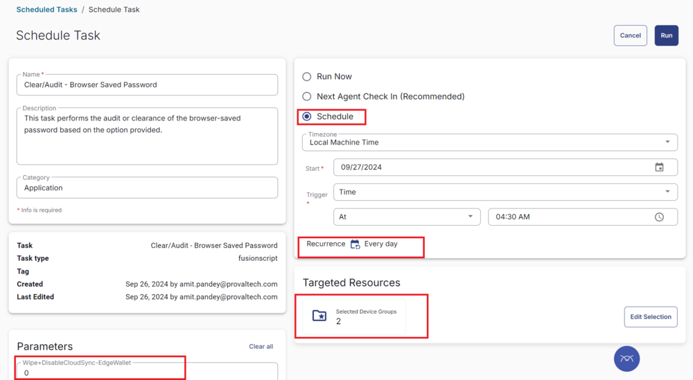

- Select the time to run the script and click the "Does not repeat" button.

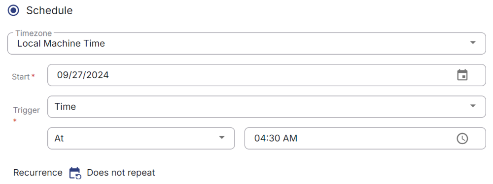

- A pop-up box will appear.
- Change the number of hours to `2` and click `OK`.

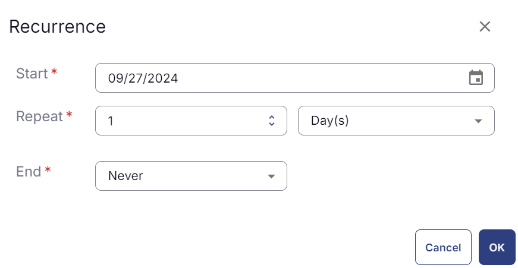

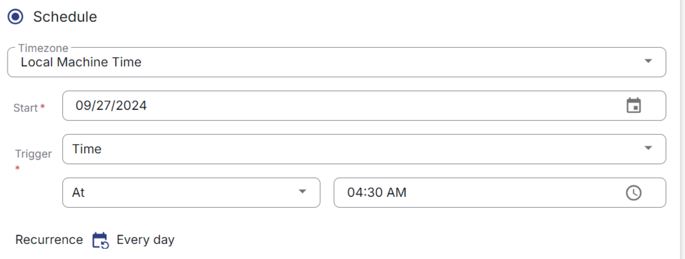

- Search for `Cyrisma Sensor Deployment` in the `Resources*` and select it. You can search and select any relevant group you would like to schedule the task against. If the site doesn't have a device group that includes all Windows agents, then create one and schedule the task on it.

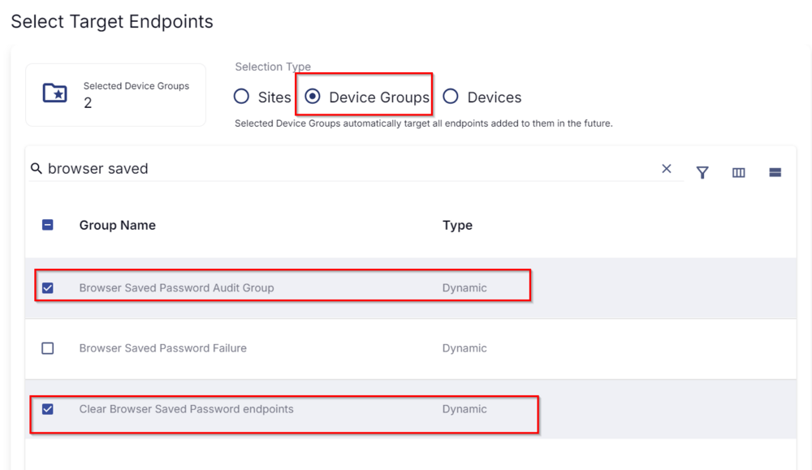

- Now click the `Run` button to initiate the task.

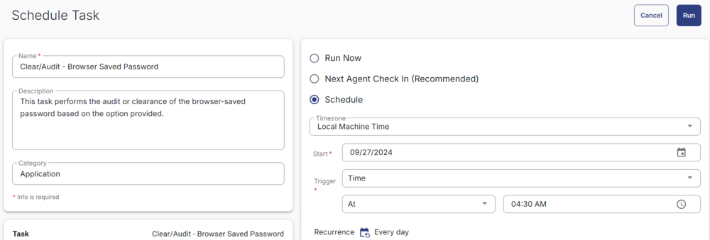

- The task will start appearing in the Scheduled Tasks.

## Output

- Script log
- Custom field

