## Summary

The CPU Threshold Violation is a preparation task that builds the local monitoring configuration used by the [CPU Threshold Violation Monitoring](/docs/b03e0a64-8e91-4d2b-b08a-d320713e295b) monitor set. It does **not** perform any monitoring itself. Instead, it reads the threshold values you define in ConnectWise RMM custom fields and writes a simple JSON file that the monitor set reads every time it runs.

### How it works

1. **Custom Fields Evaluation**  
   The script reads the CPU monitoring thresholds from custom fields at the Company, Site, and Endpoint levels. It follows a strict priority order: **Endpoint → Site → Company**. If a value is set at the Endpoint level, that value is used. If not, the Site level is checked, then the Company level. If no value is set at any level, a sensible default is applied.

2. **Server & Workstation Separation**  
   The script automatically detects whether the endpoint is a Windows Server or Workstation and applies the correct set of Company/Site fields (`_Svr` or `_Wks` suffix). This allows you to set different thresholds for servers and workstations without duplicating scripts.

3. **Configuration File Generation**  
   Once the final values are resolved, the script writes a JSON configuration file to the endpoint:

   ```PlainText
   C:\ProgramData\_Automation\Script\Test-CPUUsage\Test-CPUUsage.json
   ```

   The file contains three numbers:
   - **HighThreshold** – CPU percentage that, once exceeded, starts the timer.
   - **LowThreshold** – CPU percentage that resets the timer if usage drops below it.
   - **UsageMins** – the number of minutes the CPU must stay above the low threshold (after the initial spike above the high threshold) before an alert is triggered.

### Sample Scenario 1: Using Default Values

No custom fields are configured at any level. The script runs on a server and uses the built‑in defaults for servers: High = 95, Low = 90, Minutes = 30.

The resulting configuration file would be:

```json
{
    "HighThreshold": 95,
    "LowThreshold": 90,
    "UsageMins": 30
}
```

### Sample Scenario 2: Using Custom Field Overrides

An administrator wants a tighter threshold for a critical finance server. At the Endpoint level, they set:

- `CTVM_HighThreshold` = `98`
- `CTVM_LowThreshold` = `90`
- `CTVM_UsageMins` = `15`

The script runs and, because the Endpoint fields take priority over any Company or Site fields, the configuration file becomes:

```json
{
    "HighThreshold": 98,
    "LowThreshold": 90,
    "UsageMins": 15
}
```

On all other servers where no Endpoint-level fields are set, the script falls back to the Company or default values.

### Ticketing & Alerting Behavior

- A separate [CPU Threshold Violation Monitoring](/docs/b03e0a64-8e91-4d2b-b08a-d320713e295b) monitor set reads the configuration file and periodically checks the CPU usage.
- An alert is triggered only when the CPU first exceeds the **high threshold** and then **continues to stay above the low threshold** for the number of minutes specified in `UsageMins`.
- When the CPU drops below the low threshold, the condition clears. Because CW RMM does not support auto‑closing these alerts, any generated tickets must be closed manually by a technician after the issue is resolved.

## Sample Run

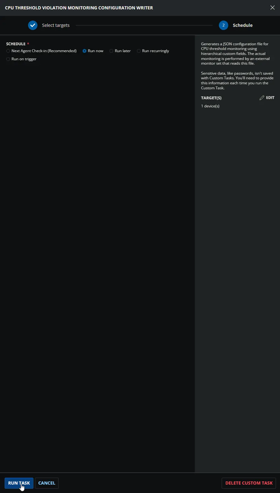

## Dependencies

- [Custom Field: CTVM_Enable](/docs/aa6be36d-3653-4f68-b9fe-5bdb7c7f5c20)
- [Custom Field: CTVM_Enable_Svr](/docs/5f3cb7ce-6d25-4199-9434-574fb2ed6542)
- [Custom Field: CTVM_Enable_Svr_Site](/docs/f991ac6d-10ed-4957-8cb7-72b08d01f4d3)
- [Custom Field: CTVM_Enable_Wks](/docs/5b985126-3e3d-4b86-b306-5a93381df895)
- [Custom Field: CTVM_Enable_Wks_Site](/docs/06dee656-c32f-4117-97fe-1641b0e29ab7)
- [Custom Field: CTVM_HighThreshold](/docs/9c3a9dff-a7f0-4a97-91a5-8e41f035c1e9)
- [Custom Field: CTVM_HighThreshold_Svr](/docs/8ff763ee-fb5c-4ca5-a693-543b2015fd2d)
- [Custom Field: CTVM_HighThreshold_Svr_Site](/docs/a0d5a32a-e7cd-4e3a-b870-d475ff1fb2d1)
- [Custom Field: CTVM_HighThreshold_Wks](/docs/9828050e-4ca5-492e-a61f-97a9462a3de0)
- [Custom Field: CTVM_HighThreshold_Wks_Site](/docs/b6f96b1c-a6cb-4e98-b3e7-596ad90440ad)
- [Custom Field: CTVM_LowThreshold](/docs/f922a73f-a445-4cf9-b847-747dc309acc5)
- [Custom Field: CTVM_LowThreshold_Svr](/docs/59b3f03e-9f6c-4ef7-9e9f-f6b69df4cf7a)
- [Custom Field: CTVM_LowThreshold_Svr_Site](/docs/c81ccbcc-b7c0-4c61-b53b-4f096dfaf1e5)
- [Custom Field: CTVM_LowThreshold_Wks](/docs/63c4478d-df7e-45b1-8690-8a3a0f0549ed)
- [Custom Field: CTVM_LowThreshold_Wks_Site](/docs/173abaea-0028-432e-a565-1c41e2f01345)
- [Custom Field: CTVM_UsageMins](/docs/3f442fad-1a4a-4793-91f3-46ee9b16e956)
- [Custom Field: CTVM_UsageMins_Svr](/docs/86db6615-4751-4c40-8018-53be3ed9db13)
- [Custom Field: CTVM_UsageMins_Svr_Site](/docs/453bb759-8a08-42b1-9a9c-18e30d20d478)
- [Custom Field: CTVM_UsageMins_Wks](/docs/df1733e0-701e-4d73-9826-404f1921a1db)
- [Custom Field: CTVM_UsageMins_Wks_Site](/docs/3abfb2fc-2278-46d5-beb9-e26fa4c20a6f)
- [Group: CPU Threshold Violation Monitoring](/docs/006889e2-8977-4957-9c4d-7381bdbea9a0)
- [Solution: CPU Threshold Violation Monitoring](/docs/49b06af7-af3b-4aaa-a90c-8efb28a65c9e)

## Custom Fields

The following table lists all custom fields used by the to determine the CPU monitoring thresholds. The `Enable` fields are not listed here; they are used exclusively by the automation group to decide whether the script runs at all.

| Name | Example | Level | Type | Default Value | Description |
| --- | --- | --- | --- | --- | --- |
| [CTVM_HighThreshold_Svr](/docs/8ff763ee-fb5c-4ca5-a693-543b2015fd2d) | `95`, `98` | Company | Text Box | `95` | Defines Company baseline high CPU % for servers. This value starts the timer when exceeded. Overridden by Site or Endpoint. |
| [CTVM_HighThreshold_Wks](/docs/9828050e-4ca5-492e-a61f-97a9462a3de0) | `90`, `98` | Company | Text Box | `90` | Defines Company baseline high CPU % for workstations. This value starts the timer when exceeded. Overridden by Site or Endpoint. |
| [CTVM_HighThreshold_Svr_Site](/docs/a0d5a32a-e7cd-4e3a-b870-d475ff1fb2d1) | `95`, `99` | Site | Text Box | – | Site‑level override for servers. Overrides Company; overridden by Endpoint. |
| [CTVM_HighThreshold_Wks_Site](/docs/b6f96b1c-a6cb-4e98-b3e7-596ad90440ad) | `90`, `92` | Site | Text Box | – | Site‑level override for workstations. Overrides Company; overridden by Endpoint. |
| [CTVM_HighThreshold](/docs/9c3a9dff-a7f0-4a97-91a5-8e41f035c1e9) | `98`, `88` | Endpoint | Text Box | – | Endpoint‑level high CPU %. Overrides all higher levels (applies to both OS types). |
| [CTVM_LowThreshold_Svr](/docs/59b3f03e-9f6c-4ef7-9e9f-f6b69df4cf7a) | `90`, `85` | Company | Text Box | `90` | Defines Company baseline low CPU % for servers. If usage drops below this, the timer resets. Overridden by Site or Endpoint. |
| [CTVM_LowThreshold_Wks](/docs/63c4478d-df7e-45b1-8690-8a3a0f0549ed) | `85`, `80` | Company | Text Box | `85` | Defines Company baseline low CPU % for workstations. If usage drops below this, the timer resets. Overridden by Site or Endpoint. |
| [CTVM_LowThreshold_Svr_Site](/docs/c81ccbcc-b7c0-4c61-b53b-4f096dfaf1e5) | `80`, `75` | Site | Text Box | – | Site‑level override for servers. Overrides Company; overridden by Endpoint. |
| [CTVM_LowThreshold_Wks_Site](/docs/173abaea-0028-432e-a565-1c41e2f01345) | `80`, `70` | Site | Text Box | – | Site‑level override for workstations. Overrides Company; overridden by Endpoint. |
| [CTVM_LowThreshold](/docs/f922a73f-a445-4cf9-b847-747dc309acc5) | `85`, `75` | Endpoint | Text Box | – | Endpoint‑level low CPU %. Overrides all higher levels (applies to both OS types). |
| [CTVM_UsageMins_Svr](/docs/86db6615-4751-4c40-8018-53be3ed9db13) | `30`, `15` | Company | Text Box | `30` | Defines Company baseline for servers: minutes CPU must stay above low threshold after initially exceeding the high threshold before an alert fires. Overridden by Site or Endpoint. |
| [CTVM_UsageMins_Wks](/docs/df1733e0-701e-4d73-9826-404f1921a1db) | `30`, `20` | Company | Text Box | `30` | Defines Company baseline for workstations: minutes CPU must stay above low threshold after initially exceeding the high threshold before an alert fires. Overridden by Site or Endpoint. |
| [CTVM_UsageMins_Svr_Site](/docs/453bb759-8a08-42b1-9a9c-18e30d20d478) | `15`, `10` | Site | Text Box | – | Site‑level override for servers. Overrides Company; overridden by Endpoint. |
| [CTVM_UsageMins_Wks_Site](/docs/3abfb2fc-2278-46d5-beb9-e26fa4c20a6f) | `20`, `10` | Site | Text Box | – | Site‑level override for workstations. Overrides Company; overridden by Endpoint. |
| [CTVM_UsageMins](/docs/3f442fad-1a4a-4793-91f3-46ee9b16e956) | `5`, `10` | Endpoint | Text Box | – | Endpoint‑level sustained minutes. Overrides all higher levels (applies to both OS types). |

---

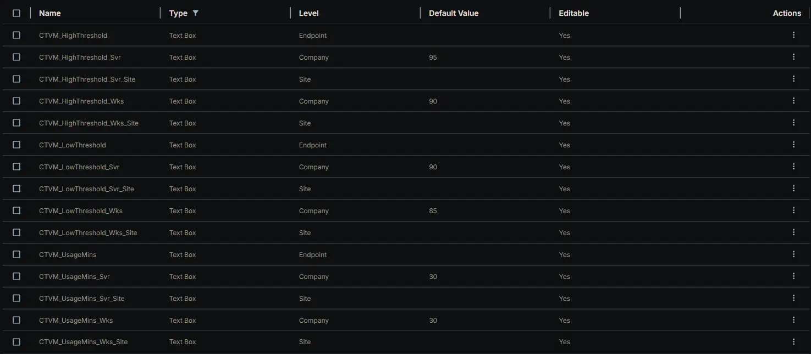

## Task Setup Path

- **Tasks Path:** `AUTOMATION` ➞ `Tasks`  
- **Task Type:** `Script Editor`  

## Task Creation

### **Description**

- **Name:** `CPU Threshold Violation Monitoring`  
- **Description:** `Generates a JSON configuration file for CPU threshold monitoring using hierarchical custom fields. The actual monitoring is performed by an external monitor set that reads this file.`  
- **Category:** `Monitoring`

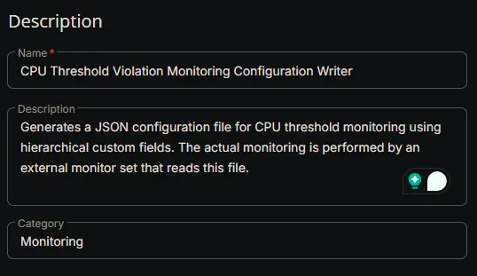

### **Script Editor**

#### **Row 1 Function: Set Pre-defined Variable ( @CTVM_HighThreshold@ = CTVM_HighThreshold  )**

- **Notes:** `CTVM_HighThreshold`
- **Continue on Failure:** `False`
- **Operating System:** `Windows`
- **Variable Name:** `CTVM_HighThreshold`
- **Custom Field:** `CTVM_HighThreshold (STRING - ENDPOINT)`

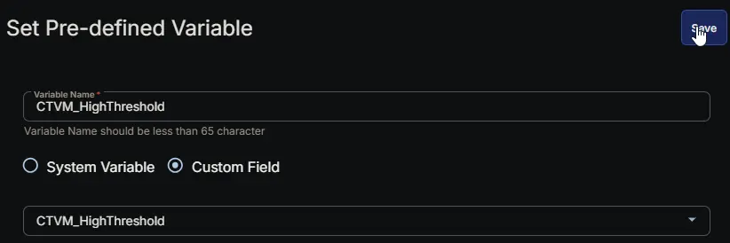

#### **Row 2 Function: Set Pre-defined Variable ( @CTVM_LowThreshold@ = CTVM_LowThreshold  )**

- **Notes:** `CTVM_LowThreshold`
- **Continue on Failure:** `False`
- **Operating System:** `Windows`
- **Variable Name:** `CTVM_LowThreshold`
- **Custom Field:** `CTVM_LowThreshold (STRING - ENDPOINT)`


#### **Row 3 Function: Set Pre-defined Variable ( @CTVM_UsageMins@ = CTVM_UsageMins  )**

- **Notes:** `CTVM_UsageMins`
- **Continue on Failure:** `False`
- **Operating System:** `Windows`
- **Variable Name:** `CTVM_UsageMins`
- **Custom Field:** `CTVM_UsageMins (STRING - ENDPOINT)`

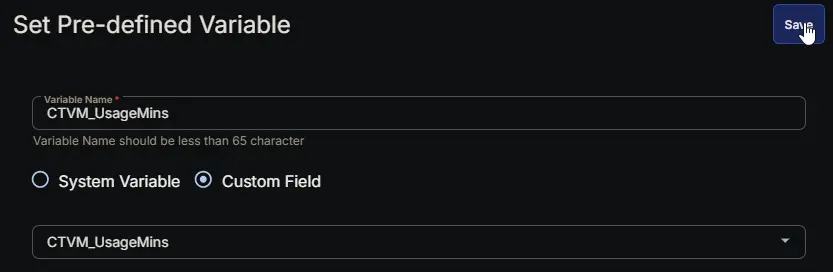

#### **Row 4 Function: Set Pre-defined Variable ( @CTVM_HighThreshold_Svr_Site@ = CTVM_HighThreshold_Svr_Site  )**

- **Notes:** `CTVM_HighThreshold_Svr_Site`
- **Continue on Failure:** `False`
- **Operating System:** `Windows`
- **Variable Name:** `CTVM_HighThreshold_Svr_Site`
- **Custom Field:** `CTVM_HighThreshold_Svr_Site (STRING - SITE)`

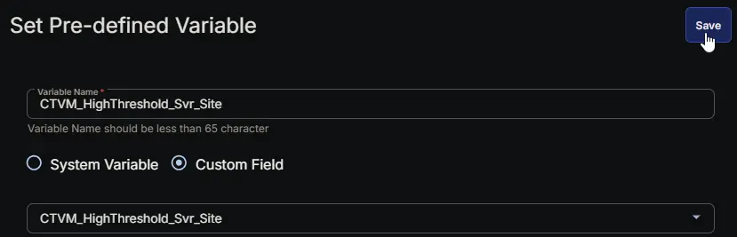

#### **Row 5 Function: Set Pre-defined Variable ( @CTVM_HighThreshold_Wks_Site@ = CTVM_HighThreshold_Wks_Site  )**

- **Notes:** `CTVM_HighThreshold_Wks_Site`
- **Continue on Failure:** `False`
- **Operating System:** `Windows`
- **Variable Name:** `CTVM_HighThreshold_Wks_Site`
- **Custom Field:** `CTVM_HighThreshold_Wks_Site (STRING - SITE)`

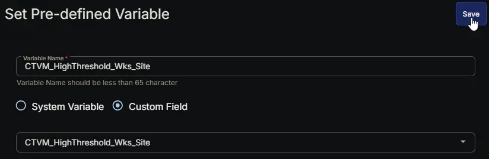

#### **Row 6 Function: Set Pre-defined Variable ( @CTVM_LowThreshold_Svr_Site@ = CTVM_LowThreshold_Svr_Site  )**

- **Notes:** `CTVM_LowThreshold_Svr_Site`
- **Continue on Failure:** `False`
- **Operating System:** `Windows`
- **Variable Name:** `CTVM_LowThreshold_Svr_Site`
- **Custom Field:** `CTVM_LowThreshold_Svr_Site (STRING - SITE)`

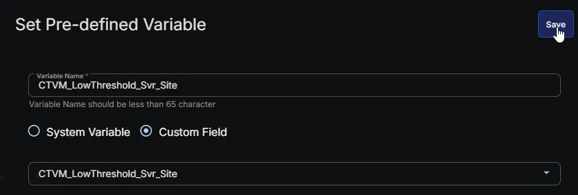

#### **Row 7 Function: Set Pre-defined Variable ( @CTVM_LowThreshold_Wks_Site@ = CTVM_LowThreshold_Wks_Site  )**

- **Notes:** `CTVM_LowThreshold_Wks_Site`
- **Continue on Failure:** `False`
- **Operating System:** `Windows`
- **Variable Name:** `CTVM_LowThreshold_Wks_Site`
- **Custom Field:** `CTVM_LowThreshold_Wks_Site (STRING - SITE)`

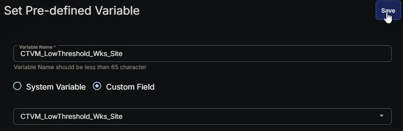

#### **Row 8 Function: Set Pre-defined Variable ( @CTVM_UsageMins_Svr_Site@ = CTVM_UsageMins_Svr_Site  )**

- **Notes:** `CTVM_UsageMins_Svr_Site`
- **Continue on Failure:** `False`
- **Operating System:** `Windows`
- **Variable Name:** `CTVM_UsageMins_Svr_Site`
- **Custom Field:** `CTVM_UsageMins_Svr_Site (STRING - SITE)`

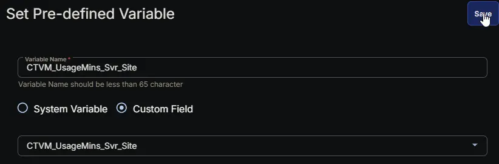

#### **Row 9 Function: Set Pre-defined Variable ( @CTVM_UsageMins_Wks_Site@ = CTVM_UsageMins_Wks_Site  )**

- **Notes:** `CTVM_UsageMins_Wks_Site`
- **Continue on Failure:** `False`
- **Operating System:** `Windows`
- **Variable Name:** `CTVM_UsageMins_Wks_Site`
- **Custom Field:** `CTVM_UsageMins_Wks_Site (STRING - SITE)`

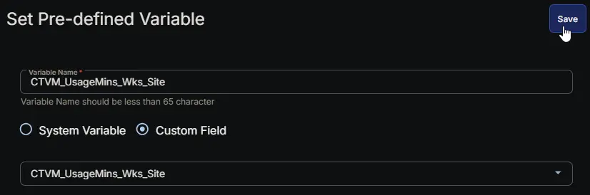

#### **Row 10 Function: Set Pre-defined Variable ( @CTVM_HighThreshold_Svr@ = CTVM_HighThreshold_Svr  )**

- **Notes:** `CTVM_HighThreshold_Svr`
- **Continue on Failure:** `False`
- **Operating System:** `Windows`
- **Variable Name:** `CTVM_HighThreshold_Svr`
- **Custom Field:** `CTVM_HighThreshold_Svr (STRING - COMPANY)`

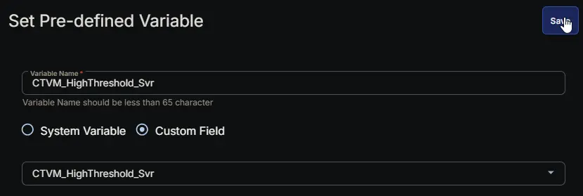

#### **Row 11 Function: Set Pre-defined Variable ( @CTVM_HighThreshold_Wks@ = CTVM_HighThreshold_Wks  )**

- **Notes:** `CTVM_HighThreshold_Wks`
- **Continue on Failure:** `False`
- **Operating System:** `Windows`
- **Variable Name:** `CTVM_HighThreshold_Wks`
- **Custom Field:** `CTVM_HighThreshold_Wks (STRING - COMPANY)`

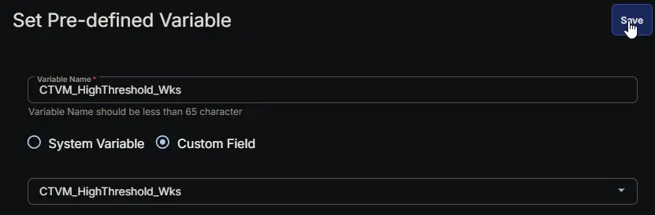

#### **Row 12 Function: Set Pre-defined Variable ( @CTVM_LowThreshold_Svr@ = CTVM_LowThreshold_Svr  )**

- **Notes:** `CTVM_LowThreshold_Svr`
- **Continue on Failure:** `False`
- **Operating System:** `Windows`
- **Variable Name:** `CTVM_LowThreshold_Svr`
- **Custom Field:** `CTVM_LowThreshold_Svr (STRING - COMPANY)`

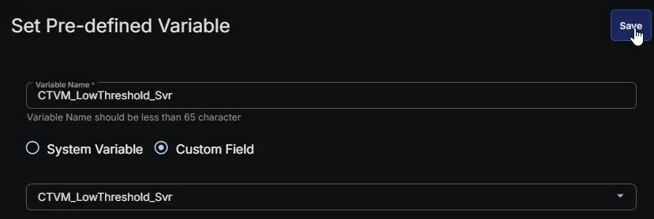

#### **Row 13 Function: Set Pre-defined Variable ( @CTVM_LowThreshold_Wks@ = CTVM_LowThreshold_Wks  )**

- **Notes:** `CTVM_LowThreshold_Wks`
- **Continue on Failure:** `False`
- **Operating System:** `Windows`
- **Variable Name:** `CTVM_LowThreshold_Wks`
- **Custom Field:** `CTVM_LowThreshold_Wks (STRING - COMPANY)`


#### **Row 14 Function: Set Pre-defined Variable ( @CTVM_UsageMins_Svr@ = CTVM_UsageMins_Svr  )**

- **Notes:** `CTVM_UsageMins_Svr`
- **Continue on Failure:** `False`
- **Operating System:** `Windows`
- **Variable Name:** `CTVM_UsageMins_Svr`
- **Custom Field:** `CTVM_UsageMins_Svr (STRING - COMPANY)`

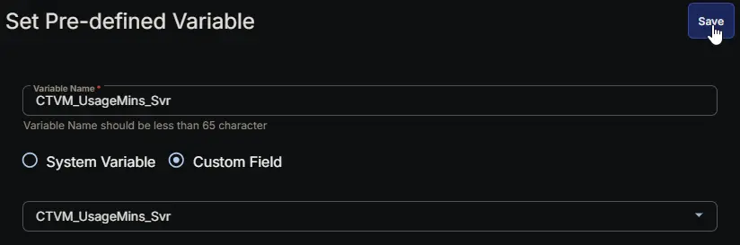

#### **Row 15 Function: Set Pre-defined Variable ( @CTVM_UsageMins_Wks@ = CTVM_UsageMins_Wks  )**

- **Notes:** `CTVM_UsageMins_Wks`
- **Continue on Failure:** `False`
- **Operating System:** `Windows`
- **Variable Name:** `CTVM_UsageMins_Wks`
- **Custom Field:** `CTVM_UsageMins_Wks (STRING - COMPANY)`

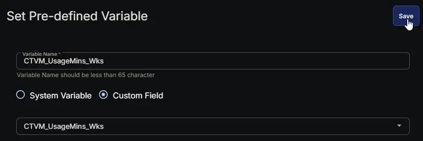

#### **Row 16 Function: PowerShell script**

- **Notes:** `<Leave it Blank>`  
- **Use Generative AI Assist for script creation:** `False`  
- **Expected time of script execution in seconds:** `300`  
- **Continue on Failure:** `False`  
- **Run As:** `System`  
- **Operating System:** `Windows`  
- **PowerShell Script Editor:**

```PowerShell
<#
.SYNOPSIS
    Generates a JSON configuration file for CPU threshold violation monitoring based on CW RMM hierarchical custom fields.

.DESCRIPTION
    This script resolves the CPU monitoring thresholds (high %, low %, sustained minutes) from hierarchically defined
    custom fields in CW RMM, then writes a local configuration file that a separate monitor set reads to perform
    the actual CPU usage monitoring and alerting.

    Workflow:
    1. Reads custom fields at Endpoint, Site, and Company levels using the CTVM_ naming convention.
    2. Detects the operating system type (Server vs. Workstation) to select the correct field suffixes (_Svr / _Wks).
    3. Applies hierarchical override logic: Endpoint > Site > Company, falling back to hard-coded defaults if nothing is set.
    4. Validates that the high threshold is greater than the low threshold.
    5. Creates a JSON configuration file under C:\ProgramData\_Automation\Script\<ProjectName>\.

    The actual monitoring is performed by a separate monitor set that reads this configuration file. This script
    itself does NOT perform any CPU monitoring.

.COMPONENT
    ------------------------------------------------------------------------
    CW RMM Task Custom Field Mapping
    ------------------------------------------------------------------------

| Name | Description | Level | Type | Option Type | Options | Help Text | Default Value | Editable |
|---|---|---|---|---|---|---|---|---|
| CTVM_Enable_Svr | Enables/disables CPU monitoring for servers at the Company level. (Used only by automation groups; not evaluated by this script.) | Company | Dropdown | String | Enable, Disable | Select Enable to turn on monitoring, Disable to exclude. | Disable | Yes |
| CTVM_Enable_Wks | Enables/disables CPU monitoring for workstations at the Company level. (Used only by automation groups.) | Company | Dropdown | String | Enable, Disable | Select Enable to turn on monitoring, Disable to exclude. | Disable | Yes |
| CTVM_Enable_Svr_Site | Enables/disables CPU monitoring for servers at the Site level. (Used only by automation groups.) | Site | Dropdown | String | Enable, Disable | Select Enable to turn on monitoring, Disable to exclude. | | Yes |
| CTVM_Enable_Wks_Site | Enables/disables CPU monitoring for workstations at the Site level. (Used only by automation groups.) | Site | Dropdown | String | Enable, Disable | Select Enable to turn on monitoring, Disable to exclude. | | Yes |
| CTVM_Enable | Enables/disables CPU monitoring at the Endpoint level. (Used only by automation groups.) | Endpoint | Dropdown | String | Enable, Disable | Select Enable to turn on monitoring, Disable to exclude. | | Yes |
| CTVM_HighThreshold_Svr | Company baseline for the high CPU % that starts the timer on servers. | Company | Text Box | | | Enter a number (e.g., 95). Must be higher than the low threshold. | 95 | Yes |
| CTVM_HighThreshold_Wks | Company baseline for the high CPU % that starts the timer on workstations. | Company | Text Box | | | Enter a number (e.g., 90). | 90 | Yes |
| CTVM_HighThreshold_Svr_Site | Site‑level override for the high CPU % on servers. | Site | Text Box | | | Enter a number. Overrides the Company value. | | Yes |
| CTVM_HighThreshold_Wks_Site | Site‑level override for the high CPU % on workstations. | Site | Text Box | | | Enter a number. Overrides the Company value. | | Yes |
| CTVM_HighThreshold | Endpoint‑level override for the high CPU %. Overrides all higher levels. | Endpoint | Text Box | | | Enter a number. Applies regardless of OS type. | | Yes |
| CTVM_LowThreshold_Svr | Company baseline for the low CPU % that resets the timer on servers. | Company | Text Box | | | Enter a number (e.g., 90). Must be lower than the high threshold. | 90 | Yes |
| CTVM_LowThreshold_Wks | Company baseline for the low CPU % that resets the timer on workstations. | Company | Text Box | | | Enter a number (e.g., 85). | 85 | Yes |
| CTVM_LowThreshold_Svr_Site | Site‑level override for the low CPU % on servers. | Site | Text Box | | | Enter a number. Overrides the Company value. | | Yes |
| CTVM_LowThreshold_Wks_Site | Site‑level override for the low CPU % on workstations. | Site | Text Box | | | Enter a number. Overrides the Company value. | | Yes |
| CTVM_LowThreshold | Endpoint‑level override for the low CPU %. Overrides all higher levels. | Endpoint | Text Box | | | Enter a number. Applies regardless of OS type. | | Yes |
| CTVM_UsageMins_Svr | Company baseline for the minutes of sustained high CPU before an alert on servers. | Company | Text Box | | | Enter the number of minutes (e.g., 30). | 30 | Yes |
| CTVM_UsageMins_Wks | Company baseline for the minutes of sustained high CPU before an alert on workstations. | Company | Text Box | | | Enter the number of minutes (e.g., 30). | 30 | Yes |
| CTVM_UsageMins_Svr_Site | Site‑level override for the alert threshold in minutes on servers. | Site | Text Box | | | Enter a number. Overrides the Company value. | | Yes |
| CTVM_UsageMins_Wks_Site | Site‑level override for the alert threshold in minutes on workstations. | Site | Text Box | | | Enter a number. Overrides the Company value. | | Yes |
| CTVM_UsageMins | Endpoint‑level override for the alert threshold in minutes. Overrides all higher levels. | Endpoint | Text Box | | | Enter a number. Applies regardless of OS type. | | Yes |

    ------------------------------------------------------------------------
    Enablement Field Usage (outside this script)
    ------------------------------------------------------------------------
    The CTVM_Enable* fields are NOT evaluated by this. They are used solely by
    CW RMM automation groups (or monitors) to determine whether this script should be executed on a
    given endpoint. When the resolved enablement value is 'Enable', the automation should run this
    script to generate the configuration file; otherwise, it should be skipped.

    Hierarchical Precedence (for thresholds):
        Endpoint (CTVM_* without Svr/Wks suffix) overrides Site and Company.
        Site (CTVM_*_Svr_Site / CTVM_*_Wks_Site) overrides Company.
        Company (CTVM_*_Svr / CTVM_*_Wks) provides the baseline default.

.NOTES
    ScriptName   = CPU Threshold Violation Monitoring
    Description  = Generates a JSON configuration file for CPU threshold monitoring using hierarchical custom fields.
                   The actual monitoring is performed by an external monitor set that reads this file.
    Defaults:
        Servers      – High: 95%, Low: 90%, Minutes: 30
        Workstations – High: 90%, Low: 85%, Minutes: 30

.OUTPUTS
    On success, writes the configuration file and returns $true.
    On failure (e.g., invalid thresholds, inaccessible path), throws a terminating error.
#>

#region globals
$ProgressPreference = 'SilentlyContinue'
$WarningPreference = 'SilentlyContinue'
#endregion

#region variables
$projectName = 'Test-CPUUsage'
$workingDirectory = '{0}\_Automation\Script\{1}' -f $env:ProgramData, $projectName
$configFilePath = '{0}\{1}.json' -f $workingDirectory, $projectName
#endregion

#region rmm variables
# Endpoint Level (Base Variables)
$computerLevelHighThreshold = '@CTVM_HighThreshold@'
$computerLevelLowThreshold = '@CTVM_LowThreshold@'
$computerLevelUsageMins = '@CTVM_UsageMins@'

# Site/Location Level (Server & Workstation splits)
$locationLevelHighThreshold_Svr = '@CTVM_HighThreshold_Svr_Site@'
$locationLevelHighThreshold_Wks = '@CTVM_HighThreshold_Wks_Site@'
$locationLevelLowThreshold_Svr = '@CTVM_LowThreshold_Svr_Site@'
$locationLevelLowThreshold_Wks = '@CTVM_LowThreshold_Wks_Site@'
$locationLevelUsageMins_Svr = '@CTVM_UsageMins_Svr_Site@'
$locationLevelUsageMins_Wks = '@CTVM_UsageMins_Wks_Site@'

# Company/Client Level (Server & Workstation splits)
$clientLevelHighThreshold_Svr = '@CTVM_HighThreshold_Svr@'
$clientLevelHighThreshold_Wks = '@CTVM_HighThreshold_Wks@'
$clientLevelLowThreshold_Svr = '@CTVM_LowThreshold_Svr@'
$clientLevelLowThreshold_Wks = '@CTVM_LowThreshold_Wks@'
$clientLevelUsageMins_Svr = '@CTVM_UsageMins_Svr@'
$clientLevelUsageMins_Wks = '@CTVM_UsageMins_Wks@'
#endregion

#region os detection & variable mapping
$osInfo = Get-CimInstance -ClassName 'Win32_OperatingSystem' -ErrorAction SilentlyContinue
$isServer = $osInfo.ProductType -ne 1

if ($isServer) {
    # Use the server‑specific Site & Company variables
    $locationLevelHighThreshold = $locationLevelHighThreshold_Svr
    $locationLevelLowThreshold = $locationLevelLowThreshold_Svr
    $locationLevelUsageMins = $locationLevelUsageMins_Svr

    $clientLevelHighThreshold = $clientLevelHighThreshold_Svr
    $clientLevelLowThreshold = $clientLevelLowThreshold_Svr
    $clientLevelUsageMins = $clientLevelUsageMins_Svr

    # Hard defaults for servers if nothing is configured
    $defaultHighThreshold = 95
    $defaultLowThreshold = 90
    $defaultUsageMins = 30
} else {
    # Use the workstation‑specific Site & Company variables
    $locationLevelHighThreshold = $locationLevelHighThreshold_Wks
    $locationLevelLowThreshold = $locationLevelLowThreshold_Wks
    $locationLevelUsageMins = $locationLevelUsageMins_Wks

    $clientLevelHighThreshold = $clientLevelHighThreshold_Wks
    $clientLevelLowThreshold = $clientLevelLowThreshold_Wks
    $clientLevelUsageMins = $clientLevelUsageMins_Wks

    # Hard defaults for workstations if nothing is configured
    $defaultHighThreshold = 90
    $defaultLowThreshold = 85
    $defaultUsageMins = 30
}
#endregion

#region set thresholds based on rmm variables (hierarchical override)
[int]$highThreshold = if (
    -not [string]::IsNullOrEmpty($computerLevelHighThreshold) -and
    $computerLevelHighThreshold -notmatch 'computerLevelHighThreshold' -and
    $computerLevelHighThreshold -match '^\d+$'
) {
    [int]$computerLevelHighThreshold
} elseif (
    -not [string]::IsNullOrEmpty($locationLevelHighThreshold) -and
    $locationLevelHighThreshold -notmatch 'locationLevelHighThreshold' -and
    $locationLevelHighThreshold -match '^\d+$'
) {
    [int]$locationLevelHighThreshold
} elseif (
    -not [string]::IsNullOrEmpty($clientLevelHighThreshold) -and
    $clientLevelHighThreshold -notmatch 'clientLevelHighThreshold' -and
    $clientLevelHighThreshold -match '^\d+$'
) {
    [int]$clientLevelHighThreshold
} else {
    $defaultHighThreshold
}

[int]$lowThreshold = if (
    -not [string]::IsNullOrEmpty($computerLevelLowThreshold) -and
    $computerLevelLowThreshold -notmatch 'computerLevelLowThreshold' -and
    $computerLevelLowThreshold -match '^\d+$'
) {
    [int]$computerLevelLowThreshold
} elseif (
    -not [string]::IsNullOrEmpty($locationLevelLowThreshold) -and
    $locationLevelLowThreshold -notmatch 'locationLevelLowThreshold' -and
    $locationLevelLowThreshold -match '^\d+$'
) {
    [int]$locationLevelLowThreshold
} elseif (
    -not [string]::IsNullOrEmpty($clientLevelLowThreshold) -and
    $clientLevelLowThreshold -notmatch 'clientLevelLowThreshold' -and
    $clientLevelLowThreshold -match '^\d+$'
) {
    [int]$clientLevelLowThreshold
} else {
    $defaultLowThreshold
}

[int]$usageMins = if (
    -not [string]::IsNullOrEmpty($computerLevelUsageMins) -and
    $computerLevelUsageMins -notmatch 'computerLevelUsageMins' -and
    $computerLevelUsageMins -match '^\d+$'
) {
    [int]$computerLevelUsageMins
} elseif (
    -not [string]::IsNullOrEmpty($locationLevelUsageMins) -and
    $locationLevelUsageMins -notmatch 'locationLevelUsageMins' -and
    $locationLevelUsageMins -match '^\d+$'
) {
    [int]$locationLevelUsageMins
} elseif (
    -not [string]::IsNullOrEmpty($clientLevelUsageMins) -and
    $clientLevelUsageMins -notmatch 'clientLevelUsageMins' -and
    $clientLevelUsageMins -match '^\d+$'
) {
    [int]$clientLevelUsageMins
} else {
    $defaultUsageMins
}

# Sanity check
if ($highThreshold -le $lowThreshold) {
    throw 'Configuration error: High threshold ({0}%) must be greater than low threshold ({1}%).' -f $highThreshold, $lowThreshold
}
#endregion

#region working directory
if (-not (Test-Path -Path $workingDirectory)) {
    try {
        New-Item -Path $workingDirectory -ItemType 'Directory' -Force -ErrorAction Stop | Out-Null
    } catch {
        throw ('Failed to create the working directory {2}{0}{2}. Error: {1}' -f $workingDirectory, $Error[0].Exception.Message, [char]34)
    }
}
#endregion

#region config file
$config = @{
    HighThreshold = $highThreshold
    LowThreshold  = $lowThreshold
    UsageMins     = $usageMins
}
try {
    $config | ConvertTo-Json -Depth 3 | Set-Content -Path $configFilePath -Force -Encoding 'UTF8' -ErrorAction Stop
} catch {
    throw ('Failed to write the configuration file {2}{0}{2}. Error: {1}' -f $configFilePath, $Error[0].Exception.Message, [char]34)
}

return ('Configuration file ''{0}'' written successfully.{1}{1}Configuration:{1}{2}' -f $configFilePath, [System.Environment]::NewLine, ($config | Out-String))
#endregion
```

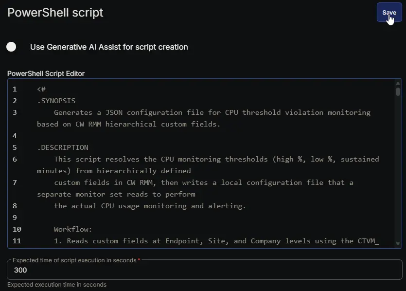

#### **Row 17 Function: Script Log**

- **Notes:** `<Leave it Blank>`  
- **Continue on Failure:** `False`  
- **Operating System:** `Windows`  
- **Script Log Message:** `%Output%`  

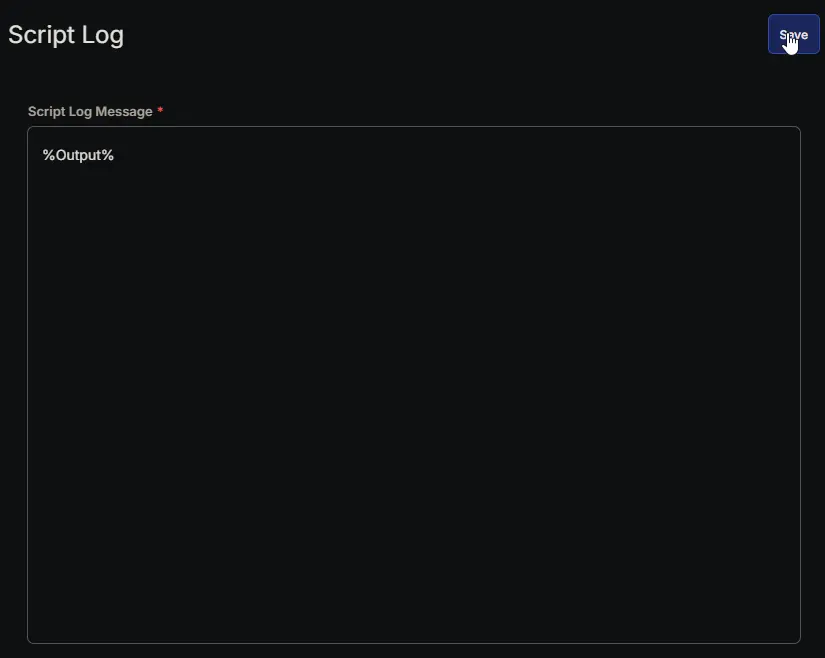

## Completed Script

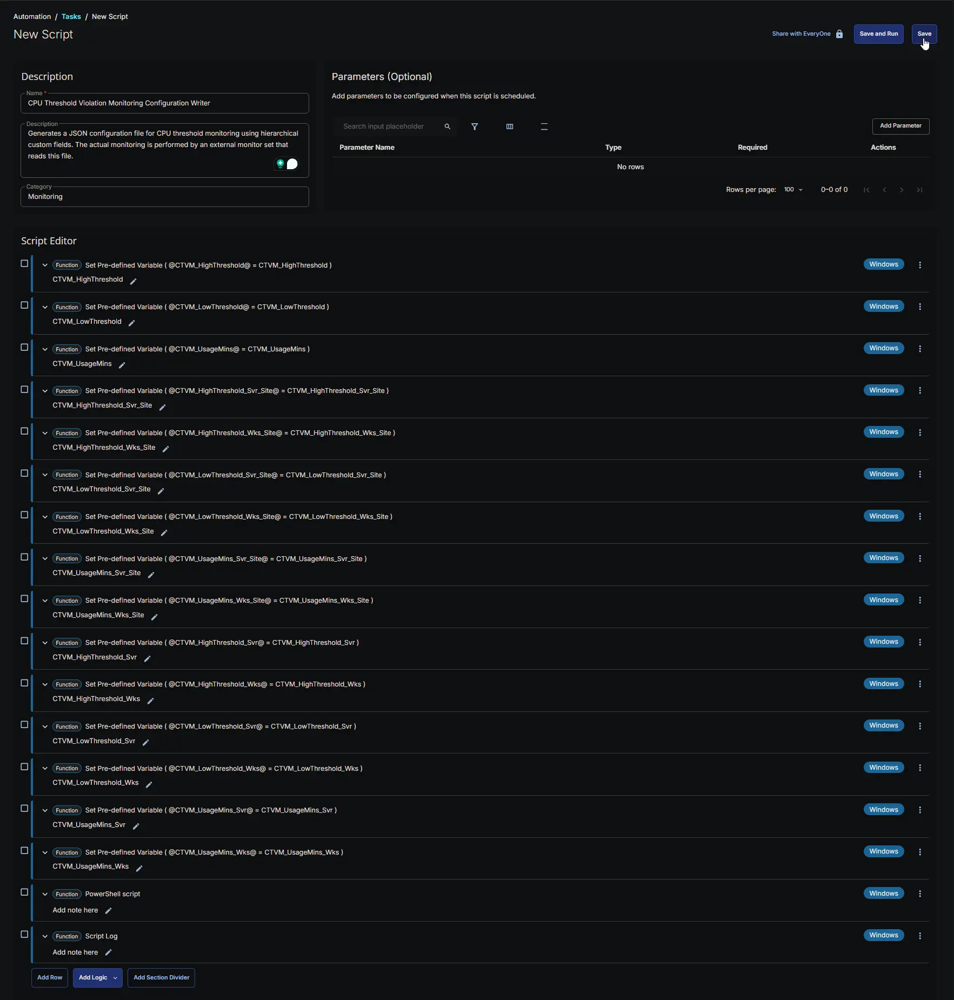

## Output

- Script Log
- JSON File at `C:\ProgramData\_Automation\Script\Test-CPUUsage\Test-CPUUsage.json`

## Schedule Task

### Task Details

- **Name:** `CPU Threshold Violation Monitoring`  
- **Description:** `Generates a JSON configuration file for CPU threshold monitoring using hierarchical custom fields. The actual monitoring is performed by an external monitor set that reads this file.`  
- **Category:** `Monitoring`  

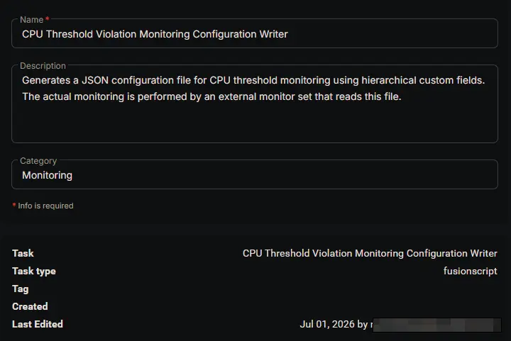

### Schedule

- **Schedule Type:**  `Schedule`  
- **Timezone:** `Local Machine Time`  
- **Start:** `<Current Date>`  
- **Trigger:** `Time` `At` `<Current Time>`  
- **Recurrence:** `Every day`
- **Execute at next agent check-in:** `True`
- **Stop After:** `22`
- **Unit:** `Hour(s)`

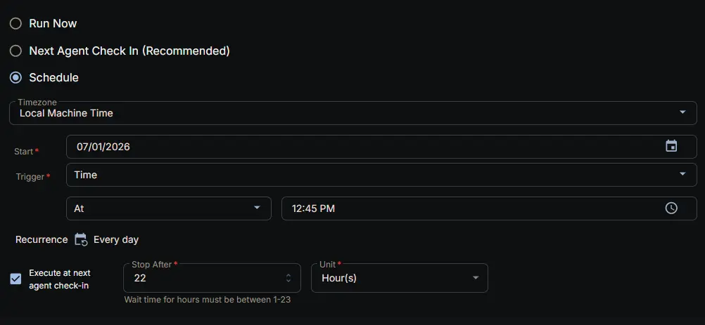

### Targeted Resource

**Device Group:** `CPU Threshold Violation Monitoring`

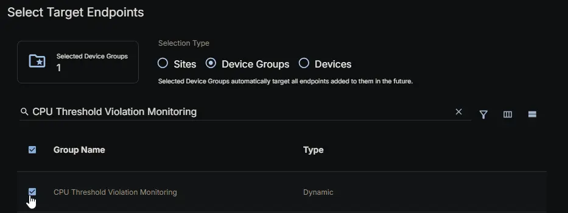

### Completed Scheduled Task

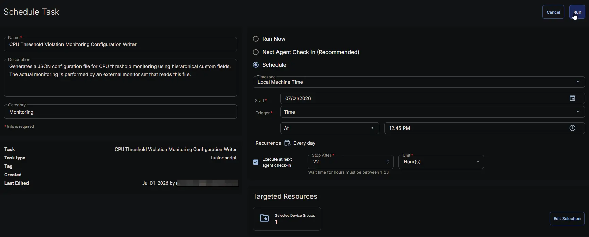

## Changelog

### 2026-07-01

- Initial version of the document
