## Summary

The task will generate a ConnectWise RMM Agent Deployment Group Policy Object (GPO) on the domain controller where it is run. It is recommended to execute the script on the Primary Domain Controller.

The established GPO will execute a PowerShell script on the terminal device at startup or after the computer reboots. This script will attempt to install the ConnectWise RMM Agent on the Windows computers within the domain that do not currently have the CW RMM agent installed.

The results of the script execution will be stored on the endpoint in either the `Install-RMMAgent-log.txt` or `Install-RMMAgent-Error.txt` files. These files can be found in the `C:/ProgramData/_automation/script/Install-RMMAgent` directory.

## GPO

**Scope:** The GPO will be linked with the domain.  
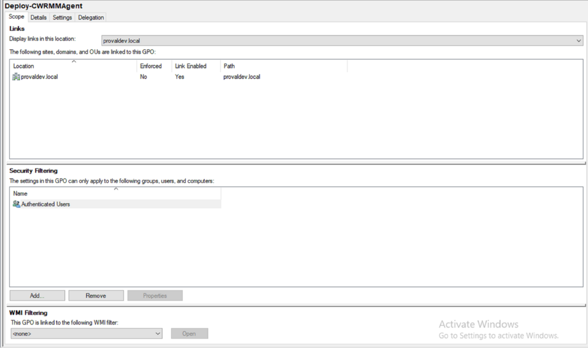

**Details:**  
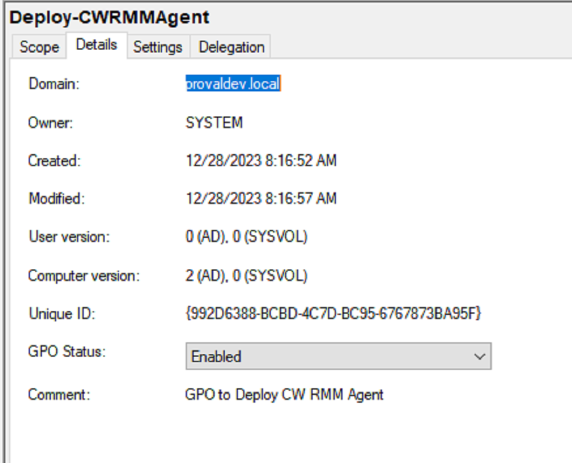

**Settings:**  
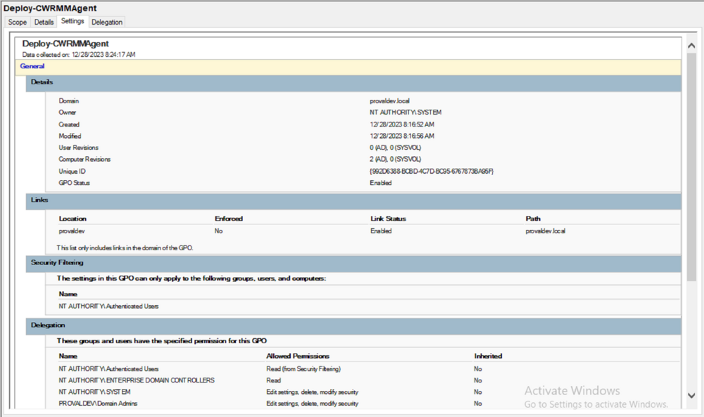  
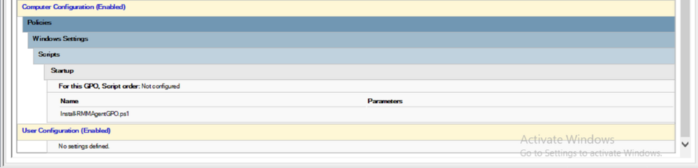

**Delegation:**  
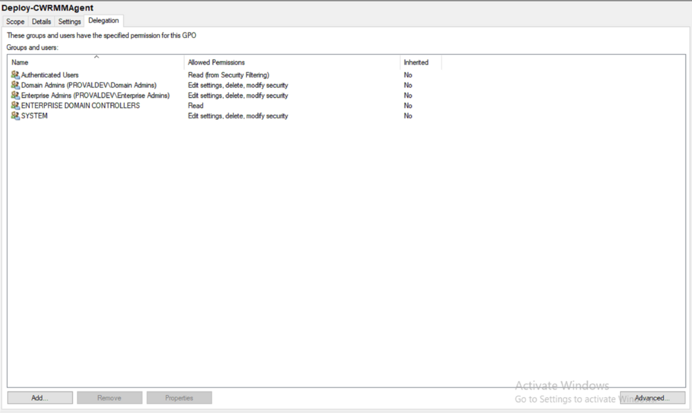

## Sample Run

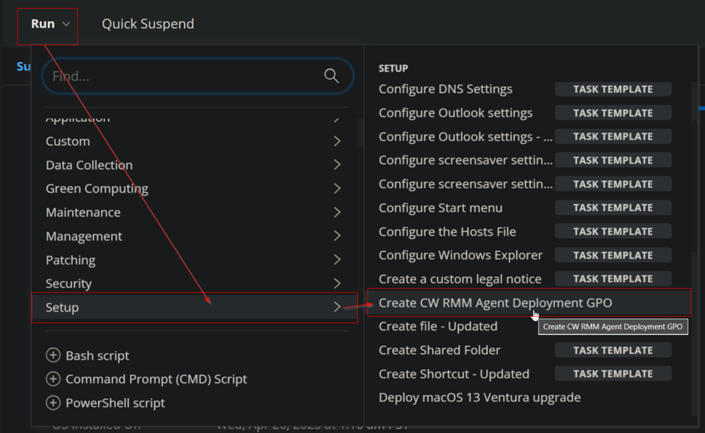  
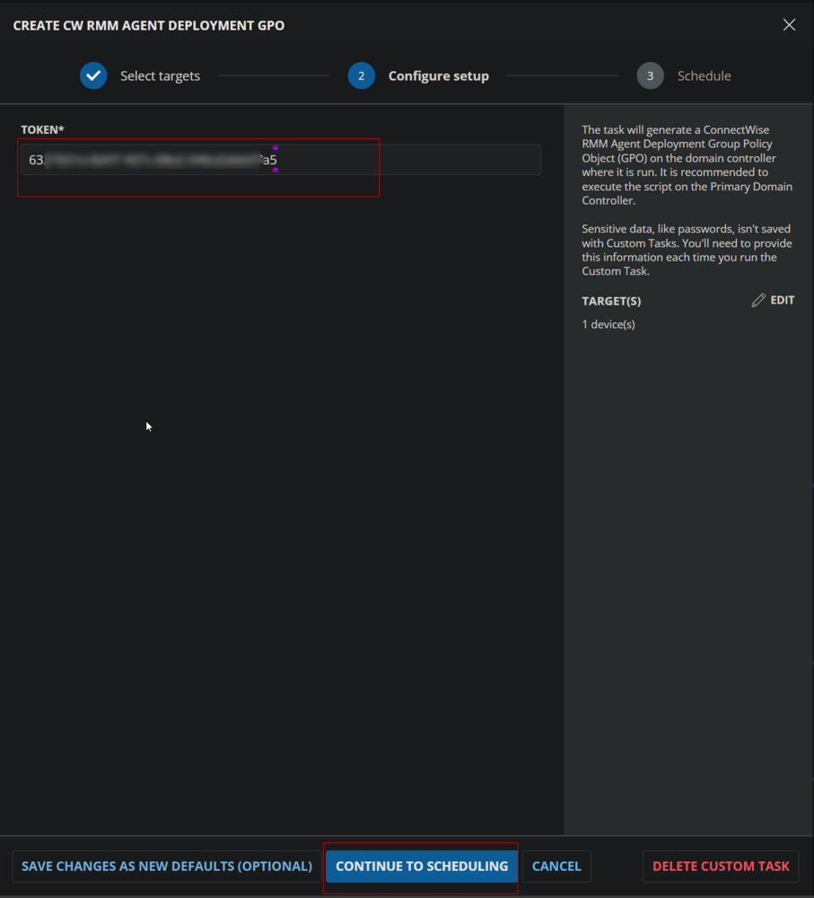  
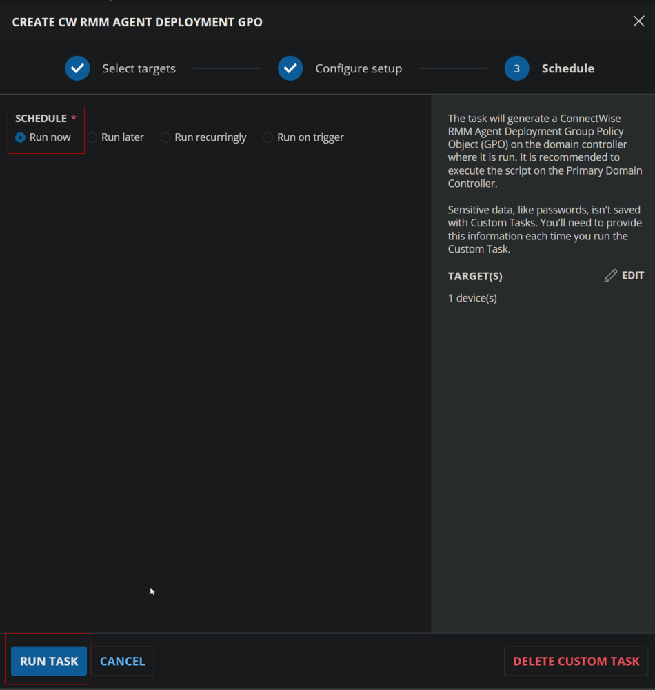

#### User Parameters

| Name  | Example                             | Required | Description                                                                                                          |
|-------|-------------------------------------|----------|----------------------------------------------------------------------------------------------------------------------|
| Token | 7f67c643-bf18-4c2b-be9d-f7a355e1f68a | True     | The ConnectWise RMM Agent Installer token corresponding to the client/site of the Domain Controller where the script is run. |

## Installer Token Generation

1. Go to **Devices** > **Computers**. Once the page loads, you will see a **Manage** option in the Action Bar, at the top-left of the page.
2. Click **Manage** to open the Menu Item. In the Menu, click **Download Agent.**  
   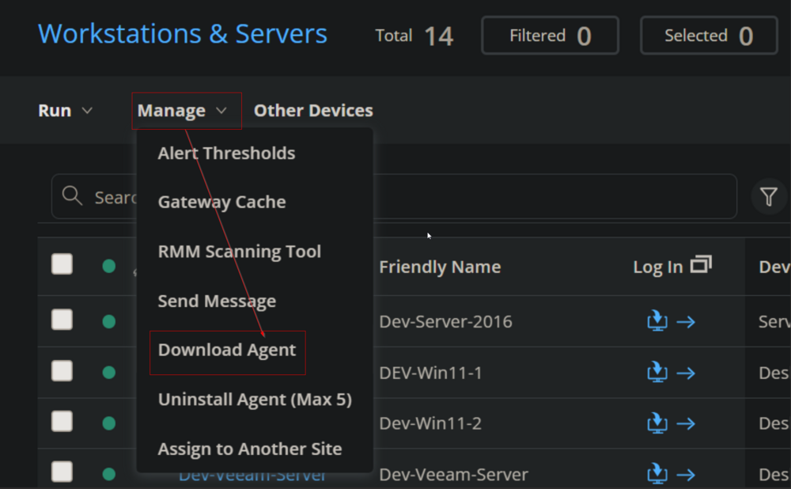
3. A new window will launch from where you can generate the agent installer token.  
   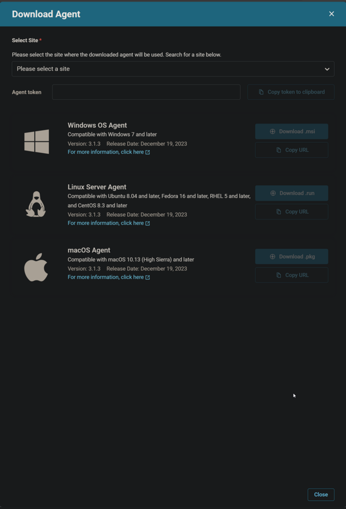
4. In the Download Agent window, select your site from the list of sites provided in the dropdown. You can also type to search for your site and select it.
5. After selecting the site, the `Agent Token` will be displayed. You can copy the token by clicking on the `Copy token to clipboard` button.  
   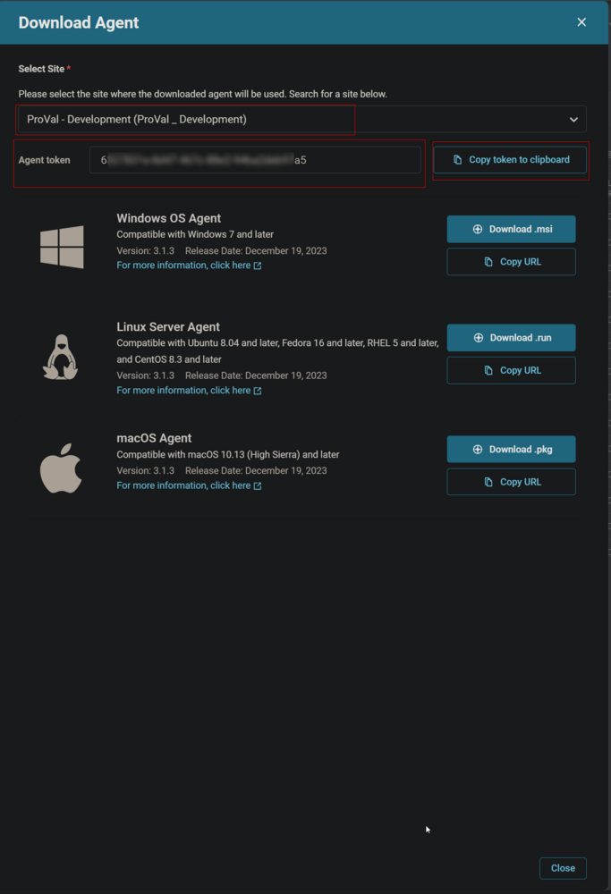

## Create Script

Create a new `Script Editor` style script in the system to implement this task.  
  


**Name:** `Create CW RMM Agent Deployment GPO`  
**Description:** `The task will generate a ConnectWise RMM Agent Deployment Group Policy Object (GPO) on the domain controller where it is run. It is recommended to execute the script on the Primary Domain Controller.`  
**Category:** `Setup`  
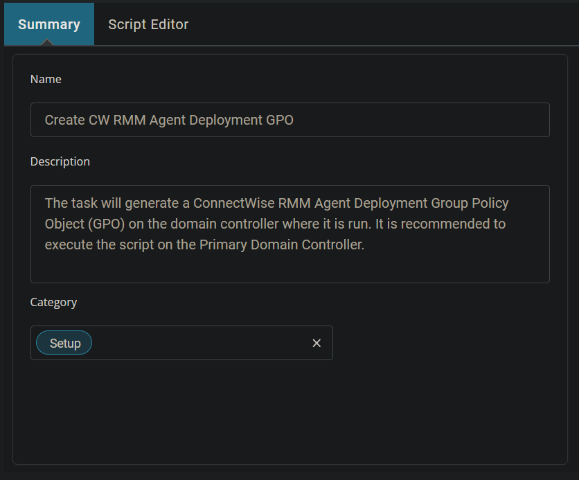

### Parameters

Click the `Add Parameter` button.  
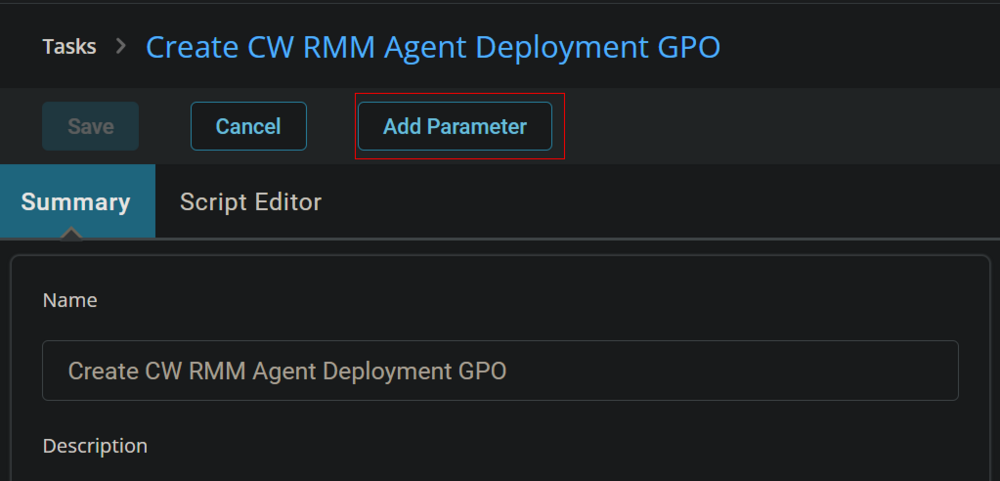

The `Add New Script Parameter` box will appear.  


In the box, fill in the following details and select `Save` to create the `Token` parameter.

- **Parameter Name:** `Token`
- **Required Field:** `True`
- **Parameter Type:** `Text String`
- **Default Value:** `False`  
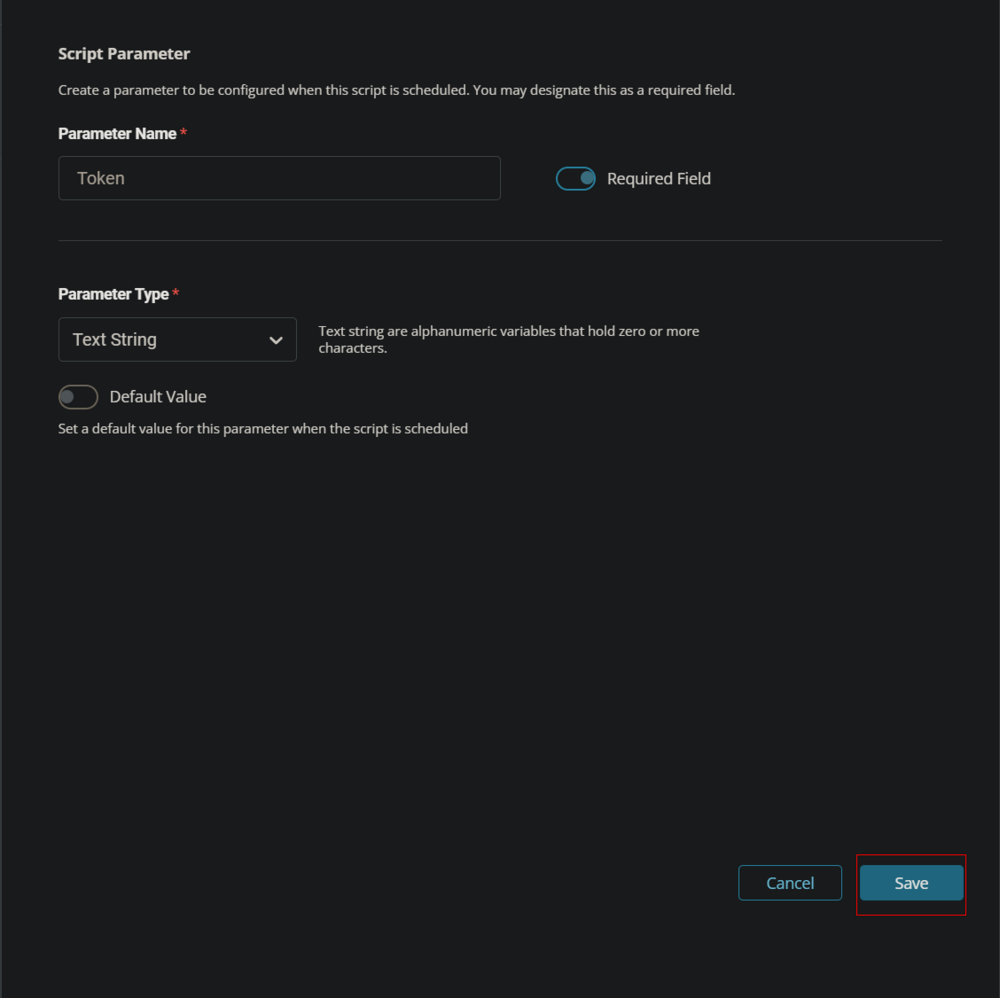

### Script

Start by adding a row. You can do this by clicking the `Add Row` button at the bottom of the script page.  


#### Row 1 Function: PowerShell Script

Select the `PowerShell Script` function.  
  
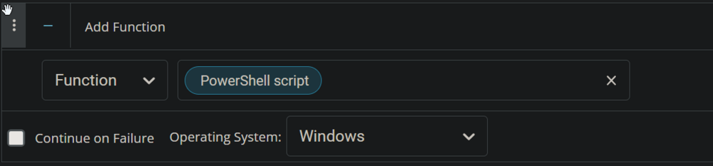  
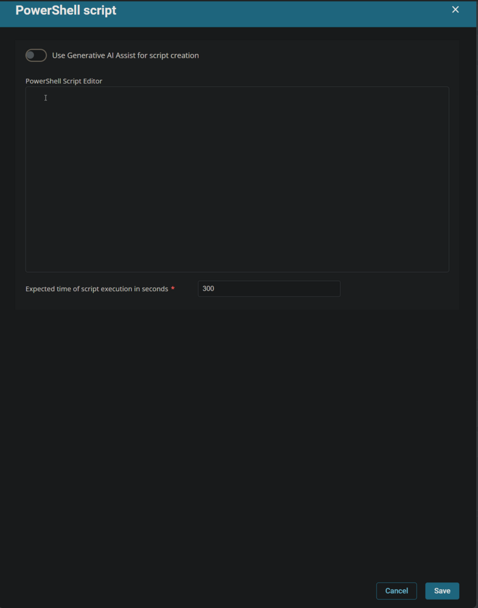

Paste in the following PowerShell script, set the expected time of script execution to `300` seconds, and click the `Save` button.

```
$Token = '@Token@'
#region Strapper
Set-ExecutionPolicy -Scope Process -ExecutionPolicy Bypass -Force -Erroraction SilentlyContinue
[Net.ServicePointManager]::SecurityProtocol = [Enum]::ToObject([Net.SecurityProtocolType], 3072)
Get-PackageProvider -Name NuGet -ForceBootstrap | Out-Null
Set-PSRepository -Name PSGallery -InstallationPolicy Trusted
try {
    Update-Module -Name Strapper -ErrorAction Stop
} catch {
    Install-Module -Name Strapper -Repository PSGallery -SkipPublisherCheck -Force
    Get-Module -Name Strapper -ListAvailable | Where-Object { $_.Version -ne (Get-InstalledModule -Name Strapper).Version } | ForEach-Object { Uninstall-Module -Name Strapper -MaximumVersion $_.Version }
}
Import-Module -Name Strapper 3>&1 2>&1 1>$null
Set-StrapperEnvironment
#endregion

#Working Directory
$ProjectName = 'Install-RMMAgentGPO'
$WorkingDirectory = "C:/ProgramData/_automation/script/$ProjectName"
$StrapperSession.LogPath = "$WorkingDirectory/$ProjectName-log.txt"
$StrapperSession.ErrorPath = "$WorkingDirectory/$ProjectName-Error.txt"

if ( !(Test-Path $WorkingDirectory) ) {
    try {
        New-Item -Path $WorkingDirectory -ItemType Directory -Force -Erroraction Stop| Out-Null
    } catch {
        Write-Log -Level Error -Text "Failed to Create $WorkingDirectory. Reason: $($Error[0].Exception.Message)"
    }
}

if (-not ( ( ( Get-Acl $WorkingDirectory ).Access | Where-Object { $_.IdentityReference -Match 'Everyone' } ).FileSystemRights -Match 'FullControl' ) ) {
    $ACl = Get-ACL $WorkingDirectory 
    $AccessRule = New-Object System.Security.AccessControl.FileSystemAccessRule('Everyone', 'FullControl', 'ContainerInherit, ObjectInherit', 'none', 'Allow')
    $Acl.AddAccessRule($AccessRule)
    Set-Acl  $WorkingDirectory $Acl
}
#End Region

#Process
Function New-ScriptFile {
    param (
    [Parameter(Mandatory = $True)]
    [ValidatePattern('^[a-f0-9]{8}(-[a-f0-9]{4}){3}-[a-f0-9]{12}$')]
    [String]$Token
)
    $ScriptText = @"
    if ( Get-Service -Name 'ITSPlatform','ITSPlatformManager' -ErrorAction SilentlyContinue ) {
        return 
    }
    
    #region Strapper
    Set-ExecutionPolicy -Scope Process -ExecutionPolicy Bypass -Force -Erroraction SilentlyContinue
    [Net.ServicePointManager]::SecurityProtocol = [Enum]::ToObject([Net.SecurityProtocolType], 3072)
    Get-PackageProvider -Name NuGet -ForceBootstrap | Out-Null
    Set-PSRepository -Name PSGallery -InstallationPolicy Trusted
    try {
        Update-Module -Name Strapper -ErrorAction Stop
    } catch {
        Install-Module -Name Strapper -Repository PSGallery -SkipPublisherCheck -Force
        Get-Module -Name Strapper -ListAvailable | Where-Object { $_.Version -ne (Get-InstalledModule -Name Strapper).Version } | ForEach-Object { Uninstall-Module -Name Strapper -MaximumVersion $_.Version }
    }
    Import-Module -Name Strapper 3>&1 2>&1 1>$null
    Set-StrapperEnvironment
    #endregion
    
    $ProjectName = 'Install-RMMAgent'
    $WorkingDirectory = "C:/ProgramData/_automation/script/$ProjectName"
    $StrapperSession.LogPath = "$WorkingDirectory/$ProjectName-log.txt"
    $StrapperSession.ErrorPath = "$WorkingDirectory/$ProjectName-Error.txt"
    $Installer = "$WorkingDirectory/Agent_TKN$($Token).msi"
    
    if ( !(Test-Path $WorkingDirectory) ) {
        try {
            New-Item -Path $WorkingDirectory -ItemType Directory -Force -Erroraction Stop| Out-Null
        } catch {
            Write-Log -Level Error -Text "Failed to Create $WorkingDirectory. Reason: $($Error[0].Exception.Message)"
        }
    }
    
    if (-not ( ( ( Get-Acl $WorkingDirectory ).Access | Where-Object { $_.IdentityReference -Match 'Everyone' } ).FileSystemRights -Match 'FullControl' ) ) {
        $ACl = Get-ACL $WorkingDirectory 
        $AccessRule = New-Object System.Security.AccessControl.FileSystemAccessRule('Everyone', 'FullControl', 'ContainerInherit, ObjectInherit', 'none', 'Allow')
        $Acl.AddAccessRule($AccessRule)
        Set-Acl  $WorkingDirectory $Acl
    }
    
    $DesktopURL = "https://prod.setup.itsupport247.net/windows/DPMA/32/Agent_TKN$($Token)/MSI/setup/"
    $ServerURL = "https://prod.setup.itsupport247.net/windows/MSMA/32/Agent_TKN$($Token)/MSI/setup/"
    
    $url = if ( ( Get-CimInstance -Class Win32_OperatingSystem ).Caption -match 'Server' ) { $ServerURL } else { $DesktopURL }
    
    try { 
        $webClient = [System.Net.WebClient]::new()
        $WebClient.DownloadFile($url, $installer) 
        Unblock-File -Path $Installer -Confirm:$false -ErrorAction SilentlyContinue
    } catch {
        Write-Log -Level Error -Text "Failed to download the installer. Reason: $($Error[0].Exception.Message)"
    }
    
    $ExitCode = (Start-Process 'C:/Windows/System32/msiexec.exe' -ArgumentList "/i `"$($installer)`" /qn" -Wait -PassThru).ExitCode
    
    do {
        try {$connection = Test-Connection 8.8.8.8 -Erroraction Stop} catch {$connection = 'down'}
    } until ($connection -ne 'Down')
    
    Start-Sleep -Seconds 30
    $serviceRestartTimeout = 1
    do {
        Write-Log -Level Information -Text 'Waiting for the ITPSPlatform Service to appear.'
        Start-Sleep -Seconds 1
        $serviceRestartTimeout++
    } until ( ( Get-Service -Name 'ITSPlatform','ITSPlatformManager' -ErrorAction SilentlyContinue ) -or $serviceRestartTimeout -gt 120 )
    
    if ( Get-Service -Name 'ITSPlatform','ITSPlatformManager' -ErrorAction SilentlyContinue ) {
        Write-Log -Level Information -Text 'Successfully installed CW RMM agent.'
        Start-Sleep -Seconds 30
        foreach ( $service in ( ( Get-Service -Name 'ITSPlatform','ITSPlatformManager' | Where-Object { $_.Status -ne 'Running' } ).Name) ) {
            Restart-Service -Name $service -Force -Confirm:$false -ErrorAction SilentlyContinue
        }
    } else {
        Write-Log -Level Error -Text "CW RMM Agent Installation Failed with exit code $ExitCode."
    }
"@
    $Utf8NoBomEncoding = New-Object System.Text.UTF8Encoding $False
    [System.IO.File]::WriteAllLines("$($WorkingDirectory)/$($ProjectName).ps1", $ScriptText, $Utf8NoBomEncoding)
}

Import-Module GroupPolicy
$ExistingGPO = Get-GPO -name 'Deploy-CWRMMAgent' 2>$Null
$domain = Get-ADDomain
$forest = $domain.forest
If ( !$ExistingGPO ) {
    New-ScriptFile -Token $Token
    $Name = 'Deploy-CWRMMAgent'
    $GPO = New-GPO -Name $name -Comment 'GPO to Deploy CW RMM Agent'
    Start-Sleep -s 5
    $guid = $gpo.id.ToString().ToUpper()
    Write-Log -Level Information -Text "Group Policy Created: $guid"
    $Target = $forest.Split('.')
    $GPO | New-GPLink -Target "dc=$($Target[0]),dc=$($Target[1])" -LinkEnabled Yes
    mkdir "C:/Windows/SYSVOL/sysvol/$forest/Policies/{$guid}/Machine/Scripts/Startup" -Force | Out-Null
    Copy-Item "$($WorkingDirectory)/$($ProjectName).ps1" "C:/Windows/SYSVOL/sysvol/$forest/Policies/{$guid}/Machine/Scripts/Startup" -Force

    $pshellscript = @"
[Startup]
0CmdLine=$($projectName).ps1
0Parameters=
"@

    $psfilename = "C:/Windows/SYSVOL/sysvol/$forest/Policies/{$guid}/Machine/Scripts/psscripts.ini"
    $pshellscript | Out-File $psfilename -Encoding unicode
    $psfile = Get-Item $psfilename -Force
    $psfile.attributes = 'Hidden'

    $gptini = @'
[General]
Version=2
displayName=New Group Policy Object
'@

    $gptinifilename = "C:/Windows/SYSVOL/sysvol/$forest/Policies/{$guid}/GPT.ini"
    $gptini | Out-File $gptinifilename -Encoding utf8
    $gPCMachineExtensionNames = '[{42B5FAAE-6536-11D2-AE5A-0000F87571E3}{40B6664F-4972-11D1-A7CA-0000F87571E3}]'
    $adgpo = ([adsisearcher]"(&amp;(objectCategory=groupPolicyContainer)(name={$guid}))").FindAll().Item(0)
    $gpoentry = $adgpo.GetDirectoryEntry()
    $gpoentry.Properties['gPCMachineExtensionNames'].Value = $gPCMachineExtensionNames
    $gpoentry.Properties['versionNumber'].Value = '2'
    $gpoentry.CommitChanges()
} else {
    Write-Log -Level Information -Text 'CW RMM Agent Deployment Group Policy Object exists'
    Write-Log -Level Information -Text $ExistingGPO
    $Guid = $ExistingGPO.ID.ToString().ToUpper()
    $oldscript = Get-Content -Path "C:/Windows/SYSVOL/sysvol/$forest/Policies/{$Guid}/Machine/Scripts/Startup/$ProjectName.ps1" -ErrorAction SilentlyContinue
    if ($oldscript -match $token) {
        Write-Log -Level Information -Text 'Token matches'
        return
    } else {
        Write-Log -Level Information -Text 'Token doesn’t match, applying new token'
        New-ScriptFile -Token $Token
        Copy-Item "$($WorkingDirectory)/$($ProjectName).ps1" "C:/Windows/SYSVOL/sysvol/$forest/Policies/{$guid}/Machine/Scripts/Startup" -Force
    }
}
```

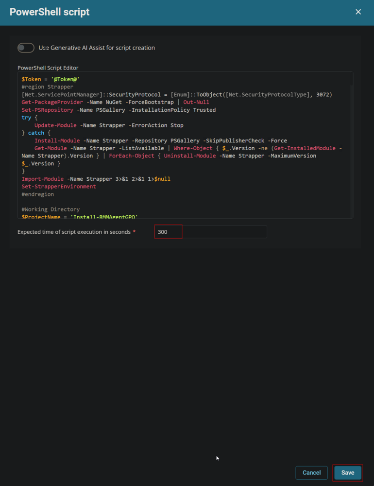  
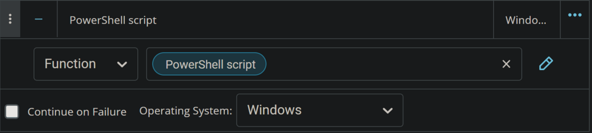

#### Row 2 Function: Script Log

Insert a new row by clicking the `Add Row` button.  


Select the `Script Log` function.  
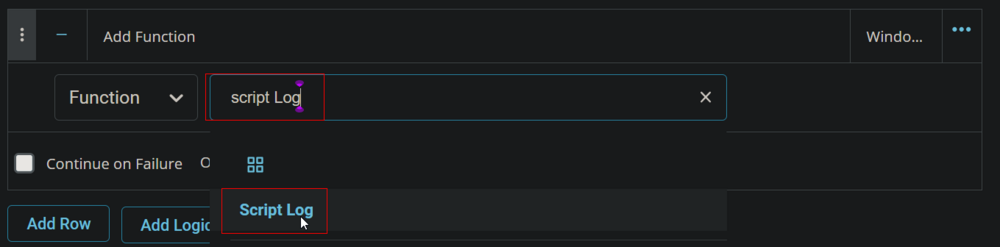  
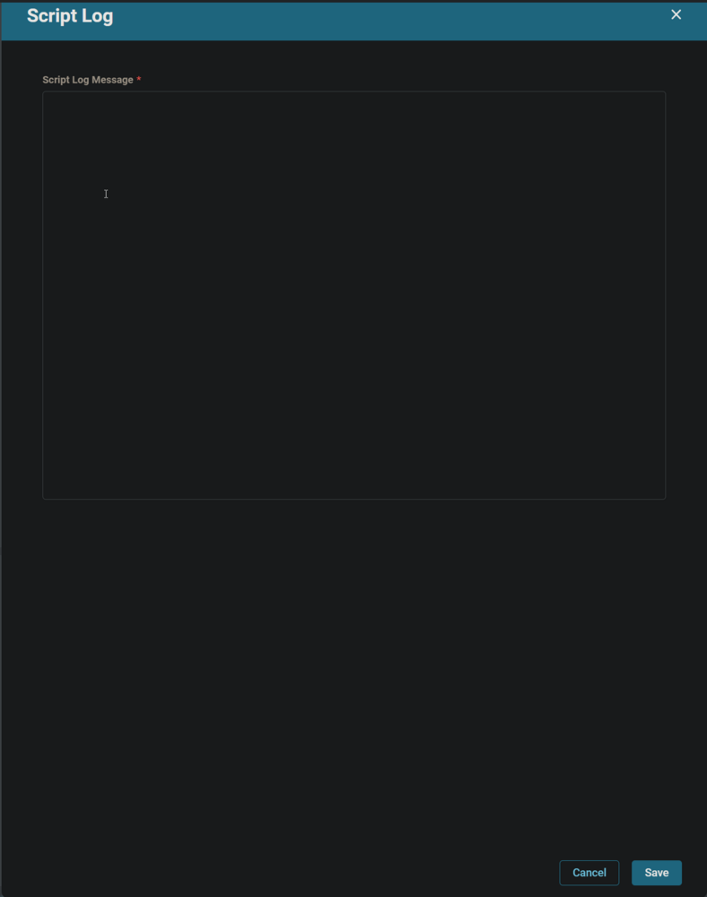

Paste this line in the `Script Log Message` box and click the `Save` button.  
`PowerShell Output: %Output%`  
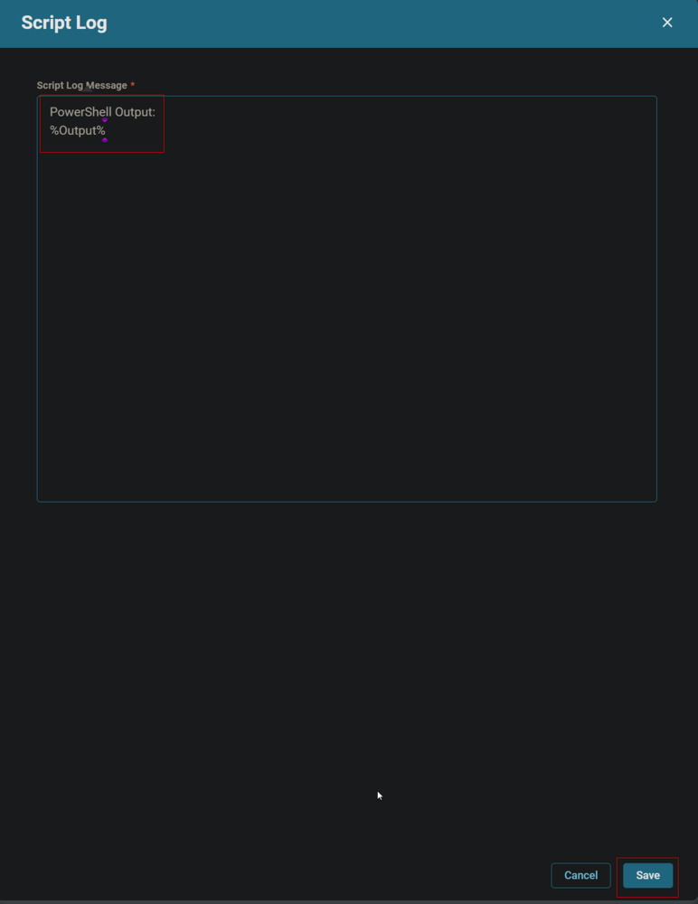  
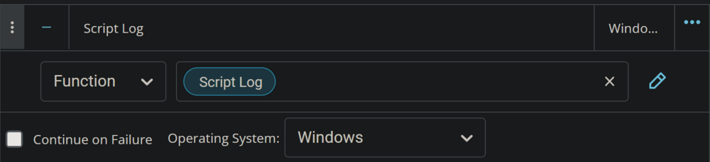

#### Row 3 Function: PowerShell Script

Insert a new row by clicking the `Add Row` button.  


Select the `PowerShell Script` function.  
  
  


Paste in the following PowerShell script, set the expected time of script execution to `300` seconds, and click the `Save` button.

```
Get-Content -Path "C:/ProgramData/_automation/script/Install-RMMAgentGPO/Install-RMMAgentGPO-Log.txt" -ErrorAction SilentlyContinue
```
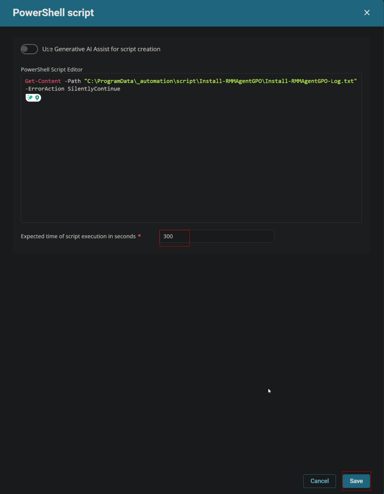  


#### Row 4 Function: Script Log

Insert a new row by clicking the `Add Row` button.  


Select the `Script Log` function.  
  


Paste this line in the `Script Log Message` box and click the `Save` button.  
`Script Logs: %Output%`  
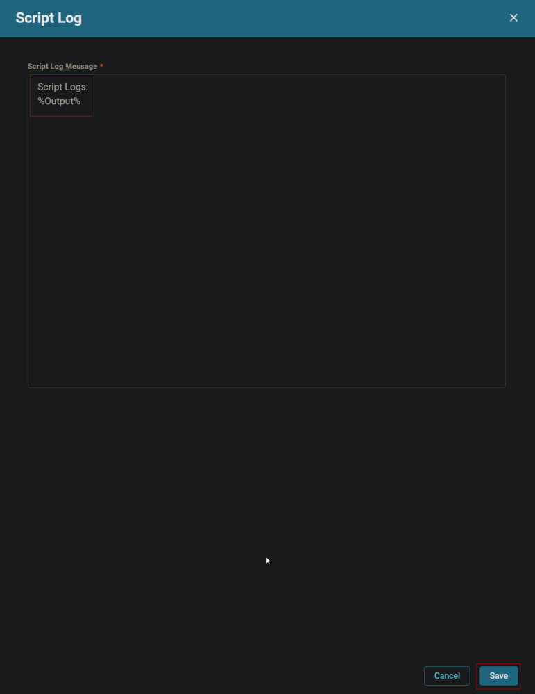  


Click the `Save` button to save the Task.  
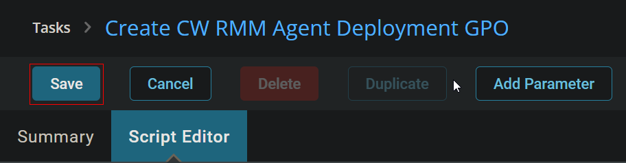

## Completed Script

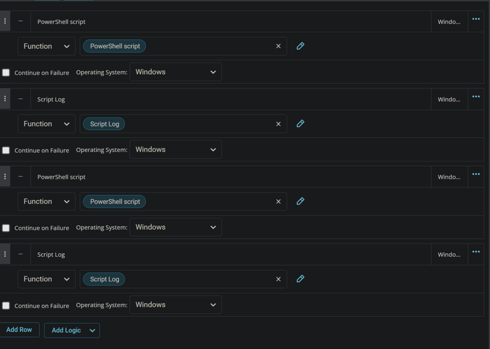

## Output

- Script Log  


