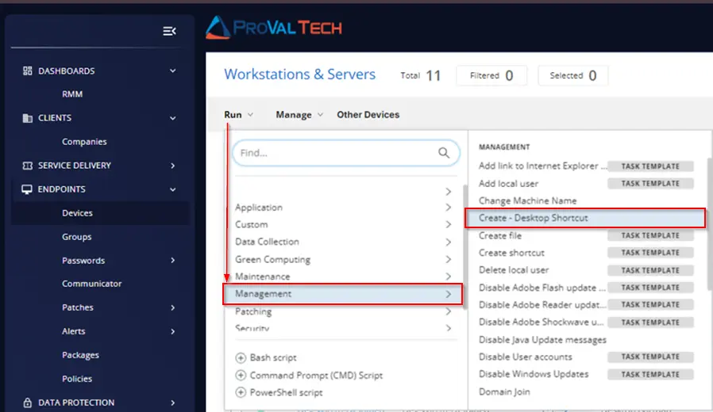

## Summary

This document describes how to create a shortcut in the Public Desktop folder.

## Sample Run



To add a desktop shortcut for [https://chatgpt.com/](https://chatgpt.com/):


Select `Run Now` and click on `Run Task`:


## Dependencies

[New-DesktopUriShortcut](/docs/56fa7d90-7c83-4c4a-ac0e-c49a6d5701af)

## User Parameters

| Name          | Example                                         | Required | Description                                                                                      |
|---------------|-------------------------------------------------|----------|--------------------------------------------------------------------------------------------------|
| TargetUri     | [https://www.google.com/](https://www.google.com/) | True     | The target path of the shortcut. This can be a local or web URI. Must begin with '\<DRIVE_LETTER>:/', 'Https://', or 'http://' |
| ShortcutName  | Google                                          | False    | The optional name of the shortcut being set. If not provided, the file name or DnsSafeHost property will be used as the shortcut name. |
| IconLocation   | --                                             | False    | Optionally set an *.ico file as the shortcut icon.                                            |


## Implementation

Create a new `Script Editor` style script in the system to implement this task.


**Name:** Create - Desktop Shortcut  \
**Description:** Creates a shortcut in the Public Desktop folder.  \
**Category:** Management  


## Parameters

Add a new parameter by clicking the `Add Parameter` button present at the top-right corner of the screen.


This screen will appear.


### TargetUri

- Set `TargetUri` in the `Parameter Name` field.
- Select `Text String` from the `Parameter Type` dropdown menu.
- Toggle ON the `Required Field` button.
- Click the `Save` button.


Click the `Confirm` button to save the parameter.


### ShortcutName

- Set `ShortcutName` in the `Parameter Name` field.
- Select `Text String` from the `Parameter Type` dropdown menu.
- Click the `Save` button.


Click the `Confirm` button to save the parameter.


### IconLocation

- Set `IconLocation` in the `Parameter Name` field.
- Select `Text String` from the `Parameter Type` dropdown menu.
- Click the `Save` button.


Click the `Confirm` button to save the parameter.


Once all the parameters are created, it should look like this:


Proceed with the following steps to create a task.

## Task

Navigate to the Script Editor section and start by adding a row. You can do this by clicking the `Add Row` button at the bottom of the script page.


A blank function will appear.


### Row 1 Function: PowerShell Script

Search and select the `PowerShell Script` function.


The following function will pop up on the screen:


Copy the below PowerShell commands and paste them in the `PowerShell Script Editor` box:

```PowerShell
# # Parameters and Globals
# # Parameters and Globals # # Be sure that the name of the hashtable property matches the name of the parameter of the script that you are calling.

$TargetUri = '@TargetUri@'
$ShortcutName = '@ShortcutName@'
$IconLocation = '@IconLocation@'
$Parameters = @{}

if (( $IconLocation -match '\.ico$') ) 
{$Parameters['IconLocation'] = $IconLocation}

if ($TargetUri -match ':') {
$Parameters['TargetUri'] = $TargetUri
} else {
throw 'Invalid Target'}

$Parameters['ShortcutName'] = $ShortcutName

#region Setup - Variables
$ProjectName = 'New-DesktopUriShortcut'
[Net.ServicePointManager]::SecurityProtocol = [enum]::ToObject([Net.SecurityProtocolType], 3072)
$BaseURL = 'https://file.provaltech.com/repo'
$PS1URL = "$BaseURL/script/$ProjectName.ps1"
$WorkingDirectory = "C:\ProgramData\_automation\script\$ProjectName"
$PS1Path = "$WorkingDirectory\$ProjectName.ps1"
$Workingpath = $WorkingDirectory
$LogPath = "$WorkingDirectory\$ProjectName-log.txt"
$ErrorLogPath = "$WorkingDirectory\$ProjectName-Error.txt"
#endregion

#region Setup - Folder Structure
New-Item -Path $WorkingDirectory -ItemType Directory -ErrorAction SilentlyContinue | Out-Null
$response = Invoke-WebRequest -Uri $PS1URL -UseBasicParsing
if (($response.StatusCode -ne 200) -and (!(Test-Path -Path $PS1Path))) {
    throw "No pre-downloaded script exists and the script '$PS1URL' failed to download. Exiting."
} elseif ($response.StatusCode -eq 200) {
    Remove-Item -Path $PS1Path -ErrorAction SilentlyContinue
    [System.IO.File]::WriteAllLines($PS1Path, $response.Content)
}
if (!(Test-Path -Path $PS1Path)) {
    throw 'An error occurred and the script was unable to be downloaded. Exiting.'
}
#endregion
#region Execution
if ($Parameters) {
    & $PS1Path @Parameters
} else {
    & $PS1Path
}
#endregion

if ( !(Test-Path $LogPath) ) {
    throw 'PowerShell Failure. A Security application seems to have restricted the execution of the PowerShell Script.'
}
if ( Test-Path $ErrorLogPath ) {
    $ErrorContent = ( Get-Content -Path $ErrorLogPath )
    throw $ErrorContent
}
Get-Content -Path $LogPath
```


### Row 2 Function: Script Log

Add a new row by clicking the `Add Row` button.


A blank function will appear.


Search and select the `Script Log` function.


The following function will pop up on the screen:


In the script log message, simply type `%output%` and click the `Save` button.


Click the `Save` button at the top-right corner of the screen to save the script.


## Completed Task

The Script Editor should look like this:


## Output

- Script log