## Summary

This task is designed to deploy the Cyrisma Censor Application.

## Sample Run

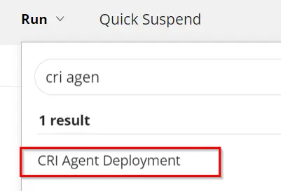

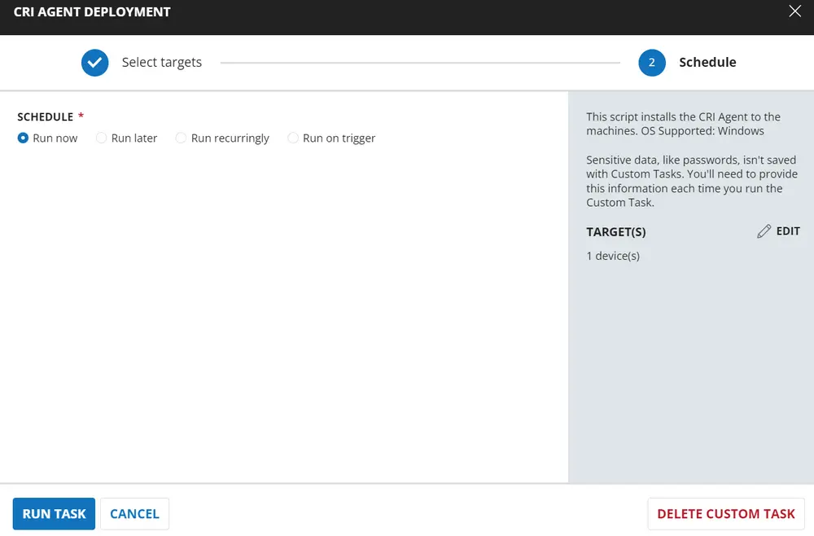

## Implementation

### Create Task

To implement this script, please create a new "PowerShell" style script in the system.


- **Name:** CRI Agent Deployment  
- **Description:** This script installs the CRI Agent on the machines.  
- **OS Supported:** Windows  
- **Category:** Custom  

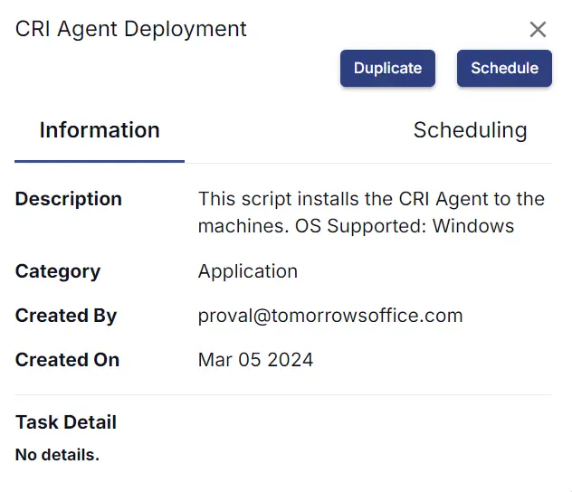

### Script

Start by creating three separate rows. You can do this by clicking the "Add Row" button at the bottom of the script page.


### Row 1: Function: Set Pre-defined Variable

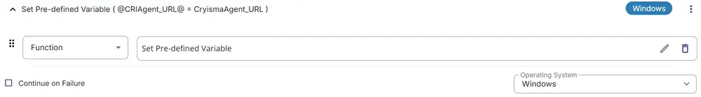

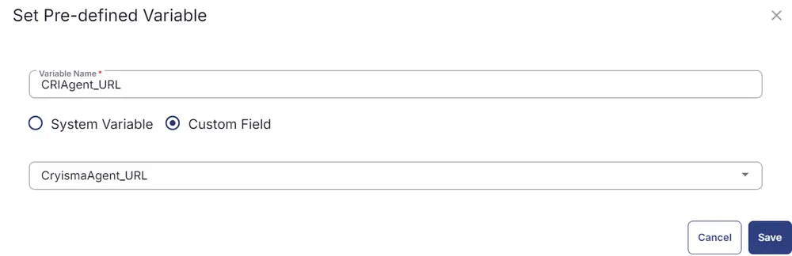

This sets the variable `CryismaAgent_URL` with the value of a custom field 'CryismaAgent_URL' [CW RMM - Cyrisma Custom Fields](/docs/2d448750-129b-4cff-aaf1-e73d2a296418).

### Row 2: Function: Set Pre-defined Variable

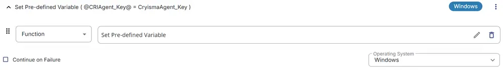

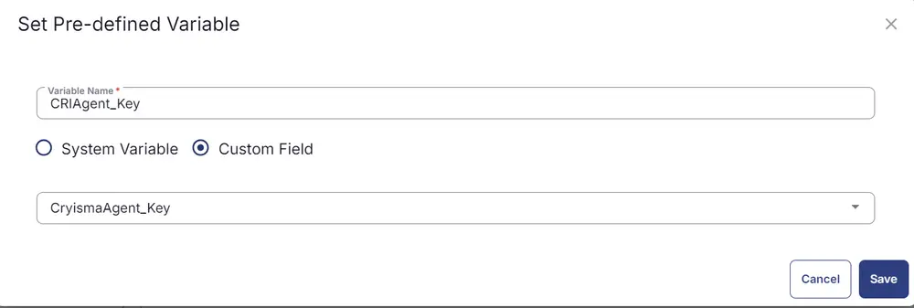

This sets the variable `CryismaAgent_Key` with the value of a custom field 'CryismaAgent_Key' [CW RMM - Cyrisma Custom Fields](/docs/2d448750-129b-4cff-aaf1-e73d2a296418).

### Row 3: Function: PowerShell Script

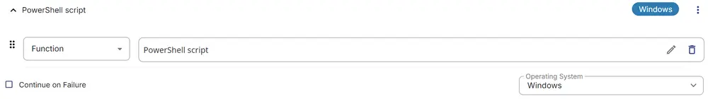

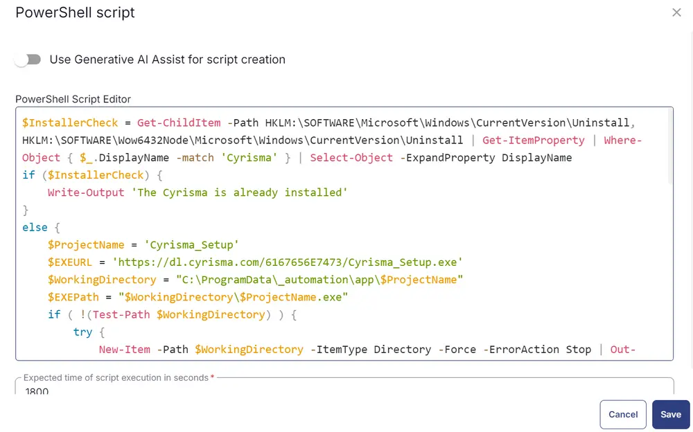

Paste the following PowerShell script and set the expected time of script execution to `1800` seconds.

```
$InstallerCheck = Get-ChildItem -Path HKLM:/SOFTWARE/Microsoft/Windows/CurrentVersion/Uninstall, HKLM:/SOFTWARE/Wow6432Node/Microsoft/Windows/CurrentVersion/Uninstall | Get-ItemProperty | Where-Object { $_.DisplayName -match 'Cyrisma' } | Select-Object -ExpandProperty DisplayName
if ($InstallerCheck) {
    Write-Output 'The Cyrisma is already installed'
} else {
    $ProjectName = 'Cyrisma_Setup'
    $EXEURL = 'https://dl.cyrisma.com/6167656E7473/Cyrisma_Setup.exe'
    $WorkingDirectory = "C:/ProgramData/_automation/app/$ProjectName"
    $EXEPath = "$WorkingDirectory/$ProjectName.exe"
    if (!(Test-Path $WorkingDirectory)) {
        try {
            New-Item -Path $WorkingDirectory -ItemType Directory -Force -ErrorAction Stop | Out-Null
        } catch {
            throw "Failed to Create $WorkingDirectory. Reason: $($Error[0].Exception.Message)"
        }
    }
    if (-not (((Get-Acl $WorkingDirectory).Access | Where-Object { $_.IdentityReference -Match 'Everyone' }).FileSystemRights -Match 'FullControl')) {
        $ACl = Get-Acl $WorkingDirectory
        $AccessRule = New-Object System.Security.AccessControl.FileSystemAccessRule('Everyone', 'FullControl', 'ContainerInherit, ObjectInherit', 'none', 'Allow')
        $Acl.AddAccessRule($AccessRule)
        Set-Acl $WorkingDirectory $Acl
    }
    Invoke-WebRequest -Uri $EXEURL -UseBasicParsing -OutFile $EXEPath
    if (!(Test-Path -Path $EXEPath)) {
        Write-Output "No pre-downloaded app exists and the script $EXEURL failed to download. Exiting."
        return 1
    }
    cmd.exe /c "$ExePath /verysilent /key=@CRIAgent_Key@ /url=@CRIAgent_URL@"
    Start-Sleep -Seconds 180
    $InstallerCheck = Get-ChildItem -Path HKLM:/SOFTWARE/Microsoft/Windows/CurrentVersion/Uninstall, HKLM:/SOFTWARE/Wow6432Node/Microsoft/Windows/CurrentVersion/Uninstall | Get-ItemProperty | Where-Object { $_.DisplayName -match 'Cyrisma' } | Select-Object -ExpandProperty DisplayName
    if ($InstallerCheck) {
        Write-Output 'The Cyrisma is installed successfully'
    } else {
        Write-Output 'The Cyrisma failed to deploy'
    }
}
```

### Row 4: Function: Script Log


In the script log message, simply type `%output%` so that the script will send the results of the PowerShell script above to the output on the Automation tab for the target device.


### Row 5: Logic: If/Then/Else


### Row 4a: Condition: Output Contains

In the IF part, enter `Installation failed` in the right box of the "Output Contains" section.


### Row 4b: Function: Set Custom Field

Add a new row by clicking on the Add Row button.

Select Function 'Set Custom Field'. When you select `Set Custom Field`, it will open up a new window.

In this window, search for the `Cryisma_Status` field.

- **Custom Field:** Cryisma_Status  
- **Value:** Success  

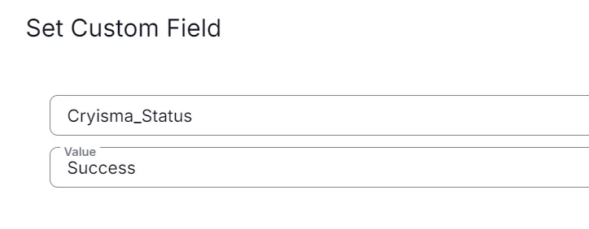

### Row 4c: Function: Set Custom Field

Add a new row by clicking on the Add Row button in the ELSE part and select the Script 'Set Custom Field' function again.

In this one, set the Custom Field and Value as shown below.

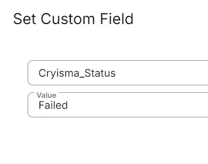

Once all items are added, please save the task. The final task should look like the screenshot below.

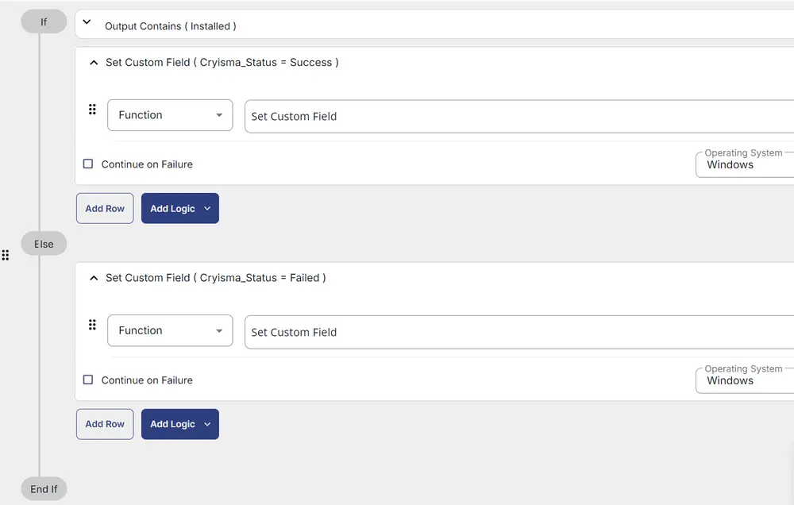

## Deployment

It is suggested to run the Task every 2 hours against the group "Cyrisma Sensor Deployment".

- Go to `Automation` > `Tasks.`
- Search for the `CRI Agent Deployment` Task.
- Select the concerned task.
- Click on the `Schedule` button to schedule the task/script.

This screen will appear.

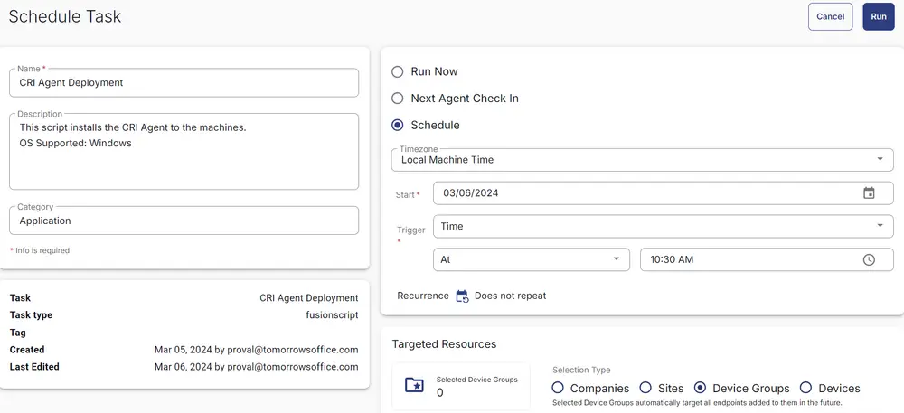

- Select the relevant time to run the script and click the Do not repeat button.


- A pop-up box will appear.
- Change the number of hours to `2` and click `OK`.

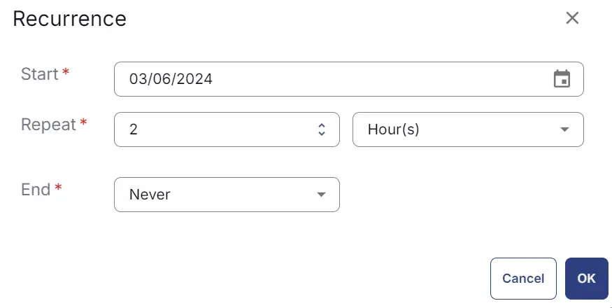

Search for `Cyrisma Sensor Deployment` in the `Resources*` and select it. You can search and select any relevant group you would like to schedule the task against. If the site doesn't have a device group that includes all Windows agents, then create one and schedule the task on it.


Now click the `Run` button to initiate the task.

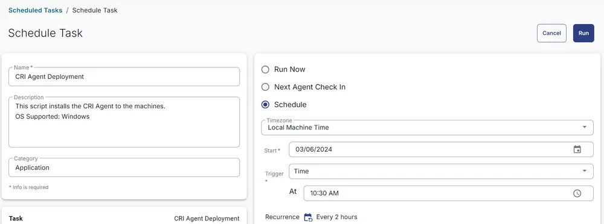

The task will start appearing in the Scheduled Tasks.

## Output

- Script log
- Custom field

