## Summary

This document executes a PowerShell script to validate the full version of the OS and compares it with Microsoft's database of Windows 10/11 Cumulative Updates to identify which cumulative update the device has. The data is then formatted and stored in the [CW RMM - Custom Field - Latest Cumulative Update](/docs/67416ac2-2311-43c4-8fbf-c5b0c9a48e71) for further auditing and monitoring purposes.

## Sample Run

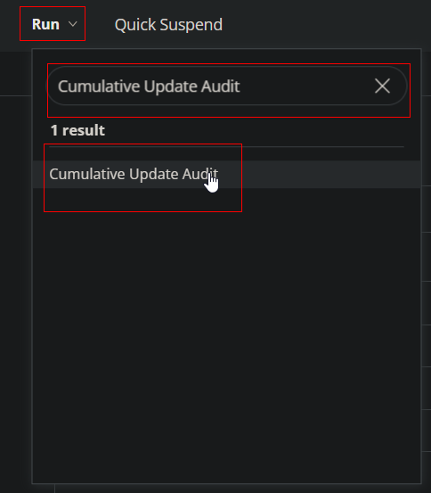
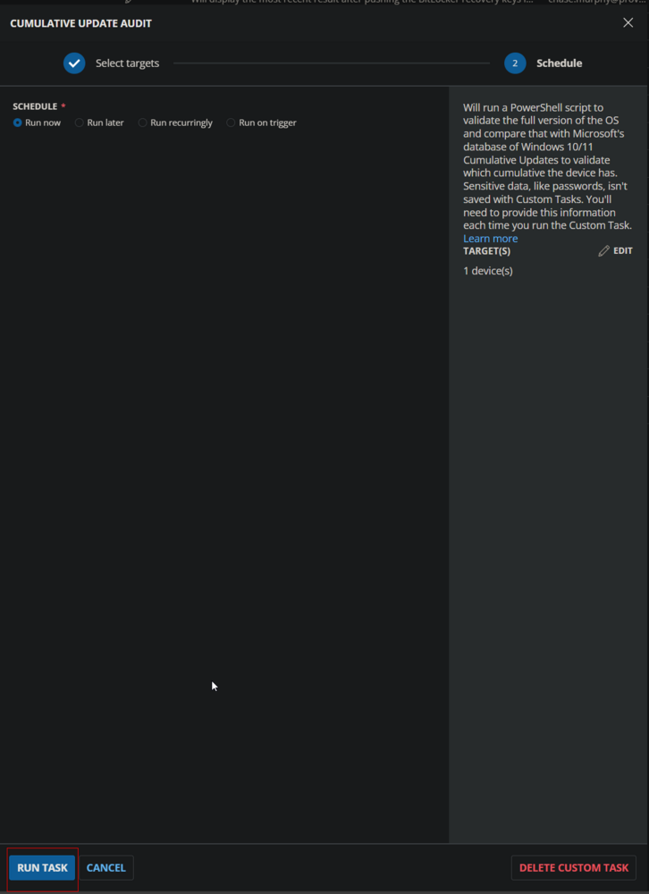

## Dependencies

- [CW RMM - Custom Field - Latest Cumulative Update](/docs/67416ac2-2311-43c4-8fbf-c5b0c9a48e71)

## Variables

| Name              | Description                                                                                             |
|-------------------|---------------------------------------------------------------------------------------------------------|
| Threshold_Days    | Age of the latest installed Cumulative Update in days to determine if it is obsolete. Default is 75.   |
| Output            | Output of the PowerShell script gathering the data from the endpoint.                                   |

## Implementation

Create the Custom Field [CW RMM - Custom Field - Latest Cumulative Update](/docs/67416ac2-2311-43c4-8fbf-c5b0c9a48e71).

### Create Script

Create a new `Script Editor` style script in the system to implement this Task.

**Name:** Cumulative Update Audit  
**Description:** This script will run a PowerShell script to validate the full version of the OS and compare it with Microsoft's database of Windows 10/11 Cumulative Updates to identify which cumulative update the device has.  
**Category:** Custom  

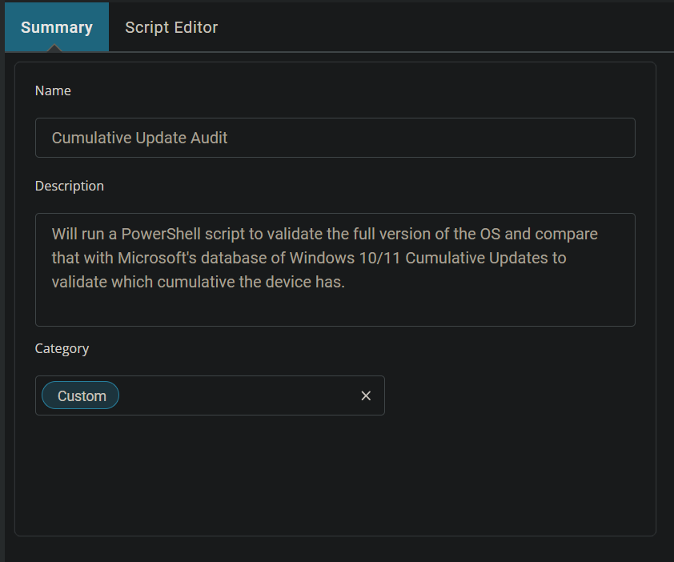

### Script

Start by adding a row. You can do this by clicking the "Add Row" button at the bottom of the script page.


#### Row 1 Function: Set User Variable

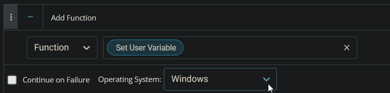

Type `Threshold_Days` for Variable Name and `75` for the value. This value represents the number of days to consider the latest installed Cumulative Update as obsolete. This threshold can be modified as needed.

The script will return `Failed` in the Custom Field if the most recently installed Cumulative Update on the computer is older than the days stored in this variable.

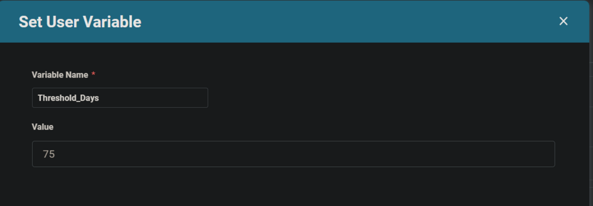

#### Row 2 Function: PowerShell Script

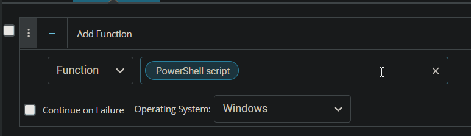 
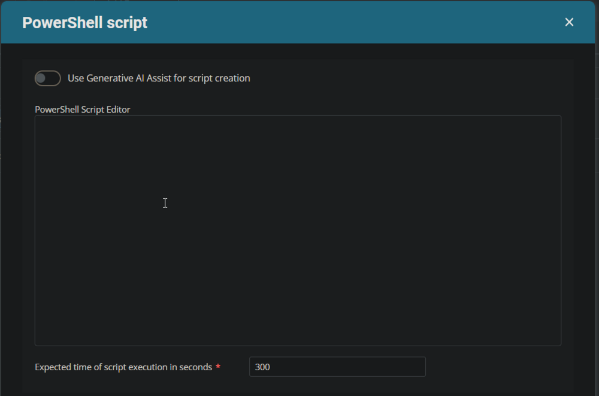

Paste in the following PowerShell script and set the expected time of script execution to `600` seconds.

```powershell
# Needs rewriting to use the latest version that targets the JSON file
```

Save and move to the next row.

#### Row 3 Function: Script Log


In the script log message, simply type `%output%` so that the script will send the results of the PowerShell script above to the output on the Automation tab for the target device.

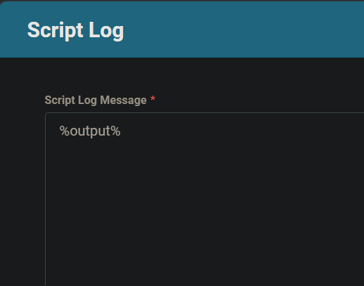

#### Row 4 Function: Set Custom Field

Add a new row by clicking on the "Add Row" button.


Select `Set Custom Field` Function.

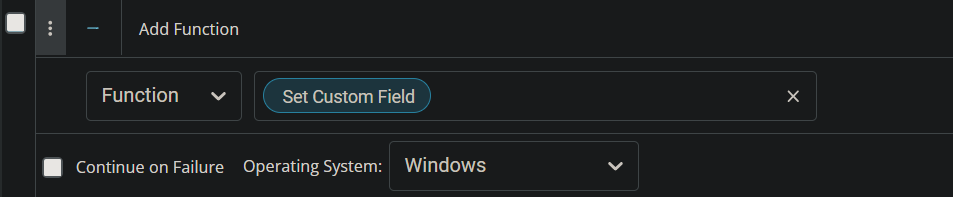

When you select `Set Custom Field`, a new window will open.


In this window, search for the `Latest Cumulative Update` field.

**Custom Field:** Latest Cumulative Update  
**Value:** %Output%

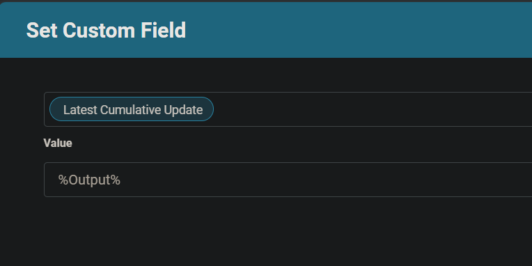

Once all items are added, please save the task. The final task should look like the screenshot below.

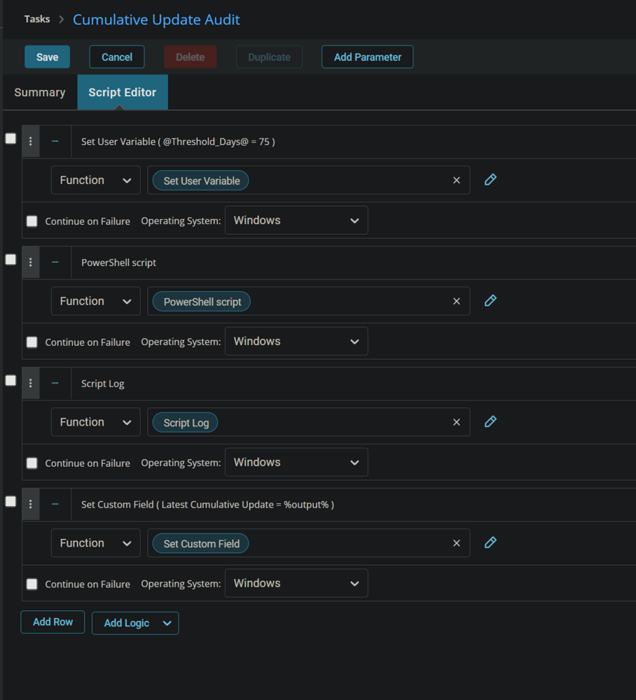

## Deployment

It is suggested to run the Task once per month against Windows computers.

1. Go to `Automation` > `Tasks`.
2. Search for the `Cumulative Update Audit` Task.
3. Select the concerned task.
4. Click on the `Schedule` button to schedule the task/script.

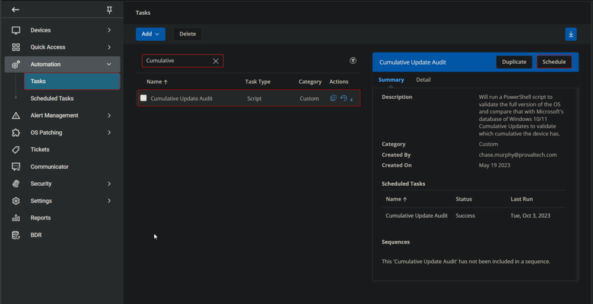

This screen will appear.

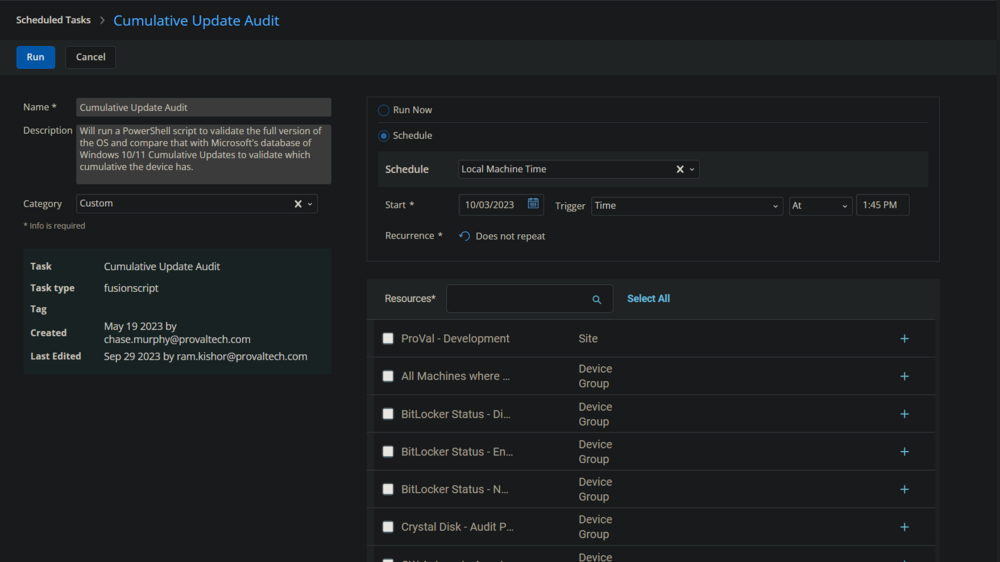

Select the relevant time to run the script and click the "Does not repeat" button.

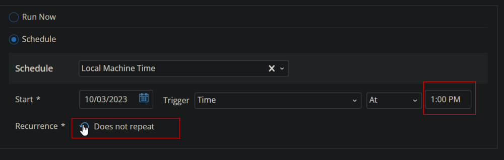

This pop-up box will appear.

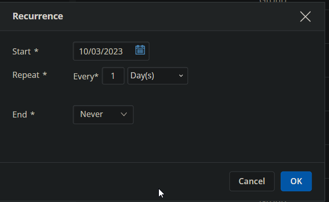

Change the Repeat interval to once per month. Here, I am selecting the 15th of every month since Microsoft releases the patches on the second Tuesday of every month.

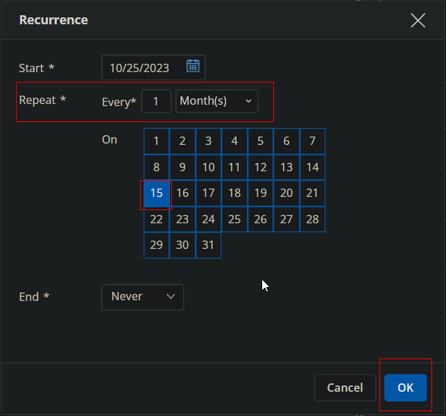 
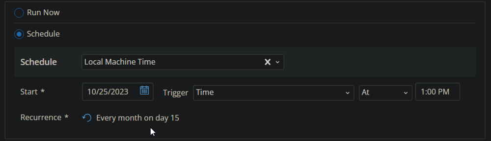

Search for `windows` in the `Resources*` and select `Windows Desktops` and `Windows Servers` groups. You can search and select any relevant group you would like to schedule the task against.

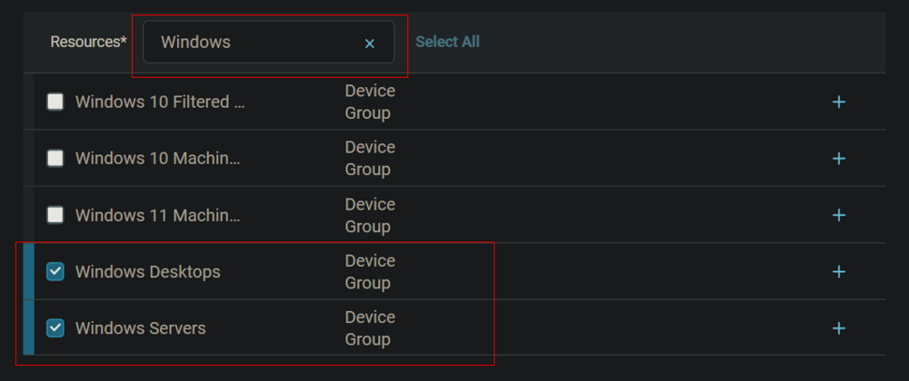

Now click the `Run` button to initiate the task.

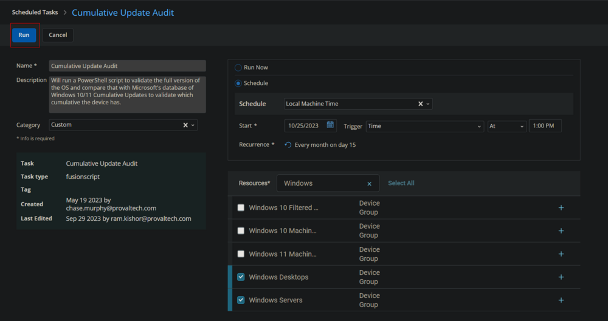

The task will start appearing in the Scheduled Tasks.

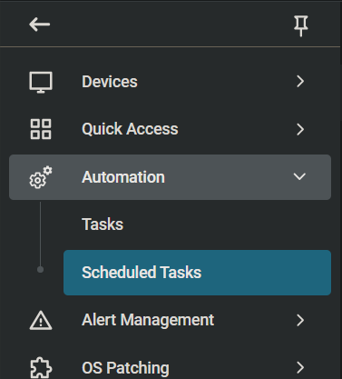 
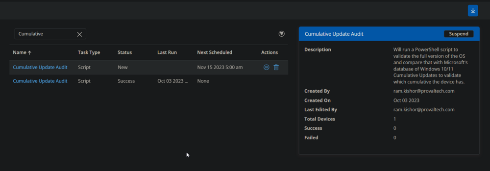

## Output

- **Script log**


- **Custom Field**


