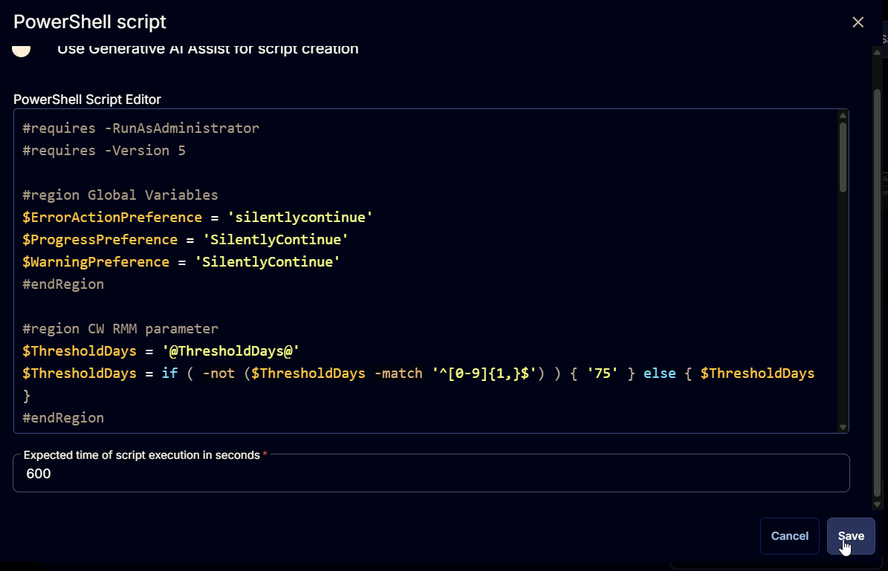

## Summary

This document executes a PowerShell script to validate the full version of the OS and compares it with Microsoft's database of Windows 10/11 Cumulative Updates to identify which cumulative update the device has. The data is then formatted and stored in the [Latest Cumulative Update](/docs/67416ac2-2311-43c4-8fbf-c5b0c9a48e71) for further auditing and monitoring purposes.

## Sample Run


## Dependencies

- [Latest Cumulative Update](/docs/67416ac2-2311-43c4-8fbf-c5b0c9a48e71)

## Variables

| Name              | Description                                                                                             |
|-------------------|---------------------------------------------------------------------------------------------------------|
| Threshold_Days    | Age of the latest installed Cumulative Update in days to determine if it is obsolete. Default is 75.   |
| Output            | Output of the PowerShell script gathering the data from the endpoint.                                   |

## Implementation

Create the Custom Field [Latest Cumulative Update](/docs/67416ac2-2311-43c4-8fbf-c5b0c9a48e71).

### Create Script

Create a new `Script Editor` style script in the system to implement this Task.

**Name:** Cumulative Update Audit  
**Description:** This script will run a PowerShell script to validate the full version of the OS and compare it with Microsoft's database of Windows 10/11 Cumulative Updates to identify which cumulative update the device has.  
**Category:** Custom  


### Script

Start by adding a row. You can do this by clicking the "Add Row" button at the bottom of the script page.


#### Row 1 Function: Set User Variable


Type `Threshold_Days` for Variable Name and `75` for the value. This value represents the number of days to consider the latest installed Cumulative Update as obsolete. This threshold can be modified as needed.

The script will return `Failed` in the Custom Field if the most recently installed Cumulative Update on the computer is older than the days stored in this variable.


#### Row 2 Function: PowerShell Script

 


Paste in the following PowerShell script, set the expected time of script execution to `600` seconds and click the `Save` button. 

```powershell
#requires -RunAsAdministrator
#requires -Version 5

#region Global Variables
$ErrorActionPreference = 'silentlycontinue'
$ProgressPreference = 'SilentlyContinue'
$WarningPreference = 'SilentlyContinue'
#endRegion

#region CW RMM parameter
$ThresholdDays = '@ThresholdDays@'
$ThresholdDays = if ( -not ($ThresholdDays -match '^[0-9]{1,}$') ) { '75' } else { $ThresholdDays }
#endRegion

#region Setup - Variables
$ProjectName = 'Get-LatestInstalledCU'
$BaseURL = 'https://file.provaltech.com/repo'
$PS1URL = "$BaseURL/script/$ProjectName.ps1"
$WorkingDirectory = "C:\ProgramData\_automation\script\$ProjectName"
$PS1Path = "$WorkingDirectory\$ProjectName.ps1"
#endregion

#region Setup - Folder Structure
if ( !(Test-Path $WorkingDirectory ) ) {
    New-Item -Path $WorkingDirectory -ItemType Directory -Force | Out-Null
}

[Net.ServicePointManager]::SecurityProtocol = [enum]::ToObject([Net.SecurityProtocolType], 3072)
$response = Invoke-WebRequest -Uri $PS1URL -UseBasicParsing
if (($response.StatusCode -ne 200) -and (!(Test-Path -Path $PS1Path))) {
    throw "No pre-downloaded script exists and the script '$PS1URL' failed to download. Exiting."
    return
} elseif ($response.StatusCode -eq 200) {
    Remove-Item -Path $PS1Path -ErrorAction SilentlyContinue
    [System.IO.File]::WriteAllLines($PS1Path, $response.Content)
}
if (!(Test-Path -Path $PS1Path)) {
    throw 'An error occurred and the script was unable to be downloaded. Exiting.'
    return
}
#endregion

#region Execution
$CUInfo = & $ps1path
#endregion

if ( $Cuinfo -match 'Failed to gather build number|Unsupported Operating System' ) {
    throw "Failure Reason: $($Cuinfo)"
} else {
    $Today = Get-Date
    $FormattedDate = $Today.ToString('yyyy-MM-dd')
    $CompareFormat = [DateTime]$FormattedDate
    $ReleaseDate = $CUInfo.ReleaseDate
    $comparereleasedate = [DateTime]$ReleaseDate
    $Difference = New-TimeSpan -Start $comparereleasedate -End $CompareFormat
    $status = if ($Difference.Days -ge $ThresholdDays) { 'Failed' } else { 'Success' }
    return "$($status). $($CUInfo.LastInstalledCU). Version: $($CUInfo.OSBuild). Date Audited: $FormattedDate"
}
```



#### Row 3 Function: Script Log


In the script log message, simply type `%output%` so that the script will send the results of the PowerShell script above to the output on the Automation tab for the target device.


#### Row 4 Function: Set Custom Field

Add a new row by clicking on the "Add Row" button.


Select `Set Custom Field` Function.


When you select `Set Custom Field`, a new window will open.


In this window, search for the `Latest Cumulative Update` field.

**Custom Field:** Latest Cumulative Update  
**Value:** %Output%


Once all items are added, please save the task. The final task should look like the screenshot below.


## Deployment

It is suggested to run the Task once per month against Windows computers.

1. Go to `Automation` > `Tasks`.
2. Search for the `Cumulative Update Audit` Task.
3. Select the concerned task.
4. Click on the `Schedule` button to schedule the task/script.


This screen will appear.


Select the relevant time to run the script and click the "Does not repeat" button.


This pop-up box will appear.


Change the Repeat interval to once per month. Here, I am selecting the 15th of every month since Microsoft releases the patches on the second Tuesday of every month.

  


Search for `windows` in the `Resources*` and select `Windows Desktops` and `Windows Servers` groups. You can search and select any relevant group you would like to schedule the task against.


Now click the `Run` button to initiate the task.


The task will start appearing in the Scheduled Tasks.

  


## Output

- **Script log**  


- **Custom Field**  


