---
id: 'c5bc1518-dce5-4f6e-93c0-d37aec8f7e7a'
slug: /c5bc1518-dce5-4f6e-93c0-d37aec8f7e7a
title: 'Dell Command Update - Install + Command Handler'
title_meta: 'Dell Command Update - Install + Command Handler'
keywords: ['dell', 'command', 'update', 'install', 'handler', 'winget']
description: 'This document provides a comprehensive guide on installing the latest version of Dell Command | Update for Windows Universal using Winget. It covers command usage, exit codes, task creation, user parameters, and sample runs to ensure successful implementation.'
tags: ['application', 'installation', 'software', 'update', 'windows']
draft: false
unlisted: false
last_update:
  date: 2025-11-28
---

## Summary

The task installs the latest version of `Dell Command | Update for Windows Universal` from `Winget` if it's missing or outdated. The `Argument` parameter can be used to run the specified command or argument. If the parameter is left blank, the `/scan` command will be executed.

**Supported commands/arguments reference:**  
[Supported commands/arguments reference](https://www.dell.com/support/manuals/en-us/command-update/dcu_rg/dell-command-%7C-update-cli-commands?guid=guid-92619086-5f7c-4a05-bce2-0d560c15e8ed&lang=en-us)

**Exit codes reference:**  
[Exit codes reference](https://www.dell.com/support/manuals/en-aw/command-update/dcu_rg/command-line-interface-error-codes?guid=guid-fbb96b06-4603-423a-baec-cbf5963d8948&lang=en-us)

## Sample Run

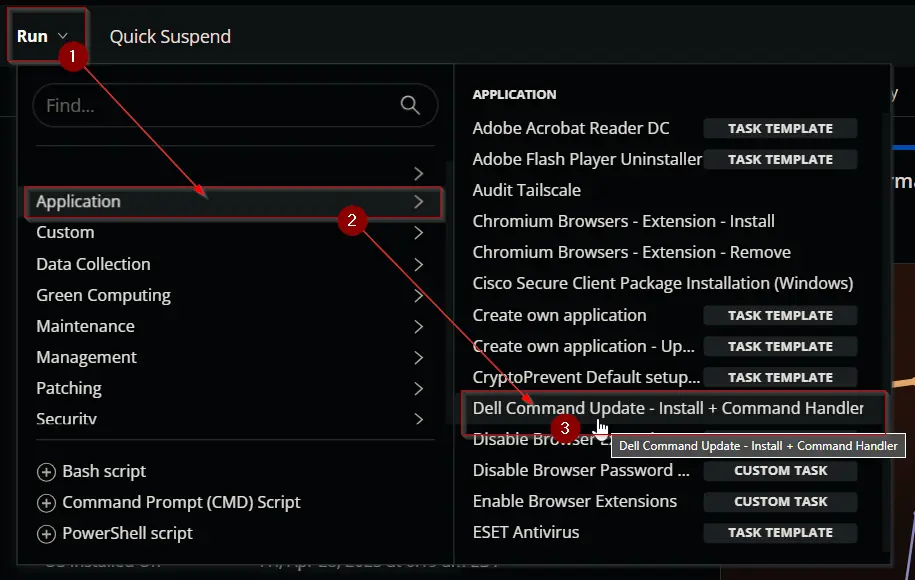  

### Example 1:
Running the script with basic `/scan` command to return the available updates.  
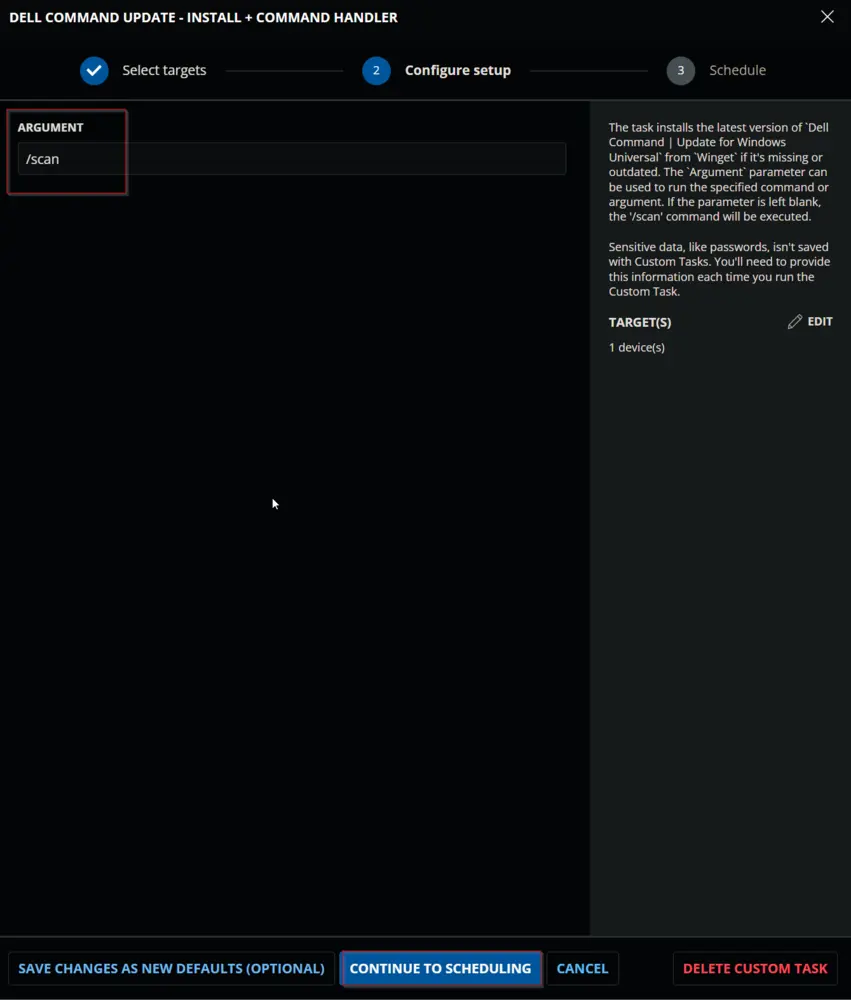  

### Example 2:
Running the script to install available `bios`, `firmaware`, and `driver` updates.  
This command will not install any active driver as we are not using the `-forceupdate` switch.  
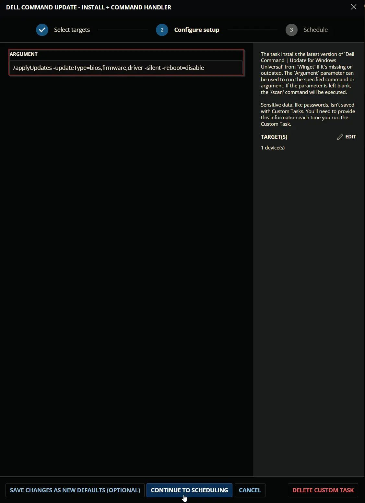  

### Example 3:
Running the script to forcefully install all available driver updates.  
**Caution:** It is recommended to restart the computer at the earliest convenience after using the `-forceupdate=enable` switch, as this switch updates active drivers as well. An active driver that requires a restart for the update may malfunction if the update is installed without rebooting the computer.  
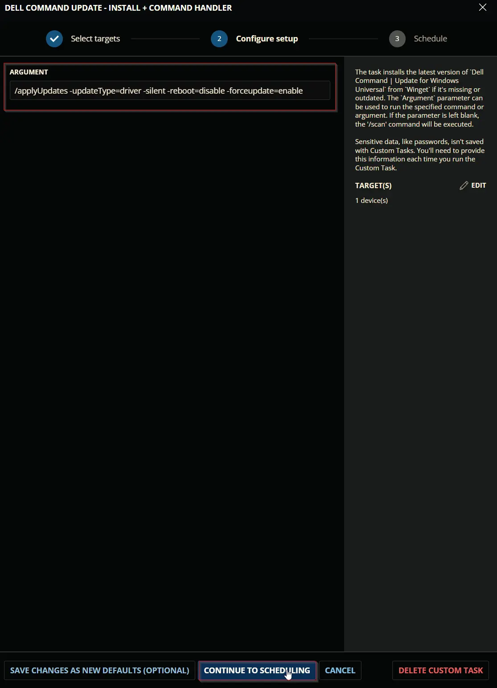  

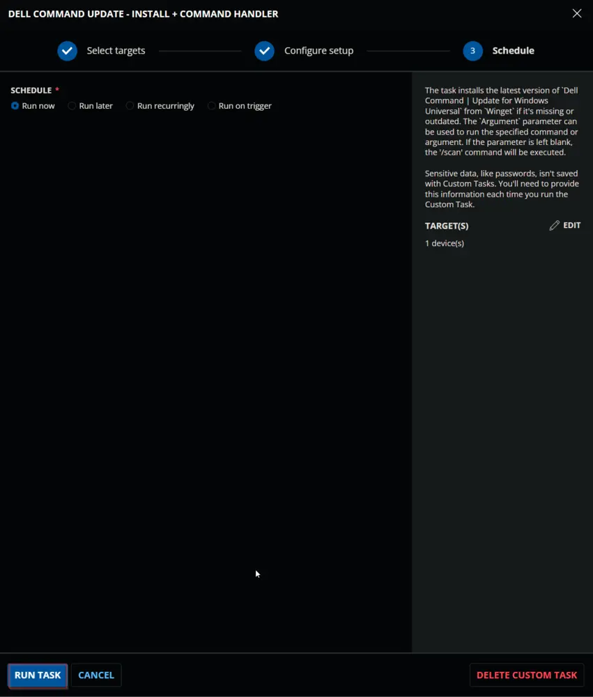

## Dependencies

[Invoke-WingetProcessor](/docs/8496c2e9-0e52-4961-a1f1-4a95296e8cf7)

## User Parameters

| Name      | Examples                                                                                                           | Accepted Values                                                                                                      | Default | Type  | Required | Description                                 |
|-----------|-------------------------------------------------------------------------------------------------------------------|----------------------------------------------------------------------------------------------------------------------|---------|-------|----------|---------------------------------------------|
| Argument  | <ul><li>`/version`</li><li>`/scan`</li><li>`/scan -updateType=bios,firmware,driver`</li><li>`/applyUpdates -updateType=bios,firmware -silent -reboot=disable`</li><li>`/applyUpdates -updateType=driver -silent -reboot=disable -forceupdate=enable`</li><li>`/driverInstall -silent -reboot=disable`</li></ul> | [Supported commands/arguments reference](https://www.dell.com/support/manuals/en-us/command-update/dcu_rg/dell-command-%7C-update-cli-commands?guid=guid-92619086-5f7c-4a05-bce2-0d560c15e8ed&lang=en-us) | `/scan`   | Text  | False    | Command to execute with `Dell Command \| Update`. If left blank, the default value `/Scan` will be used. |

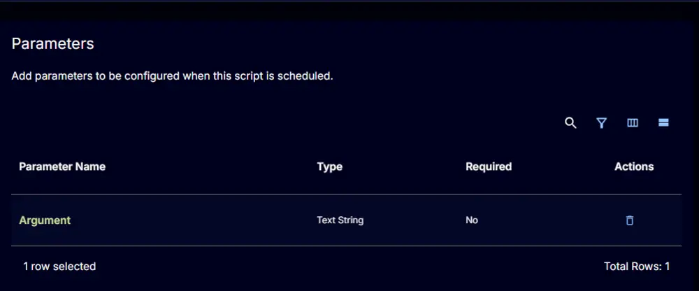

## Task Creation

Create a new `Script Editor` style script in the system to implement this task.

  

**Name:** `Dell Command Update - Install + Command Handler`  
**Description:** `The task installs the latest version of "Dell Command | Update for Windows Universal" from "Winget" if it's missing or outdated. The "Argument" parameter can be used to run the specified command or argument. If the parameter is left blank, the "/scan" command will be executed.`  
**Category:** `Application` 

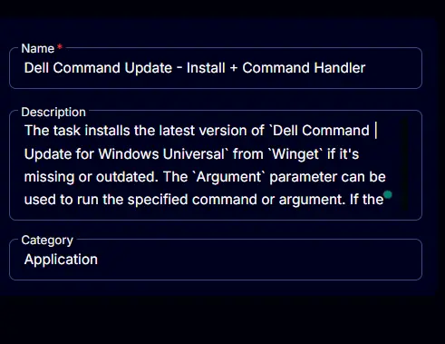

## Parameters

Add a new parameter by clicking the `Add Parameter` button present at the top-right corner of the screen.

This screen will appear.  
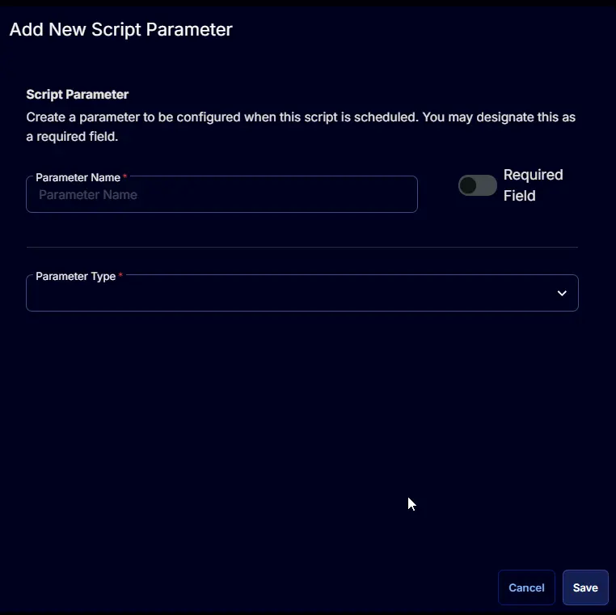

- Set `Argument` in the `Parameter Name` field.
- Select `Text String` from the `Parameter Type` dropdown menu.
- Enable the `Default Value` button.
- Set `/scan` in the `Default Value` field.
- Click the `Save` button.

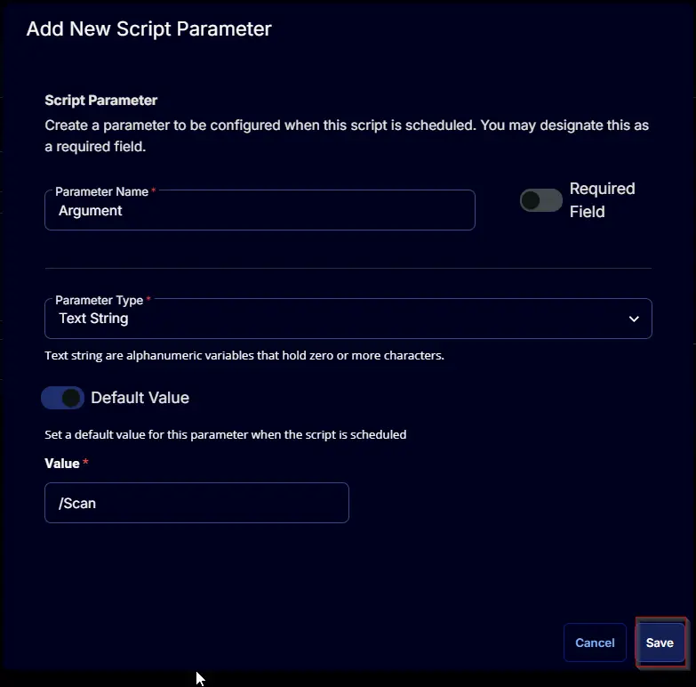

Click the `Confirm` button to save the parameter.  
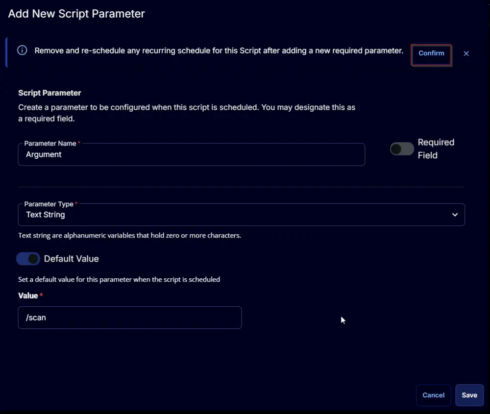

## Task

Navigate to the Script Editor Section and start by adding a row. You can do this by clicking the `Add Row` button at the bottom of the script page.

A blank function will appear.  

### Row 1 Function: PowerShell Script

Search and select the `PowerShell Script` function.  
  

The following function will pop up on the screen:  

Paste in the following PowerShell script and set the expected time of script execution to `3600` seconds. Click the `Save` button.

[PowerShell Script](https://github.com/ProVal-Tech/cw-rmm/blob/main/tasks/dell-command-update-install-command-handler/script.ps1)

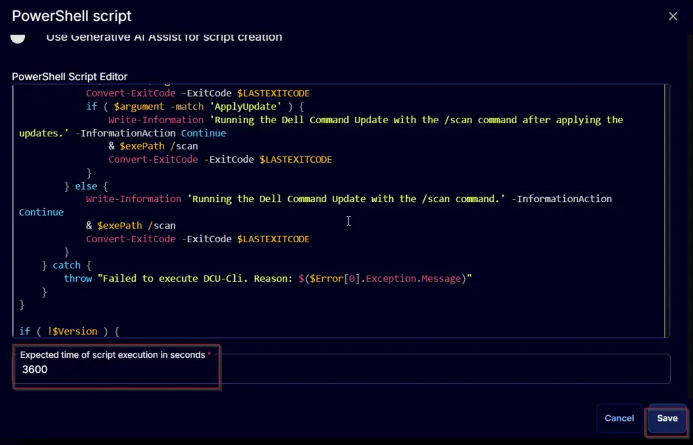

### Row 2 Function: Script Log

Add a new row by clicking the `Add Row` button.  

A blank function will appear.  

Search and select the `Script Log` function.  
  

The following function will pop up on the screen:  

In the script log message, simply type `%output%` and click the `Save` button.  

Click the `Save` button at the top-right corner of the screen to save the script.  

## Completed Task

## Output

- Script log

## Changelog

### 2025-04-10

- Initial version of the document

### 2025-03-12

- Updated the solution document to show more examples and fixed the powershell issue that caused during the migration from IT Glue to our content portal.

