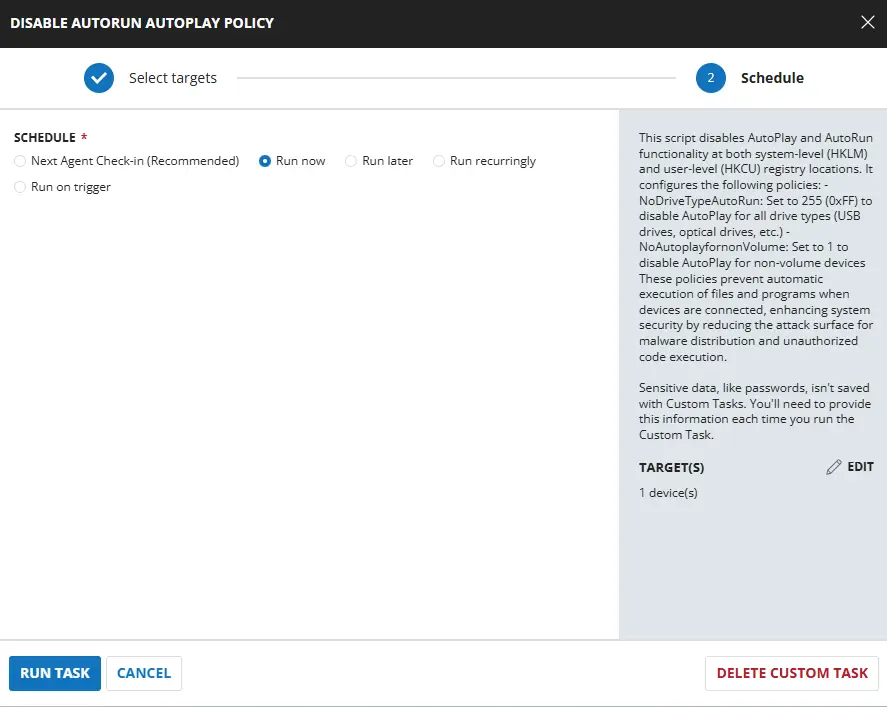
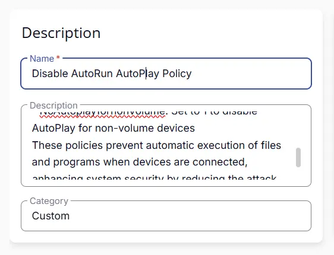
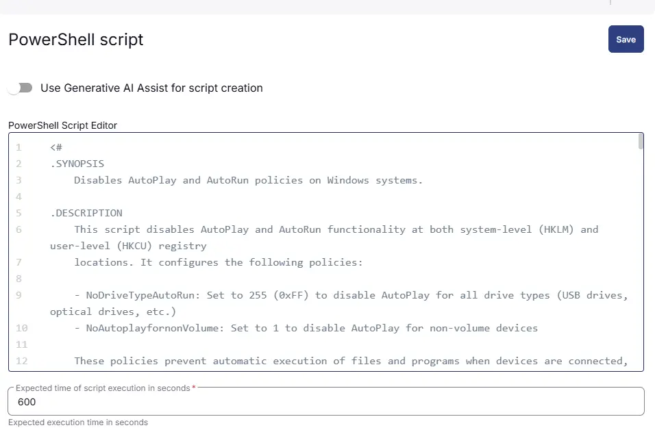
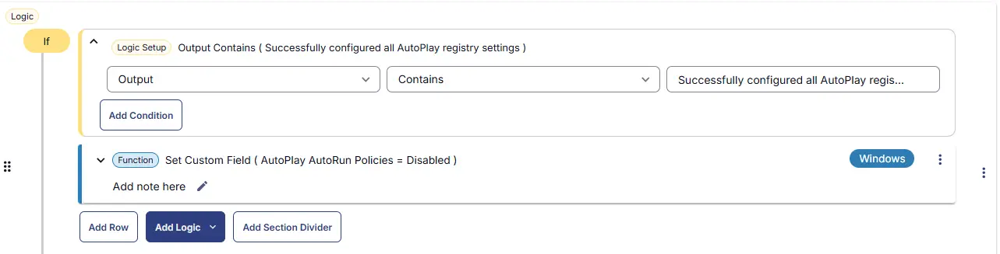
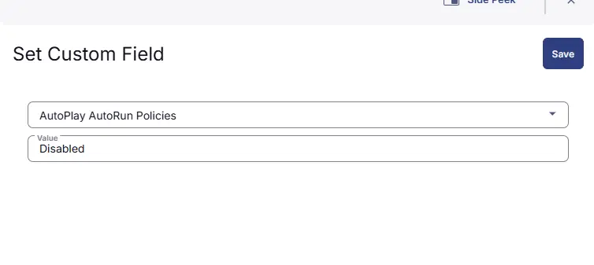
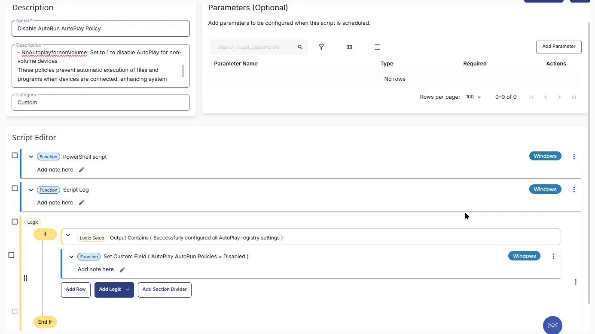
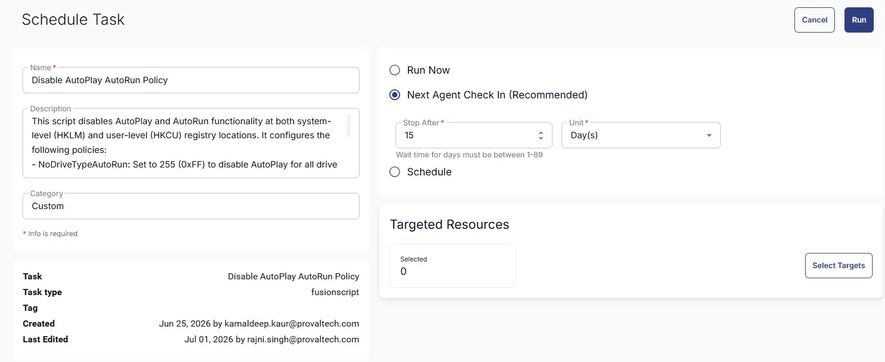

---
id: '6399c6ed-3a31-4d9e-97ce-9ca50780bb92'
slug: /6399c6ed-3a31-4d9e-97ce-9ca50780bb92
title: 'Disable AutoPlay AutoRun Policy'
title_meta: 'Disable AutoPlay AutoRun Policy'
keywords: ['security', 'automation','permissions']
description: 'This script disables AutoPlay and AutoRun functionality at both system-level (HKLM) and user-level (HKCU) registry locations.'
tags: ['permissions', 'security']
draft: false
unlisted: false
last_update:
  date: 2026-07-01
---

## Summary
This script disables AutoPlay and AutoRun functionality at both system-level (HKLM) and user-level (HKCU) registry locations. It configures the following policies:
    
- NoDriveTypeAutoRun: Set to 255 (0xFF) to disable AutoPlay for all drive types (USB drives, optical drives, etc.)
- NoAutoplayfornonVolume: Set to 1 to disable AutoPlay for non-volume devices
    
These policies prevent automatic execution of files and programs when devices are connected, enhancing system security by reducing the attack surface for malware distribution and unauthorized code execution.

## Sample Run

## Dependencies

- [Solution - Disable AutoPlay AutoRun policies](/docs/4bfb0532-45a1-41b8-8e69-d552bae1d12d) 

## Task Creation

### Script Details

#### Step 1

Navigate to `Automation` ➞ `Tasks`  

#### Step 2

Create a new `Script Editor` style task by choosing the `Script Editor` option from the `Add` dropdown menu  

The `New Script` page will appear on clicking the `Script Editor` button:  

#### Step 3

Fill in the following details in the `Description` section:  

- **Name:** `Disable AutoPlay AutoRun Policy`  
- **Description:** `This script disables AutoPlay and AutoRun functionality at both system-level (HKLM) and user-level (HKCU) registry locations. It configures the following policies:`
    - `NoDriveTypeAutoRun: Set to 255 (0xFF) to disable AutoPlay for all drive types (USB drives, optical drives, etc.)`
    - `NoAutoplayfornonVolume: Set to 1 to disable AutoPlay for non-volume devices`
    - `These policies prevent automatic execution of files and programs when devices are connected, enhancing system security by reducing the attack surface for malware distribution and unauthorized code execution.`
- **Category:** `custom`

### Script Editor

Click the `Add Row` button in the `Script Editor` section to start creating the script  

A blank function will appear:  

#### Row 1 Function: `PowerShell Script`

Search and select the `PowerShell Script` function.  
 
  

The following function will pop up on the screen:  
  

Paste in the following PowerShell script and set the `Expected time of script execution in seconds` to `600` seconds. Click the `Save` button.

[PowerShell Script](https://github.com/ProVal-Tech/cw-rmm/blob/main/tasks/disable-autoplay-autorun-policy/script.ps1)

### Row 2 Function: Script Log

Add a new row by clicking the `Add Row` button.  
  

A blank function will appear.  
  

Search and select the `Script Log` function.  
  
 

In the script log message, simply type `%output%` and click the `Save` button.  

#### Row 3 Logic: If/Then

Click Add Logic and select `If/Then`

#### Row 3a Condition: Output Contains

In the IF part, enter `Successfully configured all AutoPlay registry settings` in the right box of the "Output Contains" part.

#### Row 3b Function: Set Custom Field

Add a new row by clicking on the `Add Row` button. Set Custom Field `AutoPlay AutoRun Policies` to `Disabled`.

## Save Task

Click the `Save` button at the top-right corner of the screen to save the script.  

## Completed Task

## Deployment

This task has to be scheduled on the `Disable AutoPlay AutoRun Policy` group for auto deployment. The script can also be run manually if required.

- Go to `Automation` > `Tasks`.  
- Search for `Disable AutoPlay AutoRun Policy`.  
- Then click on Schedule and provide the parameters detail as necessary for scheduling.

## Output

- Custom Field
- Script output

## Changelog

### 2026-07-01

- Initial version of the document

