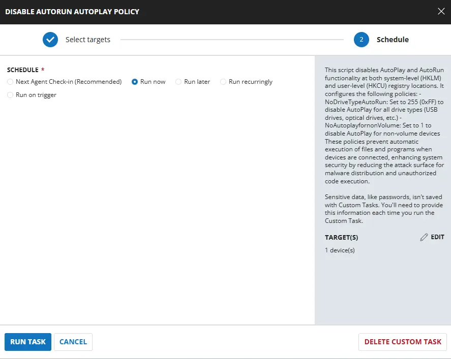
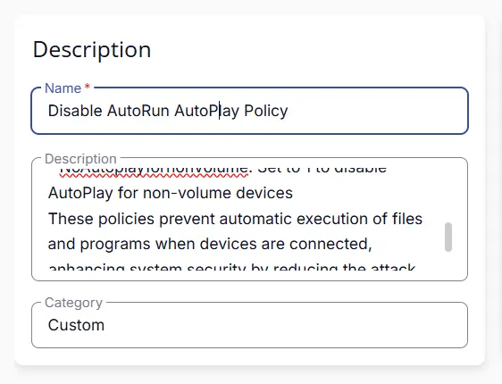
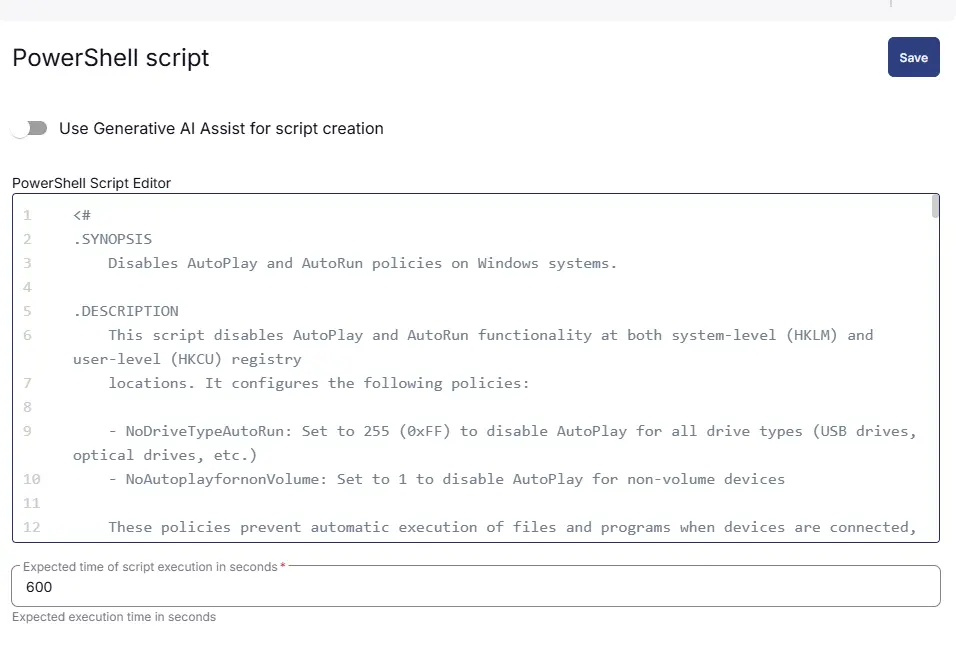
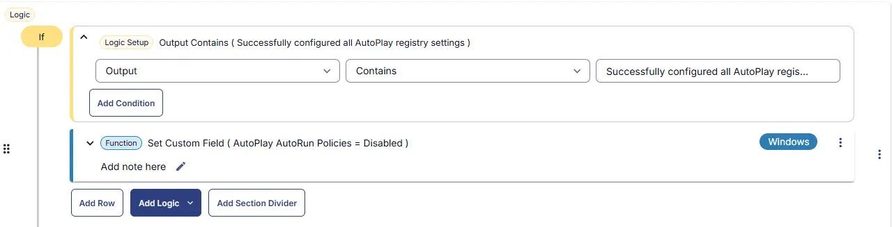
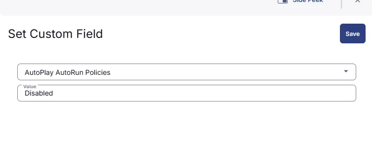
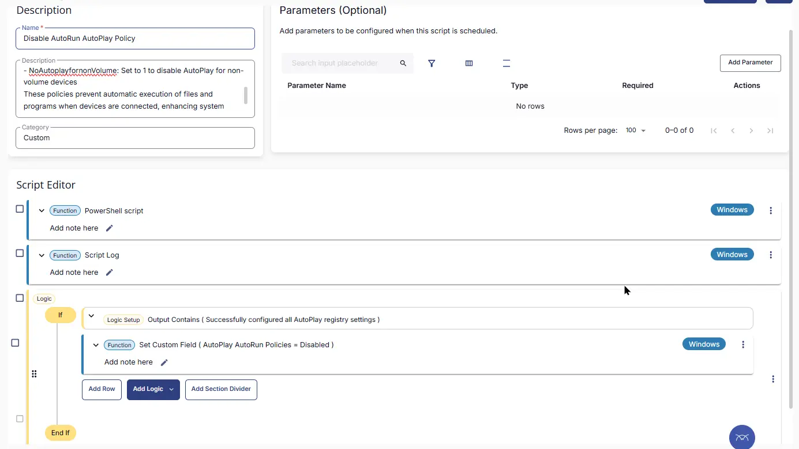
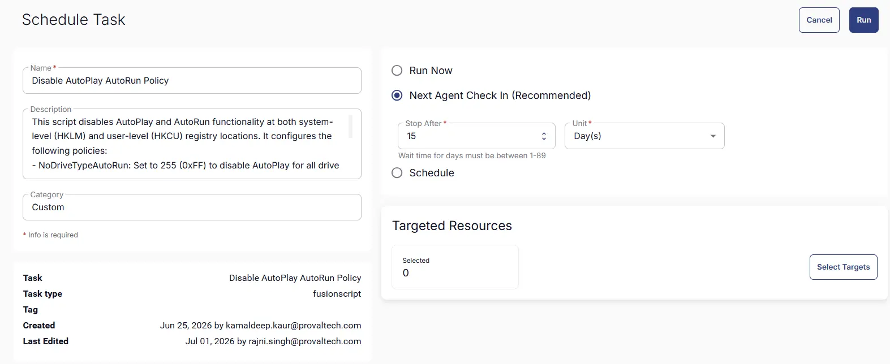

## Summary
This script disables AutoPlay and AutoRun functionality at both system-level (HKLM) and user-level (HKCU) registry locations. It configures the following policies:
    
- NoDriveTypeAutoRun: Set to 255 (0xFF) to disable AutoPlay for all drive types (USB drives, optical drives, etc.)
- NoAutoplayfornonVolume: Set to 1 to disable AutoPlay for non-volume devices
    
These policies prevent automatic execution of files and programs when devices are connected, enhancing system security by reducing the attack surface for malware distribution and unauthorized code execution.

## Sample Run



## Dependencies

- [Solution - Disable Autorun/Autoplay policies](/docs/4bfb0532-45a1-41b8-8e69-d552bae1d12d) 

## Task Creation

### Script Details

#### Step 1

Navigate to `Automation` ➞ `Tasks`  


#### Step 2

Create a new `Script Editor` style task by choosing the `Script Editor` option from the `Add` dropdown menu  


The `New Script` page will appear on clicking the `Script Editor` button:  


#### Step 3

Fill in the following details in the `Description` section:  

**Name:** `Disable Autorun/Autoplay Policy`  
**Description:** `This script disables AutoPlay and AutoRun functionality at both system-level (HKLM) and user-level (HKCU) registry locations. It configures the following policies:`
    
`- NoDriveTypeAutoRun: Set to 255 (0xFF) to disable AutoPlay for all drive types (USB drives, optical drives, etc.)`
`- NoAutoplayfornonVolume: Set to 1 to disable AutoPlay for non-volume devices`
    
`These policies prevent automatic execution of files and programs when devices are connected, enhancing system security by reducing the attack surface for malware distribution and unauthorized code execution.`
**Category:** `custom`



### Script Editor

Click the `Add Row` button in the `Script Editor` section to start creating the script  


A blank function will appear:  


#### Row 1 Function: `PowerShell Script`

Search and select the `PowerShell Script` function.  
 
  

The following function will pop up on the screen:  
  

Paste in the following PowerShell script and set the `Expected time of script execution in seconds` to `600` seconds. Click the `Save` button.

```powershell
<#
.SYNOPSIS
    Disables AutoPlay and AutoRun policies on Windows systems.

.DESCRIPTION
    This script disables AutoPlay and AutoRun functionality at both system-level (HKLM) and user-level (HKCU) registry 
    locations. It configures the following policies:
    
    - NoDriveTypeAutoRun: Set to 255 (0xFF) to disable AutoPlay for all drive types (USB drives, optical drives, etc.)
    - NoAutoplayfornonVolume: Set to 1 to disable AutoPlay for non-volume devices
    
    These policies prevent automatic execution of files and programs when devices are connected, enhancing system 
    security by reducing the attack surface for malware distribution and unauthorized code execution.
    
    The script initializes required PowerShell modules (PackageManagement, PowerShellGet, and Strapper) before 
    applying the registry changes. It handles errors gracefully and tracks any failures during policy configuration.

.NOTES
    - Requires administrative privileges to modify HKLM registry keys
    - Changes are applied at both system and user levels for comprehensive policy enforcement
    - The Strapper module is used for registry key property management
    - Execution policy is set to Bypass at process scope during execution

.EXAMPLE
    .\disable-autorun-autoplay-policy.ps1
    
    Executes the script to disable AutoPlay policies system-wide.
#>

function Initialize-ScriptModules {
    [CmdletBinding()]
    param ()

    Write-Output 'Initializing PowerShell module environment'

    #Region Execution Policy (Process-scoped only)
    try {
        if ((Get-ExecutionPolicy -Scope Process) -ne 'Bypass') {
            Set-ExecutionPolicy -Scope Process -ExecutionPolicy Bypass -Force
            Write-Output 'ExecutionPolicy set to Bypass (Process scope).'
        }
    } catch {
        throw "An error occurred: Unable to set ExecutionPolicy: $($_.Exception.Message)"
    }
    #EndRegion

    #Region PackageManagement (required dependency)
    try {
        Import-Module PackageManagement -Force -ErrorAction Stop
        Write-Output 'Imported module: PackageManagement'
    } catch {
        throw "An error occurred: PackageManagement could not be imported: $($_.Exception.Message)"
    }
    #EndRegion

    #Region PowerShellGet (OPTIONAL, may be corrupted)
    try {
        Import-Module PowerShellGet -Force -ErrorAction Stop
        Write-Output 'Imported module: PowerShellGet'
    } catch {
        Write-Output 'WARNING: PowerShellGet is corrupted or unavailable. Continuing without it.'
    }
    #EndRegion

    #Region Strapper
    try {
        Import-Module Strapper -Force -ErrorAction Stop
        Write-Output 'Strapper module imported successfully'

        if (-not (Get-Command Set-UserRegistryKeyProperty -ErrorAction SilentlyContinue)) {
            throw 'Strapper loaded, but required commands are missing.'
        }

        Set-StrapperEnvironment
        Write-Output 'Strapper environment initialized.'
    } catch {
        throw "An error occurred: Failed to initialize Strapper: $($_.Exception.Message)"
    }
    #EndRegion

    Write-Output 'Module initialization completed successfully'
}

# Initialize modules
Initialize-ScriptModules

# Track failures
$failures = @()

Write-Output 'Configuring AutoPlay policy registry settings (Computer + User)'

# Expected values
$Expected_NoDriveTypeAutoRun      = 255
$Expected_NoAutoplayForNonVolume  = 1

#Region Computer-level (HKLM)
$HKLMPath = 'HKLM:\Software\Microsoft\Windows\CurrentVersion\Policies\Explorer'

Write-Output 'Configuring AutoPlay policies (system-level / HKLM)...'
Write-Output ' - Turn off AutoPlay: NoDriveTypeAutoRun = 0xFF (255)'
Write-Output ' - Disallow AutoPlay for non-volume devices: NoAutoplayfornonVolume = 1'

try {
    if (-not (Test-Path $HKLMPath)) {
        New-Item -Path $HKLMPath -Force | Out-Null
        Write-Output "Created registry key (system-level): $HKLMPath"
    } else {
        Write-Output "Registry key already present (system-level): $HKLMPath"
    }

    New-ItemProperty -Path $HKLMPath -Name 'NoDriveTypeAutoRun' -Value $Expected_NoDriveTypeAutoRun -PropertyType DWord -Force -ErrorAction Stop | Out-Null
    Write-Output "Set (HKLM): $HKLMPath\NoDriveTypeAutoRun = 255"

    New-ItemProperty -Path $HKLMPath -Name 'NoAutoplayfornonVolume' -Value $Expected_NoAutoplayForNonVolume -PropertyType DWord -Force -ErrorAction Stop | Out-Null
    Write-Output "Set (HKLM): $HKLMPath\NoAutoplayfornonVolume = 1"

    Write-Output 'Successfully configured AutoPlay system-level policies.'
} catch {
    $failures += [PSCustomObject]@{
        Scope          = 'System (HKLM)'
        RegistryPath   = $HKLMPath
        FailureMessage = $_.Exception.Message
    }

    Write-Output "An error occurred: Failed to apply system-level AutoPlay policies. Details: $($_.Exception.Message)"
}
#EndRegion

#Region User-level (HKCU)
$HKCUPathRel = 'Software\Microsoft\Windows\CurrentVersion\Policies\Explorer'

Write-Output 'Configuring AutoPlay policies (user-level / HKCU)...'
Write-Output ' - Turn off AutoPlay: NoDriveTypeAutoRun = 0xFF (255)'
Write-Output ' - Disallow AutoPlay for non-volume devices: NoAutoplayfornonVolume = 1'

try {
    Set-UserRegistryKeyProperty `
        -Path $HKCUPathRel `
        -Name 'NoDriveTypeAutoRun' `
        -Value $Expected_NoDriveTypeAutoRun `
        -Force `
        -ErrorAction Stop

    Write-Output "Set (HKCU): HKCU:\$HKCUPathRel\NoDriveTypeAutoRun = 255"

    Set-UserRegistryKeyProperty `
        -Path $HKCUPathRel `
        -Name 'NoAutoplayfornonVolume' `
        -Value $Expected_NoAutoplayForNonVolume `
        -Force `
        -ErrorAction Stop

    Write-Output "Set (HKCU): HKCU:\$HKCUPathRel\NoAutoplayfornonVolume = 1"

    Write-Output 'Successfully configured AutoPlay user-level policies.'
} catch {
    $failures += [PSCustomObject]@{
        Scope          = 'User (HKCU)'
        RegistryPath   = "HKCU:\$HKCUPathRel"
        FailureMessage = $_.Exception.Message
    }

    Write-Output "An error occurred: Failed to apply user-level AutoPlay policies. Details: $($_.Exception.Message)"
}
#EndRegion

#Region gpupdate /force
Write-Output 'Running gpupdate /force'

try {
    cmd.exe /c 'gpupdate /force' | ForEach-Object {
        Write-Output $_
    }

    Write-Output 'gpupdate completed.'
} catch {
    $failures += [PSCustomObject]@{
        Scope          = 'gpupdate'
        RegistryPath   = ''
        FailureMessage = $_.Exception.Message
    }

    Write-Output "An error occurred: Failed to run gpupdate /force. Details: $($_.Exception.Message)"
}
#EndRegion

#Region Final Validation / Script Result
if ($failures.Count -gt 0) {

    $FailureSummary = ($failures | ForEach-Object {
            "$($_.Scope) - $($_.FailureMessage)"
        }) -join '; '

    throw "Failed to configure AutoPlay policies. $FailureSummary"
}

Write-Output 'Successfully configured all AutoPlay registry settings.'
#EndRegion
```



### Row 2 Function: Script Log

Add a new row by clicking the `Add Row` button.  
  

A blank function will appear.  
  

Search and select the `Script Log` function.  
  
 

In the script log message, simply type `%output%` and click the `Save` button.  


#### Row 3 Logic: If/Then

Click Add Logic and select `If/Then`


#### Row 3a Condition: Output Contains

In the IF part, enter `Successfully configured all AutoPlay registry settings` in the right box of the "Output Contains" part.



#### Row 3b Function: Set Custom Field

Add a new row by clicking on the `Add Row` button. Set Custom Field `AutoPlay AutoRun Policies` to `Disabled`.



## Save Task

Click the `Save` button at the top-right corner of the screen to save the script.  


## Completed Task



## Deployment

This task has to be scheduled on the `Disable AutoPlay AutoRun Policy` group for auto deployment. The script can also be run manually if required.

- Go to `Automation` > `Tasks`.  
- Search for `Disable Autorun/Autoplay Policy`.  
- Then click on Schedule and provide the parameters detail as necessary for scheduling.



## Output

- Custom Field
- Script output

## Changelog

### 2026-06-25

- Initial version of the document

