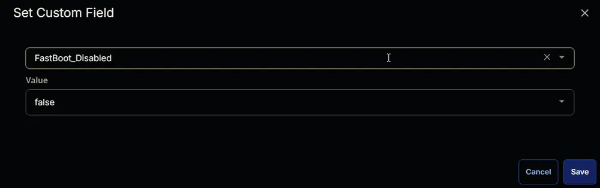

## Summary

The script will attempt to modify the registry keys to disable fastboot on the Windows workstations if it is not already disabled.

## Sample Run

  
  

## Dependencies

- [Custom Field - Company - Disable_FastBoot](/docs/9c1d0f0a-7ae4-46bd-a9a7-ae15df2ca633)  
- [Custom Field - Endpoint - FastBoot_Disabled](/docs/3c87c303-e892-4f6b-889f-acde66928978)  
- [Custom Field - Endpoint - Disable_Fastboot_Exclusion](/docs/b17237cc-d3cf-42a9-84fe-eda8d00bdd19)  
- [Custom Field - Site - Disable_Fastboot_Exclusion](/docs/693eeb66-9fb2-4653-8cf3-e23fb53c0f56)  
- [Device Group - Disable FastBoot](/docs/df5b7a85-683f-4fd6-9a24-4fc836ccfd8a)

## Task Creation

Create a new `Script Editor` style script in the system to implement this task.

  
  

**Name:** Disable FastBoot  
**Description:** The script will attempt to modify the registry keys to disable fastboot on the Windows workstations if it is not already disabled.  
**Category:** Custom  
  

## Task

1. Start by adding a row. You can do this by clicking the `Add Row` button at the bottom of the script page.  
     
   This function will appear.  
     

### Row 1 Function: PowerShell Script

Search and select the `PowerShell Script` function.  
  
  
  

Paste in the following PowerShell script and set the expected time of script execution to `300` seconds. Click the `Save` button.

```powershell
$registryPath = 'HKLM:\SYSTEM\CurrentControlSet\Control\Session Manager\Power'
if (Test-Path $registryPath) {
    $hiberbootEnabled = Get-ItemProperty -Path $registryPath -Name HiberbootEnabled -ErrorAction SilentlyContinue
    if ($hiberbootEnabled.HiberbootEnabled -eq 1) {
        Set-ItemProperty -Path $registryPath -Name HiberbootEnabled -Value 0
        $hiberbootEnabled = Get-ItemProperty -Path $registryPath -Name HiberbootEnabled -ErrorAction SilentlyContinue
        if ($hiberbootEnabled.HiberbootEnabled -ne 0) {
            return 'Failed'
        } else {
            return 'Success'
        }
    } else {
        return 'Success'
    }
} else {
    return 'Success'
}
```

### Row 2 Logic: If Then Else

  
  

#### Row 2a Condition: Output Contains

Type `Success` in the `Input Value or Variable` field and press `Enter`.  
  

#### Row 2b Function: Set Custom Field

Add a new row by clicking on the `Add row` button.  
  

Search and select the `Set Custom Field` function.  
  
  

Search and select `FastBoot_Disabled` in the `Search Custom Field` field, set `True` in the `Value` field, and click the `Save` button.  
  
  

#### Row 2d Function: Set Custom Field

Add a new row by clicking on the `Add row` button in the `Else` section.  
  

Search and select the `Set Custom Field` function.  
  
  

Search and select `FastBoot_Disabled` in the `Search Custom Field` field, set `False` in the `Value` field, and click the `Save` button.  
  
  

#### Row 2c Function: Script Exit

Add a new row by clicking on the `Add row` button.  
  

Search and select the `Script Exit` function.  
  

The following function will pop up on the screen:  
  

Paste the following lines in the `Error Message` field and click the `Save` button.  
```plaintext
Failed to disable FastBoot.
```
  

Click the `Save` button at the top-right corner of the screen to save the script.  
  

## Completed Script

  
  

## Deployment

The task should be scheduled to run once per day against the [Disable FastBoot](/docs/df5b7a85-683f-4fd6-9a24-4fc836ccfd8a) device group.

- Go to `Automation` > `Tasks.`
- Search for the `Disable FastBoot` task.
- Select the concerned task.
- Click on the `Schedule` button to schedule the task.  
    
- This screen will appear.  
    
- Click the `Does not repeat` button.  
    
- This pop-up box will appear.  
    
- Click the `OK` button without making any changes to run the task `Every day`.  
    
- Recurrence will be updated to `Every Day`.  
    
- Select the `Device Groups` option in the `Targeted Resources` section.  
    
- Search and select the [Disable FastBoot](/docs/df5b7a85-683f-4fd6-9a24-4fc836ccfd8a) device group.  
    
- Now click the `Run` button to initiate the task.  
    
- The task will start appearing in the Scheduled Tasks.  
    
    

## Output

- Script Log
- Custom Field