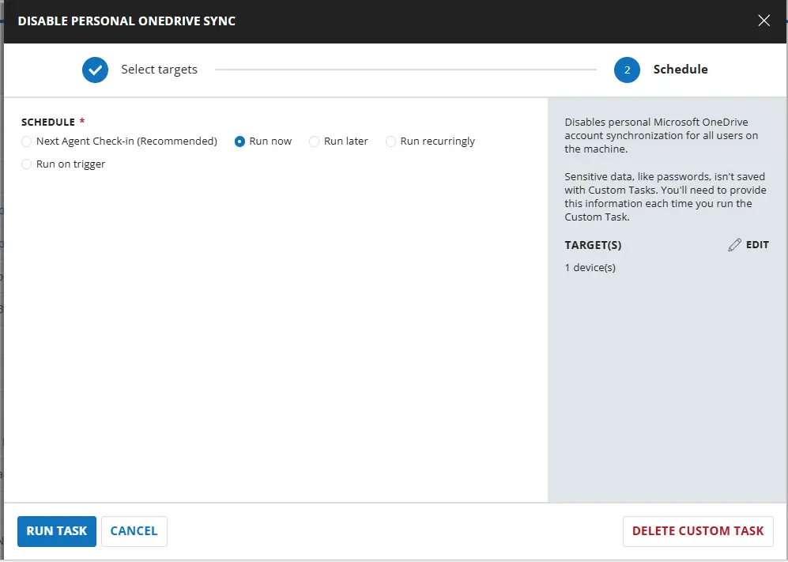
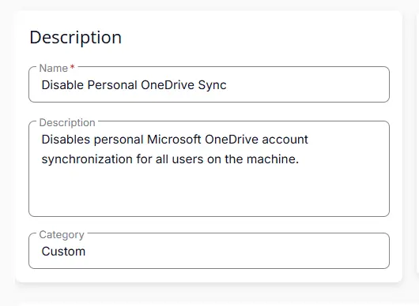
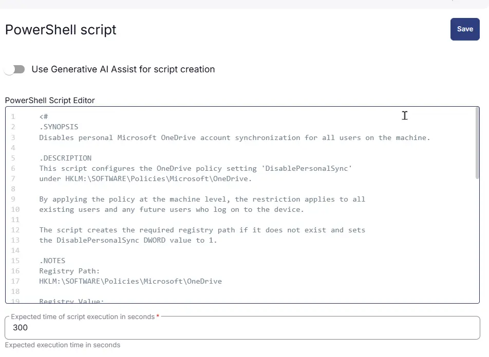
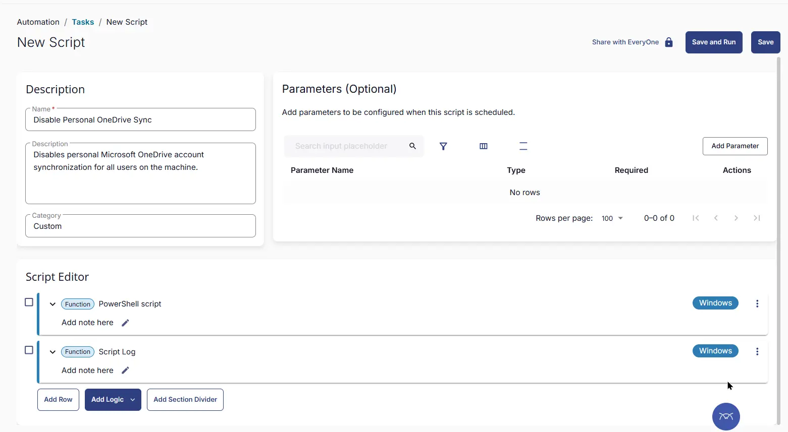

## Summary
Disables personal Microsoft OneDrive account synchronization for all users on the machine.

## Sample Run

 

## Task Creation

### Script Details

#### Step 1

Navigate to `Automation` ➞ `Tasks`  


#### Step 2

Create a new `Script Editor` style task by choosing the `Script Editor` option from the `Add` dropdown menu  


The `New Script` page will appear on clicking the `Script Editor` button:  


#### Step 3

Fill in the following details in the `Description` section:  

**Name:** `Disable Personal OneDrive Sync`  
**Description:** `Disables personal Microsoft OneDrive account synchronization for all users on the machine.`  
**Category:** `Custom`

 


#### Row 1 Function: `PowerShell Script`

Search and select the `PowerShell Script` function.  
 
  

The following function will pop up on the screen:  
  

Paste in the following PowerShell script and set the `Expected time of script execution in seconds` to `300` seconds. Click the `Save` button.

```powershell
<#
.SYNOPSIS
Disables personal Microsoft OneDrive account synchronization for all users on the machine.

.DESCRIPTION
This script configures the OneDrive policy setting 'DisablePersonalSync'
under HKLM:\SOFTWARE\Policies\Microsoft\OneDrive.

By applying the policy at the machine level, the restriction applies to all
existing users and any future users who log on to the device.

The script creates the required registry path if it does not exist and sets
the DisablePersonalSync DWORD value to 1.

.NOTES
Registry Path:
HKLM:\SOFTWARE\Policies\Microsoft\OneDrive

Registry Value:
DisablePersonalSync (DWORD)

Value Meanings:
0 = Allow personal OneDrive accounts
1 = Prevent personal OneDrive accounts

.REQUIREMENTS
- Administrative privileges.
- Windows system with Microsoft OneDrive installed or managed.
#>

$registryPath = 'HKLM:\SOFTWARE\Policies\Microsoft\OneDrive'

try {
    if (-not (Test-Path $registryPath)) {
        New-Item -Path $registryPath -Force -ErrorAction Stop | Out-Null
    }

    New-ItemProperty `
        -Path $registryPath `
        -Name 'DisablePersonalSync' `
        -PropertyType DWord `
        -Value 1 `
        -Force `
        -ErrorAction Stop | Out-Null

    return 'Success - DisablePersonalSync has been configured for all users.'
}
catch {
    throw "Failed to configure DisablePersonalSync policy. Error: $($_.Exception.Message)"
}
```

 

### Row 2 Function: Script Log

Add a new row by clicking the `Add Row` button.  
  

A blank function will appear.  
  

Search and select the `Script Log` function.  
  
 

In the script log message, simply type `%output%` and click the `Save` button.  


## Save Task

Click the `Save` button at the top-right corner of the screen to save the script.  


## Completed Task

 

## Output

- Script Logs

## Changelog

### 2026-06-04

- Initial version of the document
