---
id: '1ce60c7e-e23d-4313-bb00-7e89ae031d7f'
slug: /1ce60c7e-e23d-4313-bb00-7e89ae031d7f
title: 'Disable Windows Optional/Automatic Updates'
title_meta: 'Disable Windows Optional/Automatic Updates'
keywords: ['windows', 'updates', 'registry', 'automation', 'patching']
description: 'This document details the steps to disable Windows optional automatic updates using a script. It includes a sample run, dependencies, and a comprehensive implementation guide with visuals for each step.'
tags: ['patching', 'registry', 'windows']
draft: false
unlisted: false
last_update:
  date: 2025-05-09
---

## Summary

This task will disable the Windows optional automatic updates.

## Sample Run

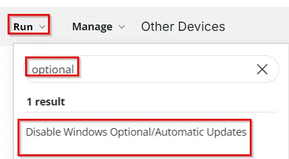  
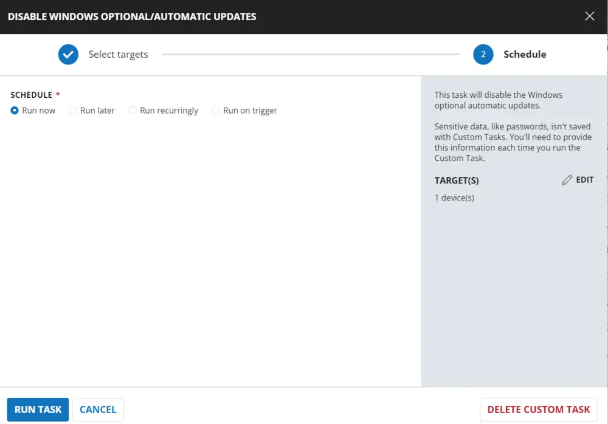  

## Dependencies

[Windows Optional Update Disabled](/docs/a2035a6f-bcbc-41a2-ace1-fc08b7ad2511)

## Implementation

### Create Task

To implement this script, please create a new "PowerShell" style script in the system.  
  

**Name:** Disable Windows Optional/Automatic Updates  
**Description:** This task will disable the Windows optional automatic updates.  
**Category:** Patching  
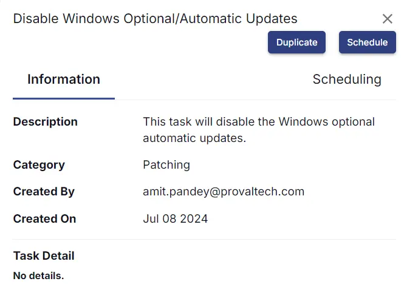  

## Script

Start by making three separate rows. You can do this by clicking the "Add Row" button at the bottom of the script page.  
  

### Row 1: Function: Script Log

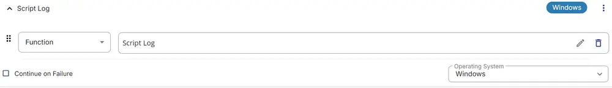  

In the script log message, type `Running the PowerShell to set NoAutoUpdates and Hide Automatic Updates Options.` so that the script will send the results of the PowerShell script above to the output on the Automation tab for the target device.  
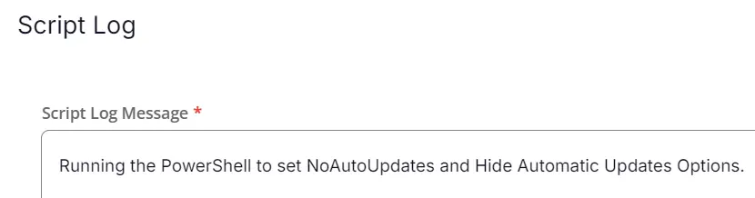  

### Row 2: Function: PowerShell Script

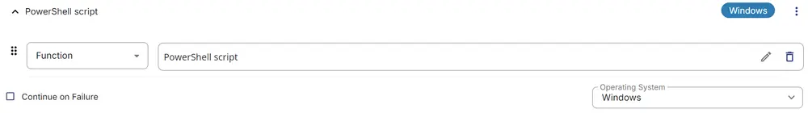  
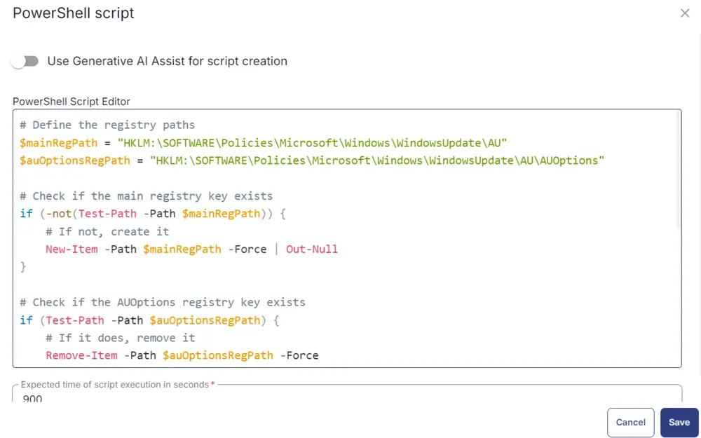  

Paste in the following PowerShell script and set the expected time of script execution to `900` seconds.

[PowerShell Script](https://github.com/ProVal-Tech/cw-rmm/blob/main/tasks/disable-windows-optionalautomatic-updates/script.ps1)

### Row 3: Function: Script Log

### Output

  

In the script log message, type `%output%` so that the script will send the results of the PowerShell script above to the output on the Automation tab for the target device.  
  

### Row 4: Logic: If/Then

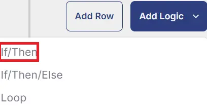  
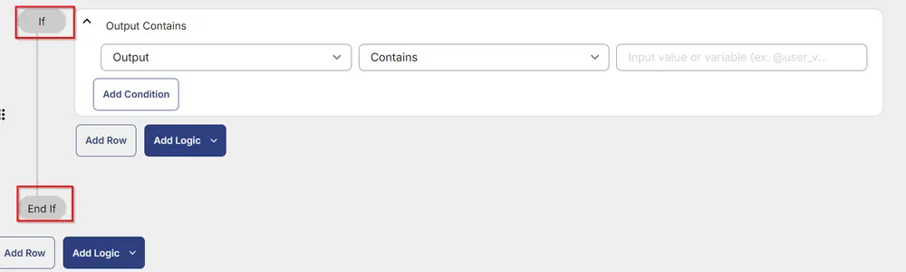  

### Row 4a: Condition: Output Contains

In the IF part, enter `Failed to set registry` in the right box of the "Output Contains" part.  
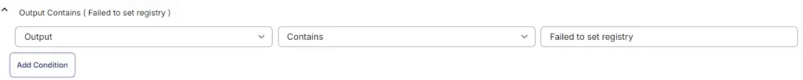  

### Row 4b: Condition: Script Exit

Add a new row by clicking on the Add row button.  
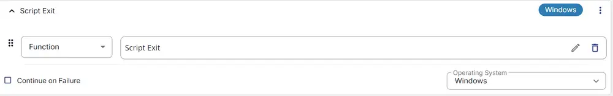  

In the script exit message, simply type `Failed to set the registry HKLM:/SOFTWARE/Policies/Microsoft/Windows/WindowsUpdate/AU -Name NoAutoUpdate -Value 1. Exiting script with error.`  
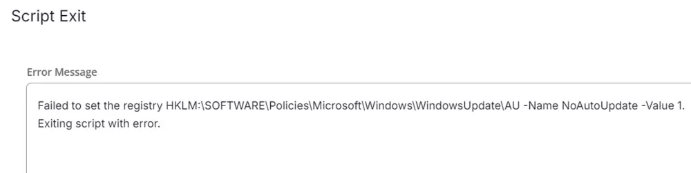  

### Row 5: Function: Set Custom Field

Select Function 'Set Custom Field'. When you select `set custom field`, it will open up a new window.  

In this window, search for the `Windows Optional Update Disabled` field.  

**Custom Field:** Windows Optional Update Disabled  
**Value:** `Disabled`  
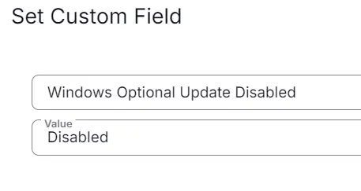  

### Row 6: Complete

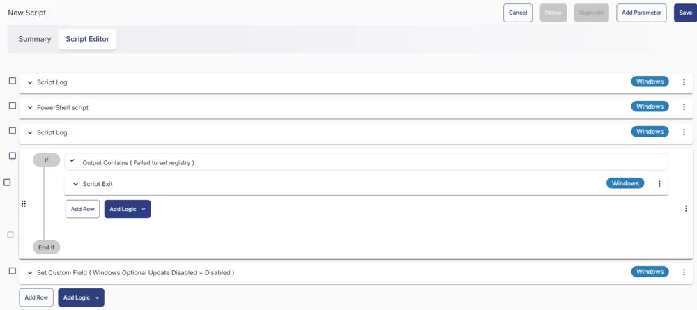

## Changelog

### 2025-04-10

- Initial version of the document

