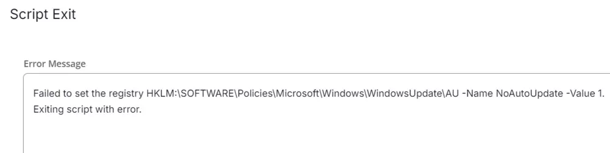

## Summary

This task will disable the Windows optional automatic updates.

## Sample Run

  
  

## Dependencies

[Windows Optional Update Disabled](/docs/a2035a6f-bcbc-41a2-ace1-fc08b7ad2511)

## Implementation

### Create Task

To implement this script, please create a new "PowerShell" style script in the system.  
  

**Name:** Disable Windows Optional/Automatic Updates  
**Description:** This task will disable the Windows optional automatic updates.  
**Category:** Patching  
  

## Script

Start by making three separate rows. You can do this by clicking the "Add Row" button at the bottom of the script page.  
  

### Row 1: Function: Script Log

  

In the script log message, type `Running the PowerShell to set NoAutoUpdates and Hide Automatic Updates Options.` so that the script will send the results of the PowerShell script above to the output on the Automation tab for the target device.  
  

### Row 2: Function: PowerShell Script

  
  

Paste in the following PowerShell script and set the expected time of script execution to `900` seconds.

```powershell
# Define the registry paths
$mainRegPath = "HKLM:\SOFTWARE\Policies\Microsoft\Windows\WindowsUpdate\AU"
$auOptionsRegPath = "HKLM:\SOFTWARE\Policies\Microsoft\Windows\WindowsUpdate\AU\AUOptions"
# Check if the main registry key exists
if (-not(Test-Path -Path $mainRegPath)) {
    # If not, create it
    New-Item -Path $mainRegPath -Force | Out-Null
}
# Check if the AUOptions registry key exists
if (Test-Path -Path $auOptionsRegPath) {
    # If it does, remove it
    Remove-Item -Path $auOptionsRegPath -Force
}
# Check if the AUOptions property exists under the main registry key
if ($null -ne (Get-ItemProperty -Path $mainRegPath -EA SilentlyContinue).AUOptions) {
    # If it does, remove it
    Remove-ItemProperty -Path $mainRegPath -Name "AUOptions" -Force
}
# Set the NoAutoUpdate DWORD value to 1
Set-ItemProperty -Path $mainRegPath -Name "NoAutoUpdate" -Value 1 -Type DWord -Force
# Check if the registry was set properly
if ((Get-ItemProperty -Path $mainRegPath).NoAutoUpdate -eq 1) {
    Write-Output "Registry set properly."
}
else {
    Write-Output "Failed to set registry."
}
```

### Row 3: Function: Script Log

### Output

  

In the script log message, type `%output%` so that the script will send the results of the PowerShell script above to the output on the Automation tab for the target device.  
  

### Row 4: Logic: If/Then

  
  

### Row 4a: Condition: Output Contains

In the IF part, enter `Failed to set registry` in the right box of the "Output Contains" part.  
  

### Row 4b: Condition: Script Exit

Add a new row by clicking on the Add row button.  
  

In the script exit message, simply type `Failed to set the registry HKLM:/SOFTWARE/Policies/Microsoft/Windows/WindowsUpdate/AU -Name NoAutoUpdate -Value 1. Exiting script with error.`  
  

### Row 5: Function: Set Custom Field

Select Function 'Set Custom Field'. When you select `set custom field`, it will open up a new window.  

In this window, search for the `Windows Optional Update Disabled` field.  

**Custom Field:** Windows Optional Update Disabled  
**Value:** `Disabled`  
  

### Row 6: Complete

  