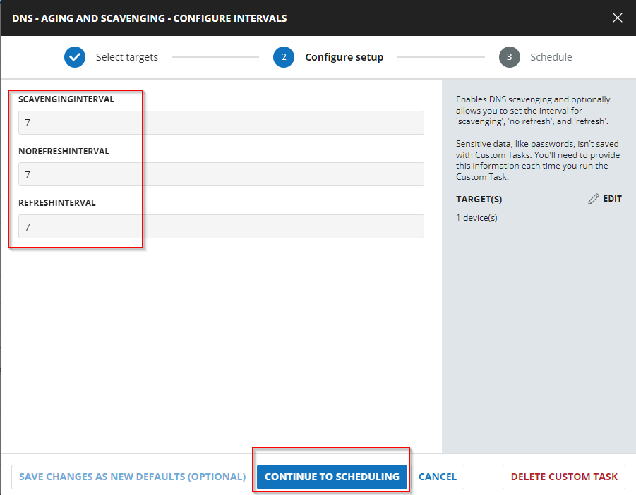
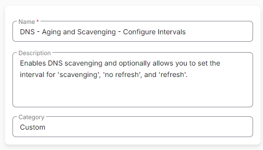
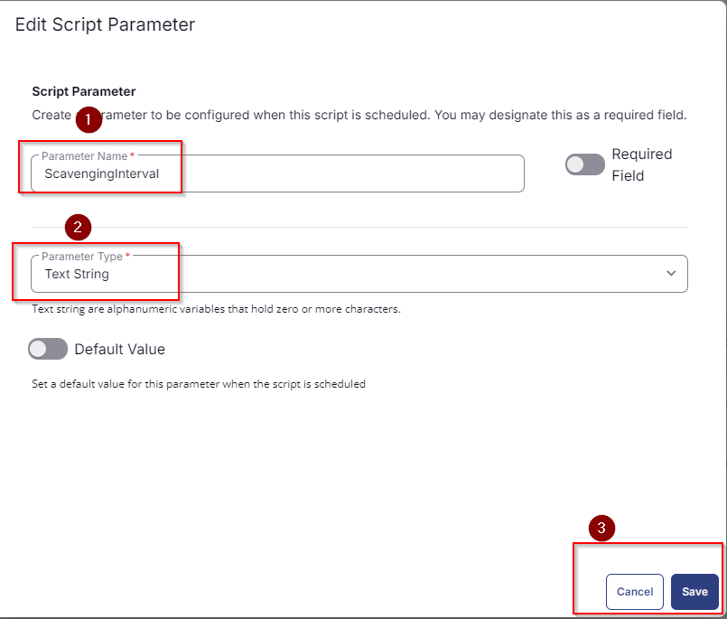
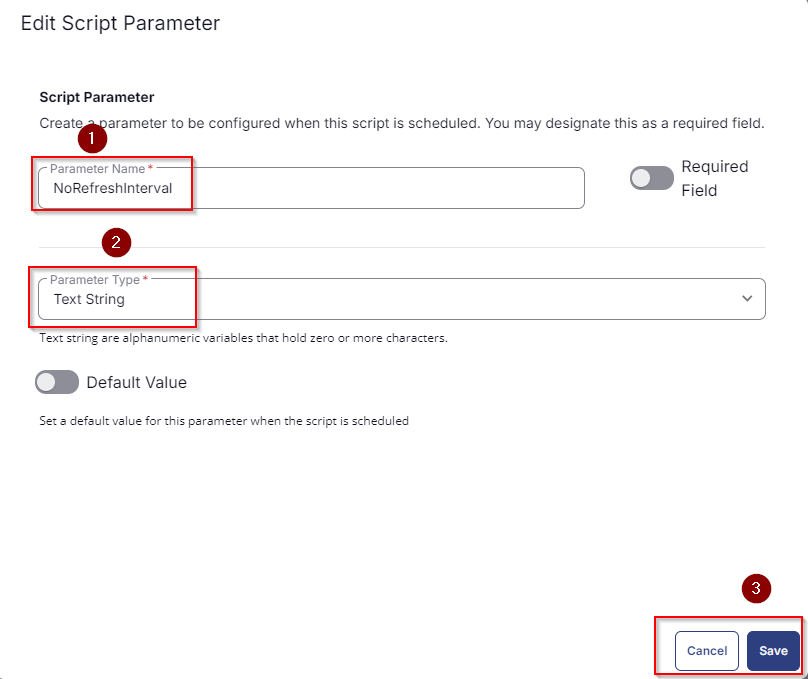
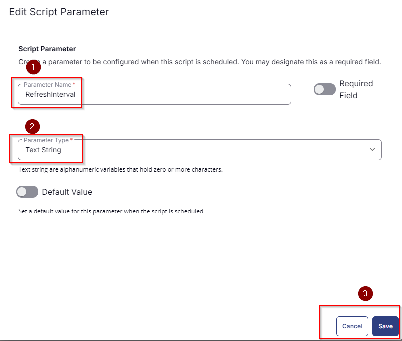
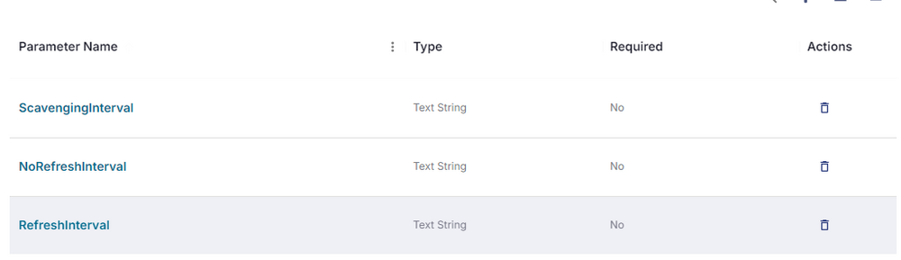
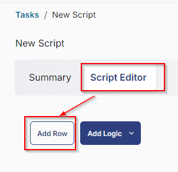
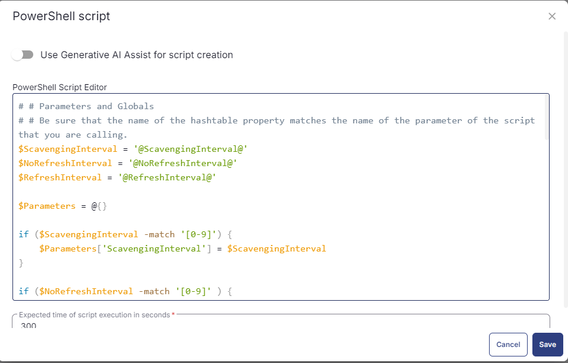
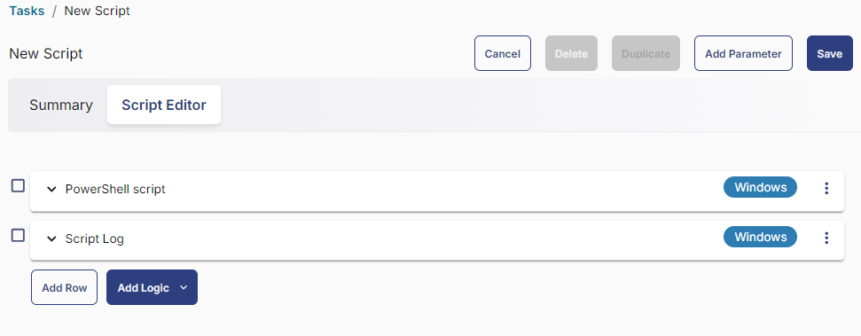

## Summary

This is an RMM implementation of the agnostic script [Set-DNSServerScavengingSettings](/docs/6942d20e-8606-4af2-bae5-7525935a2bfd). It enables DNS scavenging and optionally allows you to set the interval for scavenging, 'no refresh', and refresh.

## Sample Run



## Dependencies

[Set-DNSServerScavengingSettings](/docs/6942d20e-8606-4af2-bae5-7525935a2bfd)

## User Parameters

| Name                  | Example | Accepted Values | Required | Default | Type  | Description                                                                                          |
|-----------------------|---------|-----------------|----------|---------|-------|------------------------------------------------------------------------------------------------------|
| `ScavengingInterval`  | 7       | Integers        | False    |         | Text  | The scavenging process runs after X days.                                                           |
| `NoRefreshInterval`   | 7       | Integers        | False    |         | Text  | This setting controls when the DNS server rejects refresh requests from hosts and the DHCP service. |
| `RefreshInterval`     | 7       | Integers        | False    |         | Text  | This option determines when a DDNS record can be flagged for scavenging (deletion). The default value is seven days. |

## Task Creation

Create a new `Script Editor` style script in the system to implement this Task.


**Name:** DNS - Aging and Scavenging - Configure Intervals  \
**Description:** Enables DNS scavenging and optionally allows you to set the interval for 'scavenging', 'no refresh', and 'refresh'.  \
**Category:** Custom  \


## Parameters

Add a new parameter by clicking the `Add Parameter` button present at the top-right corner of the screen.


This screen will appear.


- Set `ScavengingInterval` in the `Parameter Name` field.
- Select `Text String` from the `Parameter Type` dropdown menu.
- Click the `Save` button.  


- It will ask for confirmation to proceed. Click the `Confirm` button to create the parameter.  


Add another parameter by clicking the `Add Parameter` button present at the top-right corner of the screen.


- Set `NoRefreshInterval` in the `Parameter Name` field.
- Select `Text String` from the `Parameter Type` dropdown menu.
- Click the `Save` button.  


- It will ask for confirmation to proceed. Click the `Confirm` button to create the parameter.

Add another parameter by clicking the `Add Parameter` button present at the top-right corner of the screen.

- Set `RefreshInterval` in the `Parameter Name` field.
- Select `Text String` from the `Parameter Type` dropdown menu.
- Click the `Save` button.
- It will ask for confirmation to proceed. Click the `Confirm` button to create the parameter.  


All the parameters will look like as shown below:  


## Task

Navigate to the Script Editor Section and start by adding a row. You can do this by clicking the `Add Row` button at the bottom of the script page.  


A blank function will appear.  


### Row 1 Function: PowerShell Script

Search and select the `PowerShell Script` function.  


The following function will pop up on the screen:  


Paste in the following PowerShell script and set the expected time of script execution to `300` seconds. Click the `Save` button.

```powershell
# # Parameters and Globals
# # Be sure that the name of the hashtable property matches the name of the parameter of the script that you are calling.
$ScavengingInterval = '@ScavengingInterval@'
$NoRefreshInterval = '@NoRefreshInterval@'
$RefreshInterval = '@RefreshInterval@'
$Parameters = @{}
if ($ScavengingInterval -match '[0-9]') {
    $Parameters['ScavengingInterval'] = $ScavengingInterval
}
if ($NoRefreshInterval -match '[0-9]' ) {
    $Parameters['NoRefreshInterval'] = $NoRefreshInterval
}
if ($RefreshInterval -match '[0-9]') {
    $Parameters['RefreshInterval'] = $RefreshInterval
}

#region Setup - Variables
$ProjectName = 'Set-DNSServerScavengingSettings'
[Net.ServicePointManager]::SecurityProtocol = [enum]::ToObject([Net.SecurityProtocolType], 3072)
$BaseURL = 'https://file.provaltech.com/repo'
$PS1URL = "$BaseURL/script/$ProjectName.ps1"
$WorkingDirectory = "C:\ProgramData\_automation\script\$ProjectName"
$PS1Path = "$WorkingDirectory\$ProjectName.ps1"
$Workingpath = $WorkingDirectory
$LogPath = "$WorkingDirectory\$ProjectName-log.txt"
$ErrorLogPath = "$WorkingDirectory\$ProjectName-Error.txt"
#endregion
#region Setup - Folder Structure
New-Item -Path $WorkingDirectory -ItemType Directory -ErrorAction SilentlyContinue | Out-Null
$response = Invoke-WebRequest -Uri $PS1URL -UseBasicParsing
if (($response.StatusCode -ne 200) -and (!(Test-Path -Path $PS1Path))) {
    throw "No pre-downloaded script exists and the script '$PS1URL' failed to download. Exiting."
} elseif ($response.StatusCode -eq 200) {
    Remove-Item -Path $PS1Path -ErrorAction SilentlyContinue
    [System.IO.File]::WriteAllLines($PS1Path, $response.Content)
}
if (!(Test-Path -Path $PS1Path)) {
    throw 'An error occurred and the script was unable to be downloaded. Exiting.'
}
#endregion
#region Execution
if ($Parameters) {
    & $PS1Path @Parameters
} else {
    & $PS1Path
}
#endregion
if ( !(Test-Path $LogPath) ) {
    throw 'PowerShell Failure. A Security application seems to have restricted the execution of the PowerShell Script.'
}
if ( Test-Path $ErrorLogPath ) {
    $ErrorContent = ( Get-Content -Path $ErrorLogPath )
    throw $ErrorContent
}
Get-Content -Path $LogPath
```



### Row 2: Function: Script Log

In the script log message, simply type `%output%` so that the script will send the results of the PowerShell script above to the output on the Automation tab for the target device.  


## Completed Task



## Output

- Script Log
