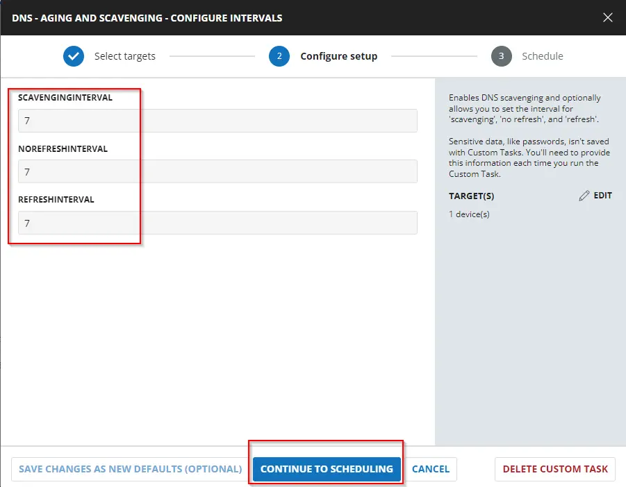
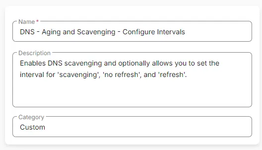
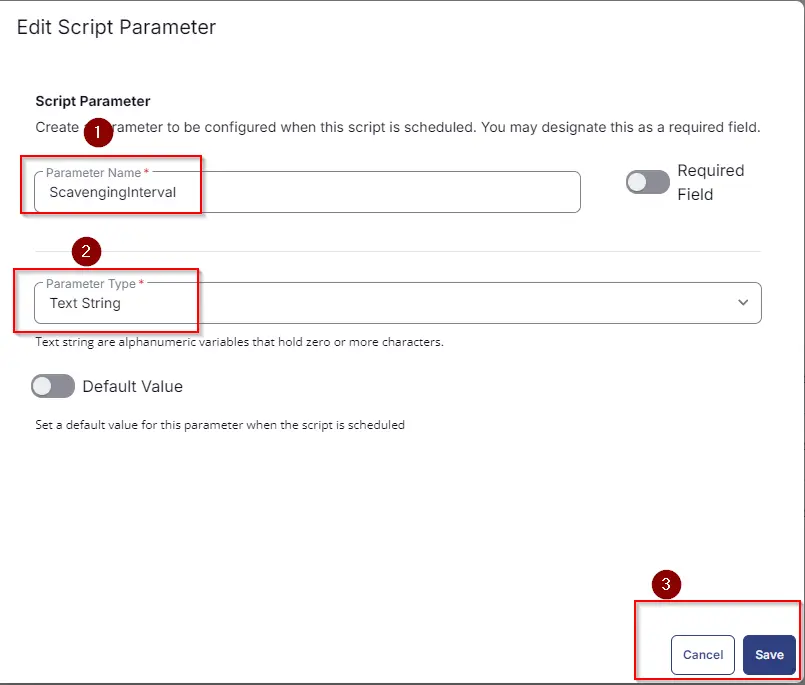
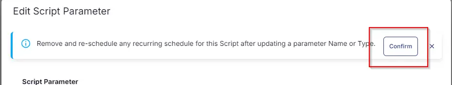
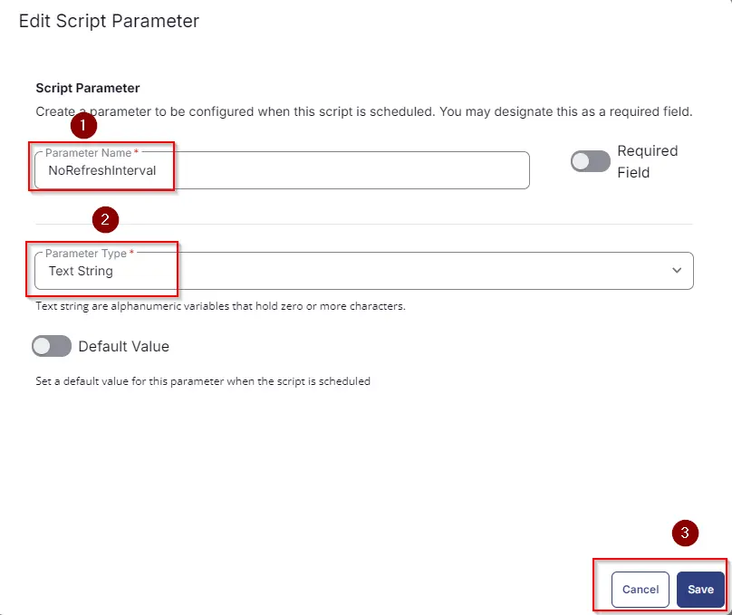
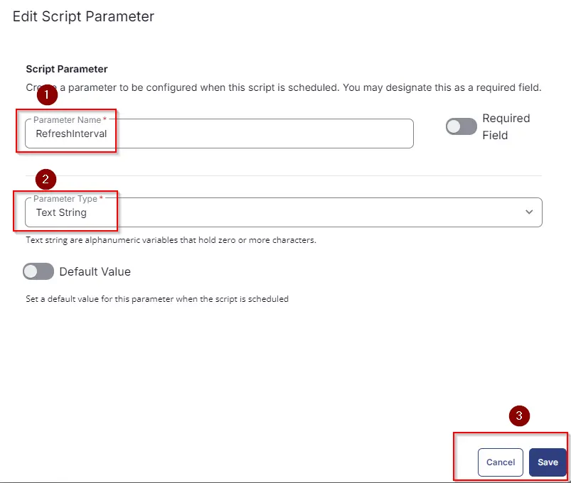
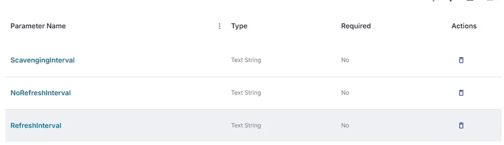
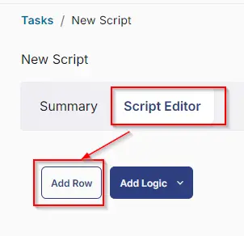
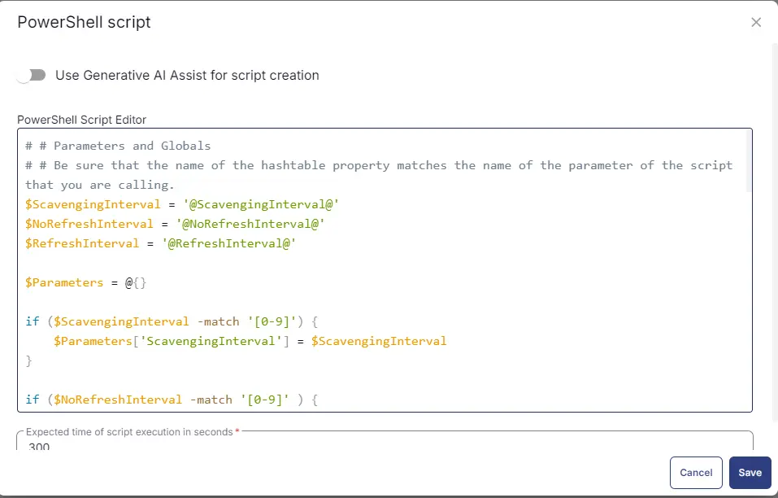
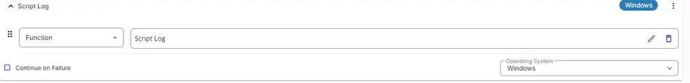

## Summary

This is an RMM implementation of the agnostic script [Set-DNSServerScavengingSettings](/docs/6942d20e-8606-4af2-bae5-7525935a2bfd). It enables DNS scavenging and optionally allows you to set the interval for scavenging, 'no refresh', and refresh.

## Sample Run

## Dependencies

[Set-DNSServerScavengingSettings](/docs/6942d20e-8606-4af2-bae5-7525935a2bfd)

## User Parameters

| Name                  | Example | Accepted Values | Required | Default | Type  | Description                                                                                          |
|-----------------------|---------|-----------------|----------|---------|-------|------------------------------------------------------------------------------------------------------|
| `ScavengingInterval`  | 7       | Integers        | False    |         | Text  | The scavenging process runs after X days.                                                           |
| `NoRefreshInterval`   | 7       | Integers        | False    |         | Text  | This setting controls when the DNS server rejects refresh requests from hosts and the DHCP service. |
| `RefreshInterval`     | 7       | Integers        | False    |         | Text  | This option determines when a DDNS record can be flagged for scavenging (deletion). The default value is seven days. |

## Task Creation

Create a new `Script Editor` style script in the system to implement this Task.

**Name:** DNS - Aging and Scavenging - Configure Intervals  \
**Description:** Enables DNS scavenging and optionally allows you to set the interval for 'scavenging', 'no refresh', and 'refresh'.  \
**Category:** Custom  \

## Parameters

Add a new parameter by clicking the `Add Parameter` button present at the top-right corner of the screen.

This screen will appear.

- Set `ScavengingInterval` in the `Parameter Name` field.
- Select `Text String` from the `Parameter Type` dropdown menu.
- Click the `Save` button.  

- It will ask for confirmation to proceed. Click the `Confirm` button to create the parameter.  

Add another parameter by clicking the `Add Parameter` button present at the top-right corner of the screen.

- Set `NoRefreshInterval` in the `Parameter Name` field.
- Select `Text String` from the `Parameter Type` dropdown menu.
- Click the `Save` button.  

- It will ask for confirmation to proceed. Click the `Confirm` button to create the parameter.

Add another parameter by clicking the `Add Parameter` button present at the top-right corner of the screen.

- Set `RefreshInterval` in the `Parameter Name` field.
- Select `Text String` from the `Parameter Type` dropdown menu.
- Click the `Save` button.
- It will ask for confirmation to proceed. Click the `Confirm` button to create the parameter.  

All the parameters will look like as shown below:  

## Task

Navigate to the Script Editor Section and start by adding a row. You can do this by clicking the `Add Row` button at the bottom of the script page.  

A blank function will appear.  

### Row 1 Function: PowerShell Script

Search and select the `PowerShell Script` function.  

The following function will pop up on the screen:  

Paste in the following PowerShell script and set the expected time of script execution to `300` seconds. Click the `Save` button.

[PowerShell Script](https://github.com/ProVal-Tech/cw-rmm/blob/main/tasks/dns-aging-and-scavenging-configure-intervals/script.ps1)

### Row 2: Function: Script Log

In the script log message, simply type `%output%` so that the script will send the results of the PowerShell script above to the output on the Automation tab for the target device.  

## Completed Task

## Output

- Script Log

## Changelog

### 2025-04-10

- Initial version of the document

