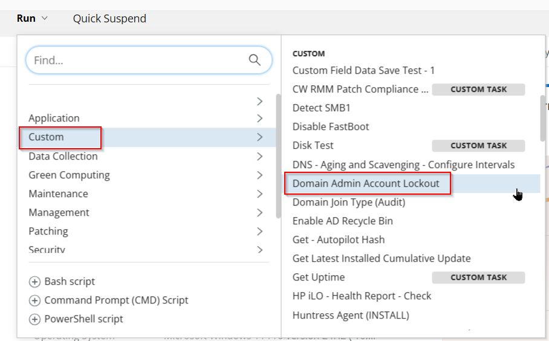
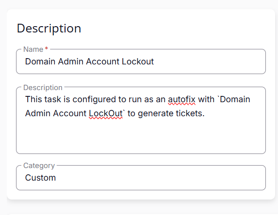
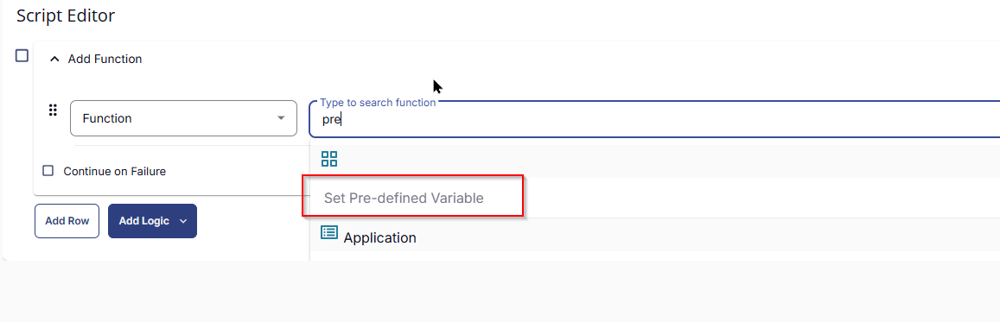
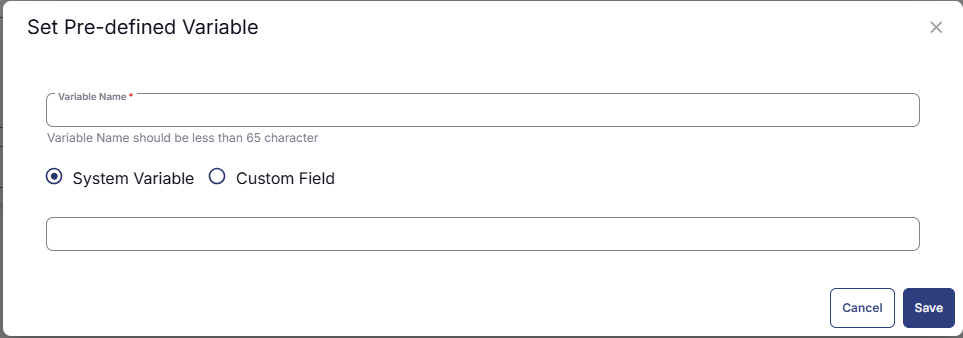
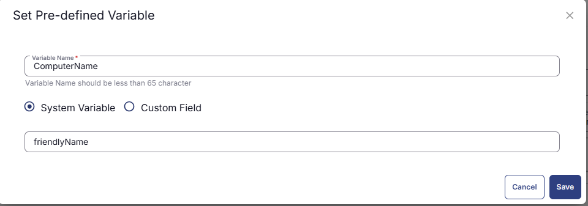
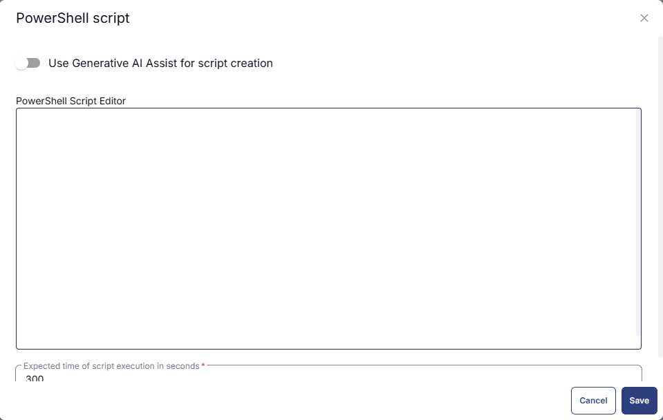
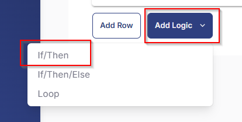
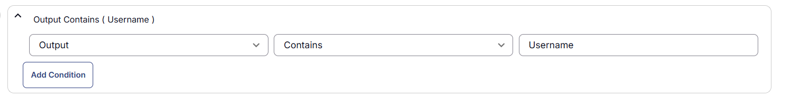
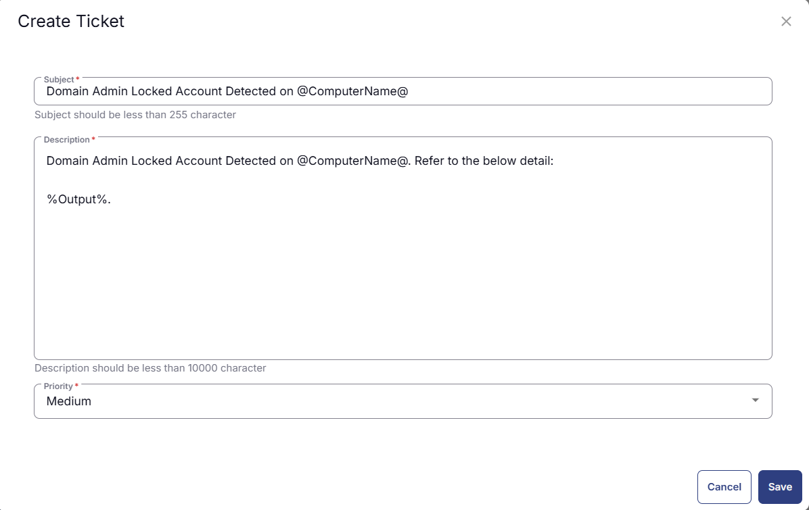
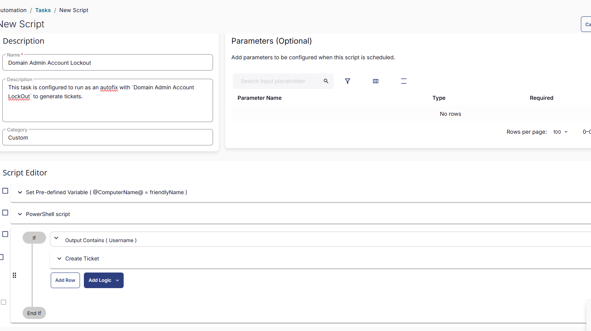

## Summary
This task is configured to run as an autofix with [CWRMM - Monitor - Domain Admin Account Lockout](/docs/23e2c753-e68a-4bcc-83df-1f62826025a5) to generate tickets.

## Sample Run
It has to be executed as an autofix with [CWRMM - Monitor - Domain Admin Account Lockout](/docs/23e2c753-e68a-4bcc-83df-1f62826025a5) monitor.


## Dependencies
[CWRMM - Monitor - Domain Admin Account Lockout](/docs/23e2c753-e68a-4bcc-83df-1f62826025a5)

## Task Creation

#### Step 1

Navigate to `Automation` ➞ `Tasks`  


#### Step 2

Create a new `Script Editor` style task by choosing the `Script Editor` option from the `Add` dropdown menu  


The `New Script` page will appear on clicking the `Script Editor` button:  


#### Step 3

Fill in the following details in the `Description` section:  

**Name:** `Domain Admin Account Lockout`  
**Description:** `This task is configured to run as an autofix with `Domain Admin Account LockOut` monitor to generate tickets.`  
**Category:** `Custom`




### Script Editor

Click the `Add Row` button in the `Script Editor` section to start creating the script  


A blank function will appear:  


#### Row 1 Function: `Set Pre-defined Variable`
Search and select the Set Pre-defined Variable function.


The following function will pop up on the screen:


- Set `ComputerName` in the Variable Name field.
- Search and select `friendlyName` from the System Variable dropdown.
- Click the Save button.


#### Row 2 Function: `Powershell Script`  

Add a new row by clicking the Add Row button.  
Search and select the PowerShell Script function.  
The following function will pop up on the screen: 


Paste in the following PowerShell script and set the Expected time of script execution in seconds to 900 seconds. Click the Save button.

``` powershell
$st = (Get-Date).AddMinutes(-15); 
$r = Get-WinEvent -ErrorAction SilentlyContinue -FilterHashtable @{LogName = 'Security'; Id = 4740; StartTime = $st } | ForEach-Object {$ex = ([xml]$_.ToXml()).Event; 
$e = [ordered]@{EventDate = [DateTime]$ex.System.TimeCreated.SystemTime }; $ex.EventData.ChildNodes | ForEach-Object { $e[$_.Name] = $_.'#text' }; [PsCustomObject]$e};
if ($r) {$domainAdmins = Get-ADGroupMember -Identity 'Domain Admins' -Recursive | Select-Object -ExpandProperty SamAccountName; 
$lockedOutAdmins = $r | Where-Object { $domainAdmins -contains $_.TargetUserName };
$lockedOutAdmins | ForEach-Object {$user = $_.TargetUserName; 
$lastLogin = (Get-ADUser -Identity $user -Properties LastLogonDate).LastLogonDate; $lockoutTime = $_.EventDate; $endpoint = $_.TargetDomainName; 
$domain = $_.SubjectDomainName; 
[PSCustomObject]@{Username = $user;
 LastLogin = $lastLogin;
 LockoutTime = $lockoutTime;
 Endpoint = $endpoint; 
Domain = $domain}} | Format-List}

```

#### Row 3 Logic: `If/Then`
Add a new If/Then logic from the Add Logic dropdown menu.  


#### Row 3a Condition: Output Contains
Type `Username` in the Value box.


#### Row 3b Function: Create Ticket
Add a new row in the `if/then` section by clicking the Add Row button.    
Search and select the `create ticket` function.  
Fill in the Following details in the pop up:  
Subject : `Domain Admin Locked Account Detected on @ComputerName@`  
Description : `Domain Admin Locked Account Detected on @ComputerName@. Refer to the below detail:
%Output%.`
Priority : `Medium` 


## Save Task

Click the `Save` button at the top-right corner of the screen to save the script.  


## Completed Task



## Deployment
It has to be executed as an autofix with [CWRMM - Monitor - Domain Admin Account Lockout](/docs/23e2c753-e68a-4bcc-83df-1f62826025a5) monitor.

## Output
- Script Logs
- Tickets
