## Summary

This document describes how to join a non-domain joined computer to a domain. The machine will be forcefully rebooted if required. It covers the CW RMM implementation of the agnostic script [Join-Domain](/docs/fb3e4906-6520-4b5b-bc35-db7b79b45f7d).

## Sample Run

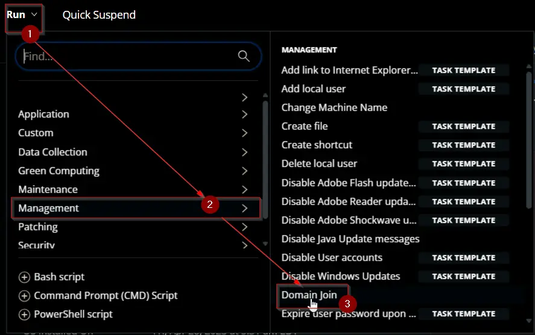  
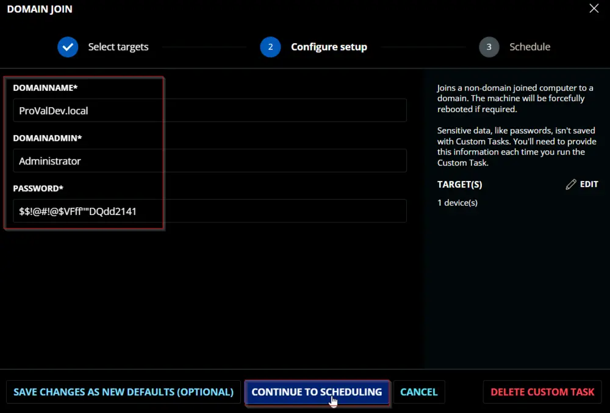  
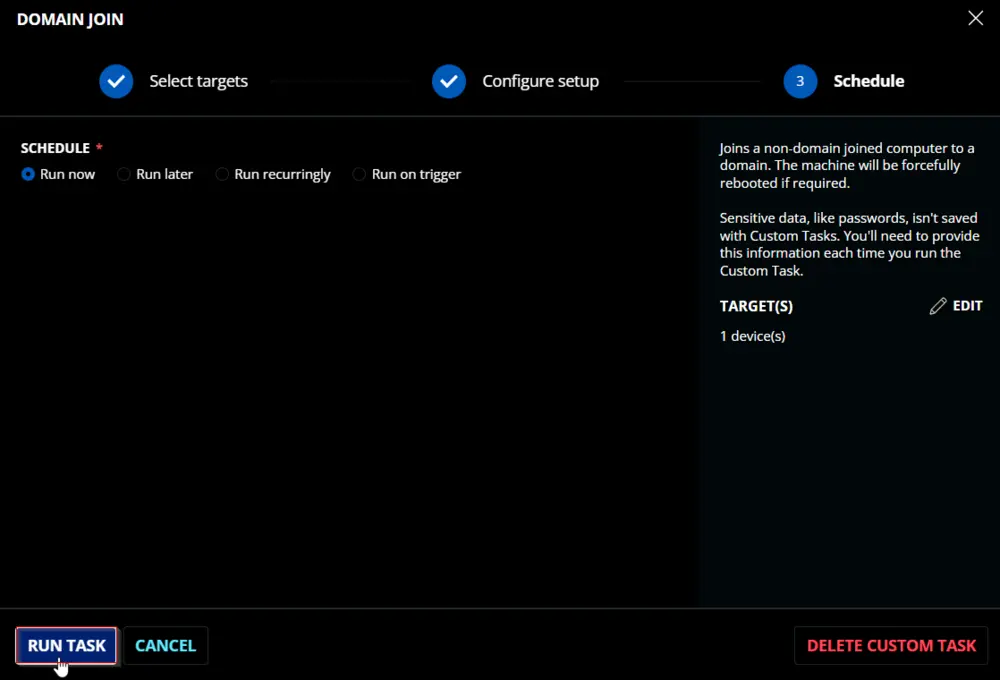  

## Dependencies

- [Join-Domain](/docs/fb3e4906-6520-4b5b-bc35-db7b79b45f7d)

## User Parameters

| Name        | Example                     | Required | Type        | Description                                 |
|-------------|-----------------------------|----------|-------------|---------------------------------------------|
| DomainName  | ProValDev.local             | True     | Text String | The name of the domain to join.            |
| DomainAdmin | Administrator                | True     | Text String | Username of a domain administrator.         |
| Password    | "QWfqw2%R@@$@FQW:RVV!'qwdwq" | True     | Text String | Password of the domain administrator.       |

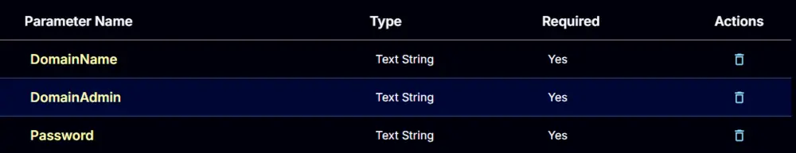

## Task Creation

Create a new `Script Editor` style script in the system to implement this task.  
  
  

**Name:** `Domain Join`  
**Description:** `Joins a non-domain joined computer to a domain. The machine will be forcefully rebooted if required.`  
**Category:** `Management`  
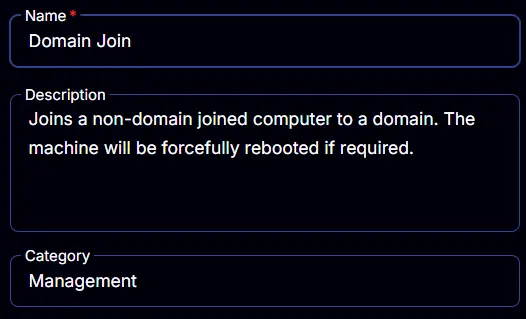  

## Parameters

### DomainName

Add a new parameter by clicking the `Add Parameter` button present at the top-right corner of the screen.  
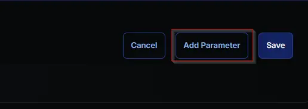  

This screen will appear.  
  

- Set `DomainName` in the `Parameter Name` field.
- Enable the `Required Field` button.
- Select `Text String` from the `Parameter Type` dropdown menu.
- Click the `Save` button.

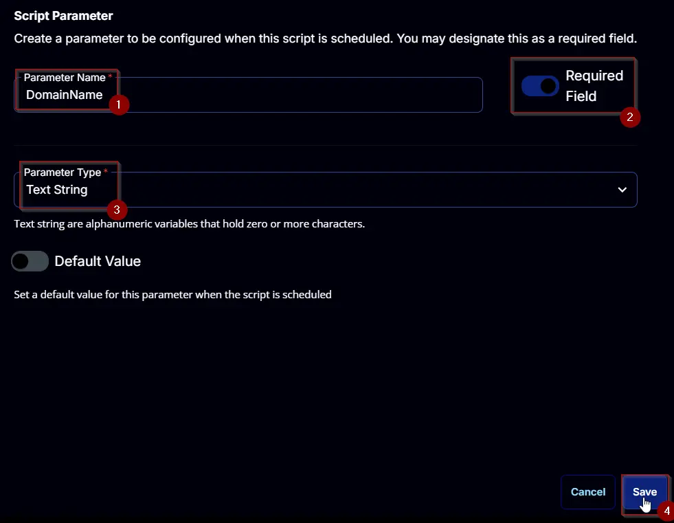  

### DomainAdmin

Add a new parameter by clicking the `Add Parameter` button present at the top-right corner of the screen.  
  

This screen will appear.  
  

- Set `DomainAdmin` in the `Parameter Name` field.
- Enable the `Required Field` button.
- Select `Text String` from the `Parameter Type` dropdown menu.
- Click the `Save` button.

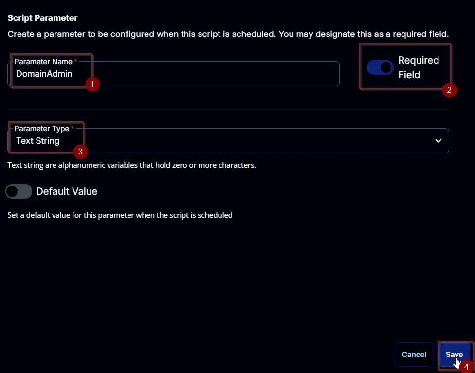  

### Password

Add a new parameter by clicking the `Add Parameter` button present at the top-right corner of the screen.  
  

This screen will appear.  
  

- Set `Password` in the `Parameter Name` field.
- Enable the `Required Field` button.
- Select `Text String` from the `Parameter Type` dropdown menu.
- Click the `Save` button.

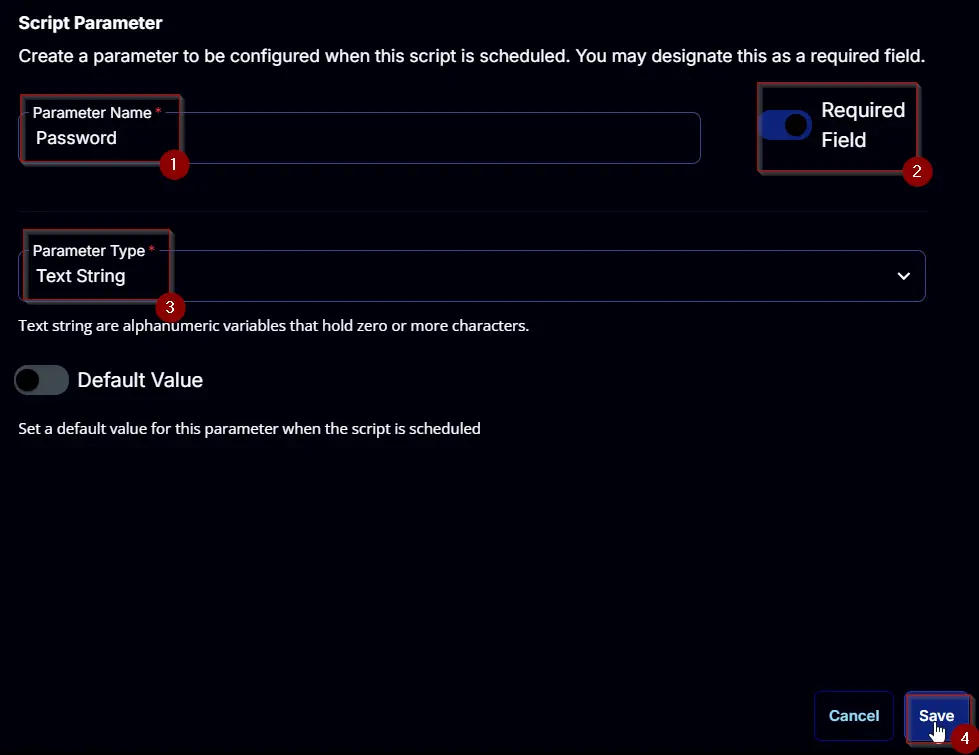  

## Task

Navigate to the Script Editor section and start by adding a row. You can do this by clicking the `Add Row` button at the bottom of the script page.  
  

A blank function will appear.  
  

### Row 1 Function: PowerShell Script

Search and select the `PowerShell Script` function.  
  
  

The following function will pop up on the screen:  
  

Paste in the following PowerShell script and set the `Expected time of script execution in seconds` to `600` seconds. Click the `Save` button.  

```powershell
[Diagnostics.CodeAnalysis.SuppressMessageAttribute('PSAvoidUsingConvertToSecureStringWithPlainText', '')]
[CmdletBinding()]
Param()
#region parameters
$DomainName = '@DomainName@'
$Admin = '@DomainAdmin@'
$password = @'
@Password@
'@
if ( ($DomainName -match '\SDomainName\S') -or ([String]::IsNullOrWhiteSpace($DomainName)) ) {
    throw 'Invalid domain name. Please provide a valid domain name.'
}
if ( ($Admin -match '\SDomainAdmin\S') -or ([String]::IsNullOrWhiteSpace($Admin)) ) {
    throw 'Invalid domain admin account. Please provide a valid domain admin account.'
}
if ( ($password -match '\SPassword\S') -or ([String]::IsNullOrWhite($password)) ) {
    throw 'Invalid password. Please provide a valid password.'
}
$securePwd = ConvertTo-SecureString -String $password -AsPlainText -Force
$credential = New-Object -TypeName pscredential -ArgumentList $Admin, $securePwd
$Parameters = @{
    DomainName = $DomainName
    Credential = $credential
}
#endregion
#region Setup - Variables
$ProjectName = 'Invoke-OfficeScrub'
[Net.ServicePointManager]::SecurityProtocol = [enum]::ToObject([Net.SecurityProtocolType], 3072)
$BaseURL = 'https://file.provaltech.com/repo'
$PS1URL = "$BaseURL/script/$ProjectName.ps1"
$WorkingDirectory = "C:\ProgramData\_automation\script\$ProjectName"
$PS1Path = "$WorkingDirectory\$ProjectName.ps1"
$WorkingPath = $WorkingDirectory
$LogPath = "$WorkingDirectory\$ProjectName-log.txt"
$ErrorLogPath = "$WorkingDirectory\$ProjectName-Error.txt"
#endregion
#region Setup - Folder Structure
New-Item -Path $WorkingDirectory -ItemType Directory -ErrorAction SilentlyContinue | Out-Null
$response = Invoke-WebRequest -Uri $PS1URL -UseBasicParsing
if (($response.StatusCode -ne 200) -and (!(Test-Path -Path $PS1Path))) {
    throw "No pre-downloaded script exists and the script '$PS1URL' failed to download. Exiting."
} elseif ($response.StatusCode -eq 200) {
    Remove-Item -Path $PS1Path -ErrorAction SilentlyContinue
    [System.IO.File]::WriteAllLines($PS1Path, $response.Content)
}
if (!(Test-Path -Path $PS1Path)) {
    throw 'An error occurred and the script was unable to be downloaded. Exiting.'
}
#endregion
#region Execution
if ($Parameters) {
    & $PS1Path @Parameters
} else {
    & $PS1Path
}
#endregion
#region log verification
if ( !(Test-Path $LogPath) ) {
    throw 'PowerShell Failure. A Security application seems to have restricted the execution of the PowerShell Script.'
}
if ( Test-Path $ErrorLogPath ) {
    $ErrorContent = ( Get-Content -Path $ErrorLogPath )
    throw $ErrorContent
}
Get-Content -Path $LogPath
#endregion
```

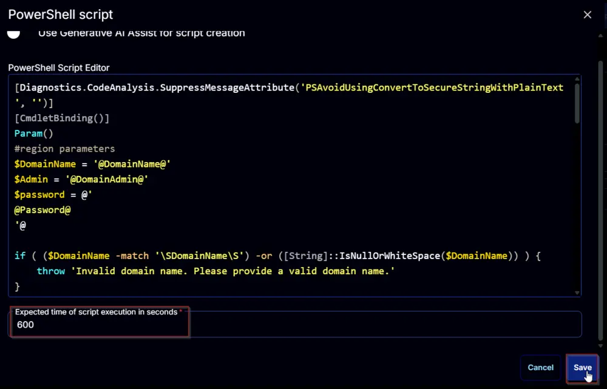  

### Row 2 Function: Script Log

Add a new row by clicking the `Add Row` button.  
  

A blank function will appear.  
  

Search and select the `Script Log` function.  
  

The following function will pop up on the screen:  
  

In the script log message, simply type `%Output%` and click the `Save` button.  
  

Click the `Save` button at the top-right corner of the screen to save the script.  
  

## Completed Script

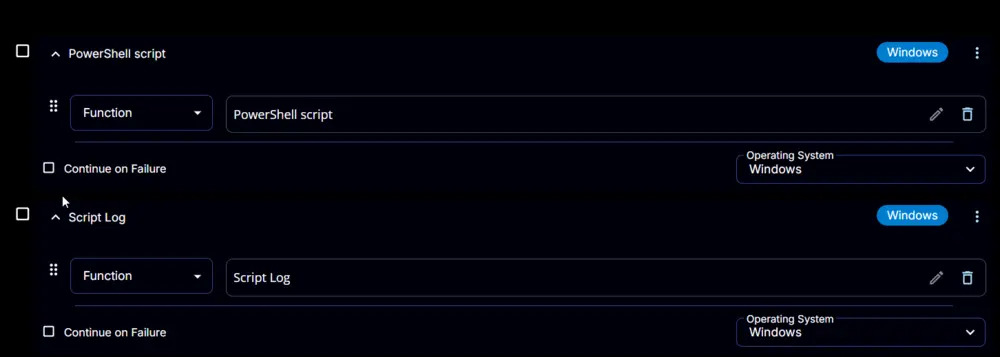  

## Output

- Script log
