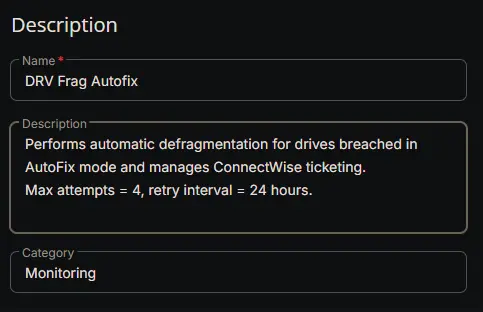
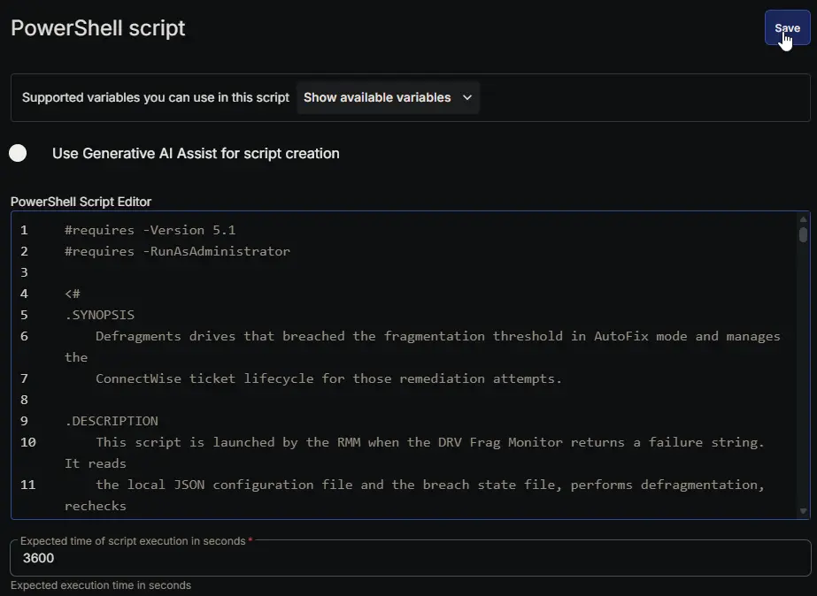
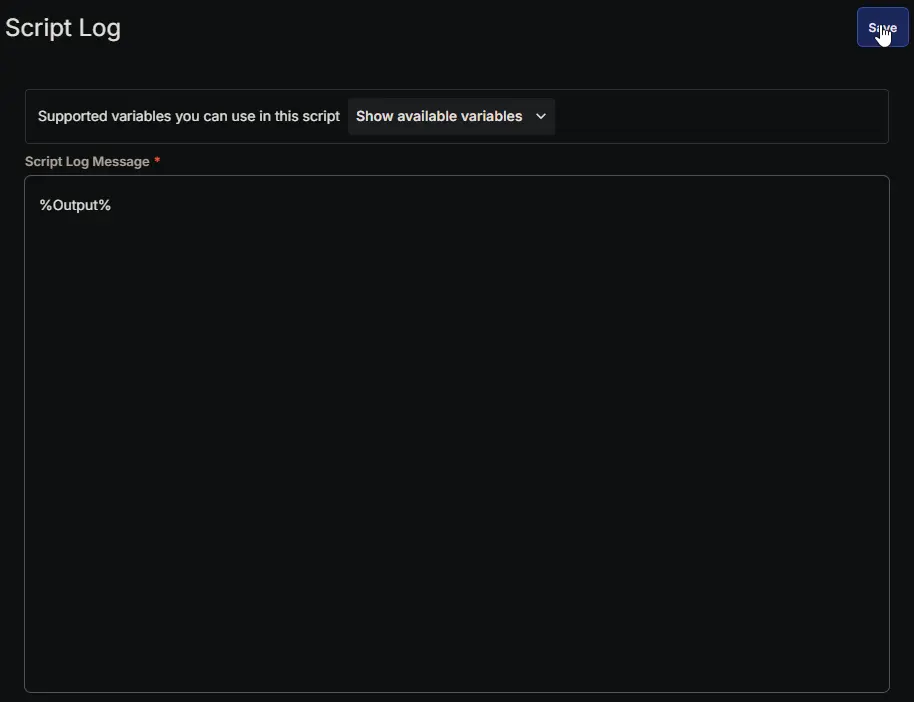
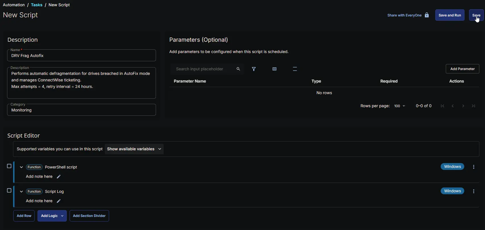

## Summary

The DRV Frag Autofix task is an automation task launched by the [DRV - Frag Monitoring](/docs/95c3fc7f-750f-4941-a088-d73eafdc60dc) monitor set whenever a fragmentation breach requires automatic remediation. It reads the local JSON configuration file and the breach state file, performs defragmentation on eligible drives, rechecks fragmentation, and manages the ConnectWise ticket lifecycle via webhooks.

It runs only when the effective mode is `AutoFix` and the server autofix policy allows it. However, in this solution, servers are effectively restricted to **AlertOnly** mode: the dynamic group that receives the automation tasks ([DRV Frag Monitoring - Active](/docs/f7b6eeec-bde1-4eb1-ba2f-0a0d42e7dcc7)) **excludes servers with endpoint‑level `DRV_Frag_Mode` set to `Enabled - Autofix`**. Therefore, this task effectively performs remediation **only on workstations** configured with `AutoFix`. Servers will never be in a state that triggers defragmentation, and in `AlertOnly` or `Disabled` modes the script exits cleanly without any action.

### How it works

1. **Configuration and State Loading**  
   The script first reads the configuration file:

   ```plaintext
   C:\ProgramData\_Automation\Script\DRVFragmentationMonitoring\DRVFragmentationMonitoring.json
   ```

   It checks the effective `Mode`, `Role`, `Drives`, `Threshold`, and `AutoFixAllowed`. If the mode is `Disabled` or `AlertOnly`, the script exits immediately. It also loads the current state from `Drives_With_Existing_Ticket.json`, the close list from `Drives_To_Close_Ticket.json`, and the fragmentation cache.

   > **Note:** For servers, even if the configuration file shows `AutoFixAllowed = true` (which would require the endpoint override `Enabled - Autofix`), such servers are not part of the Active group and are never targeted by the monitor. As a result, the Autofix task never runs on a server in this solution. The server autofix policy is only a safeguard in the scripts, not a practical path to server remediation.

2. **Lock and Remediation**  
   A lock file (`Autofix.lock`) is created to prevent concurrent runs. For each drive in the state that is in `AutoFix` mode and not exhausted, the script:
   - Validates drive selection and media eligibility (only fixed HDDs).
   - Measures pre‑remediation fragmentation via `Win32_Volume.DefragAnalysis`.
   - If fragmentation is already below threshold, it skips defragmentation and allows the monitor to close the ticket.
   - Otherwise, it performs defragmentation using `Win32_Volume.Defrag`, then measures post‑remediation fragmentation.
   - Updates attempt count, timestamps, and state.

3. **Ticket Lifecycle**  
   - If the first remediation attempt fails, the script creates a ticket via the webhook.
   - If a middle attempt fails and a ticket exists, it adds a comment.
   - If the final attempt (attempt 4) fails, it adds a final comment and marks the state exhausted.
   - If remediation succeeds and a ticket exists, it closes the ticket.
   - If remediation succeeds and no ticket exists, the state is cleared.
   - The fragmentation cache is updated with the post‑remediation measurement so the monitor observes the change immediately.

4. **Cleanup**  
   The lock file is removed in a `finally` block, even if an error occurs. The state files are written back, and the script returns a single summary string beginning with `Success:` or `Failure:`.

> The Autofix task is **not scheduled**; it is triggered automatically by the monitor set when a failure string is returned. The task itself is configured as an Automation Task in CW RMM, so it runs only when the monitor requests it.

## Dependencies

- [Custom Field: DRV_Frag_Mode_Wks](/docs/07b326ab-b7b1-4a31-b91b-22119dd41ec8)
- [Custom Field: DRV_Frag_Mode_Svr](/docs/edc708ab-b61a-44d0-a563-d5f2571faf55)
- [Custom Field: DRV_Frag_Drives_Wks](/docs/e60834f5-f158-48e6-b2aa-0e83132c7613)
- [Custom Field: DRV_Frag_Drives_Svr](/docs/dc296d51-d58b-4164-8bb7-1c60786449cb)
- [Custom Field: DRV_Frag_Threshold_Wks](/docs/dafbbfd1-ae21-4c4f-9e97-6be2bee4cc77)
- [Custom Field: DRV_Frag_Threshold_Svr](/docs/5fe9b606-2dad-40a9-93d3-b53db9fc8824)
- [Custom Field: DRV_Frag_Mode_Wks_Site](/docs/1f925f10-61f7-4db7-824f-f955d252342b)
- [Custom Field: DRV_Frag_Mode_Svr_Site](/docs/4e70913e-811f-4238-b804-04726145b2d0)
- [Custom Field: DRV_Frag_Drives_Wks_Site](/docs/5b3093b3-6a9e-4502-aac1-93cdb3714870)
- [Custom Field: DRV_Frag_Drives_Svr_Site](/docs/e9a25222-7108-454a-ad76-a224a1b69b47)
- [Custom Field: DRV_Frag_Threshold_Wks_Site](/docs/f3597302-8bb5-440c-8dc6-600a34506bb5)
- [Custom Field: DRV_Frag_Threshold_Svr_Site](/docs/70f41848-2ea5-4deb-b3cf-53edf0c9bf22)
- [Custom Field: DRV_Frag_Mode](/docs/563f1ad1-79df-47c7-ac99-b56566cd8634)
- [Custom Field: DRV_Frag_Drives](/docs/a06d0792-44dd-4946-addc-4b27ca275686)
- [Custom Field: DRV_Frag_Threshold](/docs/ea02dd10-c313-4636-a4e9-40edc4ae7357)
- [Custom Field: Ticket_Mgmt_Webhook_Url](/docs/8e55deb6-bef8-4501-9e64-7b25e7fcd1ab)
- [Device Group: DRV Frag Monitoring - Active](/docs/f7b6eeec-bde1-4eb1-ba2f-0a0d42e7dcc7)
- [Device Group: DRV Frag Monitoring - Alert Only [Workstations]](/docs/1eb19953-1b8c-4191-92df-c3e57f272063)
- [Task: DRV Frag Monitoring Configuration Writer](/docs/cb957f04-2261-465c-babf-4fc6106d7039)
- [Monitor: DRV - Frag Monitoring](/docs/95c3fc7f-750f-4941-a088-d73eafdc60dc)
- [Workflow: CWRMM Ticket Management for Monitors](/docs/57daa951-2acc-4be7-a025-0d0ca729ef57)
- [Trigger: CWRMM Ticket Management for Monitors](/docs/05c811e6-c6d0-4652-b4b6-2aa83f9605c7)
- [Solution: Drive Fragmentation Monitoring](/docs/fb923e51-3cca-4b32-9066-51fbef06953f)

## Task Setup Path

- **Tasks Path:** `AUTOMATION` ➞ `Tasks`  
- **Task Type:** `Automation Task`  

## Task Creation

### **Description**

- **Name:** `DRV Frag Autofix`  
- **Description:**

```PlainText
Performs automatic defragmentation for drives breached in AutoFix mode and manages ConnectWise ticketing.
Max attempts = 4, retry interval = 24 hours.
```

- **Category:** `Monitoring`



### **Script Editor**

### Row 1 Function: PowerShell script

- **Notes:** `<Leave it Blank>`  
- **Use Generative AI Assist for script creation:** `False`  
- **Expected time of script execution in seconds:** `3600`  
- **Continue on Failure:** `False`  
- **Run As:** `System`  
- **Operating System:** `Windows`  
- **PowerShell Script Editor:**

[PowerShell Script](https://github.com/ProVal-Tech/cw-rmm/blob/main/tasks/drv-frag-autofix/script.ps1)



### Row 2 Function: Script Log

- **Notes:** `<Leave it Blank>`  
- **Continue on Failure:** `False`  
- **Operating System:** `Windows`  
- **Script Log Message:** `%Output%`  



## Completed Task



## Output

- Script Log
- Updated state files:
  - `Drives_With_Existing_Ticket.json`
  - `Drives_To_Close_Ticket.json`
  - `Drive_Fragmentation_Cache.json`

## Trigger

The task is triggered automatically by the [DRV - Frag Monitoring](/docs/95c3fc7f-750f-4941-a088-d73eafdc60dc) monitor set when a failure string is returned. No schedule is defined in the task itself; it runs only when the monitor requests it.

## Changelog

### 2026-08-26

- Initial version of the document
