## Summary

The DRV Frag Monitoring Configuration Writer is a preparation task that builds the local monitoring configuration consumed by the [DRV - Frag Monitoring](/docs/95c3fc7f-750f-4941-a088-d73eafdc60dc) monitor set and the [DRV Frag Autofix](/docs/bfa10078-375c-44ee-8741-2e11fa2a2031) task. It does **not** perform any fragmentation monitoring or remediation itself. Instead, it reads the mode, drive selection, threshold, and ticketing webhook URL from ConnectWise RMM custom fields, applies the server autofix policy, and writes a structured JSON file that the other two components read every time they run.

**Important:** In this solution, servers are restricted to **AlertOnly** mode. The dynamic group that receives this task ([DRV Frag Monitoring - Active](/docs/f7b6eeec-bde1-4eb1-ba2f-0a0d42e7dcc7)) **excludes servers with endpoint‑level `DRV_Frag_Mode` set to `Enabled - Autofix`**. Therefore, the server autofix policy contained in this script is a safeguard that is never applied in practice; it exists only in case the task is manually run on such a server outside the group.

### How it works

1. **Custom Fields Evaluation**  
   The script reads fragmentation monitoring settings from custom fields at the Company, Site, and Endpoint levels. It follows a strict priority order: **Endpoint → Site → Company**. If a value is set at the Endpoint level, that value is used. If not, the Site level is checked, then the Company level. If no value is set at any level, sensible defaults are applied. In the same pass it also reads the company-level `Ticket_Mgmt_Webhook_Url` field, which holds the webhook URL of the CWRMM ticketing workflow. Unlike the other fields, this URL is read at the **Company level only** — there is no Site/Endpoint override and no `_Svr` / `_Wks` split — because it represents a single, global webhook endpoint shared by every device.

2. **Server & Workstation Separation**  
   The script automatically detects whether the endpoint is a Windows Server or Workstation and applies the correct set of Company/Site fields (`_Svr` or `_Wks` suffix) for the mode, drive selection, and threshold. This allows you to set different policies for servers and workstations without duplicating scripts.  
   **Note:** For servers, the only effective mode supported by the solution is `AlertOnly`. The script includes logic to compute `AutoFixAllowed` for servers when the endpoint override is `Enabled - Autofix`, but such servers are **not members of the Active group**, so the script never runs on them as part of the automated solution.

3. **Configuration File Generation**  
   Once the final values are resolved, the script writes a JSON configuration file to the endpoint:

   ```plaintext
   C:\ProgramData\_Automation\Script\DRVFragmentationMonitoring\DRVFragmentationMonitoring.json
   ```

   The file contains:
   - **Mode** – `AutoFix`, `AlertOnly`, or `Disabled`.
   - **Role** – `Server` or `Workstation`.
   - **Drives** – `All`, `None`, or a normalized string of drive letters (e.g., `CDEF`).
   - **Threshold** – integer percentage from 1 to 100.
   - **AutoFixAllowed** – boolean policy flag; `true` for workstations, and for servers only when the endpoint override is explicitly `Enabled - Autofix`. **Because servers with AutoFix are excluded from the solution, this flag is effectively always `false` for servers that are actually monitored.**
   - **TicketWebhookUrl** – the validated webhook URL from `Ticket_Mgmt_Webhook_Url`, or an empty string if the field is blank, the RMM token fails to resolve, or the value fails validation.

   The Monitor and Autofix scripts read this file only; they never read RMM custom field variables directly.

### Sample Scenario 1: Using Default Values

No mode, drive selection, or threshold custom fields are configured at any level, so the script uses the built‑in defaults: mode `Disabled`, drives `All` for workstations and `C` for servers, threshold `30`, and `AutoFixAllowed` is `true` for workstations and `false` for servers (because the server autofix policy requires an explicit endpoint override). The company-level `Ticket_Mgmt_Webhook_Url` field is assumed to be set to a valid URL.

The resulting configuration file for a workstation would be:

```json
{
    "SchemaVersion": 1,
    "GeneratedAt": "2026-08-25T00:00:00.0000000+00:00",
    "ComputerName": "WS001",
    "Mode": "Disabled",
    "Role": "Workstation",
    "Drives": "All",
    "Threshold": 30,
    "AutoFixAllowed": true,
    "TicketWebhookUrl": "https://webhook.myconnectwise.net/..."
}
```

For a server, `AutoFixAllowed` would be `false`, and any effective mode that would have been `AutoFix` would be downgraded to `AlertOnly`. **In the automated solution, servers are only ever in AlertOnly mode; the AutoFix downgrade is a safeguard that is not triggered because such servers are not targeted by the group.**

### Sample Scenario 2: Using Custom Field Overrides

An administrator wants to enable automatic remediation on a critical workstation and monitor only the `C` and `D` drives with a stricter threshold. At the Endpoint level, they set:

- `DRV_Frag_Mode` = `Enabled - Autofix`  
- `DRV_Frag_Drives` = `CD`  
- `DRV_Frag_Threshold` = `15`  

These values override any Site or Company settings. The configuration file becomes:

```json
{
    "SchemaVersion": 1,
    "GeneratedAt": "2026-08-25T00:00:00.0000000+00:00",
    "ComputerName": "WS001",
    "Mode": "AutoFix",
    "Role": "Workstation",
    "Drives": "CD",
    "Threshold": 15,
    "AutoFixAllowed": true,
    "TicketWebhookUrl": "https://webhook.myconnectwise.net/..."
}
```

### Ticketing & Alerting Behavior

- The configuration writer never contacts the webhook; it only validates and stores the URL for the Monitor and Autofix scripts to use.
- The Monitor script reads the configuration file and evaluates fragmentation. In `AlertOnly` mode, it creates and closes tickets directly. In `AutoFix` mode, it triggers the Autofix task via a failure string and does not create tickets itself.
- The Autofix script reads the same configuration file and performs remediation only when `Mode` is `AutoFix` and `AutoFixAllowed` is `true`. If either condition is false, it exits cleanly. **For servers, this condition is always false because they are only monitored in AlertOnly; therefore, the Autofix script never performs remediation on servers.**
- The configuration file is updated once per day (or manually) by this task, so any changes to custom fields — including the webhook URL — take effect on the next scheduled run.

## Dependencies

- [Solution: Drive Fragmentation Monitoring](/docs/fb923e51-3cca-4b32-9066-51fbef06953f)

---

## Task Setup Path

- **Tasks Path:** `AUTOMATION` ➞ `Tasks`  
- **Task Type:** `Script Editor`  

## Task Creation

### **Description**

- **Name:** `DRV Frag Monitoring Configuration Writer`  
- **Description:**

```PlainText
Resolves hierarchical custom field settings and writes a JSON config file for the DRV Fragmentation Monitoring monitor set and autofix task.
Defaults = Mode: Disabled, Drives: All (Wks) / C (Svr), Threshold: 30
Output File = %ProgramData%\_Automation\Script\DRVFragmentationMonitoring\DRVFragmentationMonitoring.json
```

- **Category:** `Monitoring`

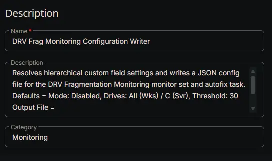

### **Script Editor**

### Row 1 Function: Set Pre-defined Variable ( @endpointLevelMode@ = DRV_Frag_Mode )

- **Notes:** `<Leave it Blank>`
- **Continue on Failure:** `False`
- **Operating System:** `Windows`
- **Variable Name:** `endpointLevelMode`
- **Custom Field:** `DRV_Frag_Mode (DROPDOWN - ENDPOINT)`

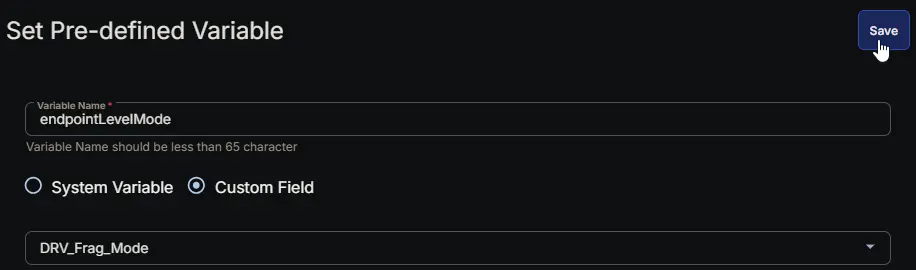

### Row 2 Function: Set Pre-defined Variable ( @endpointLevelDrives@ = DRV_Frag_Drives )

- **Notes:** `<Leave it Blank>`
- **Continue on Failure:** `False`
- **Operating System:** `Windows`
- **Variable Name:** `endpointLevelDrives`
- **Custom Field:** `DRV_Frag_Drives (STRING - ENDPOINT)`

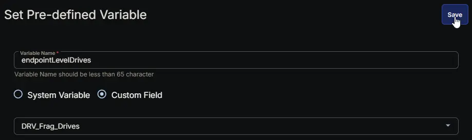

### Row 3 Function: Set Pre-defined Variable ( @endpointLevelThreshold@ = DRV_Frag_Threshold )

- **Notes:** `<Leave it Blank>`
- **Continue on Failure:** `False`
- **Operating System:** `Windows`
- **Variable Name:** `endpointLevelThreshold`
- **Custom Field:** `DRV_Frag_Threshold (STRING - ENDPOINT)`

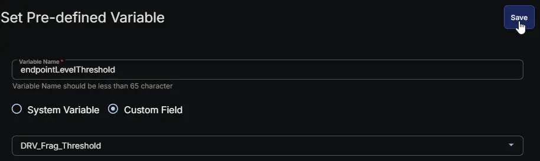

### Row 4 Function: Set Pre-defined Variable ( @locationLevelMode_Wks@ = DRV_Frag_Mode_Wks_Site )

- **Notes:** `<Leave it Blank>`
- **Continue on Failure:** `False`
- **Operating System:** `Windows`
- **Variable Name:** `locationLevelMode_Wks`
- **Custom Field:** `DRV_Frag_Mode_Wks_Site (DROPDOWN - SITE)`

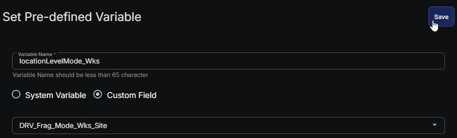

### Row 5 Function: Set Pre-defined Variable ( @locationLevelMode_Svr@ = DRV_Frag_Mode_Svr_Site )

- **Notes:** `<Leave it Blank>`
- **Continue on Failure:** `False`
- **Operating System:** `Windows`
- **Variable Name:** `locationLevelMode_Svr`
- **Custom Field:** `DRV_Frag_Mode_Svr_Site (DROPDOWN - SITE)`

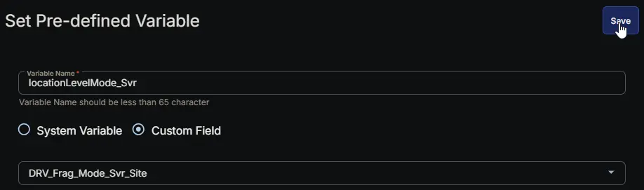

### Row 6 Function: Set Pre-defined Variable ( @locationLevelDrives_Wks@ = DRV_Frag_Drives_Wks_Site )

- **Notes:** `<Leave it Blank>`
- **Continue on Failure:** `False`
- **Operating System:** `Windows`
- **Variable Name:** `locationLevelDrives_Wks`
- **Custom Field:** `DRV_Frag_Drives_Wks_Site (STRING - SITE)`


### Row 7 Function: Set Pre-defined Variable ( @locationLevelDrives_Svr@ = DRV_Frag_Drives_Svr_Site )

- **Notes:** `<Leave it Blank>`
- **Continue on Failure:** `False`
- **Operating System:** `Windows`
- **Variable Name:** `locationLevelDrives_Svr`
- **Custom Field:** `DRV_Frag_Drives_Svr_Site (STRING - SITE)`

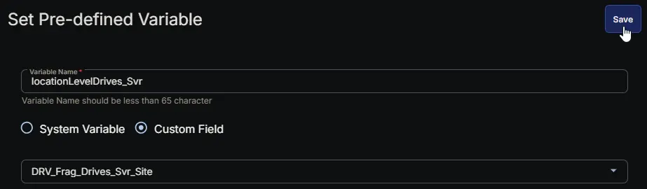

### Row 8 Function: Set Pre-defined Variable ( @locationLevelThreshold_Wks@ = DRV_Frag_Threshold_Wks_Site )

- **Notes:** `<Leave it Blank>`
- **Continue on Failure:** `False`
- **Operating System:** `Windows`
- **Variable Name:** `locationLevelThreshold_Wks`
- **Custom Field:** `DRV_Frag_Threshold_Wks_Site (STRING - SITE)`

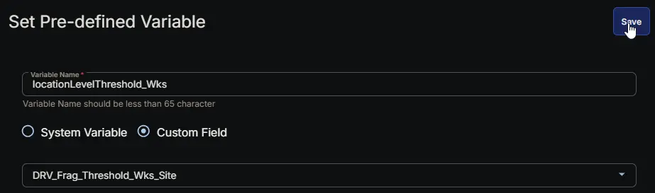

### Row 9 Function: Set Pre-defined Variable ( @locationLevelThreshold_Svr@ = DRV_Frag_Threshold_Svr_Site )

- **Notes:** `<Leave it Blank>`
- **Continue on Failure:** `False`
- **Operating System:** `Windows`
- **Variable Name:** `locationLevelThreshold_Svr`
- **Custom Field:** `DRV_Frag_Threshold_Svr_Site (STRING - SITE)`

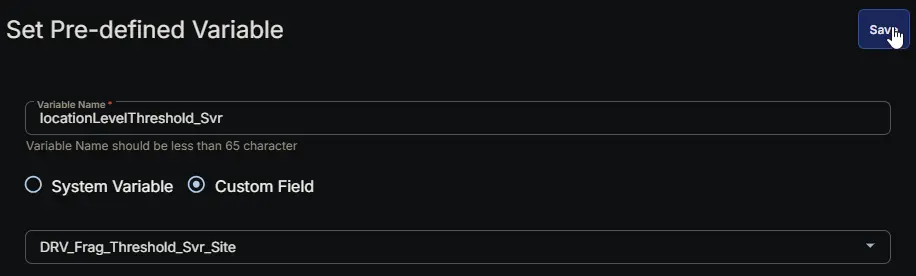

### Row 10 Function: Set Pre-defined Variable ( @clientLevelMode_Wks@ = DRV_Frag_Mode_Wks )

- **Notes:** `<Leave it Blank>`
- **Continue on Failure:** `False`
- **Operating System:** `Windows`
- **Variable Name:** `clientLevelMode_Wks`
- **Custom Field:** `DRV_Frag_Mode_Wks (DROPDOWN - COMPANY)`

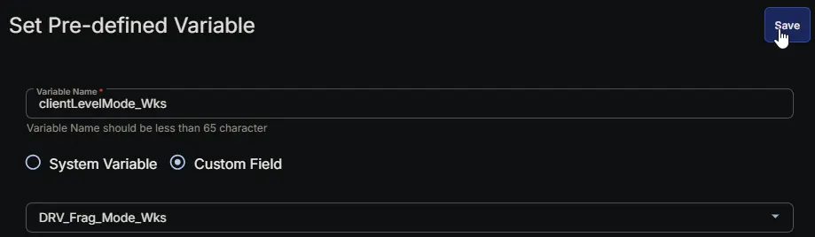

### Row 11 Function: Set Pre-defined Variable ( @clientLevelMode_Svr@ = DRV_Frag_Mode_Svr )

- **Notes:** `<Leave it Blank>`
- **Continue on Failure:** `False`
- **Operating System:** `Windows`
- **Variable Name:** `clientLevelMode_Svr`
- **Custom Field:** `DRV_Frag_Mode_Svr (DROPDOWN - COMPANY)`

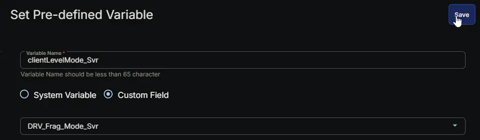

### Row 12 Function: Set Pre-defined Variable ( @clientLevelDrives_Wks@ = DRV_Frag_Drives_Wks )

- **Notes:** `<Leave it Blank>`
- **Continue on Failure:** `False`
- **Operating System:** `Windows`
- **Variable Name:** `clientLevelDrives_Wks`
- **Custom Field:** `DRV_Frag_Drives_Wks (STRING - COMPANY)`


### Row 13 Function: Set Pre-defined Variable ( @clientLevelDrives_Svr@ = DRV_Frag_Drives_Svr )

- **Notes:** `<Leave it Blank>`
- **Continue on Failure:** `False`
- **Operating System:** `Windows`
- **Variable Name:** `clientLevelDrives_Svr`
- **Custom Field:** `DRV_Frag_Drives_Svr (STRING - COMPANY)`


### Row 14 Function: Set Pre-defined Variable ( @clientLevelThreshold_Wks@ = DRV_Frag_Threshold_Wks )

- **Notes:** `<Leave it Blank>`
- **Continue on Failure:** `False`
- **Operating System:** `Windows`
- **Variable Name:** `clientLevelThreshold_Wks`
- **Custom Field:** `DRV_Frag_Threshold_Wks (STRING - COMPANY)`

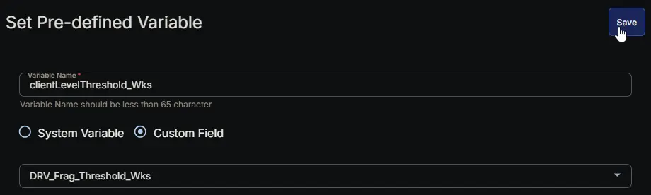

### Row 15 Function: Set Pre-defined Variable ( @clientLevelThreshold_Svr@ = DRV_Frag_Threshold_Svr )

- **Notes:** `<Leave it Blank>`
- **Continue on Failure:** `False`
- **Operating System:** `Windows`
- **Variable Name:** `clientLevelThreshold_Svr`
- **Custom Field:** `DRV_Frag_Threshold_Svr (STRING - COMPANY)`


### Row 16 Function: Set Pre-defined Variable ( @clientLevelTicketMgmtWebhookUrl@ = Ticket_Mgmt_Webhook_Url )

- **Notes:** `<Leave it Blank>`
- **Continue on Failure:** `True`
- **Operating System:** `Windows`
- **Variable Name:** `clientLevelTicketMgmtWebhookUrl`
- **Custom Field:** `Ticket_Mgmt_Webhook_Url (STRING - COMPANY)`

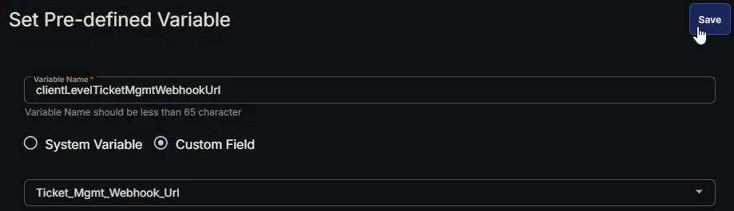

### Row 17 Function: PowerShell script

- **Notes:** `<Leave it Blank>`  
- **Use Generative AI Assist for script creation:** `False`  
- **Expected time of script execution in seconds:** `300`  
- **Continue on Failure:** `False`  
- **Run As:** `System`  
- **Operating System:** `Windows`  
- **PowerShell Script Editor:**

[PowerShell Script](https://github.com/ProVal-Tech/cw-rmm/blob/main/tasks/drv-frag-monitoring-configuration-writer/script.ps1)

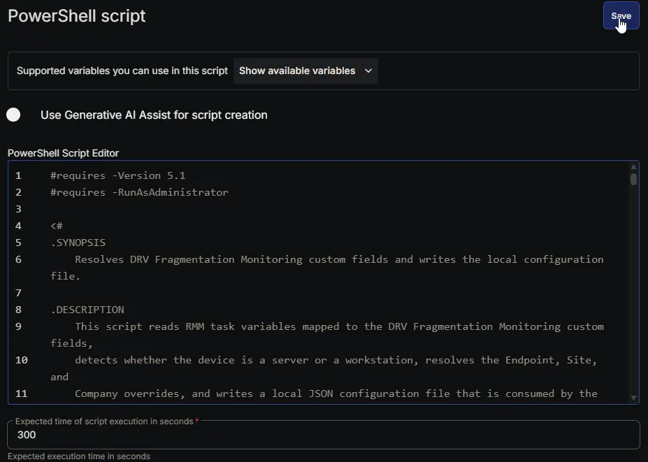

### Row 18 Function: Script Log

- **Notes:** `<Leave it Blank>`  
- **Continue on Failure:** `False`  
- **Operating System:** `Windows`  
- **Script Log Message:** `%Output%`  

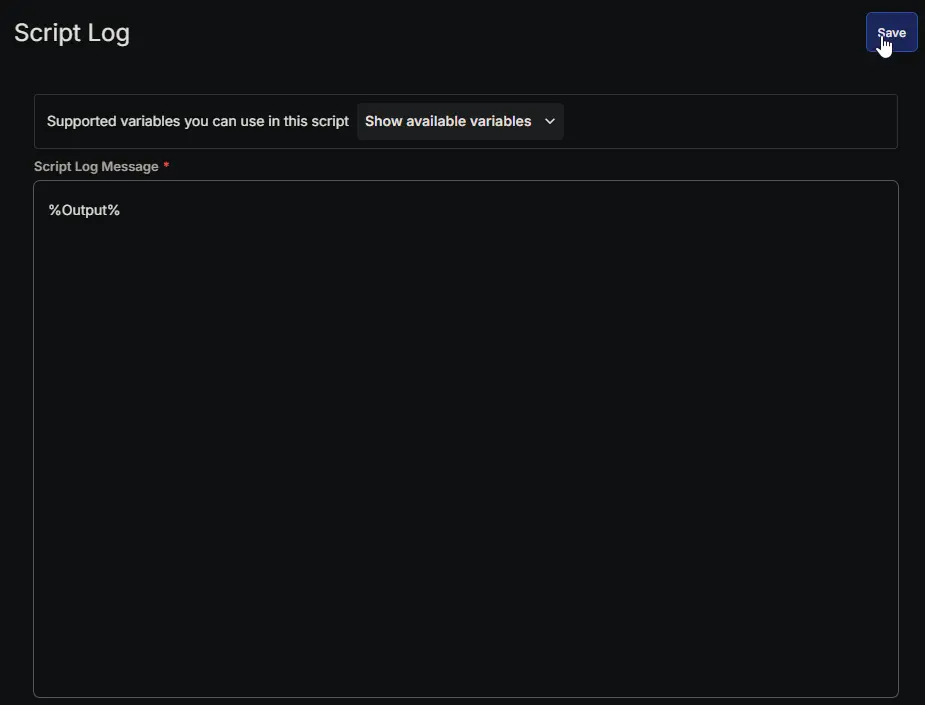

## Completed Task

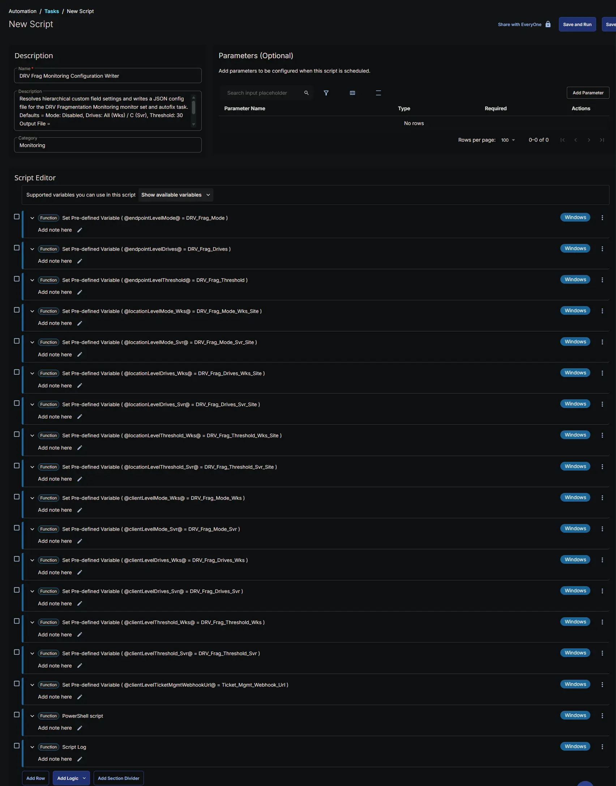

## Output

- Script Log
- JSON File at `C:\ProgramData\_Automation\Script\DRVFragmentationMonitoring\DRVFragmentationMonitoring.json`

## Schedule Task

### Task Details

- **Name:** `DRV Frag Monitoring Configuration Writer`  
- **Description:**

```PlainText
Resolves hierarchical custom field settings and writes a JSON config file for the DRV Fragmentation Monitoring monitor set and autofix task.
Defaults = Mode: Disabled, Drives: All (Wks) / C (Svr), Threshold: 30
Output File = %ProgramData%\_Automation\Script\DRVFragmentationMonitoring\DRVFragmentationMonitoring.json
```

- **Category:** `Monitoring`

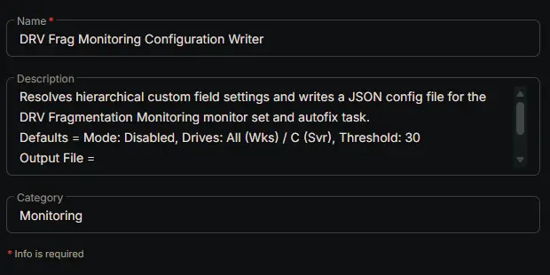

### Schedule

- **Schedule Type:**  `Schedule`  
- **Timezone:** `Local Machine Time`  
- **Start:** `<Current Date>`  
- **Trigger:** `Time` `At` `<Current Time>`  
- **Recurrence:** `Every day`
- **Execute at next agent check-in:** `True`
- **Stop After:** `22`
- **Unit:** `Hour(s)`

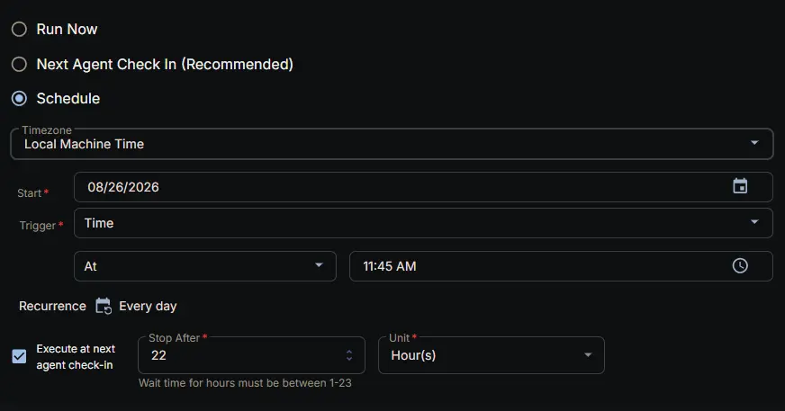

### Targeted Resource

**Device Group:** [DRV Frag Monitoring - Active](/docs/f7b6eeec-bde1-4eb1-ba2f-0a0d42e7dcc7)

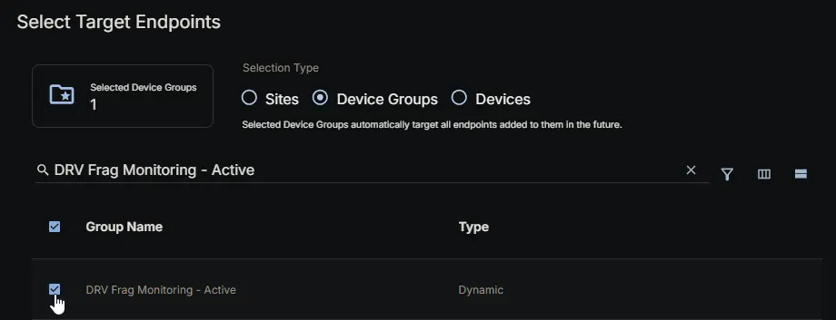

### Completed Scheduled Task

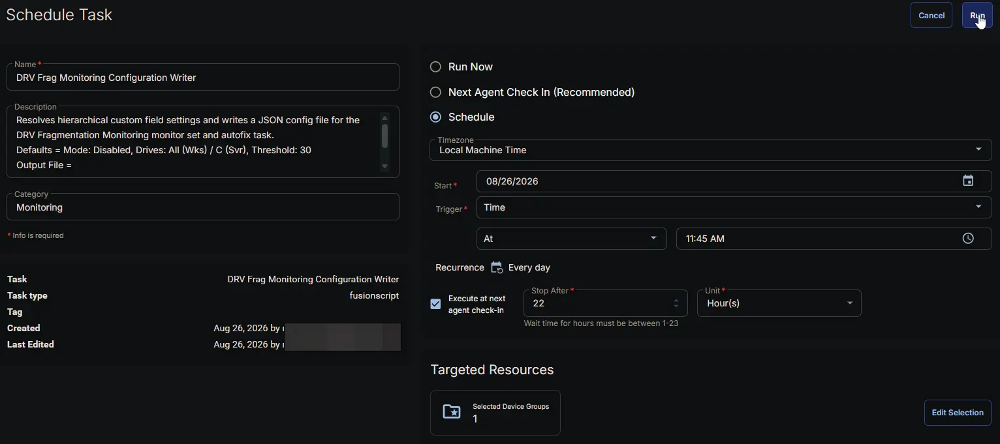

## Changelog

### 2026-08-26

- Initial version of the document
