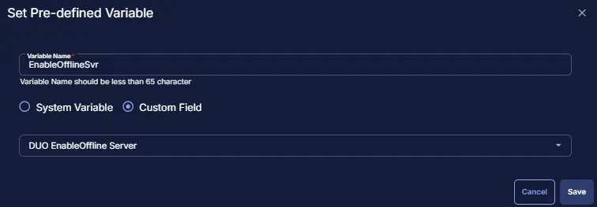
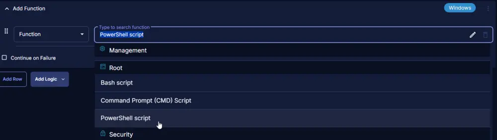

## Summary

This script will install or update DUO if the currently installed instance is older than the latest released version. It matches the hash of the installer from the official website before deploying it. This script downloads the latest installer from [https://dl.duosecurity.com/duo-win-login-latest.exe](https://dl.duosecurity.com/duo-win-login-latest.exe).

## Sample Run

  
  

## Dependencies

[Custom Fields - Duo Authentication for Windows Logon Deployment](/docs/a9578dd1-1f6b-4932-a614-5ed823656416)

## Variables

| Name              | Description                                                                                                         |
|-------------------|---------------------------------------------------------------------------------------------------------------------|
| DUOHost           | Collects the host key for deployment stored in the company custom field "DUO Windows Login Host".                   |
| DUOSKEY           | Collects the Skey for DUO deployment stored in the company custom field "Duo Windows Login SKEY".                  |
| DUOIKEY           | Collects the Ikey for DUO deployment stored in the company custom field "Duo Windows Login IKEY".                  |
| AutopushOvr       | Collects the value stored in the endpoint custom field "DUO Autopush Ovrr".                                       |
| AutopushSvr       | Collects the value stored in the company custom field "DUO Autopush Server".                                       |
| AutopushWks       | Collects the value stored in the company custom field "DUO Autopush Wks".                                         |
| EnableOfflineOvr   | Collects the value stored in the endpoint custom field "DUO EnableOffline Ovrr".                                   |
| EnableOfflineSvr   | Collects the value stored in the company custom field "DUO EnableOffline Server".                                  |
| EnableOfflineWks   | Collects the value stored in the company custom field "DUO EnableOffline Wks".                                     |
| FailOpenOvr       | Collects the value stored in the endpoint custom field "DUO FailOpen Ovrr".                                       |
| FailOpenSvr       | Collects the value stored in the company custom field "DUO FailOpen Server".                                       |
| FailOpenWks       | Collects the value stored in the company custom field "DUO FailOpen Wks".                                         |
| RDPOnlyOvr        | Collects the value stored in the endpoint custom field "DUO RDPOnly Ovrr".                                        |
| RDPOnlySvr        | Collects the value stored in the company custom field "DUO RDPOnly Server".                                       |
| RDPOnlyWks        | Collects the value stored in the company custom field "DUO RDPOnly Wks".                                         |
| SmartCardOvr      | Collects the value stored in the endpoint custom field "DUO SmartCard Ovrr".                                       |
| SmartCardSvr      | Collects the value stored in the company custom field "DUO SmartCard Server".                                       |
| SmartCardWks      | Collects the value stored in the company custom field "DUO SmartCard Wks".                                         |

## Task Creation

Create a new `Script Editor` style script in the system to implement this task.  
  
  

**Name:** `DUO Install & Upgrade - Latest Version`  
**Description:** `This script will install or update DUO if the currently installed instance is older than the latest released version. This script matches the hash of the installer from the official website before deploying it. This script downloads the latest installer from [https://dl.duosecurity.com/duo-win-login-latest.exe](https://dl.duosecurity.com/duo-win-login-latest.exe).`  
**Category:** `Application`  
  

## Task

Navigate to the Script Editor Section and start by adding a row. You can do this by clicking the `Add Row` button at the bottom of the script page.  
  

A blank function will appear.  
  

### Row 1 Function: Set Pre-defined Variable

Search and select the `Set Pre-defined Variable` function.  
  

The following function will pop up on the screen:  
  

- Select the `Custom Field` radio button.
- Set `DUOHost` in the `Variable Name` field.
- Search and select the Client-Level Custom Field `DUO Windows Login Host` from the Custom Field dropdown menu.
- Click the `Save` button.  
  
  

### Row 2 Function: Set Pre-defined Variable

Search and select the `Set Pre-defined Variable` function.  
  

The following function will pop up on the screen:  
  

- Select the `Custom Field` radio button.
- Set `DUOSKEY` in the `Variable Name` field.
- Search and select the Client-Level Custom Field `Duo Windows Login SKEY` from the Custom Field dropdown menu.
- Click the `Save` button.  
  
  

### Row 3 Function: Set Pre-defined Variable

Search and select the `Set Pre-defined Variable` function.  
  

The following function will pop up on the screen:  
  

- Select the `Custom Field` radio button.
- Set `DUOIKEY` in the `Variable Name` field.
- Search and select the Client-Level Custom Field `Duo Windows Login IKEY` from the Custom Field dropdown menu.
- Click the `Save` button.  
  
  

### Row 4 Function: Set Pre-defined Variable

Search and select the `Set Pre-defined Variable` function.  
  

The following function will pop up on the screen:  
  

- Select the `Custom Field` radio button.
- Set `AutopushOvr` in the `Variable Name` field.
- Search and select the Client-Level Custom Field `DUO Autopush Ovrr` from the Custom Field dropdown menu.
- Click the `Save` button.  
  
  

### Row 5 Function: Set Pre-defined Variable

Search and select the `Set Pre-defined Variable` function.  
  

The following function will pop up on the screen:  
  

- Select the `Custom Field` radio button.
- Set `AutopushSvr` in the `Variable Name` field.
- Search and select the Client-Level Custom Field `DUO Autopush Server` from the Custom Field dropdown menu.
- Click the `Save` button.  
  
  

### Row 6 Function: Set Pre-defined Variable

Search and select the `Set Pre-defined Variable` function.  
  

The following function will pop up on the screen:  
  

- Select the `Custom Field` radio button.
- Set `AutopushWks` in the `Variable Name` field.
- Search and select the Client-Level Custom Field `DUO Autopush Wks` from the Custom Field dropdown menu.
- Click the `Save` button.  
  
  

### Row 7 Function: Set Pre-defined Variable

Search and select the `Set Pre-defined Variable` function.  
  

The following function will pop up on the screen:  
  

- Select the `Custom Field` radio button.
- Set `EnableOfflineOvr` in the `Variable Name` field.
- Search and select the Client-Level Custom Field `DUO EnableOffline Ovrr` from the Custom Field dropdown menu.
- Click the `Save` button.  
  
  

### Row 8 Function: Set Pre-defined Variable

Search and select the `Set Pre-defined Variable` function.  
  

The following function will pop up on the screen:  
  

- Select the `Custom Field` radio button.
- Set `EnableOfflineSvr` in the `Variable Name` field.
- Search and select the Client-Level Custom Field `DUO EnableOffline Server` from the Custom Field dropdown menu.
- Click the `Save` button.  
  
  

### Row 9 Function: Set Pre-defined Variable

Search and select the `Set Pre-defined Variable` function.  
  

The following function will pop up on the screen:  
  

- Select the `Custom Field` radio button.
- Set `EnableOfflineWks` in the `Variable Name` field.
- Search and select the Client-Level Custom Field `DUO EnableOffline Wks` from the Custom Field dropdown menu.
- Click the `Save` button.  
  
  

### Row 10 Function: Set Pre-defined Variable

Search and select the `Set Pre-defined Variable` function.  
  

The following function will pop up on the screen:  
  

- Select the `Custom Field` radio button.
- Set `FailOpenOvr` in the `Variable Name` field.
- Search and select the Client-Level Custom Field `DUO FailOpen Ovrr` from the Custom Field dropdown menu.
- Click the `Save` button.  
  
  

### Row 11 Function: Set Pre-defined Variable

Search and select the `Set Pre-defined Variable` function.  
  

The following function will pop up on the screen:  
  

- Select the `Custom Field` radio button.
- Set `FailOpenSvr` in the `Variable Name` field.
- Search and select the Client-Level Custom Field `DUO FailOpen Server` from the Custom Field dropdown menu.
- Click the `Save` button.  
  
  

### Row 12 Function: Set Pre-defined Variable

Search and select the `Set Pre-defined Variable` function.  
  

The following function will pop up on the screen:  
  

- Select the `Custom Field` radio button.
- Set `FailOpenWks` in the `Variable Name` field.
- Search and select the Client-Level Custom Field `DUO FailOpen Wks` from the Custom Field dropdown menu.
- Click the `Save` button.  
  
  

### Row 13 Function: Set Pre-defined Variable

Search and select the `Set Pre-defined Variable` function.  
  

The following function will pop up on the screen:  
  

- Select the `Custom Field` radio button.
- Set `RDPOnlyOvr` in the `Variable Name` field.
- Search and select the Client-Level Custom Field `DUO RDPOnly Ovrr` from the Custom Field dropdown menu.
- Click the `Save` button.  
  
  

### Row 14 Function: Set Pre-defined Variable

Search and select the `Set Pre-defined Variable` function.  
  

The following function will pop up on the screen:  
  

- Select the `Custom Field` radio button.
- Set `RDPOnlySvr` in the `Variable Name` field.
- Search and select the Client-Level Custom Field `DUO RDPOnly Server` from the Custom Field dropdown menu.
- Click the `Save` button.  
  
  

### Row 15 Function: Set Pre-defined Variable

Search and select the `Set Pre-defined Variable` function.  
  

The following function will pop up on the screen:  
  

- Select the `Custom Field` radio button.
- Set `RDPOnlyWks` in the `Variable Name` field.
- Search and select the Client-Level Custom Field `DUO RDPOnly Wks` from the Custom Field dropdown menu.
- Click the `Save` button.  
  
  

### Row 16 Function: Set Pre-defined Variable

Search and select the `Set Pre-defined Variable` function.  
  

The following function will pop up on the screen:  
  

- Select the `Custom Field` radio button.
- Set `SmartCardOvr` in the `Variable Name` field.
- Search and select the Client-Level Custom Field `DUO SmartCard Ovrr` from the Custom Field dropdown menu.
- Click the `Save` button.  
  
  

### Row 17 Function: Set Pre-defined Variable

Search and select the `Set Pre-defined Variable` function.  
  

The following function will pop up on the screen:  
  

- Select the `Custom Field` radio button.
- Set `SmartCardSvr` in the `Variable Name` field.
- Search and select the Client-Level Custom Field `DUO SmartCard Server` from the Custom Field dropdown menu.
- Click the `Save` button.  
  
  

### Row 18 Function: Set Pre-defined Variable

Search and select the `Set Pre-defined Variable` function.  
  

The following function will pop up on the screen:  
  

- Select the `Custom Field` radio button.
- Set `SmartCardWks` in the `Variable Name` field.
- Search and select the Client-Level Custom Field `DUO SmartCard Wks` from the Custom Field dropdown menu.
- Click the `Save` button.  
  
  

### Row 19 Function: PowerShell Script

Add a new row by clicking the `Add Row` button.  
  

Search and select the `PowerShell Script` function.  
  

The following function will pop up on the screen:  
  

Paste in the following PowerShell script and set the `Expected time of script execution in seconds` to `900` seconds. Click the `Save` button.

```PowerShell
$Osinfo = (Get-CimInstance -ClassName Win32_OperatingSystem).caption
$AutopushOvr = '@AutopushOvr@'
$AutopushSvr = '@AutopushSvr@'
$AutopushWks = '@AutopushWks@'
$EnableOfflineOvr = '@EnableOfflineOvr@'
$EnableOfflineSvr = '@EnableOfflineSvr@'
$EnableOfflineWks = '@EnableOfflineWks@'
$FailOpenOvr = '@FailOpenOvr@'
$FailOpenSvr = '@FailOpenSvr@'
$FailOpenWks = '@FailOpenWks@'
$RDPOnlyOvr = '@RDPOnlyOvr@'
$RDPOnlySvr = '@RDPOnlySvr@'
$RDPOnlyWks = '@RDPOnlyWks@'
$SmartCardOvr = '@SmartCardOvr@'
$SmartCardSvr = '@SmartCardSvr@'
$SmartCardWks = '@SmartCardWks@'
$DUOHost = '@DUOHost@'
$DUOIKEY = '@DUOIKEY@'
$DUOSKEY = '@DUOSKEY@'

if ($DUOHost -eq '' -or $DUOHost -match '@DUOHost') {
    return 'ERROR: DUO Host missing.'
}
if ($DUOIKEY -eq '' -or $DUOIKEY -match '@DUOIKEY') {
    return 'ERROR: DUO Host missing.'
}
if ($DUOSKEY -eq '' -or $DUOSKEY -match '@DUOSKEY') {
    return 'ERROR: DUO Host missing.'
}
$Arguments = @()
if ($AutopushOvr -eq 'Yes' -or ($AutopushSvr -eq 'Yes' -and $Osinfo -match 'Server') -or ($AutopushWks -eq 'Yes' -and $Osinfo -match 'Windows 10|11')) {
    $Arguments += 'AUTOPUSH="#1"'
}
if ($FailOpenOvr -eq 'Yes' -or ($FailOpenSvr -eq 'Yes' -and $Osinfo -match 'Server') -or ($FailOpenWks -eq 'Yes' -and $Osinfo -match 'Windows 10|11')) {
    $Arguments += 'FAILOPEN="#1"'
}
if ($SmartCardOvr -eq 'Yes' -or ($SmartCardSvr -eq 'Yes' -and $Osinfo -match 'Server') -or ($SmartCardWks -eq 'Yes' -and $Osinfo -match 'Windows 10|11')) {
    $Arguments += 'SMARTCARD="#1"'
}
if ($RDPOnlyOvr -eq 'Yes' -or ($RDPOnlySvr -eq 'Yes' -and $Osinfo -match 'Server') -or ($RDPOnlyWks -eq 'Yes' -and $Osinfo -match 'Windows 10|11')) {
    $Arguments += 'RDPONLY="#1"'
}
if ($EnableOfflineOvr -eq 'Yes' -or ($EnableOfflineSvr -eq 'Yes' -and $Osinfo -match 'Server') -or ($EnableOfflineWks -eq 'Yes' -and $Osinfo -match 'Windows 10|11')) {
    $Arguments += 'ENABLEOFFLINE="#1"'
}
$ArgumentsString = $Arguments -join ' '
$ProgressPreference = 'SilentlyContinue'
[Net.ServicePointManager]::SecurityProtocol = [Enum]::ToObject([Net.SecurityProtocolType], 3072)
$Content = Invoke-WebRequest https://dl.duosecurity.com/duo-win-login-latest.exe -UseBasicParsing -method Head
$Content.RawContent -match '(duo[\-a-z0-9\.]*?\.exe)' | Out-Null
$DuoFilename = $Matches[1]
if ($DuoFilename -match '(duo[\-a-z0-9\.]*?\.exe)') {
    Write-Output "$DuoFilename"
}
else {
    return 'ERROR: URL has an issue'
}
$RawHash = Invoke-WebRequest https://duo.com/docs/checksums#duo-windows-logon -UseBasicParsing
$RawHash -match "([a-z0-9]{64}) +$DuoFilename" | Out-Null 
$DuoRawHash = $Matches[1]    
    
#region Setup - Variables
$URL = 'https://dl.duosecurity.com/duo-win-login-latest.exe'
$WorkingDirectory = 'C:\ProgramData\_Automation\Script\DuoAuth'
$Path = "$WorkingDirectory\DuoInstaller.exe"
#endregion
#region Setup - Folder Structure
if ( !(Test-Path $WorkingDirectory) ) {
    try {
        New-Item -Path $WorkingDirectory -ItemType Directory -Force -ErrorAction Stop | Out-Null
    }
    catch {
        return "ERROR: Failed to Create $WorkingDirectory. Reason: $($Error[0].Exception.Message)"
    }
} if (-not ( ( ( Get-Acl $WorkingDirectory ).Access | Where-Object { $_.IdentityReference -Match 'EveryOne' } ).FileSystemRights -Match 'FullControl' ) ) {
    $ACl = Get-Acl $WorkingDirectory
    $AccessRule = New-Object System.Security.AccessControl.FileSystemAccessRule('Everyone', 'FullControl', 'ContainerInherit, ObjectInherit', 'none', 'Allow')
    $Acl.AddAccessRule($AccessRule)
    Set-Acl $WorkingDirectory $Acl
}
#region write script
$response = Invoke-WebRequest -Uri $URL -OutFile $Path -UseBasicParsing
if (!(Test-Path -Path $Path)) {
    return 'ERROR: An error occurred and the script was unable to be downloaded. Exiting.'
}
#endregion
$DuoVersion = (Get-ItemProperty "$Path").VersionInfo.FileVersion
$CurrentHash = (Get-FileHash -Path $Path -Algorithm SHA256).Hash
If ($DuoRawHash -eq $CurrentHash) {
    $DUOCurrentVersion = Get-ChildItem -Path HKLM:\SOFTWARE\Microsoft\Windows\CurrentVersion\Uninstall, HKLM:\SOFTWARE\Wow6432Node\Microsoft\Windows\CurrentVersion\Uninstall | Get-ItemProperty | Where-Object { $_.DisplayName -match 'Duo Authentication for Windows Logon' } | Select-Object -ExpandProperty DisplayVersion
    if ($DuoVersion -eq $DUOCurrentVersion) {
        return 'DUO Windows for login is already up to date.'
    }
    elseif ($DUOCurrentVersion -match '[0-9]') {
        Start-Process -FilePath $Path -ArgumentList "/S /V`" REBOOT=ReallySuppress /qn IKEY=`"$DUOIKEY`" SKEY=`"$DUOSKEY`" HOST=`"$DUOHost`" $ArgumentsString`"" -Wait -WindowStyle Hidden
        Start-Sleep -Seconds 30
        $DUOCurrentVersion = Get-ChildItem -Path HKLM:\SOFTWARE\Microsoft\Windows\CurrentVersion\Uninstall, HKLM:\SOFTWARE\Wow6432Node\Microsoft\Windows\CurrentVersion\Uninstall | Get-ItemProperty | Where-Object { $_.DisplayName -match 'Duo Authentication for Windows Logon' } | Select-Object -ExpandProperty DisplayVersion
        if ($DuoVersion -eq $DUOCurrentVersion) {
            Write-Output 'Duo Authentication for Windows Logon is successfully updated.'
        }
        else {
            return 'ERROR: Duo Authentication for Windows Logon failed to update.'
        }
    }
    else {
        Start-Process -FilePath $Path -ArgumentList "/S /V`" REBOOT=ReallySuppress /qn IKEY=`"$DUOIKEY`" SKEY=`"$DUOSKEY`" HOST=`"$DUOHost`" $ArgumentsString`"" -Wait -WindowStyle Hidden
        Start-Sleep -Seconds 30
        $DUOCurrentVersion = Get-ChildItem -Path HKLM:\SOFTWARE\Microsoft\Windows\CurrentVersion\Uninstall, HKLM:\SOFTWARE\Wow6432Node\Microsoft\Windows\CurrentVersion\Uninstall | Get-ItemProperty | Where-Object { $_.DisplayName -match 'Duo Authentication for Windows Logon' } | Select-Object -ExpandProperty DisplayVersion
        if ($DuoVersion -eq $DUOCurrentVersion) {
            Write-Output 'Duo Authentication for Windows Logon is successfully installed.'
        }
        else {
            return 'ERROR: Duo Authentication for Windows Logon failed to install.'
        }
    }
}
else {
    return 'ERROR: DUO Installer hash failed to match'
}
```

  

## Row 20 Logic: If/Then

Add a new `If/Then/Else` logic from the Add Logic dropdown menu.  
  

### Row 20a Condition: Output Contains

Type `ERROR:` in the Value box.  
  

### Row 20b Function: Set Custom Field

Add a new row by clicking the `Add Row` button.  
  

Search and select the `Set Custom Field` function.  
  

The following function will pop up on the screen:  
  

- Search and select the Computer-Level Custom Field `DUO Deployment Result` from the Custom Field dropdown menu.
- Set `Failed` in the `Value` field.  
- Click the `Save` button.  
  
  

### Row 20c Function: Script Exit

Add a new row by clicking the `Add Row` button.  
  

Search and select the `Script Exit` function.  
  

The following function will pop up on the screen:  
  

In the script exit message, simply type  
```
Failed to install the DUO Authentication for Windows Login application. Refer to the logs:
%Output%
```
and click the `Save` button.  
  

## Row 21 Function: Script Log

Add a new row by clicking the `Add Row` button.  
  

A blank function will appear.  
  

Search and select the `Script Log` function.  
  

The following function will pop up on the screen:  
  

In the script log message, type  

```PlainText
Successfully installed the DUO Authentication for Windows Login application. Refer to the logs:
%Output%
```
and click the `Save` button.  
  

## Row 22 Function: Set Custom Field

Add a new row by clicking the `Add Row` button.  
  

Search and select the `Set Custom Field` function.  
  

The following function will pop up on the screen:  
  

- Search and select the Computer-Level Custom Field `DUO Deployment Result` from the Custom Field dropdown menu.
- Set `Success` in the `Value` field.  
- Click the `Save` button.  
  
  

## Row 23 Function: Script Exit

Add a new row by clicking the `Add Row` button.  
  

Search and select the `Script Exit` function.  
  

The following function will pop up on the screen:  
  

In the script exit message, leave it blank  
and click the `Save` button.  
  

## Completed Task

  
  

## Implementation

It is suggested to run the task once per week against the group `DUO Auth for Windows Login Deployment`.  

- Go to `Automation` > `Tasks`.
- Search for `DUO Install & Upgrade - Latest Version` Task.
- Select the concerned task.
- Click on `Schedule` to schedule the task/script.  
  

This screen will appear.  
  

- Select the `Schedule` button and click the calendar-looking button present in front of the `Recurrence` option.  
  

- Select the `Month(s)` for the `Repeat`, `1` for `Dates`, and click the `OK` button to save the schedule.  
  

- Click the `Select Targets` button to select the concerned target.  
  

- Search and select the [`Duo Auth for Windows Login Deployment`](/docs/c598c18f-25a9-43fd-a7b6-86e8f186c38b) Device Group for the target.  
  

- Click the `Run` button to initiate the schedule.  
  

## Output

Custom Field  
  

Script Log  
