## Summary

This document initializes TPM as part of the provisioning process for a Trusted Platform Module (TPM). Provisioning is the process of preparing a TPM for use. This guide covers the CW RMM implementation of [Enable TPM](/docs/aa0c7575-d9f1-4c41-98bb-50eab8aa1ade).

## Sample Run

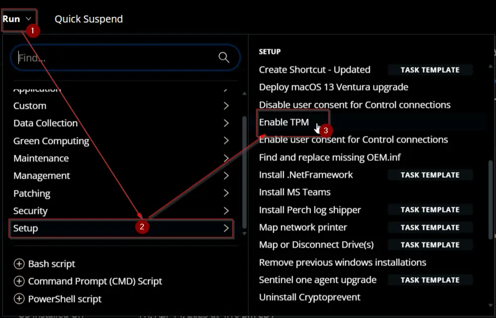  
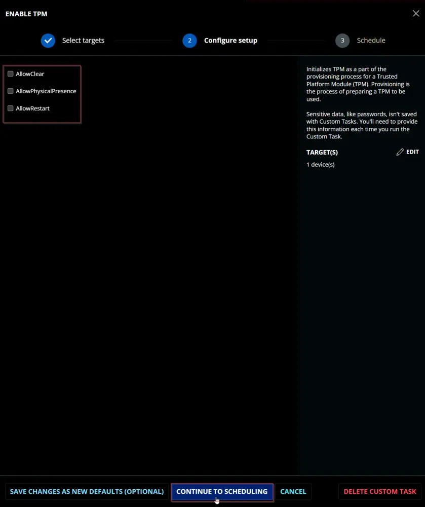  
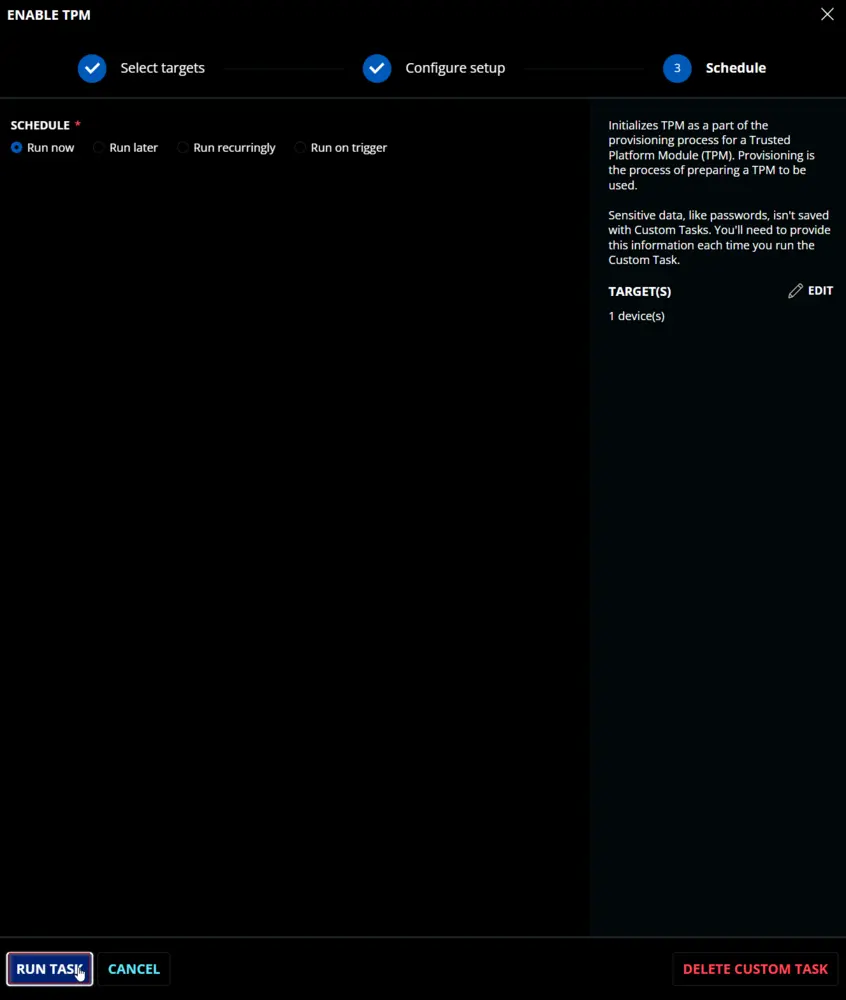  

## Dependencies

[SEC - Encryption - Script - Bitlocker - Enable TPM](/docs/aa0c7575-d9f1-4c41-98bb-50eab8aa1ade)

## User Parameters

| Name                      | Example | Required | Type | Description |
|---------------------------|---------|----------|------|-------------|
| `AllowClear`              | 0/1     | False    | Flag | Indicates that the provisioning process clears the TPM, if necessary, to move the TPM closer to complying with the latest Windows standards. |
| `AllowPhysicalPresence`   | 0/1     | False    | Flag | Indicates that the provisioning process may send physical presence commands that require a user to be present in order to continue. |
| `AllowRestart`            | 0/1     | False    | Flag | Allows the script to automatically restart or shut down the machine. This can happen during the initialization of TPM. |

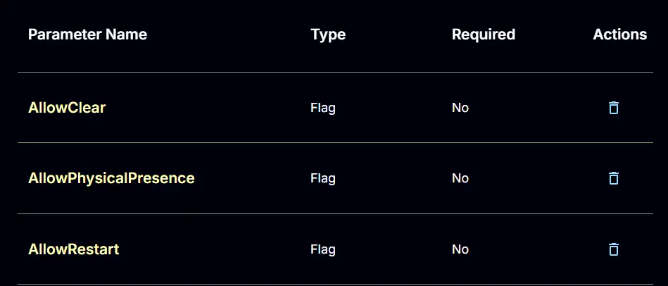  

## Task Creation

Create a new `Script Editor` style script in the system to implement this task.  
  
  

**Name:** `Enable TPM`  
**Description:** `Initializes TPM as part of the provisioning process for a Trusted Platform Module (TPM). Provisioning is the process of preparing a TPM for use.`  
**Category:** `Setup`  
  

## Parameters

### AllowClear:

Add a new parameter by clicking the `Add Parameter` button present at the top-right corner of the screen.  
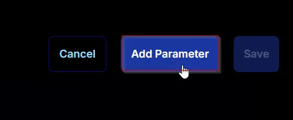  

This screen will appear.  
  

- Set `AllowClear` in the `Parameter Name` field.
- Select `Flag` from the `Parameter Type` dropdown menu.
- Click the `Save` button.  
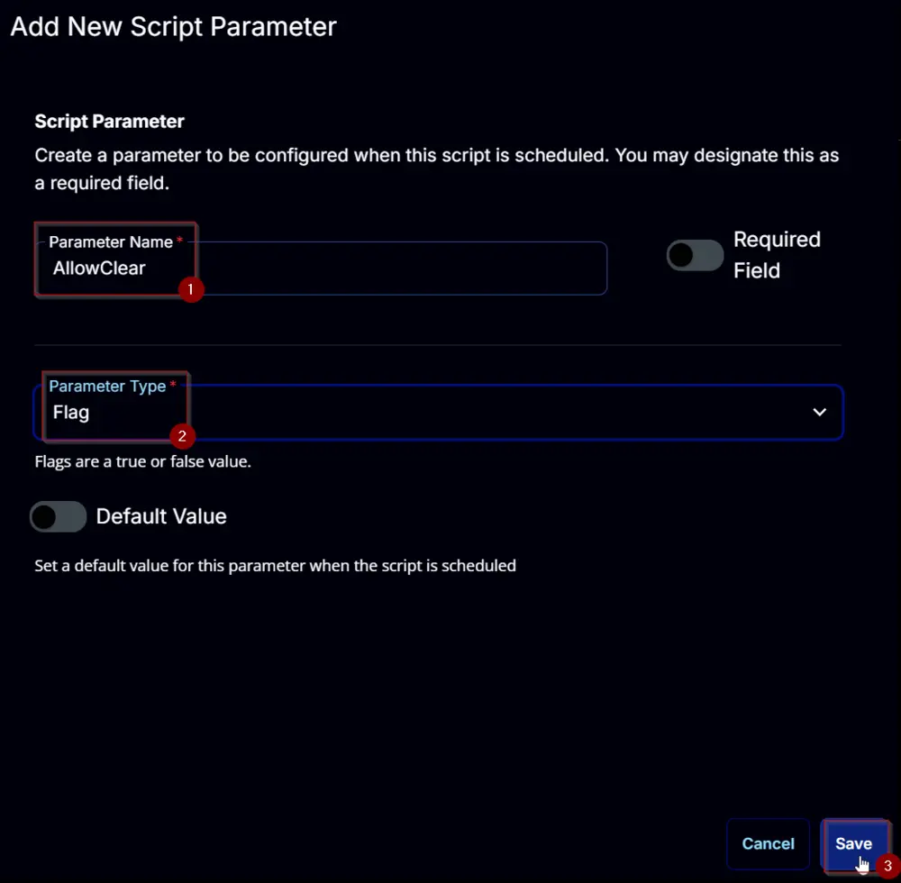  

### AllowPhysicalPresence:

Add a new parameter by clicking the `Add Parameter` button present at the top-right corner of the screen.  
  

This screen will appear.  
  

- Set `AllowPhysicalPresence` in the `Parameter Name` field.
- Select `Flag` from the `Parameter Type` dropdown menu.
- Click the `Save` button.  
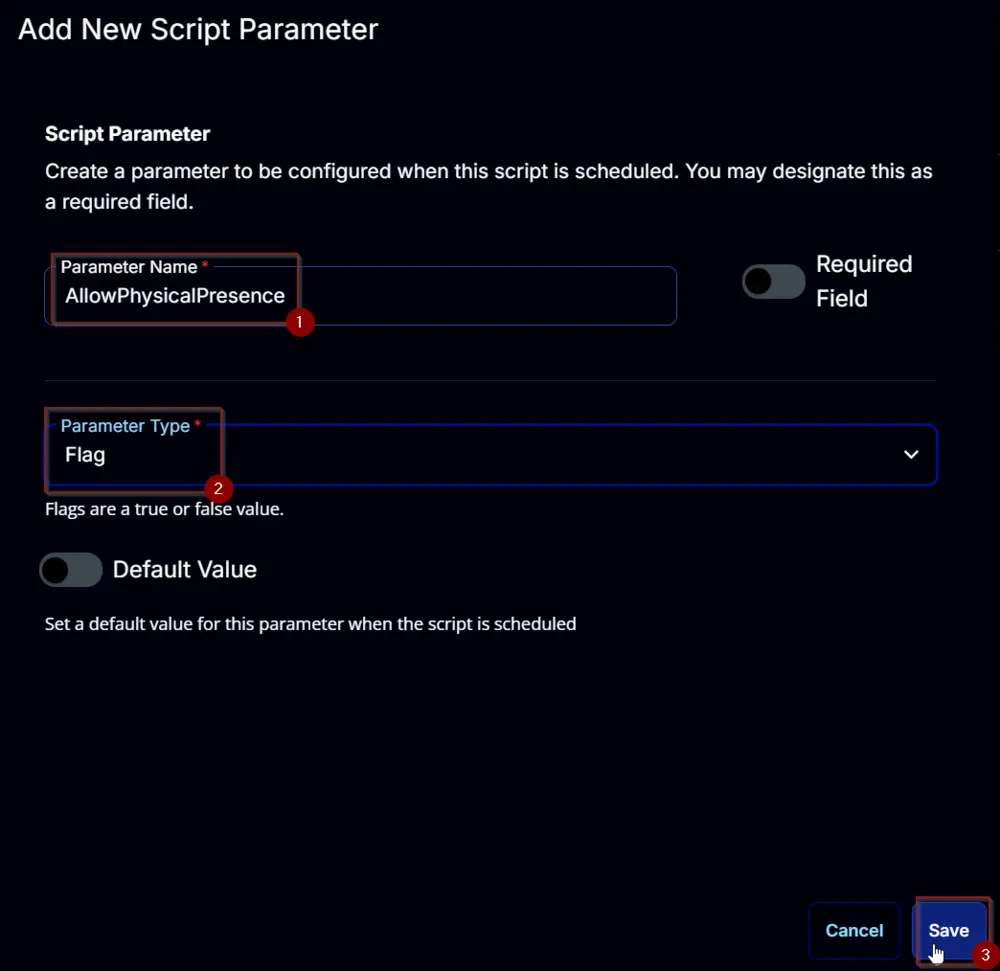  

### AllowRestart:

Add a new parameter by clicking the `Add Parameter` button present at the top-right corner of the screen.  
  

This screen will appear.  
  

- Set `AllowRestart` in the `Parameter Name` field.
- Select `Flag` from the `Parameter Type` dropdown menu.
- Click the `Save` button.  
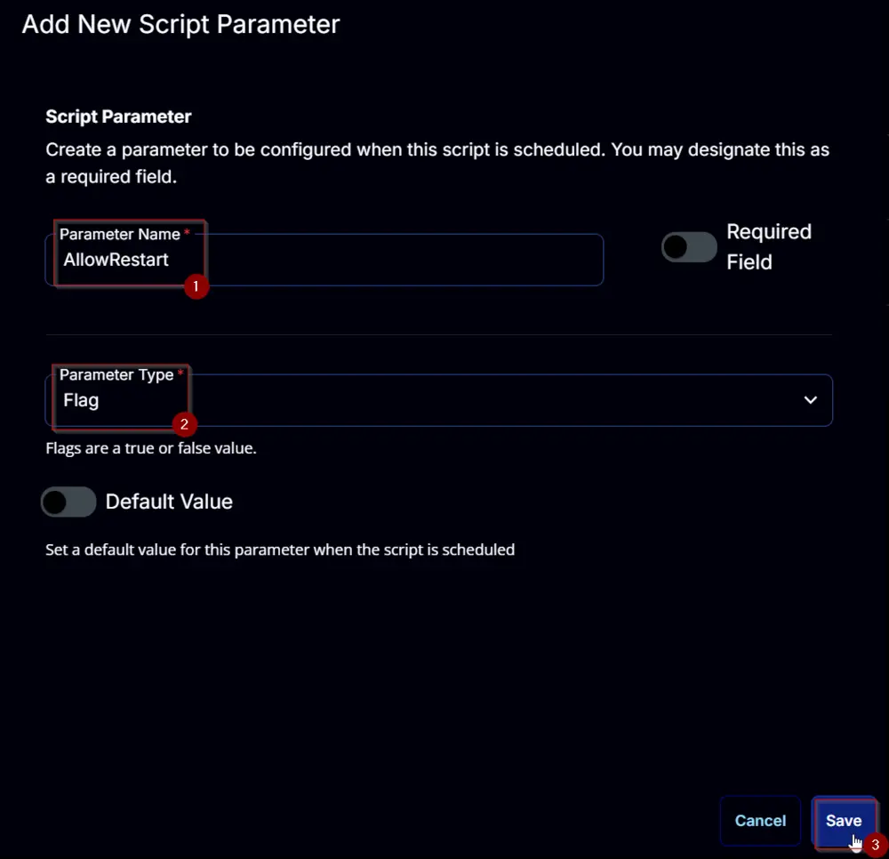  

## Task

Navigate to the Script Editor section and start by adding a row. You can do this by clicking the `Add Row` button at the bottom of the script page.  
  

A blank function will appear.  
  

### Row 1 Function: PowerShell Script

Search and select the `PowerShell Script` function.  
  
  

The following function will pop up on the screen:  
  

Paste in the following PowerShell script and set the `Expected time of script execution in seconds` to `300` seconds. Click the `Save` button.

```powershell
#region parameters
$AllowClear = '@AllowClear@'
$AllowPhysicalPresence = '@AllowPhysicalPresence@'
$AllowRestart = '@AllowRestart@'

$Parameters = @{}

if ( $AllowClear -match '1|Yes|True' ) {
    $Parameters.Add('AllowClear', $true)
}
if ( $AllowPhysicalPresence -match '1|Yes|True' ) {
    $Parameters.Add('AllowPhysicalPresence', $true)
}
if ( $AllowRestart -match '1|Yes|True' ) {
    $Parameters.Add('AllowRestart', $true)
}

#region Setup - Variables
$ProjectName = 'Enable-TPM'
[Net.ServicePointManager]::SecurityProtocol = [enum]::ToObject([Net.SecurityProtocolType], 3072)
$BaseURL = 'https://file.provaltech.com/repo'
$PS1URL = "$BaseURL/script/$ProjectName.ps1"
$WorkingDirectory = "C:/ProgramData/_automation/script/$ProjectName"
$PS1Path = "$WorkingDirectory/$ProjectName.ps1"
$Workingpath = $WorkingDirectory
$LogPath = "$WorkingDirectory/$ProjectName-log.txt"
$ErrorLogPath = "$WorkingDirectory/$ProjectName-Error.txt"
#endregion

#region Setup - Folder Structure
New-Item -Path $WorkingDirectory -ItemType Directory -ErrorAction SilentlyContinue | Out-Null
$response = Invoke-WebRequest -Uri $PS1URL -UseBasicParsing
if (($response.StatusCode -ne 200) -and (!(Test-Path -Path $PS1Path))) {
    throw "No pre-downloaded script exists and the script '$PS1URL' failed to download. Exiting."
} elseif ($response.StatusCode -eq 200) {
    Remove-Item -Path $PS1Path -ErrorAction SilentlyContinue
    [System.IO.File]::WriteAllLines($PS1Path, $response.Content)
}
if (!(Test-Path -Path $PS1Path)) {
    throw 'An error occurred and the script was unable to be downloaded. Exiting.'
}
#endregion

#region Execution
if ($Parameters) {
    & $PS1Path @Parameters
} else {
    & $PS1Path
}
#endregion

if ( !(Test-Path $LogPath) ) {
    throw 'PowerShell Failure. A Security application seems to have restricted the execution of the PowerShell Script.'
}
if ( Test-Path $ErrorLogPath ) {
    $ErrorContent = ( Get-Content -Path $ErrorLogPath )
    throw $ErrorContent
}
Get-Content -Path $LogPath
```

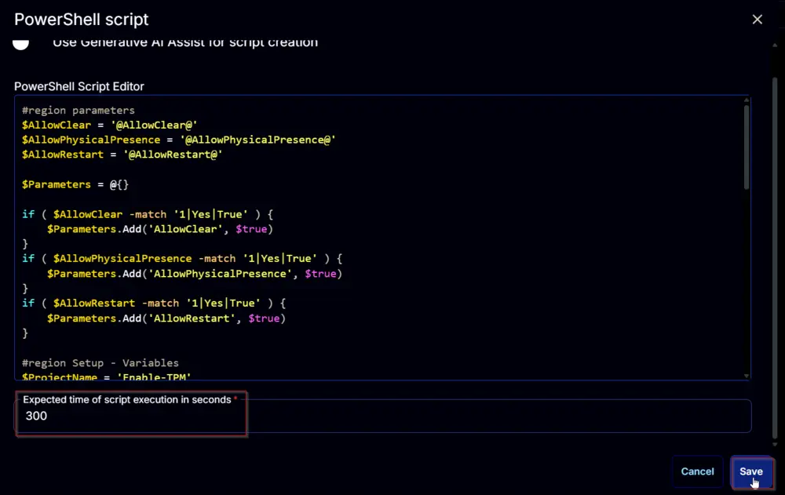  

### Row 2 Function: Script Log

Add a new row by clicking the `Add Row` button.  
  

A blank function will appear.  
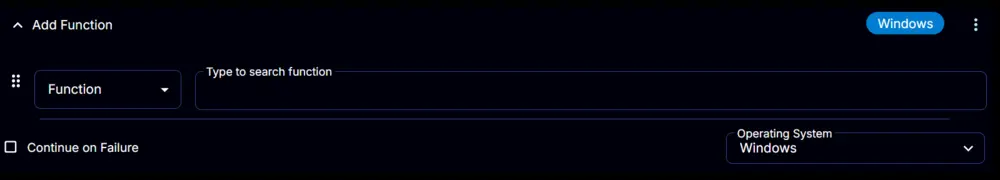  

Search and select the `Script Log` function.  
  

The following function will pop up on the screen:  
  

In the script log message, simply type `%Output%` and click the `Save` button.  
  

Click the `Save` button at the top-right corner of the screen to save the script.  
  

## Completed Script

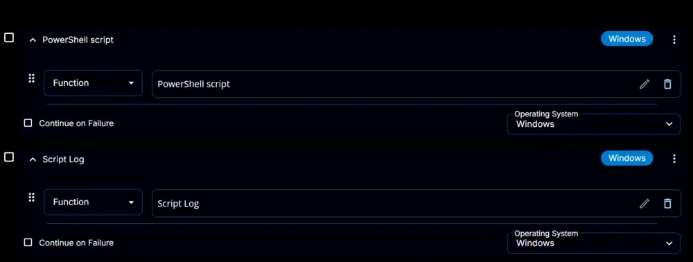  

## Output

- Script Log  
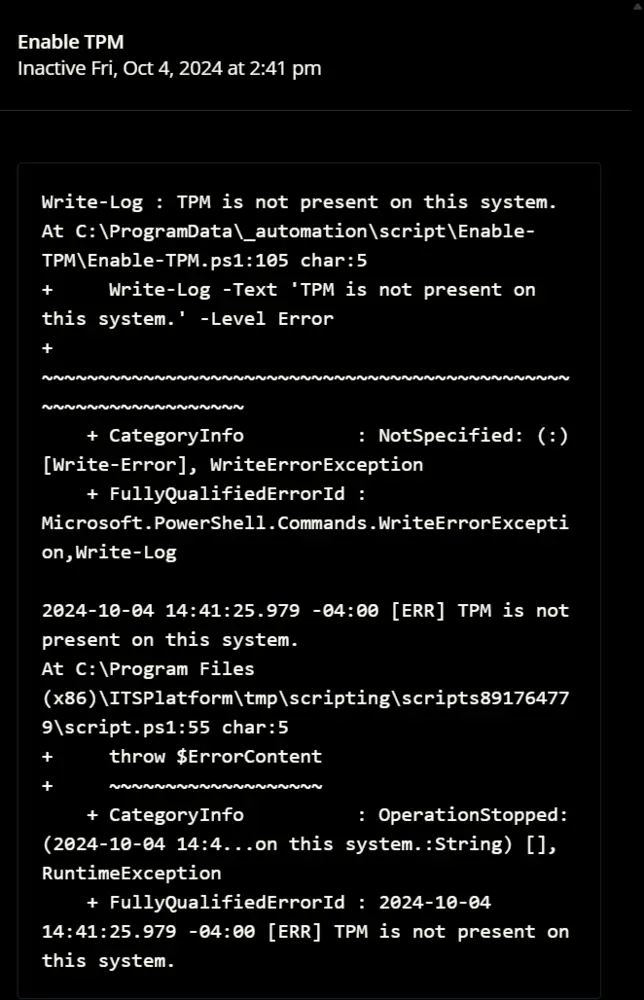  
