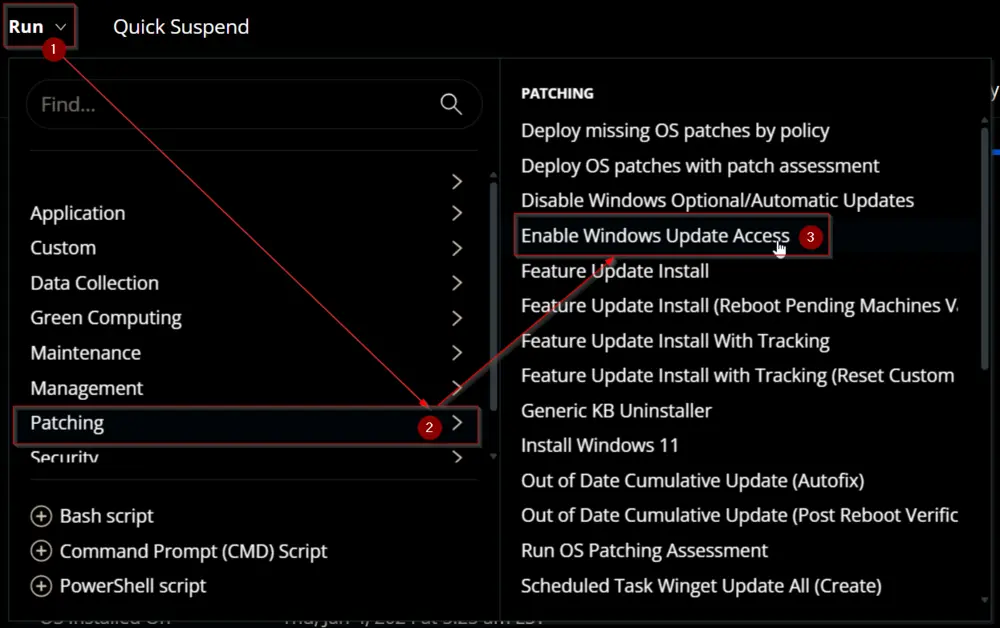
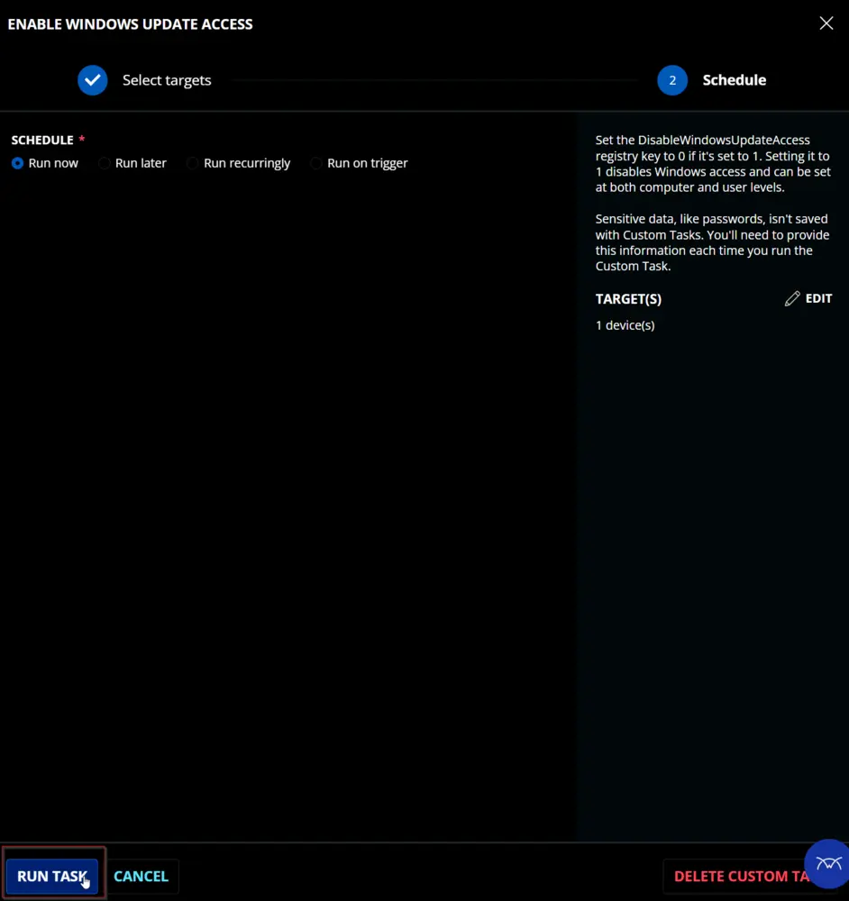
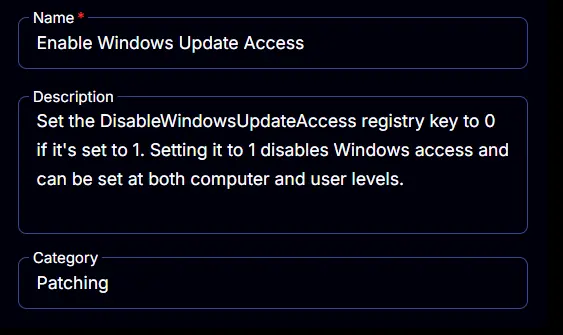
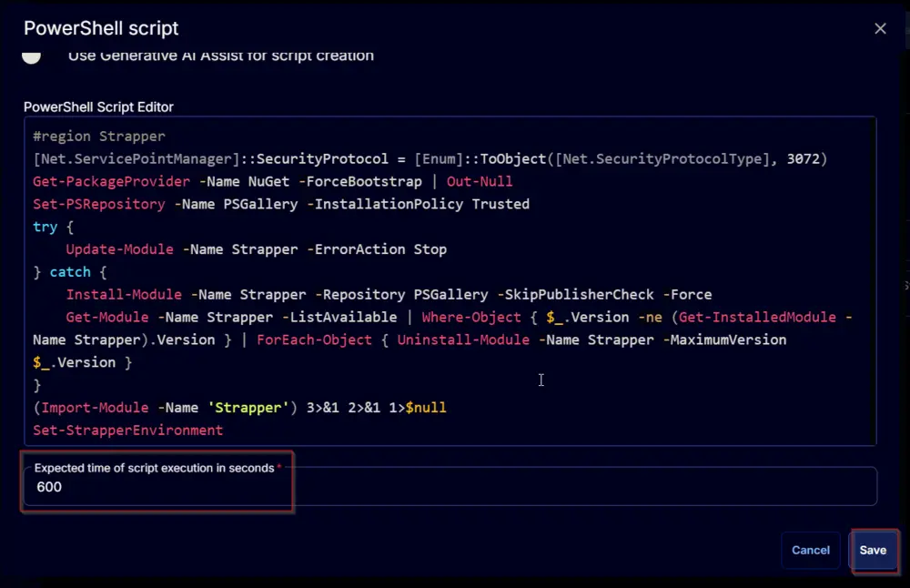

## Summary

The script will overwrite the `DisableWindowsUpdateAccess` registry key if it's set at the computer or user level. This ensures that Windows update access is not disabled for the machine, users, or the system account.

## Sample Run

  
  

## Task Creation

Create a new `Script Editor` style script in the system to implement this task.  
  
  

**Name:** Enable Windows Update Access  
**Description:** Set the DisableWindowsUpdateAccess registry key to 0 if it's set to 1. Setting it to 1 disables Windows access and can be set at both computer and user levels.  
**Category:** Patching  
  

## Task

Navigate to the Script Editor section and start by adding a row. You can do this by clicking the `Add Row` button at the bottom of the script page.  
  

A blank function will appear.  
  

### Row 1 Function: PowerShell Script

Search and select the `PowerShell Script` function.  
  
  

The following function will pop up on the screen:  
  

Paste in the following PowerShell script and set the expected time of script execution to `600` seconds. Click the `Save` button.

[PowerShell Script](https://github.com/ProVal-Tech/cw-rmm/blob/main/tasks/enable-windows-update-access/script.ps1)

  

### Row 2 Function: Script Log

Add a new row by clicking the `Add Row` button.  
  

A blank function will appear.  
  

Search and select the `Script Log` function.  
  
  

The following function will pop up on the screen:  
  

In the script log message, simply type `%output%` and click the `Save` button.  
  

Click the `Save` button at the top-right corner of the screen to save the script.  
  

## Completed Task

  

## Output

- Script log

## Changelog

### 2025-04-10

- Initial version of the document

