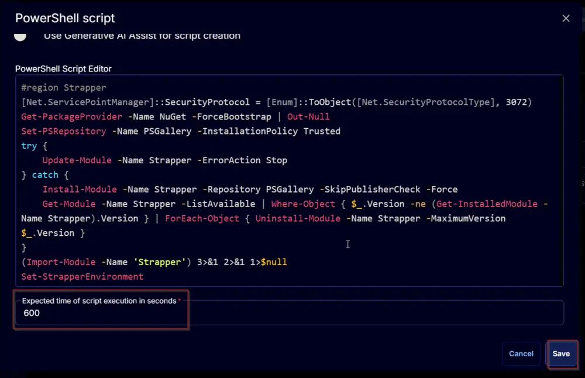

## Summary

The script will overwrite the `DisableWindowsUpdateAccess` registry key if it's set at the computer or user level. This ensures that Windows update access is not disabled for the machine, users, or the system account.

## Sample Run

  
  

## Task Creation

Create a new `Script Editor` style script in the system to implement this task.  
  
  

**Name:** Enable Windows Update Access  
**Description:** Set the DisableWindowsUpdateAccess registry key to 0 if it's set to 1. Setting it to 1 disables Windows access and can be set at both computer and user levels.  
**Category:** Patching  
  

## Task

Navigate to the Script Editor section and start by adding a row. You can do this by clicking the `Add Row` button at the bottom of the script page.  
  

A blank function will appear.  
  

### Row 1 Function: PowerShell Script

Search and select the `PowerShell Script` function.  
  
  

The following function will pop up on the screen:  
  

Paste in the following PowerShell script and set the expected time of script execution to `600` seconds. Click the `Save` button.

```powershell
#region Strapper
$ProgressPreference = 'SilentlyContinue'
[Net.ServicePointManager]::SecurityProtocol = [Enum]::ToObject([Net.SecurityProtocolType], 3072)
Get-PackageProvider -Name NuGet -ForceBootstrap | Out-Null
Set-PSRepository -Name PSGallery -InstallationPolicy Trusted
try {
    Update-Module -Name Strapper -ErrorAction Stop
} catch {
    Install-Module -Name Strapper -Repository PSGallery -SkipPublisherCheck -Force
    Get-Module -Name Strapper -ListAvailable | Where-Object { $_.Version -ne (Get-InstalledModule -Name Strapper).Version } | ForEach-Object { Uninstall-Module -Name Strapper -MaximumVersion $_.Version }
}
(Import-Module -Name 'Strapper') 3>&1 2>&1 1>$null
Set-StrapperEnvironment
#endregion
```

```powershell
# Overwriting Disabled Windows Access for System Account
$pathArray = @(
    'Registry::HKEY_USERS\\S-1-5-18\\Software\\Policies\\Microsoft\\Windows\\WindowsUpdate',
    'Registry::HKEY_USERS\\S-1-5-18\\Software\\Policies\\Microsoft\\Windows\\WindowsUpdate\\AU',
    'Registry::HKEY_USERS\\S-1-5-18\\Software\\Microsoft\\Windows\\CurrentVersion\\Policies\\WindowsUpdate',
    'Registry::HKEY_USERS\\S-1-5-18\\Software\\Microsoft\\Windows\\CurrentVersion\\Policies\\WindowsUpdate\\AU'
)
foreach ($path in $pathArray) {
    if ((Get-ItemProperty -Path $path -ErrorAction SilentlyContinue).DisableWindowsUpdateAccess -ge 1) {
        Write-Output 'Enabling Windows Update Access to the System Account.'
        try {
            if (!(Test-Path $path)) {
                New-Item -Path $path -Force -Confirm:$false -ErrorAction Stop | Out-Null
            }
            Set-ItemProperty -Path $path -Name DisableWindowsUpdateAccess -Value 0 -Force -ErrorAction Stop
        } catch {
            throw "Failed to enable Windows Update Access for the system account. Reason: $($Error[0].Exception.Message)"
        }
    }
}
```

```powershell
# Overwriting Disabled Windows Access for Computer
$pathArray = @(
    'HKLM:\\Software\\Policies\\Microsoft\\Windows\\WindowsUpdate',
    'HKLM:\\Software\\Policies\\Microsoft\\Windows\\WindowsUpdate\\AU',
    'HKLM:\\Software\\Microsoft\\Windows\\CurrentVersion\\Policies\\WindowsUpdate',
    'HKLM:\\Software\\Microsoft\\Windows\\CurrentVersion\\Policies\\WindowsUpdate\\AU'
)
foreach ($path in $pathArray) {
    if ((Get-ItemProperty -Path $path -ErrorAction SilentlyContinue).DisableWindowsUpdateAccess -ge 1) {
        Write-Output 'Enabling Windows Update Access to the Computer.'
        try {
            Set-RegistryKeyProperty -Path $path -Name DisableWindowsUpdateAccess -Value 0 -Force -ErrorAction Stop
        } catch {
            throw "Failed to enable Windows Update Access for the computer. Reason: $($Error[0].Exception.Message)"
        }
    }
}
```

```powershell
# Overwriting Disabled Windows Access for Users
$pathArray = @(
    'Software\\Policies\\Microsoft\\Windows\\WindowsUpdate',
    'Software\\Policies\\Microsoft\\Windows\\WindowsUpdate\\AU',
    'Software\\Microsoft\\Windows\\CurrentVersion\\Policies\\WindowsUpdate',
    'Software\\Microsoft\\Windows\\CurrentVersion\\Policies\\WindowsUpdate\\AU'
)
foreach ($path in $pathArray) {
    if (Get-UserRegistryKeyProperty -Path $Path -Name DisableWindowsUpdateAccess -ErrorAction SilentlyContinue | Where-Object { $_.Value -ge 1 }) {
        Set-UserRegistryKeyProperty -Path $path -Name DisableWindowsUpdateAccess -Value 0 -Force -ErrorAction SilentlyContinue -WarningAction SilentlyContinue
        $failedUsers = Get-UserRegistryKeyProperty -Path $Path -Name DisableWindowsUpdateAccess -ErrorAction SilentlyContinue | Where-Object { $_.Value -ge 1 }
        if ($failedUsers) {
            throw "Failed to enable Windows Update Access for the Users. $($failedUsers -join ', ')"
        }
    }
}
```

  

### Row 2 Function: Script Log

Add a new row by clicking the `Add Row` button.  
  

A blank function will appear.  
  

Search and select the `Script Log` function.  
  
  

The following function will pop up on the screen:  
  

In the script log message, simply type `%output%` and click the `Save` button.  
  

Click the `Save` button at the top-right corner of the screen to save the script.  
  

## Completed Task

  

## Output

- Script log