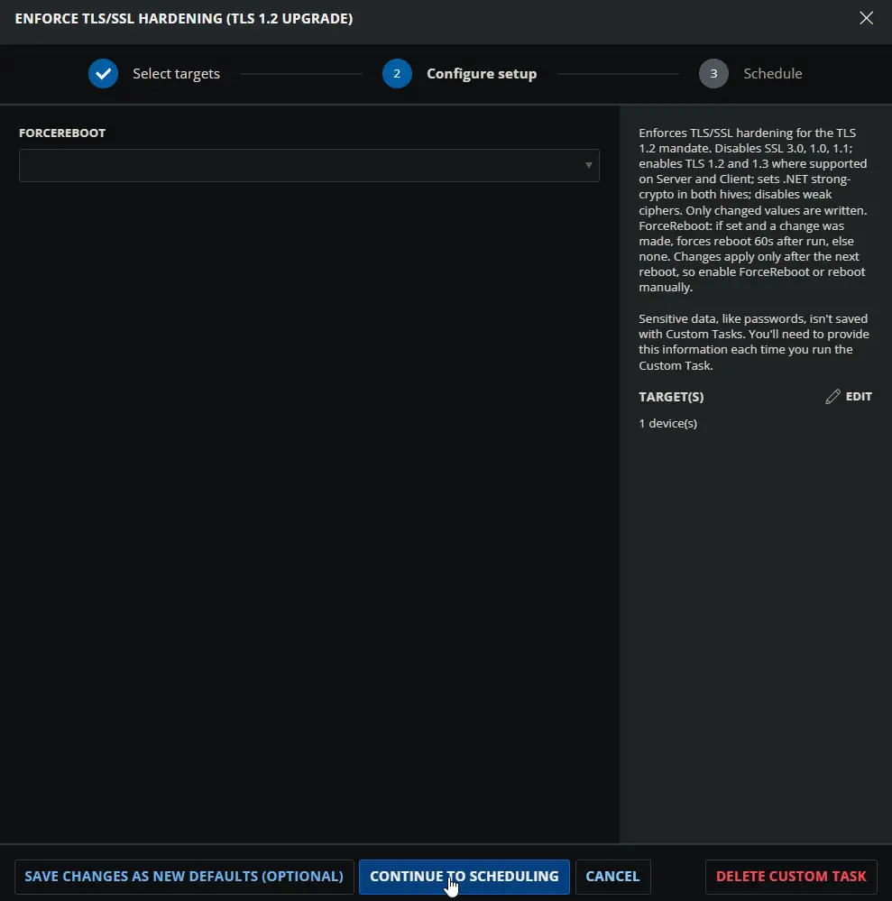
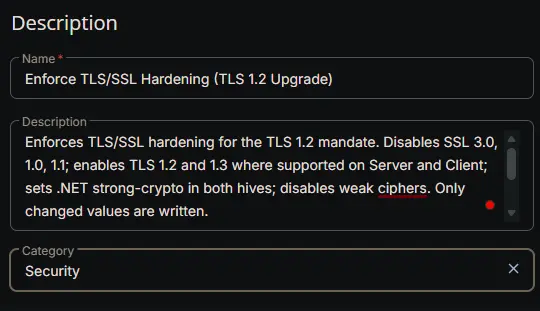
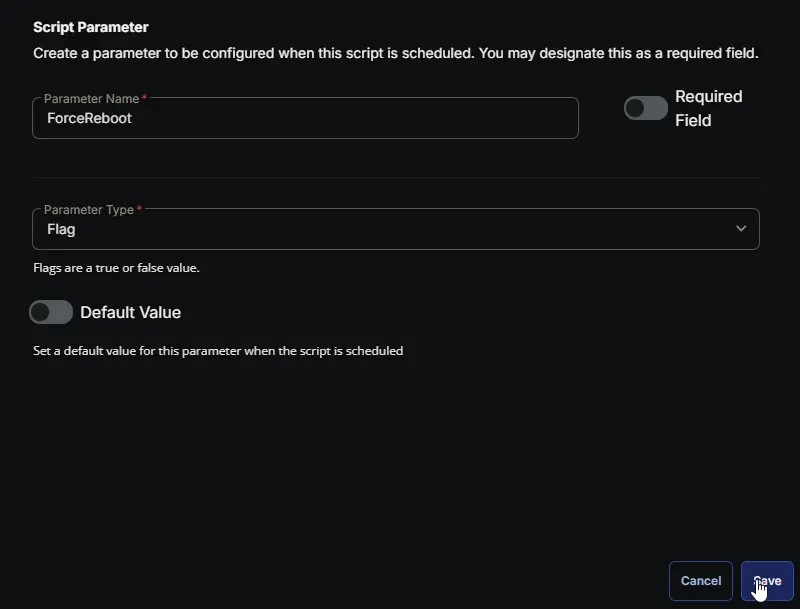
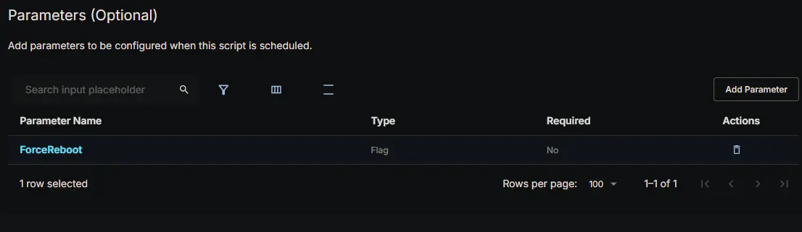
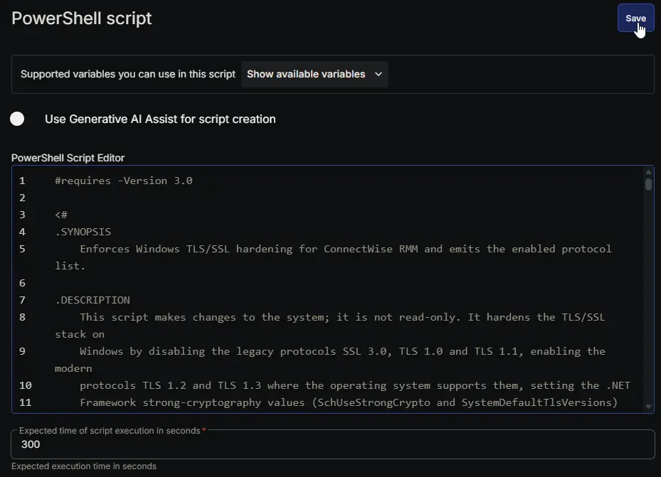
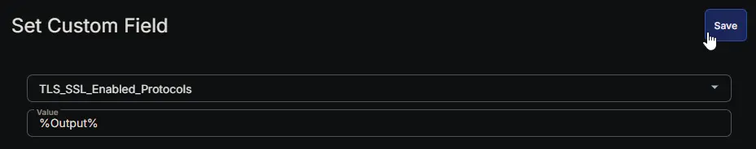
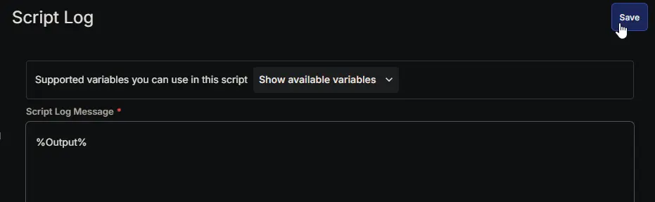
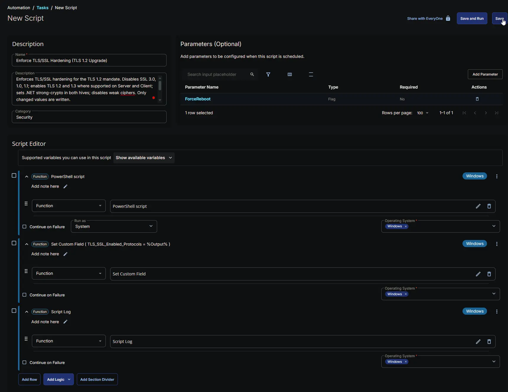

---
id: '79112007-ac74-4fde-97f5-59d56dbe0282'
slug: /79112007-ac74-4fde-97f5-59d56dbe0282
title: 'Enforce TLS/SSL Hardening (TLS 1.2 Upgrade)'
title_meta: 'Enforce TLS/SSL Hardening (TLS 1.2 Upgrade)'
keywords: ['tls','ssl','disable','enable','security-hardening','tls-1.2']
description: 'Enforces Windows TLS/SSL hardening for ConnectWise RMM and emits the enabled protocol list.'
tags: ['tls','windows']
draft: false
unlisted: false
last_update:
  date: 2026-07-28
---

## Summary

This task strengthens the secure-connection settings on a Windows device so it meets the platform's TLS 1.2 requirement and can keep communicating with our services reliably. In plain terms, it switches off the old, insecure ways of connecting (SSL 3.0, TLS 1.0 and TLS 1.1), switches on the modern, supported ways (TLS 1.2, and TLS 1.3 on devices that support it), tightens the underlying Windows and .NET security options, and removes a small set of weak encryption methods. When it finishes, it records the list of protocols that are now enabled on the device in the [TLS_SSL_Enabled_Protocols](/docs/a90fed7d-ec54-429a-a7cf-14a1af8870bb) custom field, so you can see at a glance what each machine is using.

We provide this task because the platform is retiring the older protocols. A device that is not configured for TLS 1.2 may stop talking to our data centres after the regional rollout dates, so this task is the supported way to bring a device into compliance and to keep its connections secure. It is built to be safe and repeatable: it only touches settings that are not already correct, so running it again on a device that is already compliant changes nothing and causes no disruption. It is normally launched automatically by the paired compliance monitor whenever a device is found to need it, but it can also be run on demand.

A few things to keep in mind before it runs:

- It makes real changes to system security settings and runs with system-level rights, so treat it as a maintenance action rather than a read-only check.
- On very old operating systems (Windows Server 2008, Windows Server 2008 R2 and earlier) the modern TLS 1.2 protocol cannot be switched on, because the operating system simply does not support it. On those systems this task will still switch the old protocols off, which is the right thing for security, but it also means that after a reboot the device may have no supported protocol left and could lose connectivity. For those machines the required step is an operating-system upgrade, not this task, so please confirm the upgrade path before running it there.
- On supported systems (Windows Server 2012 and newer, and Windows 8 and newer) the task switches TLS 1.2 on, and TLS 1.3 where available, at the same time, so connectivity is preserved.

About the reboot - please read this carefully, because it controls when the changes actually take effect:

- The new settings are saved to the device straight away, but Windows only loads them at start-up. Until the device is rebooted it keeps using the previous connection settings, so the hardening is not yet active in the running system.
- The task has a `ForceReboot` option. When this option is enabled and the task actually changed at least one setting, it schedules a forced reboot about 60 seconds after it finishes, so the new settings take effect without any further action. If the task changed nothing because the device was already compliant, it will not reboot, even with `ForceReboot` enabled, so a routine re-run will never restart a machine by surprise.
- When `ForceReboot` is left disabled, the task does not reboot the device. The settings stay saved but inactive until the device is rebooted some other way, so you should plan a reboot during a maintenance window to make the hardening live.
- Because the compliance monitor reads the saved settings rather than the in-memory state, a device can appear compliant before it has been rebooted. That is expected; the reboot is still required for the new protocol and encryption settings to actually be in use.

In short: run this task to bring a device into TLS 1.2 compliance, plan for a reboot (either through `ForceReboot` or a scheduled restart) so the changes take effect, and on the oldest operating systems confirm the operating-system upgrade path first, since the task cannot enable TLS 1.2 where the system does not support it.

## Sample Run



## Dependencies

- [Custom Field: TLS_SSL_Enabled_Protocols](/docs/a90fed7d-ec54-429a-a7cf-14a1af8870bb)
- [Solution: TLS/SSL Security Hardening](/docs/13ac3912-863b-41fe-bb61-dfd681f06fa8)

## Custom Fields

| Name | Example | Level | Type | Default Value | Description |
| --- | --- | --- | --- | --- | --- |
| [TLS_SSL_Enabled_Protocols](/docs/a90fed7d-ec54-429a-a7cf-14a1af8870bb) | `TLS 1.2, TLS 1.3` | `Endpoint` | `Text Box` | | Comma-separated list of TLS/SSL protocol versions currently enabled on the device |

## User Parameters

| Name | Required | Type | Default Value | Description |
| ---- | -------- | ---- | ------------- | ----------- |
| ForceReboot | No | Flag | | If set and a change was made, forces reboot 60s after run, else none. Changes apply only after the next reboot, so enable ForceReboot or reboot manually. |

## Task Setup Path

- **Tasks Path:** `AUTOMATION` ➞ `Tasks`  
- **Task Type:** `Script Editor`  

## Task Creation

### **Description**

- **Name:** `Enforce TLS/SSL Hardening (TLS 1.2 Upgrade)`  
- **Description:**

```PlainText
Enforces TLS/SSL hardening for the TLS 1.2 mandate. Disables SSL 3.0, 1.0, 1.1; enables TLS 1.2 and 1.3 where supported on Server and Client; sets .NET strong-crypto in both hives; disables weak ciphers. Only changed values are written. 
ForceReboot: if set and a change was made, forces reboot 60s after run, else none. Changes apply only after the next reboot, so enable ForceReboot or reboot manually.
```

- **Category:** `Security`



### **Parameters**

| Parameter Name | Required Field | Parameter Type | Default Value |
| -------------- | -------------- | -------------- | ------------- |
| ForceReboot | Disabled | Flag | Disabled |

**ForceReboot:**  
    



### **Script Editor**

#### Row 1 Function: PowerShell script

- **Notes:** `<Leave it Blank>`  
- **Use Generative AI Assist for script creation:** `False`  
- **Expected time of script execution in seconds:** `300`  
- **Continue on Failure:** `False`  
- **Run As:** `System`  
- **Operating System:** `Windows`  
- **PowerShell Script Editor:**

[PowerShell Script](https://github.com/ProVal-Tech/cw-rmm/blob/main/tasks/enforce-tls-ssl-hardening/script.ps1)




#### Row 2 Function: Set Custom Field ( TLS_SSL_Enabled_Protocols = %Output% )

- **Notes:** `<Leave it Blank>`  
- **Continue on Failure:** `False`  
- **Operating System:** `Windows`  
- **Custom Field:** `TLS_SSL_Enabled_Protocols`  
- **Value:** `%Output%`



#### Row 3 Function: Script Log

- **Notes:** `<Leave it Blank>`  
- **Continue on Failure:** `False`  
- **Operating System:** `Windows`  
- **Script Log Message:** `%Output%`  



## Completed Task



## Output

- Script Log
- Custom Field

## Changelog

### 2026-07-28

- Initial version of the document

