## Summary

The Enhanced Drive Space Monitoring Configuration Writer is a preparation task that builds the local monitoring configuration consumed by the Enhanced Drive Space Monitoring monitor set(s). It does **not** perform any drive space monitoring itself. Instead, it reads the threshold values you define in ConnectWise RMM custom fields — together with the ConnectWise ticketing webhook URL — and writes a structured JSON file that the deployed monitor set reads every time it runs. Two monitor‑set variants share this file: the original [Enhanced Drive Space Monitoring](/docs/70d7b9fd-8311-4470-9e7a-674cf577d371) set, which uses the monitor's built‑in ticketing, and the optional [Enhanced Drive Space Monitoring [Workflow]](/docs/2c9dd7bc-f5aa-48c2-be76-1348e13cda07) set, which delegates ticketing to the ConnectWise workflow. The webhook URL written into the file is consumed **only** by the [Workflow] variant; the original set ignores it.

### How it works

1. **Custom Fields Evaluation**  
   The script reads drive space thresholds (per capacity bucket) and drive inclusion/exclusion lists from custom fields at the Company, Site, and Endpoint levels. It follows a strict priority order: **Endpoint → Site → Company**. If a value is set at the Endpoint level, that value is used. If not, the Site level is checked, then the Company level. If no value is set at any level, sensible defaults are applied. In the same pass it also reads the company-level [Ticket_Mgmt_Webhook_Url](/docs/8e55deb6-bef8-4501-9e64-7b25e7fcd1ab) field, which holds the webhook URL of the [CWRMM ticketing workflow](/docs/57daa951-2acc-4be7-a025-0d0ca729ef57). Unlike the threshold and drive-list fields, this URL is read at the **Company level only** — there is no Site/Endpoint override and no `_Svr` / `_Wks` server/workstation split — because it represents a single, global webhook endpoint shared by every device. The value is stored purely so the [Workflow] monitor‑set variant can reach the workflow; the original monitor set never reads it.

2. **Server & Workstation Separation**  
   The script automatically detects whether the endpoint is a Windows Server or Workstation and applies the correct set of Company/Site fields (`_Svr` or `_Wks` suffix) for the thresholds and drive lists. (The webhook URL is unaffected by this detection — it is the same company-level value on both.) This allows you to set different thresholds for servers and workstations without duplicating scripts.

3. **Configuration File Generation**  
   Once the final values are resolved, the script writes a JSON configuration file to the endpoint:

   ```plaintext
   C:\ProgramData\_Automation\Script\EnhancedDriveSpaceMonitoring\EnhancedDriveSpaceMonitoring.json
   ```

   The file contains:
   - **Thresholds** – an array of capacity buckets (16–300 GB, 300–1024 GB, 1024–4096 GB, 4096+ GB), each with a numeric value and unit (% , MB, or GB).
   - **IncludeDrives** – a string specifying which drive letters to monitor (`All`, `None`, or a string like `CDEF`).
   - **ExcludeDrives** – a string specifying which drive letters to ignore (`None`, `All`, or letters like `Z`).
   - **TicketWebhookUrl** – the ConnectWise ticketing webhook URL resolved from `Ticket_Mgmt_Webhook_Url`, written verbatim so the [Enhanced Drive Space Monitoring [Workflow]](/docs/2c9dd7bc-f5aa-48c2-be76-1348e13cda07) monitor set can POST `Create` / `Close` / `Comment` payloads to the workflow. The original monitor set ignores this key. If the company field is empty or its RMM token fails to resolve, a hard-coded placeholder (`https://webhook.myconnectwise.net/REPLACE_WITH_YOUR_DEFAULT_WEBHOOK_URL`) is written instead.

> In the samples below, `https://webhook.myconnectwise.net/...` is documentation shorthand for the real instance URL you paste into the company field; the script writes whatever string is stored there verbatim, with no validation of the URL itself.

### Sample Scenario 1: Using Default Values

No *threshold or drive-list* custom fields are configured at any level, so the script uses the built‑in defaults for those: 10% for 16–300 GB drives, 30 GB for 300–1024 GB drives, 50 GB for 1024–4096 GB drives, 100 GB for 4096+ GB drives, include all drives, exclude none. The company-level `Ticket_Mgmt_Webhook_Url` field is assumed to be set, because it is a mandatory prerequisite for the [Workflow] monitor‑set variant (see the Custom Fields notes).

The resulting configuration file would be:

```json
{
    "Thresholds": [
        { "Bucket": "16To300", "Value": 10, "Unit": "Percent" },
        { "Bucket": "300To1024", "Value": 30, "Unit": "GB" },
        { "Bucket": "1024To4096", "Value": 50, "Unit": "GB" },
        { "Bucket": "4096Plus", "Value": 100, "Unit": "GB" }
    ],
    "IncludeDrives": "All",
    "ExcludeDrives": "None",
    "TicketWebhookUrl": "https://webhook.myconnectwise.net/..."
}
```

### Sample Scenario 2: Using Custom Field Overrides

An administrator wants to monitor only the `C` and `D` drives on a critical server with tighter limits. At the Endpoint level, they set:

- `EDSM_16To300Threshold` = `5%`  
- `EDSM_300To1024Threshold` = `20GB`  
- `EDSM_DrivesToInclude` = `CD`  
- `EDSM_DrivesToExclude` = `None`  

The threshold and drive-list values are overridden, but `TicketWebhookUrl` is unaffected — it always reflects the single company-level field, never the per-level overrides, and is consumed only by the [Workflow] monitor‑set variant. The configuration file becomes:

```json
{
    "Thresholds": [
        { "Bucket": "16To300", "Value": 5, "Unit": "Percent" },
        { "Bucket": "300To1024", "Value": 20, "Unit": "GB" },
        { "Bucket": "1024To4096", "Value": 50, "Unit": "GB" },
        { "Bucket": "4096Plus", "Value": 100, "Unit": "GB" }
    ],
    "IncludeDrives": "CD",
    "ExcludeDrives": "None",
    "TicketWebhookUrl": "https://webhook.myconnectwise.net/..."
}
```

### Ticketing & Alerting Behavior

- The deployed monitor set reads the configuration file and periodically checks the drive space. Which set is deployed is a per‑partner choice — only one of the two should be active for a given device.
- **Original [Enhanced Drive Space Monitoring](/docs/70d7b9fd-8311-4470-9e7a-674cf577d371) set:** generates alerts and tickets using the monitor's *built‑in* ticketing. It reads only the thresholds and drive lists from the config file and **ignores `TicketWebhookUrl`**. Tickets produced this way carry the monitor's default subject/body and append a comment on every detection. For this variant the webhook URL is irrelevant and the company field may be left blank.
- **Optional [Enhanced Drive Space Monitoring [Workflow]](/docs/2c9dd7bc-f5aa-48c2-be76-1348e13cda07) set:** evaluates drive space the same way, but instead of the built‑in ticketing it reads `TicketWebhookUrl` from the config file and POSTs `Create` / `Close` / `Comment` payloads to the [CWRMM ticketing workflow](/docs/57daa951-2acc-4be7-a025-0d0ca729ef57), producing clean tickets that auto‑close on recovery with no comment spam. **This is the only variant for which the webhook URL is required.**
- The configuration writer itself never contacts the webhook; it only stores the URL for the [Workflow] monitor set to use.
- The configuration file is updated once per day (or manually) by this task, so any changes to custom fields — including the webhook URL — take effect on the next scheduled run.

## Sample Run

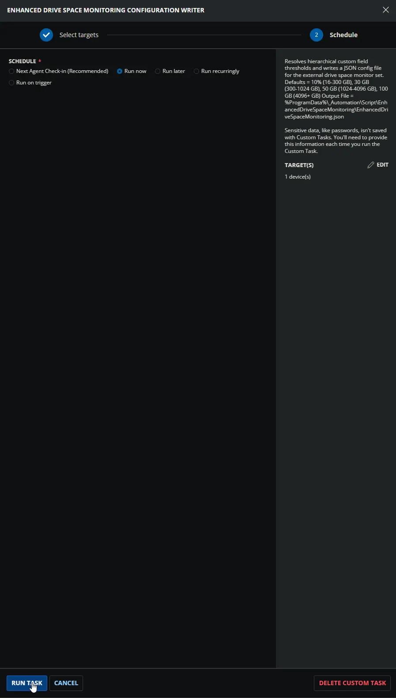

## Dependencies

- [Custom Field: Ticket_Mgmt_Webhook_Url](/docs/8e55deb6-bef8-4501-9e64-7b25e7fcd1ab)
- [Custom Field: EDSM_16To300Threshold_Svr](/docs/b6af6e72-388a-49e8-8cd1-658d240b8813)
- [Custom Field: EDSM_16To300Threshold_Wks](/docs/8bc872f6-4810-4414-9532-ddec748df9ea)
- [Custom Field: EDSM_16To300Threshold_Svr](/docs/84777e7f-983e-4a36-a61b-248f7a83aacf)
- [Custom Field: EDSM_16To300Threshold_Wks](/docs/56bf11f7-32ef-477f-872c-1d2751999054)
- [Custom Field: EDSM_16To300Threshold](/docs/1a511334-ec72-4984-bd5c-fa6dd0e28ce4)
- [Custom Field: EDSM_300To1024Threshold_Svr](/docs/659635de-dd8e-41dc-8137-cb3a6c691e11)
- [Custom Field: EDSM_300To1024Threshold_Wks](/docs/ac8bf87a-7ccf-4012-9831-02876c3bda70)
- [Custom Field: EDSM_300To1024Threshold_Svr](/docs/29954063-87cc-4ffe-b3eb-dc07bc07d577)
- [Custom Field: EDSM_300To1024Threshold_Wks](/docs/9a923aa8-2038-49f1-9328-0ef473737799)
- [Custom Field: EDSM_300To1024Threshold](/docs/bc76dac2-4367-4eb6-a080-09390667ae57)
- [Custom Field: EDSM_1024To4096Threshold_Svr](/docs/2a9bb294-b33e-4cfc-af75-52d5897d3f2d)
- [Custom Field: EDSM_1024To4096Threshold_Wks](/docs/6567dd43-e788-40bc-a592-afb94a40fc71)
- [Custom Field: EDSM_1024To4096Threshold_Svr](/docs/44e80c2c-dfdf-4e60-bbca-8599fad39d4e)
- [Custom Field: EDSM_1024To4096Threshold_Wks](/docs/25e977e3-ba91-44bc-9f8d-e7054b04e14c)
- [Custom Field: EDSM_1024To4096Threshold](/docs/b0a9f98d-c891-4903-bc9a-c526099a4076)
- [Custom Field: EDSM_4096PlusThreshold_Svr](/docs/dcff8864-ef49-45aa-88c8-870911e1d618)
- [Custom Field: EDSM_4096PlusThreshold_Wks](/docs/f7570818-8da7-4e29-b52b-ae9ba7085125)
- [Custom Field: EDSM_4096PlusThreshold_Svr](/docs/c073dd2e-e7da-44b7-b74c-cad86b438946)
- [Custom Field: EDSM_4096PlusThreshold_Wks](/docs/68c691d5-4c53-4bf0-862f-415f4a1ff73a)
- [Custom Field: EDSM_4096PlusThreshold](/docs/3141a7bf-aea8-4703-92ea-7ad11e65ae6c)
- [Custom Field: EDSM_DrivesToInclude_Svr](/docs/40d24606-0478-410c-a11a-a8a94fc20912)
- [Custom Field: EDSM_DrivesToInclude_Wks](/docs/45938d16-ef3a-4f64-891c-03b6a75a5dec)
- [Custom Field: EDSM_DrivesToInclude_Svr](/docs/e9905b04-6467-4e18-b7c9-ada16770b3f2)
- [Custom Field: EDSM_DrivesToInclude_Wks](/docs/8f6106d4-59b5-49da-a7cb-bf2de66bf8fb)
- [Custom Field: EDSM_DrivesToInclude](/docs/7c0130ee-56b6-4c04-8e66-1fafaad73c6d)
- [Custom Field: EDSM_DrivesToExclude_Svr](/docs/f8a71954-7137-4b26-90de-5bb495d1e991)
- [Custom Field: EDSM_DrivesToExclude_Wks](/docs/268a9574-41c1-44ec-b87f-d3b7689364a1)
- [Custom Field: EDSM_DrivesToExclude_Svr](/docs/d8987226-2185-4097-a7aa-79cad95fddee)
- [Custom Field: EDSM_DrivesToExclude_Wks](/docs/5bdbc620-2b0f-4217-9009-78ebdfebbda1)
- [Custom Field: EDSM_DrivesToExclude](/docs/10713e2f-1457-4e60-8903-232032cc033e)
- [Group: Enhanced Drive Space Monitoring](/docs/475ce8e8-458e-4901-bdfc-18e79f62c549)
- [Triggers: CWRMM Ticket Management for Monitors](/docs/05c811e6-c6d0-4652-b4b6-2aa83f9605c7)
- [Workflow: CWRMM Ticket Management for Monitors](/docs/57daa951-2acc-4be7-a025-0d0ca729ef57)
- [Solution: Enhanced Drive Space Monitoring](/docs/e9cf4ff0-4413-447b-97dd-b8b2abd59597)

## Custom Fields

| Name | Example | Level | Type | Default Value | Description |
| --- | --- | --- | --- | --- | --- |
| [EDSM_16To300Threshold_Svr](/docs/b6af6e72-388a-49e8-8cd1-658d240b8813) | `10%`, `500MB`, `0`, `15GB` | `Company` | `Text Box` | `10%` | Defines Company baseline limit for 16-300 GB drives on Servers. Overridden if Site or Endpoint limit exists. Enter X%, XMB, or XGB (e.g., 10%, 500MB). Set to 0 to disable. Name must match across levels. |
| [EDSM_16To300Threshold_Wks](/docs/8bc872f6-4810-4414-9532-ddec748df9ea) | `10%`, `500MB`, `0`, `15GB` | `Company` | `Text Box` | `10%` | Defines Company baseline limit for 16-300 GB drives on Workstations. Overridden if Site or Endpoint limit exists. Enter X%, XMB, or XGB. Set to 0 to disable. Name must match across levels. |
| [EDSM_16To300Threshold_Svr](/docs/84777e7f-983e-4a36-a61b-248f7a83aacf) | `10%`, `500MB`, `0`, `15GB` | `Site` | `Text Box` |  | Defines Site-level limit for 16-300 GB drives on Servers. Overrides Company level, but overridden by Endpoint. Enter X%, XMB, or XGB. Set to 0 to disable. Name must match across levels. |
| [EDSM_16To300Threshold_Wks](/docs/56bf11f7-32ef-477f-872c-1d2751999054) | `10%`, `500MB`, `0`, `15GB` | `Site` | `Text Box` |  | Defines Site-level limit for 16-300 GB drives on Workstations. Overrides Company level, but overridden by Endpoint. Enter X%, XMB, or XGB. Set to 0 to disable. Name must match across levels. |
| [EDSM_16To300Threshold](/docs/1a511334-ec72-4984-bd5c-fa6dd0e28ce4) | `10%`, `500MB`, `0`, `15GB` | `Endpoint` | `Text Box` |  | Defines Endpoint-level limit for 16-300 GB drives. Overrides any Site or Company level setting. Enter X%, XMB, or XGB. Set to 0 to disable. Name must match across levels. |
| [EDSM_300To1024Threshold_Svr](/docs/659635de-dd8e-41dc-8137-cb3a6c691e11) | `10%`, `500MB`, `0`, `15GB` | `Company` | `Text Box` | `30GB` | Defines Company baseline limit for 300-1024 GB drives on Servers. Overridden if Site or Endpoint limit exists. Enter X%, XMB, or XGB. Set to 0 to disable. Name must match across levels. |
| [EDSM_300To1024Threshold_Wks](/docs/ac8bf87a-7ccf-4012-9831-02876c3bda70) | `10%`, `5000MB`, `0`, `55GB` | `Company` | `Text Box` | `30GB` | Defines Company baseline limit for 300-1024 GB drives on Workstations. Overridden if Site or Endpoint limit exists. Enter X%, XMB, or XGB. Set to 0 to disable. Name must match across levels. |
| [EDSM_300To1024Threshold_Svr](/docs/29954063-87cc-4ffe-b3eb-dc07bc07d577) | `10%`, `5000MB`, `0`, `55GB` | `Site` | `Text Box` |  | Defines Site-level limit for 300-1024 GB drives on Servers. Overrides Company level, but overridden by Endpoint. Enter X%, XMB, or XGB. Set to 0 to disable. Name must match across levels. |
| [EDSM_300To1024Threshold_Wks](/docs/9a923aa8-2038-49f1-9328-0ef473737799) | `10%`, `5000MB`, `0`, `55GB` | `Site` | `Text Box` |  | Defines Site-level limit for 300-1024 GB drives on Workstations. Overrides Company level, but overridden by Endpoint. Enter X%, XMB, or XGB. Set to 0 to disable. Name must match across levels. |
| [EDSM_300To1024Threshold](/docs/bc76dac2-4367-4eb6-a080-09390667ae57) | `10%`, `5000MB`, `0`, `55GB` | `Endpoint` | `Text Box` |  | Defines Endpoint-level limit for 300-1024 GB drives. Overrides any Site or Company level setting. Enter X%, XMB, or XGB. Set to 0 to disable. Name must match across levels. |
| [EDSM_1024To4096Threshold_Svr](/docs/2a9bb294-b33e-4cfc-af75-52d5897d3f2d) | `10%`, `50000MB`, `0`, `150GB` | `Company` | `Text Box` | `50GB` | Defines Company baseline limit for 1024-4096 GB drives on Servers. Overridden if Site or Endpoint limit exists. Enter X%, XMB, or XGB. Set to 0 to disable. Name must match across levels. |
| [EDSM_1024To4096Threshold_Wks](/docs/6567dd43-e788-40bc-a592-afb94a40fc71) | `10%`, `50000MB`, `0`, `150GB` | `Company` | `Text Box` | `50GB` | Defines Company baseline limit for 1024-4096 GB drives on Workstations. Overridden if Site or Endpoint limit exists. Enter X%, XMB, or XGB. Set to 0 to disable. Name must match across levels. |
| [EDSM_1024To4096Threshold_Svr](/docs/44e80c2c-dfdf-4e60-bbca-8599fad39d4e) | `10%`, `50000MB`, `0`, `150GB` | `Site` | `Text Box` |  | Defines Site-level limit for 1024-4096 GB drives on Servers. Overrides Company level, but overridden by Endpoint. Enter X%, XMB, or XGB. Set to 0 to disable. Name must match across levels. |
| [EDSM_1024To4096Threshold_Wks](/docs/25e977e3-ba91-44bc-9f8d-e7054b04e14c) | `10%`, `50000MB`, `0`, `150GB` | `Site` | `Text Box` |  | Defines Site-level limit for 1024-4096 GB drives on Workstations. Overrides Company level, but overridden by Endpoint. Enter X%, XMB, or XGB. Set to 0 to disable. Name must match across levels. |
| [EDSM_1024To4096Threshold](/docs/b0a9f98d-c891-4903-bc9a-c526099a4076) | `10%`, `50000MB`, `0`, `150GB` | `Endpoint` | `Text Box` |  | Defines Endpoint-level limit for 1024-4096 GB drives. Overrides any Site or Company level setting. Enter X%, XMB, or XGB. Set to 0 to disable. Name must match across levels. |
| [EDSM_4096PlusThreshold_Svr](/docs/dcff8864-ef49-45aa-88c8-870911e1d618) | `10%`, `75000MB`, `0`, `750GB` | `Company` | `Text Box` | `100GB` | Defines Company baseline limit for 4096+ GB drives on Servers. Overridden if Site or Endpoint limit exists. Enter X%, XMB, or XGB. Set to 0 to disable. Name must match across levels. |
| [EDSM_4096PlusThreshold_Wks](/docs/f7570818-8da7-4e29-b52b-ae9ba7085125) | `10%`, `75000MB`, `0`, `750GB` | `Company` | `Text Box` | `100GB` | Defines Company baseline limit for 4096+ GB drives on Workstations. Overridden if Site or Endpoint limit exists. Enter X%, XMB, or XGB. Set to 0 to disable. Name must match across levels. |
| [EDSM_4096PlusThreshold_Svr](/docs/c073dd2e-e7da-44b7-b74c-cad86b438946) | `10%`, `75000MB`, `0`, `750GB` | `Site` | `Text Box` |  | Defines Site-level limit for 4096+ GB drives on Servers. Overrides Company level, but overridden by Endpoint. Enter X%, XMB, or XGB. Set to 0 to disable. Name must match across levels. |
| [EDSM_4096PlusThreshold_Wks](/docs/68c691d5-4c53-4bf0-862f-415f4a1ff73a) | `10%`, `75000MB`, `0`, `750GB` | `Site` | `Text Box` |  | Defines Site-level limit for 4096+ GB drives on Workstations. Overrides Company level, but overridden by Endpoint. Enter X%, XMB, or XGB. Set to 0 to disable. Name must match across levels. |
| [EDSM_4096PlusThreshold](/docs/3141a7bf-aea8-4703-92ea-7ad11e65ae6c) | `10%`, `75000MB`, `0`, `750GB` | `Endpoint` | `Text Box` |  | Defines Endpoint-level limit for 4096+ GB drives. Overrides any Site or Company level setting. Enter X%, XMB, or XGB. Set to 0 to disable. Name must match across levels. |
| [EDSM_DrivesToInclude_Svr](/docs/40d24606-0478-410c-a11a-a8a94fc20912) | `CDEF`, `All`, `None` | `Company` | `Text Box` |  | Specifies Company baseline server drive letters to monitor. Overridden if Site or Endpoint list exists. Enter sequential letters (e.g., CDEF), All, or None. Name must match exactly. |
| [EDSM_DrivesToInclude_Wks](/docs/45938d16-ef3a-4f64-891c-03b6a75a5dec) | `CDEF`, `All`, `None` | `Company` | `Text Box` |  | Specifies Company baseline workstation drive letters to monitor. Overridden if Site or Endpoint list exists. Enter sequential letters (e.g., CDEF), All, or None. Name must match exactly. |
| [EDSM_DrivesToInclude_Svr](/docs/e9905b04-6467-4e18-b7c9-ada16770b3f2) | `CDEF`, `All`, `None` | `Site` | `Text Box` |  | Specifies Site-level server drive letters to monitor. Overrides Company level, but overridden by Endpoint. Enter sequential letters (e.g., CDEF), All, or None. Name must match exactly. |
| [EDSM_DrivesToInclude_Wks](/docs/8f6106d4-59b5-49da-a7cb-bf2de66bf8fb) | `CDEF`, `All`, `None` | `Site` | `Text Box` |  | Specifies Site-level workstation drive letters to monitor. Overrides Company level, but overridden by Endpoint. Enter sequential letters (e.g., CDEF), All, or None. Name must match exactly. |
| [EDSM_DrivesToInclude](/docs/7c0130ee-56b6-4c04-8e66-1fafaad73c6d) | `CDEF`, `All`, `None` | `Endpoint` | `Text Box` |  | Specifies Endpoint-level drive letters to monitor. Overrides any Site or Company level setting. Enter sequential letters (e.g., CDEF), All, or None. Name must match exactly. |
| [EDSM_DrivesToExclude_Svr](/docs/f8a71954-7137-4b26-90de-5bb495d1e991) | `Z`, `None`, `All` | `Company` | `Text Box` |  | Specifies Company baseline server drive letters to ignore. Overridden if Site or Endpoint list exists. Enter sequential letters (e.g., Z), None, or All. Name must match exactly. |
| [EDSM_DrivesToExclude_Wks](/docs/268a9574-41c1-44ec-b87f-d3b7689364a1) | `Z`, `None`, `All` | `Company` | `Text Box` |  | Specifies Company baseline workstation drive letters to ignore. Overridden if Site or Endpoint list exists. Enter sequential letters (e.g., Z), None, or All. Name must match exactly. |
| [EDSM_DrivesToExclude_Svr](/docs/d8987226-2185-4097-a7aa-79cad95fddee) | `Z`, `None`, `All` | `Site` | `Text Box` |  | Specifies Site-level server drive letters to ignore. Overrides Company level, but overridden by Endpoint. Enter sequential letters (e.g., Z), None, or All. Name must match exactly. |
| [EDSM_DrivesToExclude_Wks](/docs/5bdbc620-2b0f-4217-9009-78ebdfebbda1) | `Z`, `None`, `All` | `Site` | `Text Box` |  | Specifies Site-level workstation drive letters to ignore. Overrides Company level, but overridden by Endpoint. Enter sequential letters (e.g., Z), None, or All. Name must match exactly. |
| [EDSM_DrivesToExclude](/docs/10713e2f-1457-4e60-8903-232032cc033e) | `Z`, `None`, `All` | `Endpoint` | `Text Box` |  | Specifies Endpoint-level drive letters to ignore. Overrides any Site or Company level setting. Enter sequential letters (e.g., Z), None, or All. Name must match exactly. |

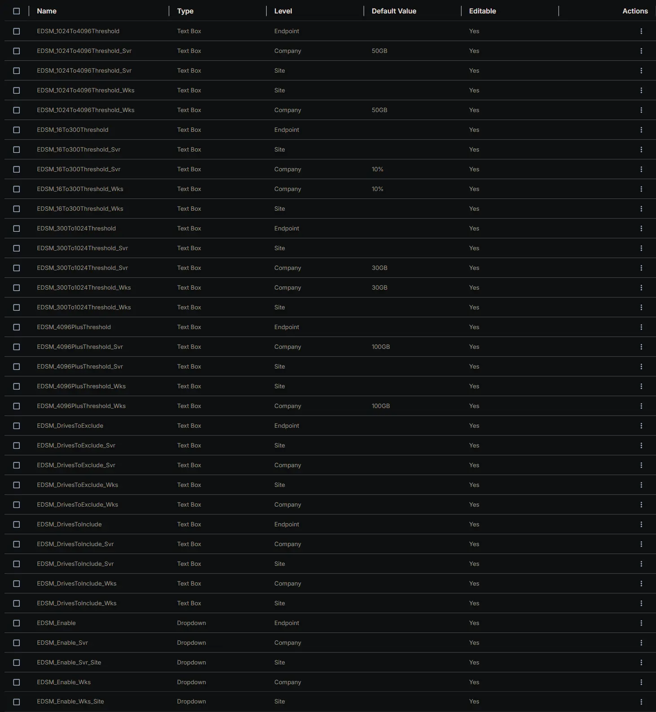

In addition to the threshold and drive-list fields listed above, this task also reads the following company-level field and embeds its value into the configuration file as `TicketWebhookUrl`:

| Name | Example | Level | Type | Default Value | Description |
| --- | --- | --- | --- | --- | --- |
| [Ticket_Mgmt_Webhook_Url](/docs/8e55deb6-bef8-4501-9e64-7b25e7fcd1ab) | `https://webhook.<rmm-domain>/<instance-id>` | `Company` | `Text Box` | `https://webhook.myconnectwise.net/...` | Company-level webhook URL of the [CWRMM ticketing workflow](/docs/57daa951-2acc-4be7-a025-0d0ca729ef57); written into the config JSON as `TicketWebhookUrl`. Read at the Company level only and consumed only by the [Enhanced Drive Space Monitoring [Workflow]](/docs/2c9dd7bc-f5aa-48c2-be76-1348e13cda07) monitor set — see notes below. Name must match exactly. |

**Only required for the [Workflow] monitor-set variant:**  
`TicketWebhookUrl` exists in the config file for the benefit of the optional [Enhanced Drive Space Monitoring [Workflow]](/docs/2c9dd7bc-f5aa-48c2-be76-1348e13cda07) monitor set, which is the only component that reads it. If a partner deploys the original [Enhanced Drive Space Monitoring](/docs/70d7b9fd-8311-4470-9e7a-674cf577d371) set (built-in ticketing) instead, this field is unused end-to-end — the original monitor set ignores the key, so the company field may be left blank and the silent-failure consequence described below does not apply. The mandatory-prerequisite and silent-failure warnings that follow therefore apply **only** when the [Workflow] monitor set is in use.

**Company-level only — no hierarchical override and no server/workstation split:**  
Unlike every `EDSM_*` field above, `Ticket_Mgmt_Webhook_Url` exists only at the Company level and has no `_Svr` / `_Wks` variants. The script reads it once (Row 31) and the OS-detection block does not touch it, so servers and workstations — and every Site and Endpoint — share the exact same webhook URL. This is intentional: the URL points to a single, environment-wide webhook instance, not to a per-device or per-class value.

**Mandatory prerequisite for the [Workflow] variant — silent-failure risk if left blank:**  
When the [Workflow] monitor set is deployed, the value written to `TicketWebhookUrl` must be the real workflow URL — whatever string is stored as the field's Default Value, copied verbatim from the [workflow's trigger webhook instance](/docs/57daa951-2acc-4be7-a025-0d0ca729ef57). The `https://webhook.myconnectwise.net/...` shown in the table is only a placeholder / example and must be replaced with the real URL during workflow setup. If the field is empty, missing, or its RMM token fails to resolve, the script does **not** error out — Row 31 is configured with **Continue on Failure = `True`** — it silently writes the hard-coded fallback `https://webhook.myconnectwise.net/REPLACE_WITH_YOUR_DEFAULT_WEBHOOK_URL` into the JSON instead. The configuration task will still report success, but the [Workflow] monitor set will then have no valid endpoint to POST to, and **ticket creation/closure will silently fail for every device**. After saving the field, always confirm the URL stored in the company field is a character-for-character match of the URL shown in the workflow's trigger instance, then re-run this task (or wait for the next daily run) so the new URL is written into the config file.

**No URL validation is performed:**  
This task only stores the string; it does not check that the URL is reachable or well-formed. Connectivity, authentication, and payload handling are the responsibility of the [Workflow] monitor set and the [workflow](/docs/57daa951-2acc-4be7-a025-0d0ca729ef57) on the receiving end.

## Task Setup Path

- **Tasks Path:** `AUTOMATION` ➞ `Tasks`  
- **Task Type:** `Script Editor`  

## Task Creation

### **Description**

- **Name:** `Enhanced Drive Space Monitoring Configuration Writer`  
- **Description:**

```PlainText
Resolves hierarchical custom field thresholds and writes a JSON config file for the external drive space monitor set.
Defaults = 10% (16‑300 GB), 30 GB (300‑1024 GB), 50 GB (1024‑4096 GB), 100 GB (4096+ GB)
Output File = %ProgramData%\_Automation\Script\EnhancedDriveSpaceMonitoring\EnhancedDriveSpaceMonitoring.json
```

- **Category:** `Monitoring`

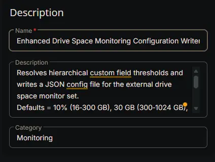

### **Script Editor**

### Row 1 Function: Set Pre-defined Variable ( @computerLevel16To300Threshold@ = EDSM_16To300Threshold  )

- **Notes:** `computerLevel16To300Threshold`
- **Continue on Failure:** `False`
- **Operating System:** `Windows`
- **Variable Name:** `computerLevel16To300Threshold`
- **Custom Field:** `EDSM_16To300Threshold (STRING - ENDPOINT)`

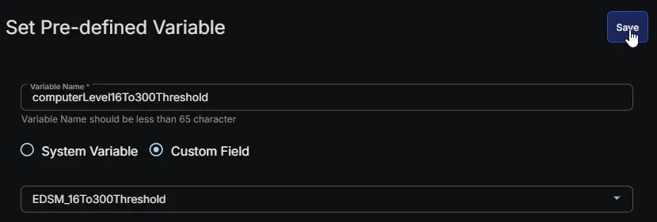

### Row 2 Function: Set Pre-defined Variable ( @computerLevel300to1024Threshold@ = EDSM_300To1024Threshold  )

- **Notes:** `computerLevel300to1024Threshold`
- **Continue on Failure:** `False`
- **Operating System:** `Windows`
- **Variable Name:** `computerLevel300to1024Threshold`
- **Custom Field:** `EDSM_300To1024Threshold (STRING - ENDPOINT)`

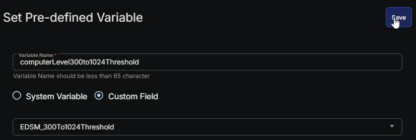

### Row 3 Function: Set Pre-defined Variable ( @computerLevel1024to4096Threshold@ = EDSM_1024To4096Threshold  )

- **Notes:** `computerLevel1024to4096Threshold`
- **Continue on Failure:** `False`
- **Operating System:** `Windows`
- **Variable Name:** `computerLevel1024to4096Threshold`
- **Custom Field:** `EDSM_1024To4096Threshold (STRING - ENDPOINT)`

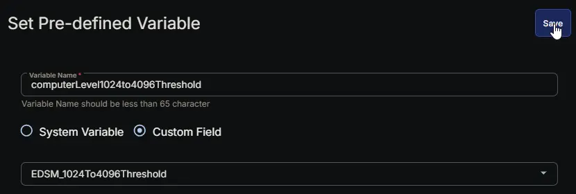

### Row 4 Function: Set Pre-defined Variable ( @computerLevel4096PlusThreshold@ = EDSM_4096PlusThreshold  )

- **Notes:** `computerLevel4096PlusThreshold`
- **Continue on Failure:** `False`
- **Operating System:** `Windows`
- **Variable Name:** `computerLevel4096PlusThreshold`
- **Custom Field:** `EDSM_4096PlusThreshold (STRING - ENDPOINT)`

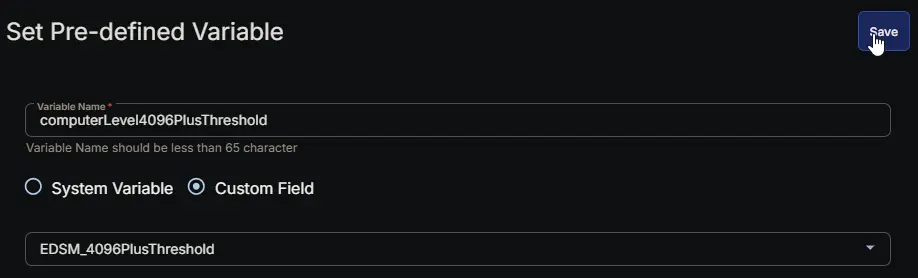

### Row 5 Function: Set Pre-defined Variable ( @computerLevelDrivesToInclude@ = EDSM_DrivesToInclude  )

- **Notes:** `computerLevelDrivesToInclude`
- **Continue on Failure:** `False`
- **Operating System:** `Windows`
- **Variable Name:** `computerLevelDrivesToInclude`
- **Custom Field:** `EDSM_DrivesToInclude (STRING - ENDPOINT)`


### Row 6 Function: Set Pre-defined Variable ( @computerLevelDrivesToExclude@ = EDSM_DrivesToExclude  )

- **Notes:** `computerLevelDrivesToExclude`
- **Continue on Failure:** `False`
- **Operating System:** `Windows`
- **Variable Name:** `computerLevelDrivesToExclude`
- **Custom Field:** `EDSM_DrivesToExclude (STRING - ENDPOINT)`

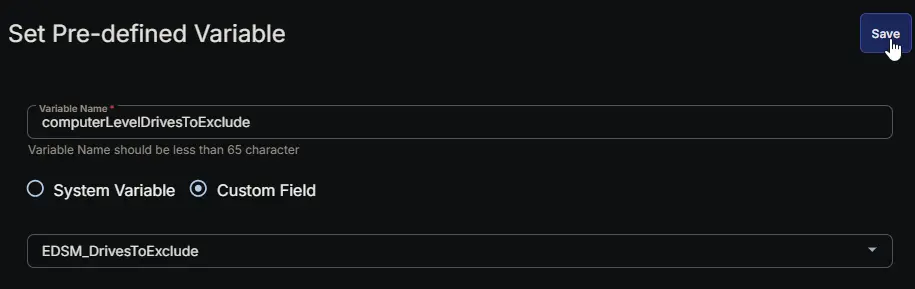

### Row 7 Function: Set Pre-defined Variable ( @locationLevel16To300Threshold_Svr@ = EDSM_16To300Threshold_Svr  )

- **Notes:** `locationLevel16To300Threshold_Svr`
- **Continue on Failure:** `False`
- **Operating System:** `Windows`
- **Variable Name:** `locationLevel16To300Threshold_Svr`
- **Custom Field:** `EDSM_16To300Threshold_Svr (STRING - SITE)`


### Row 8 Function: Set Pre-defined Variable ( @locationLevel16To300Threshold_Wks@ = EDSM_16To300Threshold_Wks  )

- **Notes:** `locationLevel16To300Threshold_Wks`
- **Continue on Failure:** `False`
- **Operating System:** `Windows`
- **Variable Name:** `locationLevel16To300Threshold_Wks`
- **Custom Field:** `EDSM_16To300Threshold_Wks (STRING - SITE)`

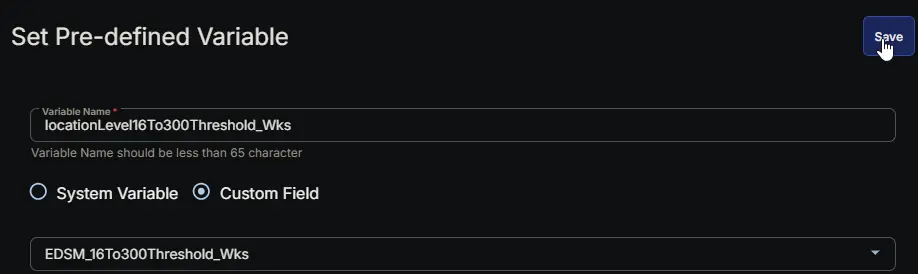

### Row 9 Function: Set Pre-defined Variable ( @locationLevel300to1024Threshold_Svr@ = EDSM_300To1024Threshold_Svr  )

- **Notes:** `locationLevel300to1024Threshold_Svr`
- **Continue on Failure:** `False`
- **Operating System:** `Windows`
- **Variable Name:** `locationLevel300to1024Threshold_Svr`
- **Custom Field:** `EDSM_300To1024Threshold_Svr (STRING - SITE)`

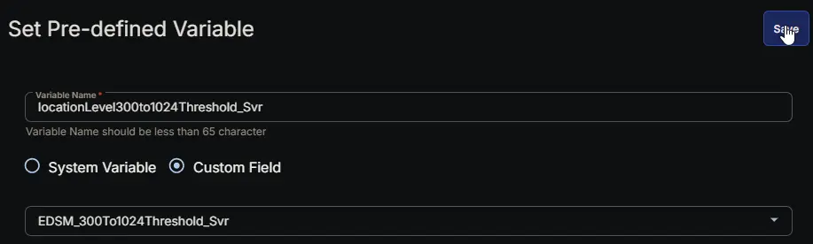

### Row 10 Function: Set Pre-defined Variable ( @locationLevel300to1024Threshold_Wks@ = EDSM_300To1024Threshold_Wks  )

- **Notes:** `locationLevel300to1024Threshold_Wks`
- **Continue on Failure:** `False`
- **Operating System:** `Windows`
- **Variable Name:** `locationLevel300to1024Threshold_Wks`
- **Custom Field:** `EDSM_300To1024Threshold_Wks (STRING - SITE)`

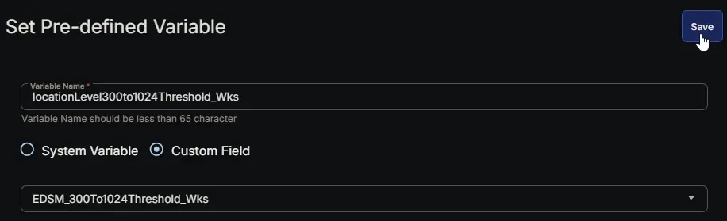

### Row 11 Function: Set Pre-defined Variable ( @locationLevel1024to4096Threshold_Svr@ = EDSM_1024To4096Threshold_Svr  )

- **Notes:** `locationLevel1024to4096Threshold_Svr`
- **Continue on Failure:** `False`
- **Operating System:** `Windows`
- **Variable Name:** `locationLevel1024to4096Threshold_Svr`
- **Custom Field:** `EDSM_1024To4096Threshold_Svr (STRING - SITE)`

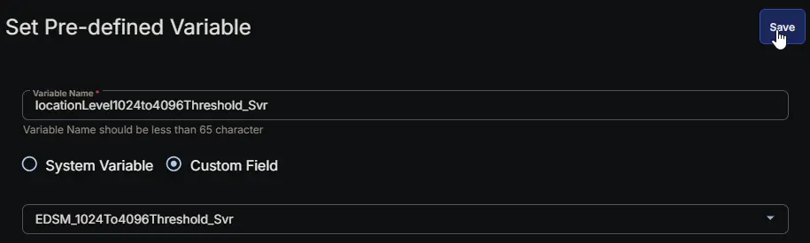

### Row 12 Function: Set Pre-defined Variable ( @locationLevel1024to4096Threshold_Wks@ = EDSM_1024To4096Threshold_Wks  )

- **Notes:** `locationLevel1024to4096Threshold_Wks`
- **Continue on Failure:** `False`
- **Operating System:** `Windows`
- **Variable Name:** `locationLevel1024to4096Threshold_Wks`
- **Custom Field:** `EDSM_1024To4096Threshold_Wks (STRING - SITE)`


### Row 13 Function: Set Pre-defined Variable ( @locationLevel4096PlusThreshold_Svr@ = EDSM_4096PlusThreshold_Svr  )

- **Notes:** `locationLevel4096PlusThreshold_Svr`
- **Continue on Failure:** `False`
- **Operating System:** `Windows`
- **Variable Name:** `locationLevel4096PlusThreshold_Svr`
- **Custom Field:** `EDSM_4096PlusThreshold_Svr (STRING - SITE)`

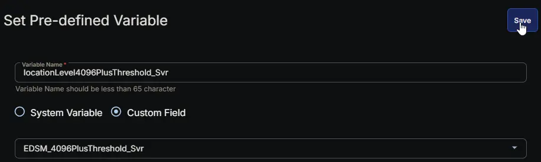

### Row 14 Function: Set Pre-defined Variable ( @locationLevel4096PlusThreshold_Wks@ = EDSM_4096PlusThreshold_Wks  )

- **Notes:** `locationLevel4096PlusThreshold_Wks`
- **Continue on Failure:** `False`
- **Operating System:** `Windows`
- **Variable Name:** `locationLevel4096PlusThreshold_Wks`
- **Custom Field:** `EDSM_4096PlusThreshold_Wks (STRING - SITE)`

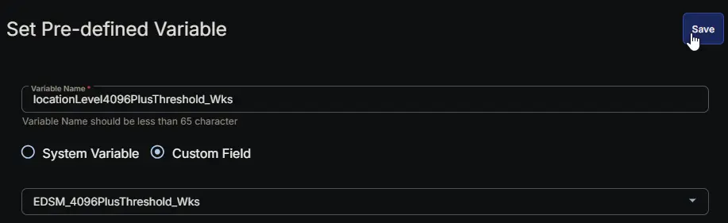

### Row 15 Function: Set Pre-defined Variable ( @locationLevelDrivesToInclude_Svr@ = EDSM_DrivesToInclude_Svr  )

- **Notes:** `locationLevelDrivesToInclude_Svr`
- **Continue on Failure:** `False`
- **Operating System:** `Windows`
- **Variable Name:** `locationLevelDrivesToInclude_Svr`
- **Custom Field:** `EDSM_DrivesToInclude_Svr (STRING - SITE)`


### Row 16 Function: Set Pre-defined Variable ( @locationLevelDrivesToInclude_Wks@ = EDSM_DrivesToInclude_Wks  )

- **Notes:** `locationLevelDrivesToInclude_Wks`
- **Continue on Failure:** `False`
- **Operating System:** `Windows`
- **Variable Name:** `locationLevelDrivesToInclude_Wks`
- **Custom Field:** `EDSM_DrivesToInclude_Wks (STRING - SITE)`

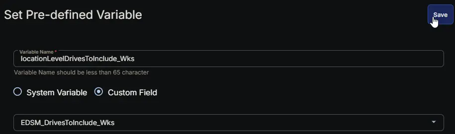

### Row 17 Function: Set Pre-defined Variable ( @locationLevelDrivesToExclude_Svr@ = EDSM_DrivesToExclude_Svr  )

- **Notes:** `locationLevelDrivesToExclude_Svr`
- **Continue on Failure:** `False`
- **Operating System:** `Windows`
- **Variable Name:** `locationLevelDrivesToExclude_Svr`
- **Custom Field:** `EDSM_DrivesToExclude_Svr (STRING - SITE)`

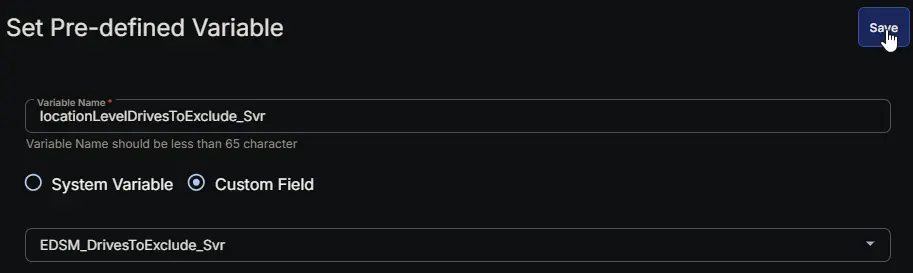

### Row 18 Function: Set Pre-defined Variable ( @locationLevelDrivesToExclude_Wks@ = EDSM_DrivesToExclude_Wks  )

- **Notes:** `locationLevelDrivesToExclude_Wks`
- **Continue on Failure:** `False`
- **Operating System:** `Windows`
- **Variable Name:** `locationLevelDrivesToExclude_Wks`
- **Custom Field:** `EDSM_DrivesToExclude_Wks (STRING - SITE)`

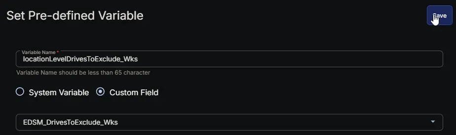

### Row 19 Function: Set Pre-defined Variable ( @clientLevel16To300Threshold_Svr@ = EDSM_16To300Threshold_Svr  )

- **Notes:** `clientLevel16To300Threshold_Svr`
- **Continue on Failure:** `False`
- **Operating System:** `Windows`
- **Variable Name:** `clientLevel16To300Threshold_Svr`
- **Custom Field:** `EDSM_16To300Threshold_Svr (STRING - COMPANY)`

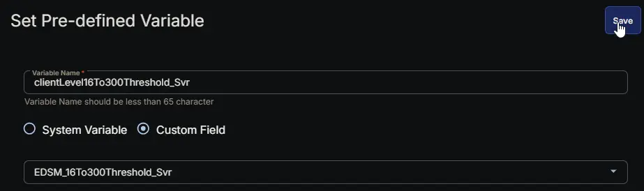

### Row 20 Function: Set Pre-defined Variable ( @clientLevel16To300Threshold_Wks@ = EDSM_16To300Threshold_Wks  )

- **Notes:** `clientLevel16To300Threshold_Wks`
- **Continue on Failure:** `False`
- **Operating System:** `Windows`
- **Variable Name:** `clientLevel16To300Threshold_Wks`
- **Custom Field:** `EDSM_16To300Threshold_Wks (STRING - COMPANY)`

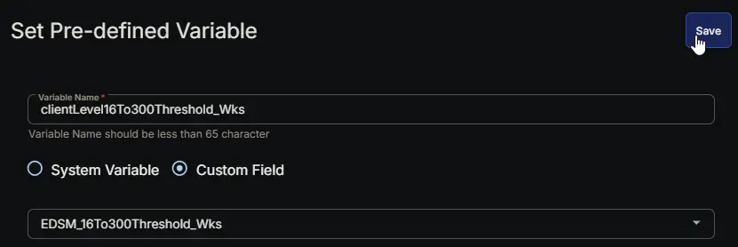

### Row 21 Function: Set Pre-defined Variable ( @clientLevel300to1024Threshold_Svr@ = EDSM_300To1024Threshold_Svr  )

- **Notes:** `clientLevel300to1024Threshold_Svr`
- **Continue on Failure:** `False`
- **Operating System:** `Windows`
- **Variable Name:** `clientLevel300to1024Threshold_Svr`
- **Custom Field:** `EDSM_300To1024Threshold_Svr (STRING - COMPANY)`

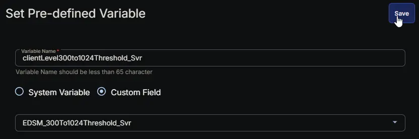

### Row 22 Function: Set Pre-defined Variable ( @clientLevel300to1024Threshold_Wks@ = EDSM_300To1024Threshold_Wks  )

- **Notes:** `clientLevel300to1024Threshold_Wks`
- **Continue on Failure:** `False`
- **Operating System:** `Windows`
- **Variable Name:** `clientLevel300to1024Threshold_Wks`
- **Custom Field:** `EDSM_300To1024Threshold_Wks (STRING - COMPANY)`

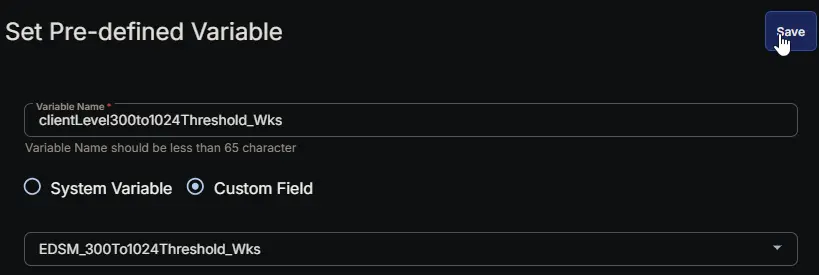

### Row 23 Function: Set Pre-defined Variable ( @clientLevel1024to4096Threshold_Svr@ = EDSM_1024To4096Threshold_Svr  )

- **Notes:** `clientLevel1024to4096Threshold_Svr`
- **Continue on Failure:** `False`
- **Operating System:** `Windows`
- **Variable Name:** `clientLevel1024to4096Threshold_Svr`
- **Custom Field:** `EDSM_1024To4096Threshold_Svr (STRING - COMPANY)`

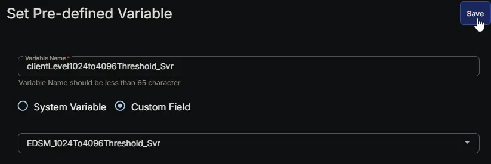

### Row 24 Function: Set Pre-defined Variable ( @clientLevel1024to4096Threshold_Wks@ = EDSM_1024To4096Threshold_Wks  )

- **Notes:** `clientLevel1024to4096Threshold_Wks`
- **Continue on Failure:** `False`
- **Operating System:** `Windows`
- **Variable Name:** `clientLevel1024to4096Threshold_Wks`
- **Custom Field:** `EDSM_1024To4096Threshold_Wks (STRING - COMPANY)`

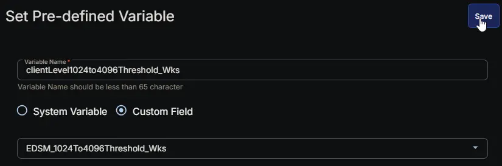

### Row 25 Function: Set Pre-defined Variable ( @clientLevel4096PlusThreshold_Svr@ = EDSM_4096PlusThreshold_Svr  )

- **Notes:** `clientLevel4096PlusThreshold_Svr`
- **Continue on Failure:** `False`
- **Operating System:** `Windows`
- **Variable Name:** `clientLevel4096PlusThreshold_Svr`
- **Custom Field:** `EDSM_4096PlusThreshold_Svr (STRING - COMPANY)`

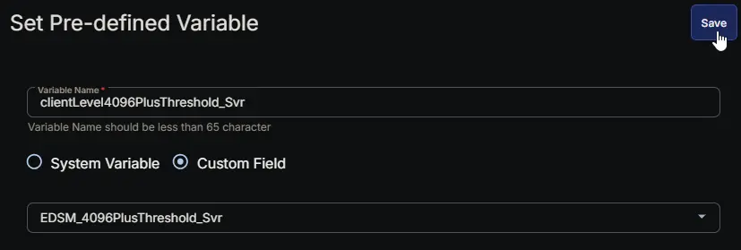

### Row 26 Function: Set Pre-defined Variable ( @clientLevel4096PlusThreshold_Wks@ = EDSM_4096PlusThreshold_Wks  )

- **Notes:** `clientLevel4096PlusThreshold_Wks`
- **Continue on Failure:** `False`
- **Operating System:** `Windows`
- **Variable Name:** `clientLevel4096PlusThreshold_Wks`
- **Custom Field:** `EDSM_4096PlusThreshold_Wks (STRING - COMPANY)`


### Row 27 Function: Set Pre-defined Variable ( @clientLevelDrivesToInclude_Svr@ = EDSM_DrivesToInclude_Svr  )

- **Notes:** `clientLevelDrivesToInclude_Svr`
- **Continue on Failure:** `False`
- **Operating System:** `Windows`
- **Variable Name:** `clientLevelDrivesToInclude_Svr`
- **Custom Field:** `EDSM_DrivesToInclude_Svr (STRING - COMPANY)`

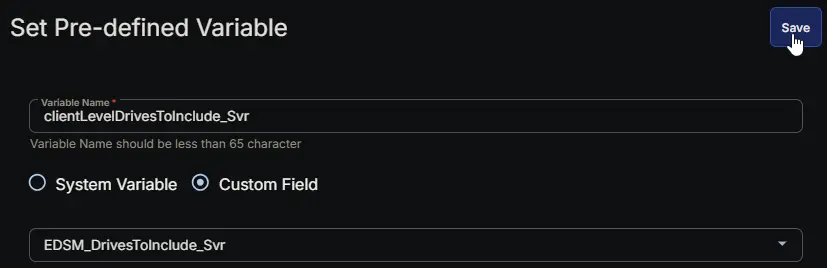

### Row 28 Function: Set Pre-defined Variable ( @clientLevelDrivesToInclude_Wks@ = EDSM_DrivesToInclude_Wks  )

- **Notes:** `clientLevelDrivesToInclude_Wks`
- **Continue on Failure:** `False`
- **Operating System:** `Windows`
- **Variable Name:** `clientLevelDrivesToInclude_Wks`
- **Custom Field:** `EDSM_DrivesToInclude_Wks (STRING - COMPANY)`

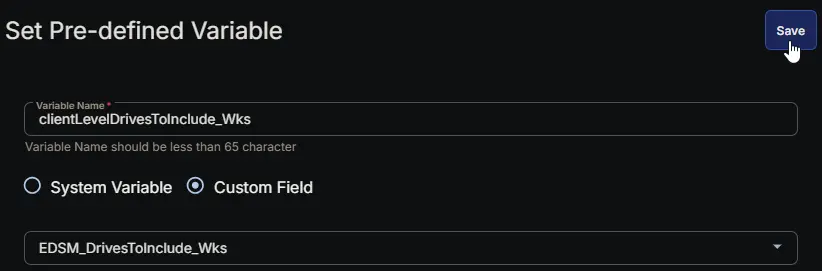

### Row 29 Function: Set Pre-defined Variable ( @clientLevelDrivesToExclude_Svr@ = EDSM_DrivesToExclude_Svr  )

- **Notes:** `clientLevelDrivesToExclude_Svr`
- **Continue on Failure:** `False`
- **Operating System:** `Windows`
- **Variable Name:** `clientLevelDrivesToExclude_Svr`
- **Custom Field:** `EDSM_DrivesToExclude_Svr (STRING - COMPANY)`

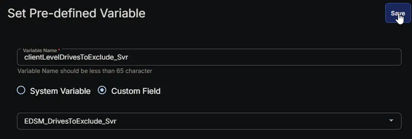

### Row 30 Function: Set Pre-defined Variable ( @clientLevelDrivesToExclude_Wks@ = EDSM_DrivesToExclude_Wks  )

- **Notes:** `clientLevelDrivesToExclude_Wks`
- **Continue on Failure:** `False`
- **Operating System:** `Windows`
- **Variable Name:** `clientLevelDrivesToExclude_Wks`
- **Custom Field:** `EDSM_DrivesToExclude_Wks (STRING - COMPANY)`

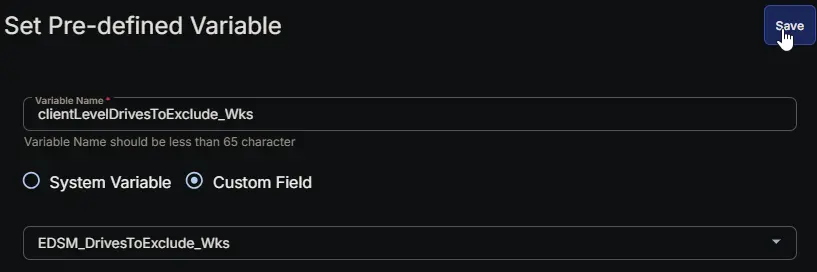

### Row 31 Function: Set Pre-defined Variable ( @clientLevelTicketMgmtWebhookUrl@ = Ticket_Mgmt_Webhook_Url   )

- **Notes:** `clientLevelTicketMgmtWebhookUrl`
- **Continue on Failure:** `True`
- **Operating System:** `Windows`
- **Variable Name:** `clientLevelTicketMgmtWebhookUrl`
- **Custom Field:** `Ticket_Mgmt_Webhook_Url (STRING - COMPANY)`

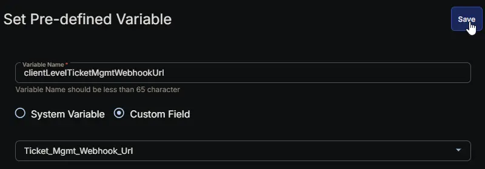

#### Row 32 Function: PowerShell script

- **Notes:** `<Leave it Blank>`  
- **Use Generative AI Assist for script creation:** `False`  
- **Expected time of script execution in seconds:** `300`  
- **Continue on Failure:** `False`  
- **Run As:** `System`  
- **Operating System:** `Windows`  
- **PowerShell Script Editor:**

[PowerShell Script](https://github.com/ProVal-Tech/cw-rmm/blob/main/tasks/enhanced-drive-space-monitoring-configuration-writer/script.ps1)


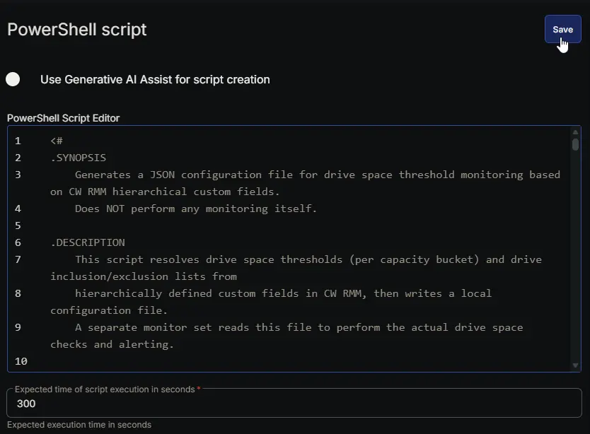

#### Row 33 Function: Script Log

- **Notes:** `<Leave it Blank>`  
- **Continue on Failure:** `False`  
- **Operating System:** `Windows`  
- **Script Log Message:** `%Output%`  

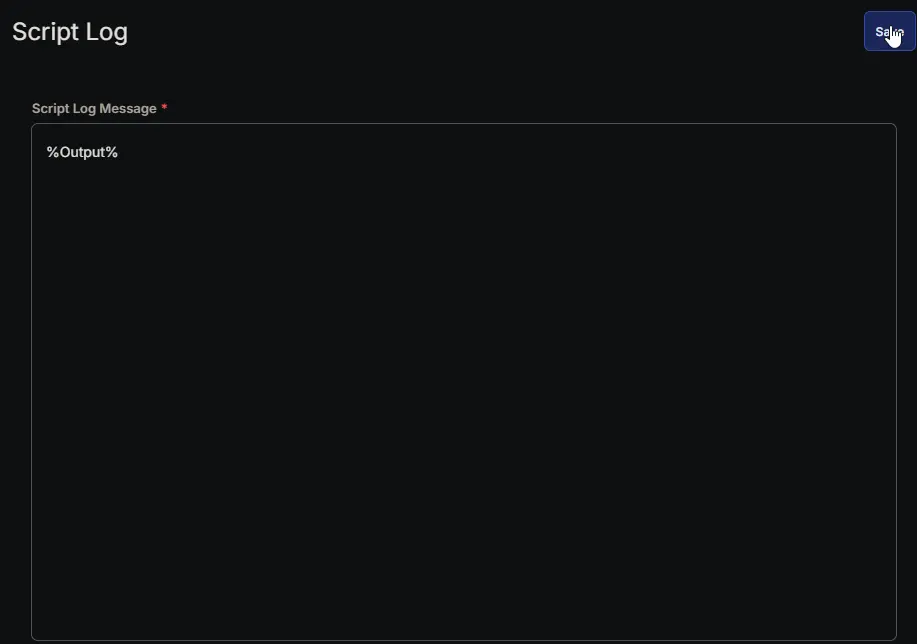

## Completed Task

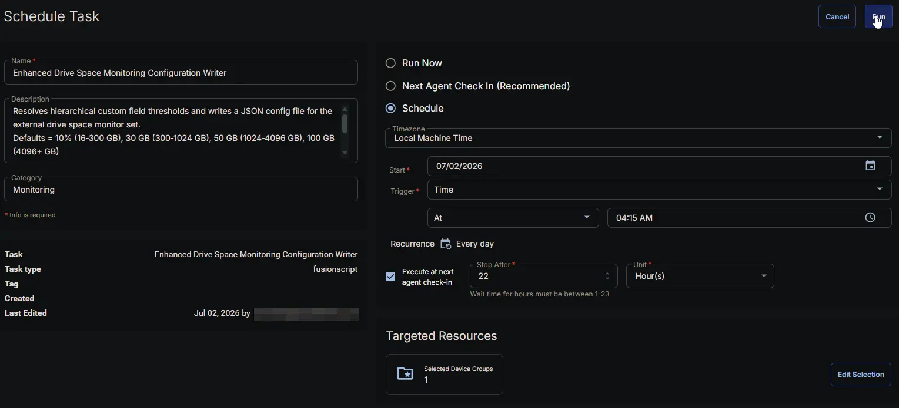

## Output

- Script Log
- JSON File at `C:\ProgramData\_Automation\Script\EnhancedDriveSpaceMonitoring\EnhancedDriveSpaceMonitoring.json`

## Schedule Task

### Task Details

- **Name:** `Enhanced Drive Space Monitoring Configuration Writer`  
- **Description:**

```PlainText
Resolves hierarchical custom field thresholds and writes a JSON config file for the external drive space monitor set.
Defaults = 10% (16‑300 GB), 30 GB (300‑1024 GB), 50 GB (1024‑4096 GB), 100 GB (4096+ GB)
Output File = %ProgramData%\_Automation\Script\EnhancedDriveSpaceMonitoring\EnhancedDriveSpaceMonitoring.json
```

- **Category:** `Monitoring`

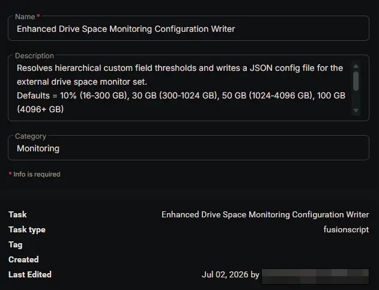

### Schedule

- **Schedule Type:**  `Schedule`  
- **Timezone:** `Local Machine Time`  
- **Start:** `<Current Date>`  
- **Trigger:** `Time` `At` `<Current Time>`  
- **Recurrence:** `Every day`
- **Execute at next agent check-in:** `True`
- **Stop After:** `22`
- **Unit:** `Hour(s)`

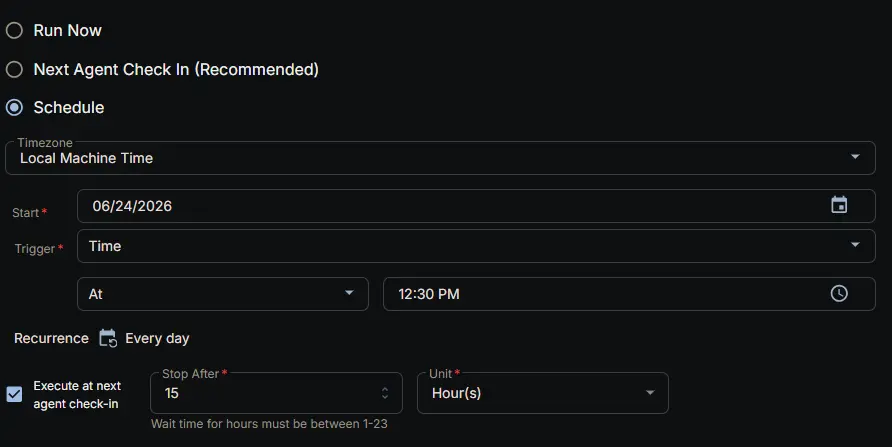

### Targeted Resource

**Device Group:** `Enhanced Drive Space Monitoring`

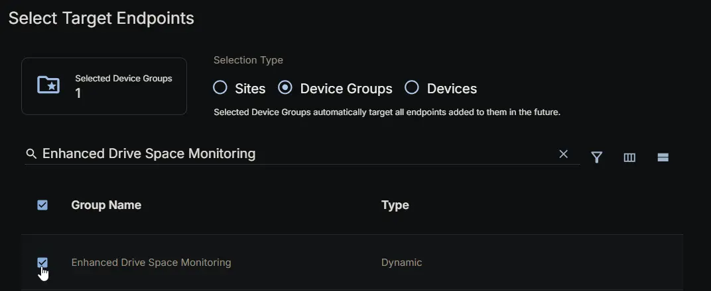

### Completed Scheduled Task

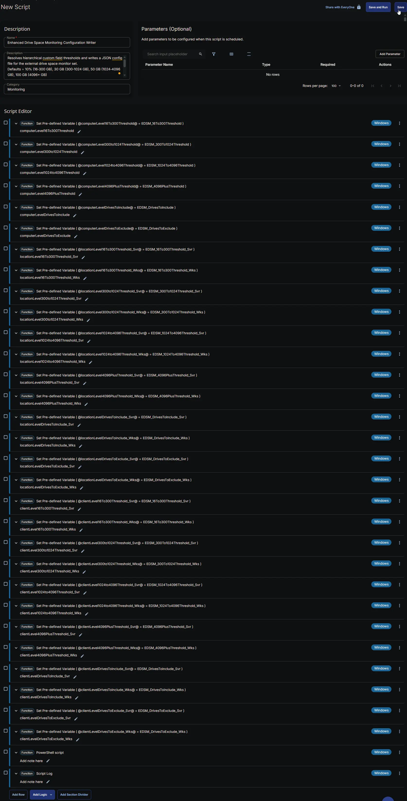

## Changelog

### 2026-07-23

- **Task Update:** The task now reads the company-level `Ticket_Mgmt_Webhook_Url` custom field and writes it into the configuration file as `TicketWebhookUrl`, enabling the optional `[Workflow]` monitor-set variant to trigger the ConnectWise ticketing workflow.

### 2026-07-02

- **Architecture Change:** The task has been converted from a monitoring script that directly generated tickets to a **configuration writer**. It now only resolves custom field thresholds and writes a JSON configuration file (`EnhancedDriveSpaceMonitoring.json`). The actual drive space evaluation and ticketing are handled by a dedicated monitor set that reads this file. This decoupling allows more frequent health checks (via the monitor) while keeping policy management centralized in custom fields.

### 2026-06-24

- Initial version of the document (original monitoring task).

