## Summary

This task provides an intelligent, highly customizable approach to monitoring local drive space on Windows devices. It acts as an automated storage health check, dynamically assessing drive capacity and comparing it against flexible, hierarchical thresholds to proactively identify storage shortages before they impact system performance.

Specifically, the task evaluates the following:

- **Hierarchical Thresholds:** Evaluates drive space limits based on custom fields configured at the Company, Site, or Endpoint level. This allows you to set broad baseline policies across your entire organization, while seamlessly overriding them for specific locations or individual, critical machines.
- **Dynamic Capacity Buckets:** Automatically calculates the total size of each drive and assigns it to a specific monitoring tier (16–300 GB, 300–1024 GB, 1024–4096 GB, or 4096+ GB). This ensures that a 250 GB operating system drive and a 10 TB data volume are evaluated against proportionally appropriate limits (using Percentages, Megabytes, or Gigabytes).
- **Smart Inclusion & Exclusion:** Discovers all local logical drives but selectively monitors or ignores specific drive letters based on your configurations. For example, you can easily exclude a dedicated backup drive (like "Z") or explicitly target only critical drives (like "CDEF").
- **OS-Aware Policies:** Automatically detects whether the endpoint is a Server or a Workstation, applying the appropriate set of monitoring rules for that specific environment without requiring separate scripts.

### Ticketing & Alerting Behavior

If the task detects any drive falling below its assigned threshold, it will automatically generate a service ticket. This ticket will contain a highly readable, detailed summary of all problematic drives, including the Drive Letter, Total Space, Used Space, Free Space, and the specific Threshold that was breached.

**Important Note Regarding Ticketing:** Due to native functionality within ConnectWise RMM, the system cannot currently fetch an existing ticket number to append or update information. As a result:

- **Daily Ticketing:** If the task is scheduled to run daily, it will generate a *new* ticket every time it runs and detects that the drive space is still low. This will continue until the underlying storage issue is resolved.
- **Manual Closure Required:** ConnectWise RMM does not support auto-closing these specific alerts once the drive space issue is resolved. Technicians will need to manually close the generated tickets after clearing up space on the affected endpoint.

## Sample Run

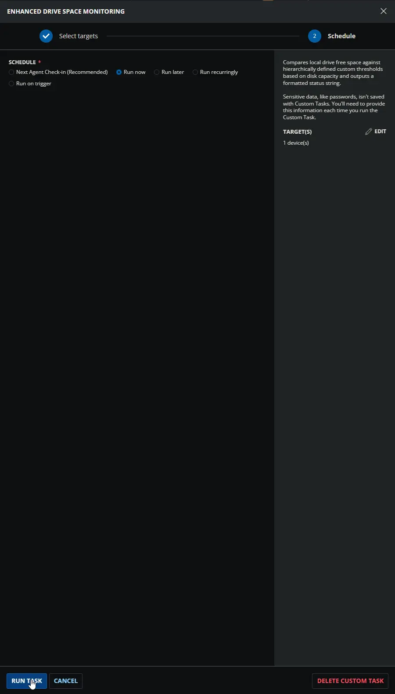

## Dependencies

- [Custom Field: EDSM_16To300Threshold_Svr](/docs/b6af6e72-388a-49e8-8cd1-658d240b8813)
- [Custom Field: EDSM_16To300Threshold_Wks](/docs/8bc872f6-4810-4414-9532-ddec748df9ea)
- [Custom Field: EDSM_16To300Threshold_Svr](/docs/84777e7f-983e-4a36-a61b-248f7a83aacf)
- [Custom Field: EDSM_16To300Threshold_Wks](/docs/56bf11f7-32ef-477f-872c-1d2751999054)
- [Custom Field: EDSM_16To300Threshold](/docs/1a511334-ec72-4984-bd5c-fa6dd0e28ce4)
- [Custom Field: EDSM_300To1024Threshold_Svr](/docs/659635de-dd8e-41dc-8137-cb3a6c691e11)
- [Custom Field: EDSM_300To1024Threshold_Wks](/docs/ac8bf87a-7ccf-4012-9831-02876c3bda70)
- [Custom Field: EDSM_300To1024Threshold_Svr](/docs/29954063-87cc-4ffe-b3eb-dc07bc07d577)
- [Custom Field: EDSM_300To1024Threshold_Wks](/docs/9a923aa8-2038-49f1-9328-0ef473737799)
- [Custom Field: EDSM_300To1024Threshold](/docs/bc76dac2-4367-4eb6-a080-09390667ae57)
- [Custom Field: EDSM_1024To4096Threshold_Svr](/docs/2a9bb294-b33e-4cfc-af75-52d5897d3f2d)
- [Custom Field: EDSM_1024To4096Threshold_Wks](/docs/6567dd43-e788-40bc-a592-afb94a40fc71)
- [Custom Field: EDSM_1024To4096Threshold_Svr](/docs/44e80c2c-dfdf-4e60-bbca-8599fad39d4e)
- [Custom Field: EDSM_1024To4096Threshold_Wks](/docs/25e977e3-ba91-44bc-9f8d-e7054b04e14c)
- [Custom Field: EDSM_1024To4096Threshold](/docs/b0a9f98d-c891-4903-bc9a-c526099a4076)
- [Custom Field: EDSM_4096PlusThreshold_Svr](/docs/dcff8864-ef49-45aa-88c8-870911e1d618)
- [Custom Field: EDSM_4096PlusThreshold_Wks](/docs/f7570818-8da7-4e29-b52b-ae9ba7085125)
- [Custom Field: EDSM_4096PlusThreshold_Svr](/docs/c073dd2e-e7da-44b7-b74c-cad86b438946)
- [Custom Field: EDSM_4096PlusThreshold_Wks](/docs/68c691d5-4c53-4bf0-862f-415f4a1ff73a)
- [Custom Field: EDSM_4096PlusThreshold](/docs/3141a7bf-aea8-4703-92ea-7ad11e65ae6c)
- [Custom Field: EDSM_DrivesToInclude_Svr](/docs/40d24606-0478-410c-a11a-a8a94fc20912)
- [Custom Field: EDSM_DrivesToInclude_Wks](/docs/45938d16-ef3a-4f64-891c-03b6a75a5dec)
- [Custom Field: EDSM_DrivesToInclude_Svr](/docs/e9905b04-6467-4e18-b7c9-ada16770b3f2)
- [Custom Field: EDSM_DrivesToInclude_Wks](/docs/8f6106d4-59b5-49da-a7cb-bf2de66bf8fb)
- [Custom Field: EDSM_DrivesToInclude](/docs/7c0130ee-56b6-4c04-8e66-1fafaad73c6d)
- [Custom Field: EDSM_DrivesToExclude_Svr](/docs/f8a71954-7137-4b26-90de-5bb495d1e991)
- [Custom Field: EDSM_DrivesToExclude_Wks](/docs/268a9574-41c1-44ec-b87f-d3b7689364a1)
- [Custom Field: EDSM_DrivesToExclude_Svr](/docs/d8987226-2185-4097-a7aa-79cad95fddee)
- [Custom Field: EDSM_DrivesToExclude_Wks](/docs/5bdbc620-2b0f-4217-9009-78ebdfebbda1)
- [Custom Field: EDSM_DrivesToExclude](/docs/10713e2f-1457-4e60-8903-232032cc033e)
- [Group: Enhanced Drive Space Monitoring](/docs/475ce8e8-458e-4901-bdfc-18e79f62c549)
- [Solution: Enhanced Drive Space Monitoring](/docs/e9cf4ff0-4413-447b-97dd-b8b2abd59597)

## Custom Fields

| Name | Example | Level | Type | Default Value | Description |
| --- | --- | --- | --- | --- | --- |
| [EDSM_16To300Threshold_Svr](/docs/b6af6e72-388a-49e8-8cd1-658d240b8813) | `10%`, `500MB`, `0`, `15GB` | `Company` | `Text Box` | `10%` | Defines Company baseline limit for 16-300 GB drives on Servers. Overridden if Site or Endpoint limit exists. Enter X%, XMB, or XGB (e.g., 10%, 500MB). Set to 0 to disable. Name must match across levels. |
| [EDSM_16To300Threshold_Wks](/docs/8bc872f6-4810-4414-9532-ddec748df9ea) | `10%`, `500MB`, `0`, `15GB` | `Company` | `Text Box` | `10%` | Defines Company baseline limit for 16-300 GB drives on Workstations. Overridden if Site or Endpoint limit exists. Enter X%, XMB, or XGB. Set to 0 to disable. Name must match across levels. |
| [EDSM_16To300Threshold_Svr](/docs/84777e7f-983e-4a36-a61b-248f7a83aacf) | `10%`, `500MB`, `0`, `15GB` | `Site` | `Text Box` |  | Defines Site-level limit for 16-300 GB drives on Servers. Overrides Company level, but overridden by Endpoint. Enter X%, XMB, or XGB. Set to 0 to disable. Name must match across levels. |
| [EDSM_16To300Threshold_Wks](/docs/56bf11f7-32ef-477f-872c-1d2751999054) | `10%`, `500MB`, `0`, `15GB` | `Site` | `Text Box` |  | Defines Site-level limit for 16-300 GB drives on Workstations. Overrides Company level, but overridden by Endpoint. Enter X%, XMB, or XGB. Set to 0 to disable. Name must match across levels. |
| [EDSM_16To300Threshold](/docs/1a511334-ec72-4984-bd5c-fa6dd0e28ce4) | `10%`, `500MB`, `0`, `15GB` | `Endpoint` | `Text Box` |  | Defines Endpoint-level limit for 16-300 GB drives. Overrides any Site or Company level setting. Enter X%, XMB, or XGB. Set to 0 to disable. Name must match across levels. |
| [EDSM_300To1024Threshold_Svr](/docs/659635de-dd8e-41dc-8137-cb3a6c691e11) | `10%`, `500MB`, `0`, `15GB` | `Company` | `Text Box` | `30GB` | Defines Company baseline limit for 300-1024 GB drives on Servers. Overridden if Site or Endpoint limit exists. Enter X%, XMB, or XGB. Set to 0 to disable. Name must match across levels. |
| [EDSM_300To1024Threshold_Wks](/docs/ac8bf87a-7ccf-4012-9831-02876c3bda70) | `10%`, `5000MB`, `0`, `55GB` | `Company` | `Text Box` | `30GB` | Defines Company baseline limit for 300-1024 GB drives on Workstations. Overridden if Site or Endpoint limit exists. Enter X%, XMB, or XGB. Set to 0 to disable. Name must match across levels. |
| [EDSM_300To1024Threshold_Svr](/docs/29954063-87cc-4ffe-b3eb-dc07bc07d577) | `10%`, `5000MB`, `0`, `55GB` | `Site` | `Text Box` |  | Defines Site-level limit for 300-1024 GB drives on Servers. Overrides Company level, but overridden by Endpoint. Enter X%, XMB, or XGB. Set to 0 to disable. Name must match across levels. |
| [EDSM_300To1024Threshold_Wks](/docs/9a923aa8-2038-49f1-9328-0ef473737799) | `10%`, `5000MB`, `0`, `55GB` | `Site` | `Text Box` |  | Defines Site-level limit for 300-1024 GB drives on Workstations. Overrides Company level, but overridden by Endpoint. Enter X%, XMB, or XGB. Set to 0 to disable. Name must match across levels. |
| [EDSM_300To1024Threshold](/docs/bc76dac2-4367-4eb6-a080-09390667ae57) | `10%`, `5000MB`, `0`, `55GB` | `Endpoint` | `Text Box` |  | Defines Endpoint-level limit for 300-1024 GB drives. Overrides any Site or Company level setting. Enter X%, XMB, or XGB. Set to 0 to disable. Name must match across levels. |
| [EDSM_1024To4096Threshold_Svr](/docs/2a9bb294-b33e-4cfc-af75-52d5897d3f2d) | `10%`, `50000MB`, `0`, `150GB` | `Company` | `Text Box` | `50GB` | Defines Company baseline limit for 1024-4096 GB drives on Servers. Overridden if Site or Endpoint limit exists. Enter X%, XMB, or XGB. Set to 0 to disable. Name must match across levels. |
| [EDSM_1024To4096Threshold_Wks](/docs/6567dd43-e788-40bc-a592-afb94a40fc71) | `10%`, `50000MB`, `0`, `150GB` | `Company` | `Text Box` | `50GB` | Defines Company baseline limit for 1024-4096 GB drives on Workstations. Overridden if Site or Endpoint limit exists. Enter X%, XMB, or XGB. Set to 0 to disable. Name must match across levels. |
| [EDSM_1024To4096Threshold_Svr](/docs/44e80c2c-dfdf-4e60-bbca-8599fad39d4e) | `10%`, `50000MB`, `0`, `150GB` | `Site` | `Text Box` |  | Defines Site-level limit for 1024-4096 GB drives on Servers. Overrides Company level, but overridden by Endpoint. Enter X%, XMB, or XGB. Set to 0 to disable. Name must match across levels. |
| [EDSM_1024To4096Threshold_Wks](/docs/25e977e3-ba91-44bc-9f8d-e7054b04e14c) | `10%`, `50000MB`, `0`, `150GB` | `Site` | `Text Box` |  | Defines Site-level limit for 1024-4096 GB drives on Workstations. Overrides Company level, but overridden by Endpoint. Enter X%, XMB, or XGB. Set to 0 to disable. Name must match across levels. |
| [EDSM_1024To4096Threshold](/docs/b0a9f98d-c891-4903-bc9a-c526099a4076) | `10%`, `50000MB`, `0`, `150GB` | `Endpoint` | `Text Box` |  | Defines Endpoint-level limit for 1024-4096 GB drives. Overrides any Site or Company level setting. Enter X%, XMB, or XGB. Set to 0 to disable. Name must match across levels. |
| [EDSM_4096PlusThreshold_Svr](/docs/dcff8864-ef49-45aa-88c8-870911e1d618) | `10%`, `75000MB`, `0`, `750GB` | `Company` | `Text Box` | `100GB` | Defines Company baseline limit for 4096+ GB drives on Servers. Overridden if Site or Endpoint limit exists. Enter X%, XMB, or XGB. Set to 0 to disable. Name must match across levels. |
| [EDSM_4096PlusThreshold_Wks](/docs/f7570818-8da7-4e29-b52b-ae9ba7085125) | `10%`, `75000MB`, `0`, `750GB` | `Company` | `Text Box` | `100GB` | Defines Company baseline limit for 4096+ GB drives on Workstations. Overridden if Site or Endpoint limit exists. Enter X%, XMB, or XGB. Set to 0 to disable. Name must match across levels. |
| [EDSM_4096PlusThreshold_Svr](/docs/c073dd2e-e7da-44b7-b74c-cad86b438946) | `10%`, `75000MB`, `0`, `750GB` | `Site` | `Text Box` |  | Defines Site-level limit for 4096+ GB drives on Servers. Overrides Company level, but overridden by Endpoint. Enter X%, XMB, or XGB. Set to 0 to disable. Name must match across levels. |
| [EDSM_4096PlusThreshold_Wks](/docs/68c691d5-4c53-4bf0-862f-415f4a1ff73a) | `10%`, `75000MB`, `0`, `750GB` | `Site` | `Text Box` |  | Defines Site-level limit for 4096+ GB drives on Workstations. Overrides Company level, but overridden by Endpoint. Enter X%, XMB, or XGB. Set to 0 to disable. Name must match across levels. |
| [EDSM_4096PlusThreshold](/docs/3141a7bf-aea8-4703-92ea-7ad11e65ae6c) | `10%`, `75000MB`, `0`, `750GB` | `Endpoint` | `Text Box` |  | Defines Endpoint-level limit for 4096+ GB drives. Overrides any Site or Company level setting. Enter X%, XMB, or XGB. Set to 0 to disable. Name must match across levels. |
| [EDSM_DrivesToInclude_Svr](/docs/40d24606-0478-410c-a11a-a8a94fc20912) | `CDEF`, `All`, `None` | `Company` | `Text Box` |  | Specifies Company baseline server drive letters to monitor. Overridden if Site or Endpoint list exists. Enter sequential letters (e.g., CDEF), All, or None. Name must match exactly. |
| [EDSM_DrivesToInclude_Wks](/docs/45938d16-ef3a-4f64-891c-03b6a75a5dec) | `CDEF`, `All`, `None` | `Company` | `Text Box` |  | Specifies Company baseline workstation drive letters to monitor. Overridden if Site or Endpoint list exists. Enter sequential letters (e.g., CDEF), All, or None. Name must match exactly. |
| [EDSM_DrivesToInclude_Svr](/docs/e9905b04-6467-4e18-b7c9-ada16770b3f2) | `CDEF`, `All`, `None` | `Site` | `Text Box` |  | Specifies Site-level server drive letters to monitor. Overrides Company level, but overridden by Endpoint. Enter sequential letters (e.g., CDEF), All, or None. Name must match exactly. |
| [EDSM_DrivesToInclude_Wks](/docs/8f6106d4-59b5-49da-a7cb-bf2de66bf8fb) | `CDEF`, `All`, `None` | `Site` | `Text Box` |  | Specifies Site-level workstation drive letters to monitor. Overrides Company level, but overridden by Endpoint. Enter sequential letters (e.g., CDEF), All, or None. Name must match exactly. |
| [EDSM_DrivesToInclude](/docs/7c0130ee-56b6-4c04-8e66-1fafaad73c6d) | `CDEF`, `All`, `None` | `Endpoint` | `Text Box` |  | Specifies Endpoint-level drive letters to monitor. Overrides any Site or Company level setting. Enter sequential letters (e.g., CDEF), All, or None. Name must match exactly. |
| [EDSM_DrivesToExclude_Svr](/docs/f8a71954-7137-4b26-90de-5bb495d1e991) | `Z`, `None`, `All` | `Company` | `Text Box` |  | Specifies Company baseline server drive letters to ignore. Overridden if Site or Endpoint list exists. Enter sequential letters (e.g., Z), None, or All. Name must match exactly. |
| [EDSM_DrivesToExclude_Wks](/docs/268a9574-41c1-44ec-b87f-d3b7689364a1) | `Z`, `None`, `All` | `Company` | `Text Box` |  | Specifies Company baseline workstation drive letters to ignore. Overridden if Site or Endpoint list exists. Enter sequential letters (e.g., Z), None, or All. Name must match exactly. |
| [EDSM_DrivesToExclude_Svr](/docs/d8987226-2185-4097-a7aa-79cad95fddee) | `Z`, `None`, `All` | `Site` | `Text Box` |  | Specifies Site-level server drive letters to ignore. Overrides Company level, but overridden by Endpoint. Enter sequential letters (e.g., Z), None, or All. Name must match exactly. |
| [EDSM_DrivesToExclude_Wks](/docs/5bdbc620-2b0f-4217-9009-78ebdfebbda1) | `Z`, `None`, `All` | `Site` | `Text Box` |  | Specifies Site-level workstation drive letters to ignore. Overrides Company level, but overridden by Endpoint. Enter sequential letters (e.g., Z), None, or All. Name must match exactly. |
| [EDSM_DrivesToExclude](/docs/10713e2f-1457-4e60-8903-232032cc033e) | `Z`, `None`, `All` | `Endpoint` | `Text Box` |  | Specifies Endpoint-level drive letters to ignore. Overrides any Site or Company level setting. Enter sequential letters (e.g., Z), None, or All. Name must match exactly. |

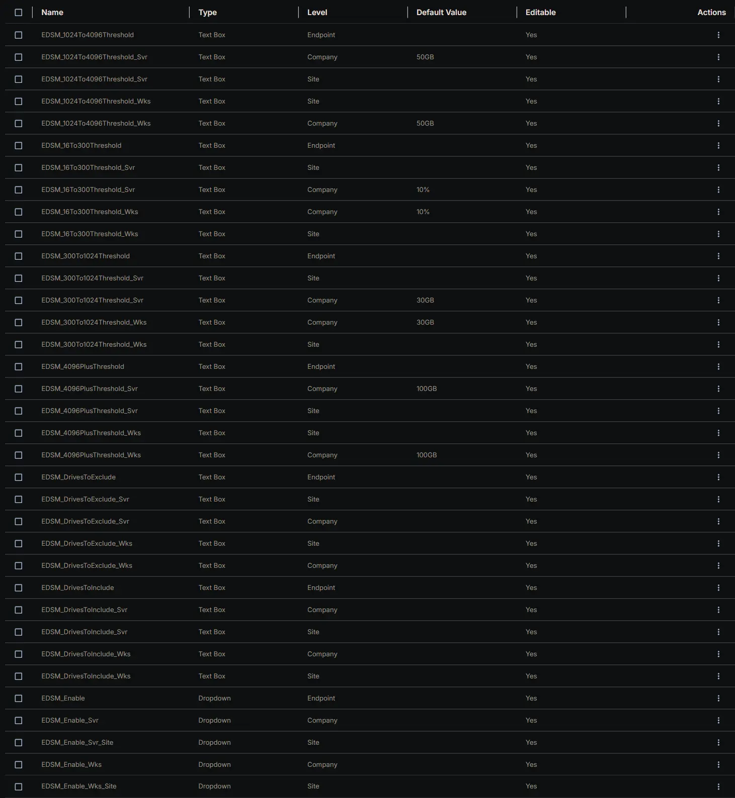

## Task Setup Path

- **Tasks Path:** `AUTOMATION` ➞ `Tasks`  
- **Task Type:** `Script Editor`  

## Task Creation

### **Description**

- **Name:** `Enhanced Drive Space Monitoring`  
- **Description:** `Compares local drive free space against hierarchically defined custom thresholds based on disk capacity and outputs a formatted status string.`  
- **Category:** `Monitoring`

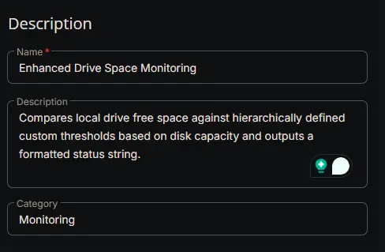

### **Script Editor**

### Row 1 Function: Set Pre-defined Variable ( @compName@ = friendlyName )

- **Notes:** `compName = Endpoint > Asset > FriendlyName`  
- **Continue on Failure:** `False`  
- **Operating System:** `Windows`  
- **Variable Name:** `compName`  
- **System Variable:** `Endpoint` → `Asset` → `FriendlyName`

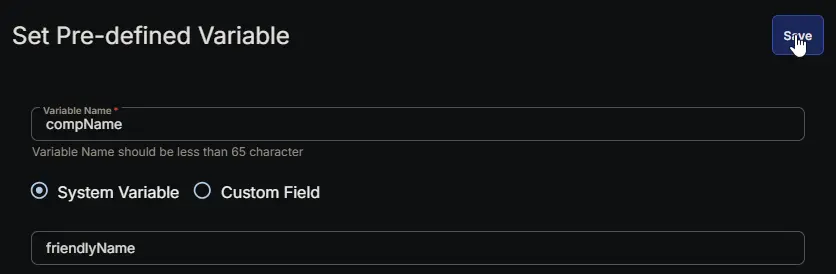

### Row 2 Function: Set Pre-defined Variable ( @computerLevel16To300Threshold@ = EDSM_16To300Threshold  )

- **Notes:** `computerLevel16To300Threshold`
- **Continue on Failure:** `False`
- **Operating System:** `Windows`
- **Variable Name:** `computerLevel16To300Threshold`
- **Custom Field:** `EDSM_16To300Threshold (STRING - ENDPOINT)`

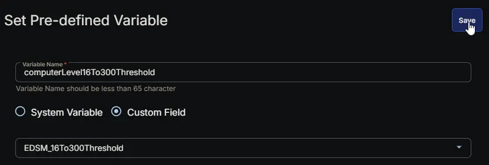

### Row 3 Function: Set Pre-defined Variable ( @computerLevel300to1024Threshold@ = EDSM_300To1024Threshold  )

- **Notes:** `computerLevel300to1024Threshold`
- **Continue on Failure:** `False`
- **Operating System:** `Windows`
- **Variable Name:** `computerLevel300to1024Threshold`
- **Custom Field:** `EDSM_300To1024Threshold (STRING - ENDPOINT)`

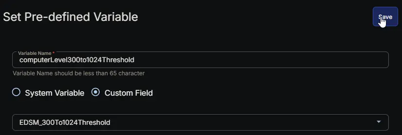

### Row 4 Function: Set Pre-defined Variable ( @computerLevel1024to4096Threshold@ = EDSM_1024To4096Threshold  )

- **Notes:** `computerLevel1024to4096Threshold`
- **Continue on Failure:** `False`
- **Operating System:** `Windows`
- **Variable Name:** `computerLevel1024to4096Threshold`
- **Custom Field:** `EDSM_1024To4096Threshold (STRING - ENDPOINT)`

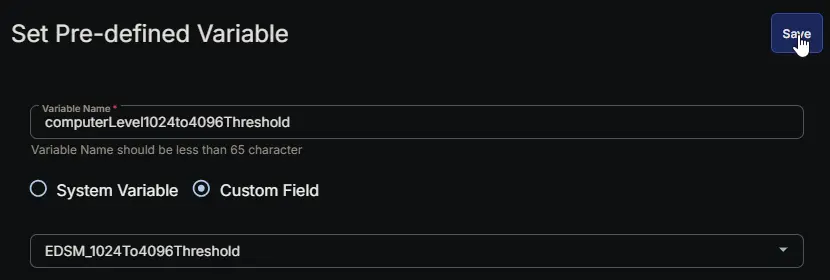

### Row 5 Function: Set Pre-defined Variable ( @computerLevel4096PlusThreshold@ = EDSM_4096PlusThreshold  )

- **Notes:** `computerLevel4096PlusThreshold`
- **Continue on Failure:** `False`
- **Operating System:** `Windows`
- **Variable Name:** `computerLevel4096PlusThreshold`
- **Custom Field:** `EDSM_4096PlusThreshold (STRING - ENDPOINT)`

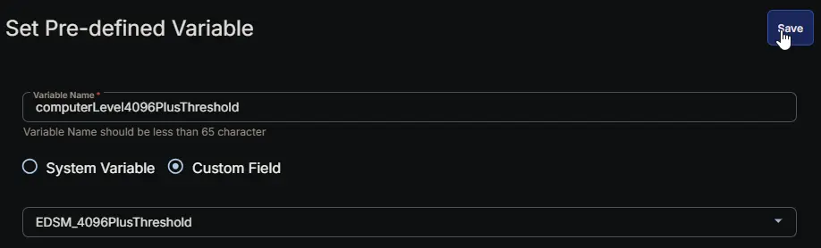

### Row 6 Function: Set Pre-defined Variable ( @computerLevelDrivesToInclude@ = EDSM_DrivesToInclude  )

- **Notes:** `computerLevelDrivesToInclude`
- **Continue on Failure:** `False`
- **Operating System:** `Windows`
- **Variable Name:** `computerLevelDrivesToInclude`
- **Custom Field:** `EDSM_DrivesToInclude (STRING - ENDPOINT)`


### Row 7 Function: Set Pre-defined Variable ( @computerLevelDrivesToExclude@ = EDSM_DrivesToExclude  )

- **Notes:** `computerLevelDrivesToExclude`
- **Continue on Failure:** `False`
- **Operating System:** `Windows`
- **Variable Name:** `computerLevelDrivesToExclude`
- **Custom Field:** `EDSM_DrivesToExclude (STRING - ENDPOINT)`

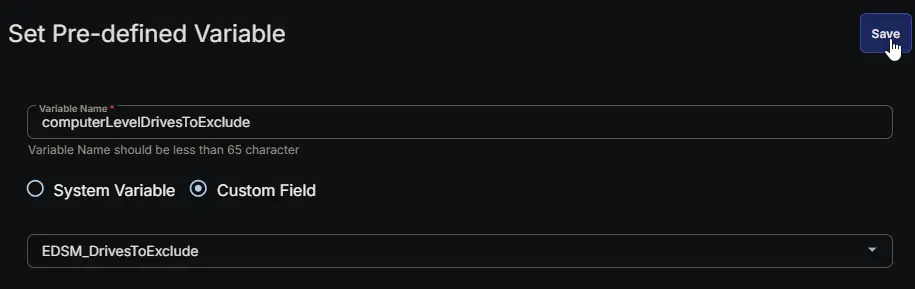

### Row 8 Function: Set Pre-defined Variable ( @locationLevel16To300Threshold_Svr@ = EDSM_16To300Threshold_Svr  )

- **Notes:** `locationLevel16To300Threshold_Svr`
- **Continue on Failure:** `False`
- **Operating System:** `Windows`
- **Variable Name:** `locationLevel16To300Threshold_Svr`
- **Custom Field:** `EDSM_16To300Threshold_Svr (STRING - SITE)`


### Row 9 Function: Set Pre-defined Variable ( @locationLevel16To300Threshold_Wks@ = EDSM_16To300Threshold_Wks  )

- **Notes:** `locationLevel16To300Threshold_Wks`
- **Continue on Failure:** `False`
- **Operating System:** `Windows`
- **Variable Name:** `locationLevel16To300Threshold_Wks`
- **Custom Field:** `EDSM_16To300Threshold_Wks (STRING - SITE)`

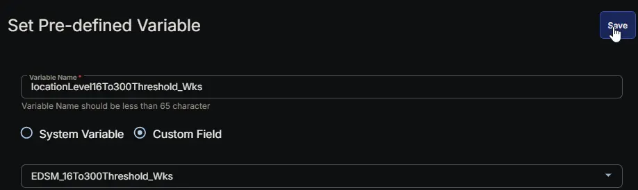

### Row 10 Function: Set Pre-defined Variable ( @locationLevel300to1024Threshold_Svr@ = EDSM_300To1024Threshold_Svr  )

- **Notes:** `locationLevel300to1024Threshold_Svr`
- **Continue on Failure:** `False`
- **Operating System:** `Windows`
- **Variable Name:** `locationLevel300to1024Threshold_Svr`
- **Custom Field:** `EDSM_300To1024Threshold_Svr (STRING - SITE)`

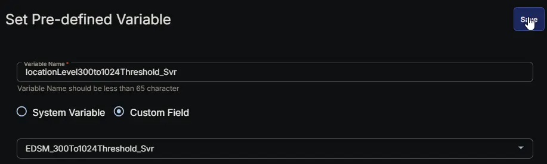

### Row 11 Function: Set Pre-defined Variable ( @locationLevel300to1024Threshold_Wks@ = EDSM_300To1024Threshold_Wks  )

- **Notes:** `locationLevel300to1024Threshold_Wks`
- **Continue on Failure:** `False`
- **Operating System:** `Windows`
- **Variable Name:** `locationLevel300to1024Threshold_Wks`
- **Custom Field:** `EDSM_300To1024Threshold_Wks (STRING - SITE)`

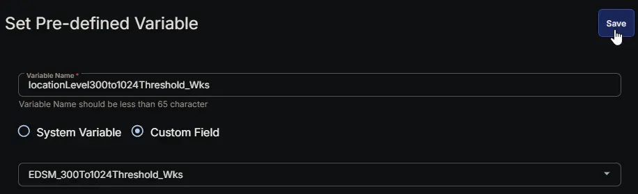

### Row 12 Function: Set Pre-defined Variable ( @locationLevel1024to4096Threshold_Svr@ = EDSM_1024To4096Threshold_Svr  )

- **Notes:** `locationLevel1024to4096Threshold_Svr`
- **Continue on Failure:** `False`
- **Operating System:** `Windows`
- **Variable Name:** `locationLevel1024to4096Threshold_Svr`
- **Custom Field:** `EDSM_1024To4096Threshold_Svr (STRING - SITE)`

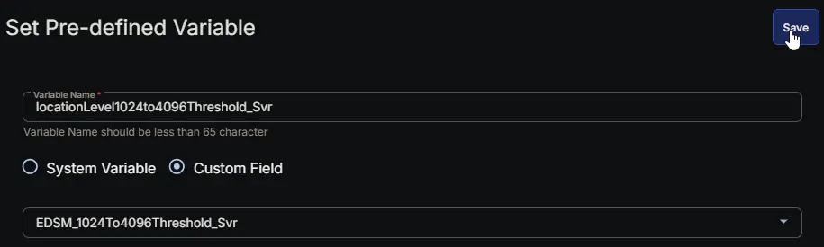

### Row 13 Function: Set Pre-defined Variable ( @locationLevel1024to4096Threshold_Wks@ = EDSM_1024To4096Threshold_Wks  )

- **Notes:** `locationLevel1024to4096Threshold_Wks`
- **Continue on Failure:** `False`
- **Operating System:** `Windows`
- **Variable Name:** `locationLevel1024to4096Threshold_Wks`
- **Custom Field:** `EDSM_1024To4096Threshold_Wks (STRING - SITE)`


### Row 14 Function: Set Pre-defined Variable ( @locationLevel4096PlusThreshold_Svr@ = EDSM_4096PlusThreshold_Svr  )

- **Notes:** `locationLevel4096PlusThreshold_Svr`
- **Continue on Failure:** `False`
- **Operating System:** `Windows`
- **Variable Name:** `locationLevel4096PlusThreshold_Svr`
- **Custom Field:** `EDSM_4096PlusThreshold_Svr (STRING - SITE)`

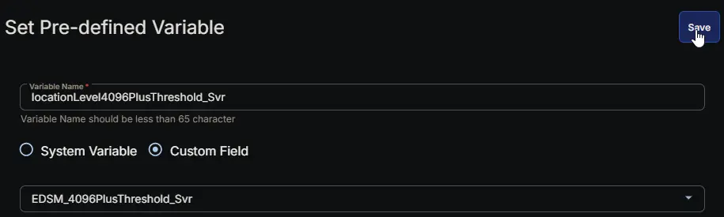

### Row 15 Function: Set Pre-defined Variable ( @locationLevel4096PlusThreshold_Wks@ = EDSM_4096PlusThreshold_Wks  )

- **Notes:** `locationLevel4096PlusThreshold_Wks`
- **Continue on Failure:** `False`
- **Operating System:** `Windows`
- **Variable Name:** `locationLevel4096PlusThreshold_Wks`
- **Custom Field:** `EDSM_4096PlusThreshold_Wks (STRING - SITE)`

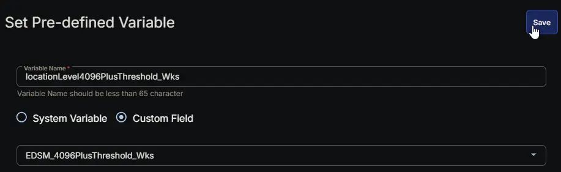

### Row 16 Function: Set Pre-defined Variable ( @locationLevelDrivesToInclude_Svr@ = EDSM_DrivesToInclude_Svr  )

- **Notes:** `locationLevelDrivesToInclude_Svr`
- **Continue on Failure:** `False`
- **Operating System:** `Windows`
- **Variable Name:** `locationLevelDrivesToInclude_Svr`
- **Custom Field:** `EDSM_DrivesToInclude_Svr (STRING - SITE)`


### Row 17 Function: Set Pre-defined Variable ( @locationLevelDrivesToInclude_Wks@ = EDSM_DrivesToInclude_Wks  )

- **Notes:** `locationLevelDrivesToInclude_Wks`
- **Continue on Failure:** `False`
- **Operating System:** `Windows`
- **Variable Name:** `locationLevelDrivesToInclude_Wks`
- **Custom Field:** `EDSM_DrivesToInclude_Wks (STRING - SITE)`

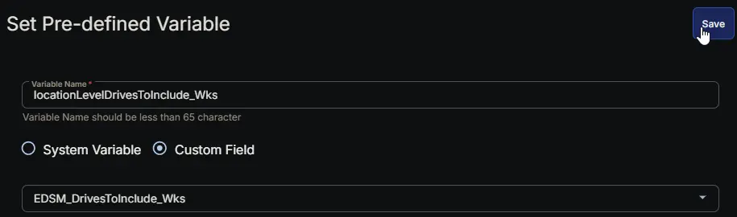

### Row 18 Function: Set Pre-defined Variable ( @locationLevelDrivesToExclude_Svr@ = EDSM_DrivesToExclude_Svr  )

- **Notes:** `locationLevelDrivesToExclude_Svr`
- **Continue on Failure:** `False`
- **Operating System:** `Windows`
- **Variable Name:** `locationLevelDrivesToExclude_Svr`
- **Custom Field:** `EDSM_DrivesToExclude_Svr (STRING - SITE)`

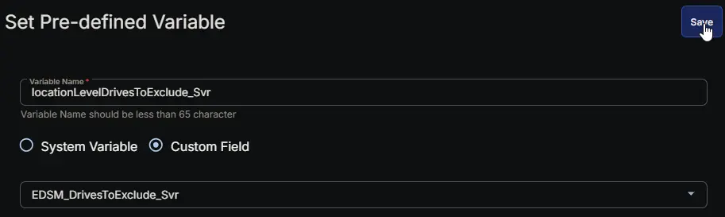

### Row 19 Function: Set Pre-defined Variable ( @locationLevelDrivesToExclude_Wks@ = EDSM_DrivesToExclude_Wks  )

- **Notes:** `locationLevelDrivesToExclude_Wks`
- **Continue on Failure:** `False`
- **Operating System:** `Windows`
- **Variable Name:** `locationLevelDrivesToExclude_Wks`
- **Custom Field:** `EDSM_DrivesToExclude_Wks (STRING - SITE)`

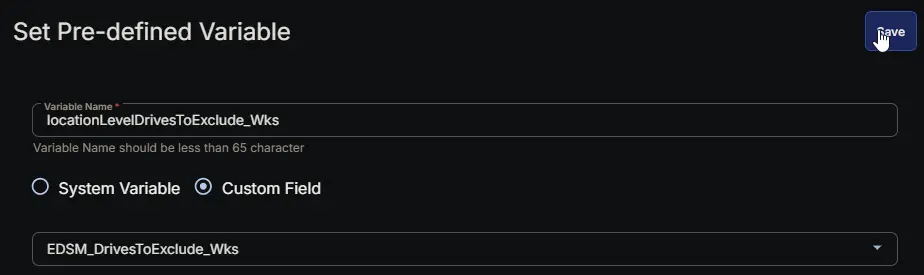

### Row 20 Function: Set Pre-defined Variable ( @clientLevel16To300Threshold_Svr@ = EDSM_16To300Threshold_Svr  )

- **Notes:** `clientLevel16To300Threshold_Svr`
- **Continue on Failure:** `False`
- **Operating System:** `Windows`
- **Variable Name:** `clientLevel16To300Threshold_Svr`
- **Custom Field:** `EDSM_16To300Threshold_Svr (STRING - COMPANY)`

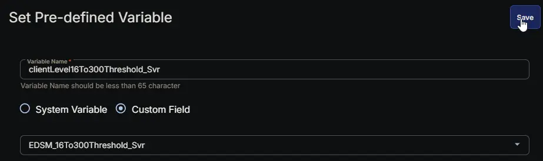

### Row 21 Function: Set Pre-defined Variable ( @clientLevel16To300Threshold_Wks@ = EDSM_16To300Threshold_Wks  )

- **Notes:** `clientLevel16To300Threshold_Wks`
- **Continue on Failure:** `False`
- **Operating System:** `Windows`
- **Variable Name:** `clientLevel16To300Threshold_Wks`
- **Custom Field:** `EDSM_16To300Threshold_Wks (STRING - COMPANY)`

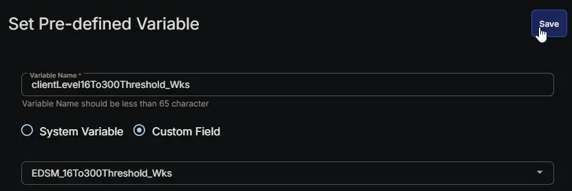

### Row 22 Function: Set Pre-defined Variable ( @clientLevel300to1024Threshold_Svr@ = EDSM_300To1024Threshold_Svr  )

- **Notes:** `clientLevel300to1024Threshold_Svr`
- **Continue on Failure:** `False`
- **Operating System:** `Windows`
- **Variable Name:** `clientLevel300to1024Threshold_Svr`
- **Custom Field:** `EDSM_300To1024Threshold_Svr (STRING - COMPANY)`

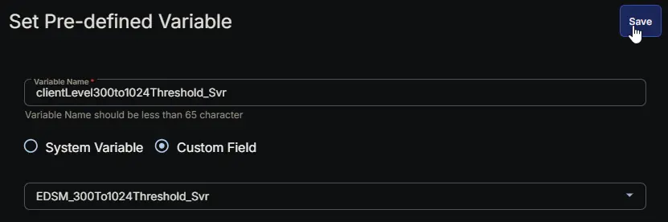

### Row 23 Function: Set Pre-defined Variable ( @clientLevel300to1024Threshold_Wks@ = EDSM_300To1024Threshold_Wks  )

- **Notes:** `clientLevel300to1024Threshold_Wks`
- **Continue on Failure:** `False`
- **Operating System:** `Windows`
- **Variable Name:** `clientLevel300to1024Threshold_Wks`
- **Custom Field:** `EDSM_300To1024Threshold_Wks (STRING - COMPANY)`

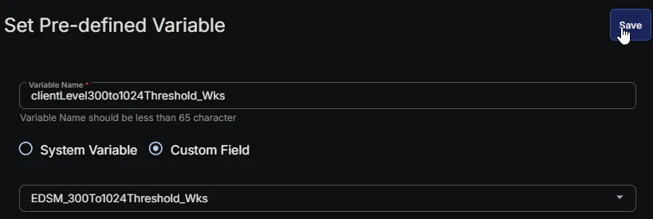

### Row 24 Function: Set Pre-defined Variable ( @clientLevel1024to4096Threshold_Svr@ = EDSM_1024To4096Threshold_Svr  )

- **Notes:** `clientLevel1024to4096Threshold_Svr`
- **Continue on Failure:** `False`
- **Operating System:** `Windows`
- **Variable Name:** `clientLevel1024to4096Threshold_Svr`
- **Custom Field:** `EDSM_1024To4096Threshold_Svr (STRING - COMPANY)`

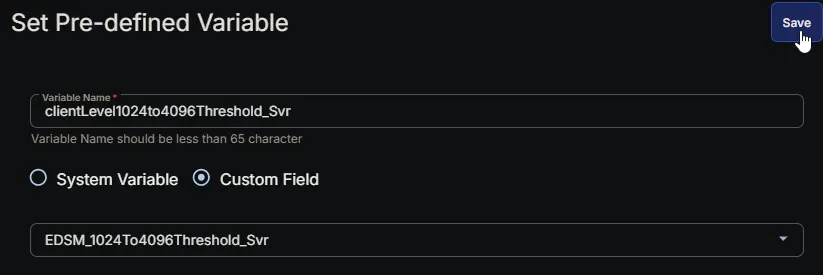

### Row 25 Function: Set Pre-defined Variable ( @clientLevel1024to4096Threshold_Wks@ = EDSM_1024To4096Threshold_Wks  )

- **Notes:** `clientLevel1024to4096Threshold_Wks`
- **Continue on Failure:** `False`
- **Operating System:** `Windows`
- **Variable Name:** `clientLevel1024to4096Threshold_Wks`
- **Custom Field:** `EDSM_1024To4096Threshold_Wks (STRING - COMPANY)`

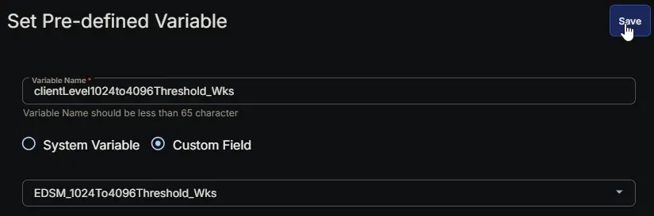

### Row 26 Function: Set Pre-defined Variable ( @clientLevel4096PlusThreshold_Svr@ = EDSM_4096PlusThreshold_Svr  )

- **Notes:** `clientLevel4096PlusThreshold_Svr`
- **Continue on Failure:** `False`
- **Operating System:** `Windows`
- **Variable Name:** `clientLevel4096PlusThreshold_Svr`
- **Custom Field:** `EDSM_4096PlusThreshold_Svr (STRING - COMPANY)`

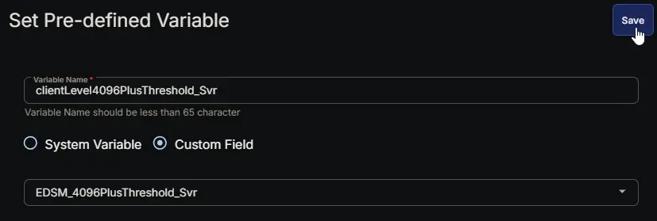

### Row 27 Function: Set Pre-defined Variable ( @clientLevel4096PlusThreshold_Wks@ = EDSM_4096PlusThreshold_Wks  )

- **Notes:** `clientLevel4096PlusThreshold_Wks`
- **Continue on Failure:** `False`
- **Operating System:** `Windows`
- **Variable Name:** `clientLevel4096PlusThreshold_Wks`
- **Custom Field:** `EDSM_4096PlusThreshold_Wks (STRING - COMPANY)`


### Row 28 Function: Set Pre-defined Variable ( @clientLevelDrivesToInclude_Svr@ = EDSM_DrivesToInclude_Svr  )

- **Notes:** `clientLevelDrivesToInclude_Svr`
- **Continue on Failure:** `False`
- **Operating System:** `Windows`
- **Variable Name:** `clientLevelDrivesToInclude_Svr`
- **Custom Field:** `EDSM_DrivesToInclude_Svr (STRING - COMPANY)`

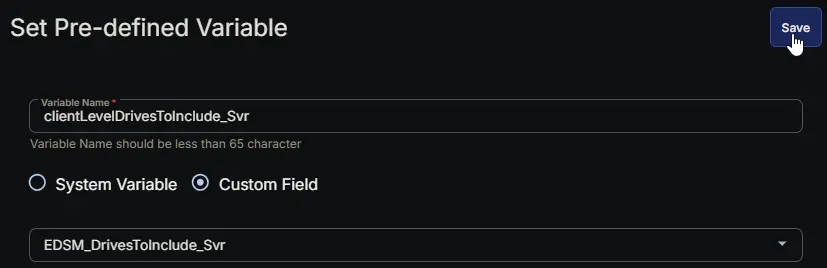

### Row 29 Function: Set Pre-defined Variable ( @clientLevelDrivesToInclude_Wks@ = EDSM_DrivesToInclude_Wks  )

- **Notes:** `clientLevelDrivesToInclude_Wks`
- **Continue on Failure:** `False`
- **Operating System:** `Windows`
- **Variable Name:** `clientLevelDrivesToInclude_Wks`
- **Custom Field:** `EDSM_DrivesToInclude_Wks (STRING - COMPANY)`

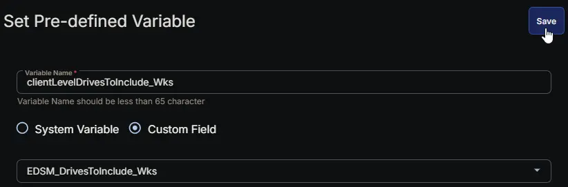

### Row 30 Function: Set Pre-defined Variable ( @clientLevelDrivesToExclude_Svr@ = EDSM_DrivesToExclude_Svr  )

- **Notes:** `clientLevelDrivesToExclude_Svr`
- **Continue on Failure:** `False`
- **Operating System:** `Windows`
- **Variable Name:** `clientLevelDrivesToExclude_Svr`
- **Custom Field:** `EDSM_DrivesToExclude_Svr (STRING - COMPANY)`

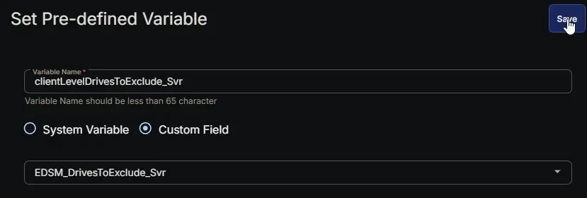

### Row 31 Function: Set Pre-defined Variable ( @clientLevelDrivesToExclude_Wks@ = EDSM_DrivesToExclude_Wks  )

- **Notes:** `clientLevelDrivesToExclude_Wks`
- **Continue on Failure:** `False`
- **Operating System:** `Windows`
- **Variable Name:** `clientLevelDrivesToExclude_Wks`
- **Custom Field:** `EDSM_DrivesToExclude_Wks (STRING - COMPANY)`

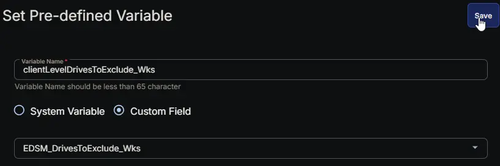

#### Row 32 Function: PowerShell script

- **Notes:** `<Leave it Blank>`  
- **Use Generative AI Assist for script creation:** `False`  
- **Expected time of script execution in seconds:** `300`  
- **Continue on Failure:** `False`  
- **Run As:** `System`  
- **Operating System:** `Windows`  
- **PowerShell Script Editor:**

```PowerShell
<#
.SYNOPSIS
    Monitors local drive space against customizable thresholds based on total disk capacity, utilizing CW RMM hierarchical custom fields (Endpoint, Site, Company).

.DESCRIPTION
    This script automates the monitoring of local drive storage by evaluating capacity-specific thresholds mapped to hierarchical data in CW RMM. 

    The workflow is:

    1. Hierarchy Evaluation:
       - Evaluates thresholds and inclusion/exclusion lists from CW RMM custom fields.
       - Prioritizes Endpoint-level data over Site-level, and Site-level over Company-level.
       - Dynamically detects OS type (Server vs. Workstation) to apply the correct Company/Site thresholds.

    2. Drive Filtering:
       - Discovers all local logical drives.
       - Evaluates the targeted drives against the inclusion list (e.g., CDEF, All, None).
       - Excludes drives matching the exclusion list (e.g., Z, All, None).
       - Halts execution gracefully if configuration disables monitoring.

    3. Capacity Bucket Assignment:
       - Calculates the total capacity of each included drive.
       - Assigns the drive to the appropriate monitoring bucket: 16-300 GB, 300-1024 GB, 1024-4096 GB, or 4096+ GB.

    4. Threshold Comparison:
       - Parses the threshold string to determine the target limit and unit (Percent, MB, or GB).
       - Calculates current drive usage and free space.
       - Skips drives where the assigned threshold is 0.
       - Flags drives where the available free space drops below the limit.

    5. Status Reporting:
       - Compiles the findings into a single, highly readable text output.
       - Returns a clear success string if no limits are breached.
       - Returns a formatted list detailing drive letter, total space, used space, free space, and the violated threshold if low space is detected.

.COMPONENT
    ------------------------------------------------------------------------
    CW RMM Task Custom Field Mapping
    ------------------------------------------------------------------------

| Name | Description | Level | Type | Help Text | Default Value | Editable |
|---|---|---|---|---|---|---|
| EDSM_16To300Threshold_Svr | Defines Company baseline limit for 16-300 GB drives on Servers. Overridden if Site or Endpoint limit exists. | Company | Text Box | Enter X%, XMB, or XGB (e.g., 10%, 500MB). Set to 0 to disable. Name must match across levels. | 10% | Yes |
| EDSM_16To300Threshold_Wks | Defines Company baseline limit for 16-300 GB drives on Workstations. Overridden if Site or Endpoint limit exists. | Company | Text Box | Enter X%, XMB, or XGB. Set to 0 to disable. Name must match across levels. | 10% | Yes |
| EDSM_16To300Threshold_Svr | Defines Site-level limit for 16-300 GB drives on Servers. Overrides Company level, but overridden by Endpoint. | Site | Text Box | Enter X%, XMB, or XGB. Set to 0 to disable. Name must match across levels. | | Yes |
| EDSM_16To300Threshold_Wks | Defines Site-level limit for 16-300 GB drives on Workstations. Overrides Company level, but overridden by Endpoint. | Site | Text Box | Enter X%, XMB, or XGB. Set to 0 to disable. Name must match across levels. | | Yes |
| EDSM_16To300Threshold | Defines Endpoint-level limit for 16-300 GB drives. Overrides any Site or Company level setting. | Endpoint | Text Box | Enter X%, XMB, or XGB. Set to 0 to disable. Name must match across levels. | | Yes |
| EDSM_300To1024Threshold_Svr | Defines Company baseline limit for 300-1024 GB drives on Servers. Overridden if Site or Endpoint limit exists. | Company | Text Box | Enter X%, XMB, or XGB. Set to 0 to disable. Name must match across levels. | 30GB | Yes |
| EDSM_300To1024Threshold_Wks | Defines Company baseline limit for 300-1024 GB drives on Workstations. Overridden if Site or Endpoint limit exists. | Company | Text Box | Enter X%, XMB, or XGB. Set to 0 to disable. Name must match across levels. | 30GB | Yes |
| EDSM_300To1024Threshold_Svr | Defines Site-level limit for 300-1024 GB drives on Servers. Overrides Company level, but overridden by Endpoint. | Site | Text Box | Enter X%, XMB, or XGB. Set to 0 to disable. Name must match across levels. | | Yes |
| EDSM_300To1024Threshold_Wks | Defines Site-level limit for 300-1024 GB drives on Workstations. Overrides Company level, but overridden by Endpoint. | Site | Text Box | Enter X%, XMB, or XGB. Set to 0 to disable. Name must match across levels. | | Yes |
| EDSM_300To1024Threshold | Defines Endpoint-level limit for 300-1024 GB drives. Overrides any Site or Company level setting. | Endpoint | Text Box | Enter X%, XMB, or XGB. Set to 0 to disable. Name must match across levels. | | Yes |
| EDSM_1024To4096Threshold_Svr | Defines Company baseline limit for 1024-4096 GB drives on Servers. Overridden if Site or Endpoint limit exists. | Company | Text Box | Enter X%, XMB, or XGB. Set to 0 to disable. Name must match across levels. | 50GB | Yes |
| EDSM_1024To4096Threshold_Wks | Defines Company baseline limit for 1024-4096 GB drives on Workstations. Overridden if Site or Endpoint limit exists. | Company | Text Box | Enter X%, XMB, or XGB. Set to 0 to disable. Name must match across levels. | 50GB | Yes |
| EDSM_1024To4096Threshold_Svr | Defines Site-level limit for 1024-4096 GB drives on Servers. Overrides Company level, but overridden by Endpoint. | Site | Text Box | Enter X%, XMB, or XGB. Set to 0 to disable. Name must match across levels. | | Yes |
| EDSM_1024To4096Threshold_Wks | Defines Site-level limit for 1024-4096 GB drives on Workstations. Overrides Company level, but overridden by Endpoint. | Site | Text Box | Enter X%, XMB, or XGB. Set to 0 to disable. Name must match across levels. | | Yes |
| EDSM_1024To4096Threshold | Defines Endpoint-level limit for 1024-4096 GB drives. Overrides any Site or Company level setting. | Endpoint | Text Box | Enter X%, XMB, or XGB. Set to 0 to disable. Name must match across levels. | | Yes |
| EDSM_4096PlusThreshold_Svr | Defines Company baseline limit for 4096+ GB drives on Servers. Overridden if Site or Endpoint limit exists. | Company | Text Box | Enter X%, XMB, or XGB. Set to 0 to disable. Name must match across levels. | 100GB | Yes |
| EDSM_4096PlusThreshold_Wks | Defines Company baseline limit for 4096+ GB drives on Workstations. Overridden if Site or Endpoint limit exists. | Company | Text Box | Enter X%, XMB, or XGB. Set to 0 to disable. Name must match across levels. | 100GB | Yes |
| EDSM_4096PlusThreshold_Svr | Defines Site-level limit for 4096+ GB drives on Servers. Overrides Company level, but overridden by Endpoint. | Site | Text Box | Enter X%, XMB, or XGB. Set to 0 to disable. Name must match across levels. | | Yes |
| EDSM_4096PlusThreshold_Wks | Defines Site-level limit for 4096+ GB drives on Workstations. Overrides Company level, but overridden by Endpoint. | Site | Text Box | Enter X%, XMB, or XGB. Set to 0 to disable. Name must match across levels. | | Yes |
| EDSM_4096PlusThreshold | Defines Endpoint-level limit for 4096+ GB drives. Overrides any Site or Company level setting. | Endpoint | Text Box | Enter X%, XMB, or XGB. Set to 0 to disable. Name must match across levels. | | Yes |
| EDSM_DrivesToInclude_Svr | Specifies Company baseline server drive letters to monitor. Overridden if Site or Endpoint list exists. | Company | Text Box | Enter sequential letters (e.g., CDEF), All, or None. Name must match exactly. | | Yes |
| EDSM_DrivesToInclude_Wks | Specifies Company baseline workstation drive letters to monitor. Overridden if Site or Endpoint list exists. | Company | Text Box | Enter sequential letters (e.g., CDEF), All, or None. Name must match exactly. | | Yes |
| EDSM_DrivesToInclude_Svr | Specifies Site-level server drive letters to monitor. Overrides Company level, but overridden by Endpoint. | Site | Text Box | Enter sequential letters (e.g., CDEF), All, or None. Name must match exactly. | | Yes |
| EDSM_DrivesToInclude_Wks | Specifies Site-level workstation drive letters to monitor. Overrides Company level, but overridden by Endpoint. | Site | Text Box | Enter sequential letters (e.g., CDEF), All, or None. Name must match exactly. | | Yes |
| EDSM_DrivesToInclude | Specifies Endpoint-level drive letters to monitor. Overrides any Site or Company level setting. | Endpoint | Text Box | Enter sequential letters (e.g., CDEF), All, or None. Name must match exactly. | | Yes |
| EDSM_DrivesToExclude_Svr | Specifies Company baseline server drive letters to ignore. Overridden if Site or Endpoint list exists. | Company | Text Box | Enter sequential letters (e.g., Z), None, or All. Name must match exactly. | | Yes |
| EDSM_DrivesToExclude_Wks | Specifies Company baseline workstation drive letters to ignore. Overridden if Site or Endpoint list exists. | Company | Text Box | Enter sequential letters (e.g., Z), None, or All. Name must match exactly. | | Yes |
| EDSM_DrivesToExclude_Svr | Specifies Site-level server drive letters to ignore. Overrides Company level, but overridden by Endpoint. | Site | Text Box | Enter sequential letters (e.g., Z), None, or All. Name must match exactly. | | Yes |
| EDSM_DrivesToExclude_Wks | Specifies Site-level workstation drive letters to ignore. Overrides Company level, but overridden by Endpoint. | Site | Text Box | Enter sequential letters (e.g., Z), None, or All. Name must match exactly. | | Yes |
| EDSM_DrivesToExclude | Specifies Endpoint-level drive letters to ignore. Overrides any Site or Company level setting. | Endpoint | Text Box | Enter sequential letters (e.g., Z), None, or All. Name must match exactly. | | Yes |

    ------------------------------------------------------------------------
    CW RMM Enablement Custom Field Mapping
    ------------------------------------------------------------------------

| Name | Description | Level | Type | Option Type | Options | Help Text | Default Value | Editable |
|---|---|---|---|---|---|---|---|---|
| EDSM_Enable_Svr | Enables or disables drive space monitoring for servers at the Company level. Overridden by Site or Endpoint settings. | Company | Dropdown | String | Enable, Disable | Select Enable to turn on monitoring, Disable to exclude. | | Yes |
| EDSM_Enable_Wks | Enables or disables drive space monitoring for workstations at the Company level. Overridden by Site or Endpoint settings. | Company | Dropdown | String | Enable, Disable | Select Enable to turn on monitoring, Disable to exclude. | | Yes |
| EDSM_Enable_Svr_Site | Enables or disables drive space monitoring for servers at the Site level. Overrides Company settings, but overridden by Endpoint. | Site | Dropdown | String | Enable, Disable | Select Enable to turn on monitoring, Disable to exclude. | | Yes |
| EDSM_Enable_Wks_Site | Enables or disables drive space monitoring for workstations at the Site level. Overrides Company settings, but overridden by Endpoint. | Site | Dropdown | String | Enable, Disable | Select Enable to turn on monitoring, Disable to exclude. | | Yes |
| EDSM_Enable | Enables or disables drive space monitoring at the Endpoint level. Overrides any Company or Site settings. | Endpoint | Dropdown | String | Enable, Disable | Select Enable to turn on monitoring, Disable to exclude. | | Yes |

.NOTES
    ScriptName = Enhanced Drive Space Monitoring
    Description = Compares local drive free space against hierarchically defined custom thresholds based on disk capacity and outputs a formatted status string.

    Execution Logic = The EDSM_Enable custom fields are used in CW RMM to determine whether to run the monitoring automation.
    - The fields must be explicitly set to "Enable" to turn on the automation.
    - Hierarchical precedence dictates that lower levels override higher levels (Endpoint > Site > Company).
    - Example 1: If Company is set to "Enable", Site is set to "Disable", and Endpoint is not set, the automation is excluded for that entire site.
    - Example 2: If Company is set to "Disable", Site is set to "Disable", but the specific Endpoint is set to "Enable", the automation will run for that specific computer.

.OUTPUTS
    - Single string indicating either a healthy state or a multi-line formatted block detailing each drive that failed the threshold check.
#>

#region globals
$ProgressPreference = 'SilentlyContinue'
$WarningPreference = 'SilentlyContinue'
#endregion

#region rmm variables
# Endpoint Level (Base Variables)
$computerLevel16To300Threshold = '@computerLevel16To300Threshold@'
$computerLevel300to1024Threshold = '@computerLevel300to1024Threshold@'
$computerLevel1024to4096Threshold = '@computerLevel1024to4096Threshold@'
$computerLevel4096PlusThreshold = '@computerLevel4096PlusThreshold@'
$computerLevelDrivesToInclude = '@computerLevelDrivesToInclude@'
$computerLevelDrivesToExclude = '@computerLevelDrivesToExclude@'

# Site/Location Level (Server & Workstation splits)
$locationLevel16To300Threshold_Svr = '@locationLevel16To300Threshold_Svr@'
$locationLevel16To300Threshold_Wks = '@locationLevel16To300Threshold_Wks@'
$locationLevel300to1024Threshold_Svr = '@locationLevel300to1024Threshold_Svr@'
$locationLevel300to1024Threshold_Wks = '@locationLevel300to1024Threshold_Wks@'
$locationLevel1024to4096Threshold_Svr = '@locationLevel1024to4096Threshold_Svr@'
$locationLevel1024to4096Threshold_Wks = '@locationLevel1024to4096Threshold_Wks@'
$locationLevel4096PlusThreshold_Svr = '@locationLevel4096PlusThreshold_Svr@'
$locationLevel4096PlusThreshold_Wks = '@locationLevel4096PlusThreshold_Wks@'
$locationLevelDrivesToInclude_Svr = '@locationLevelDrivesToInclude_Svr@'
$locationLevelDrivesToInclude_Wks = '@locationLevelDrivesToInclude_Wks@'
$locationLevelDrivesToExclude_Svr = '@locationLevelDrivesToExclude_Svr@'
$locationLevelDrivesToExclude_Wks = '@locationLevelDrivesToExclude_Wks@'

# Company/Client Level (Server & Workstation splits)
$clientLevel16To300Threshold_Svr = '@clientLevel16To300Threshold_Svr@'
$clientLevel16To300Threshold_Wks = '@clientLevel16To300Threshold_Wks@'
$clientLevel300to1024Threshold_Svr = '@clientLevel300to1024Threshold_Svr@'
$clientLevel300to1024Threshold_Wks = '@clientLevel300to1024Threshold_Wks@'
$clientLevel1024to4096Threshold_Svr = '@clientLevel1024to4096Threshold_Svr@'
$clientLevel1024to4096Threshold_Wks = '@clientLevel1024to4096Threshold_Wks@'
$clientLevel4096PlusThreshold_Svr = '@clientLevel4096PlusThreshold_Svr@'
$clientLevel4096PlusThreshold_Wks = '@clientLevel4096PlusThreshold_Wks@'
$clientLevelDrivesToInclude_Svr = '@clientLevelDrivesToInclude_Svr@'
$clientLevelDrivesToInclude_Wks = '@clientLevelDrivesToInclude_Wks@'
$clientLevelDrivesToExclude_Svr = '@clientLevelDrivesToExclude_Svr@'
$clientLevelDrivesToExclude_Wks = '@clientLevelDrivesToExclude_Wks@'
#endregion

#region os detection & variable mapping
$osInfo = Get-CimInstance -ClassName 'Win32_OperatingSystem' -ErrorAction SilentlyContinue
$isServer = $osInfo.ProductType -ne 1

if ($isServer) {
    $clientLevel16To300Threshold = $clientLevel16To300Threshold_Svr
    $locationLevel16To300Threshold = $locationLevel16To300Threshold_Svr
    $clientLevel300to1024Threshold = $clientLevel300to1024Threshold_Svr
    $locationLevel300to1024Threshold = $locationLevel300to1024Threshold_Svr
    $clientLevel1024to4096Threshold = $clientLevel1024to4096Threshold_Svr
    $locationLevel1024to4096Threshold = $locationLevel1024to4096Threshold_Svr
    $clientLevel4096PlusThreshold = $clientLevel4096PlusThreshold_Svr
    $locationLevel4096PlusThreshold = $locationLevel4096PlusThreshold_Svr
    $clientLevelDrivesToInclude = $clientLevelDrivesToInclude_Svr
    $locationLevelDrivesToInclude = $locationLevelDrivesToInclude_Svr
    $clientLevelDrivesToExclude = $clientLevelDrivesToExclude_Svr
    $locationLevelDrivesToExclude = $locationLevelDrivesToExclude_Svr
} else {
    $clientLevel16To300Threshold = $clientLevel16To300Threshold_Wks
    $locationLevel16To300Threshold = $locationLevel16To300Threshold_Wks
    $clientLevel300to1024Threshold = $clientLevel300to1024Threshold_Wks
    $locationLevel300to1024Threshold = $locationLevel300to1024Threshold_Wks
    $clientLevel1024to4096Threshold = $clientLevel1024to4096Threshold_Wks
    $locationLevel1024to4096Threshold = $locationLevel1024to4096Threshold_Wks
    $clientLevel4096PlusThreshold = $clientLevel4096PlusThreshold_Wks
    $locationLevel4096PlusThreshold = $locationLevel4096PlusThreshold_Wks
    $clientLevelDrivesToInclude = $clientLevelDrivesToInclude_Wks
    $locationLevelDrivesToInclude = $locationLevelDrivesToInclude_Wks
    $clientLevelDrivesToExclude = $clientLevelDrivesToExclude_Wks
    $locationLevelDrivesToExclude = $locationLevelDrivesToExclude_Wks
}
#endregion

#region set thresholds based on rmm variables
[int]$16To300Threshold = if (-not [string]::IsNullOrEmpty($computerLevel16To300Threshold) -and $computerLevel16To300Threshold -notmatch 'computerLevel16To300Threshold' -and $computerLevel16To300Threshold -match '^([1-9]\d?%|[1-9]\d*[MG]B)$') {
    [regex]::Match($computerLevel16To300Threshold, '[1-9]\d*').Value
} elseif (-not [string]::IsNullOrEmpty($locationLevel16To300Threshold) -and $locationLevel16To300Threshold -notmatch 'locationLevel16To300Threshold' -and $locationLevel16To300Threshold -match '^([1-9]\d?%|[1-9]\d*[MG]B)$') {
    [regex]::Match($locationLevel16To300Threshold, '[1-9]\d*').Value
} elseif (-not [string]::IsNullOrEmpty($clientLevel16To300Threshold) -and $clientLevel16To300Threshold -notmatch 'clientLevel16To300Threshold' -and $clientLevel16To300Threshold -match '^([1-9]\d?%|[1-9]\d*[MG]B)$') {
    [regex]::Match($clientLevel16To300Threshold, '[1-9]\d*').Value
} else {
    0
}
$16To300Unit = if ($computerLevel16To300Threshold -match '[1-9]\d?%') {
    'Percent'
} elseif ($computerLevel16To300Threshold -match '[1-9]\d*MB') {
    'MB'
} elseif ($computerLevel16To300Threshold -match '[1-9]\d*GB') {
    'GB'
} elseif ($locationLevel16To300Threshold -match '[1-9]\d?%') {
    'Percent'
} elseif ($locationLevel16To300Threshold -match '[1-9]\d*MB') {
    'MB'
} elseif ($locationLevel16To300Threshold -match '[1-9]\d*GB') {
    'GB'
} elseif ($clientLevel16To300Threshold -match '[1-9]\d?%') {
    'Percent'
} elseif ($clientLevel16To300Threshold -match '[1-9]\d*MB') {
    'MB'
} elseif ($clientLevel16To300Threshold -match '[1-9]\d*GB') {
    'GB'
} else {
    ''
}

[int]$300To1024Threshold = if (-not [string]::IsNullOrEmpty($computerLevel300to1024Threshold) -and $computerLevel300to1024Threshold -notmatch 'computerLevel300to1024Threshold' -and $computerLevel300to1024Threshold -match '^([1-9]\d?%|[1-9]\d*[MG]B)$') {
    [regex]::Match($computerLevel300to1024Threshold, '[1-9]\d*').Value
} elseif (-not [string]::IsNullOrEmpty($locationLevel300to1024Threshold) -and $locationLevel300to1024Threshold -notmatch 'locationLevel300to1024Threshold' -and $locationLevel300to1024Threshold -match '^([1-9]\d?%|[1-9]\d*[MG]B)$') {
    [regex]::Match($locationLevel300to1024Threshold, '[1-9]\d*').Value
} elseif (-not [string]::IsNullOrEmpty($clientLevel300to1024Threshold) -and $clientLevel300to1024Threshold -notmatch 'clientLevel300to1024Threshold' -and $clientLevel300to1024Threshold -match '^([1-9]\d?%|[1-9]\d*[MG]B)$') {
    [regex]::Match($clientLevel300to1024Threshold, '[1-9]\d*').Value
} else {
    0
}
$300To1024Unit = if ($computerLevel300to1024Threshold -match '[1-9]\d?%') {
    'Percent'
} elseif ($computerLevel300to1024Threshold -match '[1-9]\d*MB') {
    'MB'
} elseif ($computerLevel300to1024Threshold -match '[1-9]\d*GB') {
    'GB'
} elseif ($locationLevel300to1024Threshold -match '[1-9]\d?%') {
    'Percent'
} elseif ($locationLevel300to1024Threshold -match '[1-9]\d*MB') {
    'MB'
} elseif ($locationLevel300to1024Threshold -match '[1-9]\d*GB') {
    'GB'
} elseif ($clientLevel300to1024Threshold -match '[1-9]\d?%') {
    'Percent'
} elseif ($clientLevel300to1024Threshold -match '[1-9]\d*MB') {
    'MB'
} elseif ($clientLevel300to1024Threshold -match '[1-9]\d*GB') {
    'GB'
} else {
    ''
}

[int]$1024To4096Threshold = if (-not [string]::IsNullOrEmpty($computerLevel1024to4096Threshold) -and $computerLevel1024to4096Threshold -notmatch 'computerLevel1024to4096Threshold' -and $computerLevel1024to4096Threshold -match '^([1-9]\d?%|[1-9]\d*[MG]B)$') {
    [regex]::Match($computerLevel1024to4096Threshold, '[1-9]\d*').Value
} elseif (-not [string]::IsNullOrEmpty($locationLevel1024to4096Threshold) -and $locationLevel1024to4096Threshold -notmatch 'locationLevel1024to4096Threshold' -and $locationLevel1024to4096Threshold -match '^([1-9]\d?%|[1-9]\d*[MG]B)$') {
    [regex]::Match($locationLevel1024to4096Threshold, '[1-9]\d*').Value
} elseif (-not [string]::IsNullOrEmpty($clientLevel1024to4096Threshold) -and $clientLevel1024to4096Threshold -notmatch 'clientLevel1024to4096Threshold' -and $clientLevel1024to4096Threshold -match '^([1-9]\d?%|[1-9]\d*[MG]B)$') {
    [regex]::Match($clientLevel1024to4096Threshold, '[1-9]\d*').Value
} else {
    0
}
$1024To4096Unit = if ($computerLevel1024to4096Threshold -match '[1-9]\d?%') {
    'Percent'
} elseif ($computerLevel1024to4096Threshold -match '[1-9]\d*MB') {
    'MB'
} elseif ($computerLevel1024to4096Threshold -match '[1-9]\d*GB') {
    'GB'
} elseif ($locationLevel1024to4096Threshold -match '[1-9]\d?%') {
    'Percent'
} elseif ($locationLevel1024to4096Threshold -match '[1-9]\d*MB') {
    'MB'
} elseif ($locationLevel1024to4096Threshold -match '[1-9]\d*GB') {
    'GB'
} elseif ($clientLevel1024to4096Threshold -match '[1-9]\d?%') {
    'Percent'
} elseif ($clientLevel1024to4096Threshold -match '[1-9]\d*MB') {
    'MB'
} elseif ($clientLevel1024to4096Threshold -match '[1-9]\d*GB') {
    'GB'
} else {
    ''
}

[int]$4096PlusThreshold = if (-not [string]::IsNullOrEmpty($computerLevel4096PlusThreshold) -and $computerLevel4096PlusThreshold -notmatch 'computerLevel4096PlusThreshold' -and $computerLevel4096PlusThreshold -match '^([1-9]\d?%|[1-9]\d*[MG]B)$') {
    [regex]::Match($computerLevel4096PlusThreshold, '[1-9]\d*').Value
} elseif (-not [string]::IsNullOrEmpty($locationLevel4096PlusThreshold) -and $locationLevel4096PlusThreshold -notmatch 'locationLevel4096PlusThreshold' -and $locationLevel4096PlusThreshold -match '^([1-9]\d?%|[1-9]\d*[MG]B)$') {
    [regex]::Match($locationLevel4096PlusThreshold, '[1-9]\d*').Value
} elseif (-not [string]::IsNullOrEmpty($clientLevel4096PlusThreshold) -and $clientLevel4096PlusThreshold -notmatch 'clientLevel4096PlusThreshold' -and $clientLevel4096PlusThreshold -match '^([1-9]\d?%|[1-9]\d*[MG]B)$') {
    [regex]::Match($clientLevel4096PlusThreshold, '[1-9]\d*').Value
} else {
    0
}
$4096PlusUnit = if ($computerLevel4096PlusThreshold -match '[1-9]\d?%') {
    'Percent'
} elseif ($computerLevel4096PlusThreshold -match '[1-9]\d*MB') {
    'MB'
} elseif ($computerLevel4096PlusThreshold -match '[1-9]\d*GB') {
    'GB'
} elseif ($locationLevel4096PlusThreshold -match '[1-9]\d?%') {
    'Percent'
} elseif ($locationLevel4096PlusThreshold -match '[1-9]\d*MB') {
    'MB'
} elseif ($locationLevel4096PlusThreshold -match '[1-9]\d*GB') {
    'GB'
} elseif ($clientLevel4096PlusThreshold -match '[1-9]\d?%') {
    'Percent'
} elseif ($clientLevel4096PlusThreshold -match '[1-9]\d*MB') {
    'MB'
} elseif ($clientLevel4096PlusThreshold -match '[1-9]\d*GB') {
    'GB'
} else {
    ''
}

$includedDrives = if (-not [string]::IsNullOrEmpty($computerLevelDrivesToInclude) -and $computerLevelDrivesToInclude -notmatch 'computerLevelDrivesToInclude') {
    $computerLevelDrivesToInclude
} elseif (-not [string]::IsNullOrEmpty($locationLevelDrivesToInclude) -and $locationLevelDrivesToInclude -notmatch 'locationLevelDrivesToInclude') {
    $locationLevelDrivesToInclude
} elseif (-not [string]::IsNullOrEmpty($clientLevelDrivesToInclude) -and $clientLevelDrivesToInclude -notmatch 'clientLevelDrivesToInclude') {
    $clientLevelDrivesToInclude
} else {
    'All'
}

$excludedDrives = if (-not [string]::IsNullOrEmpty($computerLevelDrivesToExclude) -and $computerLevelDrivesToExclude -notmatch 'computerLevelDrivesToExclude') {
    $computerLevelDrivesToExclude
} elseif (-not [string]::IsNullOrEmpty($locationLevelDrivesToExclude) -and $locationLevelDrivesToExclude -notmatch 'locationLevelDrivesToExclude') {
    $locationLevelDrivesToExclude
} elseif (-not [string]::IsNullOrEmpty($clientLevelDrivesToExclude) -and $clientLevelDrivesToExclude -notmatch 'clientLevelDrivesToExclude') {
    $clientLevelDrivesToExclude
} else {
    'None'
}
#endregion

#region confirm monitoring is enabled
if ([int]$16To300Threshold -eq 0 -and [int]$300To1024Threshold -eq 0 -and [int]$1024To4096Threshold -eq 0 -and [int]$4096PlusThreshold -eq 0) {
    return 'Drive space monitoring is disabled. No thresholds are set.'
} elseif ($includedDrives -eq 'None') {
    return 'Drive space monitoring is disabled. No drives are included.'
} elseif ($excludedDrives -eq 'All') {
    return 'Drive space monitoring is disabled. All drives are excluded.'
}
#endregion

#region perform monitoring logic
$nl = [Environment]::NewLine
$lowDrivesList = @()
$drives = Get-CimInstance -ClassName 'Win32_LogicalDisk' -Filter 'DriveType=3' -ErrorAction SilentlyContinue

foreach ($drive in $drives) {
    $letter = $drive.DeviceID.Substring(0, 1)

    #region check inclusions and exclusions
    if ($includedDrives -ne 'All' -and $includedDrives -notmatch $letter) {
        continue
    }
    if ($excludedDrives -ne 'None' -and $excludedDrives -match $letter) {
        continue
    }

    $totalBytes = $drive.Size
    if ($null -eq $totalBytes -or $totalBytes -eq 0) {
        continue
    }
    #endregion

    #region calculate spaces
    $totalGB = [math]::Round($totalBytes / 1GB, 2)
    $freeBytes = $drive.FreeSpace
    $freeGB = [math]::Round($freeBytes / 1GB, 2)
    $freeMB = [math]::Round($freeBytes / 1MB, 2)
    $freePct = [math]::Round(($freeBytes / $totalBytes) * 100, 2)
    $usedBytes = $totalBytes - $freeBytes
    $usedGB = [math]::Round(($totalGB - $freeGB), 2)

    $thresholdToUse = 0
    $unitToUse = ''
    #endregion

    #region determine threshold based on drive size
    if ($totalGB -ge 16 -and $totalGB -le 300) {
        $thresholdToUse = [int]$16To300Threshold
        $unitToUse = $16To300Unit
    } elseif ($totalGB -gt 300 -and $totalGB -le 1024) {
        $thresholdToUse = [int]$300To1024Threshold
        $unitToUse = $300To1024Unit
    } elseif ($totalGB -gt 1024 -and $totalGB -le 4096) {
        $thresholdToUse = [int]$1024To4096Threshold
        $unitToUse = $1024To4096Unit
    } elseif ($totalGB -gt 4096) {
        $thresholdToUse = [int]$4096PlusThreshold
        $unitToUse = $4096PlusUnit
    }

    if ($thresholdToUse -eq 0) {
        continue
    }
    #endregion

    #region determine if drive is low on space and format values
    $isLow = $false
    $usedFormatted = ''
    $freeFormatted = ''
    $thresholdFormatted = ''

    if ($unitToUse -eq 'Percent') {
        if ($freePct -lt $thresholdToUse) { $isLow = $true }
        $usedFormatted = '{0} %' -f [math]::Round(($usedBytes / $totalBytes) * 100, 2)
        $freeFormatted = '{0} %' -f $freePct
        $thresholdFormatted = '{0}%' -f $thresholdToUse
    } elseif ($unitToUse -eq 'MB') {
        if ($freeMB -lt $thresholdToUse) { $isLow = $true }
        $usedFormatted = '{0} MB' -f [math]::Round($usedBytes / 1MB, 2)
        $freeFormatted = '{0} MB' -f $freeMB
        $thresholdFormatted = '{0}MB' -f $thresholdToUse
    } elseif ($unitToUse -eq 'GB') {
        if ($freeGB -lt $thresholdToUse) { $isLow = $true }
        $usedFormatted = '{0} GB' -f $usedGB
        $freeFormatted = '{0} GB' -f $freeGB
        $thresholdFormatted = '{0}GB' -f $thresholdToUse
    }
    #endregion

    #region collect violations into a PSCustomObject
    if ($isLow) {
        $diskObject = [PSCustomObject]@{
            Drive      = $letter
            TotalSpace = '{0} GB' -f $totalGB
            UsedSpace  = $usedFormatted
            FreeSpace  = $freeFormatted
            Threshold  = $thresholdFormatted
        }
        $lowDrivesList += $diskObject
    }
    #endregion
}
#endregion

#region result
if ($lowDrivesList.Count -eq 0) {
    return 'Drive space monitoring not detected any low space drives according to the set thresholds'
} else {
    Write-Information -MessageData @"
$($lowDrivesList.Count) Drive(s) are detected with lower space available than threshold.

Detected Drives:
"@ -InformationAction Continue
    return, ($lowDrivesList | Out-String)
}
#endregion
```

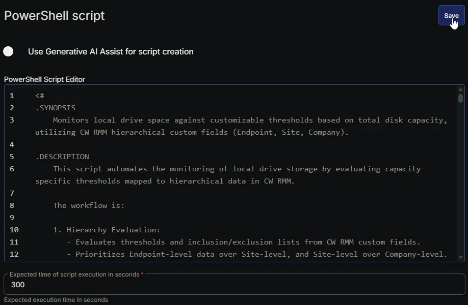

#### Row 33 Function: Script Log

- **Notes:** `<Leave it Blank>`  
- **Continue on Failure:** `False`  
- **Operating System:** `Windows`  
- **Script Log Message:** `%Output%`  

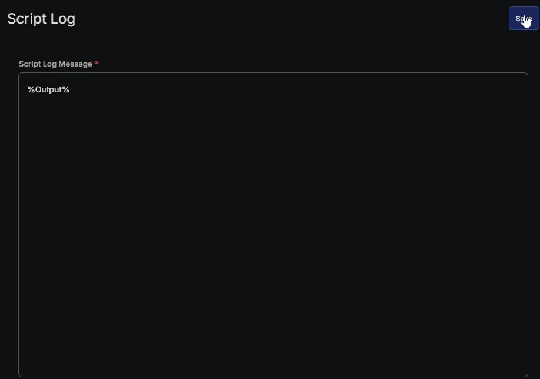

### Row 34 Logic: If/Then

#### Row 34(a) Logic Setup: Output Contains ( are detected with lower space available than threshold )

- **Dropdown Option:** `Output`  
- **Condition:** `Contains`  
- **Value:** `are detected with lower space available than threshold`

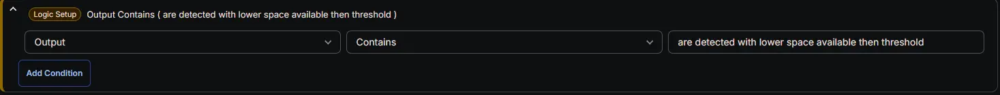

#### Row 34(b) Function: Create Ticket

- **Notes:** `<Leave it Blank>`  
- **Continue on Failure:** `False`  
- **Operating System:** `Windows`  
- **Subject:** `Enhanced Drive Space Monitor: Low Storage Detected on @compName@`  
- **Description:** `%Output%`  
- **Priority:** `Medium`

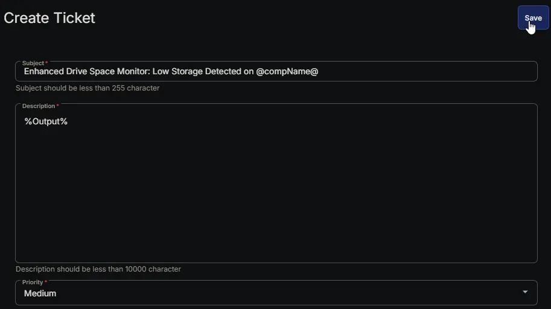

#### Completed If/Then Logic

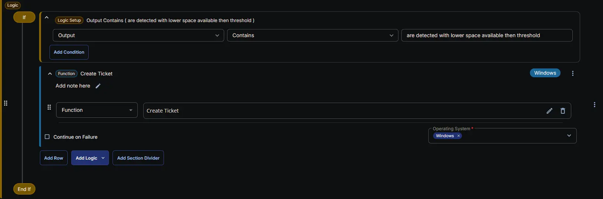

## Completed Task

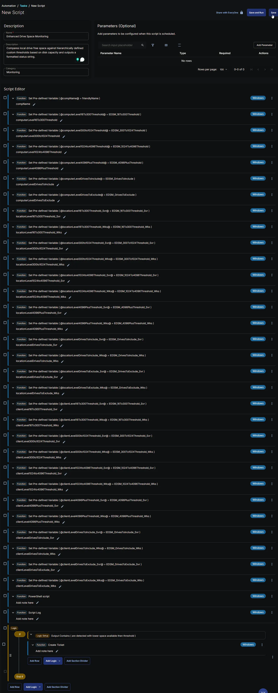

## Output

- Script Log
- Ticket

## Ticketing

**Subject:** `Enhanced Drive Space Monitor: Low Storage Detected on <ComputerName>`   
**Ticket Body:** `<Output of the PowerShell script>`  
**Ticket Body Example:**

```PlainText
2 Drive(s) are detected with lower space available than threshold.

Detected Drives:


Drive      : C
TotalSpace : 352.65 GB
UsedSpace  : 94.73 %
FreeSpace  : 5.27 %
Threshold  : 10%

Drive      : D
TotalSpace : 122.07 GB
UsedSpace  : 115.72 GB
FreeSpace  : 6.35 GB
Threshold  : 10GB
```

## Schedule Task

### Task Details

- **Name:** `Enhanced Drive Space Monitoring`   
- **Description:** `Compares local drive free space against hierarchically defined custom thresholds based on disk capacity and outputs a formatted status string.`   
- **Category:** `Monitoring`  

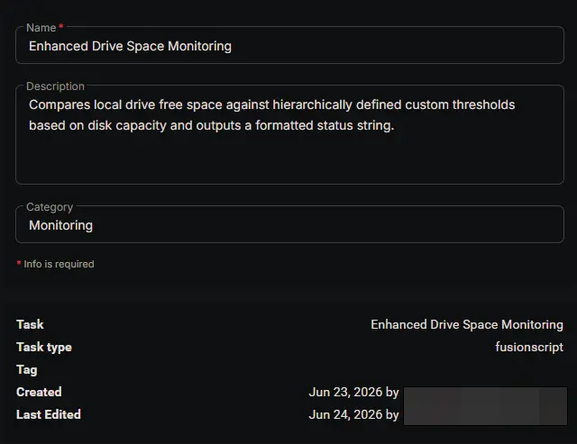

### Schedule

- **Schedule Type:**  `Schedule`  
- **Timezone:** `Local Machine Time`  
- **Start:** `<Current Date>`  
- **Trigger:** `Time` `At` `<Current Time>`  
- **Recurrence:** `Every day`
- **Execute at next agent check-in:** `True`
- **Stop After:** `22`
- **Unit:** `Hour(s)`

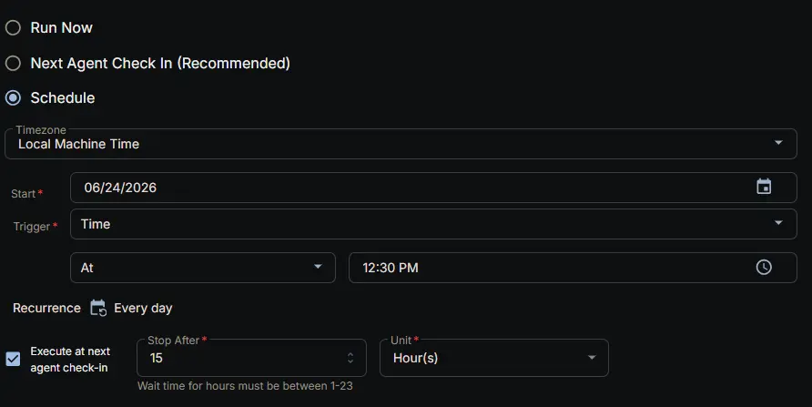

### Targeted Resource

**Device Group:** `Enhanced Drive Space Monitoring`

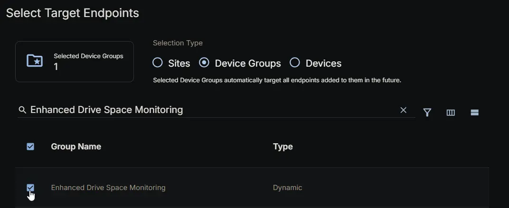

### Completed Scheduled Task

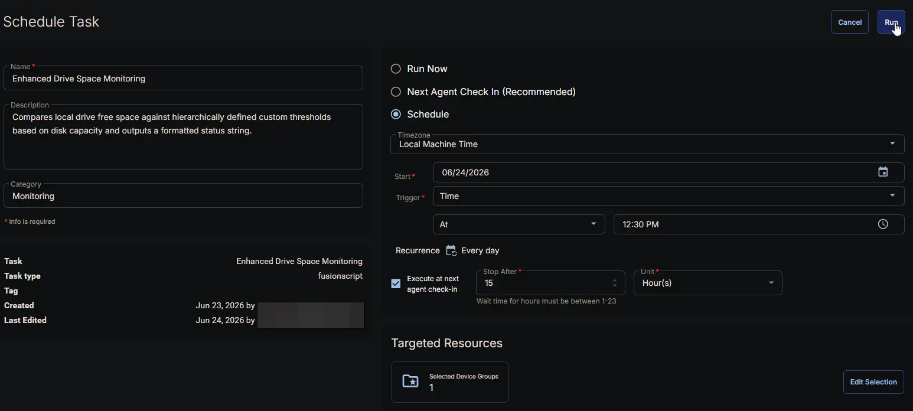

## Changelog

### 2026-06-24

- Initial version of the document
