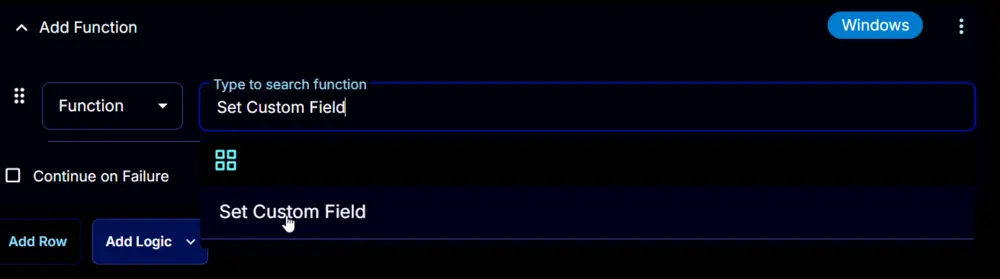
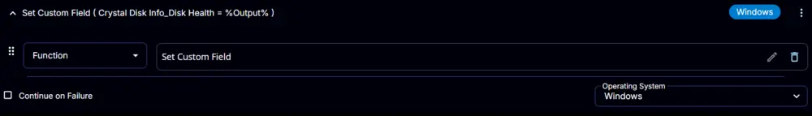

## Summary

This script will search for ESU licenses present on the endpoint and return information for any licenses found. Any data from the ESU licenses will be stored in the [ESU Status](/docs/90f075dc-5997-4abe-8a89-c46c6d566de0) custom field.

## Sample Run


## Dependencies

- [CW RMM - Custom Field - ESU Status](/docs/90f075dc-5997-4abe-8a89-c46c6d566de0)

## Task Creation

### Script Details

#### Step 1

Navigate to `Automation` ➞ `Tasks`  


#### Step 2

Create a new `Script Editor` style task by choosing the `Script Editor` option from the `Add` dropdown menu  


The `New Script` page will appear on clicking the `Script Editor` button:  


#### Step 3

Fill in the following details in the `Description` section:  

**Name:** `ESU Audit`  
**Description:** `This script will search for ESU licenses present on the endpoint and return information for any licenses found`  
**Category:** `Data Collection`


### Script Editor

Click the `Add Row` button in the `Script Editor` section to start creating the script  


A blank function will appear:  


#### Row 1 Function: `PowerShell Script`

Search and select the `PowerShell Script` function.  

  
  

The following function will pop up on the screen:  
  

Paste in the following PowerShell script and set the `Expected time of script execution in seconds` to `300` seconds. Click the `Save` button.

```powershell
#region Setup - Variables
$ProjectName = 'Get-ESUStatus'
[Net.ServicePointManager]::SecurityProtocol = [enum]::ToObject([Net.SecurityProtocolType], 3072)
$BaseURL = 'https://file.provaltech.com/repo'
$PS1URL = "$BaseURL/script/$ProjectName.ps1"
$WorkingDirectory = "C:\ProgramData\_automation\script\$ProjectName"
$PS1Path = "$WorkingDirectory\$ProjectName.ps1"
$WorkingPath = $WorkingDirectory
$LogPath = "$WorkingDirectory\$ProjectName-log.txt"
$ErrorLogPath = "$WorkingDirectory\$ProjectName-Error.txt"
#endregion
#region Setup - Folder Structure
New-Item -Path $WorkingDirectory -ItemType Directory -ErrorAction SilentlyContinue | Out-Null
try {
    Invoke-WebRequest -Uri $PS1URL -OutFile $PS1path -UseBasicParsing -ErrorAction Stop
} catch {
    if (!(Test-Path -Path $PS1Path )) {
        throw ('Failed to download the script from ''{0}'', and no local copy of the script exists on the machine. Reason: {1}' -f $PS1URL, $($Error[0].Exception.Message))
    }
}
#endregion
#region Execution
if ($Parameters) {
    $licenses = & $PS1Path @Parameters
} else {
    $licenses = & $PS1Path
}
#endregion

if ( !(Test-Path $LogPath) ) {
    throw 'PowerShell Failure. A Security application seems to have restricted the execution of the PowerShell Script.'
}
if ( $licenses ) {
    $status = @()
    foreach ( $license in $licenses ) {
        $status += "ID - $($license.ID) Name - $($license.Name) License Status - $($license.LicenseStatus)"
    }
    return $status -join '\|'
} else {
    return "No ESU Licenses found"
}
if ( Test-Path $ErrorLogPath ) {
    $ErrorContent = ( Get-Content -Path $ErrorLogPath )
    throw $ErrorContent
}
```

  

### Row 2 Function: Script Log

Add a new row by clicking the `Add Row` button.  
  

A blank function will appear.  
  

Search and select the `Script Log` function.  
  
  

The following function will pop up on the screen:  
  

In the script log message, simply type `%output%` and click the `Save` button.  
  

### Row 3 Function: Set Custom Field

Add a new row by clicking the `Add Row` button.  
  

A blank function will appear.  
  

Search and select the `Set Custom Field` function.  
  

The following function will pop up on the screen:  
  

- Search and select the Computer-Level Custom Field `ESU Status` from the Custom Field dropdown menu.
- Set `%Output%` in the `Value` field.
- Click the `Save` button.


  

## Save Task

Click the `Save` button at the top-right corner of the screen to save the script.  


## Completed Task


## Output

- Script Log  

- Custom Field  
