## Summary
This script performs the checks for the ESU license activation detection and stores the info in the device-level custom field [ESU Status](/docs/90f075dc-5997-4abe-8a89-c46c6d566de0).

## Sample Run

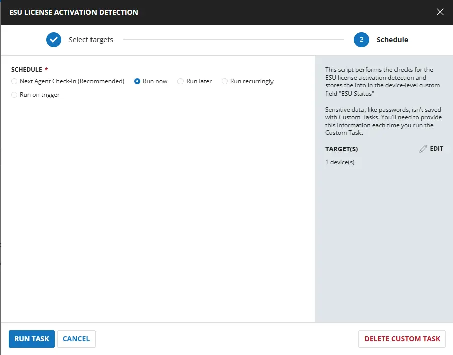 

## Dependencies

- [Custom Field - ESU Status](/docs/90f075dc-5997-4abe-8a89-c46c6d566de0)
- [Solution - Windows 10 ESU Licensing and Auditing](/docs/a7e4073e-1f09-4772-aa5e-ee44cf9bf9e7)

## Task Creation

### Script Details

#### Step 1

Navigate to `Automation` ➞ `Tasks`  
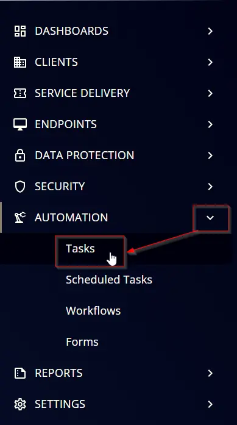

#### Step 2

Create a new `Script Editor` style task by choosing the `Script Editor` option from the `Add` dropdown menu  
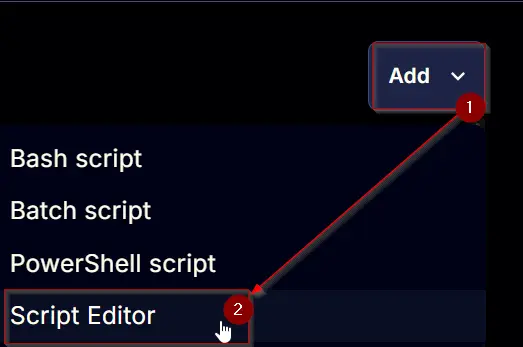

The `New Script` page will appear on clicking the `Script Editor` button:  
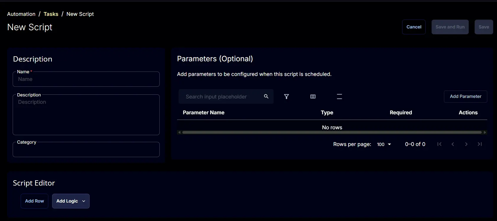

#### Step 3

Fill in the following details in the `Description` section:  

- **Name:** `ESU License Activation Detection`  
- **Description:** `This script performs the checks for the ESU license activation detection and stores the info in the device-level custom field "ESU Status"`  
- **Category:** `Data Collection`

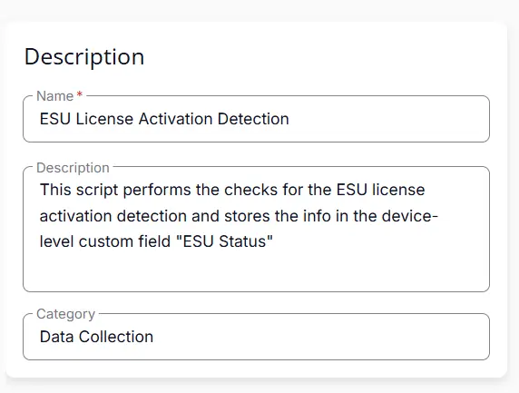 

### Script Editor

Click the `Add Row` button in the `Script Editor` section to start creating the script  


A blank function will appear:  
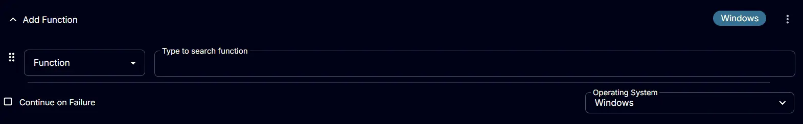

#### Row 1 Function: `PowerShell Script`

Search and select the `PowerShell Script` function.  
 
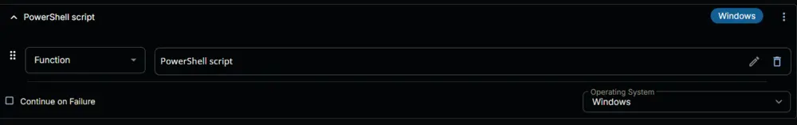  

The following function will pop up on the screen:  
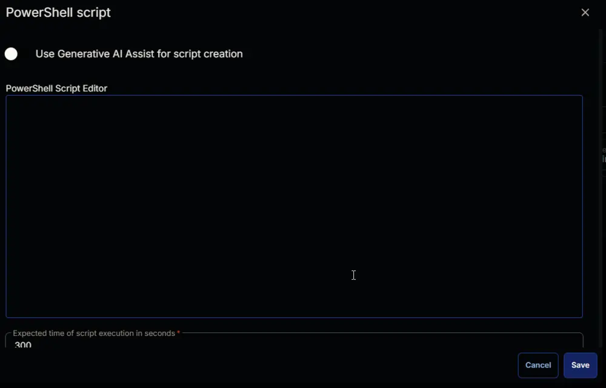  

Paste in the following PowerShell script and set the `Expected time of script execution in seconds` to `300` seconds. Click the `Save` button.

```powershell
<#
.SYNOPSIS
    Detects and reports the ESU (Extended Security Updates) license activation status for Windows 10 22H2 machines.

.DESCRIPTION
    This script checks whether a Windows 10 22H2 machine has an active ESU license by querying the SoftwareLicensingProduct WMI class.
    The script specifically looks for ESU activation IDs and verifies the license status. The result is stored in a CW RMM 
    custom field for centralized monitoring and reporting.

    The script performs the following operations:
    1. Verifies the machine is running Windows 10 22H2 (Build 19045)
    2. Queries the SoftwareLicensingProduct WMI class for ESU license information
    3. Checks for specific ESU activation IDs with active license status
    4. returns the result for the 'ESU Status' custom field in CW RMM

.PARAMETER None
    This script does not accept any parameters. It operates on the local machine where it's executed.

.EXAMPLE
    .\Get-ESULicenseActivationDetection.ps1
    Executes the ESU license detection and returns the result for a custom field

.OUTPUTS
    String. The script returns one of the following values:
    - "ESU Activated" - ESU license is active and properly configured
    - "ESU Not Activated" - No active ESU license found
    - "Not Windows 10 22H2" - Machine is not running the supported Windows version
    - "PowerShell Failure" - Error occurred while querying WMI data

.LINK
    https://learn.microsoft.com/en-us/windows/whats-new/enable-extended-security-updates
    https://www.systemcenterdudes.com/deploy-windows-10-extended-security-update-key-with-intune-or-sccm/

.COMPONENT
    Windows Management Instrumentation (WMI)
    CW RMM
    License Management

.FUNCTIONALITY
    ESU License Detection
    Windows Version Validation
    Custom Field Management
#>

#region globals
$ProgressPreference = 'SilentlyContinue'
$WarningPreference = 'SilentlyContinue'
$InformationPreference = 'Continue'
#endRegion

#region Variables
$supportedBuild = 19045
$activationIds = @(
    'f520e45e-7413-4a34-a497-d2765967d094',
    '1043add5-23b1-4afb-9a0f-64343c8f3f8d',
    '83d49986-add3-41d7-ba33-87c7bfb5c0fb'
)
#endRegion

#region OS Check
$build = (Get-CimInstance -ClassName 'Win32_OperatingSystem' -ErrorAction SilentlyContinue).buildNumber
if ($build -ne $supportedBuild) {
    $value = 'Not Windows 10 22H2'
    return $value
}
#endRegion

#region Check ESU License Status
try {
    $esuLicense = Get-CimInstance -ClassName 'SoftwareLicensingProduct' -Filter 'partialproductkey is not null' -ErrorAction Stop |
        Where-Object {
            $_.LicenseStatus -eq 1 -and $activationIds -contains $_.Id
        }
} catch {
    $value = 'PowerShell Failure'
    return $value
}
$value = if ( $esuLicense ) {
    'ESU Activated'
} else {
    'ESU Not Activated'
}
return $value
#endRegion

```

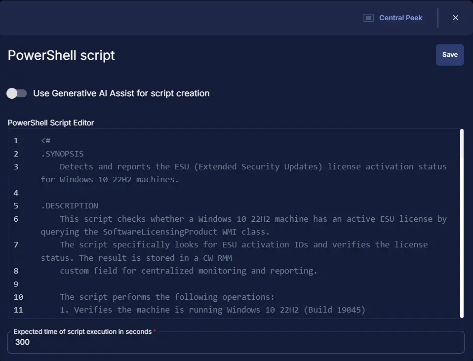 

### Row 2 Function: Script Log

Add a new row by clicking the `Add Row` button.  
  

A blank function will appear.  
  

Search and select the `Script Log` function.  
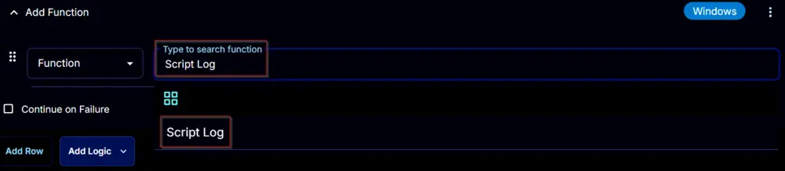  
 

In the script log message, simply type `%output%` and click the `Save` button.  
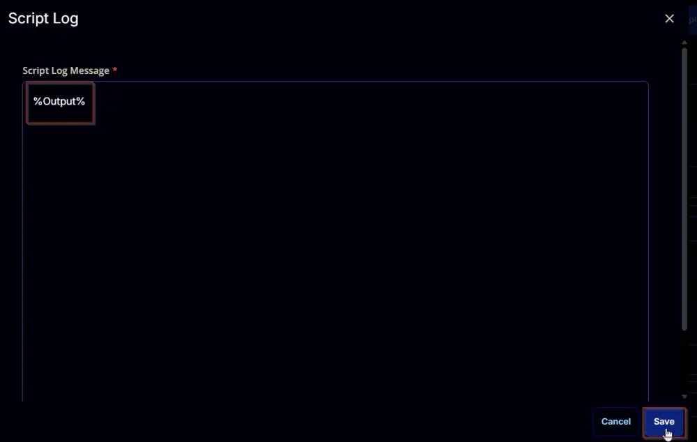  

### Row 3 Function: Set Custom Field

Add a new row by clicking the `Add Row` button.  
  

A blank function will appear.  
  

Search and select the `Set Custom Field` function.  
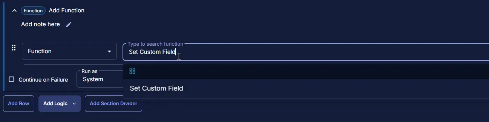  

The following function will pop up on the screen:  
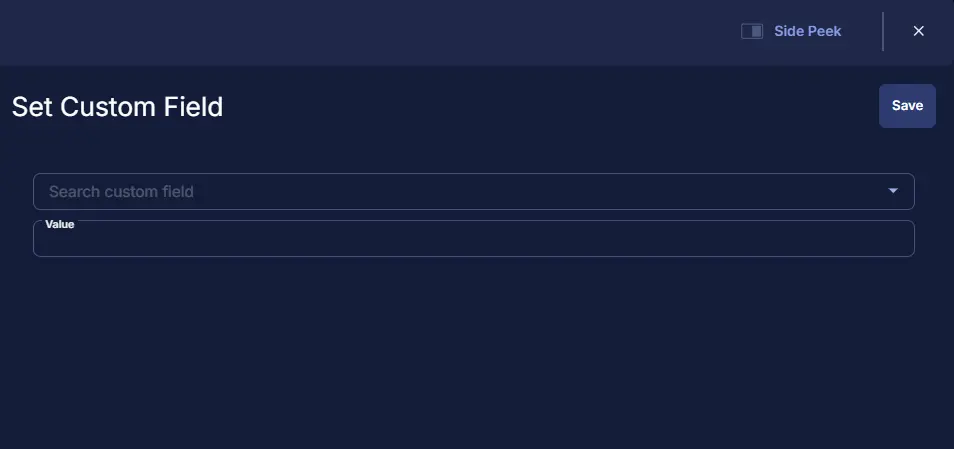  

- Search and select the Computer-Level Custom Field `ESU Status` from the Custom Field dropdown menu.
- Set `%Output%` in the `Value` field.
- Click the `Save` button.

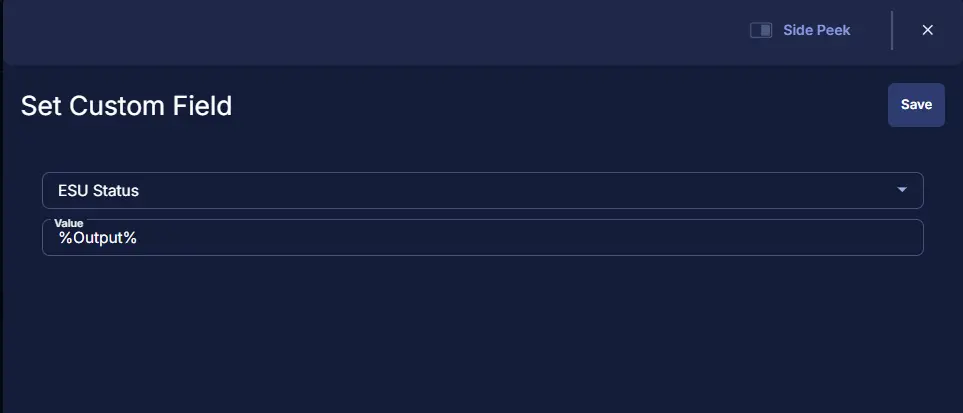  

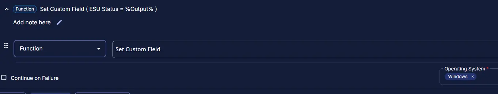 

## Save Task

Click the `Save` button at the top-right corner of the screen to save the script.  


## Completed Task

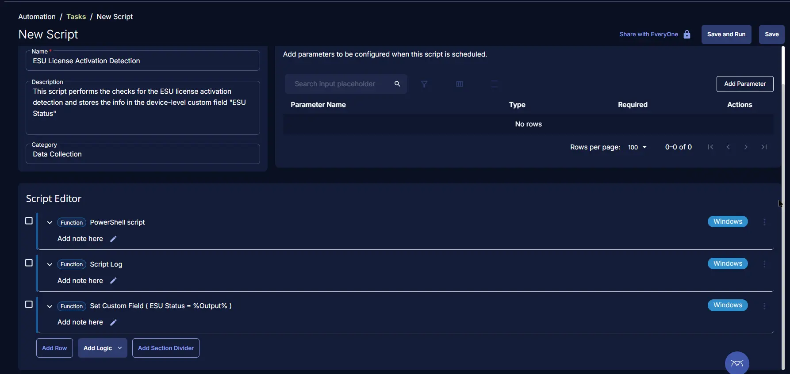 


## Output

- Script Logs

## Schedule Task

### Task Details

- **Name:** `ESU License Activation Detection`  
- **Description:** `This script performs the checks for the ESU license activation detection and stores the info in the device-level custom field "ESU Status".`  
- **Category:** `Custom`

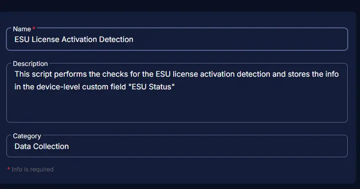 

### Schedule

- **Schedule Type:**  `Schedule`  
- **Timezone:** `Local Machine Time`  
- **Start:** `<Current Date>`  
- **Trigger:** `Time` `At` `<Current Time>`  
- **Recurrence:** `Every 15 Days`

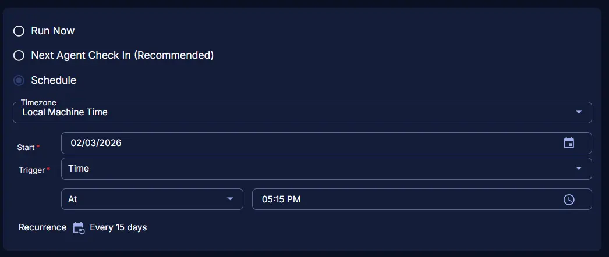 

### Targeted Resource

**Device Group:** `Windows 10 22H2`

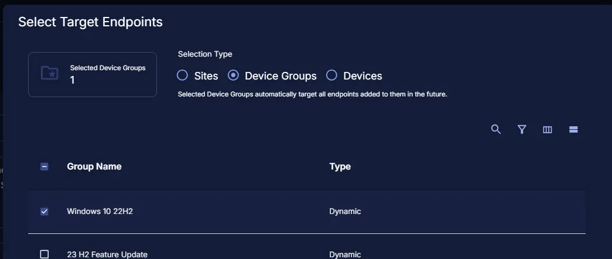 

### Completed Scheduled Task

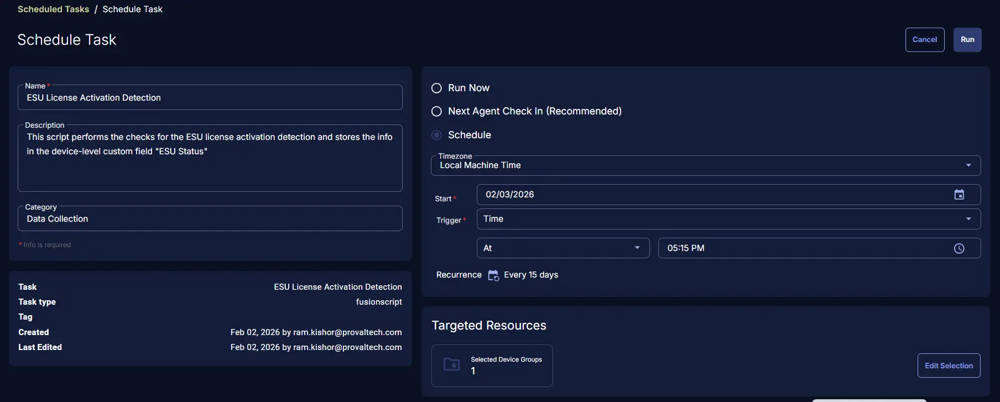 