## Summary
This script performs the checks for the ESU license activation detection and stores the info in the device-level custom field [ESU Status](/docs/90f075dc-5997-4abe-8a89-c46c6d566de0).

## Sample Run

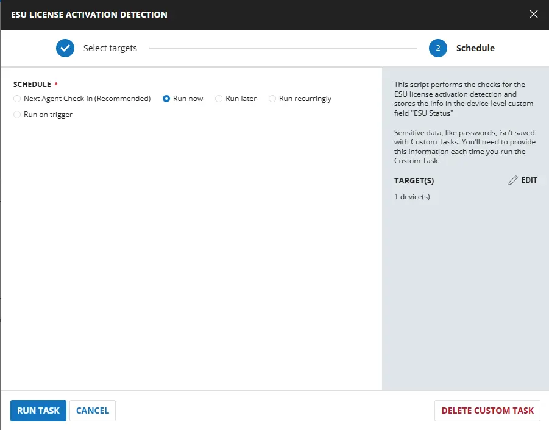 

## Dependencies

- [Custom Field - ESU Status](/docs/90f075dc-5997-4abe-8a89-c46c6d566de0)
- [Solution - Windows 10 ESU Licensing and Auditing](/docs/a7e4073e-1f09-4772-aa5e-ee44cf9bf9e7)

## Task Creation

### Script Details

#### Step 1

Navigate to `Automation` ➞ `Tasks`  

#### Step 2

Create a new `Script Editor` style task by choosing the `Script Editor` option from the `Add` dropdown menu  

The `New Script` page will appear on clicking the `Script Editor` button:  

#### Step 3

Fill in the following details in the `Description` section:  

- **Name:** `ESU License Activation Detection`  
- **Description:** `This script performs the checks for the ESU license activation detection and stores the info in the device-level custom field "ESU Status"`  
- **Category:** `Data Collection`

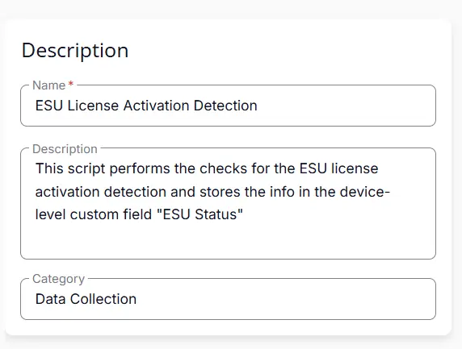 

### Script Editor

Click the `Add Row` button in the `Script Editor` section to start creating the script  

A blank function will appear:  

#### Row 1 Function: `PowerShell Script`

Search and select the `PowerShell Script` function.  
 
  

The following function will pop up on the screen:  
  

Paste in the following PowerShell script and set the `Expected time of script execution in seconds` to `300` seconds. Click the `Save` button.

[PowerShell Script](https://github.com/ProVal-Tech/cw-rmm/blob/main/tasks/esu-license-activation-detection/script.ps1)

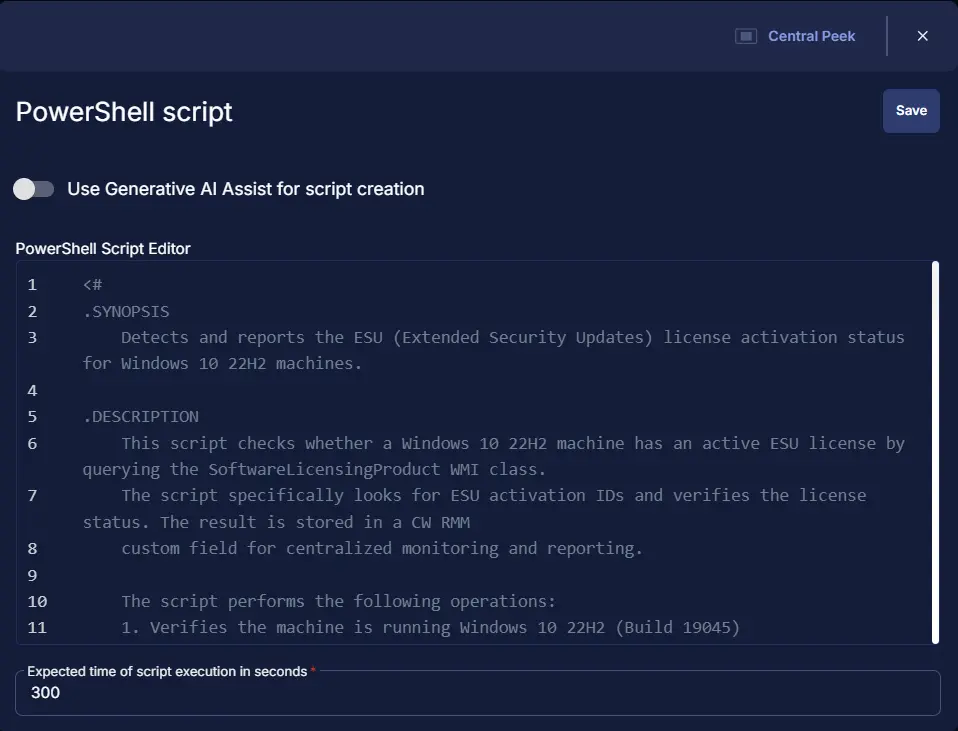 

### Row 2 Function: Script Log

Add a new row by clicking the `Add Row` button.  
  

A blank function will appear.  
  

Search and select the `Script Log` function.  
  
 

In the script log message, simply type `%output%` and click the `Save` button.  
  

### Row 3 Function: Set Custom Field

Add a new row by clicking the `Add Row` button.  
  

A blank function will appear.  
  

Search and select the `Set Custom Field` function.  
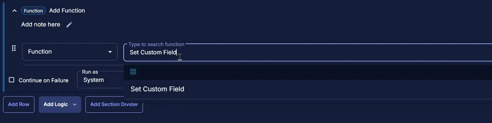  

The following function will pop up on the screen:  
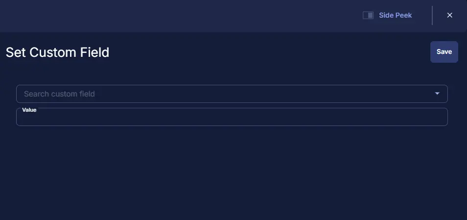  

- Search and select the Computer-Level Custom Field `ESU Status` from the Custom Field dropdown menu.
- Set `%Output%` in the `Value` field.
- Click the `Save` button.

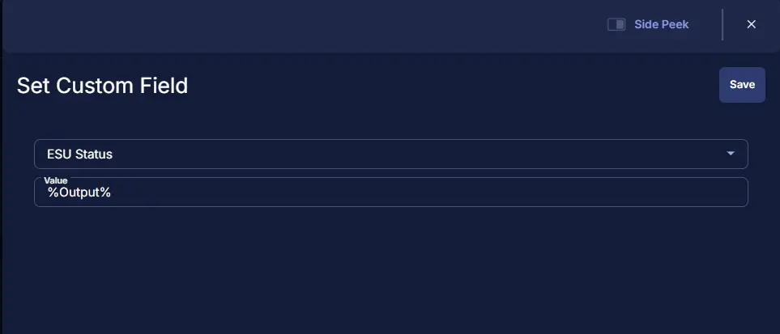  

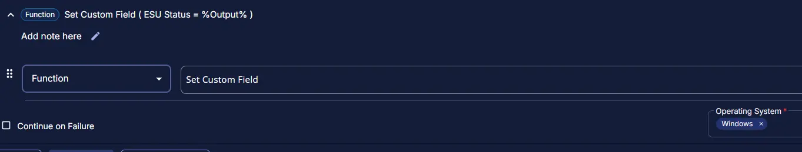 

## Save Task

Click the `Save` button at the top-right corner of the screen to save the script.  

## Completed Task

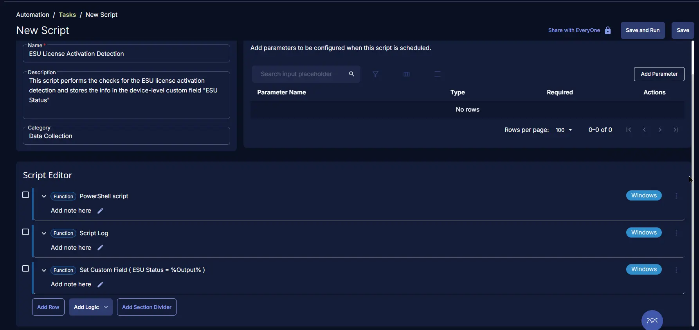 

## Output

- Script Logs

## Schedule Task

### Task Details

- **Name:** `ESU License Activation Detection`  
- **Description:** `This script performs the checks for the ESU license activation detection and stores the info in the device-level custom field "ESU Status".`  
- **Category:** `Custom`

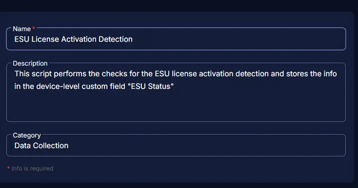 

### Schedule

- **Schedule Type:**  `Schedule`  
- **Timezone:** `Local Machine Time`  
- **Start:** `<Current Date>`  
- **Trigger:** `Time` `At` `<Current Time>`  
- **Recurrence:** `Every 15 Days`

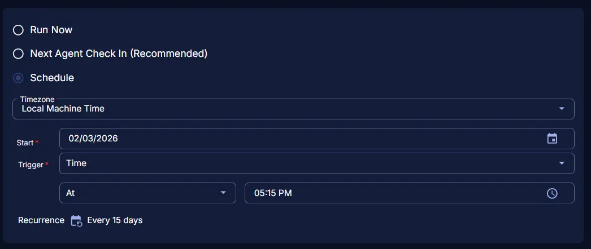 

### Targeted Resource

**Device Group:** `Windows 10 22H2`

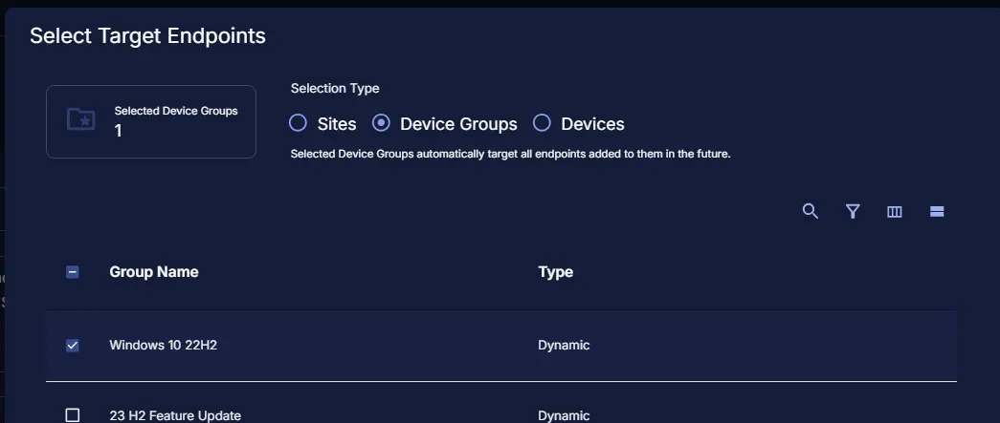 

### Completed Scheduled Task

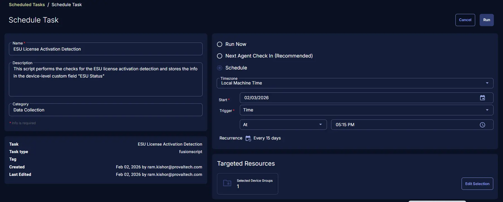

## Changelog

### 2026-02-04

- Initial version of the document

