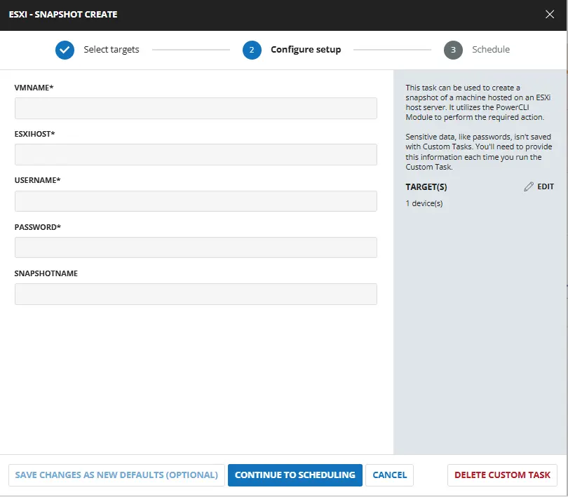
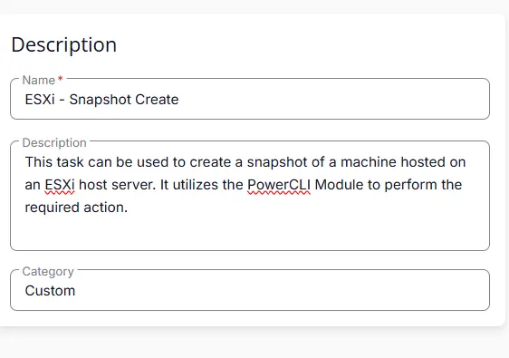
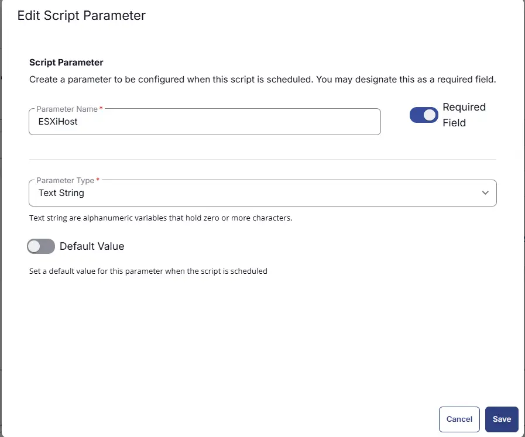
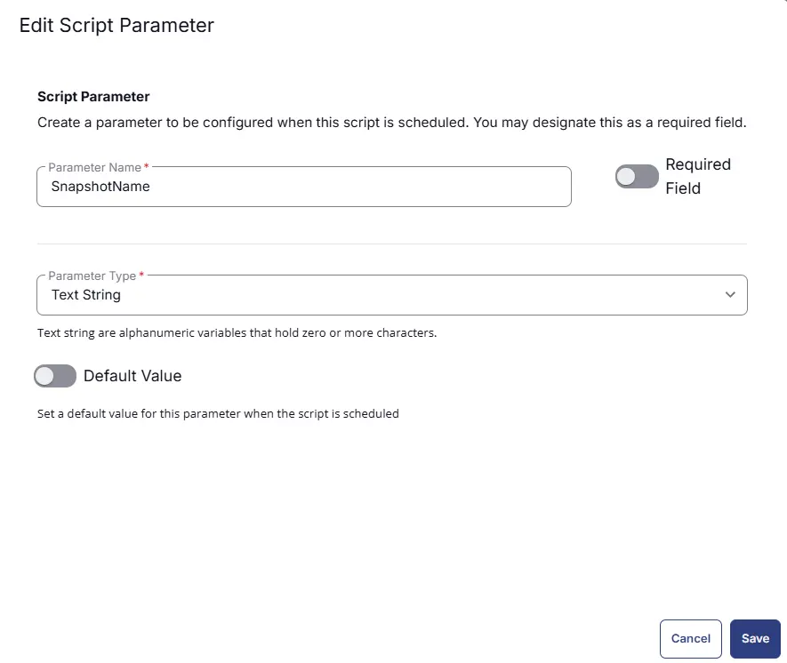
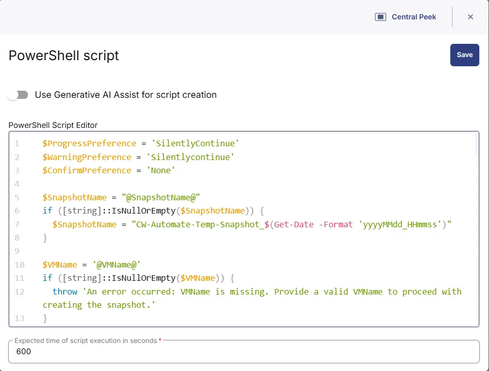
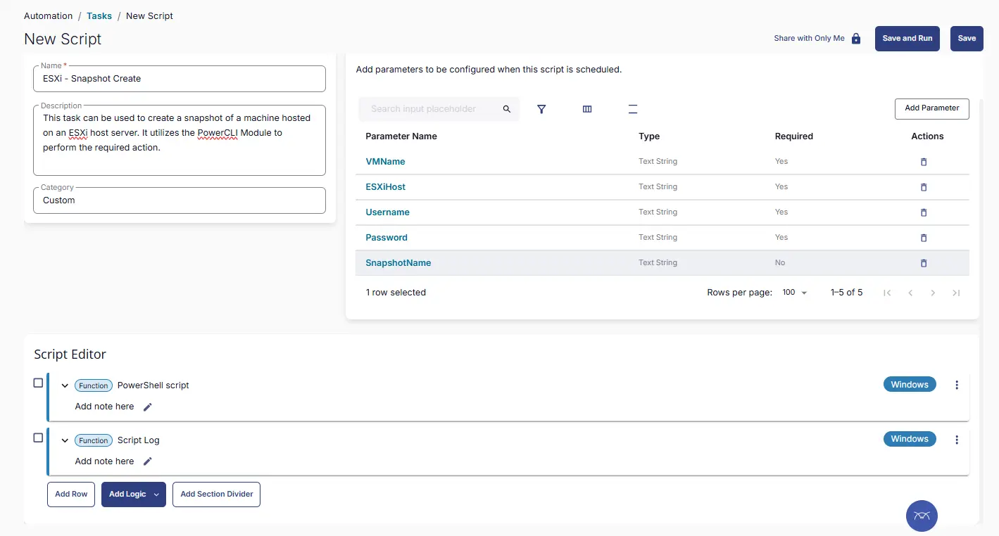

---
id: '2543f54a-2d4d-46d0-9827-ce94a1ef444d'
slug: /2543f54a-2d4d-46d0-9827-ce94a1ef444d
title: 'ESXi - Snapshot Create'
title_meta: 'ESXi - Snapshot Create'
keywords:  ['esxi', 'snapshot', 'vmware', 'powercli']
description: 'This task can be used to create a snapshot of a machine hosted on an ESXi host server. It utilizes the PowerCLI Module to perform the required action.'
tags: ['backup', 'security', 'virtualization', 'windows']
draft: False
unlisted: false
last_update:
  date: 2026-03-20
---

## Summary
This task can be used to create a snapshot of a machine hosted on an ESXi host server. It utilizes the PowerCLI Module to perform the required action.

## Sample Run

 

## User Parameters

| Name        | Example                     | Required | Type        | Description                                 |
|-------------|-----------------------------|----------|-------------|---------------------------------------------|
| VMName  | DEV_Test-win10   | True     | Text String | The name of the virtual machine to create a snapshot of. |
| ESXiHost | 111.111.111.111          | True     | Text String | IP Address of ESXi Host. |
| Username   | ESXIAdmin | True     | Text String | Username to use to connect with the ESXi Host. |
| Password  | "QWfqw2%R@@$@FQW:RVV!'qwdwq" | True     | Text String | Password to use to connect with the ESXi Host. |
| SnapshotName   | CW-RMM-Temp-Snapshot_20230501_081958 | False | Text String | Name of the Snapshot to create. By default, script will create snapshot with name "CW-RMM-Temp-Snapshot_yyyyMMdd_HHmmss" |

## Task Creation

### Script Details

#### Step 1

Navigate to `Automation` ➞ `Tasks`  

#### Step 2

Create a new `Script Editor` style task by choosing the `Script Editor` option from the `Add` dropdown menu  

The `New Script` page will appear on clicking the `Script Editor` button:  

#### Step 3

Fill in the following details in the `Description` section:  

- **Name:** `ESXi - Snapshot Create`  
- **Description:** `This task can be used to create a snapshot of a machine hosted on an ESXi host server. It utilizes the PowerCLI Module to perform the required action.`  
- **Category:** `Custom`

 

### Parameters

### VMName

The `Add New Script Parameter` page will appear on clicking the `Add Parameter` button.  

- Set `VMName` in the `Parameter Name` field.
- Enable the `Required Field` button.
- Select `Text String` from the `Parameter Type` dropdown menu.
- Click the `Save` button.

 

### ESXiHost

The `Add New Script Parameter` page will appear on clicking the `Add Parameter` button.  

- Set `ESXiHost` in the `Parameter Name` field.
- Enable the `Required Field` button.
- Select `Text String` from the `Parameter Type` dropdown menu.
- Click the `Save` button.

 

### Username

The `Add New Script Parameter` page will appear on clicking the `Add Parameter` button.  

- Set `Username` in the `Parameter Name` field.
- Enable the `Required Field` button.
- Select `Text String` from the `Parameter Type` dropdown menu.
- Click the `Save` button.

 

### Password

The `Add New Script Parameter` page will appear on clicking the `Add Parameter` button.  

- Set `Password` in the `Parameter Name` field.
- Enable the `Required Field` button.
- Select `Text String` from the `Parameter Type` dropdown menu.
- Click the `Save` button.

 

### SnapshotName

The `Add New Script Parameter` page will appear on clicking the `Add Parameter` button.  

- Set `SnapshotName` in the `Parameter Name` field.
- Disable the `Required Field` button.
- Select `Text String` from the `Parameter Type` dropdown menu.
- Click the `Save` button.

 

### Script Editor

Click the `Add Row` button in the `Script Editor` section to start creating the script  

A blank function will appear:  

#### Row 1 Function: `PowerShell Script`

Search and select the `PowerShell Script` function.  
 
  

The following function will pop up on the screen:  
  

Paste in the following PowerShell script and set the `Expected time of script execution in seconds` to `600` seconds. Click the `Save` button.

[PowerShell Script](https://github.com/ProVal-Tech/cw-rmm/blob/main/tasks/esxi-snapshot-create/script.ps1)

 

### Row 2 Function: Script Log

Add a new row by clicking the `Add Row` button.  
  

A blank function will appear.  
  

Search and select the `Script Log` function.  
  
 

In the script log message, simply type `%output%` and click the `Save` button.  

## Save Task

Click the `Save` button at the top-right corner of the screen to save the script.  

## Completed Task

 

## Output

- Script Logs

## Changelog

### 2026-03-20

- Initial version of the document

