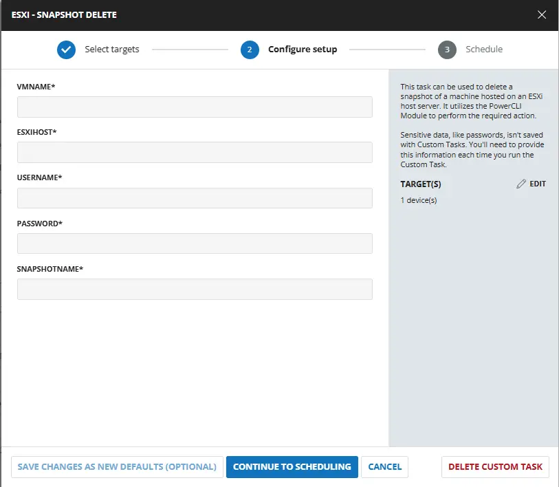
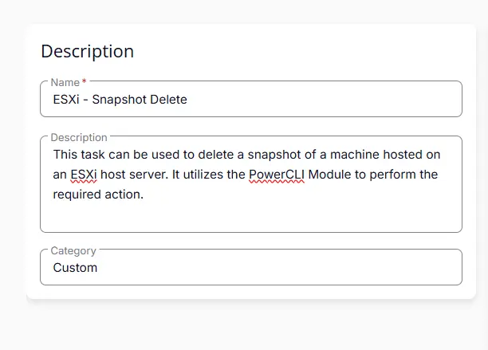
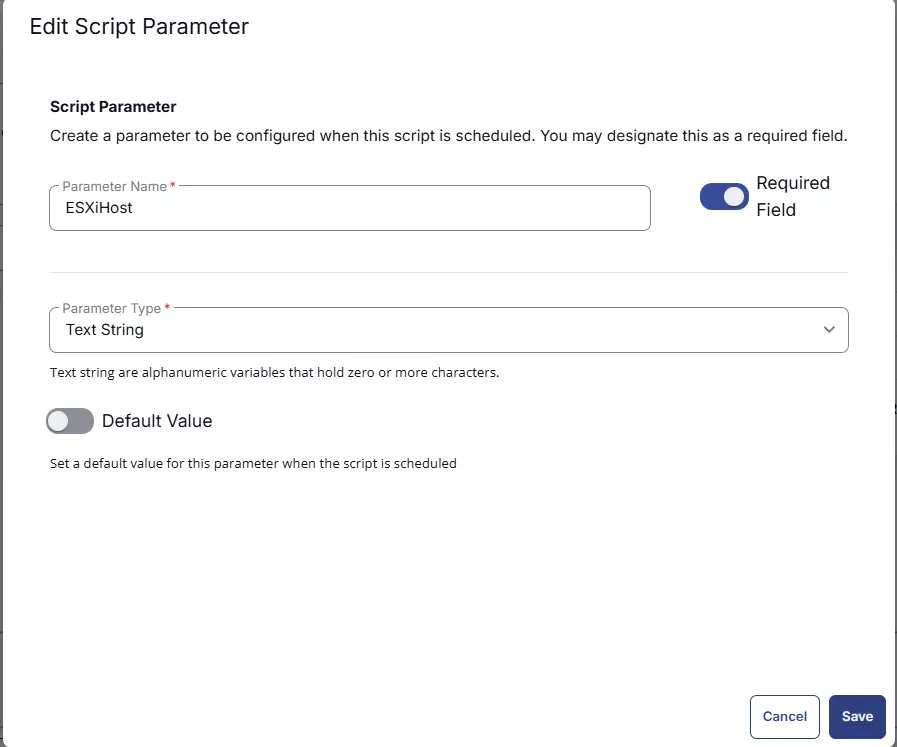
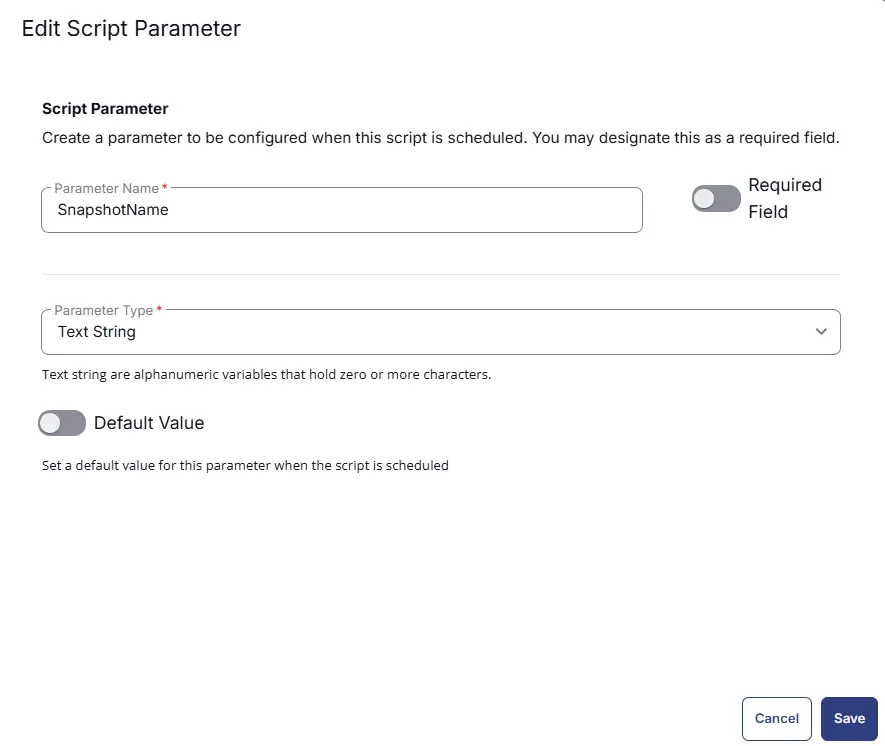
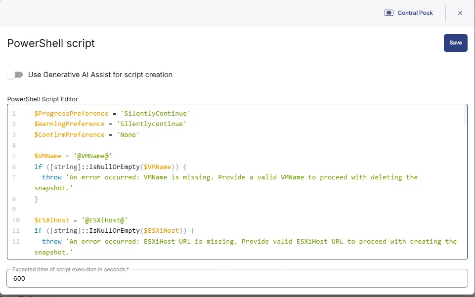
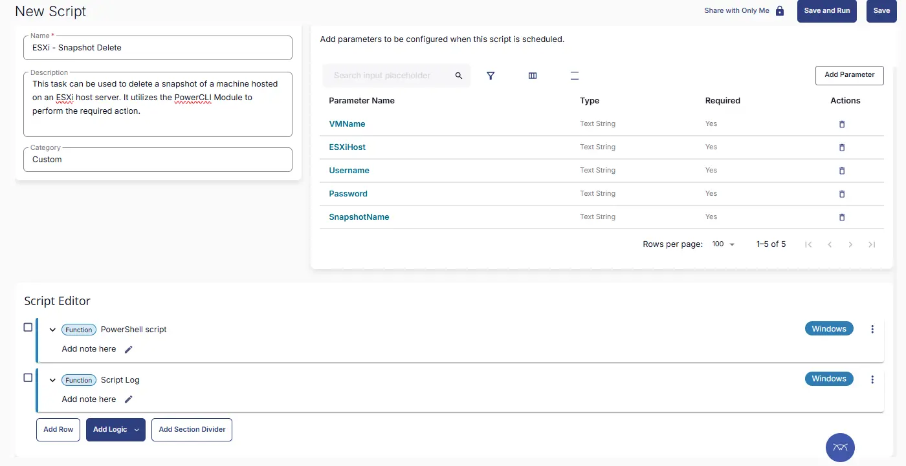

## Summary
This task can be used to delete a snapshot of a machine hosted on an ESXi host server. It utilizes the PowerCLI Module to perform the required action.

## Sample Run

 

## User Parameters

| Name        | Example                     | Required | Type        | Description                                 |
|-------------|-----------------------------|----------|-------------|---------------------------------------------|
| VMName  | DEV_Test-win10   | True     | Text String | Name of the virtual machine from which to remove the snapshot|
| ESXiHost | 111.111.111.111          | True     | Text String | IP Address of ESXi Host. |
| Username   | ESXIAdmin | True     | Text String | Username to use to connect with the ESXi Host. |
| Password  | "QWfqw2%R@@$@FQW:RVV!'qwdwq" | True     | Text String | Password to use to connect with the ESXi Host. |
| SnapshotName   | CW-Automate-Temp-Snapshot_20230501_081958 | False | Text String | Name of the Snapshot to delete |

## Task Creation

### Script Details

#### Step 1

Navigate to `Automation` ➞ `Tasks`  


#### Step 2

Create a new `Script Editor` style task by choosing the `Script Editor` option from the `Add` dropdown menu  


The `New Script` page will appear on clicking the `Script Editor` button:  


#### Step 3

Fill in the following details in the `Description` section:  

**Name:** `ESXi - Snapshot Delete`  
**Description:** `This task can be used to delete a snapshot of a machine hosted on an ESXi host server. It utilizes the PowerCLI Module to perform the required action.`  
**Category:** `Custom`

 

### Parameters

### VMName

The `Add New Script Parameter` page will appear on clicking the `Add Parameter` button.  


- Set `VMName` in the `Parameter Name` field.
- Enable the `Required Field` button.
- Select `Text String` from the `Parameter Type` dropdown menu.
- Click the `Save` button.

 

### ESXiHost

The `Add New Script Parameter` page will appear on clicking the `Add Parameter` button.  


- Set `ESXiHost` in the `Parameter Name` field.
- Enable the `Required Field` button.
- Select `Text String` from the `Parameter Type` dropdown menu.
- Click the `Save` button.

 

### Username

The `Add New Script Parameter` page will appear on clicking the `Add Parameter` button.  


- Set `Username` in the `Parameter Name` field.
- Enable the `Required Field` button.
- Select `Text String` from the `Parameter Type` dropdown menu.
- Click the `Save` button.

 

### Password

The `Add New Script Parameter` page will appear on clicking the `Add Parameter` button.  


- Set `Password` in the `Parameter Name` field.
- Enable the `Required Field` button.
- Select `Text String` from the `Parameter Type` dropdown menu.
- Click the `Save` button.

 

### SnapshotName

The `Add New Script Parameter` page will appear on clicking the `Add Parameter` button.  


- Set `SnapshotName` in the `Parameter Name` field.
- Enable the `Required Field` button.
- Select `Text String` from the `Parameter Type` dropdown menu.
- Click the `Save` button.

 


### Script Editor

Click the `Add Row` button in the `Script Editor` section to start creating the script  


A blank function will appear:  


#### Row 1 Function: `PowerShell Script`

Search and select the `PowerShell Script` function.  
 
  

The following function will pop up on the screen:  
  

Paste in the following PowerShell script and set the `Expected time of script execution in seconds` to `600` seconds. Click the `Save` button.

```powershell
$ProgressPreference = 'SilentlyContinue'
$WarningPreference = 'Silentlycontinue'
$ConfirmPreference = 'None'

$VMName = '@VMName@'
if ([string]::IsNullOrEmpty($VMName)) {
  throw 'An error occurred: VMName is missing. Provide a valid VMName to proceed with deleting the snapshot.'
}

$ESXiHost = '@ESXiHost@'
if ([string]::IsNullOrEmpty($ESXiHost)) {
  throw 'An error occurred: ESXiHost URL is missing. Provide valid ESXiHost URL to proceed with creating the snapshot.'
}

$Username = '@Username@'
if ([string]::IsNullOrEmpty($Username)) {
  throw 'An error occurred: Username is missing. Provide valid Username to connect with the ESXi Host.'
}

$Pwd = '@Password@'
if ([string]::IsNullOrEmpty($Pwd)) {
  throw 'An error occurred: Password is missing. Provide valid Password to connect with the ESXi Host.'
}

[securestring]$Password= ConvertTo-SecureString $Pwd -AsPlainText -Force

$SnapshotName = '@SnapshotName@'
if ([string]::IsNullOrEmpty($Password)) {
  throw 'An error occurred: SnapshotName is missing. Provide a valid Snapshot name to proceed.'
}


if ((Get-ItemProperty -Path 'HKLM:SOFTWARE\Microsoft\NET Framework Setup\NDP\v4\Full').Release -lt 461808)
 {Throw '.Net Version installed on the computer does not meet the minumum criteria of .Net Framework 4.7.2+  (Release: 461808)'} 
 else {'Required .Net Version detected'}
 
if ($PSVersionTable.PSVersion -lt [Version]'5.1') 
 {throw 'PowerShell Version installed on the computer does not meet the minumum criteria of PowerShell v5.1+'} 
 else {'Required PowerShell Version Detected'}


# Check if the VMware PowerCLI module is installed
if ( !(Get-Module -ListAvailable -Name VMware.PowerCLI)) {
    If ( Test-Path "C:\Program Files\WindowsPowerShell\Modules\VMware.VimAutomation.Core") {
        Import-Module -Name VMware.VimAutomation.Core -ErrorAction SilentlyContinue 2>$null 3>$null 4>$null 5>$null 6>$null
    }
    else {
        [Net.ServicePointManager]::SecurityProtocol = [enum]::ToObject([Net.SecurityProtocolType], 3072)
        Get-PackageProvider -Name NuGet -ForceBootstrap | Out-Null
        Set-PSRepository -Name PSGallery -InstallationPolicy Trusted
        if (Get-Module -Name VMware.PowerCLI -ListAvailable -ErrorAction SilentlyContinue) {
            Update-Module -Name VMware.PowerCLI -Confirm:$false -Force 
        }
        else {
            Install-Module -Name VMware.PowerCLI -Repository PSGallery -AllowClobber -Force -Confirm:$False
        }
        Import-Module VMware.VimAutomation.Core -ErrorAction SilentlyContinue
    }
}
else {
    Import-Module VMware.VimAutomation.Core -ErrorAction SilentlyContinue
}

# Set PowerCLI Configuration
$PowerCLIConfiguration = Get-PowerCLIConfiguration | Where-Object { $_.Scope -eq 'session' }  | Select-Object ParticipateInCEIP, InvalidCertificateAction
If ( $PowerCLIConfiguration.ParticipateInCEIP -notmatch 'False' ) {
    Set-PowerCLIConfiguration -ParticipateInCEIP $False -Confirm:$False
}
If ( $PowerCLIConfiguration.InvalidCertificateAction -notmatch 'Ignore' ) {
    Set-PowerCLIConfiguration -InvalidCertificateAction Ignore -Confirm:$False
}

# Connect to the ESXi host
try {
    [pscredential]$Credential=New-Object System.Management.Automation.PSCredential ($Username, $Password)
    Connect-VIServer -Server $ESXiHost -Credential $credential -Force 2>&1 3>$null 4>$null 5>$null 6>$null
}
catch {
    throw "Script Failed: Error connecting to the ESXi host: $_"
    exit 1
}

# Check if the VM exists
$VM = Get-VM -Name $VMName -ErrorAction SilentlyContinue
if ( !( $VM ) ) {
    throw "Script Failed: Virtual machine '$VMName' not found. Please provide a valid virtual machine name."
    Disconnect-VIServer -Server $ESXiHost -Confirm:$false
    exit 1
}

# Delete the requested Snapshot
try {
    $SnapshotToRemove = Get-Snapshot -VM $VMName -Name $SnapshotName
    Remove-Snapshot -Snapshot $SnapshotToRemove -RemoveChildren -Confirm:$False
    return "Successfully Removed the Snapshot '$SnapshotName' for the Virtual Machine '$VMName'."
}
catch {
    throw "Script Failed: Error removing snapshot: $_"
    exit 1
}
finally {
    Disconnect-VIServer -Server $ESXiHost -Confirm:$false
}
```

 


### Row 2 Function: Script Log

Add a new row by clicking the `Add Row` button.  
  

A blank function will appear.  
  

Search and select the `Script Log` function.  
  
 

In the script log message, simply type `%output%` and click the `Save` button.  


## Save Task

Click the `Save` button at the top-right corner of the screen to save the script.  


## Completed Task

 

## Output

- Script Logs

## Changelog

### 2026-03-20

- Initial version of the document
