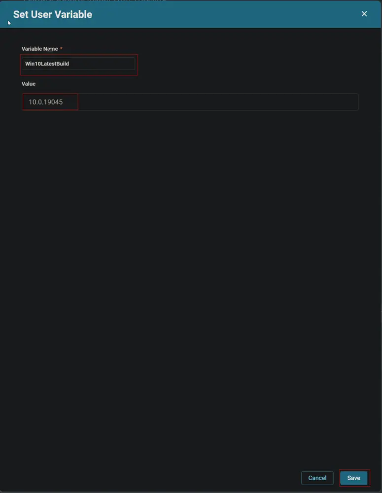
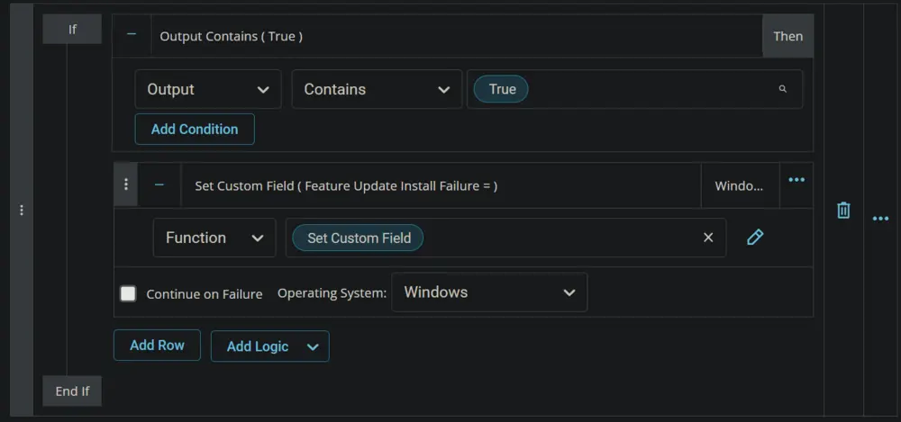

## Summary

The script runs on machines where the `Feature Update Reboot Pending` custom field is flagged after the execution of the `Feature Update Install With Tracking` task, signifying a pending reboot to finalize the Feature Pack Update. Subsequently, the script updates the `Feature Update Install Failure` custom field with the outcome for monitoring purposes.

The script compares the current operating system build with the latest available build before and after the upgrade, with the latest build requiring manual entry into the script. For any new releases, the build number must be manually set in the script at step 1 for Windows 11 and step 2 for Windows 10.


## Sample Run


## Dependencies

[CW RMM - Task - Feature Update Install With Tracking](/docs/5244ac77-6926-4902-a183-b4b2aac18e2b)  
[CW RMM - Custom Field - Feature Update Install Failure](/docs/1c9abaeb-17f0-4a3b-86ee-953b5b713dc3)  
[CW RMM - Custom Field - Feature Update Reboot Pending](/docs/45e14854-ba83-4737-8264-b5cd809fca56)  

## Create Script

Create a new `Script Editor` style script in the system to implement this Task.


**Name:** `Feature Update Install (Reboot Pending Machines Validation)`  
**Description:** `Monitors computers with pending reboots where the Feature Update Install with Tracking script was run but not yet rebooted, verifying the success of the update.`  
**Category:** Patching  


## Script

Start by adding a row. You can do this by clicking the `Add Row` button at the bottom of the script page.


### Row 1 Function: Set User Variable

Select the `Set User Variable` function.

 


Type `Win11LatestBuild` in the `Variable Name` field and `10.0.22631` in the `Value` field. `10.0.22631` is the latest available Feature build for Windows 11 at the moment. Click `Save` to create the `Win11LatestBuild` variable.


### Row 2 Function: Set User Variable

Insert a new row by clicking the `Add Row` button.


Select the `Set User Variable` function.

 


Type `Win10LatestBuild` in the `Variable Name` field and `10.0.19045` in the `Value` field. `10.0.19045` is the latest available Feature build for Windows 10 at the moment. Click `Save` to create the `Win10LatestBuild` variable.




### Row 3 Function: PowerShell Script

Insert a new row by clicking the `Add Row` button.


Select the `PowerShell Script` function.


Paste in the following PowerShell script, set the expected time of script execution to `300` seconds, and click the `Save` button.

```
$ProgressPreference = 'SilentlyContinue'
[Net.ServicePointManager]::SecurityProtocol = [Enum]::ToObject([Net.SecurityProtocolType], 3072)
Get-PackageProvider -Name NuGet -ForceBootstrap | Out-Null
Set-PSRepository -Name PSGallery -InstallationPolicy Trusted
try {
    Update-Module -Name PendingReboot -ErrorAction Stop
} catch {
    Install-Module -Name PendingReboot -Repository PSGallery -SkipPublisherCheck -Force
    Get-Module -Name PendingReboot -ListAvailable | Where-Object { $_.Version -ne (Get-InstalledModule -Name PendingReboot).Version } | ForEach-Object { Uninstall-Module -Name PendingReboot -MaximumVersion $_.Version }
}
Import-Module -Name PendingReboot 3>&1 2>&1 1>$null
if ((Test-PendingReboot -WarningAction SilentlyContinue).IsRebootPending) { return 'Still Reboot Pending'} else {return 'Good to Proceed'}
```


Mark the `Continue on Failure` checkbox.


### Row 4 Logic: If Then

Insert a new `If/Then` logic from the `Add Logic` dropdown menu.

  


### Row 4a Condition: Output Contains

Type `Good to Proceed` in the Value box and press `Enter`.  


### Row 4b Function: Set Custom Field

Insert a new row by clicking the `Add Row` button inside the `If Then` logic.  


Search and select the `Set Custom Field` function in the new row.  


Search and select the `Feature Update Reboot Pending` custom field.  


Type `False` in the `Value` box and click the Save button.  
  


### Step 4c Function: PowerShell Script

Insert a new row by clicking the `Add Row` button inside the `If Then` logic.  


Search and select the `PowerShell Script` in the newly added row.  


Paste in the following PowerShell script, set the expected time of script execution to `300` seconds, and click the `Save` button.

```
$osinfo = Get-CimInstance -ClassName Win32_OperatingSystem
if ( $osinfo.buildnumber -ge '20000' ) { [Version]$osinfo.version -ge [Version]'@Win11LatestBuild@' } else  { [Version]$osinfo.Version -ge [Version]'@Win10LatestBuild@' }
```


Mark the `Continue on Failure` checkbox.


### Step 4d Logic: If Then

Insert a new `If/Then` logic inside the external `If Then` logic from the `Add Logic` dropdown menu.


### Step 4d(i) Condition: Output Contains

Type `False` in the Value box and press `Enter`.  


### Row 4d(ii) Function: Set Custom Field

Insert a new row by clicking the `Add Row` button inside the internal `If Then` logic.  


Search and select the `Set Custom Field` function in the new row.  


Search and select the `Feature Update Install Failure` custom field.  


Type `Installation Failure/Error` in the `Value` box and click the Save button.  


### Row 4d(iii) Function: Script Exit

Insert a new row by clicking the `Add Row` button inside the internal `If Then` logic.  


Search and select the `Script Exit` function in the new row.  


Type `Script Failed to install the latest available feature update.` in the Error Message field and click the `Save` button.  


### Step 4e Logic: If Then

Insert a new `If/Then` logic inside the external `If Then` logic from the `Add Logic` dropdown menu.


### Step 4e(i) Condition: Output Contains

Type `True` in the Value box and press `Enter`.  


### Row 4e(ii) Function: Set Custom Field

Insert a new row by clicking the `Add Row` button inside the internal `If Then` logic.  


Search and select the `Set Custom Field` function in the new row.  


Search and select the `Feature Update Install Failure` custom field.  


Type ` ` in the `Value` box and click the `Save` button. (There is a single `space` in the `Value` field.)  




Click the `Save` button to save the Task.  


## Completed Script


## Deployment

- Go to `Automation` > `Tasks.`
- Search for `Feature Update Install (Reboot Pending Machines Validation)` task.
- Select the concerned task.
- Click on the `Schedule` button to schedule the task/script.  


- This screen will appear.  


- Click the `Does not repeat` button.  


- This pop-up box will appear.  


- Click the `OK` button to run the task once per day.  


- Select the relevant time to execute the script. It is suggested to run this task during working hours, when most of the workstations are online.  


- Search and select the `Windows Feature Pack Update: Reboot Pending` group in the `Resources`.  


- Clicking the `Run` button will initiate the schedule.  


- The task will start appearing in the Scheduled Tasks.  
  


- The `Suspend` option can be used to `suspend/stop` the schedule.  
  


## Output

- Custom Field


