## Summary

The script clears the related custom fields on machines where the Feature Update is successfully installed, thereby excluding those machines from automation and monitoring.

## Sample Run

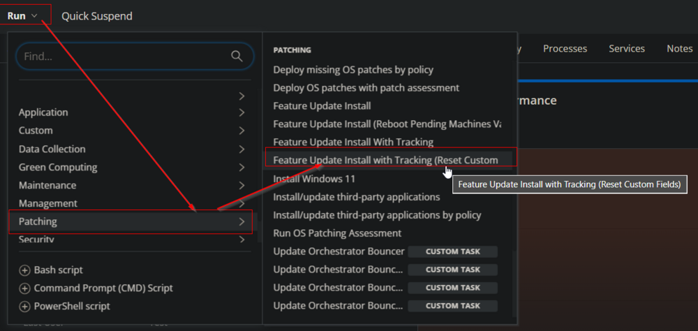  
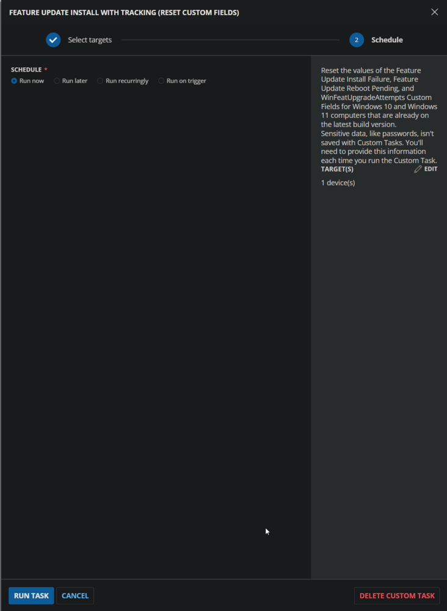  

## Dependencies

- [CW RMM - Task - Feature Update Install With Tracking](/docs/5244ac77-6926-4902-a183-b4b2aac18e2b)
- [CW RMM - Custom Field - WinFeatUpgradeAttempts](/docs/58b312bd-f26c-4b05-ab92-c184520d05de)
- [CW RMM - Custom Field - Feature Update Install Failure](/docs/1c9abaeb-17f0-4a3b-86ee-953b5b713dc3)
- [CW RMM - Custom Field - Feature Update Reboot Pending](/docs/45e14854-ba83-4737-8264-b5cd809fca56)
- [CW RMM - Device Group - Feature Pack Update - Updated Computers](/docs/72490aca-9d0d-47b9-88a9-437279e21d7a)

## Create Script

Create a new `Script Editor` style script in the system to implement this task.

  
  

**Name:** `Feature Update Install with Tracking (Reset Custom Fields)`  
**Description:** `Reset the values of the Feature Update Install Failure, Feature Update Reboot Pending, and WinFeatUpgradeAttempts Custom Fields for Windows 10 and Windows 11 computers that are already on the latest build version.`  
**Category:** Patching  

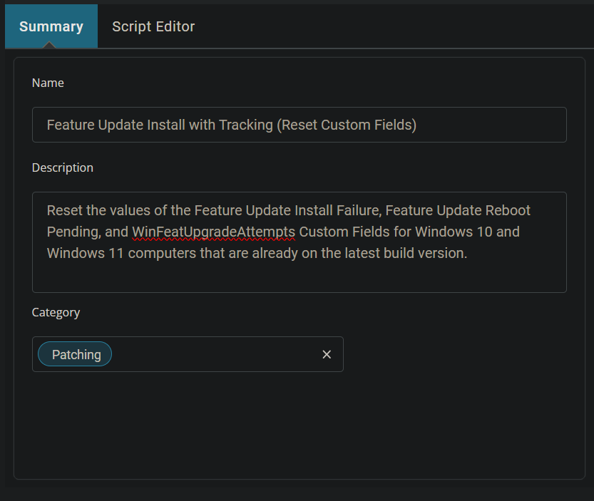  

## Script

Start by adding a row. You can do this by clicking the `Add Row` button at the bottom of the script page.

  

### Row 1 Function: Set Custom Field  
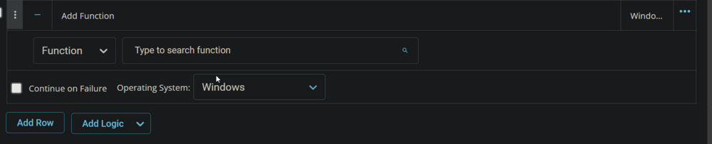  
Search and select the `Set Custom Field` function in the new row.  
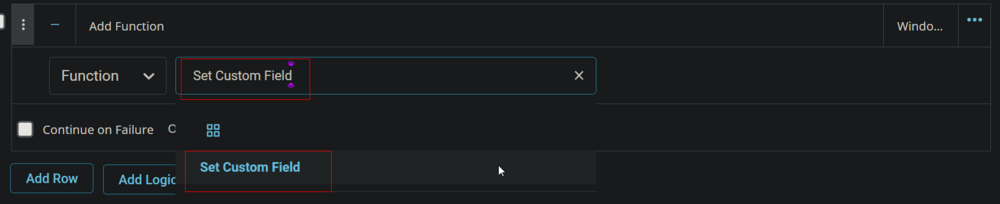  
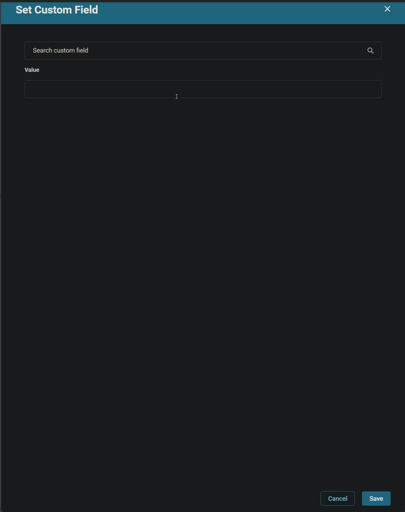  

Search and select the `WinFeatUpgradeAttempts` Custom Field.  
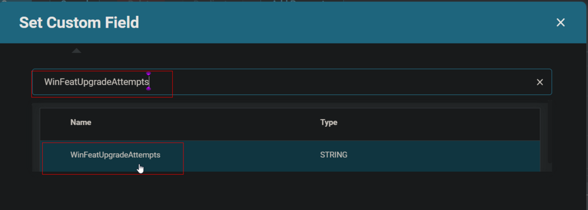  
Type ` ` (there is a single space) in the `Value` box and click the Save button.  
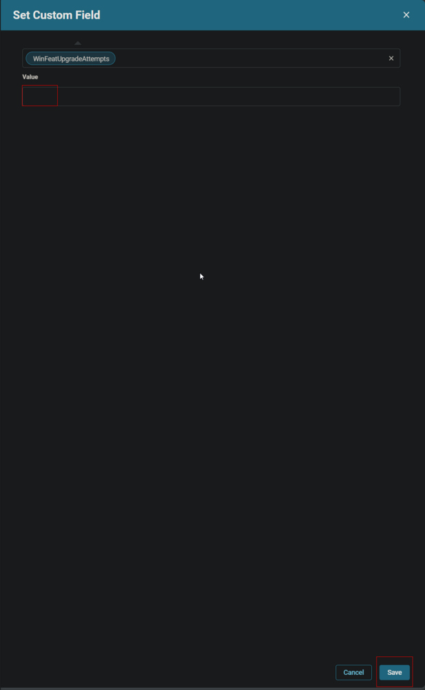  
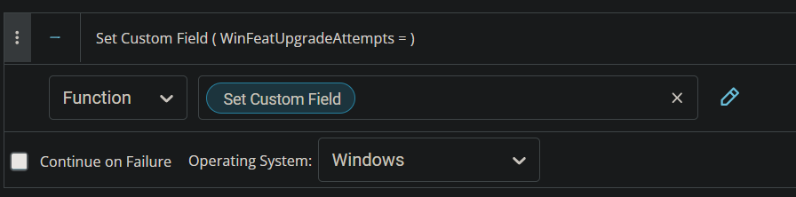  

### Row 2 Function: Set Custom Field  
Insert a new row by clicking the `Add Row` button.  
  
  

Search and select the `Set Custom Field` function in the new row.  
  
  

Search and select the `Feature Update Reboot Pending` Custom Field.  
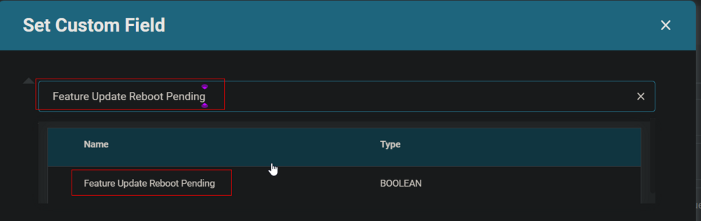  
Type `False` in the `Value` box and click the Save button.  
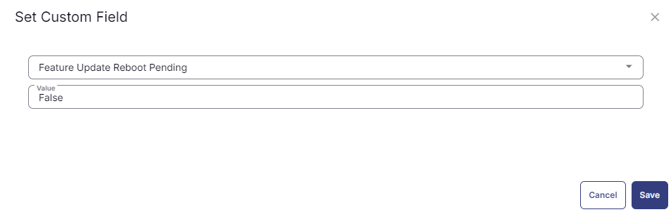  

### Row 3 Function: Set Custom Field  
Insert a new row by clicking the `Add Row` button.  
  
  

Search and select the `Set Custom Field` function in the new row.  
  
  

Search and select the `Feature Update Install Failure` Custom Field.  
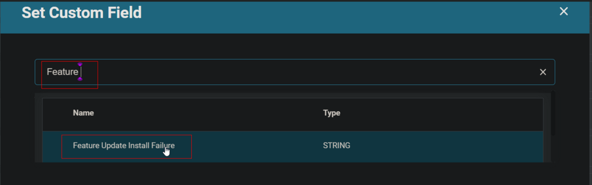  
Type ` ` (there is a single space) in the `Value` box and click the Save button.  
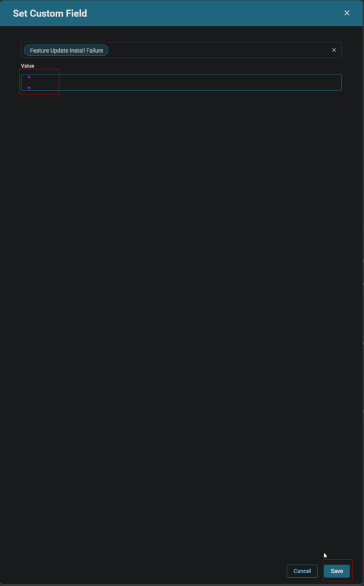  

Click the `Save` button to save the task.  
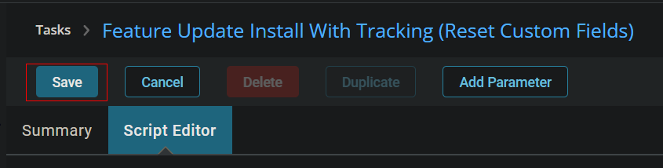  

## Completed Script

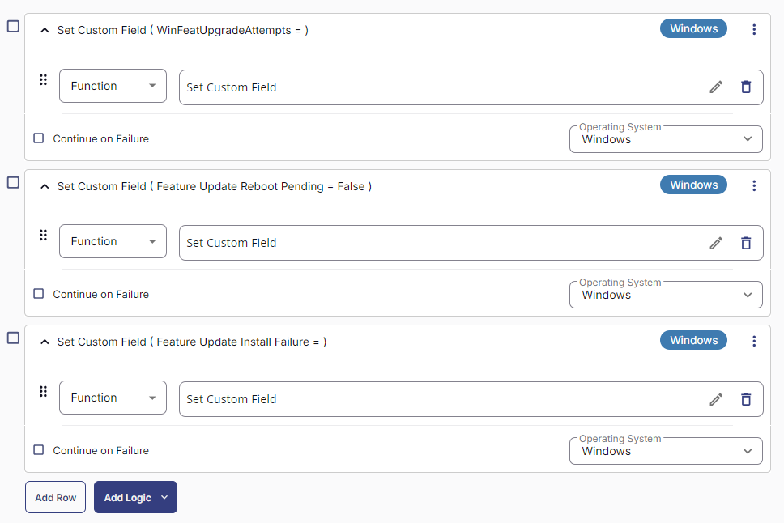  

## Deployment

1. Go to `Automation` > `Tasks`.
2. Search for `Feature Update Install With Tracking (Reset Custom Fields)` task.
3. Select the concerned task.
4. Click on the `Schedule` button to schedule the task/script.  
   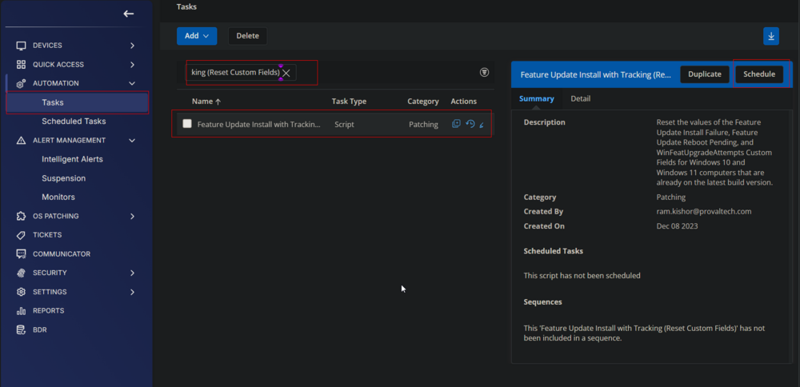  
5. This screen will appear.  
   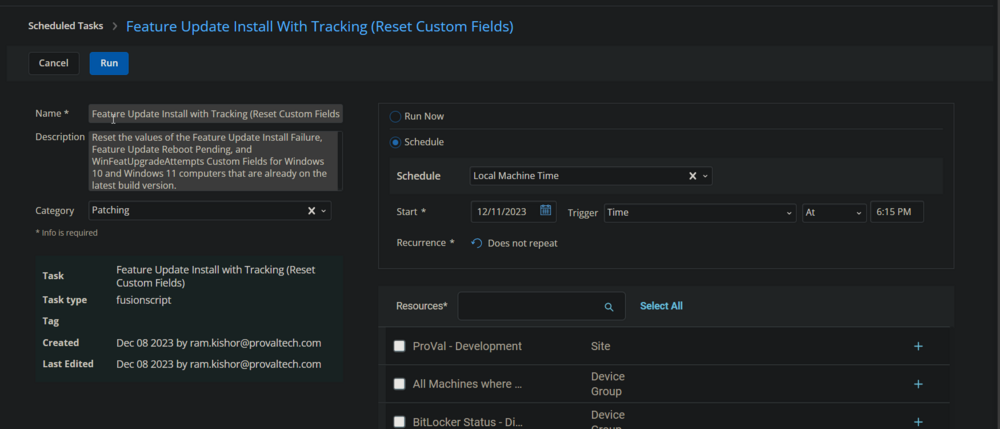  
6. Click the `Does not repeat` button.  
     
7. This pop-up box will appear.  
     
8. Click the `OK` button to run the task once per day.  
   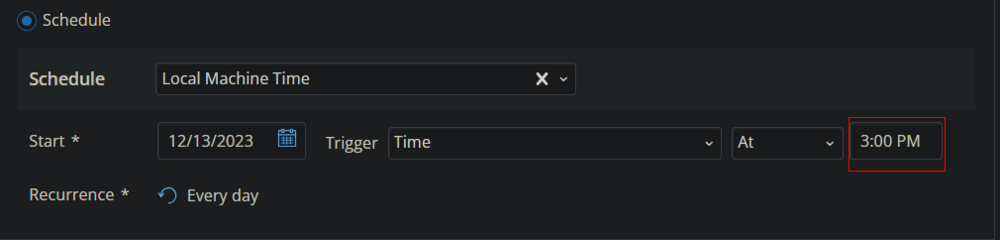  
9. Select the relevant time to execute the script. It is suggested to run this task during working hours when most of the workstations are online.  
     
10. Search and select the `Feature Pack Update - Updated Computers` group in the `Resources`.  
    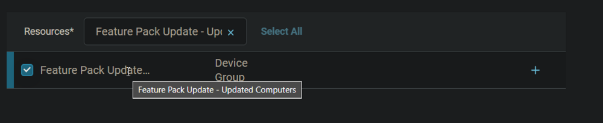  
11. Clicking the `Run` button will initiate the schedule.  
    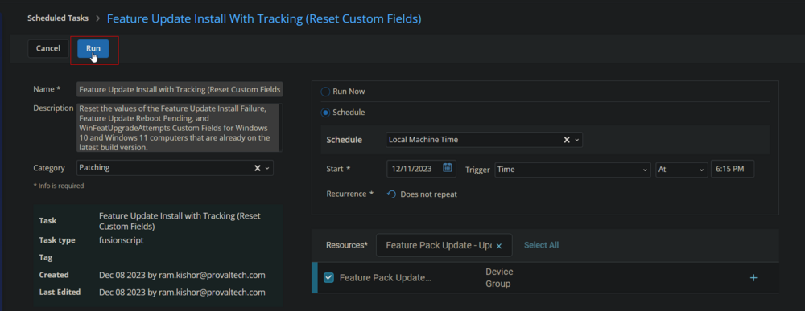  
12. The task will start appearing in the Scheduled Tasks.  
      
    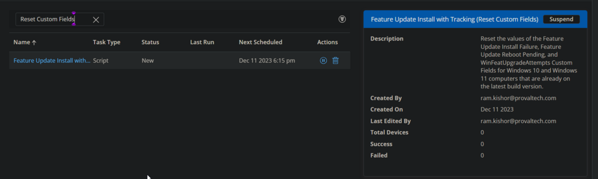  
13. The `Suspend` option can be used to `suspend/stop` the schedule.  
    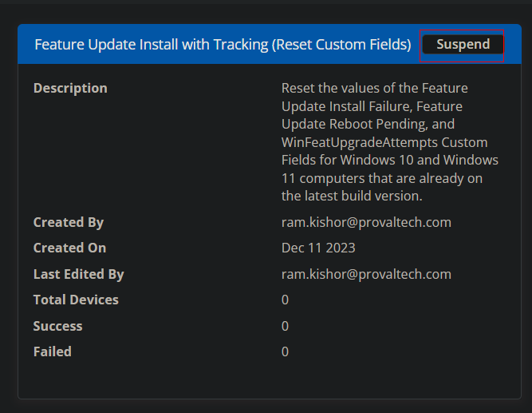  
    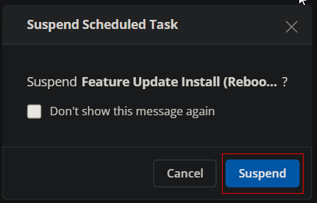  

## Output

- Custom Field

