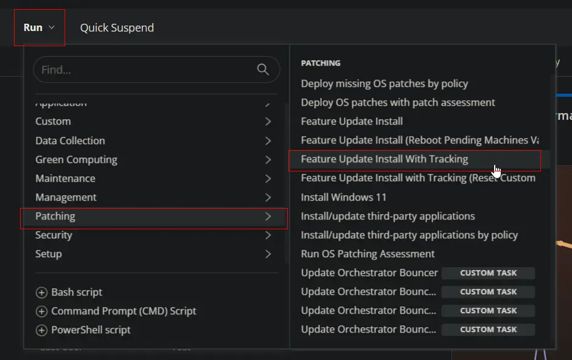
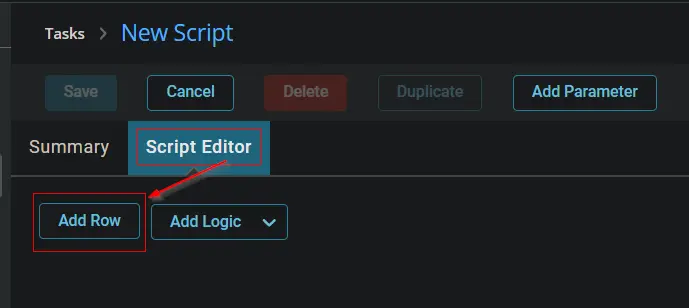
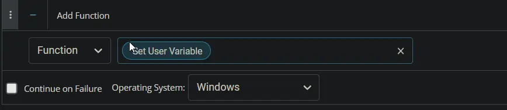
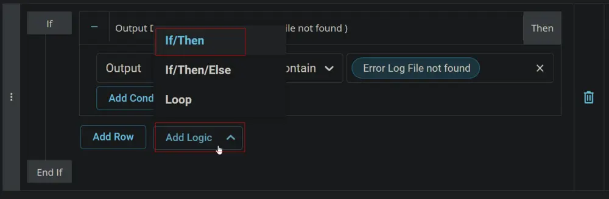
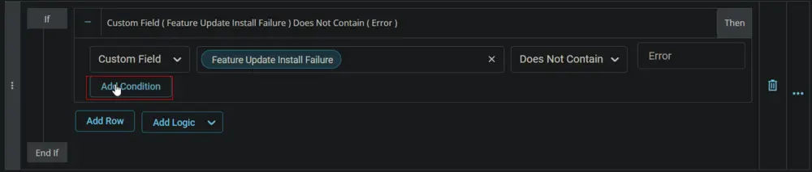
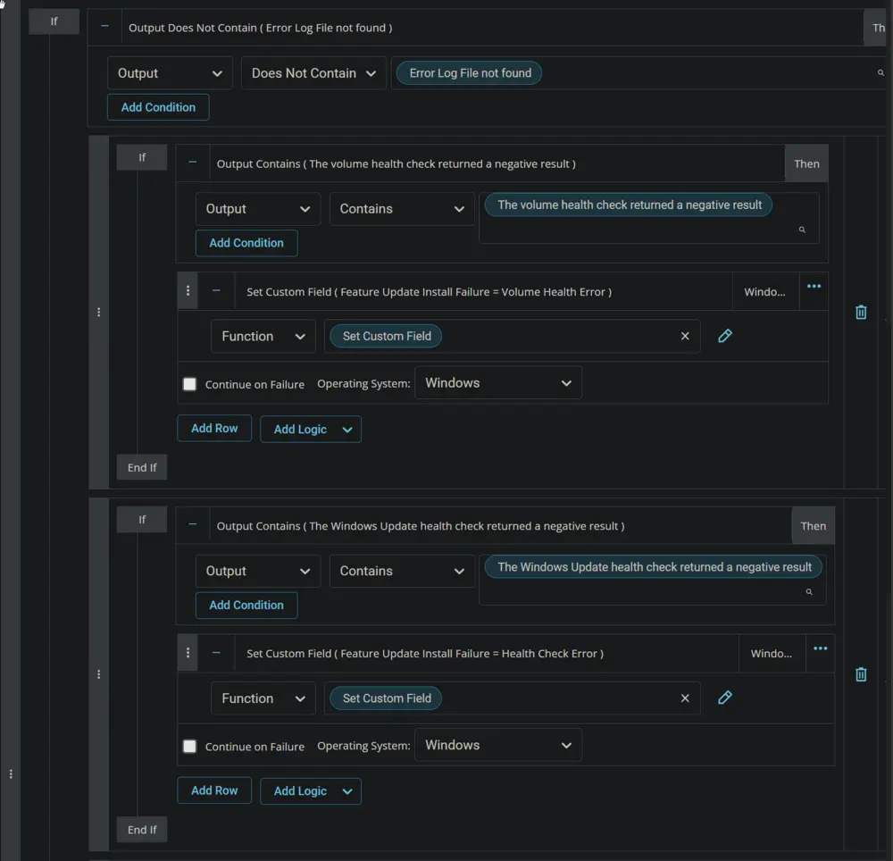

## Summary

The script initiates the latest Feature Update using the Upgrade Assistant and records the attempt in the custom field `WinFeatUpgradeAttempts`. In case of failure, it updates the `Feature Update Install Failure` custom field with the error message. If the upgrade completes without error but a reboot is pending, the `Feature Update Reboot Pending` custom field is updated.

The script compares the current operating system build with the latest available build before and after the upgrade, with the latest build requiring manual entry into the script. For any new releases, the build number must be manually set in the script at step 2 for Windows 11 and step 3 for Windows 10.


**Parameters:**

- **Reboot** - If True: Will reboot the device immediately after the upgrade completes.
- **Reset** - If True: Will reset the tracker counter to 0.

## Sample Run



## Parameters

- Reboot - If True: Will reboot the device immediately after the upgrade completes.
- Reset - If True: Will reset the tracker counter to 0.


## Dependencies

- [CW RMM - Custom Field - WinFeatUpgradeAttempts](/docs/58b312bd-f26c-4b05-ab92-c184520d05de)
- [CW RMM - Custom Field - Feature Update Install Failure](/docs/1c9abaeb-17f0-4a3b-86ee-953b5b713dc3)
- [CW RMM - Custom Field - Feature Update Reboot Pending](/docs/45e14854-ba83-4737-8264-b5cd809fca56)
- [CW RMM - Task - Windows Feature Update Attempt Tracking (Subscript)](/docs/fa4da03b-8c90-4acc-a080-42af8f471a1c)
- [CW RMM - Device Group - Feature Pack Update Automation](/docs/b9c9e1fe-57af-4816-befb-f2701ba009ba)

## Create Script

Create a new `Script Editor` style script in the system to implement this task.


**Name:** `Feature Update Install With Tracking`

**Description:** `Attempts latest Feature Update using the Upgrade Assistant. Tracks attempt into Custom Field WinFeatUpgradeAttempts. Parameters: Reboot - If True: Will reboot the device immediately after the upgrade completes. Reset - If True: Will reset tracker counter to 0.`

**Category:** Patching


### Parameters

Click the `Add Parameter` button.


The `Add New Script Parameter` box will appear.


In the box, fill in the following details and select `Save` to create the `Reboot` parameter.


Add another parameter and fill in the following details to create the `Reset` parameter.


### Script

Start by adding a row. You can do this by clicking the `Add Row` button at the bottom of the script page.



#### Row 1 Function: Script

Choose `Script` from the dropdown menu; by default, it will show `Function`.


Search for the `Windows Feature Update Attempt Tracking (Subscript)` and select it.


**NOTE:** Make sure to select the 'Continue on Failure' checkbox.

#### Row 2 Function: Set User Variable

Insert a new row by clicking the `Add Row` button.


Select `Set User Variable` function.





Type `Win11LatestBuild` in the `Variable Name` field and `10.0.22631` in the `Value` field. `10.0.22631` is the latest available feature build for Windows 11 at the moment. Click `Save` to create the `Win11LatestBuild` variable.


#### Row 3 Function: Set User Variable

Insert a new row by clicking the `Add Row` button.


Select `Set User Variable` function.


Type `Win10LatestBuild` in the `Variable Name` field and `10.0.19045` in the `Value` field. `10.0.19045` is the latest available feature build for Windows 10 at the moment. Click `Save` to create the `Win10LatestBuild` variable.


#### Row 4 Function: PowerShell Script

Insert a new row by clicking the `Add Row` button.


Select `PowerShell Script` function.


Paste in the following PowerShell script, set the expected time of script execution to `300` seconds, and click the `Save` button.

```
$osinfo = Get-CimInstance -ClassName Win32_OperatingSystem
if ( $osinfo.buildnumber -ge '20000' ) { [Version]$osinfo.version -ge [Version]'@Win11LatestBuild@' } else  { [Version]$osinfo.Version -ge [Version]'@Win10LatestBuild@' }
```


Mark the `Continue on Failure` checkbox.


#### Row 5 Logic: If Then

Insert a new `If/Then` logic from the `Add Logic` dropdown menu.


#### Row 5a Condition: Output Contains

Type `True` in the Value box and press `Enter`.


#### Row 5b Function: Script Log

Insert a new row by clicking the `Add Row` button inside the `If Then` logic after the `Output Contains` condition.


Search and select the `Script Log` function in the new row.


Paste this line in the `Script Log Message` box and click the `Save` button.

`The machine has already been updated to the latest feature build available for the operating system.`


#### Row 5c Function: Script Exit

Insert a new row by clicking the `Add Row` button inside the `If Then` logic after the `Script Log` function.


Search and select the `Script Exit` function in the new row.


#### Row 6 Function: PowerShell Script

Insert a new row by clicking the `Add Row` button.


Select `PowerShell Script` function.


Paste in the following PowerShell script, set the expected time of script execution to `7200` seconds, and click the `Save` button.

```
[Net.ServicePointManager]::SecurityProtocol = [enum]::ToObject([Net.SecurityProtocolType], 3072)
$workingpath = "$env:ProgramData/_automation/Script/FeatureUpdate"
$path = "$workingpath/Install-FeatureUpdate.ps1"
$url = 'https://file.provaltech.com/repo/script/Install-FeatureUpdate.ps1'
Remove-Item -Path $workingpath -Recurse -Force -ErrorAction SilentlyContinue | Out-Null
New-Item -Type Directory -Path $WorkingPath -Force -ErrorAction SilentlyContinue | Out-Null 
(New-Object System.Net.WebClient).DownloadFile($url, $path)
& $path
```


Mark the `Continue on Failure` checkbox.


#### Row 7 Function: Script Log

Insert a new row by clicking the `Add Row` button.


Select `Script Log` function.


Paste this line in the `Script Log Message` box and click the `Save` button.

`Script Output: %output%`


#### Row 8 Function: PowerShell Script

Insert a new row by clicking the `Add Row` button.


Select `PowerShell Script` function.


Paste in the following PowerShell script, set the expected time of script execution to `300` seconds, and click the `Save` button.

```
$workingpath = "$env:ProgramData/_automation/Script/FeatureUpdate"
$logpath = "$workingpath/Install-FeatureUpdate-log.txt"
if ( Test-Path $logpath ) {
  Get-Content $logpath
} else {
  return 'Log File not found.'
}
```


Mark the `Continue on Failure` checkbox.


#### Row 9 Function: Script Log

Insert a new row by clicking the `Add Row` button.


Select `Script Log` function.


Paste this line in the `Script Log Message` box and click the `Save` button.

`Log Content: %output%`


#### Row 10 Function: PowerShell Script

Insert a new row by clicking the `Add Row` button.


Select `PowerShell Script` function.


Paste in the following PowerShell script, set the expected time of script execution to `300` seconds, and click the `Save` button.

```
$workingpath = "$env:ProgramData/_automation/Script/FeatureUpdate"
$errorlogpath = "$workingpath/Install-FeatureUpdate-error.txt"
if ( Test-Path $errorlogpath ) {
  Get-Content $errorlogpath
} else {
  return 'Error Log File not found.'
}
```


Mark the `Continue on Failure` checkbox.


#### Row 11 Logic: If Then

Insert a new `If/Then` logic from the `Add Logic` dropdown menu.


#### Row 11a Condition: Output Does Not Contain

In the `Output Contains` condition, select the `Does Not Contain` condition from the drop-down menu, type `Error Log File not found` in the `input value or variable` box, and press `Enter`.


#### Row 11b Logic: If Then

Insert a new `If/Then` logic from the `Add Logic` dropdown menu after the `Output Does Not Contain` condition.



#### Row 11b(i) Condition: Output Contains

In the `Output Contains` condition, type `The volume health check returned a negative result` in the `input value or variable` box and press `Enter`.


#### Row 11b(ii) Function: Set Custom Field

Click the `Add Row` button inside the internal `If Then` logic to add a new function.


Search and select the `Set Custom Field` function.


Search and select the `Feature Update Install Failure` custom field.


Type `Volume Health Error` in the `Value` box and click the `Save` button.


#### Row 11c Logic: If Then

Insert a new `If/Then` logic inside the external `If Then` logic from the `Add Logic` dropdown menu.


#### Row 11c(i) Condition: Output Contains

In the `Output Contains` condition, type `The Windows Update health check returned a negative result` in the `input value or variable` box and press `Enter`.


#### Row 11c(ii) Function: Set Custom Field

Click the `Add Row` button inside the internal `If Then` logic to add a new function.


Search and select the `Set Custom Field` function.


Search and select the `Feature Update Install Failure` custom field.


Type `Health Check Error` in the `Value` box and click the `Save` button.


#### Row 11d Logic: If Then

Insert a new `If/Then` logic inside the external `If Then` logic from the `Add Logic` dropdown menu.


#### Row 11d(i) Condition: Output Contains

In the `Output Contains` condition, type `The Drive Space health check failed` in the `input value or variable` box and press `Enter`.


#### Row 11d(ii) Function: Set Custom Field

Click the `Add Row` button inside the internal `If Then` logic to add a new function.


Search and select the `Set Custom Field` function.


Search and select the `Feature Update Install Failure` custom field.


Type `Low Drive Space Error` in the `Value` box and click the `Save` button.


#### Row 11e Logic: If Then

Insert a new `If/Then` logic inside the external `If Then` logic from the `Add Logic` dropdown menu.


#### Row 11e(i) Condition: Output Contains

In the `Output Contains` condition, type `incompatible with windows 11 upgrade` in the `input value or variable` box and press `Enter`.


#### Row 11e(ii) Function: Set Custom Field

Click the `Add Row` button inside the internal `If Then` logic to add a new function.


Search and select the `Set Custom Field` function.


Search and select the `Feature Update Install Failure` custom field.


Type `Compatibility Check Error` in the `Value` box and click the `Save` button.


#### Row 11f Logic: If Then

Insert a new `If/Then` logic inside the external `If Then` logic from the `Add Logic` dropdown menu.


#### Row 11f(i) Condition: Custom Field Does Not Contain

Select `Custom Field` option from the first dropdown menu of the `output contains` condition.


Search and select the `Feature Update Install Failure` custom field.


Select the `Does Not Contain` condition from the condition's dropdown menu.


Type `Error` in the comparison field.


Add another condition by clicking the `Add Condition` button.



Type `Error Log File not found` in the `Input Value or Variable` box and press `Enter`.


#### Row 11f(ii) Function: Set Custom Field

Click the `Add Row` button inside the internal `If Then` logic to add a new function.


Search and select the `Set Custom Field` function.


Search and select the `Feature Update Install Failure` custom field.


Type `Installation Failure/Error` in the `Value` box and click the `Save` button.


#### Row 11g Function: Script Exit

Click the `Add Row` button inside the external `If Then` logic to add a new function.


Select the `Script Exit` function.


Type `Error Log Content: %Output%` in the Error Message field and click the `Save` button.


This is how Step 11 should look after completion.


### Step 12 Logic: If Then Else

Add a new `If/Then/Else` logic from the Add Logic dropdown menu. **Make sure to not click on the one that is part of row 11.**


### Step 12a Condition: Value Equals

Select `Value` from the first dropdown menu in the `Output Contains` condition.


Type `%reboot%` and press enter in the `Enter Value` field.


Select `Equals` from the condition dropdown menu.


Type `True` and press Enter in the `Input Value or Variable` field.


### Step 12b Function: PowerShell Script

Add a new row in the `If` section by clicking the `Add Row` button.


Search and select the `PowerShell Script` in the newly added row.


Paste in the following PowerShell script, set the expected time of script execution to `300` seconds, and click the `Save` button.

```
shutdown /f /r /t 00
```


Mark the `Continue on Failure` checkbox.


### Step 12c Function: PowerShell Script

Add a new row in the `If` section by clicking the `Add Row` button.


Search and select the `PowerShell Script` in the newly added row.


Paste in the following PowerShell script, set the expected time of script execution to `610` seconds, and click the `Save` button.

```
Start-Sleep 600
```


Mark the `Continue on Failure` checkbox.


### Step 12d Function: PowerShell Script

Add a new row in the `If` section by clicking the `Add Row` button.


Search and select the `PowerShell Script` in the newly added row.


Paste in the following PowerShell script, set the expected time of script execution to `300` seconds, and click the `Save` button.

```
$osinfo = Get-CimInstance -ClassName Win32_OperatingSystem
if ( $osinfo.buildnumber -ge '20000' ) { [Version]$osinfo.version -ge [Version]'@Win11LatestBuild@' } else  { [Version]$osinfo.Version -ge [Version]'@Win10LatestBuild@' }
```


Mark the `Continue on Failure` checkbox.


This is how Step 12 should look after adding the above-mentioned PowerShell script steps.


### Completed Script

**Step 1:**


**Step 2:**

**Step 3:**


**Step 4:**


**Step 5:**


**Step 6:**


**Step 7:**


**Step 8:**


**Step 9:**


**Step 10:**


**Step 11:**




**Step 12:**


## Deployment

- Go to `Automation` > `Tasks.`
- Search for `Feature Update Install with Tracking` Task.
- Select the concerned task.
- Click on the `Schedule` button to schedule the task/script.


This screen will appear.


Click the `Does not repeat` button.


This pop-up box will appear.


Click the `OK` button to run the task once per day.


Select the relevant time to execute the script. It is suggested to run this task after hours.


Leave the parameters as they are unless your requirement is to restart the computer forcefully. Select `True` for the `Reboot` parameter to restart the computer during script run. Be careful with the script run time, especially with the `Reboot` parameter set to `True`.


Search and select the `Feature Pack Update Automation` group in the `Resources`.


Clicking the `Run` button will initiate the schedule.


The task will start appearing in the Scheduled Tasks.


The `Suspend` option can be used to `suspend/stop` the schedule.


## Output

- Script Log
- Custom Field

