## Summary

This script is designed to reboot workstation endpoints based on the custom fields `@WorkstationRebootWindowStart@`, `@WorkstationRebootWindowEnd@`, and `@WorkstationRebootWindowDay@`. If the reboot time does not fall between the defined windows, the reboot will not trigger.

## Sample Run

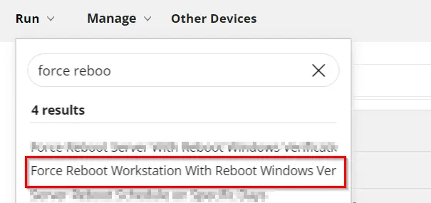

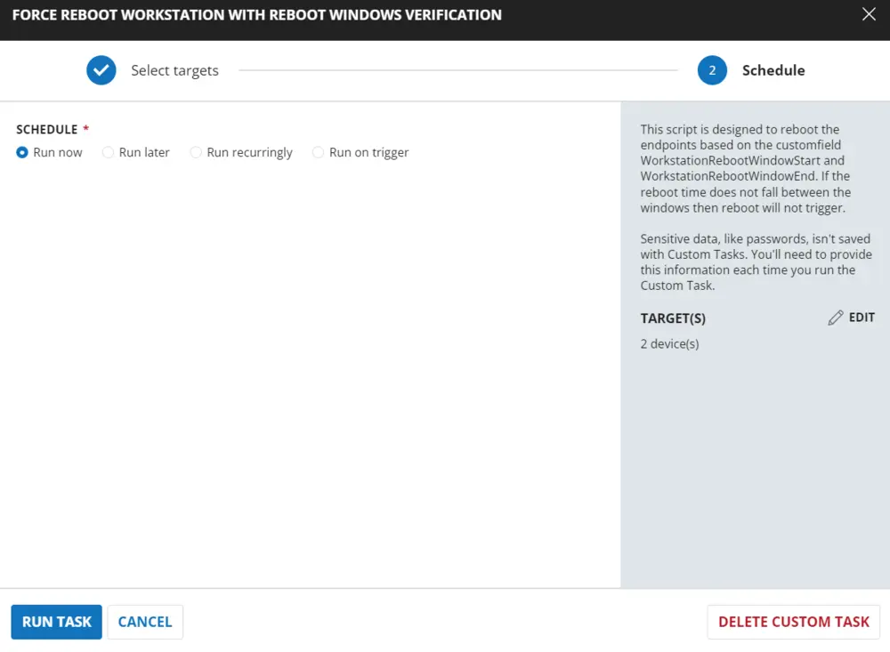

## Dependencies

[CW RMM - Custom Fields - Reboot Trigger/Schedule](/docs/c0aece55-4e18-4914-9e43-965c8c9e23a6)

## Implementation

### Create Task

**Force Reboot Workstation With Reboot Windows Verification:** To implement this script, please create a new "Script Editor" style script in the system.


- **Name:** Force Workstation Server With Reboot Windows Verification
- **Description:** This script is designed to reboot the endpoints based on the custom fields WorkstationRebootWindowStart, WorkstationRebootWindowEnd, and WorkstationRebootWindowDay. If the reboot time does not fall between the windows, the reboot will not trigger.
- **Category:** Maintenance

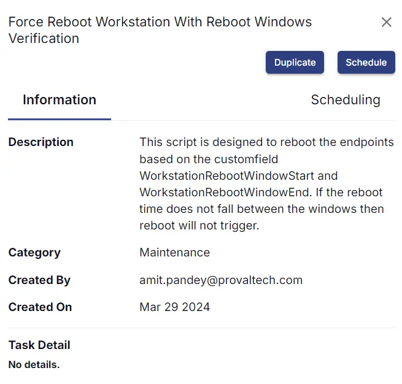

## Script

Start by creating three separate rows. You can do this by clicking the "Add Row" button at the bottom of the script page.


### Row 1: Function: Script Log

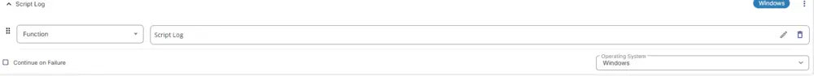

Paste the highlighted text: `Checking OS`

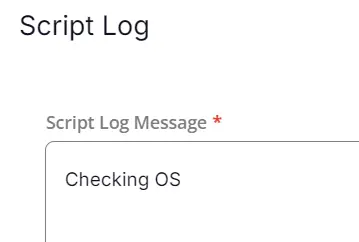

### Row 2: Function: PowerShell Script


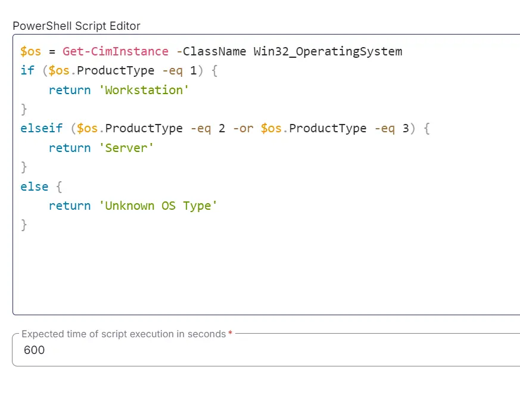

Paste the following PowerShell script and set the expected time of script execution to `600` seconds.

```powershell
$os = Get-CimInstance -ClassName Win32_OperatingSystem
if ($os.ProductType -eq 1) {
    return 'Workstation'
} elseif ($os.ProductType -eq 2 -or $os.ProductType -eq 3) {
    return 'Server'
} else {
    return 'Unknown OS Type'
}
```

### Row 3: Function: Script Log


In the script log message, simply type `%output%` so that the script will send the results of the PowerShell script above to the output on the Automation tab for the target device.


### Row 4: Logic: If/Then


### Row 4a: Condition: Output Contains

In the IF part, enter `Workstation` in the right box of the "Output Does Not Contain" part.

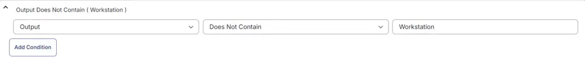

### Row 4b: Function: Script Log


In the script log message, type `The OS detected is confirmed not a Workstation. Please try the script 'Force Reboot Server with Reboot Windows Verification'. Exiting script without any action.` so that the script will send the results of the PowerShell script above to the output on the Automation tab for the target device.

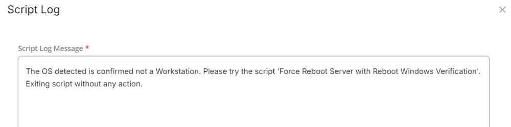

### Row 4c: Function: Script Exit

Add a new row by clicking on the Add row button.

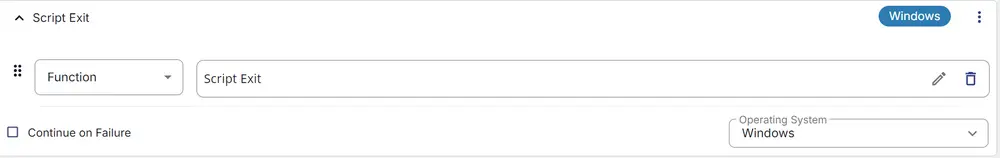

In the script exit message, leave it blank.

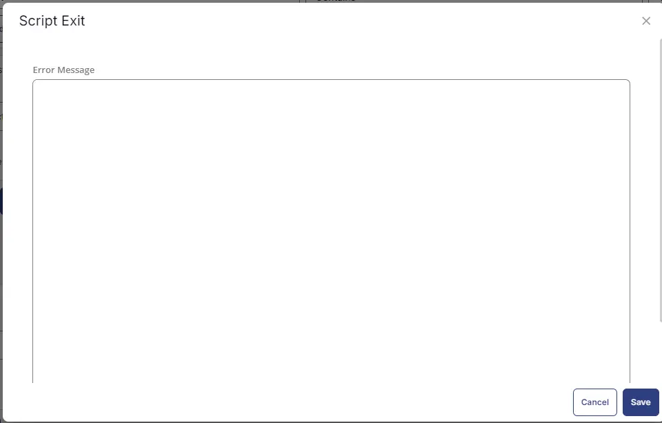

### Row 5: Logic: If/Then


### Row 5a: Condition: Custom Field Equals

In the IF part, enter `true` in the right box of the "Custom Field Equals" part.

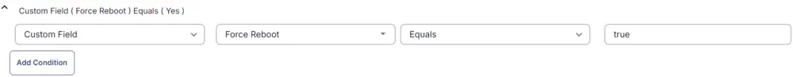

### Row 5b: Function: Script Log


In the script log message, type `Force reboot is allowed on the endpoint. Proceeding for reboot without windows validation.` so that the script will send the results of the PowerShell script above to the output on the Automation tab for the target device.

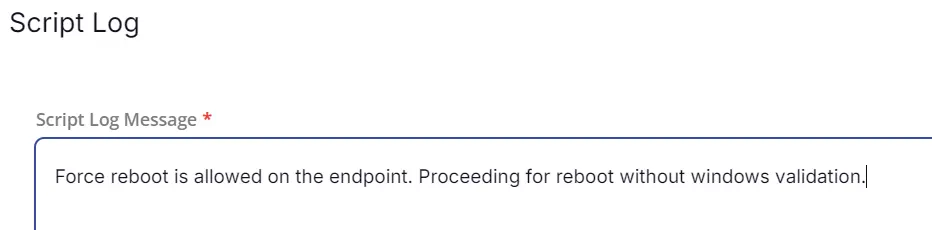

### Row 5c: Function: Command Prompt (CMD) Script

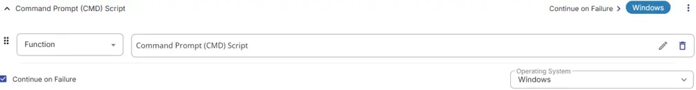

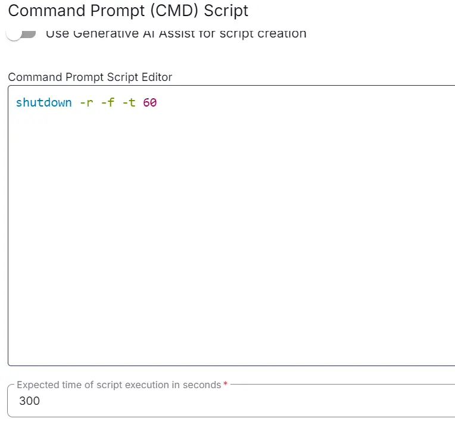

Run it as 'Continue on Failure' and paste.

Paste the following PowerShell script and set the expected time of script execution to `300` seconds.

```powershell
shutdown -r -f -t 60
```

### Row 5d: Function: Script Exit

Add a new row by clicking on the Add row button.


In the script exit message, leave it blank.


### Row 6: Function: Set Pre-defined Variable

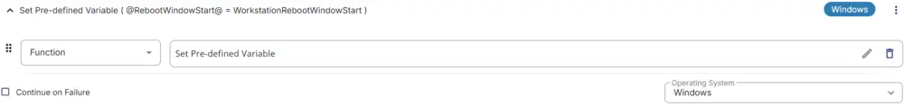

Select the custom field 'WorkstationRebootWindowStart' and set the variable 'RebootWindowStart'.

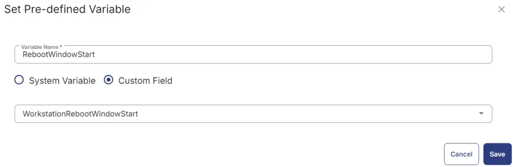

### Row 7: Function: Set Pre-defined Variable

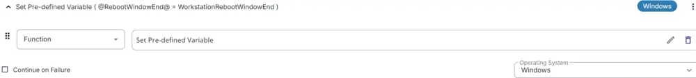

Select the custom field 'WorkstationRebootWindowEnd' and set the variable 'RebootWindowEnd'.

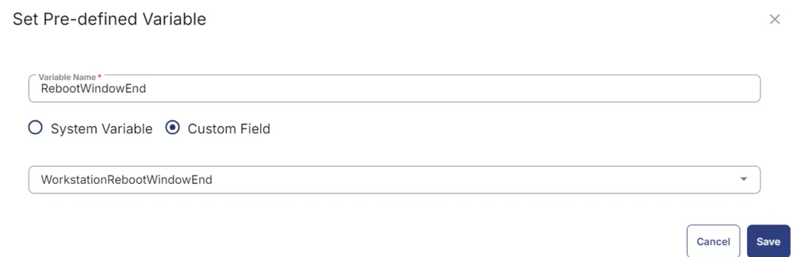

### Row 8: Function: Set Pre-defined Variable

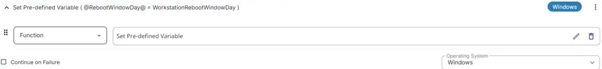

Select the custom field 'WorkstationRebootWindowDay' and set the variable 'RebootWindowDay'.

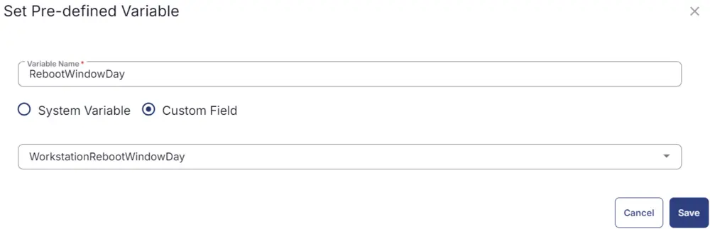

### Row 9: Logic: If/Then


### Row 9a: Condition: Custom Field Equals

In the IF part, enter `true` in the right box of the "Custom Field Equals" part.

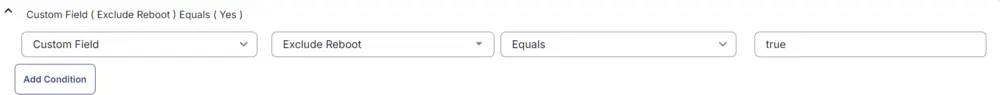

### Row 9b: Function: Script Log


In the script log message, type `This endpoint has 'Exclude Reboot' flag checked. Exiting script without any action.` so that the script will send the results of the PowerShell script above to the output on the Automation tab for the target device.

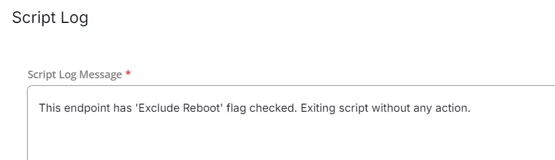

### Row 9c: Function: Script Exit

Add a new row by clicking on the Add row button.


In the script exit message, leave it blank.


### Row 10: Function: Script Log


In the script log message, type `Verifying that machine is in approved window between @RebootWindowStart@ and @RebootWindowEnd@ (Note: 0=12:00 AM, 23=11:00 PM) and Day @RebootWindowDay@.` so that the script will send the results of the PowerShell script above to the output on the Automation tab for the target device.

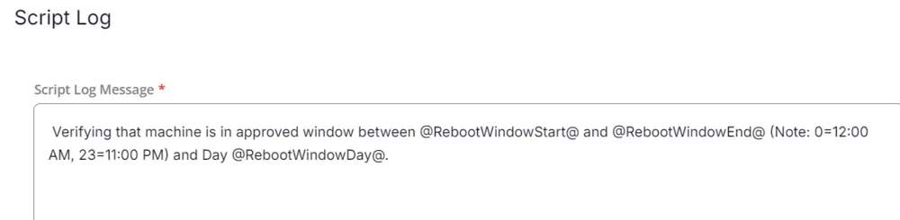

### Row 11: Function: PowerShell Script


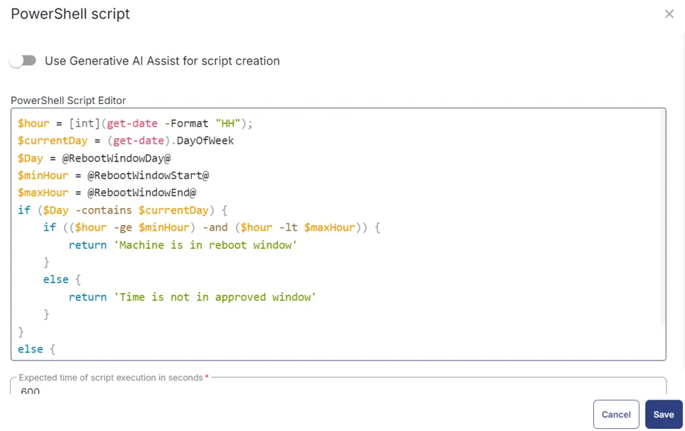

Paste the following PowerShell script and set the expected time of script execution to `600` seconds.

```powershell
$hour = [int](get-date -Format "HH");
$currentDay = (get-date).DayOfWeek
$Day = @RebootWindowDay@
$minHour = @RebootWindowStart@
$maxHour = @RebootWindowEnd@
if ($Day -contains $currentDay) {
    if (($hour -ge $minHour) -and ($hour -lt $maxHour)) {
        return 'Machine is in reboot window'
    }
    else {
        return 'Time is not in approved window'
    }
} else {
    return 'Day is not in approved window'
}
```

### Row 12: Function: Script Log


In the script log message, simply type `%output%` so that the script will send the results of the PowerShell script above to the output on the Automation tab for the target device.


### Row 13: Logic: If/Then


### Row 13a: Condition: Output Contains

In the IF part, enter `Machine is in reboot window` in the right box of the "Output Contains" part.

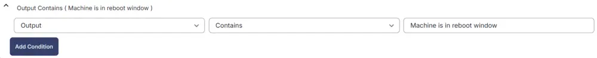

### Row 13b: Function: Script Log


In the script log message, type `Proceeding for the reboot as the reboot falls under the reboot window provided in the script.` so that the script will send the results of the PowerShell script above to the output on the Automation tab for the target device.

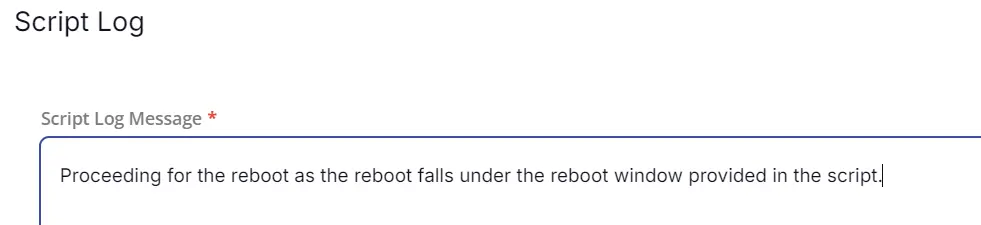

### Row 13c: Function: Command Prompt (CMD) Script


Run it as 'Continue on Failure' and paste.

Paste the following PowerShell script and set the expected time of script execution to `300` seconds.

```powershell
shutdown -r -f -t 60
```

### Row 13d: Function: Script Exit

Add a new row by clicking on the Add row button.


In the script exit message, leave it blank.


### Row 14: Complete

The complete script looks as shown below:

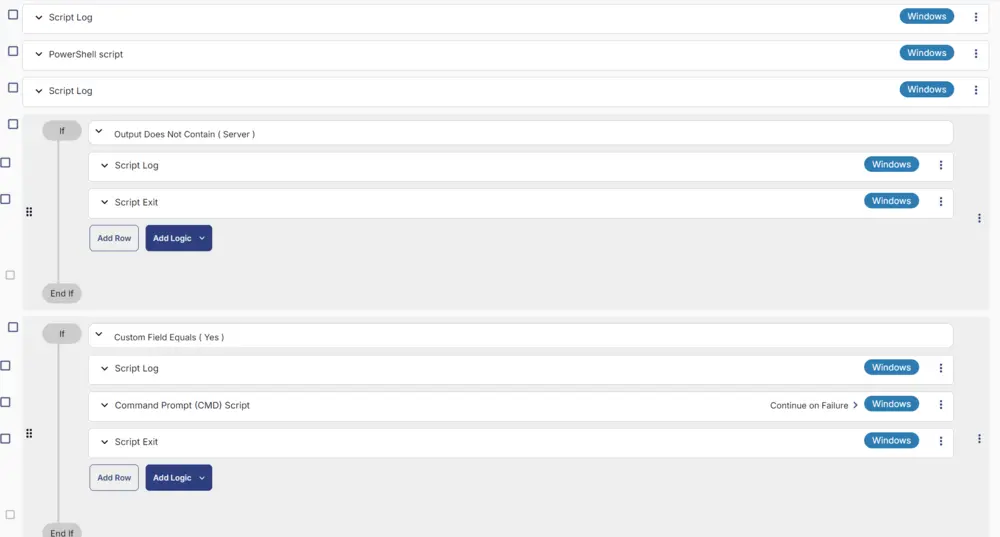

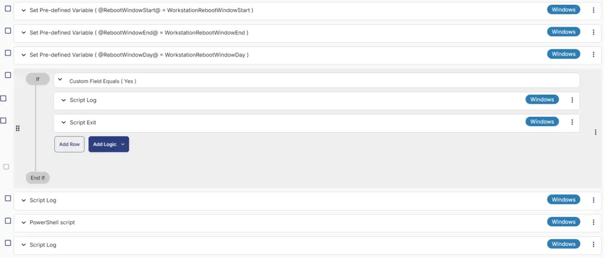

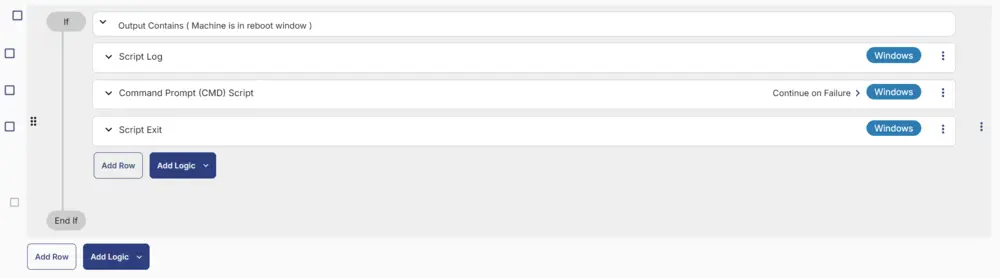

## Deployment

This task can be run manually or in a group. It will only reboot endpoints if the reboot falls under the reboot window provided in the company-level custom fields.

[CW RMM - Custom Fields - Reboot Trigger/Schedule](/docs/c0aece55-4e18-4914-9e43-965c8c9e23a6)

- Go to `Automation` > `Tasks.`
- Search for `Force Reboot Workstation With Reboot Windows Verification` Task.
- Select the concerned task.
- Click on the `Schedule` button to schedule the task/script.

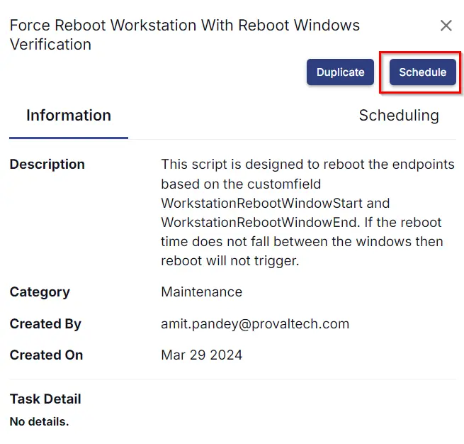

This screen will appear.

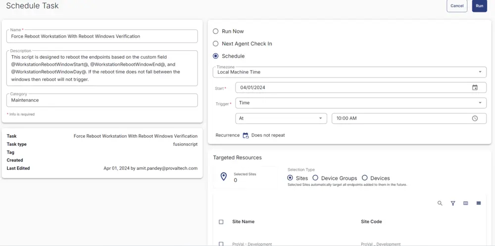

- Select the relevant time to run the script and click the Do not repeat button.

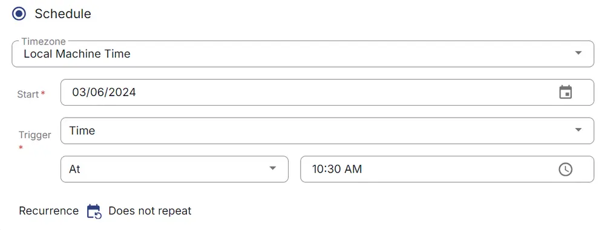

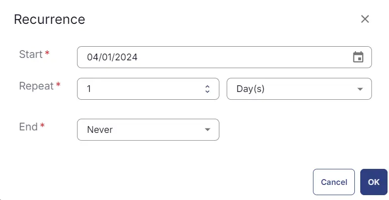

- Select the target to schedule the 'Force Reboot Workstation With Reboot Windows Verification'.


- Now click the `Run` button once all customization is set to initiate the task.

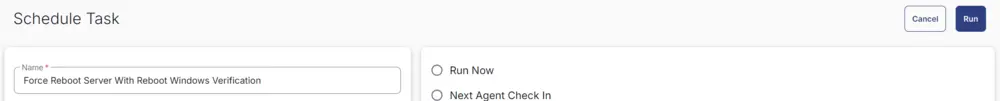

- The task will start appearing in the Scheduled Tasks.

## Output

- Task & Sequences Log

