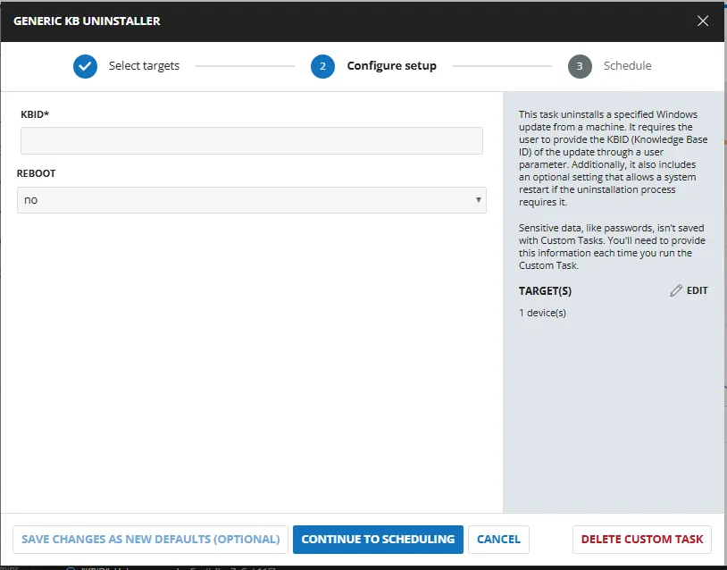
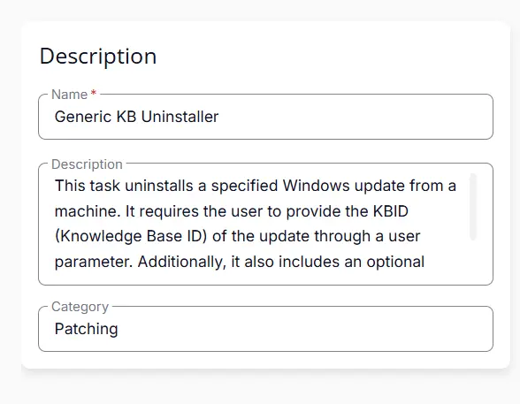
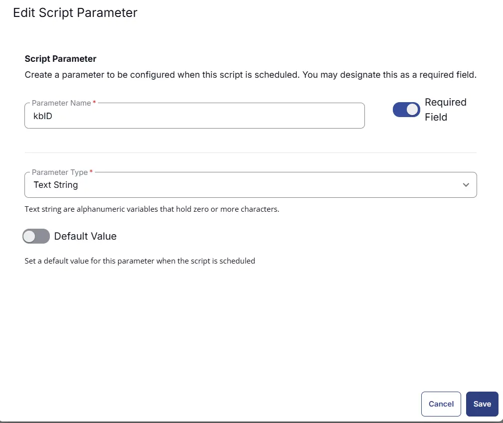
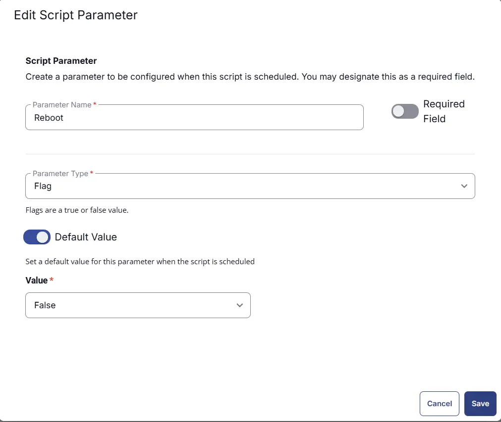
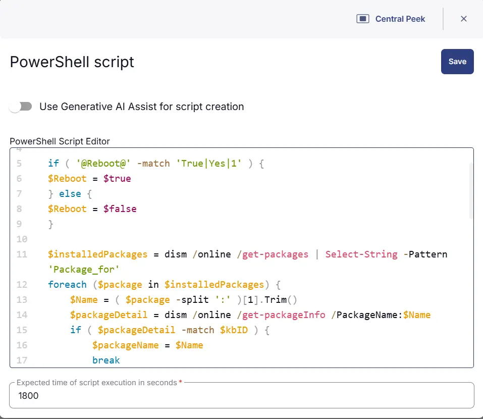
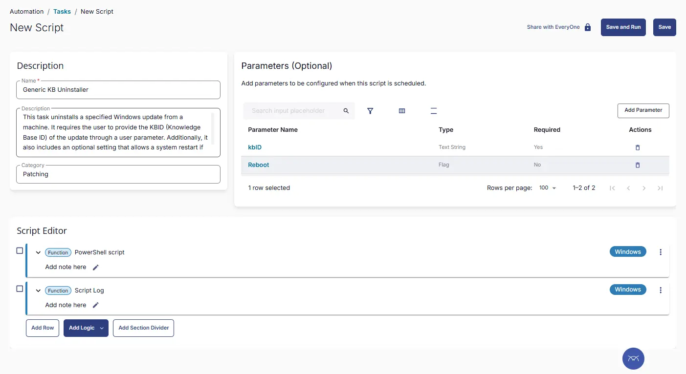

## Summary
This task uninstalls a specified Windows update from a machine. It requires the user to provide the KBID (Knowledge Base ID) of the update through a user parameter. Additionally, it also includes an optional setting that allows a system restart if the uninstallation process requires it.


## Sample Run




## User Parameters

| Name | Example | Required | Default | Type | Description |
| ---- | ------- |  -------- | ------- | ---- | ----------- |
| kbID | 545664 | True | - | String | KBID (Knowledge Base Identifier) of the Windows update to uninstall. |
| Reboot | Yes/No | False | False | String | Select `Yes` to facilitate a system reboot when required. `No` to suppress the reboot. |

## Task Creation

### Script Details

#### Step 1

Navigate to `Automation` ➞ `Tasks`  


#### Step 2

Create a new `Script Editor` style task by choosing the `Script Editor` option from the `Add` dropdown menu  


The `New Script` page will appear on clicking the `Script Editor` button:  


#### Step 3

Fill in the following details in the `Description` section:  

**Name:** `Generic KB Uninstaller`  
**Description:** `This task uninstalls a specified Windows update from a machine. It requires the user to provide the KBID (Knowledge Base ID) of the update through a user parameter. Additionally, it also includes an optional setting that allows a system restart if the uninstallation process requires it.`  
**Category:** `Patching`



### Parameters

Locate the `Add Parameter` button on the right-hand side of the screen and click on it to create a new parameter.  


### kbID:

The `Add New Script Parameter` page will appear on clicking the `Add Parameter` button.  


- Set `kbID` in the `Parameter Name` field.
- Select `Text String` from the `Parameter Type` dropdown menu.
- Enable the `Required Field` button.
- Click the `Save` button.



### Reboot:

The `Add New Script Parameter` page will appear on clicking the `Add Parameter` button.  


- Set `Reboot` in the `Parameter Name` field.
- Select `Flag` from the `Parameter Type` dropdown menu.
- Enable the `Default Value` button.
- Set `False` in the `Value` field.
- Click the `Save` button.




### Script Editor

Click the `Add Row` button in the `Script Editor` section to start creating the script  


A blank function will appear:  


#### Row 1 Function: `PowerShell Script`

Search and select the `PowerShell Script` function.  
 
  

The following function will pop up on the screen:  
  

Paste in the following PowerShell script and set the `Expected time of script execution in seconds` to `1800` seconds. Click the `Save` button.

```powershell
if ( '@kbID@' -match '^[0-9]{4,10}$' ) {
$kbID = '@kbID@'
}

if ( '@Reboot@' -match 'True|Yes|1' ) {
$Reboot = $true
} else {
$Reboot = $false
}

$installedPackages = dism /online /get-packages | Select-String -Pattern 'Package_for'
foreach ($package in $installedPackages) {
    $Name = ( $package -split ':' )[1].Trim()
    $packageDetail = dism /online /get-packageInfo /PackageName:$Name
    if ( $packageDetail -match $kbID ) {
        $packageName = $Name
        break
    }
}


if ($packageName) {
    if ( $Reboot ) {
        dism /Online /Remove-Package /PackageName:$packageName /Quiet
    } else {
        dism /Online /Remove-Package /PackageName:$packageName /Quiet /NoRestart
    }

    $Message = switch ($LASTEXITCODE) {
        0 { '!Information! The operation completed successfully.' }
        2 { '!Error! The system cannot find the file specified.' }
        3 { '!Error! The system cannot find the path specified.' }
        5 { '!Error! Access is denied.' }
        87 { '!Error! The parameter is incorrect.' }
        112 { '!Error! There is not enough space on the disk.' }
        1726 { '!Error! The remote procedure call failed.' }
        3010 { '!Information! The requested operation is successful. Changes will not be effective until the system is rebooted.' }
        16389 { '!Error! An unexpected failure occurred during the operation.' }
        Default { "!Error! An unknown exit code was encountered: $LASTEXITCODE" }
    }

    if ( $Message -match '!Error!' ) {
        throw $Message
    } else { 
        return $Message
    }

} else {
    return 'Package Not Installed'
}
```



### Row 2 Function: Script Log

Add a new row by clicking the `Add Row` button.  
  

A blank function will appear.  
  

Search and select the `Script Log` function.  
  
 

In the script log message, simply type `%output%` and click the `Save` button.  


## Save Task

Click the `Save` button at the top-right corner of the screen to save the script.  


## Completed Task



## Output

- Script Output

## Changelog

- Initial Version