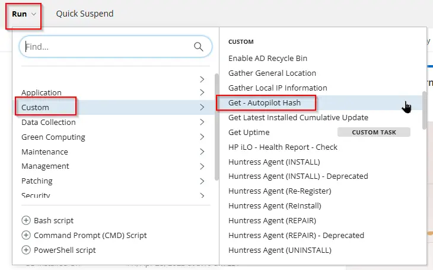
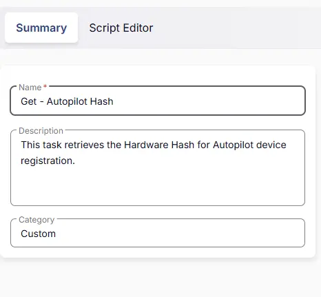
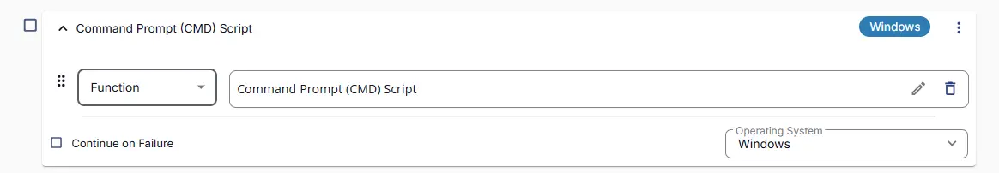
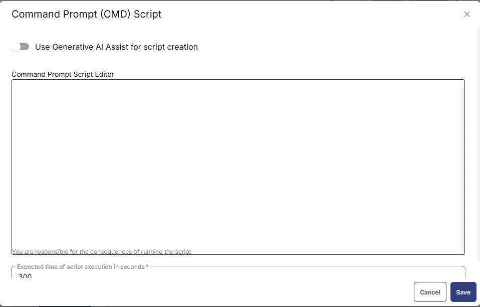
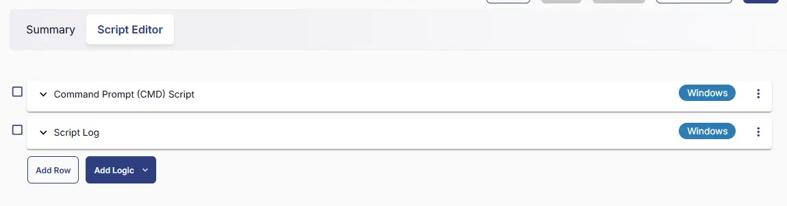

## Summary

This the RMM version of Automate script [Get-AutopilotHash](/docs/9171549a-070a-4346-be90-393416713806). It retrieves the Hardware Hash required for Autopilot device registration.

Note: The Hardware Hash cannot be stored in a custom field due to character limitations. Check the script logs to view the Hash key of a device.

## Sample Run



## Task Creation

Create a new `Script Editor` style script in the system to implement this task.  
  


**Name:** Get - Autopilot Hash
**Description:** This task retrieves the Hardware Hash for Autopilot device registration.
**Category:** Custom  


## Task

Navigate to the Script Editor section and start by adding a row. You can do this by clicking the `Add Row` button at the bottom of the script page.  


A blank function will appear.  


### Row 1 Function: CMD Script

Search and select the `Command Prompt Script` function.  


The following function will pop up on the screen:  


Paste in the following Command and set the expected time of script execution to 300 seconds. Click the `Save` button.

```Shell
C:\Windows\System32\WindowsPowerShell\v1.0\powershell.exe -ExecutionPolicy Bypass -Command "try {$session = New-CimSession;$devDetail = Get-CimInstance -CimSession $session -Namespace root/cimv2/mdm/dmmap -Class MDM_DevDetail_Ext01 -Filter \"InstanceID='Ext' AND ParentID='./DevDetail'\";if ($devDetail) {$hash = $devDetail.DeviceHardwareData } else {$hash = ''};if ($hash -match '^[A-Za-z0-9+/=,.\-\s]+$') {$hash} else { throw 'Failed to fetch Autopilot Hash'}}catch { return 'Failed to fetch Autopilot Hash'}"
```

### Row 2: Function: Script Log

In the script log message, simply type `%output%` so that the script will send the results of the PowerShell script above to the output on the Automation tab for the target device.  


## Completed Task


## Output

- Script Logs