## Summary

The script runs the Crystal Disk Info tool on the end machines and fetches the Disk Health. The data is then formatted and stored in [CW RMM - Custom Field - Crystal Disk Info_Disk Health](/docs/1e713ef3-1378-4601-a00a-c8a8ecd60c01) Custom Field for further auditing and monitoring purposes.

**Output Syntax:** `Harddisk - \\<Model> (Drives: \\<Drive Letter(s)>): Health Status - \\<Status>`

## Sample Run

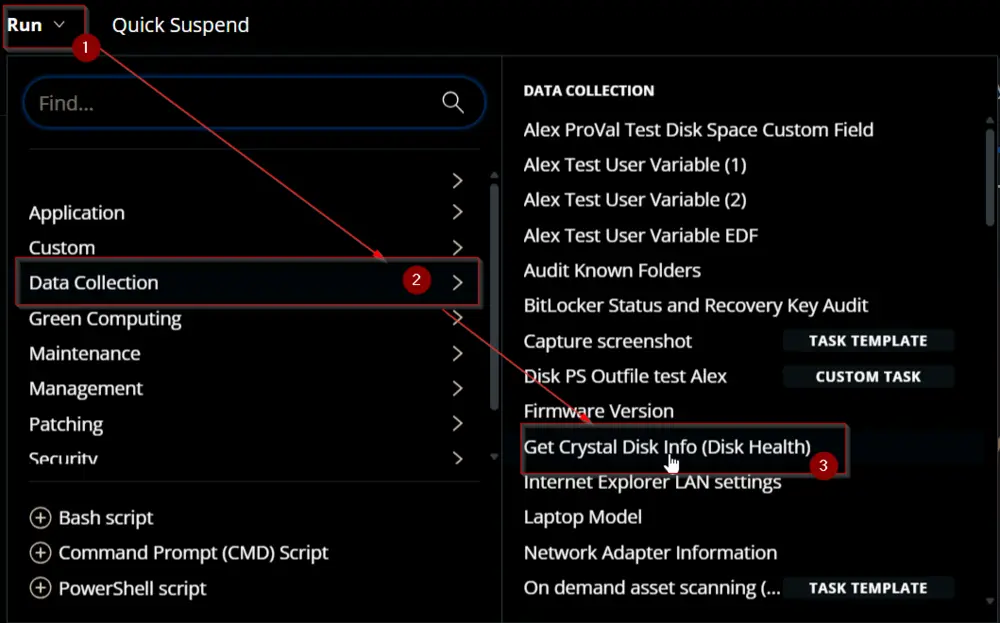  
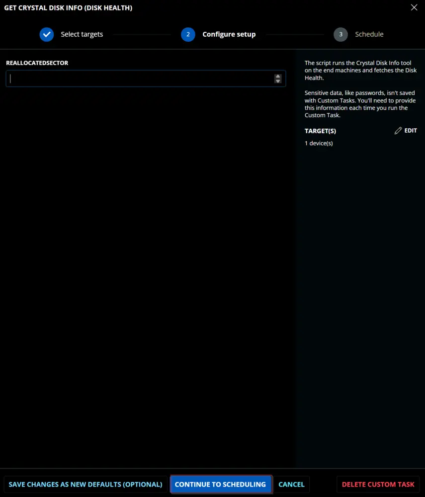  
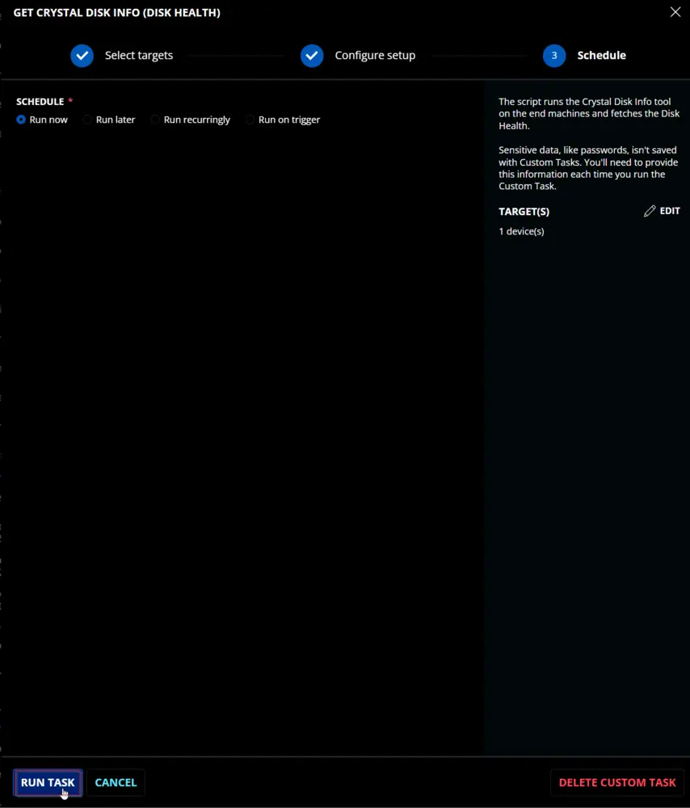  

## Dependencies

- [CW RMM - Custom Field - Crystal Disk Info_Disk Health](/docs/1e713ef3-1378-4601-a00a-c8a8ecd60c01)  
- [EPM - Disk - Agnostic - Get-CrystalDiskInfo](/docs/b08e9cd3-931f-4c70-a084-6193fe3702fb)  

## User Parameters

| Name                | Example | Required | Type          | Description                                                                                                                                          |
|---------------------|---------|----------|---------------|------------------------------------------------------------------------------------------------------------------------------------------------------|
| ReallocatedSector    | 65      | False    | Number Value  | The threshold for the number of reallocated sectors to mark an HDD as `caution` (not applicable to SSDs). The default threshold is 50.            |

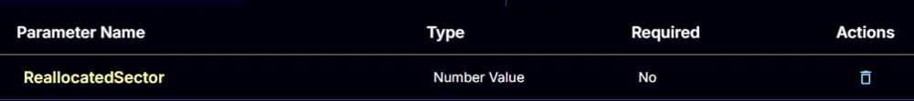

## Task Creation

Create a new `Script Editor` style script in the system to implement this task.

  
  

**Name:** `Get Crystal Disk Info (Disk Health)`  
**Description:** `The script runs the Crystal Disk Info tool on the end machines and fetches the Disk Health.`  
**Category:** `Data Collection`  

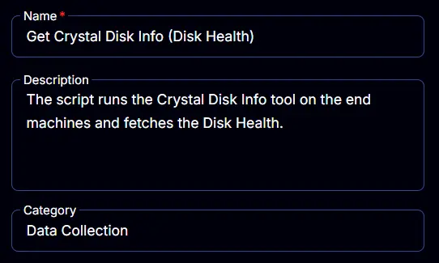

## Parameters

### ReallocatedSector

Add a new parameter by clicking the `Add Parameter` button present at the top-right corner of the screen.

  

This screen will appear.  
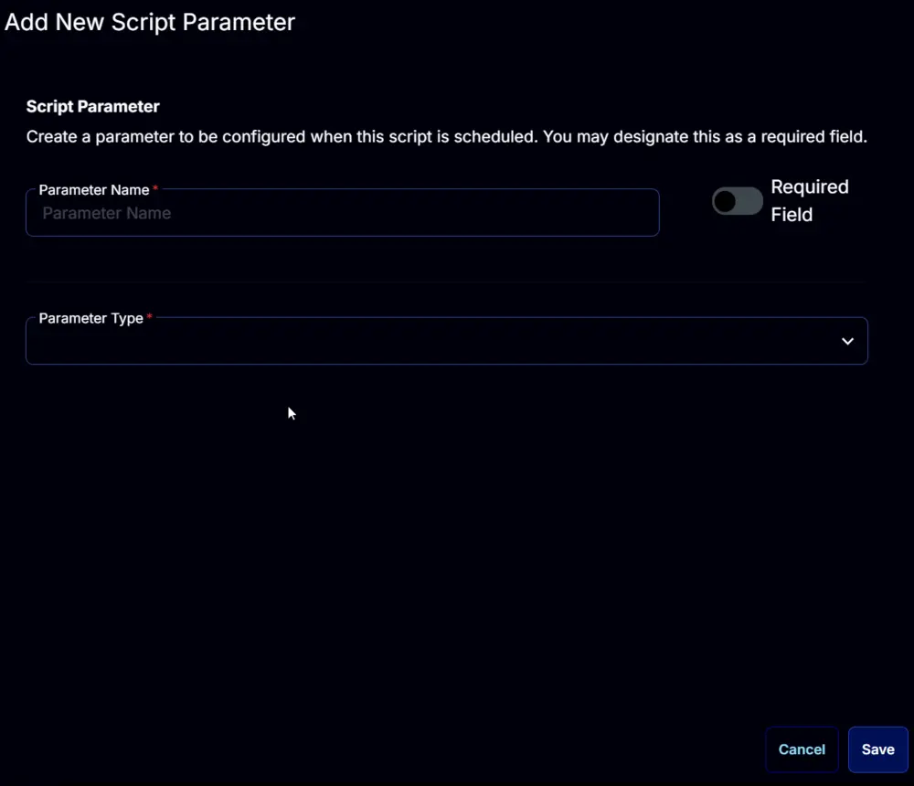  

- Set `ReallocatedSector` in the `Parameter Name` field.
- Select `Number Value` from the `Parameter Type` dropdown menu.
- Click the `Save` button.

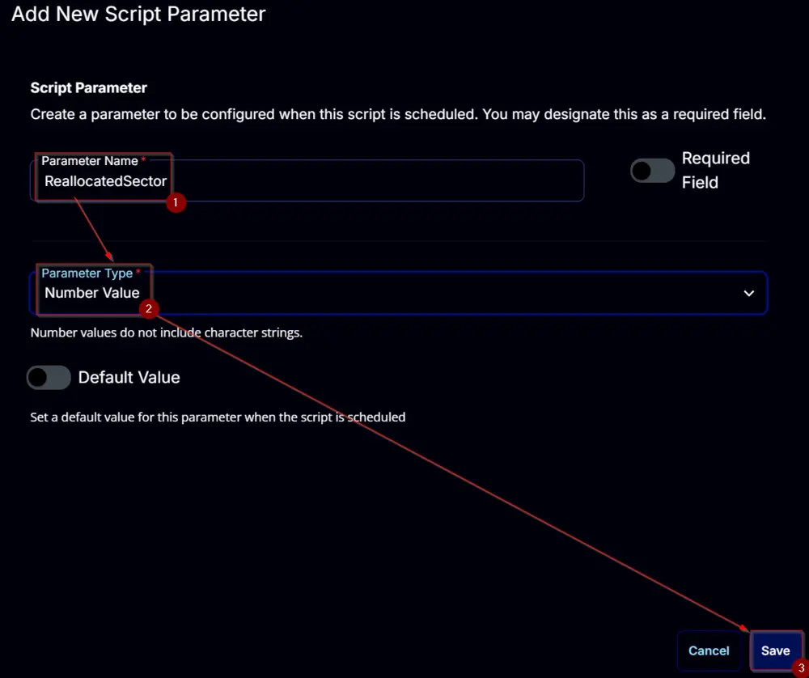

## Task

Navigate to the Script Editor section and start by adding a row. You can do this by clicking the `Add Row` button at the bottom of the script page.

  

A blank function will appear.  
  

### Row 1 Function: PowerShell Script

Search and select the `PowerShell Script` function.  

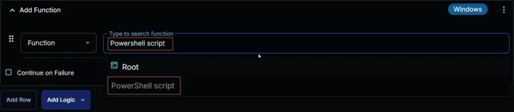  
  

The following function will pop up on the screen:  
  

Paste in the following PowerShell script and set the `Expected time of script execution in seconds` to `300` seconds. Click the `Save` button.

```powershell
$model = (Get-CimInstance -ClassName Win32_ComputerSystem).Model
if ( $model -match 'Virtual|Vmware' ) {
    return 'Virtual Machine - Crystal Disk Not Eligible'
}
#region parameters
$reallocatedSector = '@ReallocatedSector@'
if ( $reallocatedSectors -match '^[0-9]{1,4}$' ) {
    $Parameters = @{
        ReallocatedSector = $reallocatedSector
    }
} elseif ( !((Get-PhysicalDisk).Mediatype -match 'SSD') -and ($reallocatedSectors -notmatch '^[0-9]{1,4}$') ) {
    $Parameters = @{
        ReallocatedSector = 50
    }
}
#region Setup - Variables
$ProjectName = 'Get-CrystalDiskInfo'
[Net.ServicePointManager]::SecurityProtocol = [enum]::ToObject([Net.SecurityProtocolType], 3072)
$BaseURL = 'https://file.provaltech.com/repo'
$PS1URL = "$BaseURL/script/$ProjectName.ps1"
$WorkingDirectory = "C:\ProgramData\_automation\script\$ProjectName"
$PS1Path = "$WorkingDirectory\$ProjectName.ps1"
$WorkingPath = $WorkingDirectory
$LogPath = "$WorkingDirectory\$ProjectName-log.txt"
$ErrorLogPath = "$WorkingDirectory\$ProjectName-Error.txt"
#endregion
#region Setup - Folder Structure
New-Item -Path $WorkingDirectory -ItemType Directory -ErrorAction SilentlyContinue | Out-Null
$response = Invoke-WebRequest -Uri $PS1URL -UseBasicParsing
if (($response.StatusCode -ne 200) -and (!(Test-Path -Path $PS1Path))) {
    throw "No pre-downloaded script exists and the script '$PS1URL' failed to download. Exiting."
} elseif ($response.StatusCode -eq 200) {
    Remove-Item -Path $PS1Path -ErrorAction SilentlyContinue
    [System.IO.File]::WriteAllLines($PS1Path, $response.Content)
}
if (!(Test-Path -Path $PS1Path)) {
    throw 'An error occurred and the script was unable to be downloaded. Exiting.'
}
#endregion
#region Execution
if ($Parameters) {
    $disks = & $PS1Path @Parameters
} else {
    $disks = & $PS1Path
}
#endregion
if ( !(Test-Path $LogPath) ) {
    throw 'PowerShell Failure. A Security application seems to have restricted the execution of the PowerShell Script.'
}
if ( $disks ) {
    $op = @()
    foreach ( $disk in $disks ) {
        $op += "Harddisk - $($disk.Model)$(if($disk.'Drive Letter' -match '[A-z]'){' (Drive Letter: ' + $disk.'Drive Letter' + ')'}): Health Status - $($disk.'Health Status')"
    }
    return $op -join '\|'
}
if ( Test-Path $ErrorLogPath ) {
    $ErrorContent = ( Get-Content -Path $ErrorLogPath )
    throw $ErrorContent
}
```

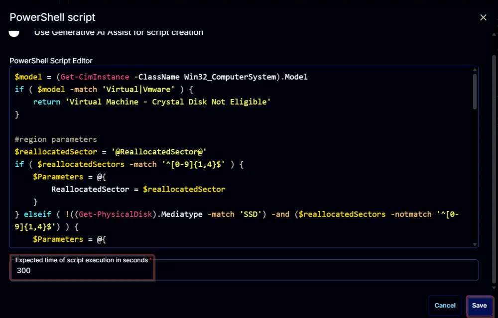  

### Row 2 Function: Script Log

Add a new row by clicking the `Add Row` button.  
  

A blank function will appear.  
  

Search and select the `Script Log` function.  
  
  

The following function will pop up on the screen:  
  

In the script log message, simply type `%output%` and click the `Save` button.  
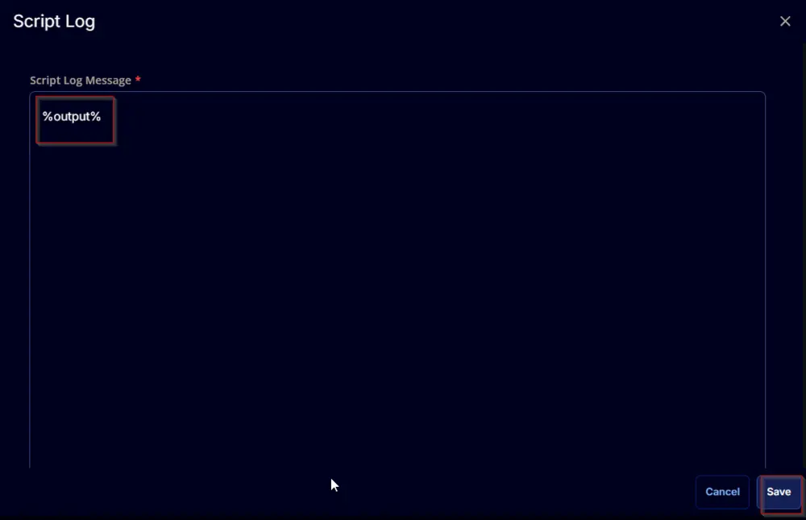  

### Row 3 Function: Set Custom Field

Add a new row by clicking the `Add Row` button.  
  

A blank function will appear.  
  

Search and select the `Set Custom Field` function.  
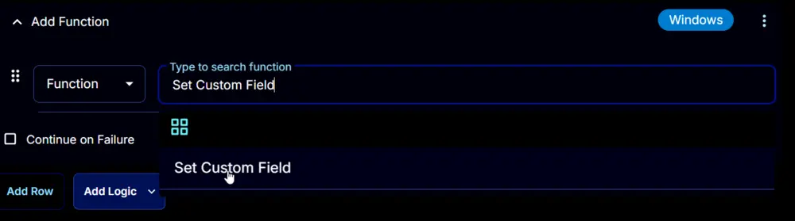  

The following function will pop up on the screen:  
  

- Search and select the Computer-Level Custom Field `Crystal Disk Info_Disk Health` from the Custom Field dropdown menu.
- Set `%Output%` in the `Value` field.
- Click the `Save` button.

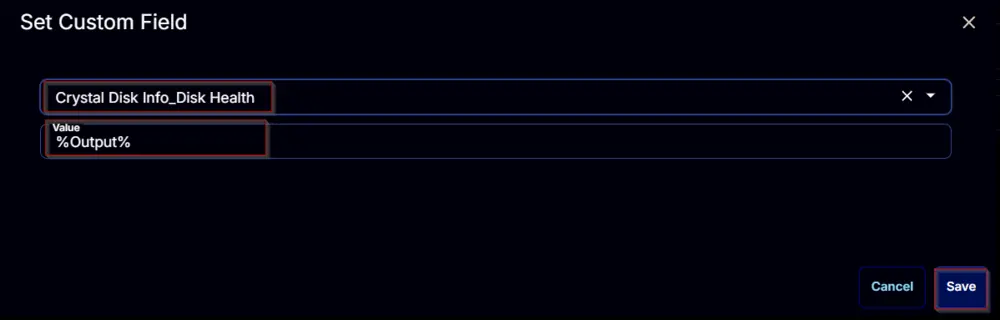  
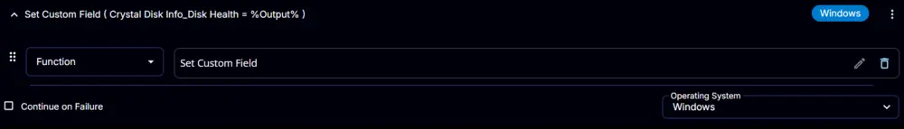  

Click the `Save` button at the top-right corner of the screen to save the script.  
  

## Completed Script

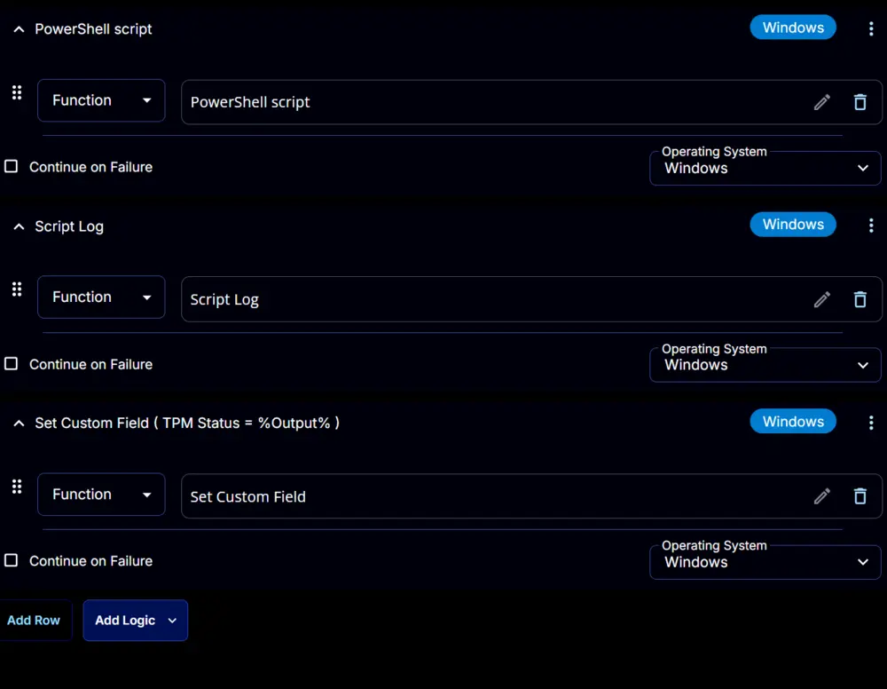  

## Deployment

It is suggested to run the task once per week against Windows computers.

- Go to `Automation` > `Tasks.`
- Search for the `Crystal Disk Info` Task.
- Select the concerned task.
- Click on the `Schedule` button to schedule the task/script.  
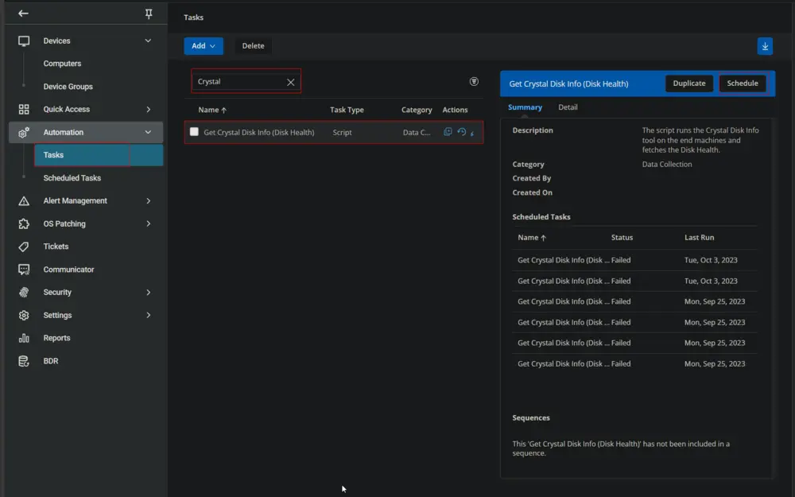  

This screen will appear.  
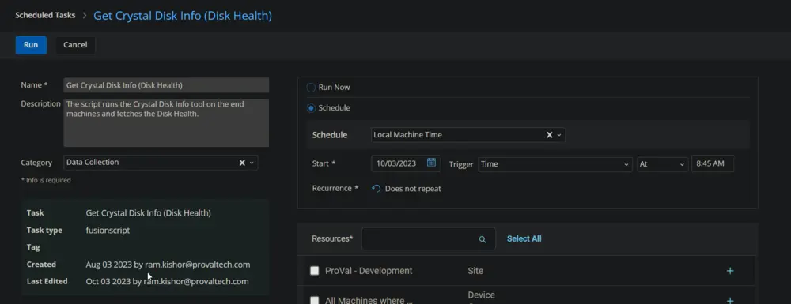  

- Select the relevant time to run the script and click the "Does not repeat" button.  
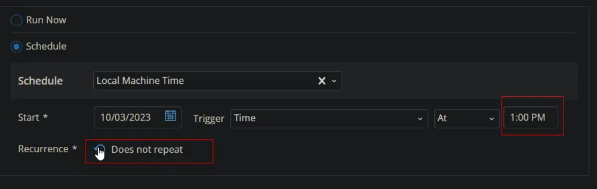  

This pop-up box will appear.  
  

- Change the number of days to `7` and click `OK`.  
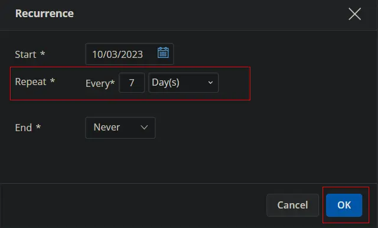  
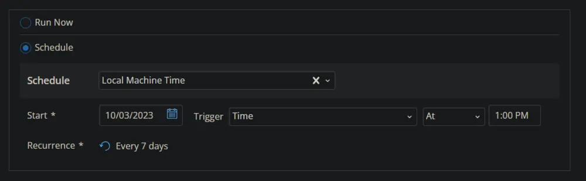  

- Search for `windows` in the `Resources*` and select `Windows Desktops` and `Windows Servers` groups. You can search and select any relevant group you would like to schedule the task against.  
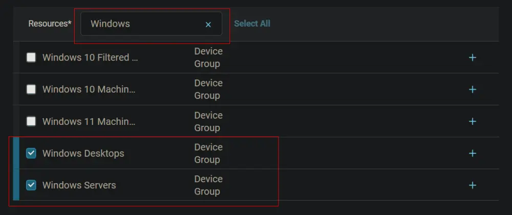  

- Now click the `Run` button to initiate the task.  
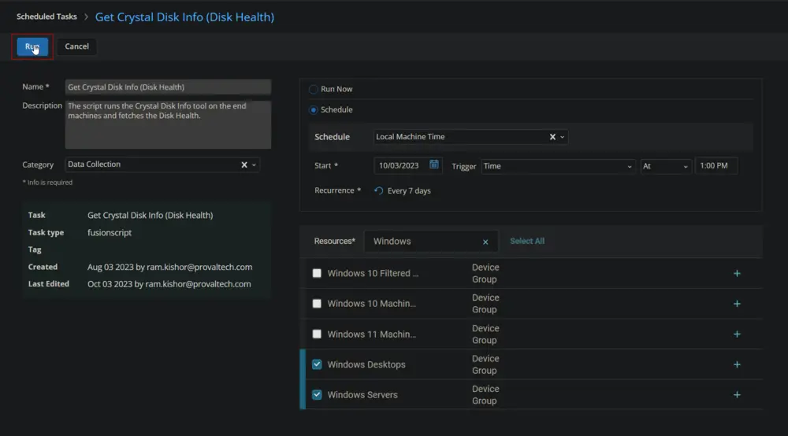  

- The task will start appearing in the Scheduled Tasks.  
  
  

## Output

- Script log  
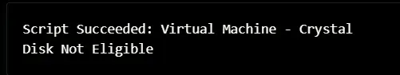  
- Custom Field  
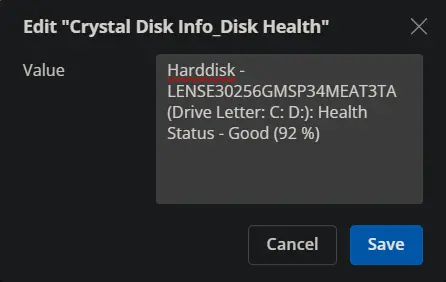  