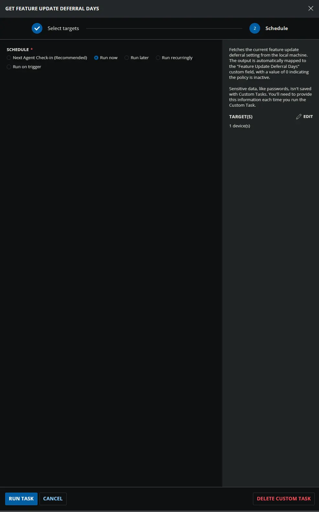
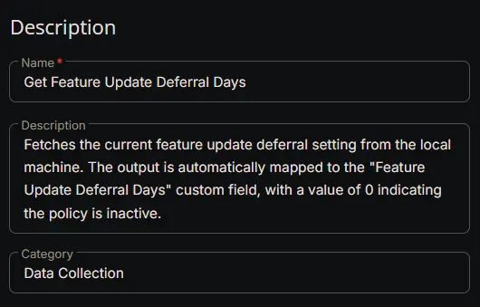
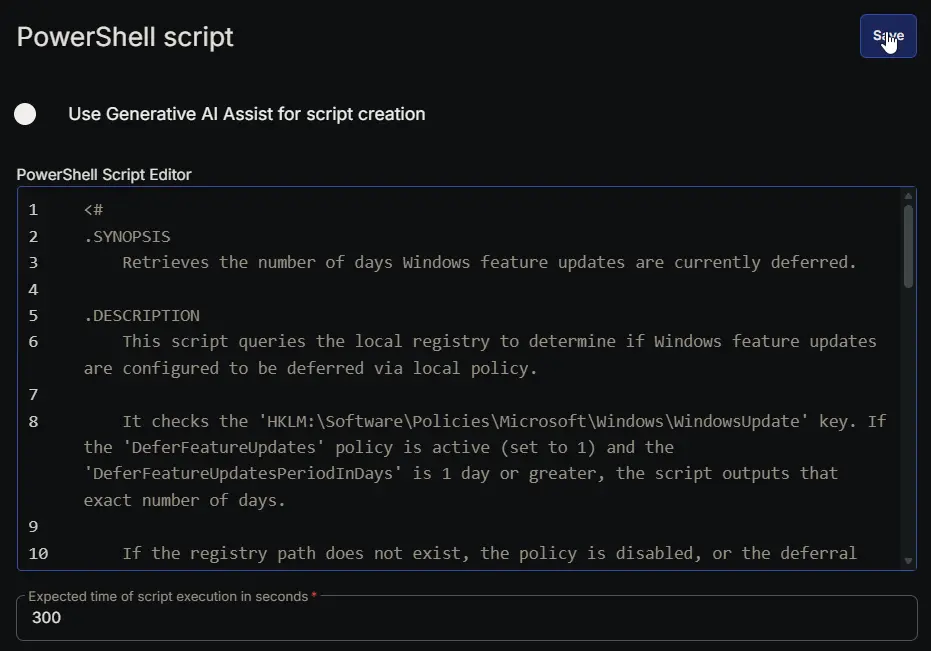
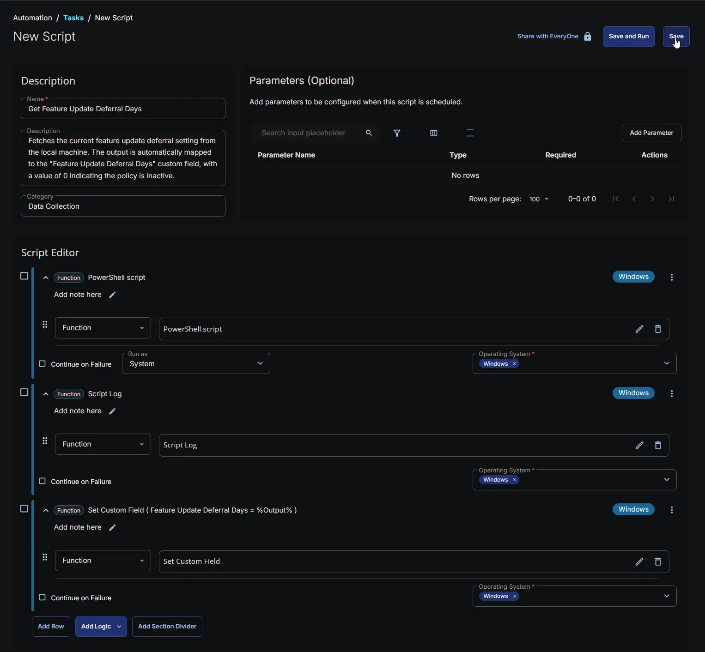
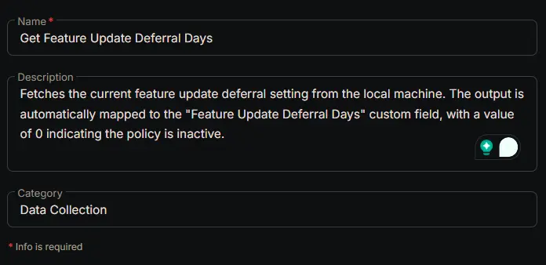
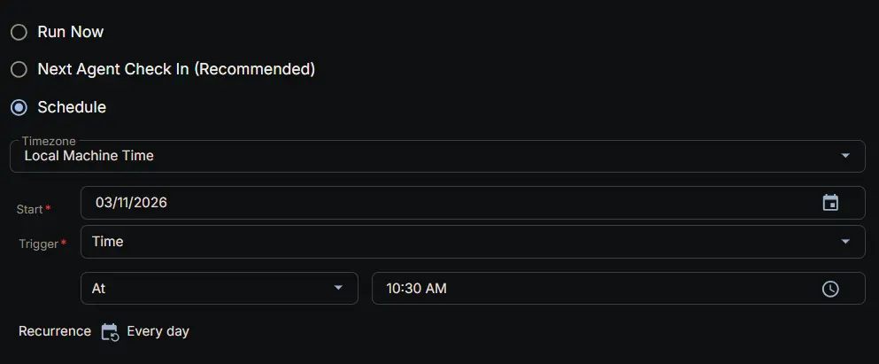
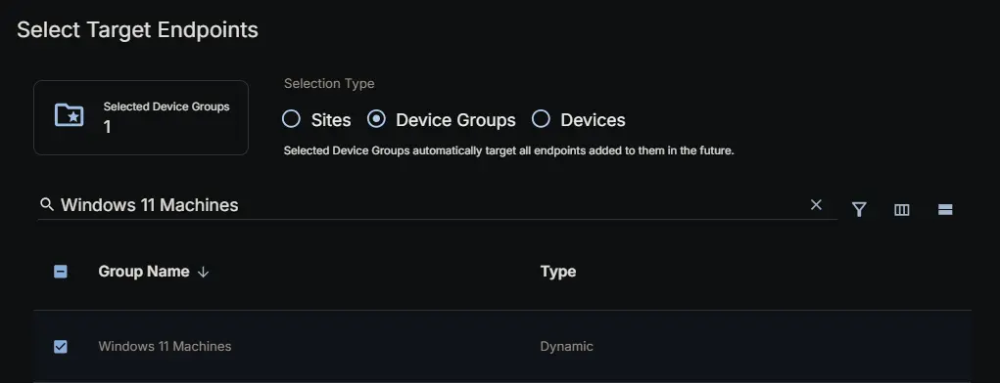
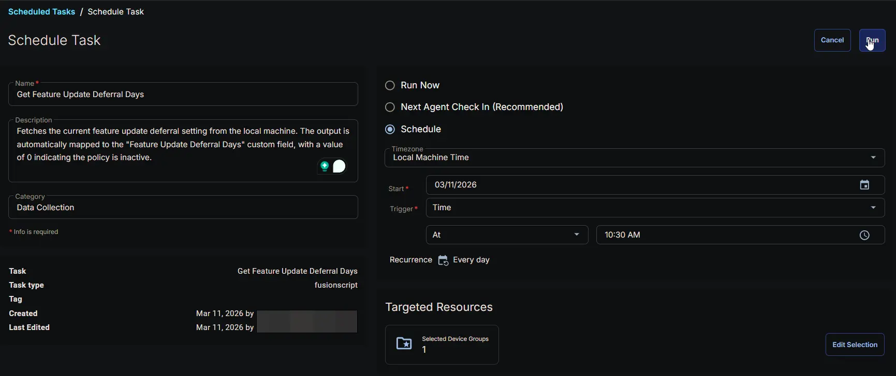

## Summary

Fetches the current feature update deferral setting from the local machine. The output is automatically mapped to the [Feature Update Deferral Days](/docs/c3d64c06-6c83-4d50-b0aa-71ae018d4c22) custom field, with a value of 0 indicating the policy is inactive.

## Sample Run



## Dependencies

- [Custom Field: Feature Update Deferral Days](/docs/c3d64c06-6c83-4d50-b0aa-71ae018d4c22)
- [Dynamic Group: Windows 11](/docs/1e54cc97-a5af-4dc9-9d79-00fd052c8454)
- [Solution: Manage Feature Update Deferral](/docs/800f96cd-5e64-48dd-bb9a-f17822db38e8)

## Custom Fields

| Name                | Example                                   | Level   | Type | Required | Description                                    |
|---------------------|-------------------------------------------|---------|------|----------|------------------------------------------------|
| [Feature Update Deferral Days](/docs/c3d64c06-6c83-4d50-b0aa-71ae018d4c22) | 100 | Endpoint | Text | Yes | Stores the current feature update deferral setting fetched by the script. |

## Task Setup Path

- **Tasks Path:** `AUTOMATION` ➞ `Tasks`  
- **Task Type:** `Script Editor`  

## Task Creation

### Description

- **Name:** `Get Feature Update Deferral Days`  
- **Description:** `Fetches the current feature update deferral setting from the local machine. The output is automatically mapped to the "Feature Update Deferral Days" custom field, with a value of 0 indicating the policy is inactive.`  
- **Category:** `Data Collection`



### Script Editor

#### Row 1: PowerShell script

- **Use Generative AI Assist for script creation:** `False`  
- **Expected time of script execution in seconds:** `300`  
- **Continue on Failure:** `False`  
- **Run as:** `System`  
- **Operating System:** `Windows`  
- **PowerShell Script Editor:**  

```PowerShell
<#
.SYNOPSIS
    Retrieves the number of days Windows feature updates are currently deferred.

.DESCRIPTION
    This script queries the local registry to determine if Windows feature updates are configured to be deferred via local policy.

    It checks the 'HKLM:\Software\Policies\Microsoft\Windows\WindowsUpdate' key. If the 'DeferFeatureUpdates' policy is active (set to 1) and the 'DeferFeatureUpdatesPeriodInDays' is 1 day or greater, the script outputs that exact number of days. 

    If the registry path does not exist, the policy is disabled, or the deferral period is less than 1, the script outputs '0'.

.EXAMPLE
    .\Get-FeatureUpdateDeferral.ps1

    # Expected Output (if updates are deferred by 30 days):
    30

.EXAMPLE
    .\Get-FeatureUpdateDeferral.ps1

    # Expected Output (if deferral is disabled or not configured):
    0

.OUTPUTS
    System.String (via the Information stream)
#>

#region globals
$ProgressPreference = 'SilentlyContinue'
$WarningPreference = 'SilentlyContinue'
$ErrorActionPreference = 'SilentlyContinue'
#endregion

#region variables
$regPath = 'HKLM:\Software\Policies\Microsoft\Windows\WindowsUpdate'
$deferRegName = 'DeferFeatureUpdates'
$deferDaysRegName = 'DeferFeatureUpdatesPeriodInDays'
#endregion

#region main
if (Test-Path -Path $regPath) {
    if ((Get-ItemProperty -Path $regPath -Name $deferRegName).$deferRegName -eq 1) {
        $deferDays = (Get-ItemProperty -Path $regPath -Name $deferDaysRegName).$deferDaysRegName
        if ($deferDays -ge 1) {
            Write-Output -InputObject $deferDays
            return
        }
    }
}
#endregion

Write-Output -InputObject '0'
```



#### Row 2: Script Log

- **Script Log Message:** `%Output%`  
- **Continue on Failure:** `False`  
- **Operating System:** `Windows`


#### Row 3: Set Custom Field

- **Custom Field:** `Feature Update Deferral Days`  
- **Value:** `%Output%`  
- **Continue on Failure:** `False`  
- **Operating System:** `Windows`


## Completed Script



## Output

- Script Log
- Custom Field

## Scheduled Task

### Task Details

- **Name:** `Get Feature Update Deferral Days`  
- **Description:** `Fetches the current feature update deferral setting from the local machine. The output is automatically mapped to the "Feature Update Deferral Days" custom field, with a value of 0 indicating the policy is inactive.`  
- **Category:** `Data Collection`



### Schedule

- **Schedule Type:**  `Schedule`  
- **Timezone:** `Local Machine Time`  
- **Start:** `<Current Date>`  
- **Trigger:** `Time` `At` `<Current Time>`  
- **Recurrence:** `Every day`



### Targeted Resource

**Device Group:** `Windows 11 Machines`



### Completed Scheduled Task



## Changelog

### 2026-03-11

- Initial version of the document
